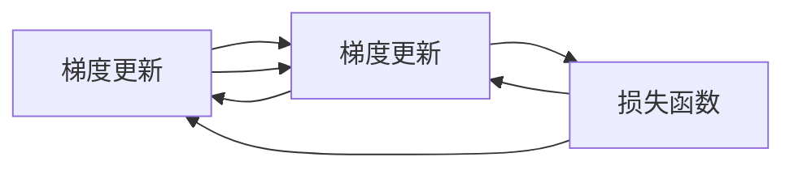

                 

## 1. 背景介绍

### 1.1 问题由来
生成对抗网络（Generative Adversarial Networks，GAN）是一种通过对抗训练生成新样本的学习框架。它由两个神经网络组成：一个生成器（Generator）和一个判别器（Discriminator）。生成器试图生成与真实样本尽可能接近的伪造样本，而判别器则试图区分真实样本与伪造样本。通过两者的对抗训练，生成器逐渐提高生成质量，最终生成与真实样本无法区分的伪造样本。

GAN的提出源于深度学习领域的生成模型研究。在深度学习发展初期，研究者们发现传统的生成模型（如自编码器）在生成样本时，往往缺乏多样性，难以捕捉复杂的模式。GAN通过引入对抗训练的机制，使得生成器不断学习更真实的样本分布，从而解决这一问题。

### 1.2 问题核心关键点
GAN的核心思想是利用对抗训练提升生成器的效果，通过生成器和判别器的相互博弈来优化模型。其关键点在于：

1. 生成器和判别器的对抗性。生成器试图生成假样本，判别器试图区分真实样本与假样本。这种对抗性使得生成器不断提升生成能力，判别器不断提升鉴别能力。
2. 数据的分布匹配。最终的目标是让生成器生成的样本分布与真实样本分布尽可能接近。
3. 样本的多样性。GAN生成的样本应具有多样性，涵盖不同类别、不同风格、不同背景等。
4. 训练的稳定性。GAN训练过程容易出现模式崩溃、震荡等问题，如何稳定训练是一大挑战。

### 1.3 问题研究意义
GAN的提出，开辟了深度学习生成模型的新天地，通过对抗训练机制，生成的样本可以更加真实、多样，具有更强的泛化能力。GAN的应用领域广泛，包括图像生成、视频生成、文本生成等，对人工智能的许多前沿研究产生了深远影响。

## 2. 核心概念与联系

### 2.1 核心概念概述

为更好地理解GAN，本节将介绍几个关键概念：

- **生成器（Generator）**：负责生成伪造样本的神经网络。通过输入噪声向量，生成器能够输出与真实样本类似的伪造样本。
- **判别器（Discriminator）**：负责区分真实样本与伪造样本的神经网络。通过输入样本，判别器能够输出样本为真实样本的概率。
- **对抗训练（Adversarial Training）**：通过生成器和判别器的相互博弈，使得生成器不断提升生成能力，判别器不断提升鉴别能力。

GAN的训练过程可以看作是生成器与判别器的对抗博弈，最终目标是让生成器生成的样本与真实样本无法区分。

### 2.2 核心概念原理和架构的 Mermaid 流程图



### 2.3 核心概念联系

GAN的生成器和判别器通过对抗训练过程相互作用，共同提升生成能力。生成器试图生成更接近真实样本的伪造样本，而判别器则试图更准确地区分真实样本和伪造样本。两者之间的对抗性训练，使得生成器不断优化生成策略，从而提升生成样本的质量。

## 3. 核心算法原理 & 具体操作步骤
### 3.1 算法原理概述

GAN的训练过程基于对抗训练思想，通过生成器和判别器的相互博弈，优化模型参数。具体步骤如下：

1. 生成器根据随机噪声向量生成伪造样本。
2. 判别器对生成器和判别器生成的样本进行判别，输出样本为真实样本的概率。
3. 计算判别器的损失函数，并反向传播更新判别器的参数。
4. 计算生成器的损失函数，并反向传播更新生成器的参数。
5. 交替进行生成器和判别器的参数更新，直至模型收敛。

### 3.2 算法步骤详解

以GAN用于图像生成为例，具体训练步骤如下：

1. 数据准备：准备真实图像数据集。
2. 网络架构设计：设计生成器和判别器的神经网络架构。
3. 损失函数定义：生成器损失函数为判别器无法区分样本的概率，判别器损失函数为生成器生成的样本被正确识别的概率。
4. 优化器选择：一般选择Adam等优化器，并设置合适的学习率。
5. 对抗训练过程：生成器和判别器交替更新参数，优化损失函数。

### 3.3 算法优缺点

GAN的优势在于其生成样本的多样性和高质量，能够生成逼真的、多样性的图像。GAN的训练过程也具有较强的可扩展性，可以应用于不同领域的数据生成。

然而，GAN也存在一些缺点：

1. 训练不稳定。GAN训练过程中容易出现模式崩溃、震荡等问题，需要精心设计训练策略。
2. 样本多样性难以控制。生成器生成的样本往往存在多样性不足的问题。
3. 样本质量难以保证。生成器生成的样本质量受多种因素影响，如噪声向量分布、网络架构等。
4. 计算资源需求高。GAN训练过程中需要大量的计算资源，包括GPU、内存等。

### 3.4 算法应用领域

GAN的应用领域广泛，涵盖图像生成、视频生成、音频生成、文本生成等。以下是一些主要应用场景：

- **图像生成**：生成逼真的图像，如人脸图像、自然景观、艺术作品等。GAN在图像生成领域的研究与应用已经取得了显著成果，广泛应用于游戏、影视、艺术创作等领域。
- **视频生成**：生成逼真的视频，如动态图像、动画等。GAN可以生成高质量的视频片段，为影视制作、虚拟现实等提供支持。
- **音频生成**：生成逼真的音频，如音乐、语音等。GAN在音频生成领域也有一定的应用，可以用于音乐创作、语音合成等。
- **文本生成**：生成逼真的文本，如文章、对话等。GAN在文本生成领域也有应用，可以用于自动写作、对话系统等。

## 4. 数学模型和公式 & 详细讲解 & 举例说明

### 4.1 数学模型构建

GAN的数学模型由生成器和判别器的损失函数构成。设生成器为 $G$，判别器为 $D$，输入噪声向量为 $z$，生成的样本为 $G(z)$，真实样本为 $x$。

生成器损失函数为：

$$
L_G = E_{z}[\log(1-D(G(z)))]
$$

判别器损失函数为：

$$
L_D = E_{x}[\log(D(x))] + E_{z}[\log(1-D(G(z)))]
$$

其中，$E$ 表示期望运算。

### 4.2 公式推导过程

对于生成器，其目标是最小化生成器损失函数 $L_G$，使得判别器无法区分生成器生成的样本和真实样本。

对于判别器，其目标是最小化判别器损失函数 $L_D$，使得判别器能够正确区分生成器生成的样本和真实样本。

通过交替优化生成器和判别器的损失函数，可以训练出高质量的生成器。

### 4.3 案例分析与讲解

以生成逼真人脸图像为例，假设我们有一组真实人脸图像，将其输入判别器 $D$ 进行判别，输出样本为真实样本的概率。同时，生成器 $G$ 根据噪声向量 $z$ 生成一张人脸图像，将其输入判别器 $D$ 进行判别，输出样本为真实样本的概率。通过反复迭代，生成器逐渐提高生成质量，判别器逐渐提高判别能力，最终生成器生成的样本与真实样本无法区分。

## 5. 项目实践：代码实例和详细解释说明
### 5.1 开发环境搭建

在进行GAN项目实践前，我们需要准备好开发环境。以下是使用Python进行TensorFlow开发的环境配置流程：

1. 安装Anaconda：从官网下载并安装Anaconda，用于创建独立的Python环境。

2. 创建并激活虚拟环境：
```bash
conda create -n tensorflow-env python=3.7 
conda activate tensorflow-env
```

3. 安装TensorFlow：从官网获取对应的安装命令，如：
```bash
pip install tensorflow==2.5
```

4. 安装Keras：
```bash
pip install keras
```

5. 安装各类工具包：
```bash
pip install numpy pandas scikit-learn matplotlib tqdm jupyter notebook ipython
```

完成上述步骤后，即可在`tensorflow-env`环境中开始GAN的实践。

### 5.2 源代码详细实现

下面是使用TensorFlow实现GAN生成图像的完整代码实现：

```python
import tensorflow as tf
from tensorflow.keras import layers

# 定义生成器
def make_generator_model():
    model = tf.keras.Sequential()
    model.add(layers.Dense(256, use_bias=False, input_shape=(100,)))
    model.add(layers.BatchNormalization())
    model.add(layers.LeakyReLU())
    model.add(layers.Dropout(0.2))
    model.add(layers.Dense(512))
    model.add(layers.BatchNormalization())
    model.add(layers.LeakyReLU())
    model.add(layers.Dropout(0.2))
    model.add(layers.Dense(1024))
    model.add(layers.BatchNormalization())
    model.add(layers.LeakyReLU())
    model.add(layers.Dropout(0.2))
    model.add(layers.Dense(784, activation='tanh'))
    return model

# 定义判别器
def make_discriminator_model():
    model = tf.keras.Sequential()
    model.add(layers.Flatten(input_shape=(28, 28, 1)))
    model.add(layers.Dense(1024))
    model.add(layers.LeakyReLU())
    model.add(layers.Dropout(0.2))
    model.add(layers.Dense(512))
    model.add(layers.LeakyReLU())
    model.add(layers.Dropout(0.2))
    model.add(layers.Dense(256))
    model.add(layers.LeakyReLU())
    model.add(layers.Dropout(0.2))
    model.add(layers.Dense(1, activation='sigmoid'))
    return model

# 定义GAN模型
def make_gan_model(generator, discriminator):
    model = tf.keras.Sequential()
    model.add(generator)
    model.add(discriminator)
    return model

# 定义损失函数
cross_entropy = tf.keras.losses.BinaryCrossentropy(from_logits=True)

def generator_loss(fake_output):
    return cross_entropy(tf.ones_like(fake_output), fake_output)

def discriminator_loss(real_output, fake_output):
    real_loss = cross_entropy(tf.ones_like(real_output), real_output)
    fake_loss = cross_entropy(tf.zeros_like(fake_output), fake_output)
    return real_loss + fake_loss

# 定义优化器
generator_optimizer = tf.keras.optimizers.Adam(1e-4)
discriminator_optimizer = tf.keras.optimizers.Adam(1e-4)

# 加载数据集
mnist = tf.keras.datasets.mnist
(x_train, y_train), (x_test, y_test) = mnist.load_data()
x_train = x_train / 255.0
x_test = x_test / 255.0

# 定义噪声向量
noise = tf.random.normal([batch_size, 100])

# 定义生成器和判别器模型
generator = make_generator_model()
discriminator = make_discriminator_model()

# 定义GAN模型
gan = make_gan_model(generator, discriminator)

# 训练GAN模型
@tf.function
def train_step(images):
    noise = tf.random.normal([batch_size, 100])
    with tf.GradientTape() as gen_tape, tf.GradientTape() as disc_tape:
        generated_images = generator(noise, training=True)
        real_output = discriminator(images, training=True)
        fake_output = discriminator(generated_images, training=True)
        
        gen_loss = generator_loss(fake_output)
        disc_loss = discriminator_loss(real_output, fake_output)
        
    gradients_of_generator = gen_tape.gradient(gen_loss, generator.trainable_variables)
    gradients_of_discriminator = disc_tape.gradient(disc_loss, discriminator.trainable_variables)
    
    generator_optimizer.apply_gradients(zip(gradients_of_generator, generator.trainable_variables))
    discriminator_optimizer.apply_gradients(zip(gradients_of_discriminator, discriminator.trainable_variables))
    
# 定义测试函数
@tf.function
def test_step(images):
    noise = tf.random.normal([batch_size, 100])
    generated_images = generator(noise, training=False)
    real_output = discriminator(images, training=False)
    fake_output = discriminator(generated_images, training=False)
    return generated_images, real_output, fake_output

# 训练GAN模型
epochs = 50
batch_size = 32
for epoch in range(epochs):
    for batch in x_train:
        train_step(batch)
    
    if epoch % 10 == 0:
        test_images, real_output, fake_output = test_step(x_test)
        print('Epoch %d, Loss: %f' % (epoch, gen_loss.numpy()))

# 生成并展示生成的图像
generated_images = generator(noise, training=False)
plt.imshow(generated_images[0])
plt.show()
```

### 5.3 代码解读与分析

**GAN模型架构设计**：
- 生成器：从噪声向量生成图像，使用多层卷积神经网络（CNN）。
- 判别器：判别真实图像和生成图像，使用多层卷积神经网络（CNN）。
- GAN模型：将生成器和判别器串联起来，形成一个整体。

**损失函数**：
- 生成器损失函数：判别器无法区分生成图像和真实图像的损失。
- 判别器损失函数：真实图像被正确识别和生成图像被正确识别的损失之和。

**训练过程**：
- 使用Adam优化器，交替优化生成器和判别器。
- 使用交叉熵损失函数，训练生成器和判别器。
- 每个epoch内，在训练集上进行一次梯度下降更新。

**测试过程**：
- 使用测试集进行一次前向传播，输出生成图像和判别器输出。

## 6. 实际应用场景
### 6.1 图像生成

GAN在图像生成领域的应用非常广泛，如人脸生成、艺术作品生成、自然景观生成等。GAN可以生成逼真的、多样性的图像，广泛应用于游戏、影视、艺术创作等领域。

**应用实例**：
- 人脸生成：谷歌DeepMind团队开发的DeepGAN可以生成逼真的人脸图像，应用于虚拟现实、电影特效等领域。
- 艺术作品生成：MIT-IBM-Watson AI的艺术生成项目，使用GAN生成高质量的艺术作品，如油画、素描等。
- 自然景观生成：NVIDIA的StyleGAN可以生成逼真的自然景观图像，应用于电影特效、虚拟现实等。

### 6.2 视频生成

GAN也可以应用于视频生成领域，生成逼真的视频片段，如动态图像、动画等。

**应用实例**：
- 动态图像生成：DeepMind团队开发的Progressive Growing GAN可以生成高质量的动态图像，应用于游戏、影视等领域。
- 动画生成：Google的DeepDream GAN可以生成逼真的动画，应用于影视制作、虚拟现实等。

### 6.3 音频生成

GAN在音频生成领域也有一定的应用，可以用于音乐创作、语音合成等。

**应用实例**：
- 音乐创作：DeepMind团队开发的WaveNet使用GAN生成高质量的音频，应用于音乐创作、语音合成等。
- 语音合成：IBM的TTS-2-GAN使用GAN生成逼真的语音，应用于语音识别、智能客服等领域。

### 6.4 文本生成

GAN在文本生成领域也有应用，可以用于自动写作、对话系统等。

**应用实例**：
- 自动写作：Google的GPT-2使用GAN生成高质量的自然语言文本，应用于自动写作、新闻报道等。
- 对话系统：OpenAI的GPT-3使用GAN生成逼真的对话，应用于智能客服、聊天机器人等。

## 7. 工具和资源推荐
### 7.1 学习资源推荐

为了帮助开发者系统掌握GAN的理论基础和实践技巧，这里推荐一些优质的学习资源：

1. **《Generative Adversarial Networks: An Overview》**：深度学习领域的经典论文，详细介绍了GAN的基本原理、算法流程和应用场景。
2. **《Deep Generative Models: Learning Fields, States and Dynamics from Data》**：斯坦福大学开设的深度学习课程，涵盖深度学习中的生成模型，包括GAN在内的多个重要模型。
3. **《The Unreasonable Effectiveness of Generative Adversarial Networks》**：深度学习领域的知名专家Ian Goodfellow撰写的博客，介绍了GAN的原理、应用和未来发展方向。
4. **《Generative Adversarial Networks: Learning, Inference, and Making Sense of It》**：谷歌AI团队开发的GAN教程，详细介绍了GAN的原理、算法和应用场景。
5. **《Generative Adversarial Networks》书籍**：该书系统介绍了GAN的基本原理、算法流程和应用场景，适合深度学习初学者和专业人士阅读。

通过对这些资源的学习实践，相信你一定能够快速掌握GAN的精髓，并用于解决实际的深度学习问题。

### 7.2 开发工具推荐

高效的开发离不开优秀的工具支持。以下是几款用于GAN开发的常用工具：

1. **TensorFlow**：谷歌开源的深度学习框架，提供丰富的深度学习模型和工具支持，支持分布式训练和优化。
2. **PyTorch**：Facebook开源的深度学习框架，提供灵活的动态计算图和自动微分功能，适合研究型项目和教学。
3. **Keras**：谷歌开源的高级神经网络API，支持多种深度学习框架，简单易用，适合快速原型开发。
4. **Torch**：Facebook开源的深度学习框架，提供动态计算图和自动微分功能，支持GPU加速。
5. **MXNet**：亚马逊开源的深度学习框架，提供灵活的深度学习模型和分布式训练支持，适合大规模工业应用。

合理利用这些工具，可以显著提升GAN开发和训练的效率，加快创新迭代的步伐。

### 7.3 相关论文推荐

GAN的提出和发展得益于学界的持续研究。以下是几篇奠基性的相关论文，推荐阅读：

1. **《Generative Adversarial Nets》**：Goodfellow等提出的GAN原始论文，详细介绍了GAN的基本原理和算法流程。
2. **《Improved Techniques for Training GANs》**：Goodfellow等提出的改进GAN训练方法，讨论了GAN训练中的模式崩溃和震荡问题。
3. **《Wasserstein GAN》**：Arjovsky等提出的WGAN，改进了GAN的训练过程，提升了模型稳定性和生成质量。
4. **《Adversarial Generative Models》**：Makhzani等提出的Adversarial Autoencoder，使用GAN训练自编码器，提升了生成器和判别器的稳定性和训练效果。
5. **《The Unreasonable Effectiveness of GANs》**：Ian Goodfellow撰写的博客，介绍了GAN的原理、应用和未来发展方向。

这些论文代表了大GAN的研究进展，通过学习这些前沿成果，可以帮助研究者把握学科前进方向，激发更多的创新灵感。

## 8. 总结：未来发展趋势与挑战
### 8.1 总结

本文对GAN的基本原理和训练过程进行了全面系统的介绍。首先阐述了GAN的训练过程和优化方法，并详细讲解了GAN在图像生成、视频生成、音频生成、文本生成等多个领域的应用。通过本文的系统梳理，可以看到，GAN已经广泛应用于深度学习的各个领域，成为生成模型中的重要成员。

通过本文的系统梳理，可以看到，GAN已经广泛应用于深度学习的各个领域，成为生成模型中的重要成员。未来，随着GAN技术的不断演进，其在更多领域的应用前景将更加广阔，为人工智能技术的深入发展提供新的动力。

### 8.2 未来发展趋势

展望未来，GAN技术将呈现以下几个发展趋势：

1. **生成样本质量提升**：随着生成模型的不断优化，GAN生成的样本质量将不断提高，能够生成更加逼真、多样性的图像、视频、音频等。
2. **生成过程可控性增强**：未来的GAN将具备更加灵活的生成过程控制能力，能够根据输入条件生成特定的样本，如特定风格的图像、特定语气的文本等。
3. **跨模态生成能力提升**：未来的GAN将具备更强的跨模态生成能力，能够同时生成图像、音频、文本等多种类型的样本，应用于多模态应用场景。
4. **训练效率提升**：未来的GAN将具备更高的训练效率，能够在更短的时间内生成高质量的样本，支持大规模部署和应用。
5. **稳定性增强**：未来的GAN将具备更高的训练稳定性，能够避免模式崩溃、震荡等问题，保证模型训练的稳定性。

以上趋势凸显了GAN技术的广阔前景。这些方向的探索发展，必将进一步提升GAN的应用效果，为深度学习研究带来新的突破。

### 8.3 面临的挑战

尽管GAN技术已经取得了瞩目成就，但在迈向更加智能化、普适化应用的过程中，它仍面临着诸多挑战：

1. **模式崩溃和震荡问题**：GAN训练过程中容易出现模式崩溃、震荡等问题，需要精心设计训练策略。
2. **生成样本多样性不足**：GAN生成的样本往往存在多样性不足的问题，需要进一步提升生成器生成多样性样本的能力。
3. **生成样本质量不稳定**：生成器生成的样本质量受多种因素影响，如噪声向量分布、网络架构等，需要进一步提升生成器生成高质量样本的能力。
4. **计算资源需求高**：GAN训练过程中需要大量的计算资源，包括GPU、内存等，需要进一步优化模型结构和算法流程，降低计算资源需求。

### 8.4 研究展望

面对GAN面临的这些挑战，未来的研究需要在以下几个方面寻求新的突破：

1. **模式崩溃和震荡问题的解决**：需要进一步研究GAN训练中的模式崩溃和震荡问题，提出更加稳定和有效的训练策略。
2. **生成样本多样性提升**：需要进一步研究如何提升GAN生成多样性样本的能力，使其能够生成更多样化的样本。
3. **生成样本质量提升**：需要进一步研究如何提升GAN生成高质量样本的能力，使其能够生成更加逼真的样本。
4. **计算资源需求降低**：需要进一步优化GAN模型结构和算法流程，降低计算资源需求，支持大规模部署和应用。

通过这些研究方向的研究，未来的GAN将具备更高的稳定性、多样性、高质量和低资源需求，为人工智能技术的深入发展提供新的动力。

## 9. 附录：常见问题与解答
**Q1：GAN训练过程中容易出现模式崩溃、震荡等问题，如何应对？**

A: 模式崩溃和震荡是GAN训练中常见的问题，可以通过以下方法解决：
1. **学习率调整**：适当减小学习率，避免过拟合和震荡。
2. **噪声向量分布优化**：优化噪声向量的分布，使其更加稳定。
3. **训练稳定性增强**：使用WGAN、WGAN-GP等改进模型，提升训练稳定性。
4. **多尺度训练**：使用多尺度训练策略，避免过拟合和震荡。

**Q2：GAN生成的样本多样性不足，如何解决？**

A: GAN生成的样本多样性不足，可以通过以下方法解决：
1. **生成器架构优化**：优化生成器的架构，引入更多的生成器网络层，提升生成器生成多样性样本的能力。
2. **数据增强**：使用数据增强技术，如旋转、缩放、扰动等，提升数据的多样性，从而提升生成器生成多样性样本的能力。
3. **训练策略改进**：使用改进的训练策略，如多层级训练、多尺度训练等，提升生成器生成多样性样本的能力。

**Q3：GAN生成的样本质量不稳定，如何提高？**

A: GAN生成的样本质量不稳定，可以通过以下方法提高：
1. **噪声向量分布优化**：优化噪声向量的分布，使其更加稳定，从而提高生成器生成高质量样本的能力。
2. **生成器架构优化**：优化生成器的架构，引入更多的生成器网络层，提升生成器生成高质量样本的能力。
3. **训练策略改进**：使用改进的训练策略，如多层级训练、多尺度训练等，提升生成器生成高质量样本的能力。

**Q4：GAN的计算资源需求高，如何降低？**

A: GAN的计算资源需求高，可以通过以下方法降低：
1. **模型结构优化**：优化GAN的模型结构，减少网络层数和参数量，从而降低计算资源需求。
2. **分布式训练**：使用分布式训练策略，利用多个GPU或TPU进行并行训练，降低单个GPU或TPU的计算压力。
3. **模型并行**：使用模型并行策略，将模型拆分为多个子模型，并行训练，降低计算资源需求。
4. **模型压缩**：使用模型压缩技术，如量化、剪枝等，降低模型的计算资源需求。

**Q5：GAN在实际应用中如何评估？**

A: GAN在实际应用中，可以通过以下指标进行评估：
1. **生成样本质量**：使用PSNR、SSIM等指标，评估生成样本与真实样本的质量差异。
2. **生成样本多样性**：使用多样性指数、熵等指标，评估生成样本的多样性。
3. **生成速度**：使用生成时间、推理时间等指标，评估生成样本的速度。
4. **训练稳定性**：使用训练过程中的损失变化、震荡情况等指标，评估训练的稳定性。

通过以上指标的评估，可以全面了解GAN的应用效果，指导模型的优化和改进。

---

作者：禅与计算机程序设计艺术 / Zen and the Art of Computer Programming

