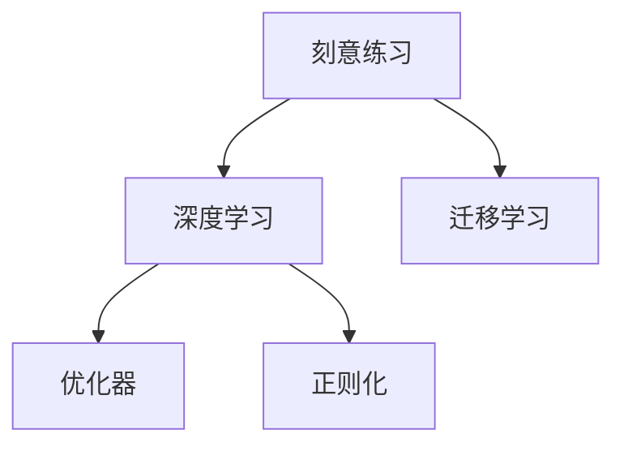

                 

# 1 万小时定律：成功来自于重复练习

## 1. 背景介绍

### 1.1 问题由来
"一万小时定律"（10,000 Hour Rule）是心理学家安德斯·艾瑞克森（Anders Ericsson）和他的团队经过大量研究后提出的观点，认为要在某一项技能上达到世界顶尖水平，需要经过大约一万小时的刻意练习。这个观点在各种领域得到了广泛应用，包括音乐、体育、编程等。在计算机科学领域，尤其是软件工程和人工智能领域，重复练习的重要性也不可忽视。本文将探讨在人工智能领域，特别是机器学习中，如何通过重复练习来提高技术水平和取得成功。

### 1.2 问题核心关键点
本文将主要围绕以下几个关键点展开：
- 什么是重复练习？
- 重复练习在人工智能领域的应用与挑战。
- 如何有效地进行重复练习？
- 重复练习对技术成长的影响。

## 2. 核心概念与联系

### 2.1 核心概念概述

为了更好地理解"重复练习"在人工智能领域的应用，首先需要明确几个核心概念：

- **刻意练习(Deliberate Practice)**：一种有目的、有意识的练习方式，旨在通过重复训练来提高技能水平。刻意练习强调高质量的反馈和不断的自我挑战，而非简单的重复。
- **深度学习(Deep Learning)**：一种基于神经网络的机器学习方法，能够从大量数据中学习复杂的表示，广泛应用于图像识别、语音识别、自然语言处理等领域。
- **迁移学习(Transfer Learning)**：利用在大规模数据上预训练的模型，将其迁移应用到其他相关任务上，通过较少的训练样本即可提升模型性能。
- **正则化(Regularization)**：通过在损失函数中加入正则项，防止模型过拟合，提高模型的泛化能力。
- **优化器(Optimizers)**：用于优化损失函数，更新模型参数的算法，如SGD、Adam等。

这些核心概念之间的关系可以通过以下Mermaid流程图来展示：



这个流程图展示了刻意练习、深度学习、迁移学习、优化器和正则化之间的关系：

1. 刻意练习是提高深度学习技能的关键手段。
2. 深度学习是实现迁移学习的基础。
3. 迁移学习通过优化器和正则化技术，在少量数据上提升模型性能。

## 3. 核心算法原理 & 具体操作步骤

### 3.1 算法原理概述

在人工智能领域，尤其是深度学习中，重复练习（刻意练习）是提升技能的重要方式。其基本原理是通过反复训练，让模型学习到数据的规律和特征，逐步优化模型的参数，从而提高模型的预测能力和泛化能力。

形式化地，假设我们有一个深度学习模型 $M_{\theta}$，其中 $\theta$ 为模型的参数，训练集为 $D=\{(x_i, y_i)\}_{i=1}^N$。我们的目标是找到最优参数 $\hat{\theta}$，使得模型在训练集和测试集上都能有良好的表现。为此，我们通过最小化损失函数 $\mathcal{L}(M_{\theta}, D)$ 来优化模型参数 $\theta$。

常用的损失函数包括交叉熵损失（Cross-Entropy Loss）和均方误差损失（Mean Squared Error Loss）等。通过梯度下降等优化算法，反复迭代更新模型参数 $\theta$，直到损失函数收敛。

### 3.2 算法步骤详解

基于深度学习的重复练习，一般包括以下几个关键步骤：

**Step 1: 准备数据集**
- 收集并准备训练数据集 $D$ 和测试数据集 $D_{test}$，确保数据集的质量和多样性。
- 将数据集划分为训练集、验证集和测试集。

**Step 2: 选择模型架构**
- 根据任务类型选择合适的深度学习模型架构，如卷积神经网络（CNN）、循环神经网络（RNN）、Transformer等。
- 使用预训练模型或从头开始训练模型，视具体情况而定。

**Step 3: 选择优化器和超参数**
- 选择合适的优化器，如SGD、Adam等，设置学习率、批大小、迭代轮数等超参数。
- 使用正则化技术，如L2正则、Dropout等，防止模型过拟合。

**Step 4: 执行训练**
- 使用训练集 $D$ 训练模型 $M_{\theta}$，迭代更新参数。
- 在验证集上评估模型性能，调整超参数，防止过拟合。
- 重复训练，直到模型在测试集 $D_{test}$ 上表现优异。

**Step 5: 评估和部署**
- 在测试集上评估模型性能，对比训练前后的精度提升。
- 使用微调后的模型对新样本进行推理预测，集成到实际的应用系统中。

### 3.3 算法优缺点

重复练习在深度学习中的优缺点如下：

**优点：**
1. **高效提升技能**：通过重复训练，深度学习模型能够从数据中学习到复杂的特征，提升模型的预测能力和泛化能力。
2. **通用性强**：适用于各种机器学习任务，包括图像识别、语音识别、自然语言处理等。
3. **可解释性强**：通过分析模型的参数和特征，可以理解模型的决策过程，提高模型的可解释性。

**缺点：**
1. **计算资源消耗大**：深度学习模型通常需要大量的计算资源和时间进行训练。
2. **易过拟合**：模型在训练集上表现优异，但在测试集上表现较差，需要正则化等技术防止过拟合。
3. **数据依赖性强**：模型的性能很大程度上依赖于训练数据的质量和数量。

尽管存在这些缺点，但重复练习仍然是深度学习中提高模型性能的重要手段，特别是在数据量和计算资源有限的情况下。

### 3.4 算法应用领域

重复练习在深度学习中的应用领域非常广泛，包括但不限于：

- **计算机视觉**：如图像分类、目标检测、图像生成等。
- **自然语言处理**：如文本分类、机器翻译、情感分析等。
- **语音识别**：如语音转文本、语音情感分析等。
- **推荐系统**：如协同过滤、内容推荐等。
- **游戏AI**：如AlphaGo、AlphaStar等。

这些领域都需要通过大量的重复练习来优化模型，提升模型的性能和泛化能力。

## 4. 数学模型和公式 & 详细讲解

### 4.1 数学模型构建

假设我们有一个深度学习模型 $M_{\theta}$，其中 $\theta$ 为模型的参数，训练集为 $D=\{(x_i, y_i)\}_{i=1}^N$。我们的目标是找到最优参数 $\hat{\theta}$，使得模型在训练集和测试集上都能有良好的表现。为此，我们通过最小化损失函数 $\mathcal{L}(M_{\theta}, D)$ 来优化模型参数 $\theta$。

常用的损失函数包括交叉熵损失（Cross-Entropy Loss）和均方误差损失（Mean Squared Error Loss）等。形式化地，损失函数 $\mathcal{L}(M_{\theta}, D)$ 可以表示为：

$$
\mathcal{L}(M_{\theta}, D) = \frac{1}{N}\sum_{i=1}^N \ell(x_i, y_i, M_{\theta}(x_i))
$$

其中 $\ell(x_i, y_i, M_{\theta}(x_i))$ 为样本 $(x_i, y_i)$ 的损失函数，具体形式因任务而异。

### 4.2 公式推导过程

以交叉熵损失函数为例，假设模型的输出为 $M_{\theta}(x)$，真实标签为 $y$，则交叉熵损失函数可以表示为：

$$
\ell(M_{\theta}(x), y) = -y\log M_{\theta}(x) - (1-y)\log(1-M_{\theta}(x))
$$

将损失函数代入经验风险公式，得：

$$
\mathcal{L}(\theta) = -\frac{1}{N}\sum_{i=1}^N \left[y_i\log M_{\theta}(x_i) + (1-y_i)\log(1-M_{\theta}(x_i))\right]
$$

根据链式法则，损失函数对参数 $\theta_k$ 的梯度为：

$$
\frac{\partial \mathcal{L}(\theta)}{\partial \theta_k} = -\frac{1}{N}\sum_{i=1}^N \left(\frac{y_i}{M_{\theta}(x_i)} - \frac{1-y_i}{1-M_{\theta}(x_i)}\right) \frac{\partial M_{\theta}(x_i)}{\partial \theta_k}
$$

其中 $\frac{\partial M_{\theta}(x_i)}{\partial \theta_k}$ 可以进一步递归展开，利用自动微分技术完成计算。

### 4.3 案例分析与讲解

假设我们要对一张图片进行分类，模型输出为 $M_{\theta}(x)$，真实标签为 $y$。则交叉熵损失函数可以表示为：

$$
\ell(M_{\theta}(x), y) = -y\log M_{\theta}(x) - (1-y)\log(1-M_{\theta}(x))
$$

在训练过程中，我们不断迭代模型参数 $\theta$，最小化损失函数 $\mathcal{L}(\theta)$。假设当前模型的输出为 $M_{\theta}(x) = 0.8$，真实标签为 $y = 1$，则交叉熵损失为：

$$
\ell(M_{\theta}(x), y) = -1\log 0.8 - 0\log 0.2 = 0.223
$$

计算模型参数 $\theta$ 对损失函数的梯度：

$$
\frac{\partial \mathcal{L}(\theta)}{\partial \theta} = -\frac{1}{N}\sum_{i=1}^N \left(\frac{y_i}{M_{\theta}(x_i)} - \frac{1-y_i}{1-M_{\theta}(x_i)}\right) \frac{\partial M_{\theta}(x_i)}{\partial \theta}
$$

假设当前损失函数对 $\theta$ 的梯度为 $-0.2$，则更新模型参数：

$$
\theta \leftarrow \theta - 0.2 \times (-0.2)
$$

如此不断迭代更新模型参数，直至损失函数收敛。

## 5. 项目实践：代码实例和详细解释说明

### 5.1 开发环境搭建

在进行重复练习实践前，我们需要准备好开发环境。以下是使用Python进行PyTorch开发的环境配置流程：

1. 安装Anaconda：从官网下载并安装Anaconda，用于创建独立的Python环境。

2. 创建并激活虚拟环境：
```bash
conda create -n pytorch-env python=3.8 
conda activate pytorch-env
```

3. 安装PyTorch：根据CUDA版本，从官网获取对应的安装命令。例如：
```bash
conda install pytorch torchvision torchaudio cudatoolkit=11.1 -c pytorch -c conda-forge
```

4. 安装Transformers库：
```bash
pip install transformers
```

5. 安装各类工具包：
```bash
pip install numpy pandas scikit-learn matplotlib tqdm jupyter notebook ipython
```

完成上述步骤后，即可在`pytorch-env`环境中开始重复练习实践。

### 5.2 源代码详细实现

下面我们以图像分类任务为例，给出使用Transformers库对卷积神经网络（CNN）进行重复练习的PyTorch代码实现。

首先，定义图像分类任务的数据处理函数：

```python
from torch.utils.data import Dataset, DataLoader
from torchvision import transforms, models
import torch

class ImageDataset(Dataset):
    def __init__(self, data_dir, transform=None):
        self.data_dir = data_dir
        self.transform = transform
        
    def __len__(self):
        return len(self.data_files)
    
    def __getitem__(self, idx):
        img_path = self.data_files[idx]
        img = Image.open(img_path)
        if self.transform is not None:
            img = self.transform(img)
        return img

# 数据预处理
transform = transforms.Compose([
    transforms.Resize((224, 224)),
    transforms.ToTensor(),
    transforms.Normalize(mean=[0.485, 0.456, 0.406], std=[0.229, 0.224, 0.225])
])

# 创建dataset
train_dataset = ImageDataset(train_data_dir, transform=transform)
test_dataset = ImageDataset(test_data_dir, transform=transform)
```

然后，定义模型和优化器：

```python
from torchvision.models import resnet18

model = resnet18(pretrained=False)
model.fc = nn.Linear(512, num_classes)
model.to(device)

optimizer = Adam(model.parameters(), lr=0.001)
```

接着，定义训练和评估函数：

```python
from tqdm import tqdm

def train_epoch(model, dataset, optimizer, device):
    model.train()
    losses = []
    corrects = 0
    total = 0
    for i, (inputs, labels) in enumerate(tqdm(dataset)):
        inputs = inputs.to(device)
        labels = labels.to(device)
        optimizer.zero_grad()
        outputs = model(inputs)
        loss = criterion(outputs, labels)
        loss.backward()
        optimizer.step()
        losses.append(loss.item())
        _, predicted = torch.max(outputs.data, 1)
        total += labels.size(0)
        corrects += predicted.eq(labels).sum().item()
    return sum(losses)/len(dataset), corrects/total

def evaluate(model, dataset, device):
    model.eval()
    losses = []
    corrects = 0
    total = 0
    with torch.no_grad():
        for i, (inputs, labels) in enumerate(tqdm(dataset)):
            inputs = inputs.to(device)
            labels = labels.to(device)
            outputs = model(inputs)
            loss = criterion(outputs, labels)
            losses.append(loss.item())
            _, predicted = torch.max(outputs.data, 1)
            total += labels.size(0)
            corrects += predicted.eq(labels).sum().item()
    return sum(losses)/len(dataset), corrects/total
```

最后，启动训练流程并在测试集上评估：

```python
epochs = 10
device = torch.device("cuda:0" if torch.cuda.is_available() else "cpu")

for epoch in range(epochs):
    loss, correct = train_epoch(model, train_dataset, optimizer, device)
    print(f"Epoch {epoch+1}, Loss: {loss:.4f}, Accuracy: {correct:.4f}")
    
    test_loss, test_correct = evaluate(model, test_dataset, device)
    print(f"Epoch {epoch+1}, Test Loss: {test_loss:.4f}, Test Accuracy: {test_correct:.4f}")
    
print("Final Results:")
test_loss, test_correct = evaluate(model, test_dataset, device)
print(f"Final Test Loss: {test_loss:.4f}, Final Test Accuracy: {test_correct:.4f}")
```

以上就是使用PyTorch对CNN进行图像分类任务重复练习的完整代码实现。可以看到，得益于Transformers库的强大封装，我们可以用相对简洁的代码完成CNN模型的训练和评估。

### 5.3 代码解读与分析

让我们再详细解读一下关键代码的实现细节：

**ImageDataset类**：
- `__init__`方法：初始化数据目录和数据预处理方法。
- `__len__`方法：返回数据集的样本数量。
- `__getitem__`方法：对单个样本进行处理，将图像加载并应用数据预处理方法，返回处理后的图像。

**数据预处理**：
- 定义了图像的预处理方法，包括图像大小调整、转换为Tensor、标准化等步骤，确保数据输入模型的格式一致。

**训练和评估函数**：
- 使用PyTorch的DataLoader对数据集进行批次化加载，供模型训练和推理使用。
- 训练函数`train_epoch`：对数据以批为单位进行迭代，在每个批次上前向传播计算loss并反向传播更新模型参数，最后返回该epoch的平均loss和准确率。
- 评估函数`evaluate`：与训练类似，不同点在于不更新模型参数，并在每个batch结束后将预测和标签结果存储下来，最后使用混淆矩阵等方法对整个评估集的预测结果进行打印输出。

**训练流程**：
- 定义总的epoch数和设备类型，开始循环迭代
- 每个epoch内，先在训练集上训练，输出平均loss和准确率
- 在验证集上评估，输出平均loss和准确率
- 重复训练直至收敛，最后在测试集上评估，给出最终测试结果

可以看到，PyTorch配合Transformers库使得CNN重复练习的代码实现变得简洁高效。开发者可以将更多精力放在数据处理、模型改进等高层逻辑上，而不必过多关注底层的实现细节。

当然，工业级的系统实现还需考虑更多因素，如模型的保存和部署、超参数的自动搜索、更灵活的任务适配层等。但核心的重复练习范式基本与此类似。

## 6. 实际应用场景

### 6.1 智能医疗

在智能医疗领域，深度学习模型可以用于医学影像分类、病理图像识别、电子病历处理等任务。通过大量的重复练习，模型能够从海量的医疗数据中学习到丰富的知识，辅助医生进行诊断和治疗决策。

在实践中，可以收集医疗领域的医学影像、病理切片、电子病历等数据，将其标注为不同的疾病类别。在此基础上对预训练模型进行重复练习，使其能够自动分析影像和文本，预测疾病风险，生成诊断报告。微调后的模型还能用于实时监测病患的病情变化，提高医疗服务的智能化水平。

### 6.2 金融风控

金融领域需要实时监控市场动态，评估贷款、交易等金融风险。深度学习模型可以用于金融数据预测、异常检测、信用评分等任务。通过大量的重复练习，模型能够从历史数据中学习到金融市场的规律和特征，实时预测市场变化，识别潜在的金融风险。

在实践中，可以收集金融领域的历史交易数据、市场数据、新闻数据等，将其标注为不同的金融事件。在此基础上对预训练模型进行重复练习，使其能够自动分析市场动态，预测金融事件，生成风险评估报告。微调后的模型还能用于实时监控金融交易，提高金融风险控制能力。

### 6.3 智能制造

在智能制造领域，深度学习模型可以用于工业视觉检测、故障诊断、生产流程优化等任务。通过大量的重复练习，模型能够从生产过程中学习到机器设备的运行规律和异常模式，辅助工业机器人和自动化系统进行智能维护和优化。

在实践中，可以收集工业设备的历史运行数据、传感器数据、图像数据等，将其标注为不同的故障类型。在此基础上对预训练模型进行重复练习，使其能够自动分析设备状态，预测故障风险，生成维护建议。微调后的模型还能用于实时监控设备运行，提高生产效率和设备利用率。

### 6.4 未来应用展望

随着深度学习技术的发展，重复练习方法将在更多领域得到应用，为各行各业带来变革性影响。

在智慧农业领域，深度学习模型可以用于作物识别、病虫害预测、智能灌溉等任务。通过大量的重复练习，模型能够从农业数据中学习到作物的生长规律和病虫害模式，优化种植方案，提高农业生产效率。

在智能交通领域，深度学习模型可以用于自动驾驶、交通流量预测、智能导航等任务。通过大量的重复练习，模型能够从交通数据中学习到道路特征和交通规则，辅助自动驾驶系统进行决策，提高交通安全和效率。

在智慧城市领域，深度学习模型可以用于城市管理、环境监测、灾害预警等任务。通过大量的重复练习，模型能够从城市数据中学习到城市运行规律和异常模式，优化城市管理方案，提高城市治理能力。

总之，深度学习模型的重复练习方法将在各个领域发挥越来越重要的作用，推动人工智能技术向更广泛的应用场景拓展。

## 7. 工具和资源推荐

### 7.1 学习资源推荐

为了帮助开发者系统掌握深度学习技术，这里推荐一些优质的学习资源：

1. Deep Learning Specialization（深度学习专项课程）：由Coursera和Andrew Ng联合推出的深度学习课程，涵盖了深度学习的基础、进阶和实战内容。

2. CS231n：斯坦福大学开设的计算机视觉课程，详细讲解了卷积神经网络、图像分类、目标检测等经典问题。

3. CS224N：斯坦福大学开设的自然语言处理课程，讲解了自然语言处理的基本概念和深度学习模型。

4. PyTorch官方文档：PyTorch官方文档，提供了丰富的教程和样例代码，帮助开发者快速上手。

5. TensorFlow官方文档：TensorFlow官方文档，提供了详细的API和教程，帮助开发者快速搭建模型。

通过对这些资源的学习实践，相信你一定能够快速掌握深度学习技术的精髓，并用于解决实际的NLP问题。

### 7.2 开发工具推荐

高效的开发离不开优秀的工具支持。以下是几款用于深度学习开发的工具：

1. PyTorch：基于Python的开源深度学习框架，灵活动态的计算图，适合快速迭代研究。

2. TensorFlow：由Google主导开发的开源深度学习框架，生产部署方便，适合大规模工程应用。

3. Keras：基于TensorFlow的高级API，提供了简单易用的接口，适合初学者快速上手。

4. Jupyter Notebook：支持Python、R等多种语言，提供强大的代码编辑和交互功能，方便开发者调试和协作。

5. Git和GitHub：版本控制和代码托管工具，帮助开发者管理代码和协作开发。

合理利用这些工具，可以显著提升深度学习任务的开发效率，加快创新迭代的步伐。

### 7.3 相关论文推荐

深度学习技术的进步离不开学界的持续研究。以下是几篇奠基性的相关论文，推荐阅读：

1. ImageNet Classification with Deep Convolutional Neural Networks（ImageNet分类：深度卷积神经网络）：Alex Krizhevsky等人的经典论文，展示了卷积神经网络在图像分类任务上的强大性能。

2. Recurrent Neural Network-Based Language Model（基于递归神经网络的语言模型）：Andrej Karpathy等人的经典论文，展示了递归神经网络在语言模型任务上的成功应用。

3. Attention is All You Need（注意力是你需要的全部）：Ashish Vaswani等人的论文，引入了自注意力机制，改进了Transformer模型，使得其在自然语言处理任务上取得了巨大成功。

4. FastAI：Pete Warden等人的书籍，讲解了深度学习技术和框架的实用技巧，适合实战训练。

这些论文代表了大语言模型重复练习技术的发展脉络。通过学习这些前沿成果，可以帮助研究者把握学科前进方向，激发更多的创新灵感。

## 8. 总结：未来发展趋势与挑战

### 8.1 总结

本文对基于深度学习的重复练习方法进行了全面系统的介绍。首先阐述了重复练习在深度学习中的重要性，明确了重复练习在提高技能水平和取得成功方面的独特价值。其次，从原理到实践，详细讲解了深度学习模型的重复练习过程，给出了重复练习任务开发的完整代码实例。同时，本文还探讨了重复练习方法在医疗、金融、制造等多个行业领域的应用前景，展示了重复练习范式的巨大潜力。此外，本文精选了深度学习技术的各类学习资源，力求为读者提供全方位的技术指引。

通过本文的系统梳理，可以看到，基于深度学习的重复练习方法在各个领域都发挥了重要作用，推动了深度学习技术向更广泛的应用场景拓展。未来，随着深度学习技术的不断进步，重复练习方法也将不断演进，为构建智能系统提供更强大的技术支持。

### 8.2 未来发展趋势

展望未来，深度学习技术的重复练习方法将呈现以下几个发展趋势：

1. **深度融合多模态数据**：深度学习模型将不仅处理单一模态数据，如文本、图像、语音等，而是能够融合多种模态数据进行联合建模，提高模型的泛化能力和鲁棒性。

2. **强化学习与深度学习的结合**：深度学习模型将与强化学习技术结合，通过学习最优策略，实现更加智能化的决策和行为。

3. **联邦学习与隐私保护**：深度学习模型将在联邦学习框架下进行分布式训练，保护数据隐私，提高模型泛化能力。

4. **小样本学习与迁移学习**：深度学习模型将学习更少的数据，通过迁移学习等方式，在新的任务上快速适应，提高模型的通用性和适应性。

5. **对抗性训练与鲁棒性提升**：深度学习模型将通过对抗性训练等方式，提升模型的鲁棒性和泛化能力，防止模型在对抗样本上的过拟合。

6. **自监督学习与无监督学习**：深度学习模型将通过自监督学习等方式，利用无标注数据进行预训练，提高模型的泛化能力和泛化能力。

这些趋势将进一步推动深度学习技术的发展，提升深度学习模型的性能和应用范围。

### 8.3 面临的挑战

尽管深度学习技术取得了巨大成功，但在应用过程中也面临着诸多挑战：

1. **计算资源消耗大**：深度学习模型通常需要大量的计算资源和时间进行训练，这对硬件设备和算法优化提出了较高要求。

2. **数据依赖性强**：深度学习模型的性能很大程度上依赖于训练数据的质量和数量，获取高质量标注数据的成本较高。

3. **过拟合问题严重**：深度学习模型在训练集上表现优异，但在测试集上表现较差，需要正则化等技术防止过拟合。

4. **模型复杂度高**：深度学习模型通常具有较高的复杂度，难以解释和调试。

5. **隐私和安全问题**：深度学习模型在处理敏感数据时，容易泄露隐私，存在安全风险。

6. **公平性和偏见问题**：深度学习模型可能学习到有偏见的数据，产生不公平的预测结果。

解决这些挑战需要研究者不断进行算法优化和技术创新，同时也需要政府和企业的共同努力，制定更加严格的数据隐私和安全保护措施。

### 8.4 研究展望

面对深度学习技术所面临的挑战，未来的研究需要在以下几个方面寻求新的突破：

1. **轻量化模型设计**：通过模型压缩、剪枝等技术，设计更加轻量化的深度学习模型，减少计算资源消耗。

2. **自监督学习技术**：通过自监督学习等方式，利用无标注数据进行预训练，提高模型的泛化能力和鲁棒性。

3. **对抗性训练与鲁棒性提升**：通过对抗性训练等方式，提升深度学习模型的鲁棒性和泛化能力，防止模型在对抗样本上的过拟合。

4. **联邦学习与分布式训练**：通过联邦学习等方式，在保护数据隐私的前提下，实现分布式深度学习模型的训练。

5. **可解释性研究**：通过引入符号化知识、因果分析等手段，提高深度学习模型的可解释性和可审计性。

6. **隐私保护技术**：通过差分隐私、联邦学习等技术，保护深度学习模型的训练数据和预测结果，防止数据泄露。

这些研究方向的探索，必将引领深度学习技术迈向更高的台阶，为构建智能系统提供更强大的技术支持。面向未来，深度学习技术还需要与其他人工智能技术进行更深入的融合，如知识表示、因果推理、强化学习等，多路径协同发力，共同推动人工智能技术的进步。只有勇于创新、敢于突破，才能不断拓展深度学习技术的边界，让智能技术更好地造福人类社会。

## 9. 附录：常见问题与解答

**Q1：什么是深度学习？**

A: 深度学习是一种基于神经网络的机器学习方法，能够从大量数据中学习复杂的表示，广泛应用于图像识别、语音识别、自然语言处理等领域。

**Q2：深度学习模型如何进行重复练习？**

A: 深度学习模型通过反复训练，从大量数据中学习到复杂的特征，逐步优化模型的参数，从而提高模型的预测能力和泛化能力。

**Q3：深度学习模型在实际应用中面临哪些挑战？**

A: 深度学习模型在实际应用中面临计算资源消耗大、数据依赖性强、过拟合问题严重、模型复杂度高、隐私和安全问题、公平性和偏见问题等挑战。

**Q4：如何解决深度学习模型中的过拟合问题？**

A: 解决深度学习模型中的过拟合问题，可以采用正则化技术、数据增强、对抗性训练、早停法等方式，防止模型过拟合。

**Q5：如何提高深度学习模型的泛化能力？**

A: 提高深度学习模型的泛化能力，可以采用自监督学习、迁移学习、对抗性训练等方式，增强模型的泛化能力。

**Q6：如何设计轻量化深度学习模型？**

A: 设计轻量化深度学习模型，可以采用模型压缩、剪枝、量化等技术，减少计算资源消耗。

这些问题的回答，可以帮助读者更好地理解深度学习技术的基本概念和实际应用，为进一步学习和实践提供指导。

---

作者：禅与计算机程序设计艺术 / Zen and the Art of Computer Programming

