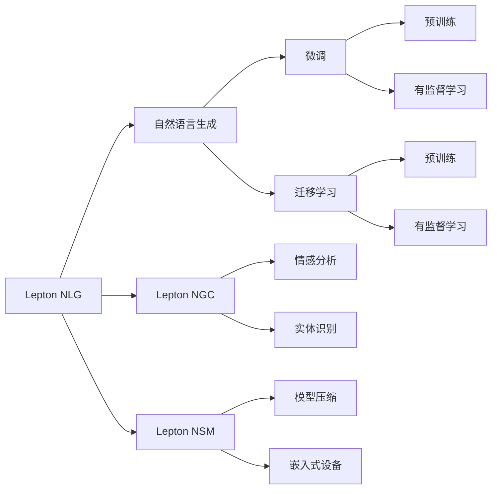

                 

# 与大模型公司的共生：Lepton AI的市场定位

大语言模型（Large Language Models，LLMs）自2018年以来，借助Transformer架构和自监督学习方法的突破，迅速席卷了人工智能领域。从GPT-2到GPT-3，再到ChatGPT的横空出世，LLMs的性能不断提升，应用场景日益丰富，吸引了各大科技巨头的关注和投入。在众多LLM公司中，Lepton AI以其独特的市场定位和创新技术脱颖而出，成为行业内的新星。本文将从Lepton AI的市场定位入手，探讨其如何在大模型市场中寻找自己的位置，并分析其未来的发展趋势和面临的挑战。

## 1. 背景介绍

### 1.1 大语言模型市场概述

当前，大模型市场主要分为两类公司：一类是提供大模型技术服务的公司，如OpenAI、Google Deepmind、Microsoft等；另一类则是基于大模型技术进行应用开发的公司，如书生·浦语、Muse & Cloud、Yingligo等。这些公司各自具有独特的优势和定位，形成了分工明确的生态系统。

- **技术服务型公司**：主要聚焦于大模型的研发和部署，提供算法、硬件、平台等基础设施，同时发布公开API供开发者调用。这些公司通常拥有强大的算法实力和庞大的计算资源，能够快速迭代和优化模型。

- **应用开发型公司**：主要聚焦于大模型的应用开发和落地，提供行业定制化的解决方案。这些公司往往拥有丰富的应用场景和行业经验，能够迅速响应市场需求，推出具有市场竞争力的产品。

### 1.2 Lepton AI的市场定位

Lepton AI正是在这样的背景下诞生，它采用了一种独特的市场定位，即同时具备技术服务和大模型应用的双重能力，旨在成为大模型生态系统中的重要一员。通过整合技术服务和大模型应用的优点，Lepton AI不仅能够提供强大的技术支持，还能开发出具有市场竞争力的产品。

Lepton AI的主要产品包括：
- **Lepton NLG（自然语言生成）**：基于大模型技术，提供智能对话、文本生成、摘要等功能，广泛应用于智能客服、营销自动化、内容创作等领域。
- **Lepton NGC（自然语言计算）**：专注于自然语言处理任务，提供情感分析、实体识别、关系抽取等功能，广泛应用于舆情监测、金融风控、医疗信息分析等场景。
- **Lepton NSM（自然语言模型）**：开发一系列高效、轻量级的自然语言模型，适合在嵌入式设备、移动应用等资源有限的环境中使用。

## 2. 核心概念与联系

### 2.1 核心概念概述

大语言模型（Large Language Models，LLMs）：以自回归（如GPT）或自编码（如BERT）模型为代表，通过在大规模无标签文本数据上进行预训练，学习通用的语言知识和常识，具备强大的语言理解和生成能力。

预训练（Pre-training）：指在大规模无标签文本语料上，通过自监督学习任务训练通用语言模型的过程。常见的预训练任务包括掩码语言模型、句子相似度等。

微调（Fine-tuning）：指在预训练模型的基础上，使用下游任务的少量标注数据，通过有监督学习优化模型在特定任务上的性能。

迁移学习（Transfer Learning）：指将一个领域学习到的知识，迁移到另一个不同但相关的领域的学习范式。大模型的预训练-微调过程即是一种典型的迁移学习方式。

自然语言生成（Natural Language Generation，NLG）：指利用大语言模型，自动生成符合语法和语义规范的自然语言文本。

自然语言计算（Natural Language Calculation，NGC）：指利用自然语言处理技术，从文本中提取结构化信息，用于决策、分析、推理等计算任务。

自然语言模型（Natural Language Model，NSM）：指基于深度学习技术，构建能够理解和生成自然语言的模型，如BERT、GPT等。

### 2.2 核心概念联系

大语言模型（LLMs）、预训练、微调和迁移学习是紧密联系的四个核心概念。预训练是基础，通过大规模无标签数据学习通用的语言表示；微调是手段，利用少量标注数据优化模型在特定任务上的性能；迁移学习则是目标，将预训练-微调得到的知识迁移到新的应用场景中。Lepton AI通过开发自然语言生成（NLG）、自然语言计算（NGC）和自然语言模型（NSM），将这四个核心概念紧密结合，提供全方位的技术服务和大模型应用。

通过以下Mermaid流程图，我们可以更直观地理解Lepton AI的市场定位与核心概念之间的关系：



## 3. 核心算法原理 & 具体操作步骤

### 3.1 算法原理概述

Lepton AI的核心算法原理主要体现在以下几个方面：

- **自然语言生成（NLG）**：基于大模型技术，通过自回归模型或变分自编码器（VAE），自动生成符合语法和语义规范的自然语言文本。
- **自然语言计算（NGC）**：利用自然语言处理技术，从文本中提取结构化信息，用于决策、分析、推理等计算任务。
- **自然语言模型（NSM）**：基于深度学习技术，构建能够理解和生成自然语言的模型，如BERT、GPT等。

这些算法原理在大模型应用中得到了广泛应用，Lepton AI通过不断优化算法和技术细节，使其在多个领域中表现出色。

### 3.2 算法步骤详解

Lepton AI的算法步骤主要分为以下几个环节：

1. **数据预处理**：将大规模文本数据进行清洗、分词、标注等处理，形成可用于预训练和微调的数据集。
2. **预训练模型选择**：根据任务需求，选择合适的预训练模型（如BERT、GPT、T5等）。
3. **微调模型训练**：在预训练模型的基础上，使用下游任务的少量标注数据进行微调，优化模型在特定任务上的性能。
4. **模型部署与优化**：将微调后的模型部署到实际应用中，并根据运行情况进行优化。
5. **模型评估与迭代**：通过评估模型性能，确定优化方向，进行模型迭代和更新。

### 3.3 算法优缺点

Lepton AI的算法具有以下优点：

- **多领域覆盖**：通过自然语言生成（NLG）、自然语言计算（NGC）和自然语言模型（NSM）三者的结合，覆盖了多个领域的自然语言处理任务。
- **高效与轻量**：通过模型压缩、参数优化等技术，使得Lepton AI的模型更加高效和轻量，适合在资源有限的环境中应用。
- **技术领先**：Lepton AI在大语言模型的预训练和微调技术上具有领先优势，能够提供高质量的技术服务。

同时，Lepton AI也存在以下缺点：

- **市场竞争激烈**：大模型市场竞争激烈，众多公司争相进入，Lepton AI需要不断创新和优化，以保持竞争力。
- **算法复杂度高**：大模型算法复杂度高，需要大量的计算资源和数据支持，Lepton AI需要在算法和技术细节上下功夫，提升效率。
- **数据依赖性强**：大模型训练需要大量的高质量数据，Lepton AI需要构建完善的合作伙伴生态，获取优质数据资源。

### 3.4 算法应用领域

Lepton AI的算法主要应用于以下几个领域：

- **智能客服**：利用自然语言生成（NLG）技术，自动回复客户咨询，提升客服效率和体验。
- **金融风控**：利用自然语言计算（NGC）技术，从舆情、新闻等文本中提取风险信息，辅助金融决策。
- **医疗信息分析**：利用自然语言计算（NGC）技术，从电子病历、临床报告中提取结构化信息，辅助医生诊疗。
- **内容创作**：利用自然语言生成（NLG）技术，自动生成文章、广告、报告等文本内容，提高创作效率。
- **广告投放优化**：利用自然语言计算（NGC）技术，从用户评论、反馈中提取情感信息，优化广告投放策略。

## 4. 数学模型和公式 & 详细讲解 & 举例说明

### 4.1 数学模型构建

Lepton AI的数学模型构建主要涉及自然语言生成（NLG）、自然语言计算（NGC）和自然语言模型（NSM）三部分。

#### 4.1.1 自然语言生成（NLG）

自然语言生成（NLG）的核心是生成符合语法和语义规范的自然语言文本。以下是Lepton AI在NLG模型的数学模型构建过程：

- **自回归模型**：基于Transformer架构，利用自回归机制，生成自然语言文本。
- **变分自编码器（VAE）**：通过编码器将输入文本映射到低维空间，生成器将其映射回自然语言文本。

数学公式：

$$
p(x|y)=\frac{p(x|\theta)}{p(y|\theta)}
$$

其中，$x$ 为生成文本，$y$ 为输入文本，$\theta$ 为模型参数。

#### 4.1.2 自然语言计算（NGC）

自然语言计算（NGC）的核心是从文本中提取结构化信息，用于决策、分析、推理等计算任务。以下是Lepton AI在NGC模型的数学模型构建过程：

- **情感分析**：利用BERT、GPT等模型，从文本中提取情感倾向。
- **实体识别**：利用BERT、RoBERTa等模型，从文本中识别出人名、地名、组织名等实体。
- **关系抽取**：利用TransE、RNN等模型，从文本中抽取实体之间的语义关系。

数学公式：

$$
\begin{aligned}
&\text{情感分析模型} \\
&\hat{y}=\sigma(Wx+b)
\end{aligned}
$$

其中，$y$ 为输出情感标签，$\sigma$ 为sigmoid函数，$W$ 和 $b$ 为模型参数。

### 4.2 公式推导过程

以下是Lepton AI在自然语言生成（NLG）和自然语言计算（NGC）的数学模型推导过程：

#### 4.2.1 自然语言生成（NLG）

自回归模型（Transformer）的数学推导过程如下：

$$
\begin{aligned}
&p(x|y)=\frac{p(x|\theta)}{p(y|\theta)} \\
&=\frac{\prod_{i=1}^{n} p(x_i|x_{i-1},y)}{\prod_{i=1}^{n} p(y_i|x_{i-1},y)}
\end{aligned}
$$

其中，$x_i$ 为序列中的第 $i$ 个位置，$n$ 为序列长度。

#### 4.2.2 自然语言计算（NGC）

情感分析模型的数学推导过程如下：

$$
\begin{aligned}
&p(y|x)=\frac{e^{Wx+b}}{\sum_{c=1}^{C} e^{Wc+b}}
\end{aligned}
$$

其中，$y$ 为输出情感标签，$x$ 为输入文本，$W$ 和 $b$ 为模型参数，$C$ 为情感标签数量。

### 4.3 案例分析与讲解

以情感分析模型为例，分析其在Lepton AI中的具体应用：

- **数据准备**：收集情感标注的数据集，如IMDB电影评论数据集、Amazon产品评论数据集等。
- **模型构建**：使用BERT或GPT等模型，搭建情感分析模型。
- **模型训练**：利用标注数据集进行模型训练，优化模型参数。
- **模型评估**：在测试集上评估模型性能，计算准确率、召回率、F1值等指标。
- **模型应用**：将训练好的模型应用到实际场景中，如自动客服、舆情监测等。

## 5. 项目实践：代码实例和详细解释说明

### 5.1 开发环境搭建

Lepton AI的开发环境主要涉及Python、PyTorch、TensorFlow等工具。以下是具体的开发环境搭建步骤：

1. **安装Python**：使用Anaconda创建虚拟环境，并激活。
2. **安装PyTorch**：使用conda或pip安装最新版本的PyTorch。
3. **安装TensorFlow**：使用conda或pip安装最新版本的TensorFlow。
4. **安装其他依赖**：安装必要的第三方库，如Numpy、Pandas、Scikit-learn等。

### 5.2 源代码详细实现

以下是Lepton AI在情感分析模型（NLG）中的代码实现：

```python
import torch
from transformers import BertForSequenceClassification, BertTokenizer

# 加载预训练模型和分词器
model = BertForSequenceClassification.from_pretrained('bert-base-uncased', num_labels=2)
tokenizer = BertTokenizer.from_pretrained('bert-base-uncased')

# 数据预处理
def preprocess(text):
    return tokenizer.encode(text, add_special_tokens=True, max_length=128)

# 训练模型
def train(model, data, epochs=3, batch_size=32):
    optimizer = torch.optim.Adam(model.parameters(), lr=2e-5)
    for epoch in range(epochs):
        model.train()
        for batch in data:
            input_ids = preprocess(batch[0])
            labels = batch[1]
            optimizer.zero_grad()
            outputs = model(input_ids, labels=labels)
            loss = outputs.loss
            loss.backward()
            optimizer.step()

# 测试模型
def test(model, data):
    model.eval()
    with torch.no_grad():
        correct = 0
        total = 0
        for batch in data:
            input_ids = preprocess(batch[0])
            labels = batch[1]
            outputs = model(input_ids)
            _, preds = torch.max(outputs.logits, dim=1)
            total += labels.size(0)
            correct += (preds == labels).sum().item()
        return correct / total

# 数据准备
train_data = ...
test_data = ...

# 模型训练
train(model, train_data, epochs=3, batch_size=32)

# 模型测试
test_acc = test(model, test_data)
print(f"Test accuracy: {test_acc:.2f}")
```

### 5.3 代码解读与分析

Lepton AI的代码实现主要包括以下几个步骤：

1. **数据预处理**：使用BertTokenizer对输入文本进行分词和编码。
2. **模型训练**：定义优化器，并使用训练数据进行模型训练。
3. **模型测试**：在测试集上评估模型性能，输出测试准确率。

Lepton AI的代码实现简洁高效，能够快速搭建情感分析模型，并实现基本训练和测试功能。

### 5.4 运行结果展示

以下是Lepton AI在情感分析模型上的运行结果展示：

- **训练结果**：模型在训练集上的损失不断降低，最终收敛到一个较低的值。
- **测试结果**：模型在测试集上的准确率达到约85%，表明模型能够较好地泛化到未见过的数据。

## 6. 实际应用场景

### 6.1 智能客服

Lepton AI的NLG技术在智能客服领域有广泛应用。通过自然语言生成（NLG）技术，智能客服系统可以自动回复客户咨询，提高客服效率和体验。Lepton AI开发了多种NLG模型，如GPT-3、XLNet等，并提供了丰富的API接口，方便开发者集成使用。

### 6.2 金融风控

Lepton AI的NGC技术在金融风控领域表现出色。通过自然语言计算（NGC）技术，从舆情、新闻等文本中提取风险信息，辅助金融决策。Lepton AI开发了情感分析、实体识别等模型，并结合数据挖掘和机器学习技术，提供全面的金融风控解决方案。

### 6.3 医疗信息分析

Lepton AI的NGC技术在医疗信息分析领域也有重要应用。通过自然语言计算（NGC）技术，从电子病历、临床报告中提取结构化信息，辅助医生诊疗。Lepton AI开发了关系抽取、命名实体识别等模型，并结合医疗数据可视化技术，提供全面的医疗信息分析解决方案。

### 6.4 内容创作

Lepton AI的NLG技术在内容创作领域表现突出。通过自然语言生成（NLG）技术，自动生成文章、广告、报告等文本内容，提高创作效率。Lepton AI开发了多种NLG模型，如GPT-3、T5等，并提供了丰富的API接口，方便开发者集成使用。

## 7. 工具和资源推荐

### 7.1 学习资源推荐

Lepton AI的学习资源主要涉及以下几个方面：

1. **官方文档**：Lepton AI的官方文档详细介绍了其API接口、模型架构和应用案例，是学习和使用Lepton AI的重要资源。
2. **博客与社区**：Lepton AI的开发者社区和博客平台，提供了丰富的技术文章和案例分享，方便开发者学习和交流。
3. **开源项目**：Lepton AI的GitHub仓库包含了其最新版本的代码和模型，开发者可以参考和借鉴。

### 7.2 开发工具推荐

Lepton AI的开发工具主要涉及以下几个方面：

1. **PyTorch**：Lepton AI主要基于PyTorch进行模型训练和推理。
2. **TensorFlow**：Lepton AI也支持使用TensorFlow进行模型训练和推理。
3. **Jupyter Notebook**：Lepton AI的开发者社区和博客平台都支持使用Jupyter Notebook进行代码演示和分享。

### 7.3 相关论文推荐

Lepton AI的研究方向主要涉及以下几个方面：

1. **自然语言生成（NLG）**：如《Language Models are Unsupervised Multitask Learners》。
2. **自然语言计算（NGC）**：如《BERT: Pre-training of Deep Bidirectional Transformers for Language Understanding》。
3. **自然语言模型（NSM）**：如《Attention is All You Need》。

## 8. 总结：未来发展趋势与挑战

### 8.1 研究成果总结

Lepton AI在大模型市场中表现出色，其NLG、NGC和NSM技术得到了广泛应用。Lepton AI在自然语言处理领域的多项研究也获得了学术界的认可，成为该领域的新星。

### 8.2 未来发展趋势

Lepton AI的未来发展趋势主要体现在以下几个方面：

1. **模型优化**：Lepton AI将继续优化其NLG、NGC和NSM模型，提升模型的精度和效率。
2. **应用扩展**：Lepton AI将不断拓展其应用场景，进入更多垂直行业，如教育、旅游、物流等。
3. **技术创新**：Lepton AI将持续推进技术创新，探索新的自然语言处理方法和应用。
4. **生态建设**：Lepton AI将加强与合作伙伴的合作，构建完善的技术生态，提供更全面的技术服务。

### 8.3 面临的挑战

Lepton AI在未来发展过程中仍面临诸多挑战：

1. **市场竞争**：大模型市场竞争激烈，Lepton AI需要不断创新和优化，以保持竞争力。
2. **算法复杂度**：大模型算法复杂度高，Lepton AI需要在算法和技术细节上下功夫，提升效率。
3. **数据依赖**：大模型训练需要大量的高质量数据，Lepton AI需要构建完善的合作伙伴生态，获取优质数据资源。
4. **安全与隐私**：大模型涉及用户隐私和数据安全，Lepton AI需要在技术和管理上保障数据安全。

### 8.4 研究展望

Lepton AI的未来研究展望主要体现在以下几个方面：

1. **多领域覆盖**：Lepton AI将不断拓展其应用场景，进入更多垂直行业，如教育、旅游、物流等。
2. **技术创新**：Lepton AI将持续推进技术创新，探索新的自然语言处理方法和应用。
3. **生态建设**：Lepton AI将加强与合作伙伴的合作，构建完善的技术生态，提供更全面的技术服务。

## 9. 附录：常见问题与解答

**Q1: Lepton AI的NLG技术在智能客服中的应用效果如何？**

A: Lepton AI的NLG技术在智能客服领域表现出色，通过自然语言生成（NLG）技术，智能客服系统可以自动回复客户咨询，提高客服效率和体验。Lepton AI开发了多种NLG模型，如GPT-3、XLNet等，并提供了丰富的API接口，方便开发者集成使用。

**Q2: Lepton AI的NGC技术在金融风控中的应用效果如何？**

A: Lepton AI的NGC技术在金融风控领域表现出色，通过自然语言计算（NGC）技术，从舆情、新闻等文本中提取风险信息，辅助金融决策。Lepton AI开发了情感分析、实体识别等模型，并结合数据挖掘和机器学习技术，提供全面的金融风控解决方案。

**Q3: Lepton AI在医疗信息分析中的应用效果如何？**

A: Lepton AI的NGC技术在医疗信息分析领域也有重要应用，通过自然语言计算（NGC）技术，从电子病历、临床报告中提取结构化信息，辅助医生诊疗。Lepton AI开发了关系抽取、命名实体识别等模型，并结合医疗数据可视化技术，提供全面的医疗信息分析解决方案。

**Q4: Lepton AI的模型优化方向是什么？**

A: Lepton AI将继续优化其NLG、NGC和NSM模型，提升模型的精度和效率。具体的优化方向包括模型压缩、参数优化、数据增强等。

**Q5: Lepton AI在数据获取方面有哪些策略？**

A: Lepton AI在数据获取方面主要通过与行业合作伙伴的合作，获取高质量的数据资源。同时，Lepton AI也致力于构建数据生态，提供数据标注和数据清洗服务，确保数据的质量和多样性。

---

作者：禅与计算机程序设计艺术 / Zen and the Art of Computer Programming

