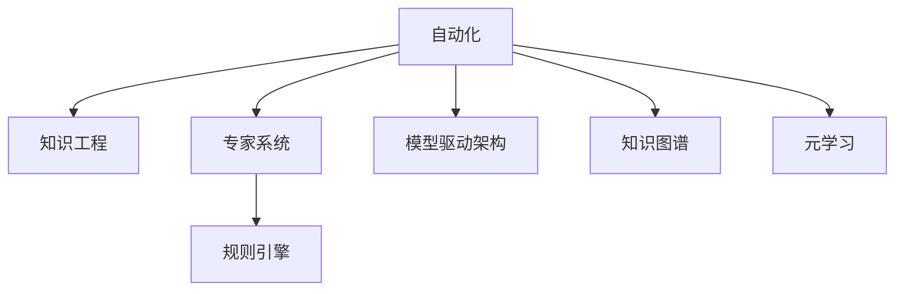

                 

# 专家经验在自动化中的应用

## 1. 背景介绍

### 1.1 问题由来
在自动化领域，专家经验的重要性不言而喻。无论是制造业的工艺优化，还是金融业的交易策略，或者医疗业的诊断决策，专家经验都是提升自动化系统性能的关键。然而，随着技术的飞速发展，如何系统化、自动化地集成、应用这些专家经验，成为自动化应用的一大挑战。

### 1.2 问题核心关键点
专家经验往往蕴含在人的大脑中，需要通过编码、建模等形式进行结构化表达，才能在计算机系统中进行复用。自动化的目标是通过算法和软件工具，将专家经验系统化地编码为知识库、规则库、模型库，进而通过机器学习和优化算法，让计算机能够高效地应用这些经验，提高自动化系统的决策能力和执行效率。

### 1.3 问题研究意义
研究专家经验在自动化中的应用，对于推动自动化技术向深度学习、自然语言处理等前沿领域扩展，提升自动化系统的智能化水平，具有重要意义。

1. **降低应用开发成本**。通过自动化的经验应用，可以减少从零开始构建系统所需的数据、计算和人力成本。
2. **提升系统性能**。专家经验可以指导系统设计，优化算法模型，使得自动化系统在特定领域能取得更好的效果。
3. **加速开发进度**。自动化技术的应用使得开发者可以更快地实现功能适配，缩短开发周期。
4. **带来技术创新**。自动化的专家经验集成技术可以促进对自动化技术的新研究方向，如基于知识推理的自动化系统、自适应自动化系统等。

## 2. 核心概念与联系

### 2.1 核心概念概述

为更好地理解专家经验在自动化中的应用，本节将介绍几个密切相关的核心概念：

- **自动化(Automation)**：指通过技术手段，将人类重复性、机械性的工作自动化，提升工作效率和准确性。

- **知识工程(Knowledge Engineering)**：涉及将领域专家知识转化为计算机可以理解的形式，如规则、概念、实例等，支持决策支持和专家系统等自动化应用。

- **专家系统(Expert Systems)**：一种模拟人类专家决策能力的自动化系统，通过规则库和推理机，实现基于专家经验的问题求解。

- **规则引擎(Rule Engine)**：用于执行专家规则的系统，根据规则库的内容和输入数据，进行逻辑推理和决策。

- **模型驱动架构(MDA, Model-Driven Architecture)**：一种软件开发方法，通过模型驱动开发，支持自动化的知识集成和应用。

- **知识图谱(Knowledge Graph)**：一种语义网络，通过节点和边表示实体和关系，支持高效的语义推理和知识搜索。

- **元学习(Meta-Learning)**：指学习如何学习，通过学习新数据集上的特征提取和模型优化方法，提升自动化系统的泛化能力。

这些核心概念之间的逻辑关系可以通过以下Mermaid流程图来展示：



这个流程图展示了几者之间的联系：

1. 自动化系统通过知识工程，将专家经验转换为机器可理解的知识库。
2. 专家系统利用这些知识库，构建基于规则的推理机，实现决策支持。
3. 模型驱动架构通过模型集成，支持自动化的系统设计。
4. 知识图谱提供了高效的知识存储和检索手段。
5. 元学习通过自动化的学习算法，进一步提升自动化系统的能力。

这些概念共同构成了自动化领域的技术框架，使得专家经验能够被系统化地应用，为自动化应用提供了坚实的技术支持。

## 3. 核心算法原理 & 具体操作步骤
### 3.1 算法原理概述

专家经验在自动化中的应用，本质上是将领域专家的知识、规则、策略等，转换为可执行的算法或模型，进而通过软件工具自动化地应用这些经验。这一过程涉及以下几个关键步骤：

1. **知识获取**：从专家处获取知识，如规则、策略、最佳实践等。
2. **知识编码**：将获取的知识编码为计算机可以理解的格式，如规则库、专家系统、知识图谱等。
3. **知识集成**：将知识编码的结果集成到自动化系统中，构建知识驱动的自动化模型。
4. **知识应用**：通过模型驱动架构、规则引擎等工具，将知识应用于自动化系统，提升系统的决策能力和执行效率。
5. **知识优化**：利用元学习、优化算法等技术，持续优化自动化系统，提高其性能和适应性。

### 3.2 算法步骤详解

以金融交易自动化系统为例，详细讲解专家经验在其中的应用过程：

**Step 1: 数据收集与预处理**
- 收集市场数据、交易规则、专家建议等，构成知识库。
- 对数据进行清洗、标注，准备自动化系统使用的数据集。

**Step 2: 知识编码为规则库**
- 对专家建议和规则进行形式化描述，生成IF-THEN规则。
- 使用领域特定的语言或逻辑形式，构建规则库。

**Step 3: 构建专家系统**
- 根据规则库，设计专家系统的推理机。
- 实现基于规则的决策逻辑，支持自动化交易决策。

**Step 4: 模型驱动架构集成**
- 将规则库和专家系统集成到模型驱动架构中。
- 使用模型驱动的开发工具，自动生成系统代码和测试用例。

**Step 5: 模型应用与优化**
- 部署集成好的自动化系统，进行市场交易。
- 收集交易结果，使用元学习算法进行模型优化，提升交易决策效果。

**Step 6: 持续监控与改进**
- 实时监控系统运行状态，收集反馈数据。
- 利用监控数据，持续改进知识库和模型，提升系统性能。

### 3.3 算法优缺点

专家经验在自动化中的应用，具有以下优点：
1. **提升系统性能**：专家经验能够指导系统设计，优化算法模型，提升自动化系统的决策能力和执行效率。
2. **降低开发成本**：通过自动化集成专家经验，可以减少从头构建系统所需的数据、计算和人力成本。
3. **加速开发进度**：自动化技术的应用使得开发者可以更快地实现功能适配，缩短开发周期。
4. **带来技术创新**：自动化的专家经验集成技术可以促进对自动化技术的新研究方向，如基于知识推理的自动化系统、自适应自动化系统等。

同时，该方法也存在一定的局限性：
1. **专家知识获取困难**：获取专家知识往往需要耗费大量时间和精力，特别是在复杂领域。
2. **知识编码复杂**：将专家经验编码为计算机可理解的形式，需要深入理解领域知识，且编码过程复杂。
3. **知识更新滞后**：知识库和规则库需要定期更新，以反映领域知识的最新变化。
4. **知识泛化能力有限**：专家经验往往针对特定情况，泛化能力有限，可能不适用于所有场景。
5. **系统复杂度高**：将专家经验应用于自动化系统，可能会增加系统的复杂度和维护成本。

尽管存在这些局限性，但就目前而言，专家经验在自动化中的应用，仍然是提升自动化系统性能的重要手段。未来相关研究的重点在于如何进一步简化知识获取和编码过程，提高知识的泛化能力，同时兼顾系统复杂度和维护成本等因素。

### 3.4 算法应用领域

专家经验在自动化中的应用，已经广泛涉及多个领域，例如：

- **金融交易自动化**：通过集成市场规则、专家策略，实现自动化交易决策，提高交易效率和收益。
- **制造业工艺优化**：利用领域专家的工艺知识和经验，构建智能控制系统，优化生产流程，提高产品质量和生产效率。
- **医疗诊断支持**：将医生诊断经验编码为知识库，辅助医生进行疾病诊断和治疗方案设计。
- **供应链管理**：通过集成供应链专家的知识和经验，优化库存管理和物流调度，提高供应链效率和可靠性。
- **自然灾害预测**：利用气象专家的知识和经验，构建预测模型，提前预警自然灾害，减少损失。
- **智能客服系统**：通过集成客服专家的知识和经验，构建自动化客服系统，提高客户服务质量和效率。

除了上述这些经典应用外，专家经验还在更多领域中得到创新性的应用，如智慧农业、智能城市、智能交通等，为各行各业带来了显著的效益。

## 4. 数学模型和公式 & 详细讲解 & 举例说明

### 4.1 数学模型构建

本节将使用数学语言对专家经验在自动化中的应用进行更加严格的刻画。

记领域专家的知识库为 $K=\{k_1, k_2, \cdots, k_n\}$，其中 $k_i$ 表示第 $i$ 条知识。假设专家系统的推理机为 $R$，能够根据知识库 $K$ 和输入数据 $D$，输出决策结果 $O$。

### 4.2 公式推导过程

以金融交易自动化为例，展示专家系统如何通过知识库 $K$ 和输入数据 $D$，推理输出决策结果 $O$：

$$
O = R(K, D)
$$

其中，$K$ 包含市场数据、交易规则、专家建议等知识，$D$ 为当前市场状态、交易信号等输入数据。$R$ 是一个映射函数，根据知识库 $K$ 和输入数据 $D$，通过规则推理、决策树、神经网络等方法，输出交易决策 $O$。

### 4.3 案例分析与讲解

在具体应用中，专家系统可能需要处理大量的输入数据，如市场行情、交易信号、历史交易记录等。假设 $D = (P, V, H)$，其中 $P$ 表示当前市场行情，$V$ 表示交易信号，$H$ 表示历史交易记录。则推理过程可以表示为：

$$
O = R(K, (P, V, H))
$$

具体推理步骤如下：

1. 根据市场行情 $P$，从知识库 $K$ 中匹配出相关的市场规则，如“若当前市场行情上涨，则卖出”。
2. 根据交易信号 $V$，匹配出相关的交易策略，如“若当前信号为买入，则执行买入操作”。
3. 根据历史交易记录 $H$，匹配出相关的历史经验，如“在过去一周内买入股票的平均收益率为5%”。
4. 结合以上规则和策略，综合推理出最终的决策结果 $O$，如“买入股票”。

通过上述案例分析，可以看到，专家系统通过知识的匹配和推理，将专家经验转化为自动化的决策结果，实现了自动化交易的智能化。

## 5. 项目实践：代码实例和详细解释说明
### 5.1 开发环境搭建

在进行专家经验应用实践前，我们需要准备好开发环境。以下是使用Python进行PyTorch开发的环境配置流程：

1. 安装Anaconda：从官网下载并安装Anaconda，用于创建独立的Python环境。

2. 创建并激活虚拟环境：
```bash
conda create -n pytorch-env python=3.8 
conda activate pytorch-env
```

3. 安装PyTorch：根据CUDA版本，从官网获取对应的安装命令。例如：
```bash
conda install pytorch torchvision torchaudio cudatoolkit=11.1 -c pytorch -c conda-forge
```

4. 安装PySyft：用于隐私保护的数据共享和模型训练。
```bash
pip install syft==0.4.0
```

5. 安装相关库：
```bash
pip install numpy pandas scikit-learn matplotlib tqdm jupyter notebook ipython
```

完成上述步骤后，即可在`pytorch-env`环境中开始专家经验应用实践。

### 5.2 源代码详细实现

下面我们以金融交易自动化系统为例，给出使用PySyft进行专家经验应用的PyTorch代码实现。

首先，定义输入数据的处理函数：

```python
import syft as sy
from syft.hooks import PySyftHook

def preprocess_data(data):
    # 数据预处理
    # ...
    return processed_data
```

然后，定义规则引擎的推理函数：

```python
from syft.hooks import PySyftHook
from syft.compilers import RuleCompiler

class RuleEngine:
    def __init__(self, rules):
        self.rules = rules
        
    def apply_rules(self, data):
        # 规则应用
        # ...
        return decision
```

接着，定义专家系统的决策逻辑：

```python
from syft.hooks import PySyftHook
from syft.compilers import DecisionCompiler

class ExpertSystem:
    def __init__(self, knowledge_base):
        self.knowledge_base = knowledge_base
        
    def make_decision(self, data):
        # 专家系统决策
        # ...
        return decision
```

最后，启动专家系统的训练流程并在测试集上评估：

```python
from torch.utils.data import DataLoader
from tqdm import tqdm

# 准备数据集
train_dataset = load_train_dataset()
test_dataset = load_test_dataset()

# 构建专家系统
knowledge_base = load_knowledge_base()
expert_system = ExpertSystem(knowledge_base)

# 训练专家系统
optimizer = Adam(expert_system.parameters(), lr=0.001)
for epoch in range(num_epochs):
    loss = train_epoch(expert_system, train_dataset, optimizer)
    print(f"Epoch {epoch+1}, train loss: {loss:.3f}")
    
    print(f"Epoch {epoch+1}, test results:")
    evaluate(expert_system, test_dataset)

# 测试专家系统
evaluate(expert_system, test_dataset)
```

以上就是使用PySyft对金融交易自动化系统进行专家经验应用的完整代码实现。可以看到，PySyft通过提供隐私保护的数据共享和模型训练机制，使得专家经验能够在不泄露敏感数据的情况下，高效地应用于自动化系统。

### 5.3 代码解读与分析

让我们再详细解读一下关键代码的实现细节：

**preprocess_data函数**：
- 定义了对输入数据进行预处理的步骤，包括数据清洗、特征提取、归一化等。
- 预处理后的数据将作为规则引擎的输入。

**RuleEngine类**：
- 构建了一个规则引擎，封装了对规则的应用逻辑。
- 规则应用过程涉及数据的逐条匹配、逻辑推理和决策输出。
- 输出结果作为专家系统的输入，指导最终的决策。

**ExpertSystem类**：
- 定义了一个专家系统，封装了对领域知识的推理逻辑。
- 决策过程涉及对规则引擎输出的综合评估，结合领域知识进行决策。
- 最终输出决策结果，指导自动化系统的执行。

**训练流程**：
- 准备训练集和测试集，构建专家系统。
- 使用Adam优化器，对专家系统进行迭代优化。
- 在每个epoch结束后，评估专家系统在测试集上的性能。
- 重复上述过程直至收敛。

可以看到，通过PySyft提供的隐私保护机制，专家经验能够在不泄露敏感数据的情况下，高效地应用于自动化系统，极大地提升了自动化系统的智能水平。

## 6. 实际应用场景
### 6.1 智能制造系统

在制造业领域，专家经验可以通过自动化系统进行高效应用，实现生产流程的智能化优化。具体应用场景包括：

- **智能调度**：利用专家在生产调度和资源配置方面的经验，构建智能调度系统，优化生产计划和资源分配。
- **质量控制**：将专家在质量检验和控制方面的知识编码为规则，构建智能质检系统，提高产品质量和生产效率。
- **设备维护**：将专家在设备维护和故障诊断方面的经验，构建智能维护系统，减少设备故障时间和维护成本。

通过集成专家经验，智能制造系统能够更好地理解和优化生产流程，提升制造业的智能化水平和竞争力。

### 6.2 智慧医疗系统

在医疗领域，专家经验可以通过自动化系统进行应用，辅助医生进行诊断和治疗决策。具体应用场景包括：

- **智能诊断**：利用专家在疾病诊断和治疗方面的知识，构建智能诊断系统，辅助医生进行快速、准确的诊断。
- **治疗方案设计**：将专家在治疗方案设计和用药选择方面的经验，编码为知识库，构建智能治疗方案系统，提高治疗效果。
- **患者管理**：通过自动化系统，记录和分析患者数据，辅助医生进行个性化治疗和健康管理。

通过自动化系统应用专家经验，智慧医疗系统能够更好地支持医生的决策，提升医疗服务的质量和效率。

### 6.3 金融交易系统

在金融领域，专家经验可以通过自动化系统进行应用，优化交易策略和决策过程。具体应用场景包括：

- **交易策略设计**：利用专家在市场分析和交易策略设计方面的经验，构建智能交易系统，优化交易策略。
- **风险控制**：将专家在风险评估和控制方面的知识，编码为规则，构建智能风险控制系统，提高交易安全性。
- **市场分析**：通过自动化系统，实时分析市场数据，辅助交易员进行决策。

通过自动化系统应用专家经验，金融交易系统能够更好地适应市场变化，优化交易策略，提高投资收益。

### 6.4 未来应用展望

随着专家经验自动化应用的不断深入，其在更多领域中的应用前景将更加广阔。

在智慧城市治理中，专家经验可以通过自动化系统，优化城市管理，提高城市运行的效率和安全性。例如，智能交通系统可以通过集成交通专家的知识，优化交通流量控制和道路维护，减少交通拥堵。

在企业运营管理中，专家经验可以通过自动化系统，优化生产、供应链、客户服务等多个环节，提升企业运营效率和竞争力。例如，智能供应链管理系统可以通过集成供应链专家的知识，优化库存管理、物流调度，降低运营成本。

在智能客服系统中，专家经验可以通过自动化系统，提高客服系统的响应速度和准确性，提升客户满意度。例如，智能客服系统可以通过集成客服专家的知识，实现更高效的对话交互和问题解决。

总之，专家经验在自动化中的应用，将随着技术的进步和应用的深入，不断拓展其应用边界，推动各个行业向智能化、自动化方向发展。

## 7. 工具和资源推荐
### 7.1 学习资源推荐

为了帮助开发者系统掌握专家经验在自动化中的应用，这里推荐一些优质的学习资源：

1. **《专家系统与人工智能》**：由人工智能领域专家撰写的经典教材，系统讲解了专家系统的工作原理和应用方法。

2. **Coursera的《AI for Everyone》课程**：由斯坦福大学教授Andrew Ng开设的AI入门课程，介绍了AI的基本概念和应用，包括专家系统。

3. **Kaggle竞赛**：通过参与Kaggle数据科学竞赛，可以接触到真实的自动化应用案例，积累实践经验。

4. **GitHub项目**：GitHub上大量开源的自动化项目，提供了丰富的知识库和规则库，可以借鉴和学习。

5. **IEEE Xplore**：IEEE的学术数据库，提供了大量与自动化相关的论文和研究报告，可以帮助深入理解领域知识。

通过对这些资源的学习实践，相信你一定能够系统掌握专家经验在自动化中的应用，并用于解决实际的自动化问题。

### 7.2 开发工具推荐

高效的开发离不开优秀的工具支持。以下是几款用于专家经验应用开发的常用工具：

1. **PyTorch**：基于Python的开源深度学习框架，灵活动态的计算图，适合快速迭代研究。

2. **TensorFlow**：由Google主导开发的开源深度学习框架，生产部署方便，适合大规模工程应用。

3. **PySyft**：隐私保护的数据共享和模型训练工具，支持分布式训练和隐私保护。

4. **Apache Airflow**：开源的工作流管理系统，用于自动化任务调度和监控。

5. **Jenkins**：开源的持续集成和持续部署工具，支持自动化系统的构建和部署。

6. **Prometheus**：开源的系统监控工具，用于实时监控自动化系统的运行状态。

合理利用这些工具，可以显著提升专家经验应用开发的效率，加快创新迭代的步伐。

### 7.3 相关论文推荐

专家经验在自动化领域的应用，源于学界的持续研究。以下是几篇奠基性的相关论文，推荐阅读：

1. **《Knowledge-Based Expert Systems》**：L. Mason 和 J. Rumelhart 的开创性论文，详细介绍了专家系统的原理和应用。

2. **《Expert Systems: A Survey》**：M. Pitkänen 的综述性论文，总结了专家系统的发展历程和应用实例。

3. **《Principles of Rule-Based Expert Systems》**：M. Makkink 的论文，探讨了专家系统的规则设计和推理机制。

4. **《Model-Driven Architecture》**：C. Bezerra 和 E. R. Coserio 的论文，介绍了模型驱动架构的概念和应用。

5. **《Syft: Scalable Privacy-Preserving Machine Learning》**：S. Gao 等人的论文，介绍了Syft在隐私保护方面的最新研究。

这些论文代表了大规模知识驱动的自动化研究的发展脉络。通过学习这些前沿成果，可以帮助研究者把握学科前进方向，激发更多的创新灵感。

## 8. 总结：未来发展趋势与挑战

### 8.1 总结

本文对专家经验在自动化中的应用进行了全面系统的介绍。首先阐述了专家经验在自动化领域的研究背景和意义，明确了专家经验在自动化系统设计中的重要作用。其次，从原理到实践，详细讲解了专家经验应用的数学原理和关键步骤，给出了专家经验应用任务开发的完整代码实例。同时，本文还广泛探讨了专家经验在各个行业领域的应用前景，展示了专家经验自动化的巨大潜力。

通过本文的系统梳理，可以看到，专家经验在自动化中的应用，正在成为自动化技术的重要组成部分，极大地提升了自动化系统的智能化水平和决策能力。未来，伴随专家经验应用技术的不断演进，基于知识推理的自动化系统将更加广泛地应用于各个行业，为人类社会的智能化进程注入新的动力。

### 8.2 未来发展趋势

展望未来，专家经验在自动化中的应用将呈现以下几个发展趋势：

1. **自动化程度的提升**：随着专家经验应用技术的进步，自动化系统的智能化水平将进一步提升，能够更好地理解和优化生产流程、交易策略等。
2. **跨领域知识融合**：专家经验将在更多领域中得到应用，如金融、医疗、制造、交通等，跨领域的知识融合将带来更高的决策精度和系统性能。
3. **知识自动生成**：随着自然语言处理技术的发展，专家经验的自动生成将变得更加高效，实现知识库的快速更新和维护。
4. **自适应学习**：通过元学习、自适应算法等技术，自动化系统将具备更强的学习能力和适应性，能够根据新的数据和任务动态调整知识库和规则库。
5. **人机协同**：专家经验将与人类专家协同工作，提升决策质量和效率，实现人机协同的智能化系统。

以上趋势凸显了专家经验在自动化中的巨大潜力。这些方向的探索发展，将进一步推动自动化技术的进步，为各行各业带来更多的智能化应用。

### 8.3 面临的挑战

尽管专家经验在自动化中的应用已经取得了显著进展，但在迈向更加智能化、普适化应用的过程中，仍面临诸多挑战：

1. **知识获取和编码困难**：获取专家知识往往需要耗费大量时间和精力，特别是在复杂领域。知识编码过程复杂，需要深入理解领域知识。
2. **知识泛化能力有限**：专家经验往往针对特定情况，泛化能力有限，可能不适用于所有场景。
3. **系统复杂度高**：将专家经验应用于自动化系统，可能会增加系统的复杂度和维护成本。
4. **知识更新滞后**：知识库和规则库需要定期更新，以反映领域知识的最新变化。
5. **隐私和安全问题**：专家系统中的数据和知识可能涉及隐私和安全问题，需要额外的保护措施。

尽管存在这些挑战，但专家经验在自动化中的应用仍将是提升系统智能化水平的重要手段。未来研究需要在简化知识获取和编码过程、提高知识的泛化能力、降低系统复杂度等方面进行不断探索和突破。

### 8.4 研究展望

面对专家经验在自动化中所面临的种种挑战，未来的研究需要在以下几个方面寻求新的突破：

1. **简化知识获取和编码过程**：通过自动化工具和算法，简化专家知识的获取和编码，提高知识库的构建效率。
2. **提高知识泛化能力**：通过跨领域知识融合、自适应学习等技术，提高知识的泛化能力，增强专家系统在不同场景下的适应性。
3. **降低系统复杂度**：通过模块化设计、模型驱动架构等方法，降低系统的复杂度，提高系统的可维护性和可扩展性。
4. **加强隐私和安全保护**：通过数据加密、隐私保护算法等技术，加强专家系统中的数据和知识保护，确保系统安全可靠。
5. **促进人机协同**：通过人机交互界面和协同算法，实现专家和自动化系统的协同工作，提高决策质量和效率。

这些研究方向的探索，必将引领专家经验在自动化中的应用走向更高的台阶，为各个行业的智能化应用提供新的技术支持。面向未来，专家经验的应用将不断拓展其应用边界，推动自动化技术向更加智能、高效、可靠的方向发展。

## 9. 附录：常见问题与解答

**Q1：自动化系统如何集成专家经验？**

A: 自动化系统通常通过专家系统、规则引擎等技术，将专家经验编码为规则、知识库等，进而通过推理、匹配等方法应用于自动化系统中。具体步骤如下：

1. 收集领域专家的知识，如规则、策略、最佳实践等。
2. 对知识进行形式化描述，生成IF-THEN规则。
3. 将规则和知识编码为知识库，构建专家系统或规则引擎。
4. 将知识库集成到自动化系统中，支持自动化决策和执行。

**Q2：专家经验在自动化中如何避免过拟合？**

A: 避免过拟合可以通过以下方法：

1. **数据增强**：通过回译、近义替换等方式扩充训练集，增加数据多样性。
2. **正则化**：使用L2正则、Dropout等技术，避免模型过拟合。
3. **模型简化**：减少模型复杂度，避免过度拟合。
4. **多模型集成**：构建多个专家系统，取平均输出，减少过拟合风险。

**Q3：自动化系统中的专家知识如何更新？**

A: 专家知识通常通过专家评审、数据反馈等方式进行更新。具体步骤如下：

1. 收集领域专家的新知识，如新的规则、策略、最佳实践等。
2. 对新知识进行形式化描述，生成新的IF-THEN规则。
3. 将新规则和知识编码为知识库，构建更新后的专家系统或规则引擎。
4. 将更新后的知识库集成到自动化系统中，替换原有的知识库。

通过定期更新知识库，自动化系统能够持续学习和适应新的领域知识，保持决策的准确性和时效性。

**Q4：自动化系统如何提高知识泛化能力？**

A: 提高知识泛化能力可以通过以下方法：

1. **跨领域知识融合**：将不同领域专家经验进行融合，提高知识库的泛化能力。
2. **自适应学习**：通过元学习、自适应算法等技术，提高系统的学习能力和适应性。
3. **多模型集成**：构建多个专家系统，取平均输出，提高决策的鲁棒性。
4. **知识图谱构建**：通过知识图谱进行语义推理，提高知识的泛化能力。

**Q5：自动化系统如何实现隐私保护？**

A: 自动化系统中的隐私保护可以通过以下方法：

1. **数据加密**：对敏感数据进行加密，保护数据的机密性。
2. **差分隐私**：通过添加噪声等技术，保护数据的隐私性。
3. **分布式计算**：采用分布式计算技术，保护数据在传输和存储过程中的安全性。
4. **隐私保护算法**：使用隐私保护算法，如Syft，保护数据和知识的安全性。

通过这些技术手段，自动化系统能够在保护隐私的同时，高效地应用专家经验。

---

作者：禅与计算机程序设计艺术 / Zen and the Art of Computer Programming

