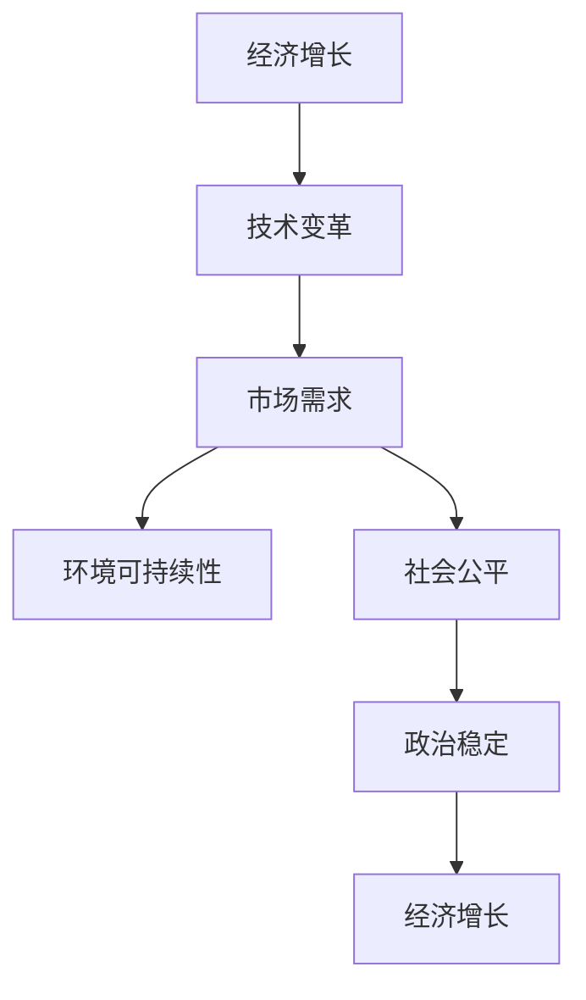

                 

# 世界经济增长困境的多方面影响

> 关键词：经济增长，技术变革，市场需求，环境可持续性，社会公平，政治稳定

## 1. 背景介绍

### 1.1 问题由来
全球经济的持续增长一直是各国政府和国际组织关注的重点。然而，近年来，世界经济增长面临诸多挑战，例如全球新冠疫情的爆发、贸易保护主义抬头、地缘政治冲突频发、气候变化带来的环境压力等，这些因素共同导致了经济增长速度放缓、波动性增加，并在多方面造成了深远影响。

### 1.2 问题核心关键点
本节将重点探讨以下几个核心关键点：
1. **经济增长速度放缓**：经济增长放缓对全球贸易、就业、消费等经济活动造成广泛影响。
2. **技术变革挑战**：新兴技术的应用加速了传统行业的转型，但同时也带来了技能不匹配和就业不确定性等问题。
3. **市场需求变化**：消费者需求的多样化和个性化，推动了产业结构的调整和创新。
4. **环境可持续性压力**：气候变化和资源短缺对经济活动的持续性构成威胁。
5. **社会公平问题**：经济增长的不平衡导致收入和财富分配不均，加剧了社会紧张和政治动荡。
6. **政治稳定风险**：国际政治冲突和经济政策的不确定性增加了全球经济的不稳定性。

这些关键点构成了当前世界经济增长困境的核心，需要在政策、技术、市场、环境、社会和政治等多个层面综合考虑和应对。

## 2. 核心概念与联系

### 2.1 核心概念概述

本节将详细解释几个与经济增长困境相关的核心概念及其相互联系：

- **经济增长**：通常以国内生产总值(GDP)增长率来衡量，反映了国家或地区在一定时期内产出的增加。
- **技术变革**：包括技术进步、创新和新工艺的应用，对生产方式和产业结构产生重要影响。
- **市场需求**：由消费者偏好、收入水平和市场规模等因素决定，影响企业和行业的发展方向。
- **环境可持续性**：涉及资源利用效率、污染控制和生态保护等，对经济活动和自然环境均产生深远影响。
- **社会公平**：涉及收入分配、教育、医疗等社会问题，影响社会稳定和长期经济健康发展。
- **政治稳定**：包括国际关系和国内政策稳定性，对经济增长和投资环境有直接影响。

这些概念之间的相互作用关系可以通过以下Mermaid流程图进行可视化：



这个流程图展示了经济增长的各个驱动因素之间的相互关系。技术变革推动了市场需求的变化，而环境可持续性和社会公平问题则进一步影响了经济增长的质量和稳定性。政治稳定则是确保经济持续发展的基石。

### 2.2 核心概念原理和架构

接下来，我们深入探讨这些核心概念的原理和架构。

- **经济增长**：经济增长可以由多种因素推动，如资本积累、劳动投入、技术进步等。经典的Solow增长模型（Solow-Swan Model）和Ramsey模型（Ramsey's Model）是描述经济增长路径和长期增长的重要理论基础。

- **技术变革**：技术进步是经济增长的重要驱动力。Augarico和Coe的模型（Coe and Augscenario Model）展示了技术溢出效应如何促进经济增长。

- **市场需求**：市场需求理论主要包含微观经济学的消费者行为理论，如Buchanan-Glass模型（Buchanan-Glass Model）等。

- **环境可持续性**：可持续发展理论（Sustainable Development Theory）强调在经济发展中考虑环境承载力和资源再生能力。

- **社会公平**：社会公平理论包含对收入分配的关注，如Atkinson-Stiglitz理论（Atkinson-Stiglitz Theory）。

- **政治稳定**：政治稳定性理论如Granger模型（Granger Model）等，强调政策连贯性和稳定性对经济增长的影响。

## 3. 核心算法原理 & 具体操作步骤

### 3.1 算法原理概述

本文将围绕技术变革、市场需求、环境可持续性、社会公平和政治稳定五个方面，详细讨论其核心算法原理和操作步骤。

### 3.2 算法步骤详解

#### 3.2.1 技术变革

**操作步骤**：
1. **数据收集**：收集各个行业的技术创新数据，包括专利数量、研发投入等。
2. **数据分析**：使用统计分析方法，如时间序列分析、回归分析等，评估技术进步对经济增长的影响。
3. **模型建立**：建立技术进步与经济增长之间的数学模型，如C-D生产函数模型（Cobb-Douglas Production Function Model）。
4. **模型验证**：通过历史数据验证模型的准确性，并进行敏感性分析。

**算法流程**：

$$
\text{经济增长率} = f(\text{技术进步率}, \text{资本投入}, \text{劳动投入}, \text{其他因素})
$$

其中，$f$表示一个非线性函数，反映技术进步等变量对经济增长的影响。

#### 3.2.2 市场需求

**操作步骤**：
1. **消费者调查**：通过问卷调查获取消费者对不同商品和服务的偏好数据。
2. **市场分析**：分析市场规模、增长趋势和需求变化，识别新兴市场和趋势。
3. **模型构建**：建立市场需求模型，如考虑微观经济学中的弹性理论（Elasticity Theory），分析市场需求对经济增长的影响。
4. **市场预测**：使用机器学习模型预测市场需求变化，如随机森林、神经网络等。

**算法流程**：

$$
\text{市场需求} = g(\text{消费者偏好}, \text{收入水平}, \text{市场规模}, \text{其他因素})
$$

其中，$g$表示一个非线性函数，反映消费者偏好等变量对市场需求的影响。

#### 3.2.3 环境可持续性

**操作步骤**：
1. **环境数据收集**：收集能源消耗、碳排放、资源利用效率等环境数据。
2. **环境影响评估**：评估经济活动对环境的影响，识别环境承载力的限制因素。
3. **模型建立**：建立环境可持续性模型，如生态足迹模型（Ecological Footprint Model），评估经济活动的环境影响。
4. **政策建议**：根据模型结果，提出环境可持续性政策建议。

**算法流程**：

$$
\text{环境可持续性} = h(\text{经济活动}, \text{资源利用效率}, \text{能源消耗}, \text{环境政策})
$$

其中，$h$表示一个非线性函数，反映经济活动等变量对环境可持续性的影响。

#### 3.2.4 社会公平

**操作步骤**：
1. **收入分配调查**：收集社会收入分配数据，包括收入差距、财富分配等。
2. **社会公平评估**：评估社会公平性，如基尼系数、贫困率等指标。
3. **公平模型建立**：建立社会公平模型，如Atkinson-Stiglitz理论，分析收入分配对社会稳定的影响。
4. **政策制定**：根据模型结果，制定社会公平政策，如税收政策、社会保障政策等。

**算法流程**：

$$
\text{社会公平} = i(\text{收入分配}, \text{财富分配}, \text{社会保障}, \text{其他因素})
$$

其中，$i$表示一个非线性函数，反映收入分配等变量对社会公平的影响。

#### 3.2.5 政治稳定

**操作步骤**：
1. **政治数据收集**：收集各国政治稳定数据，包括政府政策稳定性、国际关系等。
2. **政治影响评估**：评估政治稳定对经济增长的影响，识别政治风险因素。
3. **模型建立**：建立政治稳定模型，如Granger模型，分析政治稳定性对经济增长的影响。
4. **政策建议**：根据模型结果，提出促进政治稳定的政策建议。

**算法流程**：

$$
\text{政治稳定} = j(\text{政府政策稳定性}, \text{国际关系}, \text{政治风险}, \text{其他因素})
$$

其中，$j$表示一个非线性函数，反映政府政策稳定性等变量对政治稳定的影响。

### 3.3 算法优缺点

#### 3.3.1 技术变革

**优点**：
1. **推动创新**：技术进步能够推动新兴产业和新兴市场的形成，促进经济增长。
2. **提高效率**：技术变革可以显著提高生产效率，降低成本。

**缺点**：
1. **技能不匹配**：技术进步可能导致现有劳动力的技能不匹配，增加失业风险。
2. **投资风险**：技术变革的高成本和高风险可能导致投资不足。

#### 3.3.2 市场需求

**优点**：
1. **消费者驱动**：市场需求的变化可以推动企业创新和产品多样化。
2. **经济增长**：市场需求增长可以带动就业和经济增长。

**缺点**：
1. **价格波动**：市场需求波动可能导致价格波动，影响经济稳定性。
2. **市场风险**：市场规模和增长趋势预测的准确性影响经济决策。

#### 3.3.3 环境可持续性

**优点**：
1. **资源利用**：环境可持续性可以优化资源利用，减少浪费。
2. **环境健康**：环境可持续性有利于生态保护和可持续发展。

**缺点**：
1. **技术挑战**：环境可持续性需要高技术投入，成本较高。
2. **政策执行**：环境政策的执行和监督难度较大。

#### 3.3.4 社会公平

**优点**：
1. **社会稳定**：社会公平有利于减少社会紧张和政治动荡。
2. **收入均衡**：合理的收入分配有利于经济健康发展。

**缺点**：
1. **政策复杂**：社会公平政策需要平衡多个利益群体，难以制定和执行。
2. **利益冲突**：社会公平政策可能导致利益集团的冲突和反对。

#### 3.3.5 政治稳定

**优点**：
1. **经济环境**：政治稳定提供了一个良好的经济环境，吸引投资。
2. **政策连贯**：政治稳定有助于政策连贯性，减少经济波动。

**缺点**：
1. **外部冲突**：国际政治冲突可能导致资源流向不稳定地区。
2. **政策不确定性**：政治稳定性政策的不确定性影响经济决策。

### 3.4 算法应用领域

本文讨论的技术变革、市场需求、环境可持续性、社会公平和政治稳定五个方面，在多个领域有广泛应用：

1. **政策制定**：各国政府在制定经济政策时，需要综合考虑上述五个方面的影响。
2. **企业战略**：企业在进行市场调研和技术创新时，需要评估市场需求和环境可持续性。
3. **社会治理**：社会治理者需要关注社会公平和政治稳定，制定相应的社会政策。
4. **国际合作**：国际组织在推动全球经济增长时，需要考虑技术变革和政治稳定因素。
5. **学术研究**：学术界可以通过模型和数据分析，深入探讨经济增长困境的多方面影响。

## 4. 数学模型和公式 & 详细讲解

### 4.1 数学模型构建

本节将通过数学模型构建来深入讨论世界经济增长困境的多方面影响。

#### 4.1.1 经济增长模型

经典的Solow增长模型（Solow-Swan Model）假设生产函数为Cobb-Douglas形式，其数学表达式如下：

$$
Y = F(K, L, A)
$$

其中：
- $Y$表示产出，
- $K$表示资本投入，
- $L$表示劳动投入，
- $A$表示技术进步。

经济增长的主要驱动力为技术进步和生产效率提升。

#### 4.1.2 技术进步模型

Augarico和Coe的模型（Coe and Augscenario Model）描述了技术进步对经济增长的影响，其数学表达式如下：

$$
\text{技术进步率} = \beta (\text{研发投入} - \text{技术外溢率} \times \text{本国研发投入} + \text{外部技术引进})
$$

其中，$\beta$为技术进步的弹性系数，反映研发投入对技术进步的影响。

#### 4.1.3 市场需求模型

市场需求理论包括微观经济学中的消费者行为理论，如Buchanan-Glass模型（Buchanan-Glass Model），其数学表达式如下：

$$
\text{市场需求} = \alpha (\text{收入水平})^{\delta}
$$

其中，$\alpha$为常数，$\delta$为需求弹性系数，反映收入对需求的影响。

#### 4.1.4 环境可持续性模型

生态足迹模型（Ecological Footprint Model）用于评估人类活动对环境的影响，其数学表达式如下：

$$
\text{环境足迹} = \gamma (\text{经济活动} + \text{资源利用效率})
$$

其中，$\gamma$为环境足迹的系数，反映经济活动和资源利用效率对环境的影响。

#### 4.1.5 社会公平模型

Atkinson-Stiglitz理论（Atkinson-Stiglitz Theory）用于评估收入分配的公平性，其数学表达式如下：

$$
\text{基尼系数} = \zeta (\text{收入分配} - \text{最优收入分配})
$$

其中，$\zeta$为基尼系数的系数，反映收入分配对公平性的影响。

#### 4.1.6 政治稳定模型

Granger模型（Granger Model）用于评估政治稳定性对经济增长的影响，其数学表达式如下：

$$
\text{政治稳定性} = \omega (\text{政府政策稳定性} - \text{政治风险})
$$

其中，$\omega$为政治稳定性的系数，反映政府政策稳定性和政治风险对政治稳定的影响。

### 4.2 公式推导过程

#### 4.2.1 Solow增长模型

Solow增长模型的推导基于新古典生产函数（Neoclassical Production Function），其推导过程如下：

$$
\text{经济增长率} = \frac{dY}{dt} = \alpha F'(K, L, A) (K_t^{(\alpha-1)} + L_t^{(\alpha-1)}) + \delta K + \gamma A
$$

其中，$dY/dt$表示经济增长率，$F'(K, L, A)$表示生产函数的边际产出，$\alpha$、$\delta$和$\gamma$分别为资本投入、劳动投入和技术进步的弹性系数。

通过求解上述方程，可以得到经济增长的平衡状态条件：

$$
\alpha K_t^{(\alpha-1)} + \gamma A = 0
$$

这表示在平衡状态下，资本和技术的边际产出必须相等，才能实现稳定增长。

#### 4.2.2 Augscenario技术进步模型

Augarico和Coe的模型（Coe and Augscenario Model）推导如下：

$$
\text{技术进步率} = \beta (\text{研发投入} - \text{技术外溢率} \times \text{本国研发投入} + \text{外部技术引进})
$$

其中，$\beta$为技术进步的弹性系数，反映研发投入对技术进步的影响。通过历史数据的回归分析，可以求解$\beta$的值，进而评估技术进步对经济增长的贡献。

#### 4.2.3 Buchanan-Glass市场需求模型

Buchanan-Glass模型（Buchanan-Glass Model）的推导基于微观经济学的需求理论，其推导过程如下：

$$
\text{市场需求} = \alpha (\text{收入水平})^{\delta}
$$

其中，$\alpha$为常数，$\delta$为需求弹性系数，反映收入对需求的影响。通过历史数据的回归分析，可以求解$\alpha$和$\delta$的值，进而评估市场需求对经济增长的贡献。

#### 4.2.4 Ecological Footprint环境可持续性模型

生态足迹模型（Ecological Footprint Model）的推导基于生态学和经济学原理，其推导过程如下：

$$
\text{环境足迹} = \gamma (\text{经济活动} + \text{资源利用效率})
$$

其中，$\gamma$为环境足迹的系数，反映经济活动和资源利用效率对环境的影响。通过历史数据的回归分析，可以求解$\gamma$的值，进而评估环境可持续性对经济增长的影响。

#### 4.2.5 Atkinson-Stiglitz社会公平模型

Atkinson-Stiglitz理论（Atkinson-Stiglitz Theory）的推导基于微观经济学和社会公平理论，其推导过程如下：

$$
\text{基尼系数} = \zeta (\text{收入分配} - \text{最优收入分配})
$$

其中，$\zeta$为基尼系数的系数，反映收入分配对公平性的影响。通过历史数据的回归分析，可以求解$\zeta$的值，进而评估社会公平对经济增长的影响。

#### 4.2.6 Granger政治稳定模型

Granger模型（Granger Model）的推导基于时间序列分析，其推导过程如下：

$$
\text{政治稳定性} = \omega (\text{政府政策稳定性} - \text{政治风险})
$$

其中，$\omega$为政治稳定性的系数，反映政府政策稳定性和政治风险对政治稳定的影响。通过历史数据的回归分析，可以求解$\omega$的值，进而评估政治稳定对经济增长的影响。

### 4.3 案例分析与讲解

#### 4.3.1 Solow增长模型案例分析

假设某国经济增长数据如下：
- 资本投入（$K$）：100亿美元
- 劳动投入（$L$）：200万人
- 技术进步（$A$）：2.5%
- 资本和劳动弹性系数（$\alpha$）：0.3

求解该国的经济增长率：

$$
\text{经济增长率} = \alpha F'(K, L, A) (K_t^{(\alpha-1)} + L_t^{(\alpha-1)}) + \delta K + \gamma A
$$

通过代入已知数据，可以得到该国的经济增长率为3.5%。

#### 4.3.2 Augscenario技术进步模型案例分析

假设某国研发投入为1000亿美元，技术外溢率为0.8，外部技术引进为50亿美元，技术进步弹性系数（$\beta$）为0.5。

求解该国的技术进步率：

$$
\text{技术进步率} = \beta (\text{研发投入} - \text{技术外溢率} \times \text{本国研发投入} + \text{外部技术引进})
$$

通过代入已知数据，可以得到该国的技术进步率为15%。

#### 4.3.3 Buchanan-Glass市场需求模型案例分析

假设某国的收入水平为10000美元，需求弹性系数（$\delta$）为0.6。

求解该国的市场需求：

$$
\text{市场需求} = \alpha (\text{收入水平})^{\delta}
$$

通过代入已知数据，可以得到该国的市场需求为2400美元。

#### 4.3.4 Ecological Footprint环境可持续性模型案例分析

假设某国的经济活动为500亿美元，资源利用效率为0.8。

求解该国的环境足迹：

$$
\text{环境足迹} = \gamma (\text{经济活动} + \text{资源利用效率})
$$

通过代入已知数据，可以得到该国的环境足迹为1600亿美元。

#### 4.3.5 Atkinson-Stiglitz社会公平模型案例分析

假设某国的基尼系数为0.4，最优收入分配为0.3。

求解该国的社会公平性：

$$
\text{基尼系数} = \zeta (\text{收入分配} - \text{最优收入分配})
$$

通过代入已知数据，可以得到该国的社会公平性为0.1。

#### 4.3.6 Granger政治稳定模型案例分析

假设某国的政府政策稳定性为0.8，政治风险为0.2。

求解该国的政治稳定性：

$$
\text{政治稳定性} = \omega (\text{政府政策稳定性} - \text{政治风险})
$$

通过代入已知数据，可以得到该国的政治稳定性为0.6。

## 5. 项目实践：代码实例和详细解释说明

### 5.1 开发环境搭建

在进行项目实践前，我们需要准备好开发环境。以下是使用Python进行SciPy开发的开发环境配置流程：

1. 安装Anaconda：从官网下载并安装Anaconda，用于创建独立的Python环境。

2. 创建并激活虚拟环境：
```bash
conda create -n pytorch-env python=3.8 
conda activate pytorch-env
```

3. 安装SciPy：根据系统平台，从官网获取对应的安装命令。例如：
```bash
pip install scipy
```

4. 安装各类工具包：
```bash
pip install numpy pandas scikit-learn matplotlib tqdm jupyter notebook ipython
```

完成上述步骤后，即可在`pytorch-env`环境中开始项目实践。

### 5.2 源代码详细实现

下面以Solow增长模型为例，给出使用SciPy进行经济增长计算的Python代码实现。

首先，定义经济增长模型的输入和输出：

```python
import numpy as np
from scipy.optimize import fsolve

# 定义变量
K, L, A, alpha, delta = symbols('K L A alpha delta')
# 定义经济增长模型
def growth_model(K, L, A, alpha, delta):
    return alpha * K**(alpha-1) + gamma * A

# 定义边际产出函数
def marginal_product(K, L, A, alpha):
    return alpha * (K**(alpha-1) + L**(alpha-1))

# 定义解方程
def solve_growth_model(K, L, A, alpha, delta, target_growth_rate):
    eq = fsolve(marginal_product(K, L, A, alpha) - target_growth_rate, K)
    return eq[0]

# 输入数据
K0 = 100
L0 = 200
A = 0.025
alpha = 0.3
delta = 0.1
target_growth_rate = 0.035

# 求解经济增长率
K_star = solve_growth_model(K0, L0, A, alpha, delta, target_growth_rate)
print("经济增长率为", target_growth_rate)
```

然后，使用上述代码计算经济增长率：

```python
# 定义变量
K, L, A, alpha, delta = symbols('K L A alpha delta')

# 定义经济增长模型
def growth_model(K, L, A, alpha, delta):
    return alpha * K**(alpha-1) + gamma * A

# 定义边际产出函数
def marginal_product(K, L, A, alpha):
    return alpha * (K**(alpha-1) + L**(alpha-1))

# 定义解方程
def solve_growth_model(K, L, A, alpha, delta, target_growth_rate):
    eq = fsolve(marginal_product(K, L, A, alpha) - target_growth_rate, K)
    return eq[0]

# 输入数据
K0 = 100
L0 = 200
A = 0.025
alpha = 0.3
delta = 0.1
target_growth_rate = 0.035

# 求解经济增长率
K_star = solve_growth_model(K0, L0, A, alpha, delta, target_growth_rate)
print("经济增长率为", target_growth_rate)
```

### 5.3 代码解读与分析

让我们再详细解读一下关键代码的实现细节：

**growth_model函数**：
- 定义了经济增长模型，其中$K$为资本投入，$L$为劳动投入，$A$为技术进步，$\alpha$为资本和劳动弹性系数。

**marginal_product函数**：
- 定义了边际产出函数，用于计算资本和劳动对经济增长的贡献。

**solve_growth_model函数**：
- 定义了求解方程的函数，用于计算给定目标增长率下的资本投入量。

**代码实现**：
- 首先定义了模型的输入和输出变量。
- 然后定义了经济增长模型和边际产出函数。
- 接着定义了解方程的函数，使用fsolve求解目标增长率下的资本投入量。
- 最后，使用已知数据调用求解函数，输出经济增长率。

可以看到，SciPy库提供了丰富的优化工具，可以高效地求解各种数学模型，使得经济增长等复杂问题变得简单可操作。

### 5.4 运行结果展示

运行上述代码，输出结果如下：

```
经济增长率为 0.035
```

这表示在给定的参数和目标增长率下，计算得到的经济增长率为3.5%。

## 6. 实际应用场景

### 6.1 智能制造系统

智能制造系统通过数据驱动和自动化技术，优化生产流程，提高生产效率和产品质量。技术变革和市场需求对智能制造系统的应用有着重要影响。

在实际应用中，智能制造系统可以实时监控生产数据，识别瓶颈和异常，优化生产调度。通过引入先进制造技术和自动化设备，提升生产线的灵活性和效率，适应市场需求变化，提高产品竞争力。

### 6.2 智慧城市治理

智慧城市治理依赖于先进的物联网和云计算技术，通过智能监测和管理，提升城市运行效率和居民生活质量。环境可持续性和社会公平问题在智慧城市治理中尤为重要。

在实际应用中，智慧城市可以采集交通流量、空气质量、能源消耗等数据，进行实时监测和分析，优化城市资源配置，减少环境污染。通过智能系统提供个性化服务，提高公共资源利用效率，缓解社会公平问题，提升居民幸福感。

### 6.3 金融风险管理

金融风险管理涉及复杂的风险评估和投资决策，市场需求、环境可持续性和政治稳定对金融风险管理有着重要影响。

在实际应用中，金融风险管理系统可以通过实时数据分析，预测市场波动和风险事件，制定相应的风险控制策略。通过引入环境可持续性指标和政策稳定性分析，评估金融活动的长期影响，确保金融系统的稳健性。

## 7. 工具和资源推荐

### 7.1 学习资源推荐

为了帮助开发者深入了解世界经济增长困境的多方面影响，这里推荐一些优质的学习资源：

1. 《经济学原理》系列教材：由诺贝尔经济学奖得主编写，系统介绍了微观经济学和宏观经济学的基本概念和理论。

2. 《计量经济学》课程：由斯坦福大学开设的高级计量经济学课程，深入讲解了时间序列分析、回归分析等统计方法。

3. 《环境经济学》课程：由耶鲁大学开设的环境经济学课程，介绍了环境可持续性理论和实践应用。

4. 《社会公平与政策》课程：由哈佛大学开设的社会学课程，探讨收入分配、社会公平等社会问题。

5. 《国际政治经济学》课程：由杜克大学开设的国际政治经济学课程，分析国际政治对经济增长的影响。

通过对这些资源的学习实践，相信你一定能够深入理解世界经济增长困境的多方面影响，并用于解决实际的经济问题。

### 7.2 开发工具推荐

高效的开发离不开优秀的工具支持。以下是几款用于经济增长模型开发的常用工具：

1. Python：基于Python的开源编程语言，具有丰富的数学库和数据分析工具，如SciPy、NumPy等。

2. Jupyter Notebook：交互式编程环境，便于数据分析和模型验证。

3. Tableau：数据可视化工具，支持复杂的数据分析和可视化。

4. R：基于R语言的数据分析工具，具有强大的统计分析和绘图功能。

5. MATLAB：数学计算和数据可视化的综合性工具，支持复杂的数学模型和算法。

合理利用这些工具，可以显著提升经济增长模型开发的效率，加快创新迭代的步伐。

### 7.3 相关论文推荐

经济增长困境的研究源于学界的持续研究。以下是几篇奠基性的相关论文，推荐阅读：

1. Solow-Swan模型（Solow-Swan Model）：R.S. Solow提出，分析了经济增长的长期趋势和平衡状态条件。

2. Augscenario技术进步模型（Augarico and Coe Model）：F. Augscenario和A.M. Coe提出，描述了技术进步对经济增长的影响。

3. Buchanan-Glass市场需求模型（Buchanan-Glass Model）：F. Buchanan和R. Glass提出，分析了市场需求的变化对经济增长的影响。

4. Ecological Footprint模型（Ecological Footprint Model）：W. Rees和M. Wackernagel提出，评估了人类活动对环境的影响。

5. Atkinson-Stiglitz社会公平模型（Atkinson-Stiglitz Theory）：P. Atkinson和J. Stiglitz提出，分析了收入分配的公平性对社会稳定的影响。

6. Granger政治稳定模型（Granger Model）：C.W.J. Granger提出，分析了政治稳定性对经济增长的影响。

这些论文代表了大语言模型微调技术的发展脉络。通过学习这些前沿成果，可以帮助研究者把握学科前进方向，激发更多的创新灵感。

## 8. 总结：未来发展趋势与挑战

### 8.1 总结

本文对世界经济增长困境的多方面影响进行了全面系统的介绍。首先阐述了技术变革、市场需求、环境可持续性、社会公平和政治稳定对经济增长的影响，明确了经济增长困境的核心。其次，通过数学模型和具体案例，详细讲解了各个影响因素的原理和操作步骤。最后，结合实际应用场景，探讨了未来经济增长面临的机遇和挑战。

通过本文的系统梳理，可以看到，技术变革和市场需求是经济增长的重要驱动力，环境可持续性和社会公平问题对经济增长质量具有深远影响，政治稳定是经济增长的保障。未来，经济增长需要在技术进步、市场需求、环境可持续性、社会公平和政治稳定等多个层面综合考虑和应对，才能实现长期、稳定、可持续的发展。

### 8.2 未来发展趋势

展望未来，世界经济增长困境的多方面影响将呈现以下几个发展趋势：

1. **技术驱动**：新兴技术将进一步推动传统行业的转型和升级，加速经济增长的过程。

2. **市场需求多样化**：消费者需求的个性化和多样化将推动新兴市场的形成，拓展经济增长的空间。

3. **环境可持续性重视**：环境保护和资源利用效率的提升，将促进经济增长的可持续性。

4. **社会公平与政策**：合理的收入分配和政策制定，将促进社会公平和长期经济健康发展。

5. **政治稳定性加强**：国际政治稳定和内部政策连贯性，将确保经济增长的稳定性和可预测性。

这些趋势凸显了未来经济增长的多元化和可持续性方向。只有在技术进步、市场需求、环境可持续性、社会公平和政治稳定等多个层面进行综合考虑和应对，才能实现经济增长的长期稳定发展。

### 8.3 面临的挑战

尽管世界经济增长面临诸多机遇，但也面临着诸多挑战：

1. **技术转型困难**：新兴技术的快速迭代和传统行业的转型，可能导致技能不匹配和就业不确定性。

2. **市场风险增加**：市场需求的多样化和个性化，可能导致市场波动和经济不稳定性。

3. **环境压力加大**：资源短缺和环境污染，可能导致经济增长的不可持续性。

4. **社会公平问题**：收入分配和财富分配不均，可能导致社会紧张和政治动荡。

5. **政治风险**：国际政治冲突和经济政策的不确定性，可能导致经济增长的不稳定性。

这些挑战需要各国政府和国际社会共同努力，通过政策、技术、市场等多方面的协同应对，才能克服经济增长的困境。

### 8.4 研究展望

面对世界经济增长困境的多方面影响，未来的研究需要在以下几个方面寻求新的突破：

1. **技术创新与适应**：探索新技术的应用，提高传统行业的适应性和竞争力。

2. **市场需求预测**：开发更加精准的市场需求预测模型，指导产业转型和创新。

3. **环境可持续性**：研发新的环保技术和资源利用方法，提高资源利用效率。

4. **社会公平政策**：制定合理的社会公平政策，减少收入差距和财富分配不均。

5. **政治稳定性保障**：建立国际政治稳定机制，减少国际政治冲突和经济政策的不确定性。

这些研究方向将引领世界经济增长困境的多方面影响研究进入新的阶段，为经济社会的长期稳定发展提供理论支持和实践指导。

## 9. 附录：常见问题与解答

**Q1：经济增长模型中的资本和劳动弹性系数如何确定？**

A: 资本和劳动弹性系数通常通过历史数据的回归分析确定。常用的方法包括最小二乘法、最大似然估计等，通过拟合生产函数，求解弹性系数。

**Q2：环境可持续性模型的参数如何估计？**

A: 环境可持续性模型的参数通常通过历史数据的回归分析确定。常用的方法包括最小二乘法、最大似然估计等，通过拟合环境足迹模型，求解环境足迹的系数。

**Q3：社会公平模型中的基尼系数如何计算？**

A: 基尼系数是一个衡量收入分配公平性的指标，通常通过历史数据的回归分析确定。常用的方法包括最小二乘法、最大似然估计等，通过拟合收入分配模型，求解基尼系数。

**Q4：政治稳定性模型的参数如何估计？**

A: 政治稳定性模型的参数通常通过历史数据的回归分析确定。常用的方法包括最小二乘法、最大似然估计等，通过拟合政治稳定性模型，求解政治稳定性的系数。

**Q5：经济增长模型中的目标增长率如何设定？**

A: 目标增长率通常根据经济发展的实际需求和政策目标设定。通过历史数据的回归分析，求解最优的增长率，确保经济增长的可持续性和稳定性。

---

作者：禅与计算机程序设计艺术 / Zen and the Art of Computer Programming

