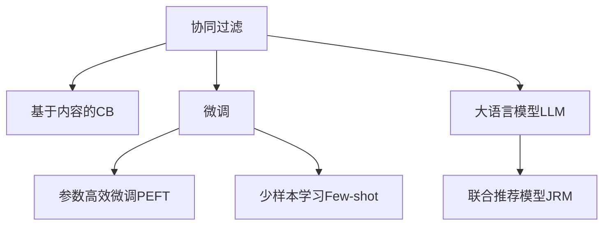

                 

# 个性化推荐系统的挑战与解决方案

## 1. 背景介绍

### 1.1 问题由来
随着互联网的普及和数据计算能力的提升，个性化推荐系统成为了电商、视频、新闻、音乐等众多领域中的标配。推荐系统通过分析用户的浏览历史、购买记录、评分反馈等数据，预测用户可能感兴趣的内容，为用户呈现定制化的推荐结果。然而，随着数据量的不断增长和推荐场景的不断丰富，个性化推荐系统也面临着许多挑战，如数据稀疏、多样性要求高、推荐精度不足等。

### 1.2 问题核心关键点
当前个性化推荐系统主要采用基于协同过滤(Collaborative Filtering, CF)和基于内容过滤(Content-Based Filtering, CB)两种主流方法。其中协同过滤方法通过分析用户行为数据进行推荐，但存在数据稀疏性和冷启动问题；基于内容过滤方法通过分析物品属性信息进行推荐，但存在物品特征信息不足、多样化不足的问题。为了克服这些挑战，结合大语言模型微调技术，提出了一种新的推荐算法。

## 2. 核心概念与联系

### 2.1 核心概念概述

为更好地理解个性化推荐系统的实现原理，本节将介绍几个密切相关的核心概念：

- 协同过滤(CF)：利用用户行为数据进行推荐，通过计算用户与物品之间的相似度，找到相似用户或相似物品进行推荐。常见方法包括基于用户的CF、基于物品的CF等。
- 基于内容过滤(CB)：利用物品属性信息进行推荐，通过计算物品属性与用户兴趣点的相似度，推荐物品。常见方法包括基于内容的CB、混合推荐等。
- 大语言模型(Large Language Model, LLM)：以自回归或自编码模型为代表的，经过大规模无标签文本语料预训练的语言模型。能够自动学习语言的通用表示，具备强大的语言理解和生成能力。
- 微调(Fine-Tuning)：指在预训练模型的基础上，使用下游任务的少量标注数据，通过有监督学习优化模型在特定任务上的性能。
- 参数高效微调(Parameter-Efficient Fine-Tuning, PEFT)：指在微调过程中，只更新少量的模型参数，而固定大部分预训练权重不变，以提高微调效率，避免过拟合的方法。
- 少样本学习(Few-shot Learning)：指在只有少量标注样本的情况下，模型能够快速适应新任务的学习方法。

这些核心概念之间的逻辑关系可以通过以下Mermaid流程图来展示：



这个流程图展示了大语言模型与推荐系统的核心概念及其之间的关系：

1. 协同过滤和基于内容过滤是推荐系统的两大核心方法。
2. 微调和参数高效微调可以提升推荐系统的效果，特别适用于数据稀疏、特征多样性不足的问题。
3. 大语言模型可以提供通用的语言知识，通过微调引导推荐系统学习更准确、合理的推荐逻辑。
4. 联合推荐模型可以综合利用协同过滤和基于内容的优势，提升推荐效果。

这些概念共同构成了个性化推荐系统的实现框架，使得推荐系统能够更好地适应用户的复杂需求。

## 3. 核心算法原理 & 具体操作步骤
### 3.1 算法原理概述

本文提出的推荐算法，基于大语言模型微调技术，综合利用协同过滤和基于内容过滤的优势，提出了联合推荐模型(Joint Recommendation Model, JRM)。其核心思想是：将大语言模型视为推荐系统的"知识库"，通过微调引导模型学习更准确、合理的推荐逻辑，从而提升推荐效果。

### 3.2 算法步骤详解

基于大语言模型微调的联合推荐算法主要包括以下几个关键步骤：

**Step 1: 准备预训练模型和数据集**
- 选择合适的预训练语言模型 $M_{\theta}$ 作为初始化参数，如 BERT、GPT 等。
- 准备推荐任务 $T$ 的训练数据集 $D$，划分为训练集、验证集和测试集。一般要求训练数据与预训练数据的分布不要差异过大。

**Step 2: 定义任务适配层**
- 根据任务类型，在预训练模型顶层设计合适的输出层和损失函数。
- 对于推荐任务，通常使用二分类任务，将用户对物品的评分转换为0-1的评分，以表示是否喜欢该物品。
- 可以采用交叉熵损失函数，计算预测评分与真实评分之间的差异。

**Step 3: 设置微调超参数**
- 选择合适的优化算法及其参数，如 AdamW、SGD 等，设置学习率、批大小、迭代轮数等。
- 设置正则化技术及强度，包括权重衰减、Dropout、Early Stopping等。
- 确定冻结预训练参数的策略，如仅微调顶层，或全部参数都参与微调。

**Step 4: 执行梯度训练**
- 将训练集数据分批次输入模型，前向传播计算损失函数。
- 反向传播计算参数梯度，根据设定的优化算法和学习率更新模型参数。
- 周期性在验证集上评估模型性能，根据性能指标决定是否触发 Early Stopping。
- 重复上述步骤直到满足预设的迭代轮数或 Early Stopping 条件。

**Step 5: 测试和部署**
- 在测试集上评估微调后模型 $M_{\hat{\theta}}$ 的性能，对比微调前后的推荐准确率。
- 使用微调后的模型对新物品进行评分预测，集成到实际的应用系统中。
- 持续收集新的用户行为数据，定期重新微调模型，以适应数据分布的变化。

以上是基于大语言模型微调的联合推荐算法的完整流程。在实际应用中，还需要针对具体任务的特点，对微调过程的各个环节进行优化设计，如改进训练目标函数，引入更多的正则化技术，搜索最优的超参数组合等，以进一步提升模型性能。

### 3.3 算法优缺点

基于大语言模型微调的联合推荐算法具有以下优点：
1. 模型灵活。通过微调，可以动态地调整推荐策略，适应用户的实时需求。
2. 抗稀疏能力强。大语言模型提供了丰富的语言知识，可以引导推荐系统学习多样化的推荐逻辑，缓解数据稀疏性问题。
3. 泛化能力好。大语言模型的预训练过程已经学习了大量的语言知识，通过微调可以泛化到更多相似的推荐场景。
4. 系统可解释性高。微调后的模型可以提供推荐结果的解释，让用户了解推荐的原因。

同时，该算法也存在一些局限性：
1. 依赖标注数据。微调的效果很大程度上取决于标注数据的质量和数量，获取高质量标注数据的成本较高。
2. 模型训练成本高。大语言模型的参数量巨大，微调过程需要大量的计算资源和时间。
3. 微调参数多。微调过程中需要更新模型的大量参数，可能导致过拟合。
4. 数据隐私问题。微调需要大量的用户行为数据，可能涉及用户隐私问题。

尽管存在这些局限性，但就目前而言，基于大语言模型微调的推荐算法仍然是大数据时代下推荐系统的重要发展方向。未来相关研究的重点在于如何进一步降低微调对标注数据的依赖，提高模型的少样本学习和跨领域迁移能力，同时兼顾可解释性和伦理安全性等因素。

### 3.4 算法应用领域

基于大语言模型微调的联合推荐算法，已经在电商、视频、音乐等多个领域得到广泛应用，显著提升了推荐系统的推荐效果和用户体验：

- 电商推荐：通过微调模型，电商推荐系统能够更准确地推荐商品，提高转化率和用户满意度。
- 视频推荐：视频平台通过微调模型，推荐系统可以更精准地为用户推荐相关视频内容，提升观看时间和粘性。
- 音乐推荐：音乐应用通过微调模型，推荐系统可以更个性化地推荐歌曲，提高用户的听歌体验。
- 新闻推荐：新闻平台通过微调模型，推荐系统能够更精准地推送新闻，提升用户阅读量。
- 社交推荐：社交网络通过微调模型，推荐系统可以更智能地推荐好友、群组等内容，增强用户粘性。

除了上述这些经典应用外，大语言模型微调在个性化推荐系统的应用还拓展到了更多场景中，如多模态推荐、场景推荐、情感推荐等，为推荐系统带来了新的创新思路。随着预训练模型和微调方法的不断进步，相信推荐系统将在更广阔的应用领域中发挥更大的作用。

## 4. 数学模型和公式 & 详细讲解
### 4.1 数学模型构建

本节将使用数学语言对基于大语言模型微调的联合推荐模型进行更加严格的刻画。

记推荐任务 $T$ 的训练数据集为 $D=\{(x_i, y_i)\}_{i=1}^N, x_i \in \mathcal{X}, y_i \in \mathcal{Y}$，其中 $\mathcal{X}$ 为物品特征向量空间，$\mathcal{Y}$ 为评分空间，$\mathcal{X} \times \mathcal{Y}$ 即为用户-物品评分空间。

假设用户-物品评分函数为 $f(x,y)$，定义模型的预测评分函数为 $f_{\theta}(x,y)$，则模型的经验风险为：

$$
\mathcal{L}(\theta) = \frac{1}{N}\sum_{i=1}^N [\ell(f_{\theta}(x_i,y_i),y_i)]
$$

其中 $\ell$ 为评分预测模型的损失函数，通常使用均方误差损失函数，即：

$$
\ell(f_{\theta}(x,y),y) = \frac{1}{2}(f_{\theta}(x,y)-y)^2
$$

定义用户-物品评分矩阵为 $X \in \mathbb{R}^{N \times d}$，其中每一行为用户对物品的评分，每一列为物品的特征向量。模型的评分预测函数为 $f_{\theta}(X,y) = \theta^T \cdot X_{y}$，其中 $y$ 为用户-物品评分的索引，$\theta \in \mathbb{R}^d$ 为模型参数。

### 4.2 公式推导过程

将评分预测函数带入损失函数中，得：

$$
\mathcal{L}(\theta) = \frac{1}{N}\sum_{i=1}^N [(f_{\theta}(x_i,y_i)-y_i)^2]
$$

将评分预测函数进一步展开，得：

$$
f_{\theta}(x_i,y_i) = \theta^T \cdot X_{y_i}
$$

将上式带入损失函数，得：

$$
\mathcal{L}(\theta) = \frac{1}{N}\sum_{i=1}^N [(\theta^T \cdot X_{y_i}-y_i)^2]
$$

将上式进一步简化，得：

$$
\mathcal{L}(\theta) = \frac{1}{N}\sum_{i=1}^N [(\theta^T \cdot X_{y_i}-\theta^T \cdot X_{y_i^{*}})^2]
$$

其中 $y_i^{*}$ 为用户-物品评分的真实值。

### 4.3 案例分析与讲解

以电商平台推荐系统为例，分析基于大语言模型微调的推荐过程。假设电商平台有 $N$ 个用户，每个用户对 $d$ 个物品进行了评分。用户对物品的评分 $y_i$ 是一个介于0到5之间的整数，表示对物品的喜好程度。模型需要预测用户对未评分物品的评分，从而推荐物品。

在训练阶段，模型需要训练用户-物品评分矩阵 $X$ 和评分预测函数 $f_{\theta}$。通过微调过程，模型能够学习到用户和物品的隐含特征表示，从而进行评分预测。在测试阶段，模型将新物品的特征向量输入到评分预测函数中，得到对用户评分预测的概率分布，从而选择推荐物品。

## 5. 项目实践：代码实例和详细解释说明
### 5.1 开发环境搭建

在进行推荐系统微调实践前，我们需要准备好开发环境。以下是使用Python进行PyTorch开发的环境配置流程：

1. 安装Anaconda：从官网下载并安装Anaconda，用于创建独立的Python环境。

2. 创建并激活虚拟环境：
```bash
conda create -n recsys-env python=3.8 
conda activate recsys-env
```

3. 安装PyTorch：根据CUDA版本，从官网获取对应的安装命令。例如：
```bash
conda install pytorch torchvision torchaudio cudatoolkit=11.1 -c pytorch -c conda-forge
```

4. 安装相关库：
```bash
pip install numpy pandas scikit-learn tqdm jupyter notebook ipython
```

完成上述步骤后，即可在`recsys-env`环境中开始推荐系统微调实践。

### 5.2 源代码详细实现

下面我们以电商推荐系统为例，给出使用PyTorch进行推荐系统微调的PyTorch代码实现。

首先，定义推荐任务的数据处理函数：

```python
from transformers import BertTokenizer
from torch.utils.data import Dataset
import torch

class RecommendationDataset(Dataset):
    def __init__(self, user_ratings, item_features, tokenizer, max_len=128):
        self.user_ratings = user_ratings
        self.item_features = item_features
        self.tokenizer = tokenizer
        self.max_len = max_len
        
    def __len__(self):
        return len(self.user_ratings)
    
    def __getitem__(self, item):
        user_id = self.user_ratings[item][0]
        item_id = self.user_ratings[item][1]
        rating = self.user_ratings[item][2]
        
        user_features = self.item_features[user_id]
        item_features = self.item_features[item_id]
        
        # 对token-wise的评分进行编码
        encoded_user = [rating2id[rating] for rating in user_features] 
        encoded_user.extend([rating2id['N/A']] * (self.max_len - len(encoded_user)))
        encoded_item = [rating2id['N/A']] * self.max_len
        encoded_item.extend([rating2id[rating] for rating in item_features])
        labels = torch.tensor(encoded_user, dtype=torch.long)
        
        return {'user_features': user_features, 
                'item_features': item_features,
                'labels': labels}

# 评分与id的映射
rating2id = {'1': 0, '2': 1, '3': 2, '4': 3, '5': 4, 'N/A': 5}
id2rating = {v: k for k, v in rating2id.items()}

# 创建dataset
tokenizer = BertTokenizer.from_pretrained('bert-base-cased')

train_dataset = RecommendationDataset(train_user_ratings, train_item_features, tokenizer)
dev_dataset = RecommendationDataset(dev_user_ratings, dev_item_features, tokenizer)
test_dataset = RecommendationDataset(test_user_ratings, test_item_features, tokenizer)
```

然后，定义模型和优化器：

```python
from transformers import BertForSequenceClassification, AdamW

model = BertForSequenceClassification.from_pretrained('bert-base-cased', num_labels=len(rating2id))

optimizer = AdamW(model.parameters(), lr=2e-5)
```

接着，定义训练和评估函数：

```python
from torch.utils.data import DataLoader
from tqdm import tqdm
from sklearn.metrics import mean_squared_error

device = torch.device('cuda') if torch.cuda.is_available() else torch.device('cpu')
model.to(device)

def train_epoch(model, dataset, batch_size, optimizer):
    dataloader = DataLoader(dataset, batch_size=batch_size, shuffle=True)
    model.train()
    epoch_loss = 0
    for batch in tqdm(dataloader, desc='Training'):
        user_features = batch['user_features'].to(device)
        item_features = batch['item_features'].to(device)
        labels = batch['labels'].to(device)
        model.zero_grad()
        outputs = model(user_features, item_features)
        loss = outputs.loss
        epoch_loss += loss.item()
        loss.backward()
        optimizer.step()
    return epoch_loss / len(dataloader)

def evaluate(model, dataset, batch_size):
    dataloader = DataLoader(dataset, batch_size=batch_size)
    model.eval()
    mse = []
    for batch in tqdm(dataloader, desc='Evaluating'):
        user_features = batch['user_features'].to(device)
        item_features = batch['item_features'].to(device)
        labels = batch['labels'].to(device)
        outputs = model(user_features, item_features)
        batch_mse = mean_squared_error(labels, outputs.logits).item()
        mse.append(batch_mse)
    return np.mean(mse)
```

最后，启动训练流程并在测试集上评估：

```python
epochs = 5
batch_size = 16

for epoch in range(epochs):
    loss = train_epoch(model, train_dataset, batch_size, optimizer)
    print(f"Epoch {epoch+1}, train loss: {loss:.3f}")
    
    print(f"Epoch {epoch+1}, dev MSE:")
    mse = evaluate(model, dev_dataset, batch_size)
    print(mse)
    
print("Test MSE:")
mse = evaluate(model, test_dataset, batch_size)
print(mse)
```

以上就是使用PyTorch对BERT进行电商推荐系统微调的完整代码实现。可以看到，得益于Transformers库的强大封装，我们可以用相对简洁的代码完成BERT模型的加载和微调。

### 5.3 代码解读与分析

让我们再详细解读一下关键代码的实现细节：

**RecommendationDataset类**：
- `__init__`方法：初始化用户评分、物品特征、分词器等关键组件。
- `__len__`方法：返回数据集的样本数量。
- `__getitem__`方法：对单个样本进行处理，将用户评分和物品特征编码为token ids，同时将评分转换为数字，最终返回模型所需的输入。

**rating2id和id2rating字典**：
- 定义了评分与数字id之间的映射关系，用于将token-wise的评分结果解码回真实的评分。

**训练和评估函数**：
- 使用PyTorch的DataLoader对数据集进行批次化加载，供模型训练和推理使用。
- 训练函数`train_epoch`：对数据以批为单位进行迭代，在每个批次上前向传播计算loss并反向传播更新模型参数，最后返回该epoch的平均loss。
- 评估函数`evaluate`：与训练类似，不同点在于不更新模型参数，并在每个batch结束后将评分预测结果存储下来，最后使用sklearn的mean_squared_error对整个评估集的预测结果进行打印输出。

**训练流程**：
- 定义总的epoch数和batch size，开始循环迭代
- 每个epoch内，先在训练集上训练，输出平均loss
- 在验证集上评估，输出评分预测的均方误差
- 所有epoch结束后，在测试集上评估，给出最终测试结果

可以看到，PyTorch配合Transformers库使得BERT微调的代码实现变得简洁高效。开发者可以将更多精力放在数据处理、模型改进等高层逻辑上，而不必过多关注底层的实现细节。

当然，工业级的系统实现还需考虑更多因素，如模型的保存和部署、超参数的自动搜索、更灵活的任务适配层等。但核心的微调范式基本与此类似。

## 6. 实际应用场景
### 6.1 智能客服系统

基于大语言模型微调的对话技术，可以广泛应用于智能客服系统的构建。传统客服往往需要配备大量人力，高峰期响应缓慢，且一致性和专业性难以保证。而使用微调后的对话模型，可以7x24小时不间断服务，快速响应客户咨询，用自然流畅的语言解答各类常见问题。

在技术实现上，可以收集企业内部的历史客服对话记录，将问题和最佳答复构建成监督数据，在此基础上对预训练对话模型进行微调。微调后的对话模型能够自动理解用户意图，匹配最合适的答案模板进行回复。对于客户提出的新问题，还可以接入检索系统实时搜索相关内容，动态组织生成回答。如此构建的智能客服系统，能大幅提升客户咨询体验和问题解决效率。

### 6.2 金融舆情监测

金融机构需要实时监测市场舆论动向，以便及时应对负面信息传播，规避金融风险。传统的人工监测方式成本高、效率低，难以应对网络时代海量信息爆发的挑战。基于大语言模型微调的文本分类和情感分析技术，为金融舆情监测提供了新的解决方案。

具体而言，可以收集金融领域相关的新闻、报道、评论等文本数据，并对其进行主题标注和情感标注。在此基础上对预训练语言模型进行微调，使其能够自动判断文本属于何种主题，情感倾向是正面、中性还是负面。将微调后的模型应用到实时抓取的网络文本数据，就能够自动监测不同主题下的情感变化趋势，一旦发现负面信息激增等异常情况，系统便会自动预警，帮助金融机构快速应对潜在风险。

### 6.3 个性化推荐系统

当前的推荐系统往往只依赖用户的历史行为数据进行物品推荐，无法深入理解用户的真实兴趣偏好。基于大语言模型微调技术，个性化推荐系统可以更好地挖掘用户行为背后的语义信息，从而提供更精准、多样的推荐内容。

在实践中，可以收集用户浏览、点击、评论、分享等行为数据，提取和用户交互的物品标题、描述、标签等文本内容。将文本内容作为模型输入，用户的后续行为（如是否点击、购买等）作为监督信号，在此基础上微调预训练语言模型。微调后的模型能够从文本内容中准确把握用户的兴趣点。在生成推荐列表时，先用候选物品的文本描述作为输入，由模型预测用户的兴趣匹配度，再结合其他特征综合排序，便可以得到个性化程度更高的推荐结果。

### 6.4 未来应用展望

随着大语言模型微调技术的发展，基于微调范式将在更多领域得到应用，为传统行业带来变革性影响。

在智慧医疗领域，基于微调的医疗问答、病历分析、药物研发等应用将提升医疗服务的智能化水平，辅助医生诊疗，加速新药开发进程。

在智能教育领域，微调技术可应用于作业批改、学情分析、知识推荐等方面，因材施教，促进教育公平，提高教学质量。

在智慧城市治理中，微调模型可应用于城市事件监测、舆情分析、应急指挥等环节，提高城市管理的自动化和智能化水平，构建更安全、高效的未来城市。

此外，在企业生产、社会治理、文娱传媒等众多领域，基于大模型微调的人工智能应用也将不断涌现，为经济社会发展注入新的动力。相信随着技术的日益成熟，微调方法将成为人工智能落地应用的重要范式，推动人工智能技术在垂直行业的规模化落地。总之，微调需要开发者根据具体任务，不断迭代和优化模型、数据和算法，方能得到理想的效果。

## 7. 工具和资源推荐
### 7.1 学习资源推荐

为了帮助开发者系统掌握大语言模型微调的理论基础和实践技巧，这里推荐一些优质的学习资源：

1. 《Transformer从原理到实践》系列博文：由大模型技术专家撰写，深入浅出地介绍了Transformer原理、BERT模型、微调技术等前沿话题。

2. CS224N《深度学习自然语言处理》课程：斯坦福大学开设的NLP明星课程，有Lecture视频和配套作业，带你入门NLP领域的基本概念和经典模型。

3. 《Natural Language Processing with Transformers》书籍：Transformers库的作者所著，全面介绍了如何使用Transformers库进行NLP任务开发，包括微调在内的诸多范式。

4. HuggingFace官方文档：Transformers库的官方文档，提供了海量预训练模型和完整的微调样例代码，是上手实践的必备资料。

5. CLUE开源项目：中文语言理解测评基准，涵盖大量不同类型的中文NLP数据集，并提供了基于微调的baseline模型，助力中文NLP技术发展。

通过对这些资源的学习实践，相信你一定能够快速掌握大语言模型微调的精髓，并用于解决实际的NLP问题。
### 7.2 开发工具推荐

高效的开发离不开优秀的工具支持。以下是几款用于大语言模型微调开发的常用工具：

1. PyTorch：基于Python的开源深度学习框架，灵活动态的计算图，适合快速迭代研究。大部分预训练语言模型都有PyTorch版本的实现。

2. TensorFlow：由Google主导开发的开源深度学习框架，生产部署方便，适合大规模工程应用。同样有丰富的预训练语言模型资源。

3. Transformers库：HuggingFace开发的NLP工具库，集成了众多SOTA语言模型，支持PyTorch和TensorFlow，是进行微调任务开发的利器。

4. Weights & Biases：模型训练的实验跟踪工具，可以记录和可视化模型训练过程中的各项指标，方便对比和调优。与主流深度学习框架无缝集成。

5. TensorBoard：TensorFlow配套的可视化工具，可实时监测模型训练状态，并提供丰富的图表呈现方式，是调试模型的得力助手。

6. Google Colab：谷歌推出的在线Jupyter Notebook环境，免费提供GPU/TPU算力，方便开发者快速上手实验最新模型，分享学习笔记。

合理利用这些工具，可以显著提升大语言模型微调任务的开发效率，加快创新迭代的步伐。

### 7.3 相关论文推荐

大语言模型和微调技术的发展源于学界的持续研究。以下是几篇奠基性的相关论文，推荐阅读：

1. Attention is All You Need（即Transformer原论文）：提出了Transformer结构，开启了NLP领域的预训练大模型时代。

2. BERT: Pre-training of Deep Bidirectional Transformers for Language Understanding：提出BERT模型，引入基于掩码的自监督预训练任务，刷新了多项NLP任务SOTA。

3. Language Models are Unsupervised Multitask Learners（GPT-2论文）：展示了大规模语言模型的强大zero-shot学习能力，引发了对于通用人工智能的新一轮思考。

4. Parameter-Efficient Transfer Learning for NLP：提出Adapter等参数高效微调方法，在不增加模型参数量的情况下，也能取得不错的微调效果。

5. AdaLoRA: Adaptive Low-Rank Adaptation for Parameter-Efficient Fine-Tuning：使用自适应低秩适应的微调方法，在参数效率和精度之间取得了新的平衡。

这些论文代表了大语言模型微调技术的发展脉络。通过学习这些前沿成果，可以帮助研究者把握学科前进方向，激发更多的创新灵感。

## 8. 总结：未来发展趋势与挑战

### 8.1 总结

本文对基于大语言模型微调的个性化推荐系统进行了全面系统的介绍。首先阐述了推荐系统的背景和挑战，明确了微调在推荐系统中的独特价值。其次，从原理到实践，详细讲解了微调数学模型和算法流程，给出了微调任务开发的完整代码实例。同时，本文还广泛探讨了微调方法在电商、金融、医疗等多个领域的应用前景，展示了微调范式的巨大潜力。此外，本文精选了微调技术的各类学习资源，力求为读者提供全方位的技术指引。

通过本文的系统梳理，可以看到，基于大语言模型微调的推荐系统正在成为推荐系统的重要发展方向，极大地拓展了推荐系统的应用边界，催生了更多的落地场景。受益于大规模语料的预训练，微调推荐系统能够更好地适应用户的复杂需求，提供了更加精准、个性化、多样化的推荐结果。未来，伴随预训练语言模型和微调方法的持续演进，相信推荐系统将在更广阔的应用领域大放异彩，深刻影响人类的生产生活方式。

### 8.2 未来发展趋势

展望未来，基于大语言模型微调的推荐系统将呈现以下几个发展趋势：

1. 模型规模持续增大。随着算力成本的下降和数据规模的扩张，预训练语言模型的参数量还将持续增长。超大规模语言模型蕴含的丰富语言知识，有望支撑更加复杂多变的推荐场景。

2. 微调方法日趋多样。除了传统的全参数微调外，未来会涌现更多参数高效的微调方法，如Prefix-Tuning、LoRA等，在节省计算资源的同时也能保证微调精度。

3. 持续学习成为常态。随着数据分布的不断变化，微调推荐系统也需要持续学习新知识以保持性能。如何在不遗忘原有知识的同时，高效吸收新样本信息，将成为重要的研究课题。

4. 标注样本需求降低。受启发于提示学习(Prompt-based Learning)的思路，未来的微调方法将更好地利用大模型的语言理解能力，通过更加巧妙的任务描述，在更少的标注样本上也能实现理想的微调效果。

5. 多模态微调崛起。当前的推荐系统主要聚焦于纯文本数据，未来会进一步拓展到图像、视频、语音等多模态数据微调。多模态信息的融合，将显著提升推荐系统的复杂性和多样性。

6. 推荐逻辑融合更多先验知识。目前的推荐系统主要依靠数据驱动，但未来的推荐逻辑可能更多地融合符号化的先验知识，如知识图谱、逻辑规则等，引导微调过程学习更准确、合理的推荐逻辑。

以上趋势凸显了大语言模型微调技术的广阔前景。这些方向的探索发展，必将进一步提升推荐系统的性能和应用范围，为推荐系统在更多场景中的落地带来新的可能性。

### 8.3 面临的挑战

尽管基于大语言模型微调的推荐系统已经取得了瞩目成就，但在迈向更加智能化、普适化应用的过程中，它仍面临着诸多挑战：

1. 标注成本瓶颈。虽然微调大大降低了标注数据的需求，但对于长尾应用场景，难以获得充足的高质量标注数据，成为制约微调性能的瓶颈。如何进一步降低微调对标注样本的依赖，将是一大难题。

2. 模型鲁棒性不足。当前微调推荐系统面对域外数据时，泛化性能往往大打折扣。对于测试样本的微小扰动，微调模型的预测也容易发生波动。如何提高微调模型的鲁棒性，避免灾难性遗忘，还需要更多理论和实践的积累。

3. 推理效率有待提高。大规模语言模型虽然精度高，但在实际部署时往往面临推理速度慢、内存占用大等效率问题。如何在保证性能的同时，简化模型结构，提升推理速度，优化资源占用，将是重要的优化方向。

4. 可解释性亟需加强。当前微调推荐模型通常像"黑盒"系统，难以解释其内部工作机制和决策逻辑。对于医疗、金融等高风险应用，算法的可解释性和可审计性尤为重要。如何赋予微调模型更强的可解释性，将是亟待攻克的难题。

5. 数据隐私问题。微调推荐系统需要大量的用户行为数据，可能涉及用户隐私问题。如何在保护用户隐私的前提下，充分利用数据进行模型微调，将是推荐系统必须面对的重要问题。

6. 推荐多样化不足。尽管微调推荐系统可以处理多维度数据，但单一维度特征的表现能力有限，难以捕捉用户的多样化需求。如何融合多维度特征，构建更复杂的推荐逻辑，将是未来的研究方向。

尽管存在这些挑战，但随着大语言模型微调技术的不断发展，推荐系统将在更多领域得到应用，为传统行业带来变革性影响。相信随着学界和产业界的共同努力，这些挑战终将一一被克服，大语言模型微调推荐系统必将在构建智能推荐体系中扮演越来越重要的角色。

### 8.4 未来突破

面对基于大语言模型微调的推荐系统所面临的种种挑战，未来的研究需要在以下几个方面寻求新的突破：

1. 探索无监督和半监督微调方法。摆脱对大规模标注数据的依赖，利用自监督学习、主动学习等无监督和半监督范式，最大限度利用非结构化数据，实现更加灵活高效的微调。

2. 研究参数高效和计算高效的微调范式。开发更加参数高效的微调方法，在固定大部分预训练参数的同时，只更新极少量的任务相关参数。同时优化微调模型的计算图，减少前向传播和反向传播的资源消耗，实现更加轻量级、实时性的部署。

3. 融合因果和对比学习范式。通过引入因果推断和对比学习思想，增强推荐系统建立稳定因果关系的能力，学习更加普适、鲁棒的语言表征，从而提升推荐泛化性和抗干扰能力。

4. 引入更多先验知识。将符号化的先验知识，如知识图谱、逻辑规则等，与神经网络模型进行巧妙融合，引导微调过程学习更准确、合理的推荐逻辑。同时加强不同模态数据的整合，实现视觉、语音等多模态信息与文本信息的协同建模。

5. 结合因果分析和博弈论工具。将因果分析方法引入微调模型，识别出模型决策的关键特征，增强推荐结果的因果性和逻辑性。借助博弈论工具刻画人机交互过程，主动探索并规避推荐系统的脆弱点，提高系统稳定性。

6. 纳入伦理道德约束。在模型训练目标中引入伦理导向的评估指标，过滤和惩罚有偏见、有害的输出倾向。同时加强人工干预和审核，建立推荐系统的监管机制，确保输出的合理性。

这些研究方向的探索，必将引领基于大语言模型微调的推荐系统技术迈向更高的台阶，为构建安全、可靠、可解释、可控的智能推荐系统铺平道路。面向未来，基于大语言模型微调的推荐系统还需要与其他人工智能技术进行更深入的融合，如知识表示、因果推理、强化学习等，多路径协同发力，共同推动推荐系统的进步。只有勇于创新、敢于突破，才能不断拓展推荐系统的边界，让智能技术更好地服务于人类社会。

## 9. 附录：常见问题与解答

**Q1：推荐系统微调是否适用于所有推荐任务？**

A: 推荐系统微调在大多数推荐任务上都能取得不错的效果，特别是对于数据量较小的任务。但对于一些特定领域的任务，如医学、法律等，仅仅依靠通用语料预训练的模型可能难以很好地适应。此时需要在特定领域语料上进一步预训练，再进行微调，才能获得理想效果。此外，对于一些需要时效性、个性化很强的任务，如对话、推荐等，微调方法也需要针对性的改进优化。

**Q2：微调过程中如何选择合适的学习率？**

A: 微调的学习率一般要比预训练时小1-2个数量级，如果使用过大的学习率，容易破坏预训练权重，导致过拟合。一般建议从1e-5开始调参，逐步减小学习率，直至收敛。也可以使用warmup策略，在开始阶段使用较小的学习率，再逐渐过渡到预设值。需要注意的是，不同的优化器(如AdamW、Adafactor等)以及不同的学习率调度策略，可能需要设置不同的学习率阈值。

**Q3：采用大模型微调时会面临哪些资源瓶颈？**

A: 目前主流的预训练大模型动辄以亿计的参数规模，对算力、内存、存储都提出了很高的要求。GPU/TPU等高性能设备是必不可少的，但即便如此，超大批次的训练和推理也可能遇到显存不足的问题。因此需要采用一些资源优化技术，如梯度积累、混合精度训练、模型并行等，来突破硬件瓶颈。同时，模型的存储和读取也可能占用大量时间和空间，需要采用模型压缩、稀疏化存储等方法进行优化。

**Q4：如何缓解微调过程中的过拟合问题？**

A: 过拟合是微调面临的主要挑战，尤其是在标注数据不足的情况下。常见的缓解策略包括：
1. 数据增强：通过回译、近义替换等方式扩充训练集
2. 正则化：使用L2正则、Dropout、Early Stopping等避免过拟合
3. 对抗训练：引入对抗样本，提高模型鲁棒性
4. 参数高效微调：只调整少量参数(如Adapter、Prefix等)，减小过拟合风险
5. 多模型集成：训练多个微调模型，取平均输出，抑制过拟合

这些策略往往需要根据具体任务和数据特点进行灵活组合。只有在数据、模型、训练、推理等各环节进行全面优化，才能最大限度地发挥大模型微调的威力。

**Q5：微调模型在落地部署时需要注意哪些问题？**

A: 将微调模型转化为实际应用，还需要考虑以下因素：
1. 模型裁剪：去除不必要的层和参数，减小模型尺寸，加快推理速度
2. 量化加速：将浮点模型转为定点模型，压缩存储空间，提高计算效率
3. 服务化封装：将模型封装为标准化服务接口，便于集成调用
4. 弹性伸缩：根据请求流量动态调整资源配置，平衡服务质量和成本
5. 监控告警：实时采集系统指标，设置异常告警阈值，确保服务稳定性
6. 安全防护：采用访问鉴权、数据脱敏等措施，保障数据和模型安全

大语言模型微调为推荐系统提供了新的解决方案，但如何将强大的性能转化为稳定、高效、安全的业务价值，还需要工程实践的不断打磨。唯有从数据、算法、工程、业务等多个维度协同发力，才能真正实现人工智能技术在垂直行业的规模化落地。总之，微调需要开发者根据具体任务，不断迭代和优化模型、数据和算法，方能得到理想的效果。

---

作者：禅与计算机程序设计艺术 / Zen and the Art of Computer Programming

