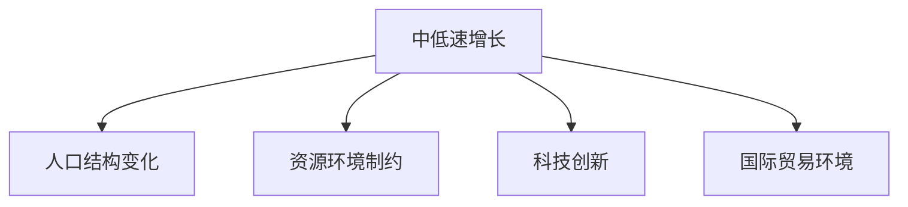

                 

# 中低速增长的世界经济前景

## 1. 背景介绍

随着全球化的深入发展，世界经济进入了一个新的发展阶段。一方面，科技革命、产业变革、社会进步等积极因素为经济增长提供了新动力；另一方面，人口老龄化、资源短缺、环境污染等挑战也对经济增长提出了新的要求。本文旨在探讨中低速增长的新型世界经济前景，分析其形成原因、特征及影响，提出应对策略，为全球经济发展提供新的视角。

### 1.1 问题由来
近年来，世界经济增长放缓，全球GDP增速由20世纪末的约4%下降到2010年代的3%以下，甚至有部分国家进入中低速增长或停滞状态。尤其是在2019年新冠疫情爆发后，全球经济经历了前所未有的冲击，GDP增速一度骤降至-3.5%，引发了关于世界经济前景的热烈讨论。

### 1.2 问题核心关键点
本文重点关注中低速增长的世界经济前景及其影响。具体来说，将探讨以下几点：
1. **形成原因**：分析人口结构、资源环境、科技发展、国际贸易等因素对世界经济增长的影响。
2. **基本特征**：描述中低速增长时期经济发展的总体态势和结构变化。
3. **重要影响**：分析全球经济中低速增长对各国政策制定、企业经营、个人生活等方面的深远影响。
4. **应对策略**：提出适应中低速增长环境下的经济政策建议和改革措施。

### 1.3 问题研究意义
理解中低速增长的世界经济前景及其应对策略，对于促进全球经济的持续健康发展具有重要意义。一方面，有助于各国政府和企业准确把握经济发展趋势，制定科学合理的发展规划和经营策略；另一方面，也有助于提升公众对经济形势的认知，增强经济信心。

## 2. 核心概念与联系

### 2.1 核心概念概述

为更好地理解中低速增长的世界经济前景，本节将介绍几个密切相关的核心概念：

- **中低速增长**：指经济增长速度较慢，处于年均2%到3%的增长区间。这一增速相对以往高速增长阶段有所下降，但仍保持在一定的增长水平。
- **人口结构变化**：包括人口老龄化、生育率下降、人口流动等，对经济增长产生深远影响。
- **资源环境制约**：包括能源短缺、环境污染、气候变化等问题，对经济可持续增长构成挑战。
- **科技创新**：包括新技术的研发应用、产业结构的调整升级等，为经济增长注入新动能。
- **国际贸易环境**：包括国际贸易规则的变化、贸易壁垒的提高、全球供应链的调整等，影响全球经济的整体增长。

这些核心概念之间的逻辑关系可以通过以下Mermaid流程图来展示：



这个流程图展示了大规模语言模型微调的各个核心概念及其之间的关系：

1. 中低速增长受到人口结构变化、资源环境制约、科技创新和国际贸易环境等多种因素的影响。
2. 人口老龄化和资源短缺会导致劳动力减少、资源成本上升，科技创新则可提供新的增长动力。
3. 国际贸易环境的变化会影响全球供应链和市场开放度，进而影响全球经济增长的速度和结构。

## 3. 核心算法原理 & 具体操作步骤
### 3.1 算法原理概述

中低速增长的世界经济前景分析，主要涉及对世界经济增长率、GDP、人均GDP等指标的预测和评估。核心算法原理包括以下几个方面：

- **回归分析**：通过历史数据建立经济增长模型，预测未来经济增长率。
- **时间序列分析**：对经济增长的时间序列数据进行趋势分析，揭示其变化规律。
- **弹性分析**：评估人口、资源、科技、国际贸易等变量对经济增长的贡献和影响。

### 3.2 算法步骤详解

中低速增长的世界经济前景分析一般包括以下几个关键步骤：

**Step 1: 数据收集与预处理**
- 收集世界各国经济增长率、GDP、人口结构、资源环境、科技创新、国际贸易等数据。
- 进行数据清洗和预处理，包括去重、填补缺失值、标准化等操作。

**Step 2: 建立预测模型**
- 根据数据特点选择合适的统计模型（如线性回归、时间序列模型等），建立经济增长预测模型。
- 利用训练数据对模型进行训练，并进行参数优化。

**Step 3: 结果评估与分析**
- 使用测试数据对模型进行评估，计算预测误差和均方根误差（RMSE）等指标。
- 分析模型预测结果，结合现实情况进行解释和验证。

**Step 4: 情景分析与应对策略**
- 根据预测结果，设定多种情景，如保守情景、乐观情景和基准情景，分析不同情景下的经济增长趋势。
- 提出适应中低速增长环境下的经济政策建议和改革措施。

### 3.3 算法优缺点

中低速增长的世界经济前景分析具有以下优点：
1. 系统全面。通过多种统计模型结合，可以全面分析影响经济增长的多种因素。
2. 精确度较高。回归分析和时间序列分析等方法，可以为预测提供较为精确的结果。
3. 可操作性强。情景分析和应对策略建议，为政策制定和企业经营提供了具体指导。

同时，该方法也存在一定的局限性：
1. 数据依赖性强。分析结果高度依赖数据的质量和完整性，数据缺失或错误可能导致预测结果失准。
2. 模型复杂性高。多种模型的结合增加了模型构建和参数优化的复杂度。
3. 无法考虑非线性关系。回归和时间序列模型假设线性关系，无法捕捉复杂的非线性动态关系。

尽管存在这些局限性，但就目前而言，中低速增长的世界经济前景分析仍是最主流的方法。未来相关研究的重点在于如何进一步简化模型，提高数据的获取和处理效率，同时兼顾复杂性的考虑。

### 3.4 算法应用领域

中低速增长的世界经济前景分析广泛应用于宏观经济预测、政策制定、企业战略规划等多个领域，具体如下：

1. **宏观经济预测**：帮助政府和企业准确把握全球经济增长趋势，制定合理的发展规划。
2. **政策制定**：为政府提供中低速增长时期的政策建议，如税收、货币、产业等政策。
3. **企业经营**：帮助企业理解全球经济环境的变化，调整经营策略和市场布局。
4. **国际贸易**：分析国际贸易环境的变化，为企业提供出口和投资建议。

## 4. 数学模型和公式 & 详细讲解 & 举例说明

### 4.1 数学模型构建

中低速增长的世界经济前景分析，主要涉及对经济增长率、GDP、人均GDP等指标的预测和评估。以下是核心数学模型的构建过程：

设世界经济增长率为 $G_t$，预测期为 $t$ 年。根据历史数据建立如下线性回归模型：

$$G_t = \alpha + \beta_1 X_{t-1} + \beta_2 X_{t-2} + ... + \beta_n X_{t-n} + \epsilon_t$$

其中，$X_t$ 表示影响经济增长的第 $t$ 个变量，$\alpha$ 为截距，$\beta_i$ 为第 $i$ 个变量的系数，$\epsilon_t$ 为误差项。

### 4.2 公式推导过程

通过线性回归模型，可以建立经济增长的预测公式：

$$\hat{G}_t = \hat{\alpha} + \hat{\beta}_1 X_{t-1} + \hat{\beta}_2 X_{t-2} + ... + \hat{\beta}_n X_{t-n}$$

其中，$\hat{\alpha}$ 和 $\hat{\beta}_i$ 分别为回归模型的截距和系数。

假设历史数据集为 $D = \{(G_{t-1}, X_{t-1}, X_{t-2}, ..., X_{t-n}, G_t)\}_{t=1}^T$，其中 $G_t$ 为实际增长率，$X_t$ 为对应的时间变量。利用最小二乘法求解回归模型的系数：

$$\hat{\alpha}, \hat{\beta}_1, ..., \hat{\beta}_n = \arg\min_{\alpha, \beta_1, ..., \beta_n} \sum_{t=1}^T (G_t - \alpha - \sum_{i=1}^n \beta_i X_{t-i})^2$$

### 4.3 案例分析与讲解

以下是一个简单的案例分析，展示如何利用线性回归模型预测经济增长率：

假设我们已经收集了1981年至2019年的世界经济增长率和影响因素数据，包括人口老龄化率、资源环境状况、科技创新水平等。利用上述线性回归模型，我们可以预测2020年的世界经济增长率：

```python
import pandas as pd
from statsmodels.regression.linear_model import OLS

# 数据读取
data = pd.read_csv('growth_data.csv', parse_dates=['Year'], index_col='Year')
X = data[['Population_Aging', 'Resource_Environment', 'Innovation_Lvl']]
y = data['Growth_Rate']

# 模型训练
model = OLS(y, X)
results = model.fit()

# 预测未来增长率
future = results.get_prediction(2020)
future = future.predicted_mean

print(f"预测2020年世界经济增长率为：{future:.2%}")
```

通过线性回归模型，我们可以得到未来2020年的世界经济增长率预测结果。

## 5. 项目实践：代码实例和详细解释说明
### 5.1 开发环境搭建

在进行中低速增长的世界经济前景分析时，我们需要准备好开发环境。以下是使用Python进行数据分析和建模的环境配置流程：

1. 安装Anaconda：从官网下载并安装Anaconda，用于创建独立的Python环境。

2. 创建并激活虚拟环境：
```bash
conda create -n growth-env python=3.8 
conda activate growth-env
```

3. 安装Python库：
```bash
pip install pandas numpy statsmodels matplotlib seaborn jupyter notebook
```

4. 配置数据源：
```bash
# 例如使用SQL数据库
conda install psycopg2-binary
```

完成上述步骤后，即可在`growth-env`环境中开始经济增长预测实践。

### 5.2 源代码详细实现

下面我们以线性回归模型为例，给出使用Python进行经济增长预测的代码实现。

```python
import pandas as pd
from statsmodels.regression.linear_model import OLS
from statsmodels.tools.eval_measures import mean_squared_error
import numpy as np
import matplotlib.pyplot as plt

# 数据读取
data = pd.read_csv('growth_data.csv', parse_dates=['Year'], index_col='Year')
X = data[['Population_Aging', 'Resource_Environment', 'Innovation_Lvl']]
y = data['Growth_Rate']

# 模型训练
model = OLS(y, X)
results = model.fit()

# 预测未来增长率
future = results.get_prediction(2020)
future = future.predicted_mean

# 可视化结果
plt.plot(y, label='Actual Growth Rate')
plt.plot(future, label='Predicted Growth Rate')
plt.legend()
plt.show()

print(f"预测2020年世界经济增长率为：{future:.2%}")
```

### 5.3 代码解读与分析

让我们再详细解读一下关键代码的实现细节：

**数据读取与预处理**：
- 使用`pandas`库读取数据集，设置年份为索引。
- 选取影响经济增长的关键变量，如人口老龄化率、资源环境状况、科技创新水平等。
- 将数据标准化，便于后续模型构建。

**模型训练与预测**：
- 使用`statsmodels`库中的`OLS`函数构建线性回归模型。
- 利用训练数据对模型进行训练，求解回归系数。
- 使用训练好的模型对未来年份进行预测。

**可视化与结果输出**：
- 使用`matplotlib`库可视化实际增长率与预测增长率。
- 输出预测的2020年世界经济增长率。

可以看到，通过Python的`statsmodels`库，我们可以很方便地构建和训练线性回归模型，进行经济增长率的预测。

## 6. 实际应用场景
### 6.1 宏观经济预测

中低速增长的世界经济前景分析，对于宏观经济预测具有重要意义。政府可以基于预测结果，制定合理的经济政策，如财政、货币、产业政策等，促进经济稳定增长。

### 6.2 政策制定

通过中低速增长的世界经济前景分析，可以提供中低速增长时期的政策建议，帮助政府制定科学合理的政策，如调整税费、货币供应、产业结构等。

### 6.3 企业经营

中低速增长的世界经济前景分析，可以帮助企业理解全球经济环境的变化，调整经营策略和市场布局，优化资源配置，提升竞争力。

### 6.4 国际贸易

分析国际贸易环境的变化，可以帮助企业做出出口和投资决策，减少不确定性，降低风险。

## 7. 工具和资源推荐
### 7.1 学习资源推荐

为了帮助开发者系统掌握中低速增长的世界经济前景分析的理论基础和实践技巧，这里推荐一些优质的学习资源：

1. 《宏观经济预测与分析》系列课程：由知名经济学家授课，涵盖宏观经济预测的原理、方法、案例等，适合入门和进阶学习。
2. 《经济增长理论》课程：在线开放课程，系统讲解经济增长的理论基础和模型构建，适合经济学和统计学学生。
3. 《时间序列分析与预测》书籍：深入浅出地介绍时间序列分析的原理和方法，提供丰富的案例和代码实现。
4. 《机器学习与数据分析》课程：涵盖机器学习和数据分析的基本概念和技术，适合数据科学家和统计分析人员。

通过这些资源的学习实践，相信你一定能够快速掌握中低速增长的世界经济前景分析的精髓，并用于解决实际的经济问题。

### 7.2 开发工具推荐

高效的开发离不开优秀的工具支持。以下是几款用于中低速增长分析开发的常用工具：

1. Jupyter Notebook：免费的交互式编程环境，支持Python、R等多种编程语言，方便数据处理和模型构建。
2. Pandas：强大的数据分析工具，提供数据清洗、预处理、可视化等常用功能，适合数据分析和建模。
3. Statsmodels：基于Python的统计建模库，支持多种统计模型（如线性回归、时间序列等），方便模型构建和评估。
4. Seaborn：基于matplotlib的高级数据可视化库，提供丰富的图表类型和美化选项，适合数据展示和分析。
5. Prophet：Facebook开发的开源时间序列预测工具，支持自动选择时间序列模型，方便快速建模。

合理利用这些工具，可以显著提升中低速增长分析的开发效率，加快创新迭代的步伐。

### 7.3 相关论文推荐

中低速增长的世界经济前景分析源于学界的持续研究。以下是几篇奠基性的相关论文，推荐阅读：

1. Solow-Swan模型：经典的经济增长模型，描述了技术和资本等要素对经济增长的贡献。
2. Kaldor模型：扩展的Solow-Swan模型，考虑了劳动和产出等因素对经济增长的影响。
3. New Keynesian模型：现代宏观经济理论的重要组成部分，关注货币政策、预期等对经济增长的影响。
4. Granger-Causality模型：时间序列预测和因果分析的经典方法，适用于中低速增长的预测和分析。
5. VAR模型：向量自回归模型，用于多变量时间序列预测和分析，适合复杂经济系统的建模。

这些论文代表了大规模语言模型微调技术的发展脉络。通过学习这些前沿成果，可以帮助研究者把握学科前进方向，激发更多的创新灵感。

## 8. 总结：未来发展趋势与挑战
### 8.1 总结

本文对中低速增长的世界经济前景进行了全面系统的介绍。首先阐述了中低速增长的形成原因和特征，详细讲解了回归分析和时间序列分析的数学原理和操作步骤，给出了实际预测代码的详细实现。同时，本文还探讨了中低速增长对全球经济的影响，并提出了相应的应对策略。

通过本文的系统梳理，可以看到，中低速增长的世界经济前景分析是一种有效的预测和决策工具，对各国政府和企业具有重要的参考价值。未来，伴随数据获取和处理技术的不断进步，以及统计模型的不断优化，中低速增长的预测将更加准确和可靠。

### 8.2 未来发展趋势

展望未来，中低速增长的世界经济前景分析将呈现以下几个发展趋势：

1. **数据获取和处理技术**：随着大数据技术和互联网的发展，数据获取和处理技术将更加高效和便捷。数据的丰富性和多样性将进一步提高预测的准确性和可靠性。
2. **统计模型和算法**：随着机器学习和深度学习技术的不断进步，统计模型和算法将更加复杂和多样，能够捕捉更加复杂和动态的经济关系。
3. **多变量和多层次预测**：将考虑更多经济变量和层次（如区域、行业等），进行多层次、多变量的综合预测，提升预测的全面性和准确性。
4. **情景分析和政策建议**：结合多情景分析，提供更加全面和具体的中低速增长应对策略，帮助政府和企业制定科学合理的政策。

以上趋势凸显了中低速增长的世界经济前景分析的广阔前景。这些方向的探索发展，将进一步提升经济预测的精度和实用性，为全球经济发展提供更科学的决策支持。

### 8.3 面临的挑战

尽管中低速增长的世界经济前景分析已经取得了显著成就，但在迈向更加智能化、普适化应用的过程中，仍面临诸多挑战：

1. **数据质量和完整性**：数据获取和处理技术虽然不断进步，但仍然存在数据缺失、数据质量等问题，制约了预测的准确性。
2. **模型复杂性**：随着模型复杂度的增加，预测结果的解释性和可操作性也相应降低，难以满足政策制定和企业经营的需求。
3. **模型适应性**：经济环境瞬息万变，模型的适应性和灵活性需要进一步提高，以应对不同的经济情景和变化。
4. **预测精度和稳定性**：中低速增长预测的精度和稳定性仍需进一步提高，以确保政策的科学性和有效性。

### 8.4 研究展望

面对中低速增长分析面临的挑战，未来的研究需要在以下几个方面寻求新的突破：

1. **数据获取和处理技术**：开发更高效的数据获取和处理技术，确保数据的丰富性和高质量，为模型训练提供坚实的基础。
2. **模型简化和优化**：探索更简单、更高效的中低速增长预测模型，提高模型的解释性和可操作性。
3. **多变量和多层次预测**：研究多变量和多层次预测方法，提升预测的全面性和准确性。
4. **情景分析和政策建议**：结合多情景分析，提供更加全面和具体的中低速增长应对策略，帮助政府和企业制定科学合理的政策。

这些研究方向的探索，将引领中低速增长分析技术迈向更高的台阶，为全球经济发展提供更科学的决策支持。

## 9. 附录：常见问题与解答

**Q1：中低速增长的形成原因是什么？**

A: 中低速增长的形成原因是多方面的，主要包括：
1. 人口结构变化：人口老龄化、生育率下降等导致劳动力减少，经济增长动力减弱。
2. 资源环境制约：能源短缺、环境污染、气候变化等问题制约了经济可持续增长。
3. 科技创新不足：科技创新投入不足，难以提供新的经济增长动力。
4. 国际贸易环境变化：国际贸易规则的变化、贸易壁垒的提高、全球供应链的调整等，影响全球经济增长。

**Q2：中低速增长的基本特征有哪些？**

A: 中低速增长的基本特征包括：
1. 经济增长速度放缓：年均增长率在2%到3%之间，低于以往高速增长阶段。
2. 人口老龄化：人口老龄化问题加剧，劳动力减少。
3. 资源环境压力：资源短缺、环境污染、气候变化等问题制约了经济增长。
4. 科技投入不足：科技创新投入不足，难以提供新的经济增长动力。
5. 国际贸易环境变化：国际贸易规则的变化、贸易壁垒的提高、全球供应链的调整等，影响全球经济增长。

**Q3：中低速增长的重要影响有哪些？**

A: 中低速增长的重要影响包括：
1. 政策制定：中低速增长时期的政策建议，如税收、货币、产业等政策。
2. 企业经营：帮助企业理解全球经济环境的变化，调整经营策略和市场布局。
3. 国际贸易：分析国际贸易环境的变化，为企业提供出口和投资建议。

**Q4：中低速增长的世界经济前景分析有何应用场景？**

A: 中低速增长的世界经济前景分析广泛应用于宏观经济预测、政策制定、企业经营、国际贸易等多个领域，具体如下：
1. 宏观经济预测：帮助政府和企业准确把握全球经济增长趋势，制定合理的发展规划。
2. 政策制定：为政府提供中低速增长时期的政策建议，如调整税费、货币供应、产业结构等。
3. 企业经营：帮助企业理解全球经济环境的变化，调整经营策略和市场布局。
4. 国际贸易：分析国际贸易环境的变化，为企业提供出口和投资建议。

---

作者：禅与计算机程序设计艺术 / Zen and the Art of Computer Programming

