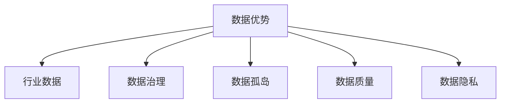

                 

# 中国企业在AI技术上的数据优势

## 1. 背景介绍

### 1.1 问题由来

中国企业在人工智能(AI)技术上的发展，得益于其庞大的数据优势和政策支持。随着大数据、云计算、5G等技术的高速发展，中国数据市场的规模不断扩大，企业获取和利用数据的门槛日益降低。这对于AI技术的落地应用而言，是一大利好。

但数据优势背后，也存在数据孤岛、数据质量参差不齐、数据隐私保护等问题。如何在充分利用数据优势的同时，解决数据难题，是摆在企业面前的现实挑战。

### 1.2 问题核心关键点

当前，中国企业在AI技术上的数据优势主要体现在以下几个方面：

- **数据规模巨大**：中国拥有全球最大的人口规模，各行业的业务数据积累丰富。
- **行业应用多样**：从电子商务、金融、医疗、制造到智慧城市、交通物流，各行各业都在积极探索AI应用的场景和模式。
- **数据链路完善**：政府和企业不断推进数据基础设施建设，数据采集、传输、存储和处理能力大幅提升。
- **数据治理加强**：在数据隐私、数据安全和数据共享等方面，企业逐步建立起数据治理体系。

理解这些数据优势的来源和现状，对于企业AI技术的进一步发展至关重要。本节将深入探讨这些关键点，为后续分析提供基础。

## 2. 核心概念与联系

### 2.1 核心概念概述

为更清晰地理解中国企业在AI技术上的数据优势，我们首先梳理几个核心概念：

- **数据优势**：指在AI技术开发和应用过程中，企业能够获得和利用大量的高质量数据，从而提升模型性能和应用效果。
- **行业数据**：指各行业在业务运营过程中积累的数据，包括客户行为、交易记录、市场环境等。
- **数据治理**：包括数据质量管理、数据安全保护、数据共享和隐私保护等。
- **数据孤岛**：指不同系统和平台之间数据难以互通，导致数据碎片化，难以形成统一的业务视图。
- **数据质量**：涉及数据的完整性、一致性、准确性、时效性等，是影响AI模型性能的重要因素。
- **数据隐私**：指在数据采集和使用过程中，保护个人隐私不被泄露的机制和政策。

这些概念共同构成了中国企业在AI技术上的数据优势框架，有助于我们系统分析数据对AI技术应用的影响。

### 2.2 核心概念原理和架构的 Mermaid 流程图



## 3. 核心算法原理 & 具体操作步骤

### 3.1 算法原理概述

基于数据优势的中国企业在AI技术上的发展，核心算法原理主要涉及以下几个方面：

1. **数据驱动的模型训练**：使用大规模、高质量的行业数据，对AI模型进行有监督或无监督训练，提升模型的泛化能力和预测精度。
2. **迁移学习**：利用在某一行业领域预训练的模型，迁移到另一领域，通过微调优化，适应新的数据分布和任务需求。
3. **参数高效微调**：针对特定任务，只更新模型的一部分参数，减少过拟合风险，提升模型效率。
4. **多源数据融合**：将来自不同系统和平台的数据进行整合，形成统一的数据集，增强模型的鲁棒性和泛化性。
5. **对抗性训练**：通过引入对抗样本，提高模型的鲁棒性和泛化性，避免模型过拟合。
6. **多模型集成**：训练多个模型，综合其输出结果，提升模型的稳定性和准确性。

### 3.2 算法步骤详解

基于数据优势的中国企业在AI技术上的具体操作流程如下：

1. **数据收集与处理**：从各个业务系统中收集数据，进行清洗、去重、标注等预处理，确保数据的质量和可用性。
2. **模型训练与优化**：使用处理后的数据，对AI模型进行有监督或无监督训练，优化模型的参数和结构。
3. **模型迁移与微调**：将预训练模型迁移到新的领域，根据领域特点进行微调，提升模型在新任务上的表现。
4. **模型集成与融合**：将多个模型输出结果进行综合，提升模型的鲁棒性和泛化能力。
5. **模型部署与监控**：将训练好的模型部署到生产环境中，实时监控模型性能，及时调整优化。

### 3.3 算法优缺点

基于数据优势的中国企业在AI技术上的发展，算法具有以下优点：

- **泛化能力强**：得益于大规模、高质量的数据，模型能够在不同场景下表现出色。
- **领域适应性高**：通过迁移学习和微调，模型可以快速适应新的领域和任务。
- **参数效率高**：参数高效微调技术可以节省计算资源，提升模型训练效率。
- **鲁棒性提升**：对抗性训练和多模型集成提升了模型的鲁棒性和泛化能力。

同时，也存在一些缺点：

- **数据孤岛问题**：不同系统和平台的数据难以互通，形成数据孤岛，影响数据融合。
- **数据隐私问题**：在数据采集和使用过程中，个人隐私保护成为一大挑战。
- **数据质量问题**：数据质量参差不齐，影响模型的训练效果。
- **计算资源消耗大**：大规模数据的处理和分析需要大量计算资源，企业需投入巨大成本。

### 3.4 算法应用领域

基于数据优势的中国企业在AI技术上的发展，广泛应用在以下几个领域：

1. **电子商务**：利用交易数据、用户行为数据，进行商品推荐、用户画像分析、欺诈检测等。
2. **金融服务**：通过交易数据、信用数据、舆情数据，进行风险控制、智能投顾、市场预测等。
3. **医疗健康**：借助病历数据、基因数据、药物数据，进行疾病诊断、药物研发、健康管理等。
4. **智能制造**：运用生产数据、设备数据、工艺数据，进行质量控制、生产调度、故障预测等。
5. **智慧城市**：整合城市各类数据，进行交通管理、环境监测、应急响应等。

## 4. 数学模型和公式 & 详细讲解 & 举例说明

### 4.1 数学模型构建

基于数据优势的中国企业在AI技术上的发展，可以构建以下数学模型：

设企业拥有 $N$ 条行业数据，每条数据 $x_i$ 包括 $D$ 个特征。假设企业目标为在某个任务 $T$ 上训练一个 AI 模型 $M_{\theta}$，其中 $\theta$ 为模型参数。设训练任务对应的损失函数为 $L$，则模型训练的目标为最小化损失函数 $L$：

$$
\min_{\theta} \sum_{i=1}^N L(x_i, y_i; M_{\theta})
$$

其中 $y_i$ 为数据 $x_i$ 的真实标签。

### 4.2 公式推导过程

假设企业收集的数据为 $(X, Y)$，其中 $X = \{x_1, x_2, ..., x_N\}$ 为数据集，$Y = \{y_1, y_2, ..., y_N\}$ 为标签集。模型训练的目标是最小化损失函数 $L$：

$$
\min_{\theta} \frac{1}{N} \sum_{i=1}^N L(x_i, y_i; M_{\theta})
$$

推导得到模型的梯度更新公式：

$$
\theta \leftarrow \theta - \eta \nabla_{\theta} L(x_i, y_i; M_{\theta})
$$

其中 $\eta$ 为学习率。

### 4.3 案例分析与讲解

以金融领域为例，假设企业有 $N=1000$ 条客户交易记录，每条记录包含 $D=10$ 个特征。目标任务为客户违约预测，假设标签 $y_i \in \{0, 1\}$，其中 $0$ 表示未违约，$1$ 表示违约。

首先，企业需要对数据进行预处理，包括去重、缺失值填充、特征归一化等。然后，使用训练集进行模型训练，损失函数为二分类交叉熵：

$$
L(x_i, y_i; M_{\theta}) = -[y_i\log M_{\theta}(x_i)+(1-y_i)\log(1-M_{\theta}(x_i))]
$$

模型训练的目标是最小化交叉熵损失：

$$
\min_{\theta} \frac{1}{N} \sum_{i=1}^N L(x_i, y_i; M_{\theta})
$$

通过梯度下降算法，模型更新公式为：

$$
\theta \leftarrow \theta - \eta \nabla_{\theta} L(x_i, y_i; M_{\theta})
$$

## 5. 项目实践：代码实例和详细解释说明

### 5.1 开发环境搭建

以下是基于Python和TensorFlow环境搭建的代码实例：

1. 安装TensorFlow：
   ```
   pip install tensorflow
   ```

2. 准备数据集：
   ```python
   import tensorflow as tf
   from tensorflow import keras
   
   # 读取数据集
   (x_train, y_train), (x_test, y_test) = keras.datasets.mnist.load_data()
   
   # 数据预处理
   x_train = x_train / 255.0
   x_test = x_test / 255.0
   
   # 构建模型
   model = keras.Sequential([
       keras.layers.Flatten(input_shape=(28, 28)),
       keras.layers.Dense(128, activation='relu'),
       keras.layers.Dense(10)
   ])
   
   # 编译模型
   model.compile(optimizer='adam',
                 loss=tf.keras.losses.SparseCategoricalCrossentropy(from_logits=True),
                 metrics=['accuracy'])
   ```

### 5.2 源代码详细实现

以下是完整的TensorFlow代码实现：

```python
import tensorflow as tf
from tensorflow import keras

# 读取数据集
(x_train, y_train), (x_test, y_test) = keras.datasets.mnist.load_data()

# 数据预处理
x_train = x_train / 255.0
x_test = x_test / 255.0

# 构建模型
model = keras.Sequential([
    keras.layers.Flatten(input_shape=(28, 28)),
    keras.layers.Dense(128, activation='relu'),
    keras.layers.Dense(10)
])

# 编译模型
model.compile(optimizer='adam',
              loss=tf.keras.losses.SparseCategoricalCrossentropy(from_logits=True),
              metrics=['accuracy'])

# 训练模型
model.fit(x_train, y_train, epochs=5, validation_data=(x_test, y_test))

# 评估模型
model.evaluate(x_test, y_test)
```

### 5.3 代码解读与分析

上述代码展示了使用TensorFlow进行模型训练的全流程。具体解读如下：

- 首先，使用Keras API加载MNIST数据集，包含手写数字图片和对应的标签。
- 对数据进行预处理，将像素值归一化到[0,1]之间。
- 构建一个简单的神经网络模型，包括一个Flatten层，一个Dense层和一个输出层。
- 编译模型，使用Adam优化器，交叉熵损失函数，训练过程中的准确率作为评估指标。
- 使用fit方法训练模型，进行5个epoch的训练，并使用validation_data参数指定测试集。
- 最后，使用evaluate方法评估模型在测试集上的性能。

## 6. 实际应用场景

### 6.1 智能客服系统

中国企业在AI技术上的数据优势，在智能客服系统中的应用尤为明显。智能客服系统通过整合客户历史对话记录，利用自然语言处理(NLP)技术，实现自动回答客户咨询、解决常见问题等功能。

以电商平台为例，假设企业有数百万条客户服务记录，每条记录包含客户ID、服务时间、服务类型、服务内容等信息。企业可以从中提取语义信息，训练NLP模型，使其能够理解客户意图，匹配最合适的回答模板。在客户提出新问题时，智能客服系统可以自动分析问题，选择最佳回答，极大提升客户满意度和服务效率。

### 6.2 金融风控系统

在金融领域，企业可以通过整合交易数据、信用数据、舆情数据，训练AI模型进行风险控制和欺诈检测。

以银行为例，假设企业有数百万笔交易记录，每条记录包含交易金额、交易时间、交易地点、交易类型等信息。企业可以构建欺诈检测模型，利用异常检测算法，及时发现和拦截可疑交易。同时，通过信用评分模型，评估客户的信用风险，辅助银行做出信贷决策。

### 6.3 智慧医疗系统

在智慧医疗领域，企业可以利用医疗数据，训练AI模型进行疾病诊断、药物研发和健康管理。

以医院为例，假设企业有数百万条患者病历数据，每条数据包含病历编号、患者基本信息、临床诊断、治疗方案等信息。企业可以构建疾病诊断模型，利用深度学习算法，自动识别患者病情，辅助医生进行诊断。同时，通过药物研发模型，分析药物成分和作用机理，加速新药研发进程。

### 6.4 未来应用展望

基于数据优势的中国企业在AI技术上的未来应用展望如下：

1. **行业深度融合**：AI技术将深度融入各行业，提升业务运营效率和客户体验。
2. **多模态数据融合**：整合视觉、语音、文本等多种数据源，提升模型的泛化能力。
3. **联邦学习**：利用联邦学习技术，在不共享数据的情况下，联合多企业训练AI模型，保护数据隐私。
4. **边缘计算**：在物联网设备上部署AI模型，实现实时数据分析和决策，提升数据处理效率。
5. **强化学习**：结合强化学习技术，优化AI模型的决策过程，提升系统自动化和智能化水平。

## 7. 工具和资源推荐

### 7.1 学习资源推荐

以下是几本推荐的学习资源：

1. 《Python深度学习》：深入讲解TensorFlow、Keras等库的使用，涵盖NLP、CV、RL等多个方向。
2. 《动手学深度学习》：清华大学出品，内容全面，适合初学者和进阶者。
3. 《TensorFlow官方文档》：详细讲解TensorFlow的各个组件和API，是深度学习开发者的必备资料。
4. 《自然语言处理入门》：全面介绍NLP的各个技术和应用，适合NLP初学者。
5. 《深度学习实战》：结合实际案例，讲解深度学习模型的训练、调参和应用。

### 7.2 开发工具推荐

以下是几个推荐使用的开发工具：

1. TensorFlow：广泛使用的深度学习框架，支持多种模型和算法。
2. PyTorch：灵活的深度学习框架，适用于科研和生产。
3. Keras：高层次的API，适合快速搭建模型原型。
4. Scikit-learn：简单易用的机器学习库，适合数据预处理和模型评估。
5. Jupyter Notebook：交互式开发环境，支持代码编写和实时显示。

### 7.3 相关论文推荐

以下是几篇推荐的相关论文：

1. "Data-Driven Deep Learning"：介绍数据驱动的深度学习范式，探讨数据对模型性能的影响。
2. "Adversarial Machine Learning"：介绍对抗性训练技术，提升模型的鲁棒性和泛化能力。
3. "Federated Learning"：介绍联邦学习技术，在不共享数据的情况下，联合多企业训练模型。
4. "Multimodal Deep Learning"：介绍多模态深度学习技术，整合视觉、语音、文本等多种数据源。
5. "Reinforcement Learning"：介绍强化学习技术，优化AI模型的决策过程。

## 8. 总结：未来发展趋势与挑战

### 8.1 研究成果总结

基于数据优势的中国企业在AI技术上的发展，已经取得了显著成果，涵盖NLP、CV、RL等多个领域。以下是几个关键成果：

1. 自然语言处理：在问答系统、文本分类、机器翻译等领域取得突破性进展。
2. 计算机视觉：在图像识别、视频分析、人脸识别等领域取得显著效果。
3. 强化学习：在智能控制、机器人导航、自动驾驶等领域获得重要应用。

### 8.2 未来发展趋势

基于数据优势的中国企业在AI技术上的未来发展趋势如下：

1. **数据驱动的创新**：数据优势将进一步推动AI技术的创新和发展。
2. **跨领域融合**：AI技术将深度融合各行业，提升业务运营效率和客户体验。
3. **智能决策**：利用AI技术，实现更智能、更高效的决策支持。
4. **模型解释性**：提升模型的可解释性和透明度，满足监管和伦理需求。

### 8.3 面临的挑战

尽管中国企业在AI技术上的数据优势显著，但仍面临以下挑战：

1. **数据孤岛**：不同系统和平台的数据难以互通，影响数据融合。
2. **数据隐私**：在数据采集和使用过程中，个人隐私保护成为一大挑战。
3. **数据质量**：数据质量参差不齐，影响模型的训练效果。
4. **计算资源消耗大**：大规模数据的处理和分析需要大量计算资源，企业需投入巨大成本。

### 8.4 研究展望

未来，中国企业在AI技术上的研究展望如下：

1. **数据治理**：建立健全数据治理体系，确保数据质量和隐私保护。
2. **数据共享**：推动数据共享和联邦学习技术，提升数据利用效率。
3. **模型优化**：优化模型结构，提升模型的效率和泛化能力。
4. **技术创新**：引入新技术和新算法，推动AI技术的持续进步。

## 9. 附录：常见问题与解答

**Q1：AI技术在各行业的应用前景如何？**

A: AI技术在各行业的应用前景广阔，从金融、医疗、制造到智慧城市、交通物流等领域，都可以借助AI技术提升业务运营效率和客户体验。

**Q2：数据孤岛问题如何解决？**

A: 解决数据孤岛问题需要建立统一的数据标准和接口，促进不同系统和平台的数据互通。同时，引入数据治理技术，提升数据质量，确保数据的一致性和完整性。

**Q3：数据隐私如何保护？**

A: 在数据采集和使用过程中，企业需要遵守相关的隐私保护法规，如GDPR、CCPA等。采用数据匿名化、差分隐私等技术，确保个人隐私不被泄露。

**Q4：数据质量如何提升？**

A: 数据质量提升需要从数据采集、处理和存储等多个环节进行优化。引入自动化数据清洗工具，提升数据的完整性和准确性。同时，引入数据标注技术，提升标注数据的质量和数量。

**Q5：AI模型如何优化？**

A: AI模型的优化需要从模型结构、算法和数据等多个方面进行改进。引入新算法和新模型，提升模型的泛化能力和泛化能力。优化模型的计算图，减少计算资源消耗。

综上所述，中国企业在AI技术上的数据优势显著，但面临诸多挑战。未来需要在数据治理、数据共享、模型优化等方面持续努力，才能充分利用数据优势，推动AI技术的发展和应用。

---

作者：禅与计算机程序设计艺术 / Zen and the Art of Computer Programming

