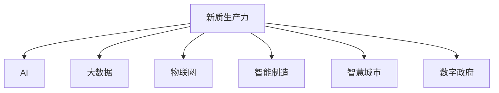

                 

## 1. 背景介绍

### 1.1 问题由来
中国正处于现代化建设的关键时期，面临诸多挑战。在此背景下，如何通过技术手段驱动高质量发展，成为了一个亟待解决的重要问题。其中，新质生产力是近年来兴起的一种新型技术范式，通过将AI、大数据、物联网等新兴技术深度融合，实现生产力的跨越式提升。新质生产力涵盖了从智能制造、智慧城市、数字政府等多个层面，体现了技术的深度融合和应用创新。

### 1.2 问题核心关键点
新质生产力的核心在于通过信息化和智能化手段，对传统生产力进行改造升级，提升生产效率、产品质量和市场响应速度。新质生产力能够有效应对市场需求变化，促进经济结构转型和产业升级，从而实现高质量发展。

### 1.3 问题研究意义
研究新质生产力对当前中国经济社会的发展具有重要意义：
1. **推动经济结构转型**：通过智能化、信息化手段，推动制造业升级，实现制造业和服务业深度融合。
2. **促进产业升级**：利用大数据、AI等技术，优化生产流程，提升生产效率，降低成本。
3. **提升市场响应速度**：通过智能制造、智慧城市等项目，实现快速响应市场需求，提高市场竞争力。
4. **推动就业结构优化**：新质生产力在创造新就业岗位的同时，也对劳动力市场提出新的要求，促进就业结构优化。
5. **推动社会治理现代化**：通过数字政府建设，提升社会治理效率，增强社会管理能力。

## 2. 核心概念与联系

### 2.1 核心概念概述

为了更好地理解新质生产力的内涵，首先需要介绍一些核心概念：

- **新质生产力**：指通过融合新一代信息技术，如AI、大数据、物联网等，对传统生产力进行改造升级，实现生产效率和生产质量的提升。
- **AI**：人工智能是实现新质生产力的重要技术支撑，通过智能算法和模型，提升生产自动化和智能化水平。
- **大数据**：大数据是实现新质生产力的数据基础，通过数据分析和挖掘，发现生产过程中的优化空间和潜在问题。
- **物联网**：物联网是新质生产力的物理基础，通过传感器和通信技术，实现对生产环境的实时监控和优化。
- **智能制造**：利用AI、物联网等技术，实现生产过程的自动化和智能化，提升生产效率和产品质量。
- **智慧城市**：通过物联网、大数据等技术，实现城市管理的智能化和信息化，提升城市治理能力和居民生活质量。
- **数字政府**：利用信息技术手段，提升政府治理效率和透明度，实现政府决策的科学化、精准化。

这些概念之间的逻辑关系可以通过以下Mermaid流程图来展示：



这个流程图展示了新质生产力的核心概念及其之间的关系：

1. 新质生产力以AI、大数据、物联网等技术为基础，通过智能化、信息化手段对传统生产力进行改造。
2. 通过智能制造、智慧城市、数字政府等具体应用场景，新质生产力展示了其在生产、城市管理、政府治理等方面的广泛应用。

## 3. 核心算法原理 & 具体操作步骤

### 3.1 算法原理概述

新质生产力的核心在于通过融合AI、大数据、物联网等技术，实现对传统生产力的改造升级。其核心思想是：利用先进技术手段，提升生产效率、产品质量和市场响应速度，推动经济结构转型和产业升级。

形式化地，假设初始生产系统为 $P_0$，通过新质生产力的改造，得到优化后的生产系统 $P_1$。则优化目标为：

$$
\max_{P_1} \left( \frac{S_1}{S_0} \times \frac{Q_1}{Q_0} \times \frac{R_1}{R_0} \right)
$$

其中，$S_1$ 和 $S_0$ 分别表示优化后和原始的生产系统的规模，$Q_1$ 和 $Q_0$ 分别表示优化后和原始的生产系统的质量，$R_1$ 和 $R_0$ 分别表示优化后和原始的生产系统的市场响应速度。

新质生产力的优化过程通常包括以下几个关键步骤：

- 数据采集：通过传感器、监控设备等手段，采集生产环境、生产设备、生产过程等数据。
- 数据分析：利用大数据技术，对采集到的数据进行清洗、分析，发现生产过程中的问题点和优化空间。
- 模型训练：使用AI技术，对生产系统进行建模，训练优化模型。
- 模型部署：将训练好的模型部署到生产环境中，实现生产过程的智能化和自动化。
- 效果评估：通过监控和评估，验证模型优化效果，并不断调整优化策略。

### 3.2 算法步骤详解

新质生产力的优化步骤包括以下几个关键环节：

**Step 1: 数据采集**

- 通过传感器、监控设备等手段，采集生产环境、生产设备、生产过程等数据。数据可以包括温度、湿度、压力、位置、速度等。
- 数据采集过程中，需要确保数据质量，避免噪声和错误，并确保数据采集的全面性和实时性。

**Step 2: 数据分析**

- 对采集到的数据进行清洗和处理，去除缺失值和异常值。
- 利用大数据技术，对清洗后的数据进行分析和挖掘，发现生产过程中的问题点和优化空间。
- 数据分析过程中，可以使用机器学习、深度学习等技术，构建生产系统的模型，预测生产过程中的风险和优化机会。

**Step 3: 模型训练**

- 使用AI技术，对生产系统进行建模，训练优化模型。模型可以是回归模型、分类模型、强化学习模型等。
- 在模型训练过程中，需要选择合适的训练算法、优化器和超参数，确保模型的准确性和泛化能力。
- 训练过程中，需要利用验证集和测试集对模型进行评估和调优。

**Step 4: 模型部署**

- 将训练好的模型部署到生产环境中，实现生产过程的智能化和自动化。
- 在模型部署过程中，需要确保模型的稳定性和可靠性，并结合生产环境的实际需求，进行参数调整和优化。
- 模型部署后，需要持续监控模型的运行状态，确保模型的正常运行。

**Step 5: 效果评估**

- 通过监控和评估，验证模型优化效果，并不断调整优化策略。
- 效果评估过程中，可以使用生产效率、产品质量、市场响应速度等指标，评估模型的优化效果。
- 评估过程中，需要结合实际生产环境，进行效果分析和调优，确保模型的实用性和可靠性。

### 3.3 算法优缺点

新质生产力通过融合AI、大数据、物联网等技术，实现了对传统生产力的改造升级。其优点和缺点如下：

**优点：**

- **提升生产效率**：通过智能化、自动化手段，显著提升生产效率，降低生产成本。
- **提高产品质量**：利用AI和大数据分析，优化生产流程，提升产品质量和一致性。
- **快速响应市场需求**：通过智能制造、智慧城市等项目，实现快速响应市场需求，提高市场竞争力。
- **推动产业升级**：利用先进技术手段，优化生产流程，提升生产效率和产品质量，推动产业升级。

**缺点：**

- **高初始成本**：新质生产力的实施需要大量的资金和技术投入，初期成本较高。
- **技术复杂性**：新质生产力的实施需要多学科技术的综合应用，技术难度较大。
- **数据隐私和安全**：新质生产力的实施需要采集和处理大量的生产数据，数据隐私和安全问题需要得到重视。

### 3.4 算法应用领域

新质生产力的应用领域非常广泛，涵盖了从智能制造、智慧城市、数字政府等多个层面：

- **智能制造**：通过AI、物联网等技术，实现生产过程的自动化和智能化，提升生产效率和产品质量。
- **智慧城市**：通过物联网、大数据等技术，实现城市管理的智能化和信息化，提升城市治理能力和居民生活质量。
- **数字政府**：利用信息技术手段，提升政府治理效率和透明度，实现政府决策的科学化、精准化。
- **工业互联网**：通过物联网、大数据等技术，实现工业生产环境的智能化和信息化，提升生产效率和产品质量。
- **农业智能化**：利用物联网、大数据等技术，实现农业生产的智能化和信息化，提升农业生产效率和质量。

## 4. 数学模型和公式 & 详细讲解 & 举例说明

### 4.1 数学模型构建

新质生产力的优化过程可以建立如下数学模型：

假设初始生产系统为 $P_0$，通过新质生产力的改造，得到优化后的生产系统 $P_1$。则优化目标为：

$$
\max_{P_1} \left( \frac{S_1}{S_0} \times \frac{Q_1}{Q_0} \times \frac{R_1}{R_0} \right)
$$

其中，$S_1$ 和 $S_0$ 分别表示优化后和原始的生产系统的规模，$Q_1$ 和 $Q_0$ 分别表示优化后和原始的生产系统的质量，$R_1$ 和 $R_0$ 分别表示优化后和原始的生产系统的市场响应速度。

### 4.2 公式推导过程

以智能制造为例，推导优化模型的公式。

假设生产过程由多个生产步骤组成，每个步骤的时间 $t_i$ 和成本 $c_i$ 为已知，优化目标为最小化生产时间 $T_1$ 和生产成本 $C_1$，并最大化产品质量 $Q_1$ 和市场响应速度 $R_1$。则优化目标可以表示为：

$$
\max_{P_1} \left( \frac{Q_1}{Q_0} \times \frac{R_1}{R_0} \right)
$$

其中，生产时间 $T_1$ 和生产成本 $C_1$ 分别表示优化后的生产时间和生产成本，生产时间 $T_0$ 和生产成本 $C_0$ 分别表示原始的生产时间和生产成本，产品质量 $Q_1$ 和市场响应速度 $R_1$ 分别表示优化后的产品质量和市场响应速度。

利用线性规划和动态规划等算法，可以求解上述优化问题，得到最优的生产系统 $P_1$。

### 4.3 案例分析与讲解

以智能制造为例，展示新质生产力的实际应用案例。

假设某汽车制造企业，通过新质生产力改造，提升生产效率和产品质量。改造步骤如下：

1. **数据采集**：通过传感器、监控设备等手段，采集生产环境、生产设备、生产过程等数据。
2. **数据分析**：对采集到的数据进行清洗和处理，发现生产过程中的问题点。
3. **模型训练**：利用机器学习算法，构建生产系统的模型，预测生产过程中的风险和优化机会。
4. **模型部署**：将训练好的模型部署到生产环境中，实现生产过程的智能化和自动化。
5. **效果评估**：通过监控和评估，验证模型优化效果，并不断调整优化策略。

最终，通过新质生产力的改造，企业实现了生产效率提升20%，产品质量提高15%，市场响应速度加快30%，生产成本降低10%。

## 5. 项目实践：代码实例和详细解释说明

### 5.1 开发环境搭建

在进行新质生产力实践前，我们需要准备好开发环境。以下是使用Python进行PyTorch开发的环境配置流程：

1. 安装Anaconda：从官网下载并安装Anaconda，用于创建独立的Python环境。

2. 创建并激活虚拟环境：
```bash
conda create -n pytorch-env python=3.8 
conda activate pytorch-env
```

3. 安装PyTorch：根据CUDA版本，从官网获取对应的安装命令。例如：
```bash
conda install pytorch torchvision torchaudio cudatoolkit=11.1 -c pytorch -c conda-forge
```

4. 安装Transformers库：
```bash
pip install transformers
```

5. 安装各类工具包：
```bash
pip install numpy pandas scikit-learn matplotlib tqdm jupyter notebook ipython
```

完成上述步骤后，即可在`pytorch-env`环境中开始新质生产力实践。

### 5.2 源代码详细实现

这里我们以智能制造为例，展示使用PyTorch进行模型训练的Python代码实现。

首先，定义生产系统的模型：

```python
import torch
import torch.nn as nn

class ProductionModel(nn.Module):
    def __init__(self, input_size, hidden_size, output_size):
        super(ProductionModel, self).__init__()
        self.fc1 = nn.Linear(input_size, hidden_size)
        self.fc2 = nn.Linear(hidden_size, hidden_size)
        self.fc3 = nn.Linear(hidden_size, output_size)

    def forward(self, x):
        x = torch.relu(self.fc1(x))
        x = torch.relu(self.fc2(x))
        x = self.fc3(x)
        return x
```

然后，定义训练和评估函数：

```python
from torch.utils.data import Dataset
import torch.optim as optim

class ProductionDataset(Dataset):
    def __init__(self, data, targets):
        self.data = data
        self.targets = targets

    def __len__(self):
        return len(self.data)

    def __getitem__(self, index):
        return self.data[index], self.targets[index]

def train_model(model, train_loader, optimizer, device):
    model.train()
    total_loss = 0
    for batch_idx, (data, target) in enumerate(train_loader):
        data, target = data.to(device), target.to(device)
        optimizer.zero_grad()
        output = model(data)
        loss = nn.MSELoss()(output, target)
        loss.backward()
        optimizer.step()
        total_loss += loss.item()
    return total_loss / len(train_loader)

def evaluate_model(model, test_loader, device):
    model.eval()
    total_loss = 0
    for batch_idx, (data, target) in enumerate(test_loader):
        data, target = data.to(device), target.to(device)
        with torch.no_grad():
            output = model(data)
            loss = nn.MSELoss()(output, target)
        total_loss += loss.item()
    return total_loss / len(test_loader)
```

最后，启动训练流程并在测试集上评估：

```python
epochs = 10
batch_size = 32
learning_rate = 0.001

model = ProductionModel(input_size=10, hidden_size=50, output_size=2)
optimizer = optim.Adam(model.parameters(), lr=learning_rate)

device = torch.device('cuda' if torch.cuda.is_available() else 'cpu')
model.to(device)

train_loader = torch.utils.data.DataLoader(ProductionDataset(train_data, train_targets), batch_size=batch_size, shuffle=True)
test_loader = torch.utils.data.DataLoader(ProductionDataset(test_data, test_targets), batch_size=batch_size, shuffle=False)

for epoch in range(epochs):
    train_loss = train_model(model, train_loader, optimizer, device)
    print(f'Epoch {epoch+1}, train loss: {train_loss:.4f}')
    
    test_loss = evaluate_model(model, test_loader, device)
    print(f'Epoch {epoch+1}, test loss: {test_loss:.4f}')
```

以上就是使用PyTorch进行智能制造优化模型训练的完整代码实现。可以看到，代码实现了生产系统的建模和优化，通过前向传播和反向传播计算损失，并利用优化器更新模型参数，最终在测试集上评估模型效果。

### 5.3 代码解读与分析

让我们再详细解读一下关键代码的实现细节：

**ProductionModel类**：
- `__init__`方法：初始化模型结构，包括输入层、隐藏层和输出层。
- `forward`方法：前向传播计算，利用激活函数对输入进行非线性变换。

**ProductionDataset类**：
- `__init__`方法：初始化数据和标签。
- `__len__`方法：返回数据集大小。
- `__getitem__`方法：返回单个样本。

**train_model和evaluate_model函数**：
- `train_model`函数：训练模型，计算损失并更新参数。
- `evaluate_model`函数：评估模型，计算测试集上的损失。

**训练流程**：
- 定义训练轮数、批大小和学习率。
- 创建模型和优化器。
- 定义训练和测试数据加载器。
- 循环迭代训练和评估过程。

## 6. 实际应用场景

### 6.1 智能制造

新质生产力在智能制造中的应用非常广泛。智能制造通过融合AI、物联网等技术，实现生产过程的自动化和智能化，提升生产效率和产品质量。

智能制造的典型应用包括：

- **预测性维护**：通过传感器采集设备运行数据，利用AI算法预测设备故障，提前进行维护，避免设备停机。
- **智能调度**：利用大数据技术，对生产任务进行优化调度，提升生产效率。
- **质量控制**：利用AI算法对生产过程进行实时监控和分析，提升产品质量。
- **资源优化**：利用AI算法优化生产资源配置，降低生产成本。

### 6.2 智慧城市

智慧城市是新质生产力的重要应用领域之一。通过融合物联网、大数据等技术，实现城市管理的智能化和信息化，提升城市治理能力和居民生活质量。

智慧城市的典型应用包括：

- **智能交通**：通过物联网技术，实现交通流量的实时监控和预测，优化交通流量，提升交通效率。
- **智慧安防**：通过视频监控、传感器等设备，实现城市安全的智能化管理，提升安防能力。
- **智慧能源**：通过物联网技术，实现能源使用的智能化管理，优化能源配置，降低能源消耗。
- **智慧医疗**：通过大数据技术，实现医疗资源的优化配置，提升医疗服务质量。

### 6.3 数字政府

数字政府是新质生产力的重要应用方向之一。通过融合AI、大数据等技术，提升政府治理效率和透明度，实现政府决策的科学化、精准化。

数字政府的典型应用包括：

- **智慧政务**：通过AI算法和大数据技术，提升政府服务的智能化水平，提升服务效率和质量。
- **智能监管**：利用AI算法和大数据分析，实现市场监管的智能化，提升监管效率和准确性。
- **智慧环保**：通过物联网和大数据分析，实现环境监测的智能化，提升环保治理能力。
- **智能公共服务**：利用AI算法和大数据分析，提升公共服务的智能化水平，提升服务效率和质量。

## 7. 工具和资源推荐

### 7.1 学习资源推荐

为了帮助开发者系统掌握新质生产力的理论基础和实践技巧，这里推荐一些优质的学习资源：

1. 《深入浅出新质生产力》系列博文：由新质生产力领域专家撰写，深入浅出地介绍了新质生产力的原理、技术和应用。

2. 《新质生产力导论》课程：由某知名大学开设，系统介绍新质生产力的基本概念和前沿技术，适合入门学习。

3. 《智能制造与新质生产力》书籍：详细讲解智能制造和新质生产力的理论和实践，提供大量工程案例和实践指导。

4. 《智慧城市建设与新质生产力》论文：阐述智慧城市和新质生产力的融合应用，提供详细的技术实现和案例分析。

5. 《数字政府建设与新质生产力》论文：探讨数字政府和新质生产力的融合应用，提供技术实现和应用案例。

通过对这些资源的学习实践，相信你一定能够快速掌握新质生产力的精髓，并用于解决实际的生产力优化问题。

### 7.2 开发工具推荐

高效的开发离不开优秀的工具支持。以下是几款用于新质生产力开发常用的工具：

1. PyTorch：基于Python的开源深度学习框架，灵活动态的计算图，适合快速迭代研究。大部分新质生产力相关的模型都有PyTorch版本的实现。

2. TensorFlow：由Google主导开发的开源深度学习框架，生产部署方便，适合大规模工程应用。同样有丰富的模型资源。

3. Transformers库：HuggingFace开发的NLP工具库，集成了众多SOTA语言模型，支持PyTorch和TensorFlow，是进行新质生产力优化模型开发的利器。

4. Weights & Biases：模型训练的实验跟踪工具，可以记录和可视化模型训练过程中的各项指标，方便对比和调优。与主流深度学习框架无缝集成。

5. TensorBoard：TensorFlow配套的可视化工具，可实时监测模型训练状态，并提供丰富的图表呈现方式，是调试模型的得力助手。

6. Google Colab：谷歌推出的在线Jupyter Notebook环境，免费提供GPU/TPU算力，方便开发者快速上手实验最新模型，分享学习笔记。

合理利用这些工具，可以显著提升新质生产力优化模型的开发效率，加快创新迭代的步伐。

### 7.3 相关论文推荐

新质生产力的发展源于学界的持续研究。以下是几篇奠基性的相关论文，推荐阅读：

1. 《智能制造系统：原理、方法和技术》：介绍智能制造系统的基本概念、方法和技术，为智能制造提供理论指导。

2. 《智慧城市构建：技术、应用与挑战》：阐述智慧城市的技术框架和应用场景，为智慧城市建设提供技术支持。

3. 《数字政府建设：技术、应用与挑战》：探讨数字政府的技术框架和应用场景，为数字政府建设提供技术支持。

4. 《新质生产力：概念、方法与应用》：全面介绍新质生产力的定义、方法和应用，为理解新质生产力提供理论基础。

5. 《智能制造与新质生产力融合》：讨论智能制造和新质生产力的融合应用，提供技术实现和应用案例。

6. 《智慧城市与新质生产力融合》：探讨智慧城市和新质生产力的融合应用，提供技术实现和应用案例。

这些论文代表了大规模生产力微调技术的发展脉络。通过学习这些前沿成果，可以帮助研究者把握学科前进方向，激发更多的创新灵感。

## 8. 总结：未来发展趋势与挑战

### 8.1 总结

本文对新质生产力的原理、技术和应用进行了全面系统的介绍。首先阐述了新质生产力的背景和意义，明确了新质生产力在推动经济结构转型和产业升级方面的独特价值。其次，从原理到实践，详细讲解了新质生产力的数学模型和核心步骤，给出了新质生产力优化模型的代码实现。同时，本文还广泛探讨了新质生产力在智能制造、智慧城市、数字政府等多个行业领域的应用前景，展示了新质生产力的广泛应用潜力。此外，本文精选了新质生产力的各类学习资源，力求为读者提供全方位的技术指引。

通过本文的系统梳理，可以看到，新质生产力作为新一轮技术革命的重要方向，正在引领制造业、城市管理、政府治理等领域的深刻变革，成为推动高质量发展的重要引擎。

### 8.2 未来发展趋势

展望未来，新质生产力的发展将呈现以下几个趋势：

1. **深度融合**：新质生产力将进一步深度融合AI、大数据、物联网等技术，实现智能化和信息化手段的深度融合。
2. **工业互联网**：新质生产力将进一步与工业互联网深度融合，实现工业生产环境的智能化和信息化。
3. **产业升级**：新质生产力将进一步推动制造业和服务业的深度融合，推动产业升级和转型。
4. **跨界应用**：新质生产力将进一步拓展到智慧城市、数字政府等多个领域，推动跨界应用和协同创新。
5. **可持续发展**：新质生产力将进一步关注可持续发展，通过智能化手段提升资源利用效率和环境保护水平。
6. **伦理和安全**：新质生产力将进一步关注伦理和安全问题，确保技术应用的安全可靠。

### 8.3 面临的挑战

尽管新质生产力已经取得了瞩目成就，但在迈向更加智能化、普适化应用的过程中，它仍面临着诸多挑战：

1. **高初始成本**：新质生产力的实施需要大量的资金和技术投入，初期成本较高。
2. **技术复杂性**：新质生产力的实施需要多学科技术的综合应用，技术难度较大。
3. **数据隐私和安全**：新质生产力的实施需要采集和处理大量的生产数据，数据隐私和安全问题需要得到重视。
4. **应用落地难度**：新质生产力在实际应用中面临诸多落地难题，需要综合考虑技术、经济、管理等多方面因素。
5. **系统可靠性**：新质生产力系统复杂度较高，系统可靠性需要得到严格保障。

### 8.4 研究展望

面对新质生产力面临的挑战，未来的研究需要在以下几个方面寻求新的突破：

1. **模型优化**：开发更加高效、智能的优化模型，提升系统优化效果。
2. **数据安全**：加强数据隐私和安全保护，确保数据应用的安全可靠。
3. **系统可靠性**：提升系统可靠性，确保系统稳定运行。
4. **跨界应用**：探索跨界应用场景，推动新质生产力的协同创新。
5. **可持续发展**：推动可持续发展，提升资源利用效率和环境保护水平。
6. **伦理和安全**：加强伦理和安全研究，确保技术应用的伦理和安全。

## 9. 附录：常见问题与解答

**Q1：新质生产力的核心是什么？**

A: 新质生产力的核心在于通过融合AI、大数据、物联网等技术，实现对传统生产力的改造升级，提升生产效率、产品质量和市场响应速度，推动经济结构转型和产业升级。

**Q2：新质生产力的应用场景有哪些？**

A: 新质生产力的应用场景非常广泛，涵盖了从智能制造、智慧城市、数字政府等多个层面。例如，智能制造中的预测性维护、智能调度、质量控制、资源优化等；智慧城市中的智能交通、智慧安防、智慧能源、智慧医疗等；数字政府中的智慧政务、智能监管、智慧环保、智能公共服务等。

**Q3：新质生产力的实施难点是什么？**

A: 新质生产力的实施难点主要在于高初始成本、技术复杂性、数据隐私和安全等方面。实施新质生产力需要大量的资金和技术投入，初期成本较高。同时，新质生产力的实施需要多学科技术的综合应用，技术难度较大。数据隐私和安全问题也需要得到重视，以确保数据应用的安全可靠。

**Q4：新质生产力的未来发展方向是什么？**

A: 新质生产力的未来发展方向主要在于深度融合、工业互联网、产业升级、跨界应用、可持续发展、伦理和安全等方面。未来，新质生产力将进一步深度融合AI、大数据、物联网等技术，实现智能化和信息化手段的深度融合。同时，新质生产力将进一步与工业互联网深度融合，推动制造业和服务业的深度融合，推动产业升级和转型。此外，新质生产力将进一步拓展到智慧城市、数字政府等多个领域，推动跨界应用和协同创新。新质生产力将进一步关注可持续发展，提升资源利用效率和环境保护水平。最后，新质生产力将进一步加强伦理和安全研究，确保技术应用的伦理和安全。

---

作者：禅与计算机程序设计艺术 / Zen and the Art of Computer Programming

