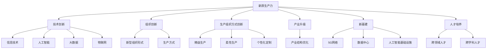
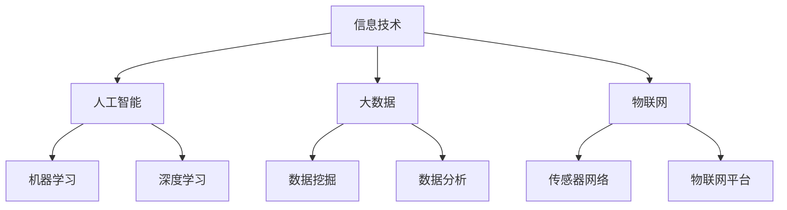
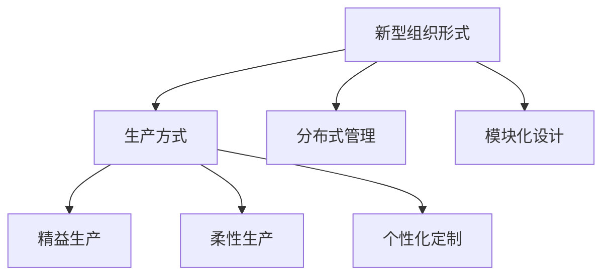

                 

# 中国现代化进程中的新质生产力发展

## 1. 背景介绍

### 1.1 问题由来

随着中国经济社会的快速发展，传统生产方式面临着巨大挑战，需要在新时代背景下进行升级转型。信息化、数字化、智能化浪潮席卷各行各业，推动传统产业向智能化、网络化、服务化方向发展。在这一过程中，新质生产力的发展显得尤为重要。

新质生产力是指与智能化、信息化、数据化深度融合的生产力。它强调在原有生产要素的基础上，通过新技术的应用和组织模式的创新，推动生产力的高质量发展。新质生产力旨在实现经济增长方式的根本转变，提升经济发展质量和效益，是中国现代化进程中的关键驱动力。

### 1.2 问题核心关键点

新质生产力发展涉及多个维度，主要包括技术创新、组织创新、生产组织方式创新、产业升级、新基建、人才培养等关键要素。本文将围绕这些核心问题，深入探讨新质生产力的发展路径及其对中国现代化进程的推动作用。

## 2. 核心概念与联系

### 2.1 核心概念概述

为深入理解新质生产力，本节将详细阐述其核心概念及其相互关系：

- **新质生产力**：是指与智能化、信息化、数据化深度融合的生产力，是推动传统产业转型升级的关键驱动力。
- **技术创新**：是推动生产力发展的核心动力，涉及信息技术、人工智能、大数据、物联网等前沿技术。
- **组织创新**：是指通过新型组织形式和生产方式，提高资源配置效率，降低成本，提升竞争力。
- **生产组织方式创新**：包括精益生产、柔性生产、个性化定制等新型生产方式，以满足市场需求的多样化和复杂化。
- **产业升级**：通过技术、管理、模式创新，推动产业向更高层次发展，实现产业结构的优化升级。
- **新基建**：包括5G网络、数据中心、人工智能基础设施等新型基础设施，是支撑新质生产力发展的基础设施。
- **人才培养**：培养具有跨领域、跨学科知识背景的专业人才，支撑新质生产力的发展需求。

这些核心概念之间通过以下Mermaid流程图展示：



### 2.2 核心概念原理和架构的 Mermaid 流程图

在技术创新方面，信息技术、人工智能、大数据、物联网等技术是新质生产力的重要支撑。以下是这些技术间的相互关系图：



在组织创新方面，新型组织形式和生产方式是通过优化资源配置和提升生产效率来实现的。以下是组织创新与生产方式间的相互关系图：



## 3. 核心算法原理 & 具体操作步骤

### 3.1 算法原理概述

新质生产力的发展离不开技术的深度融合和应用。本文将从技术融合的视角，探讨新质生产力的算法原理。

### 3.2 算法步骤详解

新质生产力的技术融合，可以概括为以下几个关键步骤：

1. **技术融合需求分析**：明确新质生产力的发展目标，识别技术需求，建立技术框架。
2. **技术方案设计**：选择合适的技术方案，包括信息技术、人工智能、大数据、物联网等。
3. **技术集成与优化**：将多种技术集成到生产流程中，并进行优化，提高生产效率。
4. **技术应用与评估**：将技术应用到实际生产中，并进行效果评估，持续优化。

### 3.3 算法优缺点

新质生产力的技术融合具有以下优点：

1. **提高生产效率**：通过新技术的应用，优化生产流程，提高资源配置效率，降低成本。
2. **增强竞争力**：通过新技术的应用，提升产品质量和市场响应速度，增强竞争力。
3. **促进创新**：新技术的应用，推动生产方式和管理模式的创新，促进企业创新。

同时，也存在以下缺点：

1. **技术复杂度较高**：新技术的应用，需要较高的技术门槛和管理能力。
2. **投资成本较大**：新技术的引入和部署，需要较大的初始投资成本。
3. **数据安全风险**：新技术的应用，可能带来数据隐私和安全的风险。

### 3.4 算法应用领域

新质生产力的技术融合，已经在多个领域得到了广泛应用：

- **智能制造**：通过信息化、自动化、智能化改造，实现生产过程的数字化、网络化、智能化。
- **智慧农业**：利用物联网、大数据、人工智能等技术，实现农业生产的精准化、智能化。
- **智能物流**：通过物联网、大数据、人工智能等技术，实现物流过程的自动化、智能化。
- **智慧城市**：利用信息技术、大数据、人工智能等技术，实现城市管理的智能化、精细化。

## 4. 数学模型和公式 & 详细讲解 & 举例说明

### 4.1 数学模型构建

新质生产力的技术融合涉及多个领域的技术，可以通过多学科融合的数学模型进行刻画。以下是几个关键的数学模型：

1. **信息技术与人工智能融合模型**：
   $$
   F_{IT} = F_{AI} \times k_{IT-AI}
   $$
   其中，$F_{IT}$为信息技术的应用效果，$F_{AI}$为人工智能的应用效果，$k_{IT-AI}$为信息技术与人工智能的融合系数。

2. **大数据与人工智能融合模型**：
   $$
   F_{DA} = F_{AI} \times k_{DA-AI}
   $$
   其中，$F_{DA}$为大数据的应用效果，$F_{AI}$为人工智能的应用效果，$k_{DA-AI}$为大数据与人工智能的融合系数。

3. **物联网与人工智能融合模型**：
   $$
   F_{IoT} = F_{AI} \times k_{IoT-AI}
   $$
   其中，$F_{IoT}$为物联网的应用效果，$F_{AI}$为人工智能的应用效果，$k_{IoT-AI}$为物联网与人工智能的融合系数。

### 4.2 公式推导过程

以下是每个公式的推导过程：

1. **信息技术与人工智能融合模型**：
   $$
   F_{IT} = F_{AI} \times k_{IT-AI}
   $$
   信息技术与人工智能的融合，可以增强生产力的整体效果。$k_{IT-AI}$为融合系数，通常介于0和1之间，表示信息技术与人工智能的融合程度。

2. **大数据与人工智能融合模型**：
   $$
   F_{DA} = F_{AI} \times k_{DA-AI}
   $$
   大数据与人工智能的融合，可以进一步提升生产力的效果。$k_{DA-AI}$为融合系数，通常介于0和1之间，表示大数据与人工智能的融合程度。

3. **物联网与人工智能融合模型**：
   $$
   F_{IoT} = F_{AI} \times k_{IoT-AI}
   $$
   物联网与人工智能的融合，可以实现生产过程的自动化和智能化。$k_{IoT-AI}$为融合系数，通常介于0和1之间，表示物联网与人工智能的融合程度。

### 4.3 案例分析与讲解

以智能制造为例，分析其技术融合的数学模型和应用效果：

1. **信息技术与人工智能融合**：
   假设信息技术的应用效果为50，人工智能的应用效果为80，融合系数为0.8，则整体效果为：
   $$
   F_{IT} = 50 \times 0.8 = 40
   $$

2. **大数据与人工智能融合**：
   假设大数据的应用效果为60，人工智能的应用效果为90，融合系数为0.9，则整体效果为：
   $$
   F_{DA} = 90 \times 0.9 = 81
   $$

3. **物联网与人工智能融合**：
   假设物联网的应用效果为70，人工智能的应用效果为100，融合系数为0.95，则整体效果为：
   $$
   F_{IoT} = 100 \times 0.95 = 95
   $$

通过数学模型，可以看出，技术融合可以显著提升生产力的整体效果，通过合理的融合策略和优化，可以最大限度地发挥新技术的潜力。

## 5. 项目实践：代码实例和详细解释说明

### 5.1 开发环境搭建

在进行新质生产力技术融合的实践前，我们需要准备好开发环境。以下是使用Python进行PyTorch开发的环境配置流程：

1. 安装Anaconda：从官网下载并安装Anaconda，用于创建独立的Python环境。

2. 创建并激活虚拟环境：
   ```bash
   conda create -n pytorch-env python=3.8 
   conda activate pytorch-env
   ```

3. 安装PyTorch：根据CUDA版本，从官网获取对应的安装命令。例如：
   ```bash
   conda install pytorch torchvision torchaudio cudatoolkit=11.1 -c pytorch -c conda-forge
   ```

4. 安装TensorFlow：由Google主导开发的开源深度学习框架，生产部署方便，适合大规模工程应用。同样有丰富的预训练语言模型资源。

5. 安装TensorFlow：
   ```bash
   pip install tensorflow
   ```

6. 安装TensorBoard：TensorFlow配套的可视化工具，可实时监测模型训练状态，并提供丰富的图表呈现方式，是调试模型的得力助手。

### 5.2 源代码详细实现

这里我们以智能制造为例，给出使用PyTorch进行技术融合的代码实现。

首先，定义智能制造的生产线模型：

```python
import torch
import torch.nn as nn
import torch.optim as optim

class ManufacturingLine(nn.Module):
    def __init__(self):
        super(ManufacturingLine, self).__init__()
        self.encoder = nn.Sequential(
            nn.Linear(10, 128),
            nn.ReLU(),
            nn.Linear(128, 256),
            nn.ReLU(),
            nn.Linear(256, 1),
            nn.Sigmoid()
        )
        self.decoder = nn.Sequential(
            nn.Linear(1, 256),
            nn.ReLU(),
            nn.Linear(256, 128),
            nn.ReLU(),
            nn.Linear(128, 10)
        )

    def forward(self, x):
        x = self.encoder(x)
        x = self.decoder(x)
        return x
```

接着，定义优化器和学习率调度：

```python
optimizer = optim.Adam(model.parameters(), lr=0.001)
scheduler = optim.lr_scheduler.StepLR(optimizer, step_size=10, gamma=0.9)
```

然后，定义损失函数和训练循环：

```python
criterion = nn.MSELoss()
for epoch in range(100):
    for batch_idx, (data, target) in enumerate(train_loader):
        optimizer.zero_grad()
        output = model(data)
        loss = criterion(output, target)
        loss.backward()
        optimizer.step()
        scheduler.step()
```

最后，启动训练流程并在测试集上评估：

```python
test_loss = 0
for batch_idx, (data, target) in enumerate(test_loader):
    output = model(data)
    test_loss += criterion(output, target).item()
test_loss /= len(test_loader.dataset)
print('Test loss: %.4f' % test_loss)
```

以上就是使用PyTorch进行智能制造生产线模型的代码实现。可以看到，通过简单的代码，我们可以将多个技术融合到一个模型中，并通过训练优化其效果。

### 5.3 代码解读与分析

让我们再详细解读一下关键代码的实现细节：

**ManufacturingLine类**：
- `__init__`方法：定义了生产线的编码器和解码器结构，包括全连接层和激活函数。
- `forward`方法：定义了前向传播过程，通过编码器将输入映射到输出，通过解码器将输出映射回输入。

**optimizer和scheduler变量**：
- `optimizer`：定义了优化器，采用Adam算法优化模型参数。
- `scheduler`：定义了学习率调度器，通过步长和衰减率调整学习率。

**损失函数和训练循环**：
- `criterion`：定义了均方误差损失函数，用于衡量模型输出与真实值之间的差距。
- 训练循环：通过数据迭代，计算损失函数并反向传播更新模型参数。

**测试集评估**：
- 计算测试集上的平均损失，用于评估模型性能。

## 6. 实际应用场景

### 6.1 智能制造

智能制造是利用信息化、自动化、智能化技术，实现生产过程的数字化、网络化、智能化。智能制造的核心在于信息技术、人工智能、物联网等技术的深度融合，通过智能化生产和管理，提升生产效率和产品质量。

### 6.2 智慧农业

智慧农业是利用物联网、大数据、人工智能等技术，实现农业生产的精准化、智能化。智慧农业可以通过传感器、无人机、机器视觉等技术，实时监测农作物的生长状况，优化资源配置，提高农业生产效率。

### 6.3 智能物流

智能物流是利用物联网、大数据、人工智能等技术，实现物流过程的自动化、智能化。智能物流可以通过智能仓库、智能配送、智能监控等技术，优化物流管理，降低成本，提高物流效率。

## 7. 工具和资源推荐

### 7.1 学习资源推荐

为了帮助开发者系统掌握新质生产力的技术融合，这里推荐一些优质的学习资源：

1. 《深度学习与生产自动化》系列博文：由深度学习专家撰写，深入浅出地介绍了深度学习在生产自动化中的应用。

2. 《机器学习与智能制造》课程：斯坦福大学开设的机器学习课程，涵盖机器学习在智能制造中的应用，包括预测模型、优化算法等。

3. 《智能农业技术》书籍：详细介绍了智能农业技术的应用和实现，涵盖传感器、机器视觉、智能农机等技术。

4. 《智能物流系统设计》书籍：介绍了智能物流系统的设计原理和实现方法，涵盖智能仓储、智能配送、智能监控等技术。

5. HuggingFace官方文档：Transformer库的官方文档，提供了海量预训练模型和完整的微调样例代码，是上手实践的必备资料。

通过对这些资源的学习实践，相信你一定能够快速掌握新质生产力的技术融合的精髓，并用于解决实际的智能化问题。

### 7.2 开发工具推荐

高效的开发离不开优秀的工具支持。以下是几款用于新质生产力技术融合开发的常用工具：

1. PyTorch：基于Python的开源深度学习框架，灵活动态的计算图，适合快速迭代研究。大部分预训练语言模型都有PyTorch版本的实现。

2. TensorFlow：由Google主导开发的开源深度学习框架，生产部署方便，适合大规模工程应用。同样有丰富的预训练语言模型资源。

3. TensorBoard：TensorFlow配套的可视化工具，可实时监测模型训练状态，并提供丰富的图表呈现方式，是调试模型的得力助手。

4. Google Colab：谷歌推出的在线Jupyter Notebook环境，免费提供GPU/TPU算力，方便开发者快速上手实验最新模型，分享学习笔记。

合理利用这些工具，可以显著提升新质生产力技术融合的开发效率，加快创新迭代的步伐。

### 7.3 相关论文推荐

新质生产力技术融合的研究源于学界的持续研究。以下是几篇奠基性的相关论文，推荐阅读：

1. "Deep Learning and Industrial Automation"：介绍了深度学习在工业自动化中的应用，包括智能制造、智慧农业、智能物流等。

2. "A Survey on Machine Learning and Intelligent Manufacturing"：综述了机器学习在智能制造中的应用，包括预测模型、优化算法、智能调度等。

3. "Smart Agriculture Technologies"：详细介绍了智能农业技术的应用和实现，涵盖传感器、机器视觉、智能农机等技术。

4. "Designing an Intelligent Logistics System"：介绍了智能物流系统的设计原理和实现方法，涵盖智能仓储、智能配送、智能监控等技术。

这些论文代表了大规模生产力的技术融合的发展脉络。通过学习这些前沿成果，可以帮助研究者把握学科前进方向，激发更多的创新灵感。

## 8. 总结：未来发展趋势与挑战

### 8.1 研究成果总结

新质生产力的发展离不开技术的深度融合和应用。本文系统梳理了新质生产力发展的核心概念及其相互关系，并通过数学模型和代码实例，展示了技术融合的实现过程。新质生产力的技术融合，已经在多个领域得到了广泛应用，显著提升了生产效率和产品质量。

### 8.2 未来发展趋势

展望未来，新质生产力的技术融合将呈现以下几个发展趋势：

1. **智能化程度提升**：随着物联网、人工智能等技术的发展，新质生产力的智能化程度将进一步提升，实现更加精准的生产管理。

2. **数据驱动的决策支持**：通过大数据分析，实时监测生产过程，实现智能决策支持，提升生产效率和质量。

3. **生产过程的透明化**：通过物联网和工业互联网，实现生产过程的透明化，实现质量追溯和过程控制。

4. **协作型生产模式**：通过人工智能、物联网等技术，实现人机协作、人机协同，提升生产灵活性和响应速度。

5. **个性化定制**：通过人工智能和大数据技术，实现个性化定制生产，满足市场多样化需求。

### 8.3 面临的挑战

尽管新质生产力的技术融合已经取得了一定的进展，但在迈向更加智能化、普适化应用的过程中，仍面临诸多挑战：

1. **技术复杂度高**：新质生产力的技术融合涉及多个领域的技术，需要较高的技术门槛和管理能力。

2. **投资成本大**：新技术的引入和部署，需要较大的初始投资成本。

3. **数据隐私和安全问题**：新技术的应用，可能带来数据隐私和安全风险。

4. **模型复杂性和可解释性**：新质生产力的技术融合涉及多个领域的技术，模型的复杂性和可解释性需要进一步提升。

5. **设备兼容性问题**：不同厂商的设备和技术标准不统一，可能导致设备兼容性问题。

### 8.4 研究展望

面对新质生产力的技术融合所面临的挑战，未来的研究需要在以下几个方面寻求新的突破：

1. **跨领域技术融合**：探索多种技术的深度融合，提升生产效率和产品质量。

2. **智能化生产系统设计**：研究智能化生产系统的设计原理和实现方法，提升生产灵活性和响应速度。

3. **数据隐私和安全保护**：研究数据隐私和安全保护技术，保障数据安全。

4. **模型简化和可解释性提升**：研究模型简化和可解释性提升技术，提升模型性能和可解释性。

5. **设备兼容性技术**：研究设备兼容性技术，提升设备互联互通性。

这些研究方向的探索，必将引领新质生产力的技术融合走向更高的台阶，为构建智能化生产系统铺平道路。面向未来，新质生产力的技术融合还需要与其他人工智能技术进行更深入的融合，如知识表示、因果推理、强化学习等，多路径协同发力，共同推动生产力的高质量发展。只有勇于创新、敢于突破，才能不断拓展新质生产力的边界，让智能技术更好地造福人类社会。

## 9. 附录：常见问题与解答

**Q1：新质生产力的技术融合是否适用于所有行业？**

A: 新质生产力的技术融合，可以适用于大多数行业，特别是涉及信息化、智能化改造的行业。例如，制造业、农业、物流、能源、交通等行业都可以通过技术融合实现智能化转型。

**Q2：新质生产力技术融合需要哪些关键技术？**

A: 新质生产力技术融合需要以下关键技术：

1. 信息技术：包括云计算、物联网、工业互联网等。

2. 人工智能：包括机器学习、深度学习、自然语言处理、计算机视觉等。

3. 大数据：包括数据采集、数据存储、数据分析等。

4. 自动化技术：包括机器人、自动化生产线、柔性生产等。

5. 虚拟现实和增强现实技术：用于培训和仿真，提升生产效率和安全性。

**Q3：新质生产力的技术融合面临哪些挑战？**

A: 新质生产力的技术融合面临以下挑战：

1. 技术复杂度高：涉及多种技术融合，需要较高的技术门槛和管理能力。

2. 投资成本大：新技术的引入和部署，需要较大的初始投资成本。

3. 数据隐私和安全问题：新技术的应用，可能带来数据隐私和安全风险。

4. 模型复杂性和可解释性：新质生产力的技术融合涉及多个领域的技术，模型的复杂性和可解释性需要进一步提升。

5. 设备兼容性问题：不同厂商的设备和技术标准不统一，可能导致设备兼容性问题。

**Q4：新质生产力技术融合如何提升生产效率？**

A: 新质生产力技术融合通过以下方式提升生产效率：

1. 信息化改造：通过信息化技术，实现生产过程的数字化、网络化、智能化。

2. 自动化生产：通过自动化技术，实现生产过程的自动化、柔性化。

3. 智能化管理：通过人工智能技术，实现生产过程的智能化、透明化。

4. 数据驱动决策：通过大数据分析，实时监测生产过程，实现智能决策支持。

5. 人机协作：通过人机协作技术，提升生产灵活性和响应速度。

**Q5：新质生产力技术融合如何应对市场多样化需求？**

A: 新质生产力技术融合通过以下方式应对市场多样化需求：

1. 定制化生产：通过人工智能和大数据技术，实现个性化定制生产，满足市场多样化需求。

2. 快速响应：通过智能化技术，快速响应市场需求变化，提升市场竞争力。

3. 灵活调整：通过智能化技术，灵活调整生产策略，适应市场变化。

4. 智能监控：通过物联网和工业互联网，实时监控生产过程，实现质量追溯和过程控制。

总之，新质生产力的技术融合是一个涉及多个领域技术的复杂过程，需要通过系统化、集成化的方式，实现生产效率和产品质量的提升，推动传统产业的转型升级。面向未来，新质生产力的技术融合还需要更多跨学科、跨领域的合作，共同推进智能化的生产方式，为经济社会发展注入新的动力。

---

作者：禅与计算机程序设计艺术 / Zen and the Art of Computer Programming

