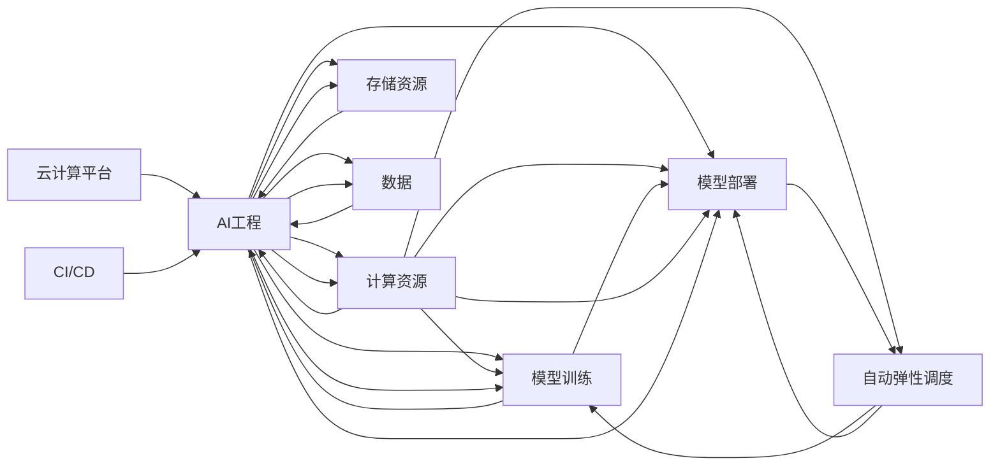

                 

## 1. 背景介绍

在过去几年间，人工智能（AI）和大数据（Big Data）的结合正在经历一场前所未有的变革，而云计算（Cloud Computing）在这个过程中扮演了至关重要的角色。云计算不仅提供了强大的计算资源和存储能力，还通过其弹性、按需服务的特性，为AI工程提供了完美的舞台。这种“云与AI的协同效应”让企业和科研机构能够以更低的成本、更快的速度和更高的灵活性，推动AI技术的发展与应用。

**云计算平台**是指通过网络提供计算资源、存储资源、应用软件服务、数据库服务等的一类IT基础设施，其核心特性是按需服务、广泛的网络连接和多租户环境。**AI工程**是指将AI技术应用于工程实践中的一系列活动，包括模型训练、数据处理、实验设计、模型部署、运营维护等。

在云计算和AI的结合中，AI工程师利用云计算平台提供的强大计算资源和灵活弹性，可以更快地开发、部署和迭代AI模型。同时，云计算平台通过自动化的监控和调度，保证了AI模型的高可用性和高性能。这种协同效应已经使得AI技术从研究实验室走进了各行各业，推动了技术的产业化进程。

本文将从云与AI的协同效应的观察出发，探讨云计算平台在AI工程中的应用，并结合案例分析，给出详细的实施步骤，以期对相关从业者提供有用的指导和启示。

## 2. 核心概念与联系

为了更好地理解云计算平台在AI工程中的应用，我们需要先了解几个核心概念及其相互联系：

**云计算平台**：指通过网络提供计算资源和存储资源的IT基础设施，其核心特性包括弹性、按需服务、多租户等。

**AI工程**：将AI技术应用于工程实践中，包括模型训练、数据处理、实验设计、模型部署、运营维护等一系列活动。

**弹性计算**：云计算平台提供动态的计算资源分配，能够根据实际需求自动扩展和缩减资源，从而高效利用计算资源。

**按需服务**：用户可以按需获取计算资源，无需关注底层硬件配置和维护，专注于自身业务的发展。

**多租户环境**：云计算平台可以同时服务于多个用户，每个用户独立拥有自己的计算资源，保证数据安全和隐私。

**模型训练**：使用云计算平台提供的计算资源，对AI模型进行训练，学习模型参数。

**模型部署**：将训练好的模型部署到云计算平台，提供服务，供外部用户调用。

**自动弹性调度**：根据系统负载自动调整计算资源，保证模型的高可用性和高性能。

**持续集成持续交付（CI/CD）**：通过自动化工具和流程，加速模型迭代和部署，提高开发效率。

这些核心概念通过以下Mermaid流程图展示了它们之间的相互联系：



这张图展示了云计算平台和AI工程之间的互动，以及资源、数据、模型训练、模型部署、弹性计算和CI/CD等关键环节的相互关联。

## 3. 核心算法原理 & 具体操作步骤

### 3.1 算法原理概述

云计算平台在AI工程中的应用，主要体现在以下几个方面：

- **计算资源管理**：云计算平台提供动态的计算资源管理，根据任务需求自动分配和回收计算资源。
- **数据管理**：云计算平台提供高效的数据存储和管理能力，支持大规模数据的存储和处理。
- **模型训练和推理**：云计算平台提供强大的计算资源和灵活的调度，支持复杂的模型训练和推理。
- **弹性计算**：云计算平台提供弹性计算能力，能够根据任务需求自动扩展和缩减资源，从而高效利用计算资源。
- **持续集成和持续交付（CI/CD）**：云计算平台支持持续集成和持续交付，加速模型的迭代和部署。

这些功能通过云计算平台提供的API和工具，可以方便地被AI工程师调用，帮助他们更高效地进行AI模型的开发、部署和运营。

### 3.2 算法步骤详解

云计算平台在AI工程中的应用，通常包括以下几个关键步骤：

**Step 1: 数据准备和上传**
- 准备数据集，并进行预处理，如清洗、去重、标注等。
- 使用云计算平台的存储服务（如AWS S3、Google Cloud Storage等）将数据上传到云端。

**Step 2: 模型训练**
- 选择合适的云计算平台（如AWS、Google Cloud、Microsoft Azure等），申请相应的计算资源。
- 安装和配置模型训练所需的工具和环境，如TensorFlow、PyTorch等。
- 根据模型需求，选择相应的计算资源（如CPU、GPU、TPU等），进行模型训练。
- 设置训练参数，如学习率、批次大小、迭代轮数等。

**Step 3: 模型评估和优化**
- 在验证集上评估模型性能，调整模型参数和训练策略。
- 使用云计算平台的弹性计算能力，自动调整计算资源，优化模型训练过程。

**Step 4: 模型部署**
- 将训练好的模型部署到云计算平台，提供服务。
- 使用云计算平台提供的API和工具，进行模型的部署和维护。
- 配置模型服务，支持在线推理和API调用。

**Step 5: 模型监控和维护**
- 使用云计算平台提供的监控工具，实时监控模型的运行状态和性能指标。
- 根据监控结果，自动调整计算资源，保持模型的高性能和可用性。
- 定期更新模型，添加新数据，改进模型性能。

### 3.3 算法优缺点

云计算平台在AI工程中的应用，具有以下优点：

- **计算资源弹性**：能够根据任务需求自动扩展和缩减资源，高效利用计算资源。
- **数据处理能力**：提供高效的数据存储和管理能力，支持大规模数据的存储和处理。
- **模型训练和推理**：提供强大的计算资源和灵活的调度，支持复杂的模型训练和推理。
- **持续集成和持续交付（CI/CD）**：加速模型的迭代和部署，提高开发效率。

同时，云计算平台也存在一些缺点：

- **数据隐私和安全**：云计算平台存储和管理大量数据，需要严格保护数据隐私和安全。
- **计算成本**：高负载情况下，云计算平台的计算成本可能较高。
- **依赖供应商**：云计算平台的可靠性和稳定性，取决于供应商的服务质量。

### 3.4 算法应用领域

云计算平台在AI工程中的应用，已经覆盖了众多领域，包括但不限于以下几类：

- **计算机视觉**：图像分类、目标检测、图像分割等任务，使用云计算平台提供的计算资源进行模型训练和推理。
- **自然语言处理**：文本分类、情感分析、机器翻译等任务，使用云计算平台进行数据处理和模型训练。
- **语音识别**：语音识别、语音合成、语音翻译等任务，使用云计算平台进行模型训练和推理。
- **推荐系统**：个性化推荐、广告推荐等任务，使用云计算平台进行模型训练和优化。
- **金融科技**：量化交易、信用评分、风险管理等任务，使用云计算平台进行数据处理和模型训练。

这些领域的应用，已经展示了云计算平台在AI工程中的巨大潜力。未来，云计算平台还将进一步推动AI技术在更多领域的应用，推动AI技术的发展和产业化进程。

## 4. 数学模型和公式 & 详细讲解 & 举例说明

### 4.1 数学模型构建

云计算平台在AI工程中的应用，通常涉及多个子任务，如数据预处理、模型训练、模型评估、模型部署等。这里，我们以**计算机视觉**中的**图像分类任务**为例，介绍如何在云计算平台上构建数学模型。

**输入**：输入图像 $x$，形状为 $H \times W \times C$，其中 $H$ 为高度，$W$ 为宽度，$C$ 为通道数。

**模型**：使用深度卷积神经网络（CNN）进行模型训练和推理。模型结构如下：

```text
             CNN
              └───────────────────────────────────────────────────────────────────────────────────────────────────────────────────────────────────────────────────────────────────────────────────────────────────────────────────────────────────────────────────────────────────────────────────────────────────────────────────────────────────────────────────────────────────────────────────────────────────────────────────────────────────────────────────────────────────────────────────────────────────────────────────────────────────────────────────────────────────────────────────────────────────────────────────────────────────────────────────────────────────────────────────────────────────────────────────────────────────────────────────────────────────────────────────────────────────────────────────────────────────────────────────────────────────────────────────────────────────────────────────────────────────────────────────────────────────────────────────────────────────────────────────────────────────────────────────────────────────────────────────────────────────────────────────────────────────────────────────────────────────────────────────────────────────────────────────────────────────────────────────────────────────────────────────────────────────────────────────────────────────────────────────────────────────────────────────────────────────────────────────────────────────────────────────────────────────────────────────────────────────────────────────────────────────────────────────────────────────────────────────────────────────────────────────────────────────────────────────────────────────────────────────────────────────────────────────────────────────────────────────────────────────────────────────────────────────────────────────────────────────────────────────────────────────────────────────────────────────────────────────────────────────────────────────────────────────────────────────────────────────────────────────────────────────────────────────────────────────────────────────────────────────────────────────────────────────────────────────────────────────────────────────────────────────────────────────────────────────────────────────────────────────────────────────────────────────────────────────────────────────────────────────────────────────────────────────────────────────────────────────────────────────────────────────────────────────────────────────────────────────────────────────────────────────────────────────────────────────────────────────────────────────────────────────────────────────────────────────────────────────────────────────────────────────────────────────────────────────────────────────────────────────────────────────────────────────────────────────────────────────────────────────────────────────────────────────────────────────────────────────────────────────────────────────────────────────────────────────────────────────────────────────────────────────────────────────────────────────────────────────────────────────────────────────────────────────────────────────────────────────────────────────────────────────────────────────────────────────────────────────────────────────────────────────────────────────────────────────────────────────────────────────────────────────────────────────────────────────────────────────────────────────────────────────────────────────────────────────────────────────────────────────────────────────────────────────────────────────────────────────────────────────────────────────────────────────────────────────────────────────────────────────────────────────────────────────────────────────────────────────────────────────────────────────────────────────────────────────────────────────────────────────────────────────────────────────────────────────────────────────────────────────────────────────────────────────────────────────────────────────────────────────────────────────────────────────────────────────────────────────────────────────────────────────────────────────────────────────────────────────────────────────────────────────────────────────────────────────────────────────────────────────────────────────────────────────────────────────────────────────────────────────────────────────────────────────────────────────────────────────────────────────────────────────────────────────────────────────────────────────────────────────────────────────────────────────────────────────────────────────────────────────────────────────────────────────────────────────────────────────────────────────────────────────────────────────────────────────────────────────────────────────────────────────────────────────────────────────────────────────────────────────────────────────────────────────────────────────────────────────────────────────────────────────────────────────────────────────────────────────────────────────────────────────────────────────────────────────────────────────────────────────────────────────────────────────────────────────────────────────────────────────────────────────────────────────────────────────────────────────────────────────────────────────────────────────────────────────────────────────────────────────────────────────────────────────────────────────────────────────────────────────────────────────────────────────────────────────────────────────────────────────────────────────────────────────────────────────────────────────────────────────────────────────────────────────────────────────────────────────────────────────────────────────────────────────────────────────────────────────────────────────────────────────────────────────────────────────────────────────────────────────────────────────────────────────────────────────────────────────────────────────────────────────────────────────────────────────────────────────────────────────────────────────────────────────────────────────────────────────────────────────────────────────────────────────────────────────────────────────────────────────────────────────────────────────────────────────────────────────────────────────────────────────────────────────────────────────────────────────────────────────────────────────────────────────────────────────────────────────────────────────────────────────────────────────────────────────────────────────────────────────────────────────────────────────────────────────────────────────────────────────────────────────────────────────────────────────────────────────────────────────────────────────────────────────────────────────────────────────────────────────────────────────────────────────────────────────────────────────────────────────────────────────────────────────────────────────────────────────────────────────────────────────────────────────────────────────────────────────────────────────────────────────────────────────────────────────────────────────────────────────────────────────────────────────────────────────────────────────────────────────────────────────────────────────────────────────────────────────────────────────────────────────────────────────────────────────────────────────────────────────────────────────────────────────────────────────────────────────────────────────────────────────────────────────────────────────────────────────────────────────────────────────────────────────────────────────

