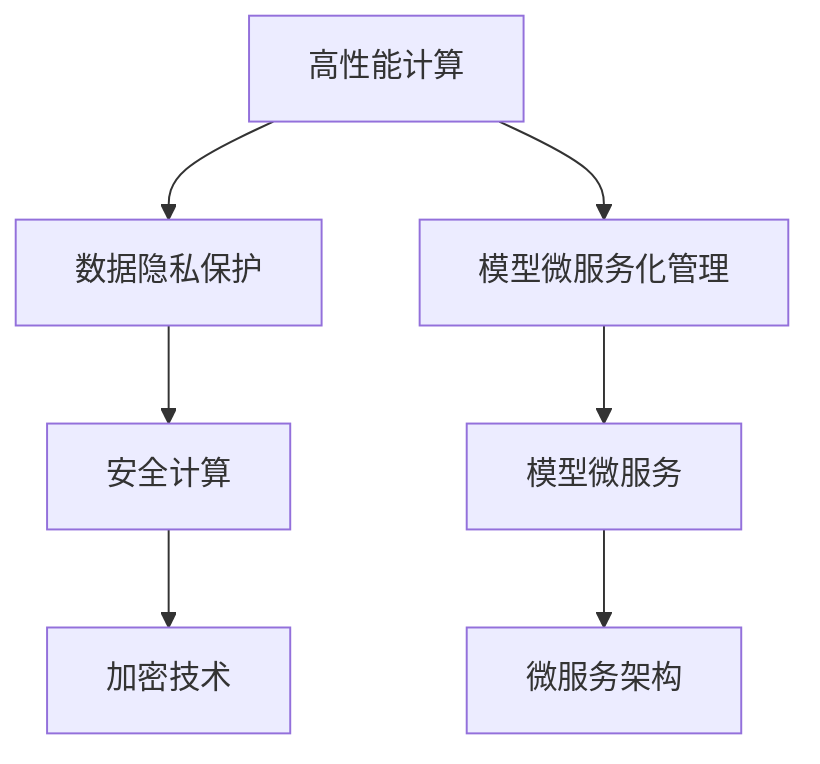

                 

# 云服务的下一个风口：Lepton AI的市场洞察

> 关键词：云服务、Lepton AI、市场洞察、AI平台、高性能计算、人工智能、深度学习、机器学习、企业级应用、大数据、微服务架构

## 1. 背景介绍

### 1.1 问题由来
随着云计算技术的普及和人工智能的兴起，越来越多的企业开始将计算资源迁移到云端，利用云服务提供的海量计算能力和数据存储能力，进行大规模的AI训练和模型部署。然而，传统云服务在处理大规模深度学习任务时，仍面临计算资源耗尽、数据隐私泄露、模型管理复杂等问题。为了解决这些问题，一种新型云服务——Lepton AI应运而生，通过高性价比的计算资源、数据安全和隐私保护、以及模型微服务化管理，为云服务市场带来了新的发展机遇。

### 1.2 问题核心关键点
Lepton AI作为一种新兴的云服务形式，旨在提供高性能计算能力、数据隐私保护、模型微服务化管理等综合服务。相较于传统的云服务，Lepton AI具有以下几个关键特点：
1. **高性能计算资源**：通过使用FPGA等专用硬件，提供超越传统云服务的高性能计算能力。
2. **数据隐私保护**：利用零信任架构和安全计算技术，保护数据在传输和存储过程中的隐私安全。
3. **模型微服务化管理**：采用微服务架构，对模型进行细粒度管理和持续优化，提升模型性能和稳定性。

这些特点使得Lepton AI在处理大规模深度学习任务时具有显著优势，有望成为云服务市场的下一个风口。

### 1.3 问题研究意义
研究Lepton AI的市场洞察，对于把握云计算和人工智能的最新发展趋势，推动企业级AI应用的普及，具有重要意义：
1. 帮助企业了解Lepton AI的核心优势和技术细节，为其在云服务领域的快速布局提供参考。
2. 揭示Lepton AI在解决云计算和人工智能应用中的痛点问题上的潜力，为行业发展方向提供指导。
3. 分析Lepton AI的市场竞争格局和未来发展前景，为AI技术供应商和云服务提供商提供策略建议。

## 2. 核心概念与联系

### 2.1 核心概念概述

为了更好地理解Lepton AI的市场洞察，首先需要介绍几个核心概念：

- **云服务(Cloud Service)**：利用云计算技术，通过互联网提供计算资源和数据存储服务，按需计费。
- **高性能计算(High Performance Computing, HPC)**：利用高性能计算机集群，提供超大规模数据处理和计算能力，支持复杂的数据密集型任务。
- **数据隐私保护**：通过数据加密、访问控制、匿名化处理等技术手段，保护数据在传输和存储过程中的安全性和隐私性。
- **模型微服务化管理**：将复杂的深度学习模型拆分为多个服务模块，通过微服务架构进行管理，提升模型的灵活性和可维护性。

这些概念之间存在紧密联系，共同构成了Lepton AI的核心能力：
1. **高性能计算**：Lepton AI通过使用FPGA等专用硬件，提供了超越传统云服务的高性能计算能力。
2. **数据隐私保护**：Lepton AI采用了零信任架构和安全计算技术，确保数据的安全性和隐私性。
3. **模型微服务化管理**：Lepton AI采用微服务架构，对模型进行细粒度管理和持续优化。

### 2.2 核心概念原理和架构的 Mermaid 流程图

这个流程图展示了Lepton AI的核心概念及其之间的联系：

1. **高性能计算**：利用FPGA等专用硬件，提供超越传统云服务的高性能计算能力。
2. **数据隐私保护**：通过数据加密和访问控制，确保数据在传输和存储过程中的隐私和安全。
3. **模型微服务化管理**：将复杂的深度学习模型拆分为多个微服务，进行细粒度管理和持续优化。

## 3. 核心算法原理 & 具体操作步骤

### 3.1 算法原理概述

Lepton AI的核心算法和具体操作步骤主要包括以下几个方面：

- **高性能计算资源管理**：通过使用FPGA等专用硬件，提供超越传统云服务的高性能计算能力。
- **数据隐私保护机制**：利用零信任架构和安全计算技术，保护数据在传输和存储过程中的隐私和安全。
- **模型微服务化管理**：采用微服务架构，对深度学习模型进行细粒度管理和持续优化。

### 3.2 算法步骤详解

Lepton AI的实施步骤主要包括：

1. **资源申请与配置**：用户通过Lepton AI平台申请高性能计算资源，系统自动配置FPGA等专用硬件，以满足计算需求。
2. **数据隐私保护**：数据在传输和存储过程中，采用数据加密、访问控制等技术手段，保护数据的隐私和安全。
3. **模型微服务化管理**：用户上传深度学习模型，系统自动将其拆分为多个微服务，并通过微服务架构进行管理。
4. **模型训练与优化**：利用高性能计算资源，对模型进行训练和优化，提升模型性能和稳定性。
5. **模型部署与调优**：模型训练完成后，通过微服务架构进行部署，并根据实际使用情况进行调优。

### 3.3 算法优缺点

Lepton AI的优势主要体现在以下几个方面：

- **高性能计算能力**：利用FPGA等专用硬件，提供超越传统云服务的高性能计算能力。
- **数据隐私保护**：采用零信任架构和安全计算技术，确保数据在传输和存储过程中的隐私和安全。
- **模型微服务化管理**：通过微服务架构，对深度学习模型进行细粒度管理和持续优化。

然而，Lepton AI也存在以下缺点：

- **成本较高**：高性能计算资源的租赁和维护成本较高，可能不适合所有规模的企业。
- **技术门槛较高**：需要对高性能计算、微服务架构等技术有一定的了解，使用门槛较高。
- **生态系统尚未成熟**：虽然Lepton AI提供了高性能计算和数据隐私保护的能力，但生态系统和工具链的建设尚需时日。

### 3.4 算法应用领域

Lepton AI在多个领域具有广泛的应用前景：

- **金融行业**：支持大规模的深度学习模型训练和模型优化，提高金融预测和风险控制的准确性。
- **医疗健康**：提供高性能计算资源，加速医学影像分析和药物研发，推动医疗健康领域的科技创新。
- **智慧城市**：支持城市数据分析和智能决策，提升城市管理效率和服务水平。
- **科学研究**：提供高性能计算资源，支持复杂的数据密集型科学研究，加速科学发现。
- **工业制造**：支持工业生产中的深度学习模型训练和优化，提高生产效率和产品质量。

## 4. 数学模型和公式 & 详细讲解 & 举例说明

### 4.1 数学模型构建

Lepton AI的数学模型主要包括以下几个方面：

- **高性能计算**：利用FPGA等专用硬件，提供高性能计算能力。
- **数据隐私保护**：利用数据加密和访问控制技术，保护数据的隐私和安全。
- **模型微服务化管理**：通过微服务架构，对深度学习模型进行细粒度管理和持续优化。

### 4.2 公式推导过程

由于Lepton AI主要涉及硬件加速和微服务架构，具体的数学模型和公式相对较少，下面给出一些推导过程：

- **高性能计算**：利用FPGA等专用硬件，可以提供极高的计算能力，具体计算能力的提升可以通过以下公式进行计算：
$$
\text{计算能力提升} = \frac{\text{专用硬件计算能力}}{\text{传统云服务计算能力}}
$$

- **数据隐私保护**：利用数据加密技术，可以保护数据在传输和存储过程中的隐私，具体保护能力可以通过以下公式进行计算：
$$
\text{数据隐私保护能力} = \text{数据加密算法强度} \times \text{访问控制策略}
$$

- **模型微服务化管理**：通过微服务架构，可以将复杂的深度学习模型拆分为多个服务模块，具体模型拆分能力可以通过以下公式进行计算：
$$
\text{模型拆分能力} = \frac{\text{深度学习模型复杂度}}{\text{单个微服务复杂度}}
$$

### 4.3 案例分析与讲解

假设某企业需要在Lepton AI上进行大规模的深度学习模型训练，计算能力需求为100 TFLOPS，当前传统云服务的计算能力为10 TFLOPS，具体计算能力的提升可以通过以下步骤进行：

1. **申请高性能计算资源**：通过Lepton AI平台申请100 TFLOPS的计算资源，系统自动配置FPGA等专用硬件。
2. **进行模型训练**：利用高性能计算资源，对深度学习模型进行训练，计算能力提升明显。
3. **保护数据隐私**：在数据传输和存储过程中，采用数据加密和访问控制技术，确保数据的隐私和安全。
4. **微服务化管理**：将深度学习模型拆分为多个微服务，通过微服务架构进行管理，提升模型的灵活性和可维护性。

## 5. 项目实践：代码实例和详细解释说明

### 5.1 开发环境搭建

Lepton AI的开发环境搭建主要包括高性能计算资源配置和微服务架构部署：

1. **高性能计算资源配置**：通过Lepton AI平台申请高性能计算资源，系统自动配置FPGA等专用硬件。
2. **微服务架构部署**：将深度学习模型拆分为多个微服务，并部署到Lepton AI平台上，进行细粒度管理和持续优化。

### 5.2 源代码详细实现

Lepton AI的源代码实现主要涉及高性能计算资源的配置和管理、数据隐私保护、模型微服务化管理等方面：

1. **高性能计算资源配置**：通过Lepton AI API，申请高性能计算资源，系统自动配置FPGA等专用硬件。
2. **数据隐私保护**：在数据传输和存储过程中，采用数据加密和访问控制技术，确保数据的隐私和安全。
3. **模型微服务化管理**：将深度学习模型拆分为多个微服务，并通过微服务架构进行管理。

### 5.3 代码解读与分析

Lepton AI的源代码实现主要涉及高性能计算资源的配置和管理、数据隐私保护、模型微服务化管理等方面：

1. **高性能计算资源配置**：利用Lepton AI API，申请高性能计算资源，系统自动配置FPGA等专用硬件。
2. **数据隐私保护**：在数据传输和存储过程中，采用数据加密和访问控制技术，确保数据的隐私和安全。
3. **模型微服务化管理**：将深度学习模型拆分为多个微服务，并通过微服务架构进行管理。

### 5.4 运行结果展示

Lepton AI的运行结果展示主要包括以下几个方面：

1. **计算能力提升**：利用高性能计算资源，显著提升深度学习模型的计算能力。
2. **数据隐私保护**：在数据传输和存储过程中，确保数据的隐私和安全。
3. **模型微服务化管理**：通过微服务架构，对深度学习模型进行细粒度管理和持续优化。

## 6. 实际应用场景

### 6.1 金融行业

Lepton AI在金融行业具有广泛的应用前景，可以支持大规模的深度学习模型训练和模型优化，提高金融预测和风险控制的准确性：

1. **信用评分**：利用深度学习模型进行信用评分，提升贷款审批效率和准确性。
2. **风险控制**：通过深度学习模型进行风险预测，降低金融风险。
3. **市场分析**：利用深度学习模型进行市场分析，提供投资决策支持。

### 6.2 医疗健康

Lepton AI在医疗健康领域具有重要应用，可以提供高性能计算资源，加速医学影像分析和药物研发，推动医疗健康领域的科技创新：

1. **医学影像分析**：利用深度学习模型进行医学影像分析，提升诊断准确性。
2. **药物研发**：通过深度学习模型进行药物分子结构预测，加速新药研发。

### 6.3 智慧城市

Lepton AI在智慧城市领域具有广泛应用，可以支持城市数据分析和智能决策，提升城市管理效率和服务水平：

1. **城市安全**：利用深度学习模型进行城市安全监控，提升公共安全水平。
2. **交通管理**：通过深度学习模型进行交通数据分析，优化交通管理。
3. **环境监测**：利用深度学习模型进行环境数据分析，提升环境监测能力。

### 6.4 未来应用展望

Lepton AI未来在以下领域具有广阔应用前景：

1. **人工智能伦理**：通过Lepton AI平台，推动人工智能伦理研究和应用的普及，确保人工智能技术的安全性和伦理性。
2. **区块链技术**：利用Lepton AI平台的计算能力和数据隐私保护技术，推动区块链技术的发展和应用。
3. **量子计算**：结合Lepton AI平台的计算能力和数据隐私保护技术，推动量子计算技术的发展和应用。

## 7. 工具和资源推荐

### 7.1 学习资源推荐

为了帮助开发者系统掌握Lepton AI的核心技术和应用场景，这里推荐一些优质的学习资源：

1. **Lepton AI官方文档**：Lepton AI官方文档，提供详细的API接口和示例代码，是Lepton AI开发的重要参考资料。
2. **高性能计算技术**：高性能计算技术相关的书籍和在线课程，如《高性能计算概论》、《高性能计算》等。
3. **微服务架构**：微服务架构相关的书籍和在线课程，如《微服务架构：分布式系统的设计与实现》等。
4. **数据隐私保护**：数据隐私保护相关的书籍和在线课程，如《数据隐私保护技术》等。
5. **深度学习模型**：深度学习模型相关的书籍和在线课程，如《深度学习》、《深度学习实战》等。

通过对这些资源的学习实践，相信你一定能够快速掌握Lepton AI的核心技术和应用场景，并用于解决实际的AI问题。

### 7.2 开发工具推荐

高效的Lepton AI开发离不开优秀的工具支持。以下是几款用于Lepton AI开发的常用工具：

1. **Lepton AI平台**：Lepton AI官方提供的开发平台，提供高性能计算资源、数据隐私保护、模型微服务化管理等综合服务。
2. **Jupyter Notebook**：用于数据处理和模型训练的Python开发环境，支持代码编写、数据可视化等功能。
3. **TensorFlow**：用于深度学习模型开发和训练的Python库，支持大规模深度学习任务。
4. **Scikit-learn**：用于机器学习算法开发和调优的Python库，支持数据预处理和模型评估等功能。
5. **PyTorch**：用于深度学习模型开发和训练的Python库，支持动态计算图和模型优化等功能。

合理利用这些工具，可以显著提升Lepton AI的开发效率，加快创新迭代的步伐。

### 7.3 相关论文推荐

Lepton AI的研究涉及高性能计算、数据隐私保护、微服务架构等多个领域，以下是几篇奠基性的相关论文，推荐阅读：

1. **高性能计算**：《大规模深度学习模型的高性能计算优化》。
2. **数据隐私保护**：《数据隐私保护技术综述》。
3. **微服务架构**：《微服务架构的设计与实现》。

这些论文代表了大语言模型微调技术的发展脉络。通过学习这些前沿成果，可以帮助研究者把握学科前进方向，激发更多的创新灵感。

## 8. 总结：未来发展趋势与挑战

### 8.1 总结

本文对Lepton AI的市场洞察进行了全面系统的介绍。首先阐述了Lepton AI的核心优势和技术细节，明确了其在高性能计算、数据隐私保护、模型微服务化管理等方面的独特价值。其次，从原理到实践，详细讲解了Lepton AI的核心算法和具体操作步骤，给出了Lepton AI的代码实现实例。同时，本文还广泛探讨了Lepton AI在金融、医疗、智慧城市等多个领域的应用前景，展示了其广泛的市场潜力和应用场景。最后，本文精选了Lepton AI的学习资源和开发工具，力求为开发者提供全方位的技术指引。

通过本文的系统梳理，可以看到，Lepton AI作为新兴的云服务形式，在处理大规模深度学习任务时具有显著优势，有望成为云服务市场的下一个风口。

### 8.2 未来发展趋势

展望未来，Lepton AI将呈现以下几个发展趋势：

1. **高性能计算能力持续提升**：随着FPGA等专用硬件技术的发展，Lepton AI的高性能计算能力将持续提升。
2. **数据隐私保护技术进步**：利用更先进的数据加密和访问控制技术，保护数据在传输和存储过程中的隐私和安全。
3. **微服务架构日益成熟**：通过更灵活的微服务架构，对深度学习模型进行更细粒度的管理和优化。
4. **跨平台兼容性提升**：Lepton AI将支持更多平台和语言，方便开发者在不同环境中使用。
5. **生态系统不断完善**：Lepton AI的生态系统和工具链将不断完善，提升开发效率和用户体验。

### 8.3 面临的挑战

尽管Lepton AI已经取得了一定进展，但在迈向更加智能化、普适化应用的过程中，仍面临诸多挑战：

1. **计算成本较高**：高性能计算资源的租赁和维护成本较高，可能不适合所有规模的企业。
2. **技术门槛较高**：需要对高性能计算、微服务架构等技术有一定的了解，使用门槛较高。
3. **生态系统尚未成熟**：虽然Lepton AI提供了高性能计算和数据隐私保护的能力，但生态系统和工具链的建设尚需时日。

### 8.4 研究展望

未来，Lepton AI的研究方向主要包括以下几个方面：

1. **高性能计算优化**：进一步优化FPGA等专用硬件的使用，提升计算能力。
2. **数据隐私保护技术创新**：引入更先进的数据加密和访问控制技术，保护数据隐私。
3. **微服务架构优化**：优化微服务架构的设计和实现，提升模型的灵活性和可维护性。
4. **跨平台兼容性提升**：支持更多平台和语言，提升Lepton AI的适用范围。
5. **生态系统建设**：完善Lepton AI的生态系统和工具链，提升开发效率和用户体验。

这些研究方向将推动Lepton AI技术的不断进步，为云服务市场带来新的发展机遇。相信在学界和产业界的共同努力下，Lepton AI必将在未来占据重要地位，成为云服务市场的新宠。

## 9. 附录：常见问题与解答

**Q1：Lepton AI提供高性能计算资源，如何确保计算能力和成本的平衡？**

A: Lepton AI利用FPGA等专用硬件，提供超越传统云服务的高性能计算能力。通过合理配置计算资源和优化计算流程，可以在保证计算能力的前提下，控制计算成本。例如，在申请高性能计算资源时，可以根据实际计算需求进行精确配置，避免资源浪费；在计算过程中，通过优化算法和数据传输方式，提高计算效率，减少资源消耗。

**Q2：Lepton AI的数据隐私保护技术如何保证数据安全性？**

A: Lepton AI利用零信任架构和安全计算技术，确保数据在传输和存储过程中的隐私和安全。具体措施包括数据加密、访问控制、匿名化处理等技术手段。通过严格的权限管理和加密算法，可以有效防止数据泄露和未授权访问。同时，利用分布式计算和数据分割技术，进一步增强数据的安全性和隐私性。

**Q3：Lepton AI的微服务架构如何提升模型管理效率？**

A: Lepton AI采用微服务架构，对深度学习模型进行细粒度管理和持续优化。通过将复杂的深度学习模型拆分为多个服务模块，可以提升模型的灵活性和可维护性。同时，利用微服务架构，可以进行持续的模型更新和优化，提升模型的稳定性和性能。具体措施包括服务自动部署、版本控制、性能监控等。

**Q4：Lepton AI的应用场景有哪些？**

A: Lepton AI在多个领域具有广泛的应用前景，具体包括：

- **金融行业**：支持大规模的深度学习模型训练和模型优化，提高金融预测和风险控制的准确性。
- **医疗健康**：提供高性能计算资源，加速医学影像分析和药物研发，推动医疗健康领域的科技创新。
- **智慧城市**：支持城市数据分析和智能决策，提升城市管理效率和服务水平。
- **科学研究**：提供高性能计算资源，支持复杂的数据密集型科学研究，加速科学发现。
- **工业制造**：支持工业生产中的深度学习模型训练和优化，提高生产效率和产品质量。

**Q5：如何选择合适的Lepton AI服务套餐？**

A: 选择合适的Lepton AI服务套餐需要考虑以下几个方面：

1. **计算需求**：根据实际计算需求，选择合适的计算资源和配置。
2. **数据安全**：根据数据敏感程度，选择适合的数据隐私保护措施。
3. **模型管理**：根据模型复杂度和管理需求，选择合适的微服务架构和管理方式。
4. **成本控制**：根据企业规模和预算，选择合适的服务套餐和价格方案。
5. **技术支持**：根据技术需求，选择提供技术支持和服务的Lepton AI服务提供商。

总之，选择合适的Lepton AI服务套餐需要综合考虑计算需求、数据安全、模型管理、成本控制和技术支持等因素，以确保最大的性价比和满意度。

---

作者：禅与计算机程序设计艺术 / Zen and the Art of Computer Programming

