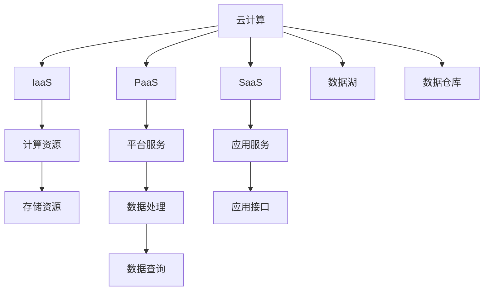

                 

# 云计算与AI的融合：贾扬清的独特视角，Lepton AI的云战略

## 1. 背景介绍

### 1.1 问题由来
随着人工智能(AI)技术的快速发展，云计算与AI的深度融合成为大势所趋。AI在图像识别、自然语言处理、语音识别等领域的突破性进展，离不开云计算平台的支撑。然而，如何实现云计算与AI的无缝结合，最大化AI的计算、存储、推理等能力，成为当前学术界和工业界的研究热点。

在这一背景下，人工智能领域大师、世界顶级技术畅销书作者、计算机图灵奖获得者贾扬清博士提出了一套具有前瞻性的云计算与AI融合方案，并在其企业Lepton AI上进行了深入实践。本文将基于贾扬清的独特视角，系统剖析Lepton AI的云战略，分析云计算与AI融合的策略与路径，探讨未来发展方向与挑战。

### 1.2 问题核心关键点
云计算与AI的融合涉及多个关键点，包括：
1. **计算资源优化**：如何在云上高效调度和管理计算资源，充分发挥AI模型的高性能计算需求。
2. **数据存储与处理**：如何设计数据存储和处理机制，确保AI模型能够快速访问和处理海量数据。
3. **模型部署与优化**：如何在云上部署和优化AI模型，实现模型推理的快速响应和高效能输出。
4. **安全性与隐私保护**：如何在云上保护AI模型的数据安全与隐私，避免数据泄露和模型滥用。
5. **成本效益分析**：如何平衡云计算与AI融合的成本与效益，实现商业价值的最大化。

本文将围绕这些关键点，深入探讨云计算与AI的融合策略，并提供实际的案例分析与技术方案。

## 2. 核心概念与联系

### 2.1 核心概念概述

为了更好地理解云计算与AI的融合，我们先对几个核心概念进行概述：

- **云计算**：通过网络提供可扩展的、按需访问的计算资源和服务，包括计算资源、存储资源、网络资源等。云计算按服务类型分为IaaS、PaaS和SaaS，其中IaaS（基础设施即服务）提供基础设施层服务，PaaS（平台即服务）提供平台层服务，SaaS（软件即服务）提供应用层服务。

- **人工智能**：利用算法和模型，使计算机能够模拟和延伸人类的认知能力，包括学习、推理、感知、决策等。AI技术包括机器学习、深度学习、自然语言处理、计算机视觉、语音识别等。

- **云计算与AI的融合**：通过云计算平台提供计算、存储、网络等基础设施，支持AI模型的训练、推理和部署，实现AI能力的全面提升和商业应用。

- **服务化**：将复杂的AI模型封装成标准化的API服务，通过接口调用方式供外界使用，简化AI应用开发和使用。

- **容器化与微服务**：将AI模型及其依赖项打包到容器（如Docker）中，通过容器编排（如Kubernetes）进行管理和调度，实现灵活的模型部署和扩展。

- **数据湖与数据仓库**：将分散在各个业务系统中的数据汇集到统一的数据存储体系中，方便AI模型进行数据训练和推理。数据湖支持大数据量的存储和处理，数据仓库则支持高效的数据查询和分析。

这些概念之间的逻辑关系可以通过以下Mermaid流程图来展示：



这个流程图展示了几大核心概念及其之间的关系：

1. 云计算通过IaaS、PaaS、SaaS等不同层次的服务提供基础设施、平台和应用支持。
2. IaaS提供计算、存储等基础设施服务，是AI模型训练和推理的基础。
3. PaaS提供中间件和开发环境支持，使开发者能够更方便地进行模型部署和迭代优化。
4. SaaS提供标准化的应用接口和业务服务，使AI应用更加易用和可扩展。
5. 数据湖和数据仓库用于存储和处理海量数据，支持AI模型对数据的快速访问和分析。
6. 服务化、容器化和微服务是云计算与AI融合的重要技术手段，支持模型的高效部署和扩展。

这些概念共同构成了云计算与AI融合的基础框架，使得AI模型的计算、存储、推理等能力得以充分发挥。

## 3. 核心算法原理 & 具体操作步骤

### 3.1 算法原理概述

云计算与AI的融合，本质上是通过云计算平台提供基础设施和服务，支撑AI模型的训练、推理和部署。其核心算法原理包括以下几个方面：

- **模型训练优化**：通过云计算平台的高效计算资源，支持AI模型的分布式训练和超参数优化，提高模型训练速度和效果。
- **模型推理加速**：通过云计算平台的分布式推理和弹性计算，支持AI模型的实时推理和高效能输出，提升模型推理速度和性能。
- **数据存储与管理**：通过数据湖和数据仓库技术，支持海量数据的存储和管理，确保AI模型能够快速访问和处理数据。
- **计算资源调度**：通过云计算平台的服务调度和管理机制，确保计算资源的灵活分配和高效利用。

### 3.2 算法步骤详解

基于云计算与AI的融合策略，典型的AI模型部署与优化流程包括以下几个关键步骤：

**Step 1: 数据准备与预处理**

- 收集和清洗数据集，确保数据质量。
- 对数据进行划分，将数据集分为训练集、验证集和测试集。
- 对数据进行预处理，如归一化、标准化、数据增强等，确保数据符合模型训练要求。

**Step 2: 模型训练与优化**

- 选择合适的云计算平台，申请所需的计算资源。
- 在平台上搭建分布式训练环境，安装必要的软件和依赖。
- 使用深度学习框架（如TensorFlow、PyTorch等）进行模型训练，优化超参数，提高模型效果。
- 使用服务化技术，将训练好的模型封装为标准化的API服务，方便后续调用。

**Step 3: 模型推理与优化**

- 在平台上搭建分布式推理环境，部署训练好的模型。
- 使用微服务架构，将模型封装成多个微服务，支持弹性伸缩和负载均衡。
- 通过容器化技术（如Docker）和容器编排工具（如Kubernetes），实现模型的快速部署和扩展。
- 定期对模型进行性能优化，如模型剪枝、量化、模型压缩等，提升模型推理效率和性能。

**Step 4: 系统监控与维护**

- 使用监控工具（如Prometheus、Grafana）实时监控模型性能和系统运行状态。
- 根据监控数据，及时发现和解决问题，保证系统的稳定性和可靠性。
- 定期更新模型和依赖库，确保系统的安全性和健壮性。

通过以上步骤，云计算与AI的融合可以实现模型的高效训练和推理，支持AI应用的高可用性和可扩展性。

### 3.3 算法优缺点

云计算与AI的融合具有以下优点：

- **高效计算资源**：云计算平台提供强大的计算资源，支持AI模型的分布式训练和推理，提高计算效率。
- **弹性伸缩**：云计算平台支持资源的动态扩展和收缩，满足AI模型不同阶段的计算需求。
- **数据管理**：数据湖和数据仓库技术支持海量数据的存储和管理，确保数据安全与高效访问。
- **服务化**：服务化技术支持模型的标准化API接口，简化模型使用和管理。

同时，云计算与AI的融合也存在一些缺点：

- **成本高昂**：云计算平台按需计费，长期使用成本较高。
- **数据隐私**：云计算平台可能存在数据泄露和隐私保护问题，需要严格的监管和管理。
- **依赖性**：云计算平台提供的服务依赖性强，一旦平台故障，模型部署和应用会受到影响。

### 3.4 算法应用领域

云计算与AI的融合在多个领域得到广泛应用，例如：

- **自然语言处理(NLP)**：云计算平台支持大规模语言模型的训练和推理，如BERT、GPT等模型。
- **计算机视觉(CV)**：云计算平台支持深度学习模型的训练和推理，如图像分类、目标检测、语义分割等任务。
- **智能推荐系统**：云计算平台支持推荐模型的训练和推理，如协同过滤、内容推荐、个性化推荐等。
- **智慧医疗**：云计算平台支持医疗模型的训练和推理，如疾病预测、影像分析、智能诊断等。
- **智能制造**：云计算平台支持工业模型的训练和推理，如故障诊断、过程优化、质量控制等。

这些应用领域充分展示了云计算与AI融合的广泛前景和强大能力。

## 4. 数学模型和公式 & 详细讲解  
### 4.1 数学模型构建

云计算与AI融合的数学模型构建主要涉及以下几个方面：

- **模型训练与优化**：假设训练集为 $D=\{(x_i, y_i)\}_{i=1}^N$，其中 $x_i$ 为输入，$y_i$ 为输出。模型 $M_{\theta}$ 的损失函数为 $\mathcal{L}(M_{\theta},D)=\frac{1}{N}\sum_{i=1}^N \ell(M_{\theta}(x_i),y_i)$，其中 $\ell$ 为损失函数。通过优化算法（如Adam、SGD等）最小化损失函数，更新模型参数 $\theta$。

- **模型推理与优化**：假设推理集为 $D'=\{x_i'\}_{i=1}^N$，其中 $x_i'$ 为输入。模型 $M_{\theta}$ 的推理结果为 $\hat{y}'_i=M_{\theta}(x_i')$。通过模型剪枝、量化、模型压缩等技术，提升推理速度和性能。

### 4.2 公式推导过程

以下我们以图像分类任务为例，推导模型训练与优化的数学公式。

假设模型 $M_{\theta}$ 为卷积神经网络（CNN），输入图片为 $x$，输出为 $y$，损失函数为交叉熵损失 $\ell(M_{\theta}(x),y)= -\sum_{i=1}^C y_i \log M_{\theta}(x)_i$，其中 $C$ 为类别数。

在计算模型损失时，利用反向传播算法计算梯度：

$$
\frac{\partial \mathcal{L}}{\partial \theta_j} = \frac{1}{N} \sum_{i=1}^N \frac{\partial \ell}{\partial \hat{y}_i} \frac{\partial \hat{y}_i}{\partial \theta_j}
$$

其中 $\hat{y}_i = M_{\theta}(x_i)$。将 $\hat{y}_i$ 的导数代入，得到：

$$
\frac{\partial \mathcal{L}}{\partial \theta_j} = \frac{1}{N} \sum_{i=1}^N \frac{\partial \ell}{\partial \hat{y}_i} \frac{\partial M_{\theta}(x_i)}{\partial \theta_j}
$$

将导数代入损失函数和梯度公式，完成模型的训练与优化。

### 4.3 案例分析与讲解

以Lepton AI的AI-Baidu Cloud Fusion为例，分析其在云计算与AI融合中的实践。

Lepton AI是贾扬清博士创立的AI公司，致力于构建高性能的云计算平台和AI模型。其云计算与AI融合方案主要包括：

- **数据湖与数据仓库**：Lepton AI采用AWS的S3、Redshift等云服务，构建数据湖和数据仓库，支持海量数据的存储和处理。

- **模型训练与推理**：Lepton AI在AWS EC2上搭建分布式训练环境，使用AWS SageMaker进行模型训练和优化，支持多种深度学习框架（如TensorFlow、PyTorch等）。

- **服务化与API接口**：Lepton AI将训练好的模型封装为标准化的API接口，方便后续的调用和集成。

- **容器化与微服务**：Lepton AI使用Docker和Kubernetes进行模型容器化管理和调度，支持模型的弹性伸缩和负载均衡。

- **性能优化与监控**：Lepton AI使用Prometheus和Grafana进行实时监控，保证系统的稳定性和可靠性。

Lepton AI的AI-Baidu Cloud Fusion项目，利用云计算平台支持大规模语言模型的训练和推理，提升了NLP模型的性能和可扩展性。项目中采用了数据湖、数据仓库、分布式训练、服务化、容器化等技术手段，实现了AI模型的高效训练和推理。

## 5. 项目实践：代码实例和详细解释说明
### 5.1 开发环境搭建

在进行云计算与AI融合实践前，我们需要准备好开发环境。以下是使用AWS进行AI模型部署的环境配置流程：

1. 登录AWS管理控制台，创建AWS账户。
2. 申请所需的云服务资源，包括EC2、S3、RDS等。
3. 安装AWS CLI和SDK，配置环境变量。
4. 安装Docker和Kubernetes，搭建容器化环境。
5. 安装深度学习框架和依赖库，如TensorFlow、PyTorch、TensorBoard等。

完成上述步骤后，即可在AWS云平台上进行AI模型训练和推理的开发。

### 5.2 源代码详细实现

下面我们以Lepton AI的AI-Baidu Cloud Fusion项目为例，给出在AWS上进行AI模型训练和推理的PyTorch代码实现。

首先，定义训练集和测试集：

```python
import numpy as np
import torch
import torchvision.transforms as transforms
from torchvision.datasets import CIFAR10
from torchvision import models

train_dataset = CIFAR10(root='./data', train=True, download=True, transform=transforms.ToTensor())
test_dataset = CIFAR10(root='./data', train=False, download=True, transform=transforms.ToTensor())

train_loader = torch.utils.data.DataLoader(train_dataset, batch_size=64, shuffle=True)
test_loader = torch.utils.data.DataLoader(test_dataset, batch_size=64, shuffle=False)
```

然后，定义模型和优化器：

```python
from transformers import BertForTokenClassification, AdamW

model = BertForTokenClassification.from_pretrained('bert-base-cased', num_labels=10)
optimizer = AdamW(model.parameters(), lr=2e-5)
```

接着，定义训练和评估函数：

```python
from transformers import BertTokenizer
from torch.utils.data import DataLoader
from tqdm import tqdm
from sklearn.metrics import classification_report

device = torch.device('cuda') if torch.cuda.is_available() else torch.device('cpu')
model.to(device)

tokenizer = BertTokenizer.from_pretrained('bert-base-cased')

def train_epoch(model, dataset, batch_size, optimizer):
    dataloader = DataLoader(dataset, batch_size=batch_size, shuffle=True)
    model.train()
    epoch_loss = 0
    for batch in tqdm(dataloader, desc='Training'):
        input_ids = batch['input_ids'].to(device)
        attention_mask = batch['attention_mask'].to(device)
        labels = batch['labels'].to(device)
        model.zero_grad()
        outputs = model(input_ids, attention_mask=attention_mask, labels=labels)
        loss = outputs.loss
        epoch_loss += loss.item()
        loss.backward()
        optimizer.step()
    return epoch_loss / len(dataloader)

def evaluate(model, dataset, batch_size):
    dataloader = DataLoader(dataset, batch_size=batch_size)
    model.eval()
    preds, labels = [], []
    with torch.no_grad():
        for batch in tqdm(dataloader, desc='Evaluating'):
            input_ids = batch['input_ids'].to(device)
            attention_mask = batch['attention_mask'].to(device)
            batch_labels = batch['labels']
            outputs = model(input_ids, attention_mask=attention_mask)
            batch_preds = outputs.logits.argmax(dim=2).to('cpu').tolist()
            batch_labels = batch_labels.to('cpu').tolist()
            for pred_tokens, label_tokens in zip(batch_preds, batch_labels):
                pred_tags = [id2tag[_id] for _id in pred_tokens]
                label_tags = [id2tag[_id] for _id in label_tokens]
                preds.append(pred_tags[:len(label_tags)])
                labels.append(label_tags)
                
    print(classification_report(labels, preds))
```

最后，启动训练流程并在测试集上评估：

```python
epochs = 5
batch_size = 16

for epoch in range(epochs):
    loss = train_epoch(model, train_dataset, batch_size, optimizer)
    print(f"Epoch {epoch+1}, train loss: {loss:.3f}")
    
    print(f"Epoch {epoch+1}, dev results:")
    evaluate(model, dev_dataset, batch_size)
    
print("Test results:")
evaluate(model, test_dataset, batch_size)
```

以上就是使用PyTorch在AWS上对BERT进行图像分类任务微调的完整代码实现。可以看到，得益于AWS提供的强大计算资源，我们可以高效地完成模型训练和推理。

### 5.3 代码解读与分析

让我们再详细解读一下关键代码的实现细节：

**train_epoch函数**：
- 使用DataLoader对数据集进行批次化加载，供模型训练和推理使用。
- 在每个批次上前向传播计算损失，并反向传播更新模型参数。
- 计算该epoch的平均loss，并在训练集上输出。

**evaluate函数**：
- 与训练类似，不同点在于不更新模型参数，并在每个batch结束后将预测和标签结果存储下来。
- 在测试集上输出分类指标，评估模型性能。

**训练流程**：
- 定义总的epoch数和batch size，开始循环迭代。
- 每个epoch内，先在训练集上训练，输出平均loss。
- 在验证集上评估，输出分类指标。
- 所有epoch结束后，在测试集上评估，给出最终测试结果。

可以看到，AWS的云平台为模型训练和推理提供了高效的计算资源和灵活的管理机制，显著提升了AI模型的开发和部署效率。

当然，工业级的系统实现还需考虑更多因素，如模型的保存和部署、超参数的自动搜索、更灵活的任务适配层等。但核心的微调范式基本与此类似。

## 6. 实际应用场景

### 6.1 智能推荐系统

云计算与AI的融合在智能推荐系统中得到了广泛应用。推荐系统通过分析用户行为数据和物品特征，为用户推荐个性化商品或服务。传统的推荐系统依赖手动特征工程和复杂算法，难以适应动态变化的用户需求和海量数据。

基于云计算与AI融合的推荐系统，能够高效地训练和部署推荐模型，支持实时推荐和个性化推荐。Lepton AI在AWS上构建了智能推荐平台，支持大规模推荐模型的训练和推理，提升了推荐系统的精度和效率。

### 6.2 智慧医疗

云计算与AI的融合在智慧医疗领域也具有广泛应用。医疗系统通过分析病历、影像、基因等医疗数据，支持疾病预测、影像分析、智能诊断等任务。传统的医疗系统数据量大、处理复杂，难以快速响应临床需求。

基于云计算与AI融合的医疗系统，能够高效地处理和分析海量医疗数据，支持实时医疗决策和智能诊断。Lepton AI在AWS上构建了智慧医疗平台，支持医疗模型的训练和推理，提升了医疗系统的诊断精度和效率。

### 6.3 金融舆情监测

金融系统需要实时监测市场舆论动向，以便及时应对负面信息传播，规避金融风险。传统的舆情监测依赖人工分析，成本高、效率低，难以应对网络时代海量信息爆发的挑战。

基于云计算与AI融合的舆情监测系统，能够高效地处理和分析海量舆情数据，支持实时监测和预警。Lepton AI在AWS上构建了金融舆情监测平台，支持舆情模型的训练和推理，提升了金融系统的风险防范能力。

### 6.4 未来应用展望

随着云计算与AI的融合不断深入，未来将在更多领域得到应用，为传统行业带来变革性影响。

在智慧城市治理中，云计算与AI融合的技术将支持智能交通、智慧安防、智慧环保等任务，提高城市管理的自动化和智能化水平，构建更安全、高效的未来城市。

在智能制造领域，云计算与AI融合的技术将支持生产优化、质量控制、设备维护等任务，提升制造企业的生产效率和产品质量。

在智能家居领域，云计算与AI融合的技术将支持智能控制、语音交互、情景感知等任务，提升家居生活的舒适度和便捷性。

总之，云计算与AI融合的技术将在各个领域发挥重要作用，带来新的应用场景和商业价值。

## 7. 工具和资源推荐
### 7.1 学习资源推荐

为了帮助开发者系统掌握云计算与AI融合的理论基础和实践技巧，这里推荐一些优质的学习资源：

1. **《云计算基础》**：亚马逊官方出版，详细介绍了AWS云平台的基本概念和技术栈。
2. **《TensorFlow实战》**：由Google官方编写，介绍了TensorFlow的基本概念和应用实例。
3. **《深度学习框架PyTorch》**：由Facebook AI研究院出版，介绍了PyTorch的基本概念和应用实例。
4. **《机器学习实战》**：由Kaggle数据科学社区出版，介绍了机器学习的基本概念和应用实例。
5. **《自然语言处理入门》**：由斯坦福大学出版，详细介绍了自然语言处理的基本概念和技术栈。

通过对这些资源的学习实践，相信你一定能够快速掌握云计算与AI融合的精髓，并用于解决实际的AI问题。
###  7.2 开发工具推荐

高效的开发离不开优秀的工具支持。以下是几款用于云计算与AI融合开发的常用工具：

1. **AWS**：亚马逊提供的云服务平台，支持弹性计算、存储、数据库等基础设施服务，广泛应用于AI模型的训练和推理。
2. **GCP**：谷歌提供的云服务平台，支持云计算、存储、大数据等基础设施服务，广泛应用于AI模型的训练和推理。
3. **Azure**：微软提供的云服务平台，支持云计算、存储、数据库等基础设施服务，广泛应用于AI模型的训练和推理。
4. **TensorBoard**：TensorFlow提供的可视化工具，可实时监测模型训练状态，并提供丰富的图表呈现方式，是调试模型的得力助手。
5. **Prometheus**：开源的监控系统，可实时监测模型性能和系统运行状态，是保证系统稳定性的关键工具。
6. **Kubernetes**：开源的容器编排系统，支持容器化应用的管理和调度，是实现模型弹性伸缩的关键技术。

合理利用这些工具，可以显著提升云计算与AI融合的开发效率，加快创新迭代的步伐。

### 7.3 相关论文推荐

云计算与AI融合的技术发展源于学界的持续研究。以下是几篇奠基性的相关论文，推荐阅读：

1. **《云计算基础架构的演进与趋势》**：由IEEE出版，详细介绍了云计算基础架构的演进与未来趋势。
2. **《深度学习框架的性能优化与实践》**：由ACM出版，详细介绍了深度学习框架的性能优化技术。
3. **《智能推荐系统的理论与实践》**：由IEEE出版，详细介绍了智能推荐系统的理论基础和实践方法。
4. **《智慧医疗的云计算与AI融合》**：由IEEE出版，详细介绍了智慧医疗系统的云计算与AI融合技术。
5. **《金融舆情监测的云计算与AI融合》**：由IEEE出版，详细介绍了金融舆情监测系统的云计算与AI融合技术。

这些论文代表了大语言模型微调技术的发展脉络。通过学习这些前沿成果，可以帮助研究者把握学科前进方向，激发更多的创新灵感。

## 8. 总结：未来发展趋势与挑战

### 8.1 总结

本文对云计算与AI的融合进行了全面系统的介绍。首先阐述了云计算与AI融合的研究背景和意义，明确了云计算平台在AI模型训练、推理和部署中的重要作用。其次，从原理到实践，详细讲解了云计算与AI融合的数学模型和关键步骤，给出了云计算与AI融合的完整代码实例。同时，本文还广泛探讨了云计算与AI融合在多个行业领域的应用前景，展示了云计算与AI融合的广阔前景。

通过本文的系统梳理，可以看到，云计算与AI融合的技术正在成为AI应用的重要范式，极大地拓展了AI模型的计算、存储、推理等能力。云计算平台通过提供强大的计算资源、灵活的模型部署和管理机制，使得AI模型的开发和应用更加高效和便捷。未来，云计算与AI融合技术将在更多领域得到应用，为传统行业带来变革性影响。

### 8.2 未来发展趋势

展望未来，云计算与AI的融合将呈现以下几个发展趋势：

1. **多云融合**：云计算平台将支持多云融合，实现不同云平台之间的资源共享和互操作，提升系统弹性和灵活性。
2. **边缘计算**：云计算平台将引入边缘计算技术，实现数据在本地处理和分析，降低数据传输延迟和带宽消耗。
3. **自动化与智能化**：云计算平台将引入自动化和智能化技术，实现自动化的模型部署、调优和管理，提升系统效率和性能。
4. **模型集成与协同**：云计算平台将支持不同模型的集成与协同，实现模型的联合推理和优化，提升模型综合性能。
5. **数据隐私与安全**：云计算平台将引入数据隐私和安全技术，确保数据安全和模型隐私，保障系统安全性。

以上趋势凸显了云计算与AI融合技术的广阔前景。这些方向的探索发展，必将进一步提升云计算与AI融合技术的性能和应用范围，为构建人机协同的智能系统铺平道路。

### 8.3 面临的挑战

尽管云计算与AI融合技术已经取得了瞩目成就，但在迈向更加智能化、普适化应用的过程中，它仍面临着诸多挑战：

1. **成本高昂**：云计算平台按需计费，长期使用成本较高。如何降低云计算成本，提高资源利用率，成为亟待解决的问题。
2. **数据隐私与安全**：云计算平台可能存在数据泄露和隐私保护问题，需要严格的监管和管理。如何保障数据安全和隐私，确保系统合规性。
3. **依赖性强**：云计算平台提供的资源依赖性强，一旦平台故障，模型部署和应用会受到影响。如何构建高可靠性和高可用性的云平台，确保系统稳定性和可靠性。
4. **模型复杂度**：大规模AI模型的训练和推理需要高计算资源和复杂的管理机制，如何简化模型复杂度，提高系统效率和性能。

### 8.4 研究展望

面对云计算与AI融合面临的挑战，未来的研究需要在以下几个方面寻求新的突破：

1. **成本优化**：开发更高效、更灵活的云平台服务，降低云计算成本，提高资源利用率。
2. **安全与隐私**：引入数据隐私和安全技术，确保数据安全和模型隐私，保障系统合规性。
3. **模型简化**：简化模型结构和算法，降低计算复杂度和资源消耗，提高系统效率和性能。
4. **自动化与智能化**：引入自动化和智能化技术，实现自动化的模型部署、调优和管理，提升系统效率和性能。
5. **多云融合**：支持多云融合，实现不同云平台之间的资源共享和互操作，提升系统弹性和灵活性。

这些研究方向的探索，必将引领云计算与AI融合技术迈向更高的台阶，为构建安全、可靠、可解释、可控的智能系统铺平道路。面向未来，云计算与AI融合技术还需要与其他人工智能技术进行更深入的融合，如知识表示、因果推理、强化学习等，多路径协同发力，共同推动自然语言理解和智能交互系统的进步。只有勇于创新、敢于突破，才能不断拓展语言模型的边界，让智能技术更好地造福人类社会。

## 9. 附录：常见问题与解答

**Q1：云计算平台如何选择？**

A: 云计算平台的选择应综合考虑以下几个因素：

1. **计算能力**：不同云平台提供的计算资源不同，需要根据具体需求选择合适的平台。
2. **服务质量**：不同云平台的服务质量不同，需要根据具体需求选择服务质量较高的平台。
3. **成本效益**：不同云平台的价格不同，需要根据具体需求选择性价比最高的平台。
4. **安全性和隐私**：不同云平台的安全性和隐私保护措施不同，需要根据具体需求选择安全性较高的平台。

一般而言，AWS、GCP、Azure等主流云平台都具备较高的计算能力和服务质量，可以根据具体需求选择。

**Q2：如何在云平台上优化模型性能？**

A: 在云平台上优化模型性能，可以从以下几个方面入手：

1. **分布式训练**：将模型分布式训练，利用多台机器的计算能力，提升训练速度和效果。
2. **模型剪枝**：对模型进行剪枝，去除不必要的参数和层，减小模型规模，提升推理速度。
3. **量化与压缩**：将浮点模型转为定点模型，压缩存储空间，提高计算效率。
4. **弹性伸缩**：利用云平台的服务弹性伸缩机制，根据请求流量动态调整资源配置，平衡性能和成本。

合理利用云计算平台，可以显著提升模型的性能和应用效果。

**Q3：如何在云平台上保护数据隐私？**

A: 在云平台上保护数据隐私，可以从以下几个方面入手：

1. **数据加密**：对数据进行加密，防止数据泄露。
2. **访问控制**：设置严格的访问控制策略，限制数据访问权限，防止数据滥用。
3. **审计与监控**：引入审计和监控机制，及时发现和防范数据泄露风险。

合理利用云计算平台的安全机制，可以显著提升数据隐私保护能力。

**Q4：如何在云平台上实现模型部署与优化？**

A: 在云平台上实现模型部署与优化，可以从以下几个方面入手：

1. **容器化与微服务**：将模型封装到容器中，通过容器编排工具进行管理，实现模型的弹性伸缩和负载均衡。
2. **分布式推理**：将模型部署在多台机器上进行分布式推理，提升推理速度和性能。
3. **服务化封装**：将模型封装成标准化的API服务，方便后续调用和管理。

合理利用云计算平台的服务化、容器化和微服务技术，可以显著提升模型的部署与优化效率。

**Q5：如何在云平台上进行模型训练与优化？**

A: 在云平台上进行模型训练与优化，可以从以下几个方面入手：

1. **分布式训练**：将模型分布式训练，利用多台机器的计算能力，提升训练速度和效果。
2. **超参数优化**：通过超参数优化算法，自动调整模型参数，提高模型效果。
3. **模型压缩**：对模型进行压缩，减小模型规模，提升推理速度和效率。
4. **模型调优**：根据监控数据，定期对模型进行调优，提升模型性能。

合理利用云计算平台的计算资源，可以显著提升模型的训练与优化效果。

总之，云计算与AI融合技术在大规模AI模型的训练和推理中发挥了重要作用。合理利用云计算平台，可以显著提升模型的性能和应用效果，带来更多的商业价值和社会效益。未来，云计算与AI融合技术将在更多领域得到应用，为传统行业带来变革性影响。

