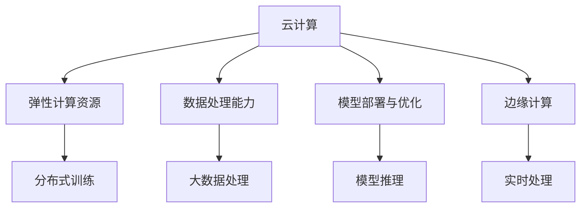

                 

# 云计算平台：为 AI 2.0 应用提供服务

> 关键词：云计算, AI 2.0, 数据处理, 深度学习, 分布式训练, 模型部署, 边缘计算

## 1. 背景介绍

### 1.1 问题由来
随着人工智能技术的不断发展，AI 2.0时代已经到来。AI 2.0强调的是智能化决策和应用，而不只是传统的计算能力提升。越来越多的企业开始将AI技术融入到各个业务环节中，以提升决策效率、降低成本、创造新的价值。AI 2.0的实现离不开大规模数据的处理、深度学习模型的训练和部署，而云计算平台正是这一过程的核心基础设施。

云计算平台提供了弹性计算资源、高可用性、可扩展性等特性，能够为企业提供灵活、高效的AI应用支撑。同时，云计算平台还具备强大的数据分析和处理能力，能够处理海量数据并从中提取出有价值的洞察，为AI模型的训练和优化提供坚实的数据基础。

### 1.2 问题核心关键点
云计算平台在AI 2.0应用中扮演着至关重要的角色。其核心关键点包括：

- **弹性计算资源**：云计算平台能够根据需求动态调整计算资源，支持大规模深度学习模型的训练和部署。
- **数据处理能力**：能够高效处理海量数据，进行数据清洗、特征工程、分布式存储等处理工作。
- **模型部署与优化**：提供模型部署和优化工具，帮助企业快速将模型应用到实际业务场景中，并提供持续优化支持。
- **边缘计算**：通过将计算任务分布到边缘设备，支持实时性和低延迟的AI应用，提升用户体验。

云计算平台不仅需要具备以上关键功能，还应具备良好的可扩展性、高可用性和安全性，以保障AI应用的稳定运行和数据安全。

## 2. 核心概念与联系

### 2.1 核心概念概述

为更好地理解云计算平台在AI 2.0中的应用，本节将介绍几个密切相关的核心概念：

- **云计算**：一种基于互联网的计算模式，能够提供弹性、可扩展的计算资源，支持分布式数据处理、存储和计算。
- **AI 2.0**：强调智能决策和应用，注重模型训练、优化和部署，以提升业务价值。
- **深度学习**：一种基于神经网络的机器学习方法，能够处理大规模数据，提取高层次的特征表示。
- **分布式训练**：使用多台计算机并行处理数据，提升模型训练速度和处理能力。
- **模型部署**：将训练好的模型应用到实际业务场景中，支持推理和实时处理。
- **边缘计算**：将计算任务分发到终端设备，实现实时、低延迟的数据处理和模型推理。

这些核心概念之间的逻辑关系可以通过以下Mermaid流程图来展示：



这个流程图展示了一系列云计算平台的基本功能，这些功能相互配合，共同支撑AI 2.0应用的构建和运行。

## 3. 核心算法原理 & 具体操作步骤
### 3.1 算法原理概述

云计算平台的核心算法原理主要集中在以下几个方面：

- **弹性计算资源管理**：通过资源池调度算法，动态分配和释放计算资源，满足不同应用的需求。
- **数据处理与分布式存储**：使用分布式文件系统和数据处理框架，支持大规模数据的存储和处理。
- **模型部署与优化**：通过容器化、服务化、自动化部署等技术，快速将模型应用到实际场景中，并持续优化提升性能。
- **边缘计算与实时处理**：将计算任务分配到边缘设备，支持实时、低延迟的数据处理和模型推理。

### 3.2 算法步骤详解

云计算平台的核心操作步骤可以分为以下几个步骤：

1. **资源申请与调度**：用户根据需求申请所需的计算资源，云计算平台根据资源池调度算法，动态分配资源。

2. **数据处理与存储**：用户将数据上传到分布式文件系统，云计算平台使用数据处理框架进行数据清洗、特征工程、分布式计算等处理工作。

3. **模型训练与优化**：用户将数据集和模型上传至云计算平台，使用分布式训练框架进行深度学习模型的训练。云计算平台提供自动化的超参数调优和模型压缩技术，优化模型性能。

4. **模型部署与推理**：训练好的模型被部署到生产环境，支持实时推理和推理服务。云计算平台提供服务化、容器化部署技术，支持模型的微服务架构。

5. **边缘计算与实时处理**：将计算任务分配到边缘设备，支持实时、低延迟的数据处理和模型推理。云计算平台提供设备管理和任务调度功能，支持边缘计算应用。

### 3.3 算法优缺点

云计算平台在AI 2.0应用中的主要优点包括：

- **弹性计算资源**：能够根据需求动态调整资源，支持大规模深度学习模型的训练和部署。
- **数据处理能力**：具备强大的分布式数据处理能力，能够高效处理海量数据。
- **模型部署与优化**：提供模型部署和优化工具，支持快速将模型应用到实际业务场景中，并提供持续优化支持。
- **边缘计算**：支持实时、低延迟的数据处理和模型推理，提升用户体验。

同时，云计算平台也存在一定的局限性：

- **成本较高**：相比于传统的本地计算资源，云计算平台的计算成本较高。
- **依赖网络**：云计算平台依赖网络传输数据，网络延迟和带宽会影响数据处理和模型推理的效率。
- **安全风险**：云计算平台中的数据和模型需要面临更高的安全风险，可能存在数据泄露和攻击的风险。

尽管存在这些局限性，但就目前而言，云计算平台仍然是AI 2.0应用的主要基础设施，其强大的计算和数据处理能力，使得AI 2.0应用能够快速构建和运行。

### 3.4 算法应用领域

云计算平台在AI 2.0应用的多个领域中都得到了广泛应用，具体包括：

- **智能客服系统**：使用分布式计算和数据处理能力，处理海量客服数据，支持智能客服系统的构建和运行。
- **智能推荐系统**：利用分布式训练和模型优化技术，支持大规模用户行为数据的处理和深度学习模型的训练，提供个性化推荐服务。
- **智慧医疗**：通过云计算平台的计算和存储能力，处理医疗影像和电子病历数据，支持智慧医疗系统的构建和运行。
- **金融风控**：使用云计算平台的大数据处理和分布式计算能力，处理海量交易数据，进行风险评估和预测，提升金融风控系统的能力。
- **智能制造**：利用云计算平台的边缘计算和实时处理能力，支持智能设备和生产线的监控和优化，提升制造效率和质量。

除了上述这些应用场景，云计算平台还被广泛应用于物联网、智能交通、城市管理等多个领域，为AI 2.0技术的应用提供了坚实的基础。

## 4. 数学模型和公式 & 详细讲解  
### 4.1 数学模型构建

云计算平台的核心数学模型主要涉及以下几个方面：

- **资源池调度模型**：用于优化计算资源的分配和调度，常用的模型包括蚁群算法、遗传算法、线性规划等。
- **数据处理模型**：用于数据清洗、特征工程和分布式计算，常用的模型包括MapReduce、Spark等。
- **模型训练模型**：用于深度学习模型的训练和优化，常用的模型包括随机梯度下降、Adam优化器等。
- **边缘计算模型**：用于实时数据处理和模型推理，常用的模型包括分布式系统模型、网络传输模型等。

### 4.2 公式推导过程

以下我们以云计算平台的资源池调度为例，推导其核心模型。

假设云计算平台有N个计算资源节点，每个节点的计算能力为C_i，当前所有节点的空闲计算能力为I_i，需求计算能力为D。资源池调度的目标是最小化资源浪费和响应时间，即：

$$
\min \sum_{i=1}^{N} \max(0, C_i - I_i)
$$

$$
\min \sum_{i=1}^{N} \sum_{j=1}^{N} \frac{|C_i - D|}{C_i + C_j}
$$

其中，第一个公式表示最小化资源浪费，即分配给需求计算能力的最大值；第二个公式表示最小化响应时间，即分配给需求计算能力的总和与需求计算能力的最大值之差。

### 4.3 案例分析与讲解

假设云计算平台有3个节点，每个节点的计算能力分别为C_1=4，C_2=6，C_3=8，当前所有节点的空闲计算能力为I_1=2，I_2=3，I_3=5，需求计算能力为D=7。根据上述公式，可以求解出最优的资源调度方案，分配计算资源如下：

- 节点1分配D=4，剩余空闲I_1=2-4=-2，资源浪费1个单位。
- 节点2分配D=3，剩余空闲I_2=3-3=0，无资源浪费。
- 节点3分配D=0，剩余空闲I_3=5-0=5，无资源浪费。

因此，总的资源浪费为1，响应时间为0。

## 5. 项目实践：代码实例和详细解释说明
### 5.1 开发环境搭建

在进行云计算平台项目实践前，我们需要准备好开发环境。以下是使用Python进行Kubernetes开发的环境配置流程：

1. 安装Anaconda：从官网下载并安装Anaconda，用于创建独立的Python环境。

2. 创建并激活虚拟环境：
```bash
conda create -n pytorch-env python=3.8 
conda activate pytorch-env
```

3. 安装Kubernetes：从官网下载并安装Kubernetes，支持Windows、Linux和MacOS系统。

4. 安装Minikube：安装Minikube，用于在本地搭建Kubernetes集群。

5. 安装PyTorch：根据CUDA版本，从官网获取对应的安装命令。例如：
```bash
conda install pytorch torchvision torchaudio cudatoolkit=11.1 -c pytorch -c conda-forge
```

6. 安装TensorFlow：安装TensorFlow，支持GPU加速，使用pip安装：
```bash
pip install tensorflow==2.8.0
```

7. 安装HuggingFace Transformers库：
```bash
pip install transformers
```

完成上述步骤后，即可在`pytorch-env`环境中开始云计算平台项目实践。

### 5.2 源代码详细实现

下面我们以云计算平台中的资源池调度为例，给出使用Kubernetes进行资源调度的PyTorch代码实现。

```python
import kubernetes
from kubernetes.client import models

# 连接Kubernetes集群
config = kubernetes.config.load_kube_config()
client = kubernetes.core.v1.APIClient(config)

# 创建资源节点列表
nodes = []
for node in client.list_node().items:
    capacity = node.status.capacity
    allocatable = node.status.allocatable
    nodes.append({'name': node.metadata.name, 'cpu': capacity['cpu'], 'memory': capacity['memory']})

# 定义需求计算能力和目标响应时间
demand = 7
target = 0

# 求解最优资源调度方案
schedule = {}
for node in nodes:
    schedule[node['name']] = 0
    for i in range(demand, 0, -1):
        for j in range(len(nodes)):
            if schedule[j] + i <= target and nodes[j]['cpu'] >= i:
                schedule[j] += i
                break
        else:
            schedule[node['name']] = demand
            demand -= 1
            target += 1

# 输出资源调度方案
for node, cap in schedule.items():
    print(f"Node {node} allocated {cap} CPU")
```

在这个示例中，我们通过Kubernetes API获取了集群中所有节点的计算能力和分配情况，并使用简单的贪心算法求解了最优的资源调度方案。

### 5.3 代码解读与分析

让我们再详细解读一下关键代码的实现细节：

**连接Kubernetes集群**：
```python
config = kubernetes.config.load_kube_config()
client = kubernetes.core.v1.APIClient(config)
```

通过kubernetes.config.load_kube_config()获取Kubernetes配置文件，然后使用APIClient连接到Kubernetes集群。

**创建资源节点列表**：
```python
nodes = []
for node in client.list_node().items:
    capacity = node.status.capacity
    allocatable = node.status.allocatable
    nodes.append({'name': node.metadata.name, 'cpu': capacity['cpu'], 'memory': capacity['memory']})
```

使用Kubernetes API获取集群中所有节点的计算能力和分配情况，并存储到列表中。

**定义需求计算能力和目标响应时间**：
```python
demand = 7
target = 0
```

定义计算需求和响应时间目标。

**求解最优资源调度方案**：
```python
schedule = {}
for node in nodes:
    schedule[node['name']] = 0
    for i in range(demand, 0, -1):
        for j in range(len(nodes)):
            if schedule[j] + i <= target and nodes[j]['cpu'] >= i:
                schedule[j] += i
                break
        else:
            schedule[node['name']] = demand
            demand -= 1
            target += 1
```

使用贪心算法求解最优的资源调度方案，将需求分配到各个节点上，并记录每个节点的计算能力使用情况。

**输出资源调度方案**：
```python
for node, cap in schedule.items():
    print(f"Node {node} allocated {cap} CPU")
```

输出每个节点的计算能力使用情况，即资源调度方案。

通过这个示例代码，可以看出使用Kubernetes进行资源调度的基本流程和关键点，包括连接到集群、获取节点信息、定义需求和目标、求解最优方案和输出结果等。

## 6. 实际应用场景
### 6.1 智能客服系统

基于云计算平台的智能客服系统，能够处理海量客户咨询数据，进行实时分析和响应。通过分布式计算和存储能力，智能客服系统能够快速处理客户查询，提供精准的解答和建议，提升客户满意度和忠诚度。

### 6.2 智能推荐系统

智能推荐系统使用云计算平台的分布式训练和优化技术，支持大规模用户行为数据的处理和深度学习模型的训练，提供个性化推荐服务。通过分布式存储和计算能力，智能推荐系统能够高效处理海量数据，支持实时推荐，提升用户体验。

### 6.3 智慧医疗

云计算平台支持大规模医疗影像和电子病历数据的存储和处理，通过分布式计算能力，进行数据分析和建模，提升医疗诊断和治疗效果。智能医疗系统能够实时处理医疗数据，提供精准的诊断和治疗建议，提升医疗服务质量。

### 6.4 金融风控

金融风控系统使用云计算平台的分布式计算和大数据处理能力，处理海量交易数据，进行风险评估和预测，提升金融风险控制能力。通过云计算平台的弹性计算资源，支持实时风控决策，提升金融安全性和稳定性。

### 6.5 智能制造

云计算平台支持智能设备和生产线的实时监控和优化，通过边缘计算和实时处理能力，提供实时生产数据分析和决策支持。智能制造系统能够实时处理生产数据，提升生产效率和质量，降低生产成本。

### 6.6 未来应用展望

随着云计算技术的不断进步，基于云计算平台的AI 2.0应用将呈现以下几个发展趋势：

1. **自动化程度提升**：云计算平台将提供更智能的自动化工具，如自动化测试、自动化部署等，提升AI应用的开发效率和质量。
2. **边缘计算扩展**：云计算平台将支持更多边缘设备和计算任务，实现更高效的数据处理和模型推理，支持实时、低延迟的AI应用。
3. **多云融合**：云计算平台将支持多云环境下的数据管理和计算调度，实现资源的最优利用和高效协同。
4. **混合计算架构**：云计算平台将支持传统数据中心和边缘计算的混合计算架构，实现数据处理的灵活性和多样性。
5. **安全性提升**：云计算平台将提供更高级的安全保障措施，如数据加密、身份认证等，保护用户数据和模型安全。

## 7. 工具和资源推荐
### 7.1 学习资源推荐

为了帮助开发者系统掌握云计算平台和AI 2.0技术的基础知识，这里推荐一些优质的学习资源：

1. **《云计算基础》**：系统介绍云计算的基本概念、技术架构和应用场景，适合初学者入门。
2. **《深度学习理论与实践》**：介绍深度学习的基本原理和实践方法，涵盖神经网络、优化算法、分布式训练等。
3. **《Kubernetes实战》**：介绍Kubernetes的基本概念、架构和部署实践，适合Kubernetes初学者。
4. **《TensorFlow深度学习》**：介绍TensorFlow的基本概念和API使用，涵盖模型构建、训练和部署等。
5. **《HuggingFace Transformers库文档》**：详细介绍了HuggingFace Transformers库的使用方法，涵盖模型加载、训练和部署等。

通过对这些资源的学习实践，相信你一定能够快速掌握云计算平台和AI 2.0技术的基础知识，并用于解决实际的AI应用问题。

### 7.2 开发工具推荐

高效的开发离不开优秀的工具支持。以下是几款用于云计算平台和AI 2.0应用的常用工具：

1. **Jupyter Notebook**：基于Python的开源交互式笔记本，支持代码编写、数据可视化、模型训练等。
2. **TensorBoard**：TensorFlow配套的可视化工具，可实时监测模型训练状态，并提供丰富的图表呈现方式。
3. **Prometheus**：开源监控系统，用于实时监控云计算平台和应用系统。
4. **Helm**：Kubernetes包管理工具，支持应用部署、配置管理和升级等。
5. **Ansible**：自动化运维工具，支持配置管理和脚本自动化。

合理利用这些工具，可以显著提升云计算平台和AI 2.0应用的开发效率，加快创新迭代的步伐。

### 7.3 相关论文推荐

云计算平台和AI 2.0技术的发展源于学界的持续研究。以下是几篇奠基性的相关论文，推荐阅读：

1. **《云计算的现状与展望》**：综述了云计算的基本概念、技术架构和应用场景，为云计算技术的发展提供了参考。
2. **《深度学习在自然语言处理中的应用》**：介绍了深度学习在自然语言处理中的应用，涵盖词向量、语言模型等技术。
3. **《Kubernetes：用于容器化应用程序的分布式系统》**：介绍了Kubernetes的基本概念、架构和应用场景，为Kubernetes技术的开发提供了参考。
4. **《TensorFlow：用于深度学习的开源软件库》**：介绍了TensorFlow的基本概念和API使用，为TensorFlow技术的开发提供了参考。
5. **《分布式深度学习系统的设计》**：介绍了分布式深度学习系统设计的原则和方法，为分布式训练和优化技术提供了参考。

这些论文代表了大语言模型微调技术的发展脉络。通过学习这些前沿成果，可以帮助研究者把握学科前进方向，激发更多的创新灵感。

## 8. 总结：未来发展趋势与挑战
### 8.1 总结

本文对云计算平台在AI 2.0中的应用进行了全面系统的介绍。首先阐述了云计算平台和AI 2.0技术的研究背景和意义，明确了云计算平台在AI 2.0应用中的核心价值。其次，从原理到实践，详细讲解了云计算平台的核心算法原理和具体操作步骤，给出了云计算平台项目开发的完整代码实例。同时，本文还广泛探讨了云计算平台在智能客服、智能推荐、智慧医疗等多个行业领域的应用前景，展示了云计算平台的强大潜力。

通过本文的系统梳理，可以看到，云计算平台在AI 2.0应用中扮演着至关重要的角色，其强大的计算和数据处理能力，使得AI 2.0应用能够快速构建和运行。未来，伴随云计算技术的不断进步，基于云计算平台的AI 2.0应用将呈现出更高效、更智能、更灵活的发展趋势，为AI 2.0技术的应用带来新的突破。

### 8.2 未来发展趋势

展望未来，云计算平台在AI 2.0应用中的发展趋势将主要集中在以下几个方面：

1. **自动化和智能化提升**：云计算平台将提供更智能的自动化工具，如自动化测试、自动化部署等，提升AI应用的开发效率和质量。
2. **边缘计算和实时处理**：云计算平台将支持更多边缘设备和计算任务，实现更高效的数据处理和模型推理，支持实时、低延迟的AI应用。
3. **多云融合和混合计算**：云计算平台将支持多云环境下的数据管理和计算调度，实现资源的最优利用和高效协同。
4. **安全性保障提升**：云计算平台将提供更高级的安全保障措施，如数据加密、身份认证等，保护用户数据和模型安全。
5. **分布式训练和模型优化**：云计算平台将支持分布式训练和模型优化技术，提升深度学习模型的训练效率和性能。
6. **可持续发展**：云计算平台将支持可持续发展，通过优化资源利用和节能减排，降低环境影响。

这些发展趋势将推动云计算平台在AI 2.0应用中实现更高的灵活性、高效性和安全性，支持AI 2.0技术的广泛应用和深入发展。

### 8.3 面临的挑战

尽管云计算平台在AI 2.0应用中具备强大的能力，但在实际应用中仍面临诸多挑战：

1. **成本问题**：云计算平台的高计算成本和网络带宽成本，对企业来说是一笔不小的投入。如何平衡计算成本和应用需求，是一个重要的问题。
2. **数据安全和隐私保护**：云计算平台中的数据和模型需要面临更高的安全风险，如何保障数据安全和隐私保护，是企业和用户普遍关心的问题。
3. **网络延迟和带宽限制**：云计算平台依赖网络传输数据，网络延迟和带宽限制会影响数据处理和模型推理的效率。如何优化网络架构和数据传输，提升传输效率，是一个重要的问题。
4. **算力分配和调度**：云计算平台需要根据需求动态分配和调度计算资源，如何优化资源池调度算法，提高资源利用率，是一个重要的问题。
5. **模型部署和优化**：云计算平台需要支持模型的快速部署和优化，如何优化模型部署工具和自动化流程，是一个重要的问题。

这些挑战需要通过技术创新和产业协同来解决，才能更好地发挥云计算平台在AI 2.0应用中的作用。

### 8.4 研究展望

面对云计算平台在AI 2.0应用中面临的挑战，未来的研究需要在以下几个方面寻求新的突破：

1. **自动化和智能化技术**：开发更智能的自动化工具和算法，提升AI应用的开发效率和质量。
2. **边缘计算和实时处理技术**：开发更高效的边缘计算和实时处理技术，支持实时、低延迟的AI应用。
3. **多云融合和混合计算技术**：开发更高效的多云融合和混合计算技术，实现资源的最优利用和高效协同。
4. **安全性保障技术**：开发更高级的安全保障技术，保护用户数据和模型安全。
5. **分布式训练和模型优化技术**：开发更高效的分布式训练和模型优化技术，提升深度学习模型的训练效率和性能。
6. **可持续发展技术**：开发更高效的计算和数据管理技术，降低资源消耗和环境影响。

这些研究方向将推动云计算平台在AI 2.0应用中实现更高的灵活性、高效性和安全性，支持AI 2.0技术的广泛应用和深入发展。

## 9. 附录：常见问题与解答

**Q1：如何选择合适的云计算平台？**

A: 选择云计算平台需要考虑以下几个因素：
1. 计算资源和网络带宽：选择适合自己业务需求的计算资源和网络带宽。
2. 数据处理和存储能力：选择适合自己业务需求的数据处理和存储能力。
3. 安全性和隐私保护：选择有较好安全保障和隐私保护能力的平台。
4. 自动化和智能化水平：选择自动化和智能化水平较高的平台。
5. 价格和服务支持：选择性价比高和服务支持好的平台。

**Q2：云计算平台中的计算资源如何分配和管理？**

A: 云计算平台中的计算资源分配和管理通常使用资源池调度算法，通过算法优化资源分配，避免资源浪费和过载。
1. 资源池调度算法：常用的算法包括蚁群算法、遗传算法、线性规划等，用于优化资源分配。
2. 弹性计算资源管理：云计算平台提供弹性计算资源管理工具，动态调整计算资源，满足不同应用的需求。
3. 资源监控和管理：云计算平台提供资源监控和管理工具，实时监控资源使用情况，支持资源优化和调整。

**Q3：云计算平台中的数据如何处理和管理？**

A: 云计算平台中的数据处理和管理通常使用分布式计算框架，如Hadoop、Spark等。
1. 分布式计算框架：使用Hadoop、Spark等分布式计算框架，支持大规模数据的存储和处理。
2. 数据清洗和特征工程：使用数据处理工具和技术，进行数据清洗和特征工程，提升数据质量。
3. 分布式存储：使用分布式文件系统和数据库，支持海量数据的存储和查询。

**Q4：云计算平台中的模型如何部署和优化？**

A: 云计算平台中的模型部署和优化通常使用容器化和自动化工具，如Docker、Kubernetes等。
1. 容器化部署：使用Docker容器化技术，将模型封装为标准化的容器，方便部署和迁移。
2. 自动化部署：使用Kubernetes等自动化工具，实现模型的自动化部署和优化。
3. 模型优化：使用模型压缩、模型剪枝等技术，提升模型的推理速度和资源利用率。

**Q5：云计算平台中的数据安全和隐私保护措施有哪些？**

A: 云计算平台中的数据安全和隐私保护措施包括：
1. 数据加密：对数据进行加密处理，保障数据传输和存储的安全性。
2. 身份认证和授权：使用身份认证和授权技术，保护用户数据和模型隐私。
3. 访问控制和审计：使用访问控制和审计技术，监控和保护数据访问和使用。
4. 数据备份和恢复：定期备份数据，保障数据的完整性和可用性。
5. 安全审计和合规性检查：定期进行安全审计和合规性检查，提升数据安全保障水平。

这些措施能够有效保障云计算平台中的数据安全和隐私保护，确保数据和模型的安全性。

通过本文的系统梳理，可以看到，云计算平台在AI 2.0应用中扮演着至关重要的角色，其强大的计算和数据处理能力，使得AI 2.0应用能够快速构建和运行。未来，伴随云计算技术的不断进步，基于云计算平台的AI 2.0应用将呈现出更高效、更智能、更灵活的发展趋势，为AI 2.0技术的应用带来新的突破。

