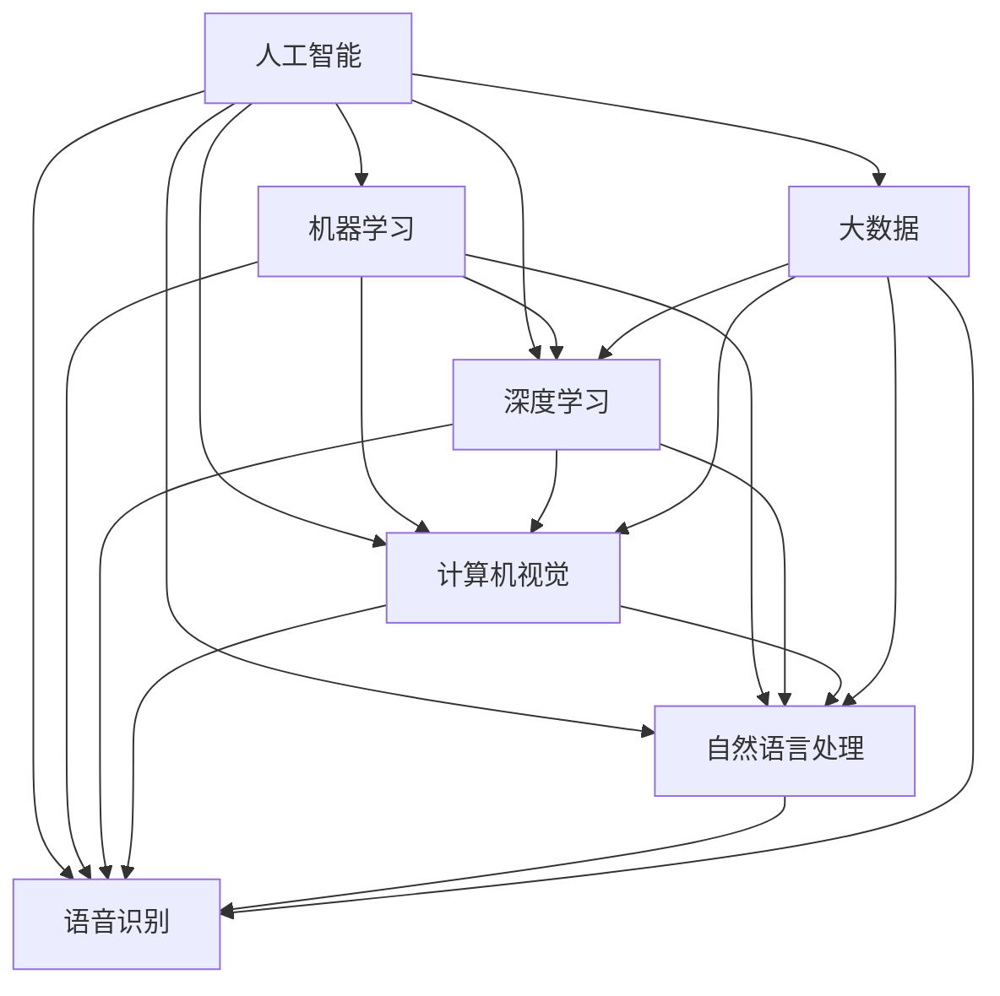

                 

# 人工智能 (Artificial Intelligence)

> 关键词：人工智能,机器学习,深度学习,神经网络,计算机视觉,自然语言处理,语音识别,大数据

## 1. 背景介绍

### 1.1 问题由来
人工智能（Artificial Intelligence, AI）是一门涉及计算机科学、认知科学、语言学、逻辑学、数学等学科的交叉学科。其核心目标是构建能够模仿人类智能行为、思维过程的智能系统。

自1956年达特茅斯会议提出人工智能概念以来，AI领域经历了几次高潮迭起：

- 1960s-1980s：符号主义和专家系统，象征着AI的起步和初步探索。
- 1990s：机器学习和大数据的兴起，推动了AI的发展，但实际应用受限。
- 2010s至今：深度学习技术的突破，大规模数据和强大算力支撑，AI进入商业应用和技术普及的新纪元。

当前，AI技术已经广泛应用于医疗、金融、教育、交通等多个行业，极大地提升了生产效率和人类生活质量。

### 1.2 问题核心关键点
人工智能的核心问题包括：

- 定义与目标：界定AI的能力边界，明确其应用场景与目标。
- 实现路径：探索构建AI系统的技术路径，如符号主义、连接主义、行为主义等。
- 知识表示：如何有效地表示和组织知识，使机器能够理解和学习。
- 学习机制：构建机器学习的算法和模型，使机器能够自主学习和改进。
- 智能应用：开发智能系统，实现自动推理、决策、交互等功能。
- 伦理与法律：应对AI发展带来的伦理、法律问题，确保技术应用的安全性和公平性。

这些问题共同构成了人工智能的研究框架，推动了其不断向前发展。

### 1.3 问题研究意义
研究人工智能的目的在于：

1. 提升智能系统的应用水平，解决现实世界的复杂问题。
2. 推动自动化、智能化进程，提高效率和生产力。
3. 促进跨学科交叉，为新兴技术提供理论基础和指导。
4. 确保技术应用的安全性和伦理合法性，避免潜在风险。
5. 推动社会进步，改善人类生活质量和福祉。

## 2. 核心概念与联系

### 2.1 核心概念概述

为更好地理解人工智能的理论基础和应用，本节将介绍几个关键概念：

- 人工智能（AI）：构建能够模拟人类智能行为和思维过程的系统，包括感知、学习、推理、决策、交互等能力。
- 机器学习（ML）：通过数据驱动的方式，使机器能够自主学习和改进的算法和模型。
- 深度学习（DL）：基于多层神经网络的机器学习方法，通过多层次特征学习，实现更强的数据表征能力。
- 神经网络（NN）：模仿人脑神经元的工作机制，构建的非线性模型，包括前馈神经网络、卷积神经网络（CNN）、循环神经网络（RNN）等。
- 计算机视觉（CV）：使计算机能够理解和处理图像和视频数据的领域，广泛应用于图像识别、目标检测、图像分割等任务。
- 自然语言处理（NLP）：使计算机能够理解和处理人类语言文本的领域，包括文本分类、情感分析、机器翻译、问答系统等。
- 语音识别（ASR）：使计算机能够识别和转录人类语音的领域，应用于智能家居、自动客服、语音助手等场景。
- 大数据（Big Data）：指数据量巨大、类型多样、速度极快的数据集合，为机器学习提供了数据支撑。

这些核心概念之间的逻辑关系可以通过以下Mermaid流程图来展示：



这个流程图展示了一些关键概念之间的联系：

1. 人工智能由机器学习、深度学习等技术构建。
2. 计算机视觉、自然语言处理、语音识别等都是人工智能的重要分支。
3. 大数据为机器学习提供了数据基础，使其能够发挥更大作用。

## 3. 核心算法原理 & 具体操作步骤

### 3.1 算法原理概述

人工智能的核心算法包括：

- 监督学习（Supervised Learning）：基于有标签的数据，训练模型进行预测和分类。
- 无监督学习（Unsupervised Learning）：基于无标签的数据，训练模型发现数据的内在结构和模式。
- 强化学习（Reinforcement Learning）：通过与环境互动，学习最优策略以最大化奖励。
- 迁移学习（Transfer Learning）：将一个领域学到的知识迁移到另一个领域，提高学习效率。
- 多模态学习（Multimodal Learning）：结合多种数据模态（如图像、文本、语音）进行联合建模。

以监督学习为例，其核心算法流程包括：

1. 数据准备：收集和标注数据集，划分为训练集、验证集和测试集。
2. 模型构建：选择合适的模型架构，如神经网络、支持向量机、决策树等。
3. 模型训练：使用训练集数据，通过前向传播和反向传播更新模型参数。
4. 模型评估：在验证集和测试集上评估模型性能，选择合适的超参数和模型结构。
5. 模型应用：将训练好的模型应用到新数据上进行预测或分类。

### 3.2 算法步骤详解

以深度学习模型为例，基于监督学习的训练步骤包括：

1. 数据准备：收集标注数据，划分为训练集和测试集。
2. 模型定义：定义神经网络模型，包括输入层、隐藏层、输出层等。
3. 损失函数：定义损失函数，如交叉熵损失、均方误差损失等。
4. 优化器：定义优化器，如Adam、SGD等，设置学习率和批大小。
5. 训练循环：使用训练集数据，迭代更新模型参数，最小化损失函数。
6. 评估与调整：在验证集上评估模型性能，调整模型结构和超参数，直到达到满意结果。
7. 测试与部署：在测试集上评估最终模型，部署到实际应用中。

### 3.3 算法优缺点

人工智能算法具有以下优点：

- 高效性：基于数据驱动的算法可以快速学习并预测结果。
- 准确性：深度学习模型在大规模数据集上表现出强大的泛化能力。
- 可扩展性：算法可应用于多种场景，如自动驾驶、医疗诊断、金融预测等。
- 鲁棒性：算法对数据噪声和干扰具有一定的鲁棒性，能够适应不同环境。

同时，也存在以下缺点：

- 数据依赖：需要大量标注数据，数据质量直接影响模型性能。
- 模型复杂：深度学习模型参数量巨大，训练复杂，需要强大计算资源。
- 可解释性：算法模型通常缺乏可解释性，难以理解内部决策过程。
- 伦理风险：存在数据偏见、隐私泄露等问题，需要严格的伦理和法律监管。

### 3.4 算法应用领域

人工智能算法在多个领域得到广泛应用：

- 医疗健康：智能诊断、医疗影像分析、个性化治疗等。
- 金融服务：信用评估、风险管理、自动化交易等。
- 教育培训：智能推荐、智能评估、自适应学习等。
- 交通出行：自动驾驶、智能调度、路径规划等。
- 智能家居：语音助手、智能安防、自动化控制等。
- 农业农业：精准农业、智能灌溉、作物识别等。
- 环境监测：环境数据监测、智能决策、灾害预警等。

以上仅是人工智能应用的一部分，未来随着技术的不断进步，其应用范围还将进一步拓展。

## 4. 数学模型和公式 & 详细讲解 & 举例说明

### 4.1 数学模型构建

以线性回归模型为例，假设训练数据集为 $(x_i, y_i), i=1,2,...,N$，其中 $x_i \in \mathbb{R}^d$ 为输入向量，$y_i \in \mathbb{R}$ 为输出向量。定义模型为 $y_i = \theta^T x_i + b$，其中 $\theta \in \mathbb{R}^d$ 为模型参数，$b \in \mathbb{R}$ 为偏置项。

目标是最小化预测值与真实值之间的平方误差，即：

$$
\mathcal{L}(\theta) = \frac{1}{N}\sum_{i=1}^N (y_i - \theta^T x_i - b)^2
$$

通过梯度下降算法，求解上述目标函数的最小值，更新模型参数 $\theta$ 和 $b$。

### 4.2 公式推导过程

根据平方误差损失函数，对 $\theta$ 和 $b$ 求偏导数，得到：

$$
\frac{\partial \mathcal{L}(\theta)}{\partial \theta} = \frac{2}{N} (X^T W - Y)^T
$$
$$
\frac{\partial \mathcal{L}(\theta)}{\partial b} = \frac{2}{N} (Y - X^T W)
$$

其中 $X = [x_1, x_2, ..., x_N] \in \mathbb{R}^{N \times d}$，$W = [\theta, b]^T \in \mathbb{R}^{d+1}$。

根据上述梯度表达式，更新模型参数的公式为：

$$
\theta \leftarrow \theta - \eta \frac{\partial \mathcal{L}(\theta)}{\partial \theta}
$$
$$
b \leftarrow b - \eta \frac{\partial \mathcal{L}(\theta)}{\partial b}
$$

其中 $\eta$ 为学习率。

### 4.3 案例分析与讲解

以手写数字识别为例，使用MNIST数据集训练一个神经网络模型。模型架构如下：

```python
import torch.nn as nn
import torch.optim as optim

class Net(nn.Module):
    def __init__(self):
        super(Net, self).__init__()
        self.fc1 = nn.Linear(784, 256)
        self.fc2 = nn.Linear(256, 10)
    
    def forward(self, x):
        x = x.view(-1, 784)
        x = torch.relu(self.fc1(x))
        x = self.fc2(x)
        return x
```

定义损失函数和优化器：

```python
net = Net()
criterion = nn.CrossEntropyLoss()
optimizer = optim.Adam(net.parameters(), lr=0.001)
```

定义训练和评估函数：

```python
def train(net, train_loader, criterion, optimizer, n_epochs=10):
    for epoch in range(n_epochs):
        for batch_idx, (data, target) in enumerate(train_loader):
            data = data.view(-1, 28 * 28)
            optimizer.zero_grad()
            output = net(data)
            loss = criterion(output, target)
            loss.backward()
            optimizer.step()
```

定义测试函数：

```python
def test(net, test_loader, criterion):
    correct = 0
    total = 0
    with torch.no_grad():
        for data, target in test_loader:
            data = data.view(-1, 28 * 28)
            output = net(data)
            pred = torch.argmax(output, dim=1)
            total += target.size(0)
            correct += (pred == target).sum().item()
    print(f'Test Accuracy: {correct / total}')
```

训练模型：

```python
train_loader = torch.utils.data.DataLoader(train_dataset, batch_size=64, shuffle=True)
test_loader = torch.utils.data.DataLoader(test_dataset, batch_size=64, shuffle=False)

train(net, train_loader, criterion, optimizer)
test(net, test_loader, criterion)
```

以上代码实现了基于深度学习的线性回归模型。通过实际训练和评估，可以验证该模型的性能。

## 5. 项目实践：代码实例和详细解释说明

### 5.1 开发环境搭建

为了实现人工智能项目，需要搭建好开发环境。以下是Python开发环境配置步骤：

1. 安装Anaconda：从官网下载并安装Anaconda，用于创建独立的Python环境。

```bash
conda create -n ai-env python=3.8 
conda activate ai-env
```

2. 安装必要的库：

```bash
conda install numpy pandas scikit-learn torch torchvision transformers
```

3. 安装TensorFlow或PyTorch等深度学习框架：

```bash
conda install tensorflow=2.8 
conda install pytorch torchvision torchaudio cudatoolkit=11.1 -c pytorch -c conda-forge
```

4. 安装Jupyter Notebook：

```bash
conda install jupyter notebook ipython
```

完成上述步骤后，即可在`ai-env`环境中开始AI项目的开发。

### 5.2 源代码详细实现

这里以使用TensorFlow实现一个简单的图像分类器为例，展示AI项目的代码实现。

定义模型：

```python
import tensorflow as tf
from tensorflow.keras import layers

class ConvNet(tf.keras.Model):
    def __init__(self):
        super(ConvNet, self).__init__()
        self.conv1 = layers.Conv2D(32, (3, 3), activation='relu')
        self.pool1 = layers.MaxPooling2D((2, 2))
        self.conv2 = layers.Conv2D(64, (3, 3), activation='relu')
        self.pool2 = layers.MaxPooling2D((2, 2))
        self.flatten = layers.Flatten()
        self.fc1 = layers.Dense(64, activation='relu')
        self.fc2 = layers.Dense(10)

    def call(self, x):
        x = self.conv1(x)
        x = self.pool1(x)
        x = self.conv2(x)
        x = self.pool2(x)
        x = self.flatten(x)
        x = self.fc1(x)
        x = self.fc2(x)
        return x
```

定义损失函数和优化器：

```python
model = ConvNet()
loss = tf.keras.losses.SparseCategoricalCrossentropy(from_logits=True)
optimizer = tf.keras.optimizers.Adam(learning_rate=0.001)
```

定义训练和评估函数：

```python
def train(model, train_dataset, validation_dataset, batch_size, epochs):
    model.compile(optimizer=optimizer, loss=loss, metrics=['accuracy'])
    model.fit(train_dataset, epochs=epochs, validation_data=validation_dataset, batch_size=batch_size)
```

定义测试函数：

```python
def test(model, test_dataset, batch_size):
    model.evaluate(test_dataset, batch_size=batch_size)
```

加载数据集并训练模型：

```python
(train_dataset, test_dataset), _ = tf.keras.datasets.mnist.load_data()
train_dataset = tf.data.Dataset.from_tensor_slices(train_dataset).shuffle(60000).batch(64)
test_dataset = tf.data.Dataset.from_tensor_slices(test_dataset).batch(64)

train(model, train_dataset, test_dataset, batch_size=64, epochs=10)
test(model, test_dataset, batch_size=64)
```

以上代码展示了使用TensorFlow实现一个简单的图像分类器。通过实际训练和评估，可以验证该模型的性能。

### 5.3 代码解读与分析

让我们进一步解读代码的关键部分：

**模型定义**：
- 使用`layers`模块定义卷积、池化、全连接等神经网络层。
- `call`方法定义前向传播计算过程。

**损失函数和优化器**：
- 使用`SparseCategoricalCrossentropy`作为分类损失函数。
- 使用`Adam`优化器进行梯度更新。

**训练和评估函数**：
- `train`函数：使用`fit`方法训练模型，并记录验证集的准确率。
- `test`函数：使用`evaluate`方法评估模型的准确率。

**数据加载**：
- 使用`from_tensor_slices`方法将数据集转化为TensorFlow的Dataset对象。
- 使用`shuffle`方法打乱数据顺序。
- 使用`batch`方法设置批大小。

**模型训练与测试**：
- 在训练过程中，`fit`方法会自动调用训练函数，更新模型参数。
- 在测试过程中，`evaluate`方法会自动调用测试函数，评估模型性能。

以上代码展示了AI项目的完整实现流程，从模型构建到训练测试，涵盖了机器学习项目的主要步骤。

## 6. 实际应用场景

### 6.1 智能医疗

人工智能在医疗领域的应用非常广泛，涵盖了诊断、治疗、管理等多个方面。以下是几个实际应用场景：

- 医学影像分析：使用深度学习模型分析医学影像，辅助医生诊断疾病。
- 基因测序分析：通过机器学习分析基因数据，预测疾病风险和疗效。
- 药物研发：使用AI技术加速药物研发过程，发现新的药物靶点和治疗方案。
- 个性化治疗：根据患者基因信息和病史，推荐个性化的治疗方案。

### 6.2 智能金融

金融领域也是人工智能的重要应用场景。以下是几个实际应用场景：

- 信用评估：使用机器学习模型分析借款人的信用记录和行为数据，预测其信用风险。
- 风险管理：通过数据分析，识别金融市场的风险因素，进行风险预测和控制。
- 自动交易：使用AI技术进行高频交易，优化投资组合，提高收益率。
- 金融欺诈检测：使用机器学习模型分析交易数据，检测异常行为，防范欺诈风险。

### 6.3 智能制造

在制造业领域，人工智能可以显著提高生产效率和产品质量。以下是几个实际应用场景：

- 智能监控：使用计算机视觉技术，实时监控生产线，检测设备异常和产品质量问题。
- 预测性维护：使用机器学习模型预测设备故障和维护需求，避免设备故障造成停产。
- 工艺优化：通过数据分析，优化生产工艺和流程，提高生产效率。
- 供应链管理：使用AI技术进行需求预测和库存管理，优化供应链物流。

### 6.4 未来应用展望

随着人工智能技术的不断发展，未来将在更多领域得到应用：

- 农业：使用AI技术进行精准农业，提高农作物产量和质量。
- 教育：使用智能推荐系统，提供个性化的学习资源和教学方案。
- 环保：使用AI技术监测环境数据，进行环境预测和污染治理。
- 智慧城市：使用AI技术优化城市管理，提高公共服务效率。

## 7. 工具和资源推荐

### 7.1 学习资源推荐

为了帮助开发者系统掌握人工智能的理论基础和实践技巧，这里推荐一些优质的学习资源：

1. 《深度学习》书籍：Ian Goodfellow、Yoshua Bengio和Aaron Courville合著的经典书籍，系统介绍了深度学习的基本概念和算法。

2. 《Python深度学习》书籍：Francois Chollet撰写的书籍，详细介绍了使用Keras进行深度学习模型的开发和部署。

3. Coursera《深度学习专项课程》：由Andrew Ng主讲的深度学习课程，系统介绍了深度学习的基本概念和算法，适合初学者和进阶者。

4. 《计算机视觉：算法与应用》书籍：Russell J. Hartley和Andrew Zisserman合著的经典书籍，详细介绍了计算机视觉的基本概念和算法。

5. 《自然语言处理综论》书籍：Daniel Jurafsky和James H. Martin合著的经典书籍，详细介绍了自然语言处理的基本概念和算法。

6. TensorFlow官方文档：TensorFlow官方提供的文档，包含详细的API和使用方法，适合开发者快速上手。

7. PyTorch官方文档：PyTorch官方提供的文档，包含详细的API和使用方法，适合开发者快速上手。

8. Kaggle：一个数据科学竞赛平台，提供大量的数据集和竞赛，适合进行实战练习和数据探索。

通过对这些资源的学习实践，相信你一定能够快速掌握人工智能的理论基础和实践技巧。

### 7.2 开发工具推荐

高效开发离不开优秀的工具支持。以下是几款用于AI开发的工具：

1. Jupyter Notebook：一款免费的开源笔记本环境，支持Python、R等多种编程语言，方便进行数据处理和模型训练。

2. Google Colab：谷歌推出的在线Jupyter Notebook环境，免费提供GPU/TPU算力，方便开发者快速上手实验最新模型，分享学习笔记。

3. Visual Studio Code：一款轻量级、易用的IDE，支持Python、R等多种编程语言，支持调试、版本控制等工具。

4. Anaconda：一款数据分析和机器学习环境管理工具，支持多环境隔离，方便安装和管理依赖库。

5. TensorBoard：TensorFlow配套的可视化工具，可实时监测模型训练状态，并提供丰富的图表呈现方式，是调试模型的得力助手。

6. Keras：一个高层次的神经网络API，支持TensorFlow、Theano等多种后端，方便快速搭建和调试深度学习模型。

7. PyTorch Lightning：一个用于快速搭建和训练深度学习模型的框架，支持多种模型和优化器，方便进行模型优化和调试。

通过这些工具，可以显著提升AI项目的开发效率，加快创新迭代的步伐。

### 7.3 相关论文推荐

人工智能领域的研究论文众多，以下是几篇经典的论文，推荐阅读：

1. AlexNet：2012年ImageNet比赛中获奖的卷积神经网络，开创了深度学习时代。

2. Deep Blue：1997年IBM开发的国际象棋AI，首次在面对人类时取得胜利，推动了AI领域的发展。

3. AlphaGo：2016年DeepMind开发的围棋AI，首次在全面击败人类棋手，引起了广泛关注。

4. Generative Adversarial Networks（GANs）：Ian Goodfellow等人在2014年提出的生成对抗网络，实现了高质量图像生成。

5. Transformer模型：Google在2017年提出的Transformer模型，开创了机器翻译等自然语言处理任务的new era。

6. OpenAI GPT-3：2020年OpenAI发布的语言生成模型，实现了在多种自然语言处理任务上的高性能表现。

这些论文代表了大数据、深度学习和人工智能的发展脉络。通过学习这些前沿成果，可以帮助研究者把握学科前进方向，激发更多的创新灵感。

## 8. 总结：未来发展趋势与挑战

### 8.1 总结

本文对人工智能的核心理论和应用进行了全面系统的介绍。首先阐述了人工智能的概念、实现路径和应用场景，明确了其研究目标和意义。其次，从原理到实践，详细讲解了深度学习模型的训练过程和关键步骤，给出了实际应用案例。同时，本文还探讨了人工智能在多个行业的应用前景，展示了其广阔的发展空间。最后，本文推荐了学习资源、开发工具和相关论文，为读者提供了丰富的学习材料和参考资料。

通过本文的系统梳理，可以看到，人工智能技术已经在多个领域取得显著进展，推动了社会生产力的提升。未来，随着算力、数据和算法等技术条件的不断成熟，人工智能将进一步深化其应用，带来更多颠覆性的变革。

### 8.2 未来发展趋势

人工智能未来将呈现以下几个发展趋势：

1. 深度学习模型的复杂度将进一步提升，网络结构将更加多样化，模型参数量将更大。
2. 跨模态学习将成为热点，结合图像、文本、语音等多种数据模态进行联合建模。
3. 元学习和自适应学习将逐渐普及，使得AI系统能够更灵活地适应新任务和新环境。
4. 自动化和可解释性将成为AI系统的重要目标，推动AI技术的普及和应用。
5. 伦理和法律问题将受到更多关注，如何确保AI技术的公平性、透明性和安全性成为重要课题。

以上趋势凸显了人工智能技术的广阔前景。这些方向的探索发展，必将进一步提升AI系统的性能和应用范围，为人类智能的进化带来深远影响。

### 8.3 面临的挑战

尽管人工智能技术已经取得诸多突破，但在迈向更加智能化、普适化应用的过程中，仍面临诸多挑战：

1. 数据质量与数量：高质量、大规模的数据是深度学习模型成功的前提，获取数据成本较高，且数据质量参差不齐。
2. 模型复杂度与计算资源：深度学习模型参数量巨大，训练复杂，需要强大计算资源。
3. 可解释性与透明性：深度学习模型通常缺乏可解释性，难以理解内部决策过程，导致其应用受到限制。
4. 伦理与法律问题：AI系统可能存在数据偏见、隐私泄露等问题，需要严格的伦理和法律监管。
5. 人机协作与信任：如何构建可信、可靠的AI系统，确保其与人类协同工作的稳定性，是一个重要课题。

正视这些挑战，积极应对并寻求突破，将是大数据、深度学习和人工智能技术走向成熟的必由之路。相信随着学界和产业界的共同努力，这些挑战终将一一被克服，人工智能技术必将在构建人机协同的智能时代中扮演越来越重要的角色。

### 8.4 研究展望

面对人工智能面临的诸多挑战，未来的研究需要在以下几个方面寻求新的突破：

1. 数据增强与数据合成：如何通过数据增强和数据合成技术，提高数据量和数据质量，是未来重要的研究方向。
2. 可解释性与透明性：如何增强深度学习模型的可解释性和透明性，使其内部决策过程更加可信，是未来的重要课题。
3. 自动化与自适应学习：如何构建更加自动化和自适应的AI系统，使其能够更灵活地适应新任务和新环境，是未来的重要方向。
4. 跨模态学习与多任务学习：如何结合多种数据模态进行联合建模，如何处理多任务学习问题，是未来的重要研究方向。
5. 伦理与法律问题：如何在AI技术开发和应用中引入伦理和法律考量，确保其公平性、透明性和安全性，是未来的重要课题。

这些研究方向将引领人工智能技术不断突破，为构建安全、可靠、可解释、可控的智能系统铺平道路。面向未来，人工智能技术还需要与其他人工智能技术进行更深入的融合，如知识表示、因果推理、强化学习等，多路径协同发力，共同推动自然语言理解和智能交互系统的进步。只有勇于创新、敢于突破，才能不断拓展人工智能的边界，让智能技术更好地造福人类社会。

## 9. 附录：常见问题与解答

**Q1：什么是人工智能？**

A: 人工智能是一种使计算机能够模仿人类智能行为和思维过程的技术。其核心目标是构建能够自主学习、推理、决策、交互的智能系统。

**Q2：深度学习与机器学习的区别是什么？**

A: 机器学习是人工智能的一个分支，通过数据驱动的方式，使计算机能够自主学习和改进。深度学习是机器学习的一种实现方式，通过构建深层神经网络进行特征学习和表征。深度学习模型通常比传统机器学习模型表现更好，适用于复杂的模式识别和预测任务。

**Q3：人工智能的应用领域有哪些？**

A: 人工智能已经在医疗、金融、教育、交通等多个领域得到广泛应用。具体包括医学影像分析、信用评估、智能推荐、自动驾驶等。

**Q4：深度学习模型的主要架构有哪些？**

A: 深度学习模型的主要架构包括卷积神经网络（CNN）、循环神经网络（RNN）、深度前馈网络（DNN）、生成对抗网络（GAN）等。每种架构适用于不同的任务和数据类型。

**Q5：如何提高深度学习模型的泛化能力？**

A: 提高深度学习模型的泛化能力，可以从以下几方面进行：
1. 数据增强：通过数据扩充和合成，增加数据量和数据多样性。
2. 正则化：使用L2正则、Dropout等方法，防止模型过拟合。
3. 模型集成：通过集成多个模型，提高模型鲁棒性和泛化能力。
4. 迁移学习：通过预训练模型迁移，加快模型训练速度，提高泛化能力。

这些方法可以帮助提高深度学习模型的泛化能力和性能。

**Q6：深度学习模型的常见优化器有哪些？**

A: 深度学习模型的优化器包括随机梯度下降（SGD）、Adam、Adagrad、RMSprop等。Adam是最常用的优化器之一，能够自适应调整学习率，适用于大规模数据集和复杂模型。

通过这些常见问题的解答，可以更好地理解人工智能的核心概念和应用，掌握深度学习模型的训练过程和优化方法，为实际应用中的技术挑战提供解决方案。

