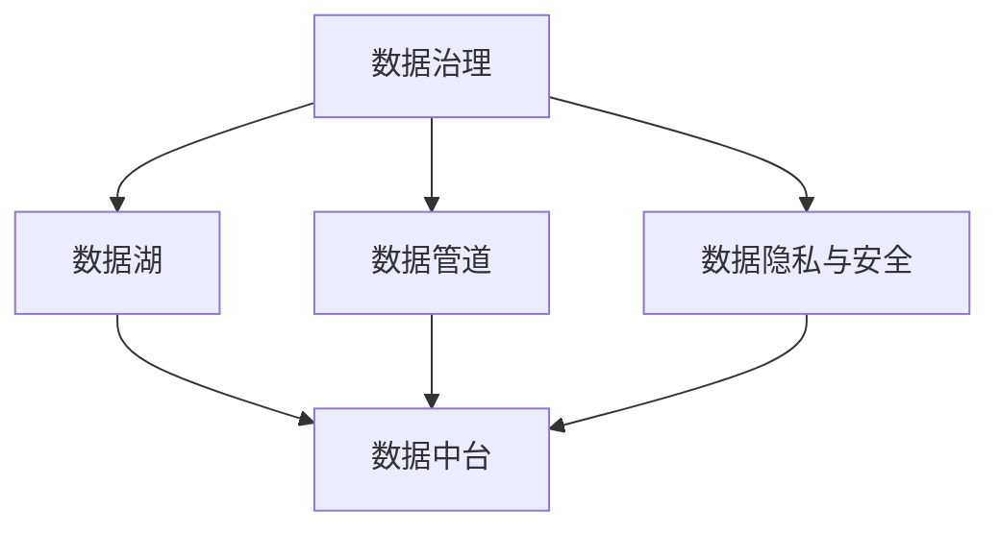

                 

# 人工智能创业数据管理的策略与实践

## 1. 背景介绍

在当今人工智能（AI）驱动的数字化时代，数据已成为企业创新和竞争力的核心。对于人工智能创业公司而言，数据管理不仅是实现产品创新和提升用户体验的基础，更是决定企业成败的关键。高效的数据管理策略不仅能保障数据的安全性和完整性，还能为AI模型的训练提供可靠的数据支撑，推动企业快速发展。

### 1.1 问题由来

数据管理在人工智能创业公司中面临诸多挑战：数据孤岛现象普遍，数据质量参差不齐，数据隐私和安全问题突出，以及数据处理和分析效率低下。这些问题不仅阻碍了企业创新能力的提升，也带来了巨大的运营成本和风险。因此，制定科学合理的策略，高效地管理和利用数据，成为人工智能创业公司的首要任务。

### 1.2 问题核心关键点

数据管理涉及数据收集、存储、处理、分析和应用等多个环节。核心问题包括：

- **数据质量**：数据的准确性、完整性和一致性。
- **数据安全**：保护数据免受未经授权的访问和泄露。
- **数据隐私**：确保数据使用符合法律法规要求，尊重用户隐私。
- **数据处理效率**：提升数据处理和分析的速度和性能。
- **数据协同**：实现数据在不同部门和系统之间的共享和协同。

## 2. 核心概念与联系

### 2.1 核心概念概述

为更好地理解数据管理在人工智能创业公司中的作用，本文将介绍几个核心概念：

- **数据治理**：包括数据标准、数据质量管理、元数据管理、数据生命周期管理等，旨在确保数据的一致性、可靠性和可追溯性。
- **数据湖**：集中存储企业内部和外部数据的大型数据仓库，支持数据的大规模处理和分析。
- **数据管道**：自动化数据流动的工具，连接数据源和数据消费方，提升数据处理的效率。
- **数据中台**：集成数据治理、数据湖和数据管道，提供一站式数据管理平台，支持企业的业务创新和决策支持。
- **数据隐私和安全**：涉及数据保护法规、加密技术、访问控制等，确保数据的安全使用和合规性。

这些核心概念之间的关系可以通过以下Mermaid流程图来展示：



这个流程图展示了大数据管理的各个环节及其之间的联系：

1. 数据治理定义数据标准和规范，确保数据的一致性和质量。
2. 数据湖存储数据，支持大规模的数据处理和分析。
3. 数据管道自动化数据流动，提升数据处理的效率。
4. 数据中台集成治理、湖和管道，提供一站式管理平台。
5. 数据隐私与安全保护数据的安全和合规。

## 3. 核心算法原理 & 具体操作步骤

### 3.1 算法原理概述

人工智能创业公司中的数据管理，基于数据治理、数据湖、数据管道和数据中台等概念，通过自动化和规范化的方式，实现数据的有效管理和应用。其核心原理包括：

- **数据标准化**：统一数据格式和命名规范，确保数据的可比性和一致性。
- **数据质量管理**：通过数据清洗、去重、纠错等方法，提高数据的准确性和完整性。
- **元数据管理**：记录和管理数据的基本信息，如来源、格式、处理状态等，便于数据管理和追踪。
- **数据生命周期管理**：定义数据从产生到销毁的整个生命周期，确保数据的安全和合规。
- **数据安全与隐私保护**：采用加密、访问控制等技术，保护数据免受未经授权的访问和泄露。

### 3.2 算法步骤详解

基于数据管理的核心原理，人工智能创业公司中的数据管理流程通常包括以下几个关键步骤：

1. **数据收集与清洗**：从不同来源收集数据，进行初步清洗和预处理，确保数据质量和一致性。
2. **数据存储与管理**：将清洗后的数据存储到数据湖中，建立元数据，确保数据的可追溯性和治理。
3. **数据处理与分析**：通过数据管道自动化数据流动，结合数据中台的高级分析功能，进行数据处理和分析，支持业务决策和产品创新。
4. **数据共享与协同**：通过数据中台实现不同部门和系统之间的数据共享和协同，提升数据使用的效率和灵活性。
5. **数据安全与合规**：采用数据加密、访问控制等技术，确保数据的安全和隐私保护，符合法律法规要求。

### 3.3 算法优缺点

数据管理在人工智能创业公司中具有以下优点：

- **提升数据利用效率**：通过规范化和管理，提高数据的质量和可用性，提升数据处理的效率。
- **保障数据安全与合规**：通过数据隐私和安全保护措施，确保数据的安全和合法使用。
- **支持业务创新和决策支持**：提供高质量的数据支撑，为企业的业务创新和决策提供科学依据。

然而，数据管理也存在一些局限性：

- **技术复杂度**：数据管理涉及多方面技术和工具，实施和维护成本较高。
- **数据孤岛**：数据治理不当可能导致数据孤岛现象，影响数据共享和协同。
- **隐私与安全风险**：数据隐私和安全保护措施不当，可能导致数据泄露和滥用。

### 3.4 算法应用领域

数据管理在大数据、人工智能、金融、医疗、零售等多个领域都有广泛应用，具体如下：

- **大数据领域**：通过数据治理和数据湖，提升数据质量和处理效率，支持大规模数据分析。
- **人工智能领域**：提供高质量的数据集和数据处理工具，支持AI模型的训练和优化。
- **金融领域**：确保交易数据的准确性和安全性，支持金融风险管理和决策支持。
- **医疗领域**：管理医疗数据，确保数据隐私和安全，支持医疗研究和临床决策。
- **零售领域**：通过数据协同和分析，提升市场营销和产品推荐的效果。

## 4. 数学模型和公式 & 详细讲解 & 举例说明

### 4.1 数学模型构建

数据管理中涉及的数学模型主要集中在数据质量管理和元数据管理等方面。以下是一个简单的数据质量管理的数学模型：

假设我们有数据集 $D$，包含 $n$ 条记录，每条记录 $x_i$ 包含 $m$ 个字段 $f_j$。定义数据质量函数 $Q(D)$，计算数据集的整体质量：

$$
Q(D) = \frac{\sum_{i=1}^n Q_i(x_i)}{n}
$$

其中 $Q_i(x_i)$ 为记录 $x_i$ 的数据质量评分，通过记录的完整性、准确性、一致性等指标计算得出。

### 4.2 公式推导过程

以完整性评分为例，假设每个字段的缺失概率为 $p_j$，则记录 $x_i$ 的完整性评分 $Q_{complete}(x_i)$ 可以表示为：

$$
Q_{complete}(x_i) = 1 - \sum_{j=1}^m p_j
$$

假设缺失概率服从伯努利分布，则完整性评分可以进一步简化为：

$$
Q_{complete}(x_i) = 1 - \prod_{j=1}^m (1-p_j)
$$

### 4.3 案例分析与讲解

假设我们有一个包含客户基本信息的数据集，其中年龄字段有 5% 的缺失。我们希望通过数据清洗，提升数据完整性评分。定义年龄字段的缺失概率为 $p_{age} = 0.05$，则每条记录的完整性评分为：

$$
Q_{complete}(x_i) = 1 - (1-0.05)^m
$$

其中 $m$ 为记录中包含的字段数量。例如，如果每条记录包含 10 个字段，则完整性评分为：

$$
Q_{complete}(x_i) = 1 - (0.95)^{10} \approx 0.944
$$

这意味着每条记录的完整性评分为 0.944，整张数据集的完整性评分为：

$$
Q(D) = \frac{\sum_{i=1}^n Q_{complete}(x_i)}{n} \approx 0.944
$$

这表明，尽管存在缺失值，但整体数据集的完整性评分依然较高，可以进行进一步的数据分析和应用。

## 5. 项目实践：代码实例和详细解释说明

### 5.1 开发环境搭建

在进行数据管理项目实践前，我们需要准备好开发环境。以下是使用Python进行PyTorch和Pandas开发的环境配置流程：

1. 安装Anaconda：从官网下载并安装Anaconda，用于创建独立的Python环境。

2. 创建并激活虚拟环境：
```bash
conda create -n data-env python=3.8 
conda activate data-env
```

3. 安装PyTorch和Pandas：
```bash
pip install torch pandas scikit-learn tqdm jupyter notebook ipython
```

完成上述步骤后，即可在`data-env`环境中开始数据管理项目开发。

### 5.2 源代码详细实现

以下是一个简单的数据清洗和处理的代码实例，使用Pandas库进行数据预处理。

```python
import pandas as pd
from sklearn.preprocessing import LabelEncoder

# 读取CSV文件
df = pd.read_csv('data.csv')

# 处理缺失值
df = df.dropna(subset=['age', 'gender', 'income'])

# 处理重复值
df = df.drop_duplicates()

# 数据类型转换
df['age'] = df['age'].astype(int)
df['gender'] = LabelEncoder().fit_transform(df['gender'])

# 数据可视化
df['income'].hist(bins=10)
```

在这个例子中，我们使用了Pandas库进行数据读取、缺失值处理、重复值处理和数据类型转换等基本操作。通过这些操作，我们得到了一张处理后的数据集，可用于进一步的数据分析和模型训练。

### 5.3 代码解读与分析

让我们再详细解读一下关键代码的实现细节：

**df = pd.read_csv('data.csv')**：读取名为 `data.csv` 的CSV文件，并将其存储在Pandas数据框中。

**df = df.dropna(subset=['age', 'gender', 'income'])**：删除包含 'age', 'gender', 'income' 字段的缺失值。

**df = df.drop_duplicates()**：删除重复的行。

**df['age'] = df['age'].astype(int)**：将 'age' 字段的值转换为整数类型。

**df['gender'] = LabelEncoder().fit_transform(df['gender'])**：使用LabelEncoder对 'gender' 字段进行编码，将其转换为数值型数据。

**df['income'].hist(bins=10)**：绘制 'income' 字段的直方图，展示其分布情况。

### 5.4 运行结果展示

运行上述代码后，可以得到以下结果：

- 缺失值和重复值被处理，确保数据的完整性和一致性。
- 数据类型被转换为数值型，便于后续的数据分析和模型训练。
- 数据可视化展示了 'income' 字段的分布情况，为进一步分析提供了依据。

## 6. 实际应用场景

### 6.1 智能客服系统

智能客服系统是数据管理在人工智能创业公司中应用的一个典型场景。通过数据治理和数据湖，智能客服系统可以高效地管理和利用客户互动数据，提升服务质量和用户满意度。

在技术实现上，可以收集客户的历史互动记录，包括文本消息、通话记录等，通过数据清洗和预处理，得到高质量的客户行为数据。将数据存储到数据湖中，建立元数据，确保数据的可靠性和可追溯性。结合数据中台的高级分析功能，可以实时监测客户行为，识别客户需求和问题，自动生成回复，提升客服效率和效果。

### 6.2 金融风险管理

金融风险管理是数据管理在金融领域的一个重要应用。通过数据治理和数据湖，金融机构可以高效地管理和分析交易数据，提升风险识别和管理的准确性和效率。

在技术实现上，可以收集交易数据，进行初步清洗和预处理，得到高质量的交易数据。将数据存储到数据湖中，建立元数据，确保数据的可靠性和可追溯性。结合数据中台的高级分析功能，可以实时监测交易数据，识别异常交易，预测风险，提供决策支持。

### 6.3 医疗研究与诊断

医疗研究与诊断是数据管理在医疗领域的重要应用。通过数据治理和数据湖，医疗机构可以高效地管理和分析患者数据，提升医疗研究和诊断的准确性和效率。

在技术实现上，可以收集患者的历史医疗数据，进行初步清洗和预处理，得到高质量的医疗数据。将数据存储到数据湖中，建立元数据，确保数据的可靠性和可追溯性。结合数据中台的高级分析功能，可以实时监测患者数据，预测疾病风险，提供诊断建议，支持医疗研究和临床决策。

## 7. 工具和资源推荐

### 7.1 学习资源推荐

为了帮助开发者系统掌握数据管理的理论基础和实践技巧，这里推荐一些优质的学习资源：

1. 《Python数据科学手册》：由数据科学专家Jake VanderPlas所著，全面介绍了Python在数据科学中的应用，包括数据预处理、数据可视化等。

2. 《数据科学入门》：由Kaggle和DataCamp联合制作的免费课程，涵盖数据清洗、数据处理、数据可视化等基本概念和实践。

3. 《数据管理基础》：由亚马逊AWS提供的免费课程，介绍数据管理的基本概念和实践，涵盖数据标准化、数据质量管理等。

4. 《机器学习实战》：由Kaggle和Udacity联合制作的免费课程，涵盖机器学习的基本概念和实践，包括数据预处理、模型训练等。

5. 《深度学习》：由斯坦福大学提供的免费课程，涵盖深度学习的基本概念和实践，包括数据预处理、模型训练等。

通过对这些资源的学习实践，相信你一定能够快速掌握数据管理的精髓，并用于解决实际的数据问题。

### 7.2 开发工具推荐

高效的开发离不开优秀的工具支持。以下是几款用于数据管理开发的常用工具：

1. Python：作为数据科学和机器学习的主流编程语言，Python拥有丰富的数据处理和分析库，如Pandas、NumPy、Scikit-Learn等。

2. PyTorch：由Facebook开发的深度学习框架，支持动态计算图和自动微分，适合快速迭代研究。

3. Hive：由Hadoop社区开发的分布式数据仓库，支持大规模数据处理和分析。

4. Spark：由Apache开发的分布式计算框架，支持大数据处理和分析。

5. Kibana：Elasticsearch提供的可视化工具，支持实时数据监测和分析。

6. Jupyter Notebook：开源的交互式编程环境，支持Python、R等多种编程语言，便于开发和调试。

合理利用这些工具，可以显著提升数据管理任务的开发效率，加快创新迭代的步伐。

### 7.3 相关论文推荐

数据管理技术的发展源于学界的持续研究。以下是几篇奠基性的相关论文，推荐阅读：

1. 《大数据分析：方法、工具和实践》：由数据科学专家Ross Quinlan所著，全面介绍了大数据分析的基本概念和实践。

2. 《数据挖掘：概念与技术》：由数据科学专家Jerry Kougios所著，介绍数据挖掘的基本概念和实践，涵盖数据预处理、模型训练等。

3. 《数据治理框架》：由数据治理专家Dconnor所著，全面介绍了数据治理的基本概念和实践，涵盖数据标准化、数据质量管理等。

4. 《数据隐私与安全》：由数据隐私和安全专家Ian Smith所著，全面介绍了数据隐私和安全的基本概念和实践，涵盖数据加密、访问控制等。

这些论文代表了大数据管理技术的最新进展，通过学习这些前沿成果，可以帮助研究者把握学科前进方向，激发更多的创新灵感。

## 8. 总结：未来发展趋势与挑战

### 8.1 总结

本文对人工智能创业公司中数据管理的策略与实践进行了全面系统的介绍。首先阐述了数据管理在人工智能创业公司中的重要性，明确了数据管理在保障数据质量、提升数据处理效率、支持业务创新和决策支持等方面的作用。其次，从原理到实践，详细讲解了数据治理、数据湖、数据管道和数据中台等核心概念，以及数据清洗、数据处理、数据分析和数据共享等关键步骤。同时，本文还广泛探讨了数据管理在智能客服、金融风险管理、医疗研究与诊断等多个行业领域的应用前景，展示了数据管理的巨大潜力。此外，本文精选了数据管理的各类学习资源，力求为读者提供全方位的技术指引。

通过本文的系统梳理，可以看到，数据管理在人工智能创业公司中具有不可替代的作用，是大数据技术落地的重要保障。未来，伴随数据管理技术的持续演进，相信大数据将更好地服务于人工智能创业公司的业务创新和发展。

### 8.2 未来发展趋势

展望未来，数据管理技术将呈现以下几个发展趋势：

1. **数据湖技术的普及**：随着数据湖技术的成熟，越来越多的企业将采用数据湖来管理和存储数据，提升数据处理的效率和灵活性。

2. **数据中台的建设**：数据中台将成为企业数据管理的重要平台，集成了数据治理、数据湖和数据管道，提供一站式数据管理解决方案。

3. **数据隐私与安全的提升**：随着数据隐私和安全法规的完善，数据管理将更加注重隐私保护和数据安全，确保数据合法合规的使用。

4. **实时数据处理能力的增强**：通过流计算和大数据处理技术，数据管理将能够实现实时数据处理，提升数据处理的效率和响应速度。

5. **跨部门数据协同的加强**：数据管理将更加注重跨部门的数据协同，提升数据的共享和应用效率，支持企业的业务创新和决策支持。

这些趋势凸显了数据管理技术的广阔前景，必将进一步推动人工智能创业公司的发展，为人工智能技术的落地应用提供坚实的保障。

### 8.3 面临的挑战

尽管数据管理技术已经取得了瞩目成就，但在迈向更加智能化、普适化应用的过程中，它仍面临着诸多挑战：

1. **技术复杂度**：数据管理涉及多方面技术和工具，实施和维护成本较高，需要高水平的技术团队和完善的流程管理。

2. **数据孤岛**：数据治理不当可能导致数据孤岛现象，影响数据共享和协同。

3. **隐私与安全风险**：数据隐私和安全保护措施不当，可能导致数据泄露和滥用，带来法律和声誉风险。

4. **数据质量管理**：数据质量管理不当，可能导致数据不准确、不完整，影响数据处理和分析的效果。

5. **资源消耗**：大规模数据处理和分析需要高性能计算资源，可能带来高昂的运营成本。

这些挑战需要人工智能创业公司在实施数据管理过程中，注重技术选型、流程管理和安全控制，确保数据管理的质量和效果。

### 8.4 研究展望

面对数据管理面临的挑战，未来的研究需要在以下几个方面寻求新的突破：

1. **数据治理工具的自动化**：开发更加智能化的数据治理工具，自动化数据质量管理和元数据管理，提升数据管理的效率和准确性。

2. **数据隐私与安全的保护**：探索新的数据加密和访问控制技术，确保数据的安全和隐私保护。

3. **实时数据处理技术**：开发高效的流计算和大数据处理技术，提升实时数据处理的能力。

4. **跨部门数据协同的机制**：探索数据共享和协同的新机制，促进不同部门和系统之间的数据流动和协同。

5. **数据质量管理的自动化**：开发自动化的数据清洗和预处理工具，提升数据处理的效率和准确性。

这些研究方向的探索，必将引领数据管理技术迈向更高的台阶，为人工智能创业公司提供更高效、更安全、更灵活的数据管理解决方案。面向未来，数据管理技术还需要与其他人工智能技术进行更深入的融合，如知识表示、因果推理、强化学习等，多路径协同发力，共同推动人工智能技术的落地应用。

## 9. 附录：常见问题与解答

**Q1：数据管理是否适用于所有企业？**

A: 数据管理适用于任何需要处理大量数据、依赖数据驱动决策的企业。但对于小型企业和初创公司，数据管理可能面临技术和资源上的挑战，需要根据具体情况进行权衡和优化。

**Q2：数据管理对企业的成本影响有多大？**

A: 数据管理初期投入较大，包括技术和人力成本。但长期来看，数据管理的实施可以显著提升数据利用效率和业务决策的准确性，为企业带来更大的价值。

**Q3：如何选择合适的数据管理工具？**

A: 选择合适的数据管理工具需要考虑企业的数据量、数据处理需求、技术栈等因素。一般而言，大数据平台如Hadoop、Spark，数据湖平台如AWS LakeForm，数据管理平台如Alteryx，都是不错的选择。

**Q4：数据管理如何支持业务创新？**

A: 数据管理可以通过提供高质量的数据集和数据处理工具，支持业务创新。例如，通过分析客户行为数据，可以优化产品设计和营销策略；通过分析交易数据，可以提升风险管理能力；通过分析患者数据，可以提升医疗研究和诊断的准确性。

**Q5：数据管理在技术实施中需要注意哪些问题？**

A: 数据管理在技术实施中需要注意以下几个问题：

1. 数据质量管理：确保数据的准确性、完整性和一致性。
2. 数据安全和隐私保护：确保数据的安全和隐私保护，符合法律法规要求。
3. 数据共享和协同：实现数据在不同部门和系统之间的共享和协同。
4. 数据实时处理：实现实时数据处理和分析，提升数据的响应速度。
5. 数据治理工具的选择：选择适合自己企业的数据治理工具，确保数据管理的效率和准确性。

以上问题需要在数据管理实施过程中，注重技术选型、流程管理和安全控制，确保数据管理的质量和效果。

