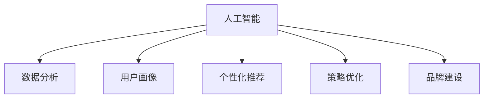

                 

# 人工智能创业：市场营销的技巧

> 关键词：人工智能, 市场营销, 商业模型, 数据分析, 用户画像, 策略优化, 品牌建设, 市场推广, 技术创新, 创业指南

## 1. 背景介绍

### 1.1 问题由来
随着人工智能(AI)技术的快速发展，越来越多的创业公司开始将AI应用于市场营销领域，希望通过智能化手段提升市场竞争力和用户满意度。然而，人工智能与市场营销的结合并非易事，需要综合考虑技术实现、市场环境、用户需求等多方面因素。如何构建有效的AI驱动的市场营销策略，是当前人工智能创业公司需要重点关注的问题。

### 1.2 问题核心关键点
本节将详细介绍人工智能与市场营销结合中的关键点，包括数据收集与分析、用户画像构建、个性化推荐、策略优化、品牌建设等。

## 2. 核心概念与联系

### 2.1 核心概念概述

为更好地理解AI在市场营销中的应用，本节将介绍几个密切相关的核心概念：

- **人工智能(AI)**：使用机器学习、深度学习等技术，模拟人类智能过程，实现自动化决策和任务处理的技术。
- **市场营销(Marketing)**：通过一系列策略和活动，将产品或服务推广给目标用户，以实现销售和品牌建设。
- **数据分析(Analytics)**：通过对市场数据、用户行为数据等进行分析，获取有价值的洞察，支持决策制定。
- **用户画像(User Persona)**：构建详细描述目标用户的特征和行为的数据模型，用于指导产品设计和市场营销策略。
- **个性化推荐(Personalized Recommendation)**：基于用户历史行为和兴趣，提供定制化的产品或服务推荐，提升用户体验和满意度。
- **策略优化(Strategy Optimization)**：通过AI技术优化市场营销策略，包括广告投放、渠道选择、促销活动等，实现资源的最优配置。
- **品牌建设(Branding)**：利用AI技术进行品牌监测、社交媒体分析等，构建和提升品牌形象和市场地位。

这些核心概念之间的逻辑关系可以通过以下Mermaid流程图来展示：



这个流程图展示了一系列核心概念及其之间的关系：

1. 人工智能通过机器学习、深度学习等技术，为市场营销提供智能化决策支持。
2. 数据分析通过挖掘和分析市场数据、用户行为数据等，为人工智能提供输入数据，支持模型训练和策略优化。
3. 用户画像通过构建详细描述目标用户的特征和行为的数据模型，指导产品设计和市场营销策略。
4. 个性化推荐基于用户历史行为和兴趣，提供定制化的产品或服务推荐，提升用户体验和满意度。
5. 策略优化通过AI技术优化市场营销策略，包括广告投放、渠道选择、促销活动等，实现资源的最优配置。
6. 品牌建设利用AI技术进行品牌监测、社交媒体分析等，构建和提升品牌形象和市场地位。

## 3. 核心算法原理 & 具体操作步骤

### 3.1 算法原理概述

AI驱动的市场营销策略主要依赖于数据分析和机器学习模型。其核心思想是通过对海量市场数据和用户行为数据的分析，构建用户画像，设计个性化推荐算法，优化市场营销策略，实现品牌建设。

具体来说，人工智能在市场营销中的应用包括以下几个关键环节：

1. **数据收集与预处理**：从各种渠道（如社交媒体、电商平台、搜索引擎等）收集市场数据和用户行为数据，进行清洗和预处理。
2. **用户画像构建**：通过聚类、分类等机器学习技术，构建详细描述目标用户的特征和行为的数据模型。
3. **个性化推荐**：利用协同过滤、内容推荐、深度学习等技术，为用户提供定制化的产品或服务推荐。
4. **策略优化**：使用强化学习、优化算法等技术，优化市场营销策略，实现广告投放、渠道选择、促销活动等的资源最优配置。
5. **品牌建设**：通过自然语言处理(NLP)、情感分析等技术，监测品牌在社交媒体上的声誉和情感倾向，指导品牌营销策略。

### 3.2 算法步骤详解

基于人工智能的市场营销策略通常包括以下几个关键步骤：

**Step 1: 数据收集与预处理**

- **数据来源**：从社交媒体、电商平台、搜索引擎等渠道收集市场数据和用户行为数据。
- **数据清洗**：去除噪声和异常值，填补缺失值，进行标准化处理。
- **数据整合**：将来自不同渠道的数据进行整合，形成统一的数据视图。

**Step 2: 用户画像构建**

- **特征提取**：从用户行为数据中提取关键特征，如浏览记录、购买历史、社交媒体活动等。
- **聚类分析**：使用K-Means、层次聚类等算法，对用户进行聚类，形成不同的用户群体。
- **画像建模**：构建详细的用户画像，包括人口统计信息、兴趣爱好、行为模式等。

**Step 3: 个性化推荐**

- **模型训练**：使用协同过滤、内容推荐、深度学习等算法，训练个性化推荐模型。
- **推荐计算**：根据用户画像和行为数据，计算个性化推荐结果。
- **结果展示**：将推荐结果展示给用户，提供定制化的产品或服务。

**Step 4: 策略优化**

- **模型训练**：使用强化学习、优化算法等技术，训练市场营销策略优化模型。
- **策略执行**：根据模型输出，优化广告投放、渠道选择、促销活动等策略。
- **效果评估**：通过A/B测试等方法，评估策略效果，迭代优化。

**Step 5: 品牌建设**

- **品牌监测**：使用情感分析、NLP等技术，监测品牌在社交媒体上的声誉和情感倾向。
- **品牌分析**：对监测结果进行分析和可视化，识别品牌风险和机会。
- **品牌优化**：根据分析结果，优化品牌营销策略，提升品牌形象和市场地位。

### 3.3 算法优缺点

基于人工智能的市场营销策略具有以下优点：

1. **高效精准**：通过数据驱动的决策，可以大幅提升市场营销策略的精准度和效率。
2. **个性化定制**：能够根据用户画像和行为数据，提供定制化的产品或服务推荐，提升用户体验和满意度。
3. **策略优化**：利用机器学习技术优化市场营销策略，实现资源的最优配置。
4. **实时响应**：通过实时数据分析和反馈，能够快速调整策略，适应市场变化。

同时，该方法也存在一定的局限性：

1. **数据质量依赖**：策略效果很大程度上取决于数据的质量和多样性，数据不足或噪声较多会严重影响策略效果。
2. **算法复杂度**：机器学习模型的训练和优化需要较高的计算资源和时间，对算力要求较高。
3. **模型解释性不足**：部分机器学习模型（如深度学习）的决策过程较为复杂，难以解释其内部工作机制。
4. **隐私和合规问题**：收集和分析用户数据需要考虑隐私保护和法律法规的合规性，存在一定的法律风险。

尽管存在这些局限性，但就目前而言，基于人工智能的市场营销策略仍是大数据时代下市场营销的重要手段。未来相关研究的重点在于如何进一步降低数据依赖，提高模型的解释性和可解释性，同时兼顾隐私和合规性等因素。

### 3.4 算法应用领域

基于人工智能的市场营销策略在多个行业领域已经得到了广泛应用，如：

- **电子商务**：通过个性化推荐和策略优化，提升电商平台的转化率和用户满意度。
- **金融服务**：利用数据分析和品牌监测，优化客户服务，提升品牌形象和客户忠诚度。
- **旅游服务**：通过用户画像和个性化推荐，提升旅游产品的吸引力和用户体验。
- **媒体娱乐**：使用数据分析和情感分析技术，优化内容推荐和广告投放，提升用户粘性和广告效果。
- **医疗健康**：通过用户行为数据和情感分析，优化医疗服务，提升患者体验和满意度。

除了上述这些经典应用领域外，人工智能在市场营销中的应用还在不断扩展，为各行业带来新的业务模式和市场机会。

## 4. 数学模型和公式 & 详细讲解 & 举例说明

### 4.1 数学模型构建

基于人工智能的市场营销策略的数学模型构建主要包括以下几个关键部分：

- **数据表示**：将市场数据和用户行为数据表示为向量或矩阵形式，用于后续的机器学习模型训练。
- **特征选择**：从原始数据中选择最相关的特征，以提高模型的效果。
- **模型训练**：使用机器学习算法（如线性回归、决策树、深度神经网络等）训练模型，学习用户画像和个性化推荐策略。
- **策略优化**：使用强化学习算法（如Q-learning、REINFORCE等）训练市场营销策略优化模型，优化广告投放、渠道选择、促销活动等。

### 4.2 公式推导过程

以个性化推荐为例，我们可以使用协同过滤算法来计算用户对未评价物品的评分。协同过滤是一种基于用户历史行为数据进行推荐的方法，其基本思路是找出与目标用户相似的其他用户，通过这些用户的历史评分数据来预测目标用户对未评价物品的评分。

协同过滤算法的基本公式如下：

$$
\hat{r}_{ui} = \frac{\sum_{v \in N_u} r_{vi} \cdot r_{uv}}{\sqrt{\sum_{v \in N_u} r_{vi}^2} \cdot \sqrt{\sum_{v \in N_u} r_{uv}^2}}
$$

其中，$r_{ui}$ 表示用户 $u$ 对物品 $i$ 的评分预测值，$N_u$ 表示与用户 $u$ 相似的其他用户集合，$r_{vi}$ 和 $r_{uv}$ 分别表示用户 $v$ 对物品 $i$ 和 $u$ 的评分，$\sqrt{}$ 表示归一化处理，以避免数据偏斜。

通过上述公式，我们可以计算出用户 $u$ 对物品 $i$ 的评分预测值，并根据预测值对物品进行排序，最终选择评分最高的若干物品进行推荐。

### 4.3 案例分析与讲解

假设我们有一个电商平台，想要通过AI技术提升用户的购买转化率。我们可以按照以下步骤进行：

**Step 1: 数据收集与预处理**

- 从平台收集用户的浏览记录、购买历史、评分数据等。
- 清洗数据，去除噪声和异常值，填补缺失值。
- 整合来自不同渠道的数据，形成统一的数据视图。

**Step 2: 用户画像构建**

- 提取用户的特征，如浏览记录、购买历史、评分等。
- 使用K-Means算法对用户进行聚类，形成不同的用户群体。
- 构建详细的用户画像，包括人口统计信息、兴趣爱好、行为模式等。

**Step 3: 个性化推荐**

- 使用协同过滤算法训练推荐模型。
- 根据用户画像和行为数据，计算个性化推荐结果。
- 将推荐结果展示给用户，提升购买转化率。

**Step 4: 策略优化**

- 使用强化学习算法优化广告投放策略。
- 通过A/B测试等方法评估策略效果。
- 根据测试结果迭代优化广告投放策略。

**Step 5: 品牌建设**

- 使用情感分析技术监测品牌在社交媒体上的声誉和情感倾向。
- 对监测结果进行分析和可视化，识别品牌风险和机会。
- 根据分析结果，优化品牌营销策略，提升品牌形象和市场地位。

通过上述步骤，我们可以构建一个基于AI的市场营销策略，提升电商平台的购买转化率和用户满意度。

## 5. 项目实践：代码实例和详细解释说明

### 5.1 开发环境搭建

在进行AI驱动的市场营销策略开发前，我们需要准备好开发环境。以下是使用Python进行PyTorch开发的环境配置流程：

1. 安装Anaconda：从官网下载并安装Anaconda，用于创建独立的Python环境。

2. 创建并激活虚拟环境：
```bash
conda create -n pytorch-env python=3.8 
conda activate pytorch-env
```

3. 安装PyTorch：根据CUDA版本，从官网获取对应的安装命令。例如：
```bash
conda install pytorch torchvision torchaudio cudatoolkit=11.1 -c pytorch -c conda-forge
```

4. 安装各类工具包：
```bash
pip install numpy pandas scikit-learn matplotlib tqdm jupyter notebook ipython
```

完成上述步骤后，即可在`pytorch-env`环境中开始项目实践。

### 5.2 源代码详细实现

下面以个性化推荐系统为例，给出使用PyTorch进行协同过滤算法实现的PyTorch代码实现。

首先，定义数据处理函数：

```python
import pandas as pd
from sklearn.preprocessing import StandardScaler
from sklearn.decomposition import TruncatedSVD
from scipy.sparse import csr_matrix

def load_data(file_path):
    data = pd.read_csv(file_path)
    return data

def preprocess_data(data):
    # 数据清洗
    data = data.dropna()
    
    # 标准化处理
    scaler = StandardScaler()
    data = scaler.fit_transform(data)
    
    # 构建稀疏矩阵
    matrix = csr_matrix(data.values)
    
    return matrix

def train_model(matrix, k=10, n_iter=100):
    # 使用TruncatedSVD算法进行协同过滤
    model = TruncatedSVD(n_components=k, random_state=42)
    model.fit(matrix)
    
    # 预测新用户对未评价物品的评分
    scores = model.transform(matrix)
    
    # 输出模型评分预测结果
    print(scores)
```

然后，加载和预处理数据：

```python
matrix = load_data('data.csv')
matrix = preprocess_data(matrix)
```

最后，训练和评估模型：

```python
k = 10
n_iter = 100

scores = train_model(matrix, k, n_iter)
```

### 5.3 代码解读与分析

让我们再详细解读一下关键代码的实现细节：

**load_data函数**：
- 从指定文件中加载数据，并返回Pandas DataFrame对象。

**preprocess_data函数**：
- 数据清洗：去除NaN值。
- 标准化处理：使用sklearn的StandardScaler对数据进行标准化，以避免数据偏斜。
- 构建稀疏矩阵：将数据转换为稀疏矩阵，提高计算效率。

**train_model函数**：
- 使用sklearn的TruncatedSVD算法进行协同过滤，训练推荐模型。
- 使用模型预测新用户对未评价物品的评分。
- 输出模型评分预测结果。

通过上述代码，我们可以看到，协同过滤算法的实现相对简单，但能够根据用户历史行为数据，有效预测新用户对未评价物品的评分。在实际应用中，我们可以通过不断优化算法参数、引入更多特征、扩展模型训练数据等手段，进一步提升个性化推荐的效果。

## 6. 实际应用场景

### 6.1 智能客服系统

基于AI的市场营销策略可以广泛应用于智能客服系统的构建。传统客服往往需要配备大量人力，高峰期响应缓慢，且一致性和专业性难以保证。通过AI技术，智能客服系统可以7x24小时不间断服务，快速响应客户咨询，用自然流畅的语言解答各类常见问题。

在技术实现上，可以收集企业内部的历史客服对话记录，将问题和最佳答复构建成监督数据，在此基础上对AI模型进行微调。微调后的智能客服系统能够自动理解用户意图，匹配最合适的答复模板进行回复。对于客户提出的新问题，还可以接入检索系统实时搜索相关内容，动态组织生成回答。如此构建的智能客服系统，能大幅提升客户咨询体验和问题解决效率。

### 6.2 金融舆情监测

金融机构需要实时监测市场舆论动向，以便及时应对负面信息传播，规避金融风险。传统的人工监测方式成本高、效率低，难以应对网络时代海量信息爆发的挑战。基于AI的市场营销策略可以应用于金融舆情监测。

具体而言，可以收集金融领域相关的新闻、报道、评论等文本数据，并对其进行主题标注和情感标注。在此基础上对AI模型进行微调，使其能够自动判断文本属于何种主题，情感倾向是正面、中性还是负面。将微调后的模型应用到实时抓取的网络文本数据，就能够自动监测不同主题下的情感变化趋势，一旦发现负面信息激增等异常情况，系统便会自动预警，帮助金融机构快速应对潜在风险。

### 6.3 个性化推荐系统

当前的推荐系统往往只依赖用户的历史行为数据进行物品推荐，无法深入理解用户的真实兴趣偏好。基于AI的市场营销策略可以应用于个性化推荐系统，通过AI技术深度挖掘用户兴趣和行为，提供更加精准、多样化的推荐内容。

在实践中，可以收集用户浏览、点击、评论、分享等行为数据，提取和用户交互的物品标题、描述、标签等文本内容。将文本内容作为模型输入，用户的后续行为（如是否点击、购买等）作为监督信号，在此基础上训练AI模型。微调后的模型能够从文本内容中准确把握用户的兴趣点。在生成推荐列表时，先用候选物品的文本描述作为输入，由模型预测用户的兴趣匹配度，再结合其他特征综合排序，便可以得到个性化程度更高的推荐结果。

### 6.4 未来应用展望

随着AI技术的发展，基于AI的市场营销策略将在更多领域得到应用，为传统行业带来变革性影响。

在智慧医疗领域，基于AI的市场营销策略可以应用于医疗问答、病历分析、药物研发等应用，提升医疗服务的智能化水平，辅助医生诊疗，加速新药开发进程。

在智能教育领域，AI营销策略可应用于作业批改、学情分析、知识推荐等方面，因材施教，促进教育公平，提高教学质量。

在智慧城市治理中，AI营销策略可应用于城市事件监测、舆情分析、应急指挥等环节，提高城市管理的自动化和智能化水平，构建更安全、高效的未来城市。

此外，在企业生产、社会治理、文娱传媒等众多领域，基于AI的市场营销策略也将不断涌现，为经济社会发展注入新的动力。相信随着技术的日益成熟，AI营销策略必将在更广阔的应用领域大放异彩，深刻影响人类的生产生活方式。

## 7. 工具和资源推荐

### 7.1 学习资源推荐

为了帮助开发者系统掌握AI驱动市场营销的理论基础和实践技巧，这里推荐一些优质的学习资源：

1. 《Deep Learning for Marketing》系列博文：由大模型技术专家撰写，深入浅出地介绍了AI在市场营销中的应用，包括数据收集、用户画像、推荐算法等。

2. Coursera《Machine Learning》课程：斯坦福大学开设的著名机器学习课程，涵盖机器学习基础和应用，适合入门学习。

3. 《Hands-On Machine Learning with Scikit-Learn, Keras, and TensorFlow》书籍：实践性强的机器学习书籍，详细介绍了Scikit-Learn、Keras和TensorFlow等常用工具的使用方法。

4. Kaggle：数据科学竞赛平台，提供丰富的数据分析和机器学习竞赛项目，适合实战训练。

5. PyTorch官方文档：PyTorch的官方文档，提供了海量API和样例代码，是进行AI项目开发的必备资料。

通过对这些资源的学习实践，相信你一定能够快速掌握AI驱动市场营销的精髓，并用于解决实际的AI营销问题。

### 7.2 开发工具推荐

高效的开发离不开优秀的工具支持。以下是几款用于AI驱动市场营销开发的常用工具：

1. Python：简单易用的编程语言，支持丰富的第三方库，是AI开发的主流语言。

2. PyTorch：基于Python的开源深度学习框架，灵活动态的计算图，适合快速迭代研究。

3. TensorFlow：由Google主导开发的开源深度学习框架，生产部署方便，适合大规模工程应用。

4. Scikit-Learn：Python的机器学习库，提供了丰富的算法实现和工具函数。

5. Pandas：Python的数据分析库，支持高效的数据处理和数据清洗。

6. Jupyter Notebook：交互式的编程环境，支持代码运行和结果展示，适合进行数据探索和模型训练。

合理利用这些工具，可以显著提升AI驱动市场营销任务的开发效率，加快创新迭代的步伐。

### 7.3 相关论文推荐

AI驱动的市场营销策略的发展源于学界的持续研究。以下是几篇奠基性的相关论文，推荐阅读：

1. Adaptive Cross-Adaptive Collaborative Filtering for Recommendation（AdaCCF）：提出了一种基于动态学习和协同过滤的推荐算法，提升推荐精度和多样性。

2. A Survey on Cross-Modal Recommender Systems：总结了跨模态推荐系统的发展现状和未来趋势，涉及图像、视频、语音等多模态数据的融合。

3. Attention-Based Recommendation Systems（ABRS）：提出了一种基于注意力机制的推荐算法，提高推荐效果和可解释性。

4. Deep Learning Approaches for Recommendation Systems：综述了深度学习在推荐系统中的应用，包括自编码、深度协同过滤等方法。

这些论文代表了大数据驱动的市场营销技术的发展脉络。通过学习这些前沿成果，可以帮助研究者把握学科前进方向，激发更多的创新灵感。

## 8. 总结：未来发展趋势与挑战

### 8.1 总结

本文对基于AI的市场营销策略进行了全面系统的介绍。首先阐述了AI在市场营销中的应用背景和意义，明确了AI驱动的市场营销策略在提升市场营销效率、用户满意度和品牌建设方面的独特价值。其次，从原理到实践，详细讲解了AI驱动的市场营销策略的数学原理和关键步骤，给出了AI项目开发的完整代码实例。同时，本文还广泛探讨了AI驱动的市场营销策略在智能客服、金融舆情、个性化推荐等多个行业领域的应用前景，展示了AI驱动的市场营销策略的巨大潜力。

通过本文的系统梳理，可以看到，AI驱动的市场营销策略在大数据时代下具有广阔的应用前景。AI技术在数据收集、用户画像构建、个性化推荐、策略优化、品牌建设等方面的综合应用，将极大地提升市场营销的效率和效果。未来，伴随AI技术的不断发展，基于AI的市场营销策略必将在更多领域得到应用，为传统行业带来变革性影响。

### 8.2 未来发展趋势

展望未来，AI驱动的市场营销策略将呈现以下几个发展趋势：

1. **数据智能化**：通过自动化数据收集和清洗，智能分析海量市场数据和用户行为数据，获取有价值的洞察，支持决策制定。
2. **用户画像精细化**：利用深度学习等技术，构建更详细、更精准的用户画像，支持个性化推荐和策略优化。
3. **推荐多样化**：引入更多特征和多模态数据，提供更加多样化、个性化的推荐内容，提升用户体验。
4. **策略动态化**：利用强化学习等技术，动态调整市场营销策略，实现资源的最优配置。
5. **品牌智能化**：利用NLP、情感分析等技术，监测品牌在社交媒体上的声誉和情感倾向，优化品牌营销策略。

以上趋势凸显了AI驱动的市场营销策略的广阔前景。这些方向的探索发展，必将进一步提升市场营销的效率和效果，为市场营销领域带来新的变革。

### 8.3 面临的挑战

尽管AI驱动的市场营销策略已经取得了瞩目成就，但在迈向更加智能化、普适化应用的过程中，它仍面临着诸多挑战：

1. **数据质量瓶颈**：AI策略效果很大程度上取决于数据的质量和多样性，数据不足或噪声较多会严重影响策略效果。如何进一步降低数据依赖，提高数据质量，将是未来研究的重要方向。
2. **算法复杂度**：AI模型的训练和优化需要较高的计算资源和时间，对算力要求较高。如何提高算法效率，优化模型训练，将是重要的优化方向。
3. **模型解释性不足**：部分AI模型的决策过程较为复杂，难以解释其内部工作机制。如何提高模型的可解释性，增强决策透明度，将是未来的研究重点。
4. **隐私和合规问题**：收集和分析用户数据需要考虑隐私保护和法律法规的合规性，存在一定的法律风险。如何兼顾隐私保护和合规性，将是重要的研究课题。

尽管存在这些挑战，但随着技术的不断进步和法律法规的完善，AI驱动的市场营销策略必将在未来得到更好的应用和发展。

### 8.4 未来突破

面对AI驱动市场营销所面临的挑战，未来的研究需要在以下几个方面寻求新的突破：

1. **数据质量优化**：开发更加智能化的数据收集和清洗技术，提高数据质量和多样性。利用数据增强等技术，扩充训练数据集，提高模型效果。
2. **算法效率提升**：开发更加高效的算法和优化技术，降低计算资源消耗，提高模型训练效率。引入分布式计算和边缘计算等技术，实现快速响应和实时计算。
3. **模型可解释性增强**：引入可解释性技术，如LIME、SHAP等，提高模型的可解释性，增强决策透明度。开发可解释的AI模型，如可解释的神经网络，提供更加可信的决策依据。
4. **隐私保护与合规**：引入隐私保护技术，如差分隐私、联邦学习等，保护用户隐私。遵循法律法规，建立隐私保护机制，保障数据合规性。

这些研究方向的探索，必将引领AI驱动市场营销技术迈向更高的台阶，为市场营销领域带来新的突破。面向未来，AI驱动的市场营销策略需要与其他AI技术进行更深入的融合，如知识表示、因果推理、强化学习等，多路径协同发力，共同推动市场营销技术的进步。只有勇于创新、敢于突破，才能不断拓展AI市场策略的边界，让AI技术更好地服务于市场营销领域。

## 9. 附录：常见问题与解答

**Q1：AI驱动的市场营销策略是否适用于所有市场营销场景？**

A: AI驱动的市场营销策略在大多数市场营销场景上都能取得不错的效果，特别是对于数据量较大的场景。但对于一些特定领域的市场营销，如小型创业公司、线下零售等，AI策略的实施可能存在一定难度。此时需要根据具体情况，结合传统市场营销手段，制定综合的市场营销方案。

**Q2：如何选择合适的AI驱动的市场营销策略？**

A: 选择AI驱动的市场营销策略需要考虑以下几个因素：
1. **数据情况**：评估现有数据的质量、多样性和规模，选择合适的算法和模型。
2. **业务目标**：明确市场营销的具体目标，如提高转化率、提升品牌形象等，选择合适的策略。
3. **技术能力**：评估技术团队的实力和经验，选择合适的AI工具和框架。
4. **资源投入**：考虑算力、数据处理能力等资源投入，选择合适的策略和方案。

**Q3：AI驱动的市场营销策略是否能够替代传统市场营销手段？**

A: AI驱动的市场营销策略可以与传统市场营销手段相结合，形成互补，而非替代。AI策略可以提供更加精准、个性化的营销建议，提升市场营销的效率和效果。传统市场营销手段，如品牌建设、渠道推广等，仍然是市场营销的重要组成部分。两者结合，可以形成更加综合、全面的市场营销体系。

**Q4：如何评估AI驱动的市场营销策略的效果？**

A: 评估AI驱动的市场营销策略的效果可以从以下几个方面进行：
1. **转化率**：评估营销策略对用户购买转化率的影响。
2. **用户满意度**：通过用户反馈、问卷调查等方式，评估用户对营销策略的满意度。
3. **品牌形象**：监测品牌在社交媒体上的声誉和情感倾向，评估品牌建设的效果。
4. **ROI**：计算市场营销活动的投资回报率，评估策略的经济效益。
5. **市场份额**：评估市场营销策略对市场份额和竞争力的影响。

通过对这些指标的评估，可以全面了解AI驱动市场营销策略的效果和价值。

---

作者：禅与计算机程序设计艺术 / Zen and the Art of Computer Programming

