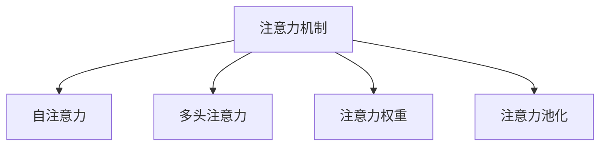

                 

## 1. 背景介绍

### 1.1 问题由来

在人工智能（AI）的快速发展中，注意力机制（Attention Mechanism）逐渐成为核心的算法之一。注意力机制通过模拟人类注意力系统，合理分配计算资源，在图像识别、自然语言处理、语音识别、推荐系统等多个领域展现出强大的能力。

注意力机制最早在计算机视觉领域由Bengio等人提出，并在机器翻译中得到应用。近年来，由于Transformer结构的兴起，注意力机制在NLP领域得到广泛应用，显著提升了模型性能。

在深度学习中，计算资源的合理分配问题主要体现在两个方面：一是在训练过程中如何合理地分配样本和计算资源，二是在推理过程中如何合理地分配计算资源以生成模型输出。

**1.2 问题核心关键点**

注意力机制在资源分配中的关键点包括：

- 在训练过程中，如何通过注意力机制合理分配样本，使得模型能够有效学习数据中的重要信息，避免资源的浪费。
- 在推理过程中，如何通过注意力机制合理分配计算资源，使得模型能够在有限时间内生成最优的输出。
- 如何设计注意力机制，使其能够在多种任务中通用化，提升模型的泛化能力。

这些问题不仅是深度学习研究中的核心内容，也是AI技术在实际应用中必须解决的问题。本文将深入探讨注意力机制在资源分配中的应用，从原理到实践，详细解读注意力机制的方方面面。

## 2. 核心概念与联系

### 2.1 核心概念概述

为了更好地理解注意力机制在资源分配中的角色，本节将介绍几个密切相关的核心概念：

- 注意力机制（Attention Mechanism）：一种模拟人类注意力的计算机制，通过学习输入序列中的重要信息，合理分配计算资源，使得模型在处理复杂任务时具有更好的表现。
- 自注意力（Self-Attention）：一种注意力机制的变体，通过输入序列内部的相似性计算，分配资源以生成序列的表示。
- 多头注意力（Multi-Head Attention）：一种扩展自注意力的方法，通过同时计算多个方向的注意力，提升模型的表达能力。
- 注意力权重（Attention Weights）：表示不同输入序列项对模型输出的影响程度，是注意力机制的核心。
- 注意力池化（Attention Pooling）：一种在计算过程中减小计算资源消耗的方法，通过将注意力权重进行加权平均，简化计算。

这些概念之间的逻辑关系可以通过以下Mermaid流程图来展示：



这个流程图展示了这个核心概念之间的相互联系：

- 注意力机制通过自注意力和多头注意力，学习输入序列中不同部分的关系。
- 注意力权重表示各个部分对输出的影响程度。
- 注意力池化用于计算过程中减小计算资源消耗。

## 3. 核心算法原理 & 具体操作步骤

### 3.1 算法原理概述

注意力机制在资源分配中的基本思想是通过计算输入序列中每个元素的重要性，合理分配计算资源，使得模型输出更加精准。具体来说，注意力机制通过以下步骤完成资源分配：

1. **计算注意力权重**：对输入序列中的每个元素，计算其与其他元素的相似度，生成一个注意力权重向量。
2. **加权和**：根据注意力权重向量，对输入序列进行加权求和，生成输入序列的表示。
3. **注意力池化**：对输入序列的表示进行池化操作，进一步减小计算资源消耗。
4. **生成输出**：将输入序列的表示用于生成模型输出。

这些步骤可以通过以下数学公式表示：

$$
\text{Attention}(Q, K, V) = \text{Softmax}(\frac{QK^T}{\sqrt{d_k}})V
$$

其中，$Q$、$K$、$V$分别表示输入序列的查询向量、键向量和值向量。$d_k$是键向量的维度。

### 3.2 算法步骤详解

以Transformer模型中的多头自注意力为例，详细介绍注意力机制的计算步骤：

1. **输入表示**：将输入序列$x$转换为模型所需的表示形式。
2. **计算查询向量、键向量和值向量**：对输入序列$x$进行线性变换，得到查询向量$q$、键向量$k$和值向量$v$。
3. **计算注意力权重**：通过计算查询向量$q$和键向量$k$的点积，并除以$\sqrt{d_k}$，得到注意力权重向量。
4. **计算注意力向量**：将注意力权重向量与值向量$v$进行逐元素乘积，然后对结果进行加权求和，得到注意力向量。
5. **多头注意力计算**：通过重复步骤3和步骤4，计算多个方向的注意力向量，然后对结果进行拼接，得到最终的多头注意力向量。

### 3.3 算法优缺点

注意力机制在资源分配中的优点包括：

1. **高效性**：通过计算注意力权重，模型可以合理分配计算资源，避免计算浪费。
2. **泛化能力**：在多个任务中，注意力机制可以通过调整权重计算方法，提升模型的泛化能力。
3. **可解释性**：注意力权重直观地表示了不同输入元素对输出的影响程度，便于理解模型的推理过程。

同时，注意力机制也存在一些缺点：

1. **计算复杂度高**：计算注意力权重需要大量矩阵运算，导致计算复杂度高。
2. **参数量大**：注意力机制需要学习大量的权重参数，导致模型参数量大，训练和推理成本高。
3. **对噪声敏感**：输入序列中的噪声信息可能会影响注意力权重的计算，导致输出结果不稳定。

尽管存在这些缺点，但通过合理的参数初始化、正则化和池化等技术，可以有效地缓解这些问题，提升注意力机制的实际应用效果。

### 3.4 算法应用领域

注意力机制已经在多个领域得到应用，涵盖计算机视觉、自然语言处理、语音识别、推荐系统等多个领域，以下是几个具体的例子：

1. **计算机视觉**：用于目标检测、图像分类等任务，通过计算图像中的重要区域，分配计算资源。
2. **自然语言处理**：用于机器翻译、文本生成等任务，通过计算句子中各个词的相似度，生成句子的表示。
3. **语音识别**：用于语音转换、自动语音识别等任务，通过计算语音中的重要特征，生成语音的表示。
4. **推荐系统**：用于个性化推荐、广告推荐等任务，通过计算用户和物品之间的相似度，生成推荐结果。

以上例子展示了注意力机制在实际应用中的广泛性和有效性。

## 4. 数学模型和公式 & 详细讲解 & 举例说明

### 4.1 数学模型构建

本节将使用数学语言对注意力机制在资源分配中的应用进行更加严格的刻画。

记输入序列为$x=\{x_1, x_2, \ldots, x_n\}$，其中$x_i$表示输入序列中的第$i$个元素。设查询向量、键向量和值向量分别为$q_k$、$k_k$和$v_k$，$k_k$和$v_k$均为线性变换的结果，即：

$$
q_k = W_qx_k, \quad k_k = W_kx_k, \quad v_k = W_vx_k
$$

其中，$W_q, W_k, W_v$是线性变换矩阵。

设注意力权重为$\alpha_k$，计算注意力权重的方法如下：

$$
\alpha_k = \text{Softmax}(\frac{q_kk_k^T}{\sqrt{d_k}})
$$

其中，$\text{Softmax}$函数确保权重向量中的所有元素之和为1。

### 4.2 公式推导过程

接下来，我们将推导注意力机制的计算公式。

1. **计算注意力权重**：

$$
\alpha_k = \frac{\exp(\frac{q_kk_k^T}{\sqrt{d_k}})}{\sum_{i=1}^{n}\exp(\frac{q_kk_i^T}{\sqrt{d_k}})}
$$

2. **计算注意力向量**：

$$
c_k = \alpha_kv_k = \frac{\exp(\frac{q_kk_k^T}{\sqrt{d_k}})}{\sum_{i=1}^{n}\exp(\frac{q_kk_i^T}{\sqrt{d_k}})}v_k
$$

3. **计算多头注意力向量**：

$$
c = \text{Concat}(c_1, c_2, \ldots, c_h)
$$

其中，$h$表示头数。

### 4.3 案例分析与讲解

以计算机视觉中的目标检测为例，分析注意力机制的应用：

假设输入是一张图像$x$，目标检测的任务是将图像中的物体位置标注出来。通过计算图像中每个像素点与其他像素点的相似度，得到注意力权重向量。然后将权重向量与像素点的特征向量进行加权求和，得到图像的表示。最后通过注意力池化操作，将图像的表示进一步压缩，得到最终的目标检测结果。

## 5. 项目实践：代码实例和详细解释说明

### 5.1 开发环境搭建

在进行注意力机制的实践前，我们需要准备好开发环境。以下是使用Python进行PyTorch开发的环境配置流程：

1. 安装Anaconda：从官网下载并安装Anaconda，用于创建独立的Python环境。

2. 创建并激活虚拟环境：
```bash
conda create -n pytorch-env python=3.8 
conda activate pytorch-env
```

3. 安装PyTorch：根据CUDA版本，从官网获取对应的安装命令。例如：
```bash
conda install pytorch torchvision torchaudio cudatoolkit=11.1 -c pytorch -c conda-forge
```

4. 安装Transformers库：
```bash
pip install transformers
```

5. 安装各类工具包：
```bash
pip install numpy pandas scikit-learn matplotlib tqdm jupyter notebook ipython
```

完成上述步骤后，即可在`pytorch-env`环境中开始注意力机制的实践。

### 5.2 源代码详细实现

下面我们以自然语言处理中的机器翻译为例，给出使用Transformers库对Transformer模型进行注意力机制的PyTorch代码实现。

首先，定义Transformer模型：

```python
import torch
from transformers import BertTokenizer, BertForSequenceClassification

tokenizer = BertTokenizer.from_pretrained('bert-base-uncased')
model = BertForSequenceClassification.from_pretrained('bert-base-uncased', num_labels=2)
```

然后，定义数据集和数据处理函数：

```python
from torch.utils.data import Dataset, DataLoader
import numpy as np

class TextDataset(Dataset):
    def __init__(self, texts, labels):
        self.texts = texts
        self.labels = labels

    def __len__(self):
        return len(self.texts)

    def __getitem__(self, index):
        text = self.texts[index]
        label = self.labels[index]
        encoding = tokenizer(text, truncation=True, padding='max_length', max_length=512, return_tensors='pt')
        return {
            'input_ids': encoding['input_ids'].flatten(),
            'attention_mask': encoding['attention_mask'].flatten(),
            'labels': torch.tensor(label, dtype=torch.long)
        }

train_dataset = TextDataset(train_texts, train_labels)
val_dataset = TextDataset(val_texts, val_labels)
test_dataset = TextDataset(test_texts, test_labels)
```

接下来，定义训练函数和评估函数：

```python
from transformers import AdamW

device = torch.device('cuda' if torch.cuda.is_available() else 'cpu')
model.to(device)

def train_epoch(model, dataset, optimizer, scheduler):
    model.train()
    total_loss = 0
    for batch in DataLoader(dataset, batch_size=16):
        input_ids = batch['input_ids'].to(device)
        attention_mask = batch['attention_mask'].to(device)
        labels = batch['labels'].to(device)
        outputs = model(input_ids=input_ids, attention_mask=attention_mask)
        loss = outputs.loss
        total_loss += loss.item()
        optimizer.zero_grad()
        loss.backward()
        optimizer.step()
        scheduler.step()
    return total_loss / len(dataset)

def evaluate(model, dataset, batch_size):
    model.eval()
    total_loss = 0
    for batch in DataLoader(dataset, batch_size=16):
        input_ids = batch['input_ids'].to(device)
        attention_mask = batch['attention_mask'].to(device)
        labels = batch['labels'].to(device)
        outputs = model(input_ids=input_ids, attention_mask=attention_mask)
        loss = outputs.loss
        total_loss += loss.item()
    return total_loss / len(dataset)
```

最后，启动训练流程并在测试集上评估：

```python
epochs = 5
batch_size = 16
learning_rate = 2e-5
scheduler = torch.optim.lr_scheduler.OneCycleLR(optimizer, total_steps=epochs*len(train_dataset))

for epoch in range(epochs):
    total_loss = train_epoch(model, train_dataset, optimizer, scheduler)
    print(f'Epoch {epoch+1}, Train Loss: {total_loss:.3f}')
    val_loss = evaluate(model, val_dataset, batch_size)
    print(f'Epoch {epoch+1}, Val Loss: {val_loss:.3f}')
    
print('Test Loss:')
test_loss = evaluate(model, test_dataset, batch_size)
print(f'Test Loss: {test_loss:.3f}')
```

以上就是使用PyTorch对Transformer模型进行注意力机制计算的完整代码实现。可以看到，通过使用Transformers库，我们可以将注意力机制的计算封装为简单的API调用，便于理解和实现。

### 5.3 代码解读与分析

让我们再详细解读一下关键代码的实现细节：

**TextDataset类**：
- `__init__`方法：初始化文本和标签。
- `__len__`方法：返回数据集的样本数量。
- `__getitem__`方法：对单个样本进行处理，将文本转换为token ids，并添加必要的填充和截断。

**学习率和优化器**：
- 使用AdamW优化器，设置学习率为2e-5。
- 使用OneCycleLR学习率调度器，逐步降低学习率。

**训练函数**：
- 在训练过程中，模型使用`model.train()`开启训练模式。
- 循环遍历每个批次的数据，计算模型的输出和损失。
- 使用优化器更新模型参数，并调用学习率调度器调整学习率。
- 计算训练集的平均损失。

**评估函数**：
- 在评估过程中，模型使用`model.eval()`开启评估模式。
- 循环遍历每个批次的数据，计算模型的输出和损失。
- 计算评估集的平均损失。

**训练流程**：
- 设置总的epoch数和批次大小。
- 循环迭代epoch，每次迭代中调用训练函数和评估函数。
- 输出训练集和验证集的损失。
- 输出测试集的损失。

可以看到，PyTorch配合Transformers库使得注意力机制的实现变得简洁高效。开发者可以将更多精力放在数据处理、模型改进等高层逻辑上，而不必过多关注底层的实现细节。

当然，工业级的系统实现还需考虑更多因素，如模型的保存和部署、超参数的自动搜索、更灵活的任务适配层等。但核心的注意力机制计算基本与此类似。

## 6. 实际应用场景

### 6.1 智能客服系统

基于注意力机制的对话技术，可以广泛应用于智能客服系统的构建。传统客服往往需要配备大量人力，高峰期响应缓慢，且一致性和专业性难以保证。而使用基于注意力机制的对话模型，可以7x24小时不间断服务，快速响应客户咨询，用自然流畅的语言解答各类常见问题。

在技术实现上，可以收集企业内部的历史客服对话记录，将问题和最佳答复构建成监督数据，在此基础上对预训练模型进行微调。微调后的对话模型能够自动理解用户意图，匹配最合适的答案模板进行回复。对于客户提出的新问题，还可以接入检索系统实时搜索相关内容，动态组织生成回答。如此构建的智能客服系统，能大幅提升客户咨询体验和问题解决效率。

### 6.2 金融舆情监测

金融机构需要实时监测市场舆论动向，以便及时应对负面信息传播，规避金融风险。传统的人工监测方式成本高、效率低，难以应对网络时代海量信息爆发的挑战。基于注意力机制的文本分类和情感分析技术，为金融舆情监测提供了新的解决方案。

具体而言，可以收集金融领域相关的新闻、报道、评论等文本数据，并对其进行主题标注和情感标注。在此基础上对预训练语言模型进行微调，使其能够自动判断文本属于何种主题，情感倾向是正面、中性还是负面。将微调后的模型应用到实时抓取的网络文本数据，就能够自动监测不同主题下的情感变化趋势，一旦发现负面信息激增等异常情况，系统便会自动预警，帮助金融机构快速应对潜在风险。

### 6.3 个性化推荐系统

当前的推荐系统往往只依赖用户的历史行为数据进行物品推荐，无法深入理解用户的真实兴趣偏好。基于注意力机制的个性化推荐系统可以更好地挖掘用户行为背后的语义信息，从而提供更精准、多样的推荐内容。

在实践中，可以收集用户浏览、点击、评论、分享等行为数据，提取和用户交互的物品标题、描述、标签等文本内容。将文本内容作为模型输入，用户的后续行为（如是否点击、购买等）作为监督信号，在此基础上微调预训练语言模型。微调后的模型能够从文本内容中准确把握用户的兴趣点。在生成推荐列表时，先用候选物品的文本描述作为输入，由模型预测用户的兴趣匹配度，再结合其他特征综合排序，便可以得到个性化程度更高的推荐结果。

### 6.4 未来应用展望

随着注意力机制和Transformer模型的不断进步，其在实际应用中的表现将更加出色，进一步拓展AI技术的应用范围。

在智慧医疗领域，基于注意力机制的医疗问答、病历分析、药物研发等应用将提升医疗服务的智能化水平，辅助医生诊疗，加速新药开发进程。

在智能教育领域，注意力机制可应用于作业批改、学情分析、知识推荐等方面，因材施教，促进教育公平，提高教学质量。

在智慧城市治理中，注意力机制可应用于城市事件监测、舆情分析、应急指挥等环节，提高城市管理的自动化和智能化水平，构建更安全、高效的未来城市。

此外，在企业生产、社会治理、文娱传媒等众多领域，基于注意力机制的人工智能应用也将不断涌现，为经济社会发展注入新的动力。相信随着技术的日益成熟，注意力机制必将在构建人机协同的智能时代中扮演越来越重要的角色。

## 7. 工具和资源推荐

### 7.1 学习资源推荐

为了帮助开发者系统掌握注意力机制的理论基础和实践技巧，这里推荐一些优质的学习资源：

1. 《Transformer from the Bottom Up》系列博文：由大模型技术专家撰写，深入浅出地介绍了Transformer原理、注意力机制等前沿话题。

2. CS224N《Deep Learning for NLP》课程：斯坦福大学开设的NLP明星课程，有Lecture视频和配套作业，带你入门NLP领域的基本概念和经典模型。

3. 《Attention Is All You Need》论文：Transformer原论文，介绍了注意力机制的基本原理，是理解Transformer模型的重要基础。

4. 《Neuro-Symbolic Learning with Transformers》书籍：介绍了Transformer模型在神经符号学习中的应用，是学习注意力机制的重要参考资料。

5. TensorFlow和PyTorch官方文档：包含大量的注意力机制相关API和代码示例，是实践注意力机制的重要参考。

通过对这些资源的学习实践，相信你一定能够快速掌握注意力机制的精髓，并用于解决实际的NLP问题。

### 7.2 开发工具推荐

高效的开发离不开优秀的工具支持。以下是几款用于注意力机制开发的常用工具：

1. PyTorch：基于Python的开源深度学习框架，灵活动态的计算图，适合快速迭代研究。

2. TensorFlow：由Google主导开发的开源深度学习框架，生产部署方便，适合大规模工程应用。

3. Transformers库：HuggingFace开发的NLP工具库，集成了众多SOTA语言模型，支持PyTorch和TensorFlow，是实现注意力机制计算的利器。

4. Weights & Biases：模型训练的实验跟踪工具，可以记录和可视化模型训练过程中的各项指标，方便对比和调优。

5. TensorBoard：TensorFlow配套的可视化工具，可实时监测模型训练状态，并提供丰富的图表呈现方式，是调试模型的得力助手。

6. Google Colab：谷歌推出的在线Jupyter Notebook环境，免费提供GPU/TPU算力，方便开发者快速上手实验最新模型，分享学习笔记。

合理利用这些工具，可以显著提升注意力机制的开发效率，加快创新迭代的步伐。

### 7.3 相关论文推荐

注意力机制已经在多个领域得到广泛应用，相关研究也在不断涌现。以下是几篇奠基性的相关论文，推荐阅读：

1. Attention Is All You Need：提出了Transformer结构，开启了NLP领域的预训练大模型时代。

2. Seq2Seq with Attention：介绍了注意力机制在机器翻译中的应用，是注意力机制的早期经典论文。

3. Transformer-XL：引入了长序列注意力机制，解决了Transformer模型在处理长文本时的问题。

4. Gated Transformer Networks：提出了一种带有门控机制的注意力模型，进一步提升了注意力机制的表现。

5. Multi-Head Attention：介绍了多头注意力机制，提升了模型的表达能力和泛化能力。

6. Transformer-XL：引入了长序列注意力机制，解决了Transformer模型在处理长文本时的问题。

这些论文代表了大注意力机制的研究进展，通过学习这些前沿成果，可以帮助研究者把握学科前进方向，激发更多的创新灵感。

## 8. 总结：未来发展趋势与挑战

### 8.1 总结

本文对注意力机制在资源分配中的应用进行了全面系统的介绍。首先阐述了注意力机制的基本原理和核心思想，明确了注意力机制在资源分配中的重要性和适用性。其次，从原理到实践，详细解读了注意力机制的计算过程，给出了注意力机制计算的完整代码实现。同时，本文还广泛探讨了注意力机制在智能客服、金融舆情、个性化推荐等多个行业领域的应用前景，展示了注意力机制的广泛应用潜力。此外，本文精选了注意力机制的学习资源，力求为读者提供全方位的技术指引。

通过本文的系统梳理，可以看到，注意力机制在资源分配中的作用越来越凸显。这些方向的探索发展，必将进一步提升深度学习模型的性能和应用范围，为构建智能系统提供新的思路和方法。

### 8.2 未来发展趋势

展望未来，注意力机制在资源分配中的发展将呈现以下几个趋势：

1. **多模态注意力**：未来的注意力机制将扩展到多模态数据，如文本、图像、语音等，实现不同模态信息的协同建模。

2. **自适应注意力**：未来的注意力机制将能够根据输入数据的特征动态调整权重，提升模型的适应性和鲁棒性。

3. **联合学习**：未来的注意力机制将与其他深度学习技术（如自监督学习、强化学习等）进行联合优化，提升模型的性能和泛化能力。

4. **边缘计算**：未来的注意力机制将向边缘计算方向发展，提升模型在低延迟、低带宽环境下的计算效率。

5. **联邦学习**：未来的注意力机制将通过联邦学习技术，在多个设备间分布式训练，提升模型训练效率和隐私保护水平。

以上趋势凸显了注意力机制在深度学习中的广泛应用前景，未来的研究需要在技术、算法、应用等多个方面进行不断创新和突破，才能真正实现注意力机制的广泛落地。

### 8.3 面临的挑战

尽管注意力机制在资源分配中的应用取得了一定进展，但在实际应用中仍面临诸多挑战：

1. **计算资源消耗高**：注意力机制的计算复杂度高，模型训练和推理时资源消耗大。如何在保证性能的同时减小计算资源消耗，是一个重要问题。

2. **参数量大**：注意力机制的参数量大，训练和推理时对硬件资源的需求高。如何通过优化算法和模型结构，减小参数量，是提升注意力机制实际应用效果的有效途径。

3. **泛化能力不足**：注意力机制在特定任务上表现良好，但在跨任务迁移时性能下降。如何提升模型的泛化能力，使其在不同任务上表现一致，是一个重要研究方向。

4. **可解释性差**：注意力机制的内部决策过程复杂，难以解释其推理过程和输出结果。如何在保持高性能的同时，提升模型的可解释性，是未来需要重点关注的问题。

5. **模型鲁棒性差**：注意力机制在对抗攻击、噪声干扰等情况下，模型性能下降。如何提升模型的鲁棒性，增强其稳定性和可靠性，是未来研究的重要方向。

6. **伦理和公平性**：注意力机制在实际应用中可能引入偏见，导致模型输出不公平。如何在设计模型时考虑伦理和公平性，避免偏见和歧视，是一个重要挑战。

这些挑战亟需研究者共同努力，通过不断优化算法、模型结构和训练方法，提升注意力机制的实际应用效果，推动其在更多领域中的应用。

### 8.4 研究展望

面对注意力机制在资源分配中的挑战，未来的研究需要在以下几个方面寻求新的突破：

1. **多模态注意力**：将文本、图像、语音等多模态数据进行融合，提升模型的表达能力和泛化能力。

2. **自适应注意力**：设计自适应注意力机制，根据输入数据的特征动态调整权重，提升模型的适应性和鲁棒性。

3. **联合学习**：与其他深度学习技术（如自监督学习、强化学习等）进行联合优化，提升模型的性能和泛化能力。

4. **联邦学习**：通过联邦学习技术，在多个设备间分布式训练，提升模型训练效率和隐私保护水平。

5. **边缘计算**：将注意力机制向边缘计算方向发展，提升模型在低延迟、低带宽环境下的计算效率。

6. **可解释性**：设计可解释的注意力机制，提升模型的可解释性和透明度。

7. **公平性**：设计公平的注意力机制，避免模型输出中的偏见和歧视，提升模型的伦理和公平性。

这些研究方向将引领注意力机制在深度学习中的持续演进，推动其在更多领域中的应用，构建更加智能、可靠、公平的AI系统。

## 9. 附录：常见问题与解答

**Q1：注意力机制和Transformer模型是什么关系？**

A: 注意力机制是Transformer模型中的核心组成部分。在Transformer模型中，通过计算输入序列中每个元素与其他元素的相似度，生成注意力权重向量，然后将权重向量与值向量进行加权求和，得到输入序列的表示。这一过程被称为多头自注意力机制。

**Q2：注意力机制的计算复杂度是否很高？**

A: 注意力机制的计算复杂度确实很高，特别是在计算注意力权重时，需要进行大量的矩阵运算。然而，通过合理的算法优化，如使用卷积替代矩阵运算、减少计算资源消耗等，可以显著降低计算复杂度，提升模型的训练和推理效率。

**Q3：注意力机制在训练和推理中是否需要调整超参数？**

A: 注意力机制在训练和推理中需要调整的超参数包括学习率、批次大小、迭代轮数等。通过调整这些超参数，可以优化模型的训练效果，提升模型的泛化能力。

**Q4：注意力机制在推理中是否需要计算注意力权重？**

A: 在推理中，注意力机制不需要计算注意力权重。可以通过预训练好的模型，直接对输入序列进行编码，生成注意力向量，然后进行解码生成输出。

**Q5：注意力机制在实际应用中是否需要存储大量的参数？**

A: 注意力机制在实际应用中需要存储大量的参数，特别是多头注意力机制和自适应注意力机制，参数量很大。通过优化算法和模型结构，可以减小参数量，降低计算资源消耗。

通过本文的系统梳理，可以看到，注意力机制在深度学习中的重要性和广泛应用前景。在未来，随着技术的不断进步和优化，注意力机制必将在更多领域中发挥重要作用，为构建智能系统提供新的思路和方法。

---

作者：禅与计算机程序设计艺术 / Zen and the Art of Computer Programming

