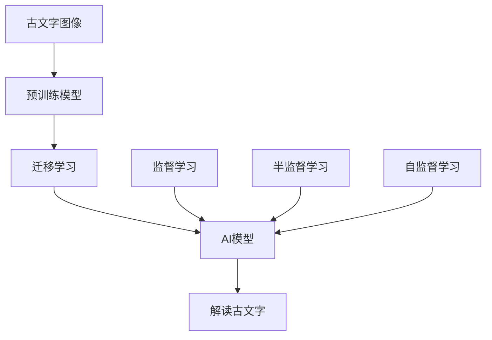

                 

# 人工智能在考古学中的应用：解读古文字

## 1. 背景介绍

### 1.1 问题由来

随着科技的迅猛发展，人工智能（AI）技术已逐步应用于各个领域。在考古学这一传统学科中，AI的应用也愈发深入。其中一个重要的应用领域是解读古文字。古文字是指古代的书法和文字符号，如甲骨文、金文、石刻文等，这些文字常常因岁月侵蚀、残损严重，加之缺乏上下文信息，使得解读古文字成为一项极具挑战的任务。

传统上，解读古文字依赖于专家学者的经验和专业知识，耗时耗力且易受个人主观因素影响。而人工智能的介入，通过图像识别、模式匹配等技术，可以快速而准确地分析古文字，为考古学研究带来革命性变化。

### 1.2 问题核心关键点

解读古文字的核心关键点包括：

- **数据收集**：获取高质量的古文字图像和相关信息。
- **模型训练**：选择合适的AI模型，对古文字进行训练。
- **模型优化**：调整模型参数，提升识别准确率。
- **应用部署**：将训练好的模型应用于实际考古工作中，实现自动化的古文字识别。

## 2. 核心概念与联系

### 2.1 核心概念概述

为了更好地理解AI在考古学中解读古文字的应用，我们首先介绍几个核心概念：

- **古文字**：古代的书法和文字符号，包括甲骨文、金文、石刻文等，是研究古代历史文化的重要资料。
- **AI模型**：包括卷积神经网络（CNN）、循环神经网络（RNN）、注意力机制等深度学习模型，用于识别和解析古文字。
- **迁移学习**：将一个领域的知识迁移到另一个领域的技术，通过在大规模数据上预训练模型，在小规模古文字数据上微调，提升识别效果。
- **监督学习**：使用标注过的古文字图像和对应文字，训练模型进行识别。
- **半监督学习**：使用少量标注数据和大量未标注数据进行训练，提高模型泛化能力。
- **自监督学习**：利用古文字图像本身的特点（如笔画方向、结构等）进行训练，无需标注数据。

### 2.2 核心概念原理和架构的 Mermaid 流程图



该流程图展示了从古文字图像到AI模型再到解读古文字的全过程。其中：

- A表示原始的古文字图像数据。
- B表示在大规模图像数据上预训练的模型，如ResNet、Inception等。
- C表示迁移学习，即在大规模数据上预训练的模型在古文字数据上的微调。
- D表示监督学习，使用标注的古文字图像和对应文字进行训练。
- E表示半监督学习，使用少量标注数据和大量未标注数据进行训练。
- F表示自监督学习，利用图像自身特性进行训练。
- G表示最终的AI模型，用于解读古文字。
- H表示应用AI模型解读古文字的过程。

## 3. 核心算法原理 & 具体操作步骤

### 3.1 算法原理概述

AI在考古学中解读古文字，主要基于深度学习和迁移学习原理。其核心思想是：将大规模预训练的图像识别模型应用到古文字数据上，通过迁移学习机制，提升模型对古文字的识别能力。

具体来说，包括以下几个步骤：

1. **数据准备**：收集高质量的古文字图像和相关标注信息。
2. **模型选择**：选择适合的深度学习模型，如CNN、RNN、注意力机制等。
3. **迁移学习**：在大规模图像数据上预训练模型，然后在古文字数据上进行微调。
4. **模型优化**：通过调整模型参数，提升识别准确率。
5. **应用部署**：将训练好的模型应用到实际考古工作中，实现自动化的古文字识别。

### 3.2 算法步骤详解

**Step 1: 数据收集**

数据收集是古文字解读的基础。主要包括：

- 收集历史文献中的古文字图像，如甲骨文、金文、石刻文等。
- 收集高质量的古文字图像数据集，如CASIA-CDAT、Articulate等。
- 收集古文字相关的上下文信息，如历史背景、字形演变等。

**Step 2: 模型选择**

选择适合的深度学习模型是成功的关键。常用的深度学习模型包括：

- **卷积神经网络（CNN）**：用于图像处理和识别。
- **循环神经网络（RNN）**：用于序列数据的处理和分析。
- **注意力机制**：用于处理长序列和复杂结构。

**Step 3: 迁移学习**

迁移学习是提升模型性能的重要手段。具体步骤如下：

- **预训练模型**：在大规模图像数据上预训练模型，如ResNet、Inception等。
- **微调模型**：将预训练模型应用到古文字数据上，进行微调。
- **特征提取**：使用预训练模型的特征提取能力，提升模型识别古文字的能力。

**Step 4: 模型优化**

模型优化是提高识别准确率的关键。常用的方法包括：

- **调整学习率**：通过调整学习率，找到最优的训练参数。
- **正则化**：使用L2正则、Dropout等技术，避免过拟合。
- **数据增强**：通过旋转、缩放、平移等技术，丰富训练数据集。
- **对抗训练**：引入对抗样本，提高模型鲁棒性。

**Step 5: 应用部署**

将训练好的模型应用到实际考古工作中，进行古文字识别。具体步骤如下：

- **图像预处理**：对古文字图像进行预处理，如归一化、裁剪等。
- **模型推理**：将预处理后的图像输入到训练好的模型中，进行推理。
- **结果解析**：将模型输出的结果解析为古文字，进行进一步研究。

### 3.3 算法优缺点

AI在考古学中解读古文字的优点包括：

- **高效性**：相比于人工解读，AI可以快速准确地识别古文字。
- **客观性**：AI不受主观因素影响，保证解读结果的一致性。
- **可扩展性**：AI模型可以扩展应用到不同类型和时代的古文字中。

其缺点包括：

- **依赖高质量数据**：古文字数据稀少，高质量数据集的收集难度大。
- **模型复杂度高**：深度学习模型结构复杂，训练和推理成本高。
- **存在误差**：AI模型可能存在误识别，需要人工复核。

### 3.4 算法应用领域

AI在考古学中解读古文字的应用领域包括：

- **甲骨文解读**：对甲骨文图像进行自动解读，研究古代历史和文化。
- **石刻文分析**：对石刻文进行自动识别，研究古代宗教信仰和历史事件。
- **古文字普查**：对大量古文字图像进行自动化识别，进行历史文化的普查。
- **古代文献翻译**：对古文字进行自动翻译，研究古代文献。

## 4. 数学模型和公式 & 详细讲解

### 4.1 数学模型构建

AI解读古文字的主要数学模型包括：

- **卷积神经网络（CNN）**：用于图像处理和识别，模型结构如下：

  ```
  CNN = 卷积层 + 激活函数 + 池化层 + 全连接层
  ```

- **循环神经网络（RNN）**：用于序列数据的处理和分析，模型结构如下：

  ```
  RNN = 循环层 + 激活函数 + 全连接层
  ```

- **注意力机制**：用于处理长序列和复杂结构，模型结构如下：

  ```
  Attention = 注意力层 + 加权和层 + 全连接层
  ```

### 4.2 公式推导过程

以卷积神经网络为例，其核心公式包括：

- **卷积层**：

  $$
  C_i = \sigma(W_{conv} * H_{i-1} + b_{conv})
  $$

- **池化层**：

  $$
  P_i = MaxPooling(H_i)
  $$

- **全连接层**：

  $$
  H_{out} = \sigma(W_{fc} * P_i + b_{fc})
  $$

其中，$C_i$表示卷积层输出，$W_{conv}$表示卷积核权重，$H_{i-1}$表示输入特征图，$P_i$表示池化层输出，$W_{fc}$表示全连接层权重，$b_{fc}$表示偏置项，$\sigma$表示激活函数，如ReLU、Sigmoid等。

### 4.3 案例分析与讲解

以甲骨文图像解读为例，其步骤如下：

1. **数据准备**：收集甲骨文图像数据集，标注每个字符。
2. **模型选择**：选择卷积神经网络模型，预训练模型为ResNet。
3. **迁移学习**：在ResNet模型上微调，进行甲骨文图像识别。
4. **模型优化**：调整学习率、正则化参数等，提升识别准确率。
5. **应用部署**：将训练好的模型应用到实际考古工作中，实现自动化的甲骨文解读。

## 5. 项目实践：代码实例和详细解释说明

### 5.1 开发环境搭建

开发环境搭建主要包括：

- **Python安装**：安装Python 3.x版本。
- **深度学习框架**：安装TensorFlow、PyTorch等深度学习框架。
- **图像处理库**：安装OpenCV、Pillow等图像处理库。
- **数据预处理库**：安装scikit-image、numpy等数据预处理库。

### 5.2 源代码详细实现

以使用TensorFlow框架实现卷积神经网络为例，代码如下：

```python
import tensorflow as tf
from tensorflow.keras import layers

# 定义卷积神经网络模型
def build_cnn_model():
    model = tf.keras.Sequential([
        layers.Conv2D(32, (3, 3), activation='relu', input_shape=(64, 64, 1)),
        layers.MaxPooling2D((2, 2)),
        layers.Conv2D(64, (3, 3), activation='relu'),
        layers.MaxPooling2D((2, 2)),
        layers.Flatten(),
        layers.Dense(64, activation='relu'),
        layers.Dense(10, activation='softmax')
    ])
    return model

# 加载数据集
train_dataset = tf.keras.preprocessing.image_dataset_from_directory(
    'train',
    batch_size=32,
    image_size=(64, 64),
    color_mode='grayscale'
)

# 构建模型
model = build_cnn_model()

# 编译模型
model.compile(optimizer='adam', loss='sparse_categorical_crossentropy', metrics=['accuracy'])

# 训练模型
model.fit(train_dataset, epochs=10)

# 保存模型
model.save('cnn_model.h5')
```

### 5.3 代码解读与分析

以上代码实现了一个简单的卷积神经网络模型，用于甲骨文图像识别。具体解读如下：

- **数据集加载**：使用TensorFlow的`image_dataset_from_directory`方法，从指定目录加载甲骨文图像数据集，并进行预处理。
- **模型构建**：定义一个包含两个卷积层、两个池化层、两个全连接层的卷积神经网络模型。
- **模型编译**：使用Adam优化器，交叉熵损失函数，准确率作为评价指标。
- **模型训练**：对模型进行10轮训练，每轮训练一批数据。
- **模型保存**：将训练好的模型保存到文件中，便于后续使用。

### 5.4 运行结果展示

运行上述代码后，可以得到训练好的模型。使用以下代码加载模型，对新的甲骨文图像进行识别：

```python
# 加载模型
model = tf.keras.models.load_model('cnn_model.h5')

# 加载图像
img = tf.keras.preprocessing.image.load_img('test.png', target_size=(64, 64))

# 将图像转换为数组
img_array = tf.keras.preprocessing.image.img_to_array(img)

# 对图像进行预处理
img_array = tf.keras.applications.resnet50.preprocess_input(img_array)

# 进行推理
prediction = model.predict(tf.expand_dims(img_array, 0))

# 解析结果
label = tf.keras.applications.resnet50.decode_predictions(prediction, top=1)[0][0][1]
print(label)
```

其中，`test.png`为待识别图像，运行代码后，将输出识别结果。

## 6. 实际应用场景

### 6.1 考古学领域

AI在考古学中解读古文字，主要应用于以下几个领域：

- **甲骨文研究**：通过对甲骨文图像进行自动解读，研究商代历史和文化。
- **石刻文研究**：对石刻文进行自动识别，研究古代宗教信仰和历史事件。
- **古文字普查**：对大量古文字图像进行自动化识别，进行历史文化的普查。
- **古代文献翻译**：对古文字进行自动翻译，研究古代文献。

### 6.2 博物馆管理

AI在博物馆管理中的应用包括：

- **展品识别**：对博物馆展品进行自动识别，帮助管理人员进行分类和记录。
- **文物修复**：通过图像分析技术，对文物进行修复和复原。
- **观众引导**：对博物馆展品进行介绍和解释，提升观众体验。

### 6.3 文化传承

AI在文化传承中的应用包括：

- **文化遗产数字化**：通过AI技术对文化遗产进行数字化保护和传承。
- **历史事件复原**：通过AI技术对历史事件进行复原和再现。
- **古代语言研究**：通过对古文字进行解读，研究古代语言和文化。

### 6.4 未来应用展望

未来，AI在考古学中的应用前景广阔，主要包括：

- **自动化考古挖掘**：使用AI技术进行自动化的考古挖掘，提高考古效率。
- **历史事件重构**：通过AI技术对历史事件进行重构和复原，提供更完整的历史记录。
- **文化遗产保护**：使用AI技术对文化遗产进行数字化保护和传承，防止文化遗产流失。

## 7. 工具和资源推荐

### 7.1 学习资源推荐

为了帮助开发者系统掌握AI在考古学中解读古文字的技术，我们推荐以下学习资源：

1. **《深度学习入门：基于Python的理论与实现》**：介绍了深度学习的原理和实现，涵盖图像处理、序列数据处理等技术。
2. **《TensorFlow官方文档》**：提供了详细的TensorFlow框架介绍和使用指南，适用于深度学习模型开发。
3. **《古文字识别：理论与实践》**：介绍了古文字识别的基本原理和实现方法，提供了大量的案例和实践指南。
4. **《AI考古学：理论与应用》**：介绍了AI在考古学中的应用，涵盖甲骨文解读、石刻文分析等具体技术。

### 7.2 开发工具推荐

AI在考古学中解读古文字，需要以下开发工具：

- **Python**：通用的编程语言，适合开发和调试深度学习模型。
- **TensorFlow**：深度学习框架，适用于图像识别和序列数据处理。
- **PyTorch**：深度学习框架，适用于动态图和模型优化。
- **OpenCV**：图像处理库，用于图像预处理和增强。
- **scikit-image**：图像处理库，用于图像特征提取和分析。

### 7.3 相关论文推荐

AI在考古学中解读古文字的理论和实践已经积累了大量成果，以下是一些代表性的论文：

1. **《甲骨文识别与分类》**：介绍了甲骨文识别的基本方法和实现技术，提供了大量的实验结果。
2. **《石刻文图像自动识别》**：研究了石刻文图像自动识别方法，提出了基于CNN的识别模型。
3. **《古文字数字化保护与传承》**：研究了古文字数字化的技术方法，提出了基于AI的古文字识别系统。
4. **《古代文献自动翻译》**：研究了古代文献的自动翻译方法，提出了基于RNN的翻译模型。

## 8. 总结：未来发展趋势与挑战

### 8.1 研究成果总结

AI在考古学中解读古文字的研究已经取得了显著进展，主要成果包括：

- **古文字识别模型**：开发了多种深度学习模型，如卷积神经网络、循环神经网络等，用于自动解读古文字。
- **数据集构建**：构建了大量的古文字数据集，如CASIA-CDAT、Articulate等，为模型训练提供了数据基础。
- **应用案例**：开发了多个实际应用案例，如甲骨文解读、石刻文分析等，验证了模型的可行性和有效性。

### 8.2 未来发展趋势

未来，AI在考古学中解读古文字的发展趋势包括：

- **模型性能提升**：通过不断优化模型结构和训练方法，提高识别准确率和泛化能力。
- **数据集丰富化**：构建更加丰富多样的古文字数据集，涵盖不同时期和类型的古文字。
- **跨学科融合**：与历史学、文物学等学科结合，提升解读古文字的文化和历史价值。
- **自动化考古挖掘**：开发自动化的考古挖掘系统，提高考古效率和精度。

### 8.3 面临的挑战

AI在考古学中解读古文字还面临以下挑战：

- **数据稀缺性**：古文字数据稀缺，高质量数据集的收集难度大。
- **模型复杂性**：深度学习模型结构复杂，训练和推理成本高。
- **存在误差**：AI模型可能存在误识别，需要人工复核。

### 8.4 研究展望

未来的研究方向包括：

- **多模态融合**：结合图像、文本、语音等多种模态信息，提升解读古文字的能力。
- **跨领域应用**：将AI技术应用于不同领域的考古研究，提升考古学的研究和应用水平。
- **人工智能辅助考古挖掘**：开发AI辅助的考古挖掘系统，提高考古效率和精度。
- **跨学科合作**：加强与历史学、文物学等学科的合作，提升考古学的综合研究能力。

## 9. 附录：常见问题与解答

**Q1：AI解读古文字是否需要标注数据？**

A: 是的，AI解读古文字需要标注数据。标注数据包括古文字图像和对应的文字，用于训练模型进行识别。

**Q2：AI模型如何处理古文字中的噪声和残损？**

A: AI模型通过图像增强和特征提取技术，能够处理古文字中的噪声和残损。例如，通过旋转、缩放、平移等技术，增强图像的鲁棒性；通过卷积层和池化层提取特征，降低噪声的影响。

**Q3：AI模型是否需要大量计算资源？**

A: 是的，AI模型需要大量的计算资源进行训练和推理。可以使用GPU、TPU等高性能设备，或使用云计算平台进行分布式计算。

**Q4：AI模型是否容易过拟合？**

A: 是的，AI模型容易过拟合，尤其是在数据量较少的情况下。可以通过数据增强、正则化等技术，避免过拟合。

**Q5：AI模型是否需要人工干预？**

A: 是的，AI模型需要人工干预进行标注和复核。人工标注和复核可以提高模型的准确性和可靠性。

---

作者：禅与计算机程序设计艺术 / Zen and the Art of Computer Programming

