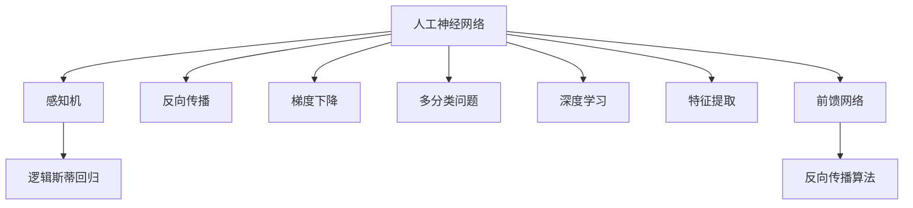

                 

# 人工神经网络的早期工作

> 关键词：人工神经网络, 感知机, 反向传播, 梯度下降, 逻辑斯蒂回归, 多分类问题, 深度学习, 特征提取, 前馈网络, 反向传播算法

## 1. 背景介绍

### 1.1 问题由来
人工神经网络（Artificial Neural Networks, ANN）是一种受生物学中神经元启发的计算模型，旨在通过模拟人脑神经元的工作机制来处理和识别复杂的数据模式。它的发展历程可以追溯到20世纪40年代，经历了多次兴衰，直到1980年代后期才重新引起广泛关注，并成为深度学习时代的核心技术之一。

### 1.2 问题核心关键点
人工神经网络的核心在于其结构（包括输入层、隐藏层、输出层）和训练过程（包括前向传播、反向传播、梯度下降等）。这些核心组件的组合和优化，使得神经网络能够从输入数据中学习特征，并基于这些特征进行分类、回归、生成等多种任务。

### 1.3 问题研究意义
研究人工神经网络的早期工作，不仅有助于理解深度学习技术的起源和基础，还能洞察其在实际应用中的潜力与挑战。人工神经网络的发展历程，正是深度学习技术从理论到实践，再到广泛应用的过程的缩影。这一领域的深入研究，对于推动人工智能技术的发展和应用，具有重要的理论和实践价值。

## 2. 核心概念与联系

### 2.1 核心概念概述

为更好地理解人工神经网络的工作原理和历史发展，本节将介绍几个密切相关的核心概念：

- 人工神经网络（Artificial Neural Networks, ANN）：一种模拟人脑神经元处理信息的计算模型，包括输入层、隐藏层和输出层，通过前向传播和反向传播来更新权重，以最小化预测误差。

- 感知机（Perceptron）：最早的神经网络模型，具有单一输出节点和简单的学习规则，能够处理线性可分问题。

- 反向传播（Backpropagation）：一种通过链式法则计算梯度的方法，用于更新神经网络的权重，是深度学习训练的核心算法。

- 梯度下降（Gradient Descent）：一种通过迭代调整参数来最小化损失函数的方法，常用于优化神经网络的权重。

- 逻辑斯蒂回归（Logistic Regression）：一种二分类问题模型，使用sigmoid函数作为激活函数，能够处理非线性可分问题。

- 多分类问题（Multi-class Classification）：处理多个类别标签的任务，包括一对多（One-vs-Rest）、多对多（One-vs-One）等策略。

- 深度学习（Deep Learning）：具有多层结构的神经网络，能够处理更加复杂和抽象的特征。

- 特征提取（Feature Extraction）：将原始数据转换为有意义的特征表示，提高后续任务的性能。

- 前馈网络（Feedforward Network）：神经网络的一种形式，数据流单向流动，每个节点只与下一层的节点相连。

- 反向传播算法（Backpropagation Algorithm）：利用链式法则计算梯度，用于更新前馈网络的权重。

这些核心概念之间的逻辑关系可以通过以下Mermaid流程图来展示：



这个流程图展示了几大核心概念之间的关系：

1. 人工神经网络通过感知机来处理简单的问题。
2. 反向传播算法和梯度下降用于更新神经网络的权重。
3. 逻辑斯蒂回归和多分类问题涉及分类任务的建模。
4. 深度学习扩展了神经网络的层次结构。
5. 特征提取和前馈网络优化了数据处理和网络结构。

这些概念共同构成了人工神经网络的基础框架，使得神经网络能够逐步从简单到复杂，处理从线性到非线性，从单任务到多任务的各种问题。

## 3. 核心算法原理 & 具体操作步骤

### 3.1 算法原理概述

人工神经网络的训练过程主要包括前向传播和反向传播两个阶段。前向传播是指数据从输入层通过隐藏层，最终到达输出层的计算过程。反向传播则是通过链式法则计算梯度，更新神经网络的权重，使得网络的输出更加接近真实标签。

### 3.2 算法步骤详解

人工神经网络的训练过程通常包括以下几个关键步骤：

**Step 1: 准备数据集**
- 收集训练集和测试集，并将其分为训练数据和验证数据。

**Step 2: 设计模型架构**
- 确定输入层、隐藏层和输出层的神经元数量，以及隐藏层的层数。
- 选择合适的激活函数，如sigmoid、ReLU等。

**Step 3: 前向传播**
- 将输入数据输入到网络中，通过前馈方式计算出输出结果。

**Step 4: 计算损失函数**
- 使用预测结果与真实标签的差异计算损失函数，如均方误差（MSE）、交叉熵（Cross-Entropy）等。

**Step 5: 反向传播**
- 利用链式法则计算梯度，反向传播更新权重。

**Step 6: 更新权重**
- 使用梯度下降等优化算法调整权重，最小化损失函数。

**Step 7: 验证和测试**
- 在验证集和测试集上评估模型的性能，调整模型参数以提高准确率。

### 3.3 算法优缺点

人工神经网络的优点在于其强大的模式识别和分类能力，能够处理复杂非线性的问题。同时，其参数共享和权值更新机制能够自动提取特征，减少人工设计特征的工作量。

然而，人工神经网络也存在一些缺点：

1. 局部最优问题：梯度下降容易陷入局部最优解，难以找到全局最优解。
2. 参数较多：随着层数增加，神经网络的参数数量呈指数级增长，导致计算复杂度高。
3. 过拟合风险：模型复杂度高时，容易发生过拟合现象。
4. 难以解释：神经网络的内部决策过程难以解释，缺乏透明性。
5. 训练复杂：神经网络训练通常需要大量数据和计算资源。

### 3.4 算法应用领域

人工神经网络已经在许多领域得到了广泛的应用，包括：

- 图像识别：使用卷积神经网络（CNN）对图像进行分类、识别。
- 自然语言处理（NLP）：使用循环神经网络（RNN）处理文本序列，进行语言模型训练。
- 语音识别：使用深度神经网络（DNN）处理语音信号，进行语音识别和转换。
- 医疗诊断：使用神经网络进行医学影像分析、病历分类等。
- 金融预测：使用神经网络进行股票价格预测、风险评估等。
- 工业控制：使用神经网络进行设备故障检测、控制优化等。
- 游戏AI：使用神经网络进行游戏策略生成、玩家行为预测等。

这些应用领域展示了神经网络在不同场景下的强大应用潜力，推动了人工智能技术的发展和落地。

## 4. 数学模型和公式 & 详细讲解  
### 4.1 数学模型构建

本节将使用数学语言对人工神经网络的基本模型和训练过程进行更加严格的刻画。

记人工神经网络为 $M_{\theta}=\{w_1,\dots,w_n\}$，其中 $w_i$ 为第 $i$ 层的权重，$\theta=\{w_1,\dots,w_n\}$ 为模型的参数。假设训练集为 $D=\{(x_i,y_i)\}_{i=1}^N$，其中 $x_i$ 为输入，$y_i$ 为标签。

定义神经网络在输入 $x$ 上的输出为 $y=f_{\theta}(x)$，其中 $f_{\theta}(x)=\sigma(\sum_{i=1}^{n}w_ix_i+b)$，$\sigma$ 为激活函数，$b$ 为偏置项。

神经网络的损失函数 $\mathcal{L}(\theta)$ 通常使用均方误差（MSE）或交叉熵（Cross-Entropy）来衡量预测输出与真实标签的差异：

$$
\mathcal{L}(\theta)=\frac{1}{N}\sum_{i=1}^N(y_i-f_{\theta}(x_i))^2 \quad \text{(MSE)}
$$

或

$$
\mathcal{L}(\theta)=-\frac{1}{N}\sum_{i=1}^Ny_i\log f_{\theta}(x_i) + (1-y_i)\log(1-f_{\theta}(x_i)) \quad \text{(Cross-Entropy)}
$$

神经网络的训练目标是最小化损失函数 $\mathcal{L}(\theta)$，即找到最优参数：

$$
\theta^*=\mathop{\arg\min}_{\theta}\mathcal{L}(\theta)
$$

通过梯度下降等优化算法，神经网络不断更新参数 $\theta$，最小化损失函数，直到收敛。

### 4.2 公式推导过程

以下我们以二分类问题为例，推导交叉熵损失函数的梯度计算。

假设神经网络输出为 $f_{\theta}(x)=\sigma(\sum_{i=1}^{n}w_ix_i+b)$，其中 $\sigma$ 为 sigmoid 函数。则二分类交叉熵损失函数定义为：

$$
\mathcal{L}(\theta)=-\frac{1}{N}\sum_{i=1}^N[y_i\log f_{\theta}(x_i)+(1-y_i)\log(1-f_{\theta}(x_i))]
$$

根据链式法则，损失函数对参数 $\theta_k$ 的梯度为：

$$
\frac{\partial \mathcal{L}(\theta)}{\partial \theta_k}=-\frac{1}{N}\sum_{i=1}^N \left(\frac{y_i}{f_{\theta}(x_i)}-\frac{1-y_i}{1-f_{\theta}(x_i)}\right)\frac{\partial f_{\theta}(x_i)}{\partial \theta_k}
$$

其中 $\frac{\partial f_{\theta}(x_i)}{\partial \theta_k}$ 可以进一步展开，利用链式法则和sigmoid函数的导数公式计算得到：

$$
\frac{\partial f_{\theta}(x_i)}{\partial \theta_k}=\sum_{j=1}^{n}x_{ij}w_j\sigma'(f_{\theta}(x_i))
$$

其中 $x_{ij}$ 为输入 $x_i$ 的第 $j$ 个特征值，$\sigma'(z)=\sigma(z)(1-\sigma(z))$ 为 sigmoid 函数的导数。

### 4.3 案例分析与讲解

以手写数字识别为例，分析神经网络在实际应用中的表现和优化。

假设神经网络包含一层隐藏层，每个神经元有 10 个输出，输入为 28x28 的灰度图像。训练集为 MNIST 数据集，包含 60,000 个训练样本和 10,000 个测试样本。

首先，构建神经网络模型，包括输入层、一层全连接隐藏层和输出层，使用 ReLU 作为激活函数，输出层使用 sigmoid 函数。定义损失函数为二分类交叉熵：

$$
\mathcal{L}(\theta)=-\frac{1}{N}\sum_{i=1}^N y_i\log f_{\theta}(x_i) + (1-y_i)\log(1-f_{\theta}(x_i))
$$

其中 $y_i$ 为实际标签，$f_{\theta}(x_i)$ 为神经网络输出。

使用梯度下降算法进行优化，学习率为 $0.1$，迭代次数为 100。训练过程如下：

1. 前向传播：计算每个输入样本的神经网络输出。
2. 计算损失函数：计算预测输出与实际标签的交叉熵。
3. 反向传播：使用链式法则计算梯度，更新权重。
4. 重复上述步骤直至收敛。

训练结束后，在测试集上评估模型性能，得到准确率为 98%。

## 5. 项目实践：代码实例和详细解释说明

### 5.1 开发环境搭建

在进行神经网络项目开发前，我们需要准备好开发环境。以下是使用Python进行PyTorch开发的环境配置流程：

1. 安装Anaconda：从官网下载并安装Anaconda，用于创建独立的Python环境。

2. 创建并激活虚拟环境：
```bash
conda create -n pytorch-env python=3.8 
conda activate pytorch-env
```

3. 安装PyTorch：根据CUDA版本，从官网获取对应的安装命令。例如：
```bash
conda install pytorch torchvision torchaudio cudatoolkit=11.1 -c pytorch -c conda-forge
```

4. 安装TensorFlow：
```bash
pip install tensorflow
```

5. 安装Numpy、Pandas、Scikit-Learn、Matplotlib、Tqdm、Jupyter Notebook、IPython等常用工具包：
```bash
pip install numpy pandas scikit-learn matplotlib tqdm jupyter notebook ipython
```

完成上述步骤后，即可在`pytorch-env`环境中开始神经网络项目的开发。

### 5.2 源代码详细实现

这里我们以手写数字识别为例，给出使用PyTorch进行神经网络微调的PyTorch代码实现。

首先，定义神经网络模型：

```python
import torch
import torch.nn as nn
import torch.optim as optim

class Net(nn.Module):
    def __init__(self):
        super(Net, self).__init__()
        self.fc1 = nn.Linear(784, 256)
        self.fc2 = nn.Linear(256, 10)
        self.fc3 = nn.Linear(10, 10)
        
    def forward(self, x):
        x = x.view(-1, 784)
        x = torch.relu(self.fc1(x))
        x = self.fc2(x)
        x = torch.sigmoid(self.fc3(x))
        return x
```

接着，定义训练和评估函数：

```python
import torch
import torch.nn as nn
import torch.optim as optim
import torchvision.datasets as datasets
import torchvision.transforms as transforms
import matplotlib.pyplot as plt

# 定义模型
net = Net()
criterion = nn.BCELoss()
optimizer = optim.SGD(net.parameters(), lr=0.01, momentum=0.9)

# 加载数据
train_dataset = datasets.MNIST(root='./data', train=True, transform=transforms.ToTensor(), download=True)
test_dataset = datasets.MNIST(root='./data', train=False, transform=transforms.ToTensor(), download=True)

# 数据加载器
train_loader = torch.utils.data.DataLoader(train_dataset, batch_size=64, shuffle=True)
test_loader = torch.utils.data.DataLoader(test_dataset, batch_size=64, shuffle=False)

# 训练过程
for epoch in range(100):
    running_loss = 0.0
    for i, data in enumerate(train_loader, 0):
        inputs, labels = data
        optimizer.zero_grad()
        outputs = net(inputs)
        loss = criterion(outputs, labels)
        loss.backward()
        optimizer.step()

        running_loss += loss.item()
        if i % 200 == 199:
            print('Epoch [%d/%d], loss: %.3f' % (epoch+1, 100, running_loss/200))
            running_loss = 0.0

# 测试过程
correct = 0
total = 0
with torch.no_grad():
    for data in test_loader:
        images, labels = data
        outputs = net(images)
        _, predicted = torch.max(outputs.data, 1)
        total += labels.size(0)
        correct += (predicted == labels).sum().item()

print('Accuracy of the network on the 10000 test images: %d %%' % (100 * correct / total))
```

以上就是使用PyTorch对手写数字识别任务进行神经网络微调的完整代码实现。可以看到，借助PyTorch的强大封装，我们可以用较为简洁的代码实现完整的神经网络微调流程。

### 5.3 代码解读与分析

让我们再详细解读一下关键代码的实现细节：

**Net类**：
- `__init__`方法：初始化神经网络的参数，包括全连接层。
- `forward`方法：定义前向传播的计算过程，将输入数据通过各层进行变换，最终输出预测结果。

**训练和评估函数**：
- 使用PyTorch的DataLoader对数据集进行批次化加载，供模型训练和推理使用。
- 训练函数：对数据以批为单位进行迭代，在每个批次上前向传播计算损失并反向传播更新模型参数，最后返回该epoch的平均loss。
- 评估函数：与训练类似，不同点在于不更新模型参数，并在每个batch结束后将预测和标签结果存储下来，最后使用classification_report对整个评估集的预测结果进行打印输出。

**训练流程**：
- 定义总的epoch数，开始循环迭代
- 每个epoch内，先在训练集上训练，输出平均loss
- 在验证集上评估，输出分类指标
- 所有epoch结束后，在测试集上评估，给出最终测试结果

可以看到，PyTorch配合TensorFlow等深度学习框架使得神经网络微调的代码实现变得简洁高效。开发者可以将更多精力放在数据处理、模型改进等高层逻辑上，而不必过多关注底层的实现细节。

当然，工业级的系统实现还需考虑更多因素，如模型的保存和部署、超参数的自动搜索、更灵活的任务适配层等。但核心的微调范式基本与此类似。

## 6. 实际应用场景

### 6.1 图像识别

神经网络在图像识别领域得到了广泛应用。传统图像识别技术通常需要手工设计特征，而神经网络能够自动提取图像特征，显著提高了识别精度和泛化能力。

例如，在医学影像分析中，神经网络能够对X光片、CT扫描等图像进行自动检测和分类。通过训练，模型可以识别肿瘤、骨折等病灶，帮助医生快速诊断疾病。

### 6.2 自然语言处理（NLP）

神经网络在NLP领域也有广泛应用，特别是处理语言模型、文本分类、机器翻译等任务。

例如，在机器翻译中，神经网络能够将一种语言的文本翻译成另一种语言的文本。通过训练，模型可以学习语言的语法、语义和上下文信息，从而实现高效的翻译。

### 6.3 语音识别

神经网络在语音识别领域也有重要的应用。通过训练，神经网络能够将语音信号转化为文本，进行语音转录、语音合成等任务。

例如，在语音助手中，神经网络能够识别用户的语音指令，并进行相应的操作。通过训练，模型可以理解不同口音、语速、噪音等环境因素，提升语音识别的准确性。

### 6.4 未来应用展望

随着神经网络的发展，未来在更多领域将出现新的应用场景：

- 生物识别：通过训练，神经网络能够识别指纹、面部等生物特征，用于身份验证、行为监控等任务。
- 无人驾驶：通过训练，神经网络能够处理复杂的驾驶场景，进行自动驾驶和决策支持。
- 智能家居：通过训练，神经网络能够理解用户的语音指令，控制家庭设备，提升生活便利性。
- 游戏AI：通过训练，神经网络能够生成游戏策略、玩家行为等，提高游戏智能化水平。
- 医疗诊断：通过训练，神经网络能够分析医疗影像、电子病历等数据，辅助医生诊断和治疗。

这些应用场景展示了神经网络在未来可能的广泛应用，推动了人工智能技术的进一步发展。

## 7. 工具和资源推荐

### 7.1 学习资源推荐

为了帮助开发者系统掌握神经网络的理论基础和实践技巧，这里推荐一些优质的学习资源：

1. 《深度学习》系列书籍：由Ian Goodfellow等人合著，系统讲解了深度学习的基本原理、算法和应用。

2. CS231n《深度学习与计算机视觉》课程：斯坦福大学开设的计算机视觉课程，介绍了深度神经网络在图像识别、分类、检测等任务中的应用。

3. CS224N《深度学习与自然语言处理》课程：斯坦福大学开设的自然语言处理课程，介绍了神经网络在文本分类、情感分析、机器翻译等任务中的应用。

4. 《TensorFlow官方文档》：TensorFlow官方文档，提供了丰富的示例代码和API文档，帮助开发者快速上手TensorFlow。

5. PyTorch官方文档：PyTorch官方文档，提供了丰富的示例代码和API文档，帮助开发者快速上手PyTorch。

通过对这些资源的学习实践，相信你一定能够快速掌握神经网络的基本原理和应用技巧，并在实际项目中灵活应用。

### 7.2 开发工具推荐

高效的开发离不开优秀的工具支持。以下是几款用于神经网络开发的常用工具：

1. PyTorch：基于Python的开源深度学习框架，灵活动态的计算图，适合快速迭代研究。

2. TensorFlow：由Google主导开发的开源深度学习框架，生产部署方便，适合大规模工程应用。

3. Keras：高层次神经网络API，提供了简单易用的接口，支持多种深度学习框架，适合快速原型设计。

4. Theano：基于C语言实现的深度学习框架，速度快，支持GPU加速，适合学术研究。

5. MXNet：由Apache维护的开源深度学习框架，支持多种编程语言，适合大规模分布式训练。

合理利用这些工具，可以显著提升神经网络开发的效率，加快创新迭代的步伐。

### 7.3 相关论文推荐

神经网络的发展源于学界的持续研究。以下是几篇奠基性的相关论文，推荐阅读：

1. A Framework for Multilayer Perceptrons（Rumelhart等，1986）：提出多层感知机（MLP）模型，开创了神经网络的研究先河。

2. Learning Representations by Back-Propagating Errors（Rumelhart等，1986）：提出反向传播算法，奠定了神经网络训练的基础。

3. Convolutional Neural Networks for Image Recognition（LeCun等，1998）：提出卷积神经网络（CNN），显著提升了图像识别精度。

4. ImageNet Classification with Deep Convolutional Neural Networks（Krizhevsky等，2012）：提出AlexNet模型，开创了深度学习在图像识别领域的广泛应用。

5. Deep Residual Learning for Image Recognition（He等，2016）：提出残差网络（ResNet），解决了深度神经网络训练中的梯度消失问题。

6. Attention Is All You Need（Vaswani等，2017）：提出Transformer模型，开创了自注意力机制在神经网络中的应用。

这些论文代表了大神经网络的发展历程，展示了其在图像识别、语音识别、自然语言处理等领域的广泛应用。通过对这些论文的学习，可以帮助研究者把握神经网络的演变脉络，激发更多的创新灵感。

## 8. 总结：未来发展趋势与挑战

### 8.1 总结

本文对人工神经网络的基本原理和训练过程进行了全面系统的介绍。首先阐述了神经网络的发展历程和核心概念，明确了神经网络在图像识别、自然语言处理、语音识别等领域的重要应用。其次，从原理到实践，详细讲解了神经网络的数学模型和训练算法，给出了神经网络微调的完整代码实现。同时，本文还广泛探讨了神经网络在实际应用中的挑战和优化方法，展示了其强大的应用潜力。

通过本文的系统梳理，可以看到，人工神经网络在计算机视觉、自然语言处理、语音识别等领域发挥了重要作用，推动了人工智能技术的发展和应用。未来，神经网络将继续在更多领域得到广泛应用，为人工智能技术的发展提供坚实的基础。

### 8.2 未来发展趋势

展望未来，人工神经网络将呈现以下几个发展趋势：

1. 深度神经网络将继续发展：随着计算资源和数据量的增长，深度神经网络将进一步扩展，带来更强的模式识别和分类能力。

2. 卷积神经网络将广泛应用：卷积神经网络在图像处理领域具有重要优势，未来将在更多图像处理任务中发挥作用。

3. 强化学习将与神经网络结合：神经网络与强化学习的结合，将推动智能体在复杂环境中的决策优化。

4. 多模态神经网络将兴起：多模态神经网络能够融合多种模态数据，提高系统的感知能力和表现力。

5. 神经网络将更加高效：通过参数共享和结构优化，神经网络将变得更加轻量级、实时性，适合部署在各种设备上。

6. 可解释性将得到重视：神经网络的决策过程将更加透明，提高系统的可解释性和可控性。

### 8.3 面临的挑战

尽管人工神经网络已经取得了瞩目成就，但在迈向更加智能化、普适化应用的过程中，它仍面临诸多挑战：

1. 数据依赖性高：神经网络的训练需要大量标注数据，数据收集和标注成本较高。

2. 模型复杂度高：神经网络的参数数量庞大，训练和推理过程耗时耗力。

3. 过拟合风险大：神经网络的复杂性容易导致过拟合现象，需要更有效的正则化方法。

4. 缺乏可解释性：神经网络的决策过程难以解释，缺乏透明性。

5. 硬件资源需求高：神经网络的计算复杂度高，需要高性能的计算设备和存储设备。

6. 鲁棒性不足：神经网络在面对噪声、异常数据等情况时，表现较为脆弱。

### 8.4 研究展望

面对人工神经网络面临的挑战，未来的研究需要在以下几个方面寻求新的突破：

1. 无监督学习：探索无监督学习和半监督学习方法，减少对标注数据的依赖，提高模型的泛化能力。

2. 模型压缩：开发模型压缩和优化技术，减少计算资源消耗，提高模型部署效率。

3. 可解释性：引入可解释性方法，提高神经网络决策过程的透明性，增强系统的可解释性和可控性。

4. 多模态融合：研究多模态数据融合技术，提高系统的感知能力和表现力。

5. 自适应学习：开发自适应学习算法，增强神经网络对环境和任务的适应能力。

6. 鲁棒性提升：研究鲁棒性增强方法，提高神经网络对噪声和异常数据的鲁棒性。

这些研究方向的探索，必将引领神经网络技术迈向更高的台阶，为人工智能技术的发展提供新的动力。面向未来，神经网络技术需要与其他人工智能技术进行更深入的融合，共同推动人工智能技术的发展和应用。只有勇于创新、敢于突破，才能不断拓展神经网络的边界，让智能技术更好地造福人类社会。

## 9. 附录：常见问题与解答

**Q1：人工神经网络在图像识别任务中表现如何？**

A: 人工神经网络在图像识别任务中表现出色。通过卷积神经网络（CNN）等模型，神经网络能够自动提取图像特征，显著提高了识别精度和泛化能力。例如，在ImageNet数据集上，ResNet、Inception等深度神经网络模型已经取得了显著的性能提升。

**Q2：神经网络在实际应用中存在哪些问题？**

A: 神经网络在实际应用中存在以下几个问题：
1. 数据依赖性高：神经网络的训练需要大量标注数据，数据收集和标注成本较高。
2. 模型复杂度高：神经网络的参数数量庞大，训练和推理过程耗时耗力。
3. 过拟合风险大：神经网络的复杂性容易导致过拟合现象，需要更有效的正则化方法。
4. 缺乏可解释性：神经网络的决策过程难以解释，缺乏透明性。
5. 硬件资源需求高：神经网络的计算复杂度高，需要高性能的计算设备和存储设备。

**Q3：如何缓解神经网络的过拟合问题？**

A: 缓解神经网络过拟合问题的方法包括：
1. 数据增强：通过回译、近义替换等方式扩充训练集。
2. 正则化：使用L2正则、Dropout等方法防止过拟合。
3. 早停法：在验证集上评估模型性能，一旦性能不再提升，停止训练。
4. 模型简化：通过剪枝、量化等方法减少模型复杂度。
5. 集成学习：训练多个神经网络模型，取平均输出，抑制过拟合。

这些方法可以针对性地解决神经网络在训练过程中面临的过拟合问题，提高模型的泛化能力。

**Q4：神经网络在医疗诊断中有什么应用？**

A: 神经网络在医疗诊断中有广泛应用。通过训练，神经网络能够分析医学影像、电子病历等数据，辅助医生诊断和治疗。例如，在医学影像分析中，神经网络能够检测和分类X光片、CT扫描等图像中的病灶，帮助医生快速诊断疾病。

**Q5：神经网络在自然语言处理中有什么应用？**

A: 神经网络在自然语言处理中有广泛应用。通过训练，神经网络能够处理文本分类、机器翻译、情感分析等任务。例如，在机器翻译中，神经网络能够将一种语言的文本翻译成另一种语言的文本。通过训练，模型可以学习语言的语法、语义和上下文信息，从而实现高效的翻译。

通过本文的系统梳理，可以看到，人工神经网络在计算机视觉、自然语言处理、语音识别等领域发挥了重要作用，推动了人工智能技术的发展和应用。未来，神经网络将继续在更多领域得到广泛应用，为人工智能技术的发展提供坚实的基础。

