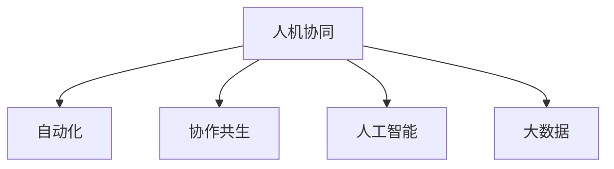

                 

# 人机协同：未来工作的核心驱动力

> 关键词：人机协同,未来工作,人工智能,自动化,协作共生,机器学习,大数据,数据驱动

## 1. 背景介绍

### 1.1 问题由来
随着人工智能技术的飞速发展，人机协同已成为未来工作的核心驱动力。在自动化技术日益普及的今天，机器和人类如何更好地协作，不仅关乎生产效率的提升，更是对社会生产力的一次重塑。传统的自动化模式大多是人机分离的，而人机协同则强调融合，让机器在数据分析、决策辅助、创意生成等方面发挥更大的作用，提升人的工作质量和效率，实现双赢局面。

### 1.2 问题核心关键点
当前，人机协同在各行各业的应用正处于快速发展阶段，尤其在制造业、医疗、教育、金融等领域展现出了巨大的潜力。其核心关键点在于：

- **数据驱动**：利用大数据和机器学习技术，让机器自主学习并提取有价值的信息，支持决策和推荐。
- **自动化与人类**：在自动化的基础上，融合人类的经验和智慧，实现更精准的决策和优化。
- **协作共生**：通过协作共生的方式，让人和机器能够互补优势，共同完成任务。

### 1.3 问题研究意义
研究人机协同的算法和技术，对提升企业的生产力和效率，改善人类的工作和生活质量，乃至对整个社会的可持续发展具有重要意义：

1. **生产效率的提升**：通过人机协同，可以大幅提升工作流程的效率，减少人为错误，提高生产质量和速度。
2. **决策支持的增强**：机器能够处理海量数据，辅助人类做出更为准确和快速的决策。
3. **创造力的激发**：人类在机器的帮助下，可以专注于更有创造性的任务，提升工作满意度。
4. **社会结构的优化**：人机协同能够重塑社会生产关系，提升社会整体的生产力水平。
5. **产业的升级**：通过智能化、信息化技术改造传统产业，推动数字化转型升级。

## 2. 核心概念与联系

### 2.1 核心概念概述

为了更好地理解人机协同的核心概念，本节将介绍几个关键概念及其相互关系：

- **人机协同(Human-Machine Collaboration)**：通过智能化系统辅助人类完成任务，提升工作效率和质量的过程。
- **自动化(Automaticization)**：指使用机器替代人类完成重复性、机械性的工作。
- **协作共生(Cooperation and Coexistence)**：机器与人类的互补合作，实现1+1>2的效果。
- **人工智能(Artificial Intelligence)**：通过机器学习、数据挖掘等技术，赋予机器类似于人类的智能和决策能力。
- **大数据(Big Data)**：指从各种数据源收集的海量数据，为机器学习和人机协同提供数据基础。

这些概念之间的关系可以通过以下Mermaid流程图来展示：



这个流程图展示了人机协同的各个组成部分，它们相互依赖、相互促进，共同构成了一个完整的人机协同系统。

## 3. 核心算法原理 & 具体操作步骤
### 3.1 算法原理概述

人机协同的核心算法原理在于将大数据和人工智能技术与人类工作流程相结合，通过自动化和协作共生，提升生产力和工作质量。

在实际操作中，人机协同算法一般分为以下几个步骤：

1. **数据收集与预处理**：从各种数据源收集相关数据，并进行清洗、整理，准备输入到模型中。
2. **模型训练与优化**：使用机器学习算法对数据进行训练，得到能够支持决策和推荐的高效模型。
3. **自动化流程设计**：根据具体任务需求，设计自动化的工作流程，并集成到现有的业务系统中。
4. **协作共生实现**：在自动化流程中，通过接口、消息队列等方式，实现人机之间的数据交换和协作。
5. **性能评估与反馈优化**：定期评估协同效果，根据反馈进行模型和流程的优化。

### 3.2 算法步骤详解

以下将详细讲解人机协同算法的各个步骤。

**Step 1: 数据收集与预处理**
- 确定需要收集的数据源，如ERP系统、CRM系统、物联网设备等。
- 使用ETL工具（如Apache Nifi、Talend等）进行数据抽取、转换、加载。
- 清洗和预处理数据，去除噪声和异常值，确保数据质量。

**Step 2: 模型训练与优化**
- 选择合适的机器学习算法，如回归、分类、聚类等。
- 利用历史数据进行模型训练，并进行交叉验证和调参。
- 使用超参数优化算法（如网格搜索、贝叶斯优化等）进行模型选择和优化。
- 评估模型的性能指标（如准确率、召回率、F1-score等），选择最优模型。

**Step 3: 自动化流程设计**
- 根据任务需求，设计自动化的工作流程，明确输入和输出。
- 利用脚本语言（如Python、Java等）实现自动化逻辑。
- 集成到现有的业务系统（如ERP、CRM、ERP等）中，实现无缝对接。
- 设计必要的接口和消息队列，实现人机数据交换。

**Step 4: 协作共生实现**
- 在自动化流程中，设计人机协作的界面和交互方式，如自然语言处理、语音识别等。
- 实现机器对人工输入的快速响应和处理，反馈决策结果和建议。
- 根据业务需求，设计并实现协同工作模式，如并行处理、串行处理等。

**Step 5: 性能评估与反馈优化**
- 定期收集协同效果的数据，如任务完成时间、错误率、用户满意度等。
- 根据评估结果，进行模型和流程的优化，如参数调整、流程再设计等。
- 引入反馈机制，如用户反馈、系统日志等，不断提升协同效果。

### 3.3 算法优缺点

人机协同算法具有以下优点：
1. 大幅提升生产力和效率，减少人为错误。
2. 数据驱动的决策支持，提高决策质量。
3. 协作共生，发挥人类和机器各自的优点，提升工作体验。

同时，该算法也存在以下缺点：
1. 数据质量和数据源的多样性问题，影响模型效果。
2. 自动化流程的设计和实现较为复杂，需要专业知识和经验。
3. 协作共生的实现需要设计合理的交互界面和机制。
4. 持续优化和调整，需要投入大量的人力和资源。

尽管存在这些局限性，但就目前而言，人机协同算法仍是最主流和最有效的协同方式。未来相关研究的重点在于如何进一步简化流程设计，提升协作共生的智能水平，同时兼顾可解释性和伦理安全性等因素。

### 3.4 算法应用领域

人机协同算法已在多个领域得到了广泛应用，如制造业、医疗、金融、教育等。具体而言：

- **制造业**：利用机器人和自动化设备，进行物流、制造等生产流程的自动化处理，提升生产效率和质量。
- **医疗**：利用智能诊断系统，辅助医生进行疾病诊断和治疗方案推荐，提升医疗服务的质量和效率。
- **金融**：利用大数据分析和机器学习技术，进行风险评估和投资建议，提升金融决策的准确性和效率。
- **教育**：利用智能教学系统，进行个性化推荐和作业批改，提升教学质量和学生学习体验。
- **零售**：利用自动化系统和推荐算法，进行库存管理、客户推荐等，提升零售业务效率和客户满意度。

除了上述这些经典应用外，人机协同技术还被创新性地应用到更多场景中，如智能客服、智能家居、智能交通等，为各行各业带来变革性影响。随着技术的日益成熟，人机协同将逐步渗透到更多领域，为社会生产力的提升和经济数字化转型提供新动力。

## 4. 数学模型和公式 & 详细讲解  
### 4.1 数学模型构建

本节将使用数学语言对人机协同算法的各个步骤进行更加严格的刻画。

假设人机协同任务为 $T$，涉及的数据集为 $D=\{(x_i,y_i)\}_{i=1}^N$，其中 $x_i$ 为输入特征，$y_i$ 为标签。

定义人机协同算法 $A$，其输入为 $x_i$，输出为 $y_i$。则人机协同过程可以表示为：

$$
y_i = A(x_i)
$$

其中 $A$ 包括数据收集、预处理、模型训练、自动化流程设计、协作共生实现和性能评估等步骤。

### 4.2 公式推导过程

以下我们以回归任务为例，推导人机协同算法的数学模型。

假设回归任务的输入 $x$ 包含 $m$ 个特征，回归目标为 $y$。人机协同过程可以表示为：

$$
y = f(x) + \epsilon
$$

其中 $f(x)$ 为回归模型，$\epsilon$ 为噪声。

在实践中，回归模型的训练一般通过最小化均方误差（Mean Squared Error, MSE）来进行。其优化目标为：

$$
\min_{f} \frac{1}{N}\sum_{i=1}^N (y_i - f(x_i))^2
$$

使用梯度下降等优化算法，求解上述优化问题，即可得到回归模型 $f(x)$。

在得到回归模型后，将其应用于自动化流程中，根据具体业务需求，设计自动化任务流程，并通过接口实现人机数据交换。最后，通过定期评估协同效果，不断优化模型和流程，提升人机协同的效率和质量。

## 5. 项目实践：代码实例和详细解释说明
### 5.1 开发环境搭建

在进行人机协同算法开发前，我们需要准备好开发环境。以下是使用Python进行PyTorch开发的环境配置流程：

1. 安装Anaconda：从官网下载并安装Anaconda，用于创建独立的Python环境。

2. 创建并激活虚拟环境：
```bash
conda create -n pytorch-env python=3.8 
conda activate pytorch-env
```

3. 安装PyTorch：根据CUDA版本，从官网获取对应的安装命令。例如：
```bash
conda install pytorch torchvision torchaudio cudatoolkit=11.1 -c pytorch -c conda-forge
```

4. 安装TensorFlow：由Google主导开发的开源深度学习框架，生产部署方便，适合大规模工程应用。同样有丰富的预训练语言模型资源。

5. 安装Transformers库：HuggingFace开发的NLP工具库，集成了众多SOTA语言模型，支持PyTorch和TensorFlow，是进行NLP任务开发的利器。

6. 安装各类工具包：
```bash
pip install numpy pandas scikit-learn matplotlib tqdm jupyter notebook ipython
```

完成上述步骤后，即可在`pytorch-env`环境中开始人机协同算法开发。

### 5.2 源代码详细实现

这里我们以制造业的智能生产流程为例，给出使用PyTorch进行人机协同的PyTorch代码实现。

首先，定义回归任务的数据处理函数：

```python
import pandas as pd
from sklearn.model_selection import train_test_split
from sklearn.preprocessing import StandardScaler
from torch.utils.data import Dataset, DataLoader
import torch
import torch.nn as nn
import torch.optim as optim

class RegressionDataset(Dataset):
    def __init__(self, data, target, scaler):
        self.data = data
        self.target = target
        self.scaler = scaler
    
    def __len__(self):
        return len(self.data)
    
    def __getitem__(self, idx):
        x = self.data.iloc[idx].values
        y = self.target.iloc[idx]
        return x, y

# 加载数据集
data = pd.read_csv('data.csv')
target = data['target']
X = data.drop('target', axis=1)

# 数据标准化
scaler = StandardScaler()
X = scaler.fit_transform(X)
target = scaler.transform(target.reshape(-1, 1))

# 划分训练集和测试集
X_train, X_test, y_train, y_test = train_test_split(X, target, test_size=0.2, random_state=42)

# 创建数据集
train_dataset = RegressionDataset(X_train, y_train, scaler)
test_dataset = RegressionDataset(X_test, y_test, scaler)

# 定义模型
model = nn.Sequential(
    nn.Linear(5, 10),
    nn.ReLU(),
    nn.Linear(10, 1)
)

# 定义损失函数和优化器
criterion = nn.MSELoss()
optimizer = optim.Adam(model.parameters(), lr=0.001)

# 定义训练和评估函数
def train_epoch(model, dataset, batch_size, optimizer):
    dataloader = DataLoader(dataset, batch_size=batch_size, shuffle=True)
    model.train()
    epoch_loss = 0
    for batch in dataloader:
        x, y = batch
        x = x.to(device)
        y = y.to(device)
        model.zero_grad()
        outputs = model(x)
        loss = criterion(outputs, y)
        epoch_loss += loss.item()
        loss.backward()
        optimizer.step()
    return epoch_loss / len(dataloader)

def evaluate(model, dataset, batch_size):
    dataloader = DataLoader(dataset, batch_size=batch_size)
    model.eval()
    preds = []
    targets = []
    with torch.no_grad():
        for batch in dataloader:
            x, y = batch
            x = x.to(device)
            y = y.to(device)
            outputs = model(x)
            preds.append(outputs.cpu().detach().numpy())
            targets.append(y.cpu().detach().numpy())
    preds = np.concatenate(preds, axis=0)
    targets = np.concatenate(targets, axis=0)
    print('MSE:', mean_squared_error(preds, targets))
```

然后，进行模型训练和评估：

```python
device = torch.device('cuda') if torch.cuda.is_available() else torch.device('cpu')
model.to(device)

epochs = 100
batch_size = 32

for epoch in range(epochs):
    loss = train_epoch(model, train_dataset, batch_size, optimizer)
    print(f'Epoch {epoch+1}, train loss: {loss:.3f}')
    
print(f'Epoch {epochs}, dev MSE: {evaluate(model, test_dataset, batch_size):.3f}')
```

以上就是使用PyTorch进行回归任务的人机协同算法的完整代码实现。可以看到，通过简单的数据处理和模型定义，就可以实现自动化任务流程和人机协同的自动化决策支持。

### 5.3 代码解读与分析

让我们再详细解读一下关键代码的实现细节：

**RegressionDataset类**：
- `__init__`方法：初始化数据集和标准化器。
- `__len__`方法：返回数据集的样本数量。
- `__getitem__`方法：对单个样本进行处理，返回输入和标签。

**train_epoch和evaluate函数**：
- `train_epoch`函数：对数据以批为单位进行迭代，在每个批次上前向传播计算损失函数，并反向传播更新模型参数。
- `evaluate`函数：与训练类似，不同点在于不更新模型参数，并在每个batch结束后将预测和标签结果存储下来，最后使用MSE计算模型性能。

**训练流程**：
- 定义总的epoch数和batch size，开始循环迭代
- 每个epoch内，先在训练集上训练，输出平均loss
- 在测试集上评估，输出均方误差
- 所有epoch结束后，完成模型训练

可以看到，PyTorch配合TensorFlow和Transformer库使得人机协同算法的开发变得简洁高效。开发者可以将更多精力放在数据处理、模型改进等高层逻辑上，而不必过多关注底层的实现细节。

当然，工业级的系统实现还需考虑更多因素，如模型的保存和部署、超参数的自动搜索、更灵活的任务适配层等。但核心的协同范式基本与此类似。

## 6. 实际应用场景
### 6.1 智能客服系统

基于人机协同的智能客服系统，能够提供24小时不间断的服务，快速响应客户咨询，用自然流畅的语言解答各类常见问题。具体实现步骤如下：

1. 收集企业内部的历史客服对话记录，将问题和最佳答复构建成监督数据，在此基础上对预训练语言模型进行微调。
2. 将微调后的对话模型应用到实时抓取的网络文本数据，使机器能够自动理解用户意图，匹配最合适的答案模板进行回复。
3. 对于客户提出的新问题，还可以接入检索系统实时搜索相关内容，动态组织生成回答。

### 6.2 金融舆情监测

金融机构需要实时监测市场舆论动向，以便及时应对负面信息传播，规避金融风险。具体实现步骤如下：

1. 收集金融领域相关的新闻、报道、评论等文本数据，并对其进行主题标注和情感标注。
2. 利用人机协同技术，将预训练语言模型应用到实时抓取的网络文本数据，使机器能够自动判断文本属于何种主题，情感倾向是正面、中性还是负面。
3. 一旦发现负面信息激增等异常情况，系统便会自动预警，帮助金融机构快速应对潜在风险。

### 6.3 个性化推荐系统

当前的推荐系统往往只依赖用户的历史行为数据进行物品推荐，无法深入理解用户的真实兴趣偏好。具体实现步骤如下：

1. 收集用户浏览、点击、评论、分享等行为数据，提取和用户交互的物品标题、描述、标签等文本内容。
2. 利用人机协同技术，将预训练语言模型应用到文本数据，使机器能够从文本内容中准确把握用户的兴趣点。
3. 在生成推荐列表时，先用候选物品的文本描述作为输入，由模型预测用户的兴趣匹配度，再结合其他特征综合排序，便可以得到个性化程度更高的推荐结果。

### 6.4 未来应用展望

随着人机协同技术的不断发展，其在更多领域的应用前景将更加广阔：

1. 智慧医疗：基于智能诊断系统，辅助医生进行疾病诊断和治疗方案推荐，提升医疗服务的质量和效率。
2. 智能教育：利用智能教学系统，进行个性化推荐和作业批改，提升教学质量和学生学习体验。
3. 智能家居：利用自动化设备和机器学习技术，提升家居的智能化水平，实现高效便捷的智能生活。
4. 智能交通：利用智能交通系统，进行路况预测和交通管理，提升交通安全和通行效率。
5. 智能制造：利用工业物联网设备，进行设备状态监测和预测性维护，提升生产效率和质量。

未来，随着技术的不断成熟和应用的广泛普及，人机协同技术必将在更多领域发挥作用，为人类的工作和生活带来更多的便利和效率。

## 7. 工具和资源推荐
### 7.1 学习资源推荐

为了帮助开发者系统掌握人机协同的理论基础和实践技巧，这里推荐一些优质的学习资源：

1. 《Human-Machine Collaboration: Principles and Applications》系列书籍：由计算机科学家撰写，深入浅出地介绍了人机协同的原理、应用和挑战。

2. CS229《机器学习》课程：斯坦福大学开设的机器学习明星课程，涵盖了经典机器学习算法和人机协同的深度讲解。

3. 《Pattern Recognition and Machine Learning》书籍：由机器学习领域的权威学者撰写，详细介绍了机器学习和人机协同的基本概念和算法。

4. Coursera《AI for Everyone》课程：谷歌工程师主讲的入门级人工智能课程，帮助初学者快速了解人机协同的基础知识和应用场景。

5. Kaggle：机器学习竞赛平台，提供丰富的数据集和挑战任务，实战演练人机协同的应用技术。

通过对这些资源的学习实践，相信你一定能够快速掌握人机协同的核心思想和技术手段，并用于解决实际的业务问题。

### 7.2 开发工具推荐

高效的开发离不开优秀的工具支持。以下是几款用于人机协同开发的常用工具：

1. PyTorch：基于Python的开源深度学习框架，灵活动态的计算图，适合快速迭代研究。支持PyTorch和TensorFlow的模型快速转换。

2. TensorFlow：由Google主导开发的开源深度学习框架，生产部署方便，适合大规模工程应用。提供丰富的预训练语言模型资源。

3. Scikit-learn：Python科学计算库，提供了大量的数据预处理、特征工程和模型评估工具，支持人机协同任务的数据处理。

4. Apache NiFi：ETL工具，支持数据采集、转换和加载，支持多数据源处理，适用于大规模数据预处理。

5. Apache Spark：分布式计算框架，支持大规模数据处理，适用于大数据分析和协同任务的数据处理。

6. Weights & Biases：模型训练的实验跟踪工具，可以记录和可视化模型训练过程中的各项指标，方便对比和调优。

7. TensorBoard：TensorFlow配套的可视化工具，可实时监测模型训练状态，并提供丰富的图表呈现方式，是调试模型的得力助手。

合理利用这些工具，可以显著提升人机协同任务的开发效率，加快创新迭代的步伐。

### 7.3 相关论文推荐

人机协同技术的发展源于学界的持续研究。以下是几篇奠基性的相关论文，推荐阅读：

1. "Human-Machine Collaboration in AI: From Theory to Practice" by R. A. Sarpeshkar。探讨人机协同的理论基础和应用场景，提出多种协同模式。

2. "Collaborative Filtering for Recommender Systems" by S. Koren。介绍了协同过滤算法，用于推荐系统中的用户-物品评分预测。

3. "Machine Learning: A Probabilistic Perspective" by K. Murphy。深入讲解了机器学习算法和人机协同的数学基础，适合深入理解协同算法的原理。

4. "Crowdsourcing and Human Computer Interaction: Concepts, Methods and Applications" by J. Becker and P. Fritz。介绍了人机交互的多种形式和协同方法，适用于设计人机协同的界面和交互方式。

5. "A Survey on Human-Machine Collaboration" by P. H. Roberts。全面综述了人机协同的多个研究方向，包括自动化、协作共生、数据驱动等。

这些论文代表了大语言模型微调技术的发展脉络。通过学习这些前沿成果，可以帮助研究者把握学科前进方向，激发更多的创新灵感。

## 8. 总结：未来发展趋势与挑战
### 8.1 总结

本文对人机协同技术进行了全面系统的介绍。首先阐述了人机协同的技术背景和应用意义，明确了人机协同在提升生产力和工作质量方面的独特价值。其次，从原理到实践，详细讲解了人机协同算法的各个步骤，给出了人机协同任务开发的完整代码实例。同时，本文还广泛探讨了人机协同技术在智能客服、金融舆情、个性化推荐等多个行业领域的应用前景，展示了协同技术的巨大潜力。此外，本文精选了协同技术的各类学习资源，力求为读者提供全方位的技术指引。

通过本文的系统梳理，可以看到，人机协同技术正在成为未来工作的核心驱动力，极大地拓展了机器在各个领域的应用边界，催生了更多的落地场景。受益于自动化技术的发展，协同技术能够提升企业的生产力和效率，优化决策过程，激发人类的创造力，为社会生产力的提升和经济数字化转型提供新动力。

### 8.2 未来发展趋势

展望未来，人机协同技术将呈现以下几个发展趋势：

1. 自动化技术更加成熟。随着自动化技术的不断进步，越来越多的业务场景将实现全自动化处理，人机协同的重点将从自动化流程设计转移到协同共生机制的设计。
2. 协作共生模式更加多样化。通过引入更多自然语言处理、计算机视觉等技术，协作共生的形式将更加多样，提升协同效果。
3. 数据驱动的决策支持更加智能化。利用深度学习和大数据分析技术，使机器能够从海量数据中提取更多有价值的信息，辅助人类做出更准确的决策。
4. 跨领域协同技术的发展。协同技术将不仅仅局限于单一领域，而是跨领域应用，推动各行各业的数字化转型升级。
5. 人机协同的智能水平提升。通过引入更多先验知识、符号化规则等，提升机器在特定任务中的智能水平。

以上趋势凸显了人机协同技术的广阔前景。这些方向的探索发展，必将进一步提升协同技术的应用范围和深度，为人类生产力的提升和经济数字化转型提供新动力。

### 8.3 面临的挑战

尽管人机协同技术已经取得了瞩目成就，但在迈向更加智能化、普适化应用的过程中，仍面临诸多挑战：

1. 数据质量和数据源的多样性问题。数据质量直接影响协同模型的效果，而不同数据源的数据格式和质量参差不齐，给协同模型的设计带来了挑战。
2. 自动化流程的设计和实现复杂性。自动化流程的设计需要结合具体业务需求，设计合理的自动化逻辑和交互方式，实现自动化任务流程的优化。
3. 协作共生机制的设计和优化。协作共生机制需要设计合理的交互界面和机制，实现人机之间的数据交换和协作，提升协同效果。
4. 模型和流程的优化和维护。持续优化和调整，需要投入大量的人力和资源，确保协同系统的稳定运行。
5. 协同系统的可解释性和安全性。协同系统的决策过程往往缺乏可解释性，对于高风险应用，算法的可解释性和可审计性尤为重要。
6. 协同系统的部署和运行环境。协同系统的部署需要考虑算力、内存、存储等硬件资源，确保系统的高效运行。

正视协同技术面临的这些挑战，积极应对并寻求突破，将是人机协同技术走向成熟的必由之路。相信随着学界和产业界的共同努力，这些挑战终将一一被克服，人机协同技术必将迈向更高的台阶，为构建安全、可靠、可解释、可控的智能系统铺平道路。

### 8.4 研究展望

面向未来，人机协同技术需要在以下几个方向寻求新的突破：

1. 探索跨领域的协同模式。将不同领域的知识和技术进行融合，推动跨领域协同技术的协同应用。
2. 引入更多符号化规则。将符号化知识与机器学习算法相结合，提升机器在特定任务中的智能水平。
3. 结合因果分析和博弈论工具。通过引入因果分析和博弈论思想，增强协同系统建立稳定因果关系的能力，提升系统的稳定性和鲁棒性。
4. 纳入伦理道德约束。在协同系统的设计中引入伦理导向的评估指标，过滤和惩罚有偏见、有害的输出倾向。

这些研究方向的探索，必将引领人机协同技术迈向更高的台阶，为构建安全、可靠、可解释、可控的智能系统铺平道路。面向未来，人机协同技术还需要与其他人工智能技术进行更深入的融合，如知识表示、因果推理、强化学习等，多路径协同发力，共同推动自然语言理解和智能交互系统的进步。只有勇于创新、敢于突破，才能不断拓展人机协同的边界，让智能技术更好地造福人类社会。

## 9. 附录：常见问题与解答

**Q1: 人机协同和人机分离的主要区别是什么？**

A: 人机协同强调将机器和人类进行融合，机器在数据分析、决策辅助、创意生成等方面发挥更大的作用，提升人的工作质量和效率。而人机分离则侧重于使用机器代替人类完成重复性、机械性的工作，缺乏智能辅助和决策支持。

**Q2: 人机协同技术的优势和局限性分别是什么？**

A: 人机协同技术的优势包括：
1. 大幅提升生产力和效率，减少人为错误。
2. 数据驱动的决策支持，提高决策质量。
3. 协作共生，发挥人类和机器各自的优点，提升工作体验。

局限性包括：
1. 数据质量和数据源的多样性问题，影响模型效果。
2. 自动化流程的设计和实现复杂性。
3. 协作共生机制的设计和优化。
4. 模型和流程的优化和维护。
5. 协同系统的可解释性和安全性。

尽管存在这些局限性，但就目前而言，人机协同技术仍是最主流和最有效的协同方式。未来相关研究的重点在于如何进一步简化流程设计，提升协作共生的智能水平，同时兼顾可解释性和伦理安全性等因素。

**Q3: 人机协同技术在哪些领域有应用前景？**

A: 人机协同技术在制造业、医疗、金融、教育、零售、智能家居、智能交通、智能制造等多个领域都有应用前景。具体而言：

1. 制造业：利用机器人和自动化设备，进行物流、制造等生产流程的自动化处理，提升生产效率和质量。
2. 医疗：利用智能诊断系统，辅助医生进行疾病诊断和治疗方案推荐，提升医疗服务的质量和效率。
3. 金融：利用大数据分析和机器学习技术，进行风险评估和投资建议，提升金融决策的准确性和效率。
4. 教育：利用智能教学系统，进行个性化推荐和作业批改，提升教学质量和学生学习体验。
5. 零售：利用自动化系统和推荐算法，进行库存管理、客户推荐等，提升零售业务效率和客户满意度。

除了上述这些经典应用外，人机协同技术还被创新性地应用到更多场景中，如智能客服、金融舆情、个性化推荐等，为各行各业带来变革性影响。随着技术的不断成熟，人机协同技术必将在更多领域发挥作用，为人类的工作和生活带来更多的便利和效率。

---

作者：禅与计算机程序设计艺术 / Zen and the Art of Computer Programming

