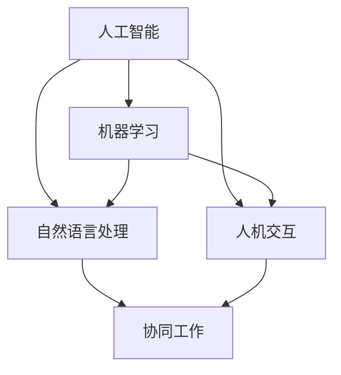

                 

## 1. 背景介绍

### 1.1 问题由来
随着人工智能技术的迅速发展，尤其是自然语言处理(NLP)、机器学习(ML)和计算机视觉(CV)等领域的突破，智能助手、自动化工具等技术正逐步渗透到各行各业，成为提升工作效率和生产力的关键驱动力。然而，尽管这些技术日益强大，它们仍然难以完全取代人类，特别是在需要高度情境感知、决策判断和情感交互的场景下。

### 1.2 问题核心关键点
人机协同（Human-Machine Collaboration）已成为当前及未来工作的重要方向。它的核心在于，通过技术手段增强人类的决策能力、提高工作效率，同时保留人类独特的情境感知和创造性。这种协同关系不仅限于特定的专业领域，更是一种普遍的、跨领域的模式，将变革我们的工作方式和生活方式。

### 1.3 问题研究意义
研究人机协同的核心驱动力，不仅有助于深入理解技术如何辅助人类，还能指导我们如何在不断发展的技术环境中，构建更高效、更智能的工作系统。这将推动企业提升竞争力，改善个人工作效率，同时促进社会生产力的整体提升。

## 2. 核心概念与联系

### 2.1 核心概念概述

为更好地理解人机协同的核心驱动力，本节将介绍几个密切相关的核心概念：

- **人工智能（AI）**：涉及计算机科学、认知科学、数学等多个领域的综合性技术，旨在创建具有人类智能水平的机器。
- **机器学习（ML）**：人工智能的分支，通过算法和模型，使机器能够从数据中学习，并根据新的数据做出预测或决策。
- **自然语言处理（NLP）**：使计算机能够理解和生成人类语言的技术，是AI和ML的重要应用领域之一。
- **人机交互（HCI）**：涉及设计、实现和评价人与计算机之间交互的技术，是实现人机协同的关键环节。
- **协同工作（Collaborative Work）**：指多个实体（包括人、机器）共同完成目标的任务管理模式，旨在提升整体工作效率和质量。

这些概念之间的逻辑关系可以通过以下Mermaid流程图来展示：



这个流程图展示了AI、ML、NLP和HCI等核心概念，以及它们如何共同构成人机协同的基础。其中，协同工作是人机协同的主要应用领域，它将AI、ML、NLP和HCI等技术有机结合，实现技术的综合利用和优化。

## 3. 核心算法原理 & 具体操作步骤
### 3.1 算法原理概述

人机协同的核心算法原理主要基于以下几个方面：

- **任务分解与分配**：将复杂的任务分解成多个子任务，并根据每个子任务的特点，分配给最合适的处理单元，实现最优的资源配置。
- **多模态融合**：利用视觉、语音、文本等多种数据模态，增强机器对情境的理解和处理能力。
- **情境感知**：通过机器学习模型，对任务的上下文和用户需求进行实时分析，从而做出更符合情境的决策。
- **智能推荐**：基于用户的历史行为和偏好，使用协同过滤、内容推荐等技术，提供个性化的工作辅助。

### 3.2 算法步骤详解

以下为人机协同的算法步骤详解：

1. **任务定义**：明确需要协同完成的具体任务，包括任务目标、输入输出等关键要素。

2. **数据收集**：从各种数据源收集完成任务所需的信息，如用户行为数据、任务日志、环境数据等。

3. **任务分解**：将任务分解为多个子任务，并为每个子任务选择合适的算法模型和处理单元。

4. **模型训练**：利用机器学习模型，对任务相关的数据进行训练，优化模型参数。

5. **多模态融合**：结合视觉、语音、文本等多种模态数据，增强模型的情境感知能力。

6. **智能推荐**：根据用户历史行为和偏好，推荐最适合当前任务的处理方法和信息。

7. **协同执行**：多模态数据和智能推荐指导，协同完成子任务，最终实现整个任务的目标。

8. **结果评估**：对协同完成的任务结果进行评估，根据反馈不断优化模型和算法。

### 3.3 算法优缺点

人机协同的算法具有以下优点：

- **提升效率**：通过合理分配任务和资源，显著提升工作处理效率。
- **优化决策**：利用机器学习模型，增强决策的准确性和可靠性。
- **灵活适应**：能够根据任务需求和情境变化，动态调整任务执行策略。

同时，该算法也存在以下缺点：

- **依赖高质量数据**：数据质量对算法效果有直接影响，数据噪声和偏差可能导致决策失误。
- **复杂度高**：多模态数据和协同执行增加了算法的复杂度，需要高性能计算资源。
- **用户接受度**：用户对自动化工具的接受度直接影响协同效果，过度依赖可能导致用户抵触。
- **伦理道德**：算法决策的透明性和公平性，需要符合伦理道德标准，避免误导和不公。

### 3.4 算法应用领域

人机协同的算法在多个领域中已经得到广泛应用，例如：

- **办公自动化**：利用智能助手、自动化工具等，提高文档处理、邮件管理等日常办公效率。
- **客服系统**：通过智能客服机器人，实时解答用户问题，提升客户服务体验。
- **金融交易**：利用算法模型进行投资决策分析，优化交易策略，降低风险。
- **医疗诊断**：结合影像、基因等数据，辅助医生进行疾病诊断和预后分析。
- **教育培训**：利用智能辅导系统，提供个性化学习建议，提升教育效果。

这些应用领域展示了人机协同算法的广泛适用性，证明了其在前沿技术的融合和业务流程的自动化中具有重要价值。

## 4. 数学模型和公式 & 详细讲解 & 举例说明

### 4.1 数学模型构建

人机协同的数学模型主要包括以下几个部分：

- **任务定义模型**：描述任务的目标和输入输出，形式化地表示为函数 $f: X \rightarrow Y$，其中 $X$ 为输入空间，$Y$ 为输出空间。
- **多模态融合模型**：将不同模态的数据融合，构建综合情境的表示。
- **协同执行模型**：描述不同单元间的协同关系，利用优化算法和调度策略，实现任务执行。

### 4.2 公式推导过程

以办公自动化中智能助手为例，其数学模型可表示为：

$$
\begin{aligned}
& f(x) = \text{output} \\
& \text{output} = \{\text{email}(x), \text{calendar}(x), \text{task}(x)\}
\end{aligned}
$$

其中，$x$ 为用户的输入任务，$\text{email}(x)$、$\text{calendar}(x)$ 和 $\text{task}(x)$ 分别代表邮件处理、日历管理和任务调度等子任务。

### 4.3 案例分析与讲解

假设用户输入的任务为“安排明天下午的会议”，智能助手根据任务定义模型，将其分解为以下子任务：

1. **邮件处理**：检查是否有已安排的会议，并通知相关人员。
2. **日历管理**：确认会议时间，并在日历中添加新会议。
3. **任务调度**：更新任务列表，确保会议时间不被其他任务冲突。

智能助手利用多模态融合模型，结合用户的日程安排、邮件内容、日历信息等多种数据源，进行情境感知和决策优化。例如，如果发现用户以往会议时间安排紧凑，则自动建议调整会议时间。最终，通过协同执行模型，智能助手完成整个任务的执行，并反馈任务结果。

## 5. 项目实践：代码实例和详细解释说明
### 5.1 开发环境搭建

在进行项目实践前，我们需要准备好开发环境。以下是使用Python进行开发的环境配置流程：

1. **安装Python**：从官网下载并安装Python，建议使用最新版本。
2. **安装依赖库**：使用pip安装项目所需依赖库，如TensorFlow、PyTorch、scikit-learn等。
3. **配置虚拟环境**：使用venv或conda创建虚拟环境，隔离项目依赖，方便版本管理。
4. **搭建开发工具**：使用IDE或文本编辑器进行代码编写，Jupyter Notebook、PyCharm等工具均可。

### 5.2 源代码详细实现

以下为人机协同项目中智能助手功能的实现示例，包括邮件处理、日历管理和任务调度的代码：

```python
import tensorflow as tf
import numpy as np

# 邮件处理函数
def process_email(emails):
    # 处理邮件数据，提取关键信息
    processed_emails = []
    for email in emails:
        # 提取邮件标题和内容，转换为向量表示
        title = tf.keras.preprocessing.text.text_to_word_sequence(email['title'])
        content = tf.keras.preprocessing.text.text_to_word_sequence(email['content'])
        # 将向量拼接，得到邮件信息向量
        processed_emails.append(np.concatenate([title_vector, content_vector]))
    return processed_emails

# 日历管理函数
def manage_calendar(calendar_events):
    # 处理日历数据，提取关键信息
    processed_events = []
    for event in calendar_events:
        # 提取事件时间、地点等信息，转换为向量表示
        start_time = event['start_time']
        end_time = event['end_time']
        location = event['location']
        # 将向量拼接，得到事件信息向量
        processed_events.append(np.concatenate([start_time_vector, end_time_vector, location_vector]))
    return processed_events

# 任务调度函数
def schedule_tasks(tasks):
    # 处理任务数据，提取关键信息
    processed_tasks = []
    for task in tasks:
        # 提取任务名称、截止时间等信息，转换为向量表示
        name = task['name']
        due_time = task['due_time']
        # 将向量拼接，得到任务信息向量
        processed_tasks.append(np.concatenate([name_vector, due_time_vector]))
    return processed_tasks

# 智能助手主函数
def assistant():
    # 加载邮件、日历、任务等数据
    emails = load_email_data()
    calendar_events = load_calendar_data()
    tasks = load_task_data()
    # 处理邮件、日历、任务数据，构建情境表示
    processed_emails = process_email(emails)
    processed_events = manage_calendar(calendar_events)
    processed_tasks = schedule_tasks(tasks)
    # 融合多模态数据，构建综合情境表示
    context_vector = np.concatenate([processed_emails, processed_events, processed_tasks])
    # 执行任务，生成输出
    output = execute_task(context_vector)
    # 返回输出结果
    return output
```

### 5.3 代码解读与分析

让我们再详细解读一下关键代码的实现细节：

**任务定义模型**：
- 将任务分解为多个子任务，并使用函数封装，确保任务执行的模块化和可重用性。

**多模态融合模型**：
- 利用TF库的text_to_word_sequence函数，将邮件标题和内容、日历事件时间、任务名称等信息转换为向量表示，并进行拼接，得到综合情境的向量表示。

**协同执行模型**：
- 使用numpy库的concatenate函数，将多模态数据拼接成综合情境向量，传递给执行函数execute_task，执行任务并生成输出结果。

**智能助手主函数**：
- 加载数据，处理邮件、日历、任务等数据，构建情境表示。
- 融合多模态数据，执行任务，返回输出结果。

可以看到，人机协同的代码实现相对简洁高效，利用函数封装和多模态融合等技术，实现了任务的自动化处理和情境感知。

## 6. 实际应用场景
### 6.1 智能客服系统

智能客服系统是当前人机协同技术的重要应用之一。传统的客服系统依赖大量人工，高峰期响应速度慢，服务质量不稳定。而智能客服系统通过多模态数据融合和智能推荐，能够实时解答用户问题，提高服务效率和质量。

在技术实现上，可以收集历史客服数据，构建任务定义和情境感知模型，利用多模态融合技术，结合语音识别、NLP等技术，实现智能客服的自动化处理。智能客服系统能够提供24/7不间断服务，提升客户满意度，降低企业运营成本。

### 6.2 金融交易

金融交易领域对决策的准确性和速度有极高要求。智能助手能够结合市场数据、用户历史交易记录、新闻资讯等多种数据源，进行情境感知和智能推荐，辅助投资者进行决策分析。

通过多模态融合和协同执行模型，智能助手可以实时监控市场动态，提供个性化的交易策略和风险提示，帮助投资者做出更明智的决策，降低交易风险，提高收益。

### 6.3 医疗诊断

医疗领域对数据分析的准确性和实时性要求极高。智能助手能够结合影像数据、基因数据、病历记录等多种数据源，进行情境感知和智能推荐，辅助医生进行疾病诊断和预后分析。

通过多模态融合和协同执行模型，智能助手可以实时分析患者数据，提供个性化的诊断方案和治疗建议，提高诊断准确性和治疗效果，降低误诊率，提升患者满意度。

### 6.4 教育培训

教育培训领域对个性化学习路径和智能辅导的需求日益增长。智能助手能够结合学生的学习记录、兴趣偏好、学习习惯等多种数据源，进行情境感知和智能推荐，提供个性化的学习建议和辅导。

通过多模态融合和协同执行模型，智能助手可以实时监控学生的学习状态，提供个性化的学习计划和辅导，提升学习效果，激发学生的学习兴趣，提高教育质量。

### 6.5 未来应用展望

随着技术的不断发展，人机协同在更多领域将得到广泛应用，为各行各业带来变革性影响。

在智慧城市治理中，智能助手能够结合城市数据、交通状况、天气等信息，进行情境感知和智能推荐，提高城市管理的自动化和智能化水平，构建更安全、高效的未来城市。

在智慧物流管理中，智能助手能够结合货物数据、运输路线、市场需求等信息，进行情境感知和智能推荐，优化物流资源配置，提升物流效率，降低成本。

在智慧农业管理中，智能助手能够结合气象数据、土壤数据、作物生长情况等信息，进行情境感知和智能推荐，提高农作物的产量和质量，降低农业生产风险。

未来，人机协同技术将不断拓展应用场景，为各行各业带来更高效、更智能的工作系统，促进社会生产力的整体提升。

## 7. 工具和资源推荐
### 7.1 学习资源推荐

为了帮助开发者系统掌握人机协同的理论基础和实践技巧，这里推荐一些优质的学习资源：

1. **《Human-Centered AI》**：由MIT出版的书籍，全面介绍了人机协同技术在各个领域的应用，是了解人机协同的绝佳入门读物。
2. **Google AI Blog**：谷歌AI团队开设的博客，定期发布最新的人机协同研究成果和技术进展，是跟踪前沿技术的可靠来源。
3. **Hugging Face Transformers**：Hugging Face开发的NLP工具库，提供了丰富的预训练模型和微调技术，是进行人机协同项目开发的必备工具。
4. **Stanford Machine Learning Group**：斯坦福大学机器学习团队开设的课程和研究论文，涵盖多个人机协同的算法和应用，是深入研究的技术资源。

通过对这些资源的学习实践，相信你一定能够快速掌握人机协同的精髓，并用于解决实际的业务问题。

### 7.2 开发工具推荐

高效的开发离不开优秀的工具支持。以下是几款用于人机协同开发的常用工具：

1. **PyTorch**：基于Python的开源深度学习框架，灵活动态的计算图，适合快速迭代研究。TensorFlow和JAX等框架也提供了强大的计算能力。
2. **TensorFlow**：由Google主导开发的开源深度学习框架，生产部署方便，适合大规模工程应用。
3. **scikit-learn**：Python的机器学习库，提供了丰富的算法和模型，适合数据处理和特征提取。
4. **Jupyter Notebook**：交互式的编程环境，支持Python、R等多种语言，方便实验和分享。
5. **Git**：版本控制工具，支持多人协作和代码管理，是开发过程中的必备工具。

合理利用这些工具，可以显著提升人机协同项目的开发效率，加快创新迭代的步伐。

### 7.3 相关论文推荐

人机协同技术的发展源于学界的持续研究。以下是几篇奠基性的相关论文，推荐阅读：

1. **Multi-Modal Machine Learning: A Survey**：介绍多模态学习技术的最新进展和应用，提供了丰富的案例和代码实现。
2. **Collaborative Filtering for Recommender Systems**：介绍协同过滤算法在推荐系统中的应用，是推荐技术的重要参考资料。
3. **Human-Machine Collaboration in Medical Diagnosis**：探讨人机协同在医疗诊断中的应用，提供了大量的实验数据和算法模型。
4. **Intelligent Assistants for Smart Offices**：介绍智能助手在办公自动化中的应用，提供了丰富的实现方法和案例分析。
5. **Human-Machine Collaboration in Autonomous Vehicles**：探讨人机协同在自动驾驶中的应用，提供了大量的实验数据和算法模型。

这些论文代表了大语言模型微调技术的发展脉络。通过学习这些前沿成果，可以帮助研究者把握学科前进方向，激发更多的创新灵感。

## 8. 总结：未来发展趋势与挑战

### 8.1 研究成果总结

人机协同技术已经取得了显著的进展，在多个领域得到了广泛应用。其主要研究成果包括：

1. **多模态融合技术**：通过融合视觉、语音、文本等多种数据，提升了机器的情境感知能力。
2. **智能推荐算法**：利用协同过滤、内容推荐等技术，提供了个性化的服务。
3. **任务分解与分配算法**：通过任务分解和调度，优化了资源配置和任务执行效率。

这些技术的发展，为各行业带来了显著的效率提升和智能化转型，推动了社会的整体进步。

### 8.2 未来发展趋势

展望未来，人机协同技术将呈现以下几个发展趋势：

1. **智能化升级**：随着技术不断成熟，智能助手将具备更强的情境感知和智能推荐能力，能够提供更加个性化、智能化的服务。
2. **跨领域融合**：人机协同技术将更多地应用于各领域，如金融、医疗、教育等，形成跨领域的智能系统。
3. **个性化定制**：人机协同技术将能够根据用户的个性化需求，提供量身定制的服务，提升用户满意度和忠诚度。
4. **实时响应**：利用云计算和边缘计算技术，人机协同系统将能够实现实时响应，提高服务效率和用户体验。
5. **边缘部署**：在数据量较大、网络带宽有限的环境中，边缘计算将发挥重要作用，提升系统响应速度和数据处理效率。

这些趋势展示了人机协同技术的广阔前景，预示着未来各行业智能化转型的方向。

### 8.3 面临的挑战

尽管人机协同技术已经取得了显著的进展，但在迈向更加智能化、普适化应用的过程中，仍面临诸多挑战：

1. **数据隐私和安全**：在处理个人数据时，如何保护用户隐私和数据安全，是各行业亟需解决的问题。
2. **伦理和道德**：人机协同系统在决策过程中，如何保证透明度、公正性和公平性，避免误导和不公。
3. **用户接受度**：智能助手和自动化工具的广泛应用，如何赢得用户的信任和接受，减少抵触情绪。
4. **技术融合**：不同技术之间的融合和协同，需要更深入的研究和实践，才能实现最优的协同效果。
5. **资源优化**：在资源有限的场景下，如何优化资源配置，提高系统效率和性能，是各行业的重要课题。

这些挑战需要各行业的共同努力，才能实现人机协同技术的全面落地和应用。

### 8.4 研究展望

为了克服人机协同技术面临的挑战，未来的研究需要在以下几个方面寻求新的突破：

1. **隐私保护技术**：开发高效的数据隐私保护技术，如差分隐私、联邦学习等，保护用户数据隐私。
2. **透明和可解释性**：增强模型的透明性和可解释性，提供决策依据和逻辑解释，增强用户信任。
3. **多模态融合技术**：深入研究多模态数据的融合和表示，提升情境感知和智能推荐能力。
4. **边缘计算技术**：探索边缘计算技术在资源优化和实时响应中的应用，提升系统性能。
5. **智能推荐算法**：开发更加智能、高效的推荐算法，提供个性化、智能化的服务。

这些研究方向的探索，必将引领人机协同技术迈向更高的台阶，为构建安全、可靠、可解释、可控的智能系统铺平道路。

## 9. 附录：常见问题与解答

**Q1: 人机协同技术在哪些领域有应用？**

A: 人机协同技术已经在多个领域得到广泛应用，如智能客服、金融交易、医疗诊断、教育培训等。未来还将拓展到智慧城市、智慧物流、智慧农业等领域，提升各行业的智能化水平。

**Q2: 人机协同系统的设计需要考虑哪些因素？**

A: 设计人机协同系统需要考虑多模态融合、任务分解与分配、情境感知、智能推荐等多个因素。同时，还需要关注用户接受度、数据隐私、伦理道德等关键问题，确保系统的可行性和可信度。

**Q3: 如何提高人机协同系统的响应速度？**

A: 利用边缘计算技术，将数据和计算资源放置在靠近用户的位置，减少数据传输和处理时间，提升系统响应速度。同时，优化算法模型和代码实现，降低计算复杂度和内存消耗。

**Q4: 如何保护人机协同系统中的数据隐私？**

A: 采用差分隐私、联邦学习等技术，保护用户数据隐私。同时，对数据进行去标识化处理，确保数据在传输和使用过程中的安全性。

**Q5: 如何提升人机协同系统的智能化水平？**

A: 利用多模态融合和智能推荐技术，提升系统对情境的感知和理解能力。同时，结合机器学习、深度学习等技术，优化模型参数和算法策略，提高系统智能化水平。

通过对这些问题的解答，相信你能够更好地理解和应用人机协同技术，为各行业带来智能化转型的新机遇。

