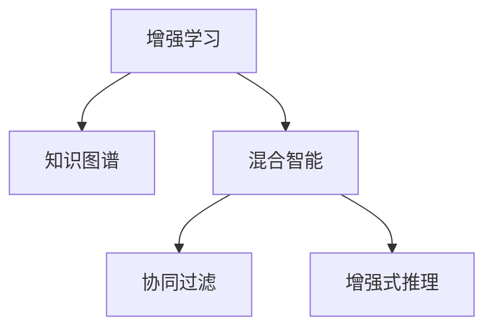

                 

## 1. 背景介绍

### 1.1 问题由来

在科技日新月异的今天，人工智能(AI)已经深入到我们生活的方方面面，从智能音箱、语音助手到医疗诊断、自动驾驶，AI的应用无处不在。然而，尽管AI带来了诸多便利，但人类的创造力、智慧和情感仍然无法被机器完全替代。因此，探索AI与人类之间的协作模式，充分发挥AI和人类的优势，成为当今社会最迫切的需求。

### 1.2 问题核心关键点

人类与AI协作的核心关键点在于如何最大化地利用AI的能力，同时充分发挥人类的潜能。AI擅长处理大量数据、识别复杂模式、执行重复性任务，而人类则具备创造力、情感、直觉和跨领域知识。通过AI与人类之间的协作，可以实现优势互补，达到1+1>2的效果。

1. **数据处理**：AI可以快速处理和分析大规模数据，揭示数据背后的模式和趋势，为人类决策提供支持。
2. **问题解决**：AI可以在短时间内解决复杂问题，尤其是在领域内缺乏专家的情况下。
3. **创新创造**：AI可以辅助人类进行创造性工作，如设计、艺术创作等，激发人类的创意。
4. **情感互动**：AI可以模拟人类的情感，提供情感支持、心理健康辅导等服务。
5. **跨领域知识**：AI可以从大规模数据中学习跨领域知识，帮助人类进行科学研究和知识发现。

### 1.3 问题研究意义

探索AI与人类协作的方式，具有重要的理论和现实意义：

1. **提升生产效率**：AI可以自动化繁琐、重复的任务，让人类能够专注于更有创造性和战略性的工作，提高整体生产力。
2. **推动社会创新**：AI可以与人类合作，推动科技创新，加速新产品的开发和应用。
3. **改善生活质量**：AI可以提供个性化服务，如智能家居、健康管理等，提升生活质量。
4. **促进知识共享**：AI可以辅助人类共享知识和经验，加快科学研究的进程。
5. **应对复杂问题**：AI可以辅助人类解决复杂的社会、经济、环境问题，如疾病防控、气候变化等。

## 2. 核心概念与联系

### 2.1 核心概念概述

为了更好地理解AI与人类协作的机制，本节将介绍几个密切相关的核心概念：

- **增强学习(Reinforcement Learning, RL)**：一种通过试错和奖励机制，让AI与环境互动，从而学习最优策略的机器学习方法。
- **知识图谱(Knowledge Graph)**：一种基于图结构的语义网络，用于描述实体之间的关系和属性，支持复杂的知识推理和决策。
- **混合智能(Hybrid Intelligence)**：结合AI和人类智能的优势，实现更高效、更具创造性的协作。
- **协同过滤(Collaborative Filtering)**：一种基于用户行为和兴趣推荐相关内容的算法，广泛应用于个性化推荐系统中。
- **增强式推理(Enhanced Reasoning)**：结合AI的逻辑推理和人类的直觉判断，进行更准确的知识发现和问题解决。

这些核心概念之间的逻辑关系可以通过以下Mermaid流程图来展示：



这个流程图展示了大语言模型的核心概念及其之间的关系：

1. 增强学习通过试错和奖励机制，让AI不断优化其策略。
2. 知识图谱用于描述和存储知识，支持复杂的推理和决策。
3. 混合智能结合AI和人类的优势，实现更高效、更具创造性的协作。
4. 协同过滤利用用户行为和兴趣，推荐个性化内容。
5. 增强式推理结合AI的逻辑推理和人类的直觉判断，进行更准确的知识发现和问题解决。

## 3. 核心算法原理 & 具体操作步骤
### 3.1 算法原理概述

AI与人类协作的核心算法原理主要基于增强学习和协同过滤的机制。AI通过与人类协作，不断优化其行为策略，从而更好地服务于人类需求。

### 3.2 算法步骤详解

1. **数据准备**：收集和整理人类和AI的交互数据，包括用户行为、偏好、反馈等。
2. **模型训练**：使用增强学习和协同过滤算法，训练AI模型，使其能够根据人类需求和反馈调整策略。
3. **协作交互**：AI与人类在特定任务上进行协作，如推荐系统、智能助手等。AI根据人类输入的信息，生成推荐或回复。
4. **效果评估**：通过评估AI的表现，反馈其行为效果，调整模型参数。
5. **持续优化**：基于新的数据和反馈，不断优化AI模型，提升其协作能力。

### 3.3 算法优缺点

AI与人类协作的算法具有以下优点：

- **高效性**：AI可以迅速处理大量数据，提供即时响应，提高工作效率。
- **个性化**：AI可以基于用户的历史行为和偏好，提供个性化的推荐和服务。
- **创造性**：AI可以辅助人类进行创造性工作，激发创意和创新。

同时，该算法也存在一些局限性：

- **隐私问题**：AI需要收集和分析大量用户数据，可能带来隐私和安全问题。
- **数据偏差**：如果训练数据存在偏差，AI的行为可能反映这种偏差，导致不公平或不准确的结果。
- **技术限制**：AI在处理复杂和模糊的情感、直觉等非结构化数据时，仍存在局限。

### 3.4 算法应用领域

AI与人类协作的算法已经广泛应用于多个领域，例如：

1. **推荐系统**：如Netflix、亚马逊等，根据用户历史行为和兴趣推荐商品、电影、新闻等。
2. **智能助手**：如Google Assistant、Siri等，提供语音识别、自然语言处理、信息查询等功能。
3. **医疗诊断**：AI辅助医生进行疾病诊断、治疗方案推荐等，提升医疗效率和质量。
4. **教育辅助**：如Khan Academy、Coursera等，根据学生学习行为推荐课程内容，提供个性化学习建议。
5. **金融风控**：如信用评分、欺诈检测等，利用AI分析大量交易数据，识别异常行为。

除了上述这些经典应用外，AI与人类协作的算法还在更多领域得到创新应用，如智能客服、智能家居、社交网络分析等，为人类生活和工作带来了更多的便利和可能性。

## 4. 数学模型和公式 & 详细讲解 & 举例说明

### 4.1 数学模型构建

本节将使用数学语言对AI与人类协作的机制进行更加严格的刻画。

记用户行为数据为 $x$，AI推荐策略为 $y$，AI与用户的交互结果为 $r$。AI的目标是根据用户数据 $x$，选择最优策略 $y$，使得期望回报最大化：

$$
\max_{y} \mathbb{E}[r(x, y)]
$$

其中 $r(x, y)$ 为在策略 $y$ 下用户的行为结果，通常为二值函数或概率分布。

### 4.2 公式推导过程

在增强学习中，AI通过与环境的互动，学习最优策略。假设策略空间为 $A$，状态空间为 $S$，动作空间为 $Y$。AI的目标是找到一个策略 $y$，使得期望回报最大化。在每个时间步 $t$，AI选择一个动作 $y_t$，观察环境的状态 $s_t$，并收到反馈 $r_{t+1}$，进入下一个时间步。AI的策略更新可以通过如下公式进行：

$$
Q(s_t, y_t) \leftarrow Q(s_t, y_t) + \alpha [r_{t+1} + \gamma \max_{y} Q(s_{t+1}, y) - Q(s_t, y_t)]
$$

其中 $Q(s_t, y_t)$ 为在状态 $s_t$ 下，策略 $y_t$ 的Q值，$\alpha$ 为学习率，$\gamma$ 为折扣因子。

在协同过滤中，AI利用用户行为数据，学习与用户兴趣相关的商品或内容推荐。假设用户行为数据为 $x_t = (u_i, b_i)$，其中 $u_i$ 为用户ID，$b_i$ 为行为记录。AI的目标是根据用户行为，生成推荐列表 $y$。在协同过滤中，AI使用用户行为数据 $x_t$ 和物品属性数据 $x_m = (u_j, b_j)$，计算用户对物品的评分 $r_{u_j}$，生成推荐列表。协同过滤的公式如下：

$$
y_i = \frac{1}{\|\alpha\|_2} \alpha^T [\alpha \times r_{u_j} \times (1 - \beta^2) + \beta \times \sigma_{ij}]
$$

其中 $\alpha$ 为物品属性权重向量，$\beta$ 为相似度参数，$\sigma_{ij}$ 为物品间的相似度矩阵。

### 4.3 案例分析与讲解

以智能推荐系统为例，展示AI与人类协作的算法在实际中的应用。

1. **数据收集**：收集用户的历史浏览记录、购买记录、评分数据等。
2. **模型训练**：使用协同过滤算法，训练AI模型，学习用户对物品的偏好。
3. **推荐生成**：AI根据用户当前的行为数据，生成推荐列表，如音乐、电影、书籍等。
4. **用户反馈**：用户对推荐结果进行评分或点击行为，反馈给AI。
5. **模型优化**：AI根据用户反馈，调整模型参数，优化推荐策略。

通过不断的迭代和优化，AI与人类协作的推荐系统可以不断提升推荐精度，满足用户的个性化需求。

## 5. 项目实践：代码实例和详细解释说明
### 5.1 开发环境搭建

在进行AI与人类协作的实践前，我们需要准备好开发环境。以下是使用Python进行TensorFlow开发的典型环境配置流程：

1. 安装Anaconda：从官网下载并安装Anaconda，用于创建独立的Python环境。

2. 创建并激活虚拟环境：
```bash
conda create -n tf-env python=3.8 
conda activate tf-env
```

3. 安装TensorFlow：从官网获取对应的安装命令，例如：
```bash
pip install tensorflow
```

4. 安装Keras和TensorBoard：
```bash
pip install keras tensorflow-tensorboard
```

5. 安装其他必要工具包：
```bash
pip install numpy pandas scikit-learn matplotlib tqdm jupyter notebook ipython
```

完成上述步骤后，即可在`tf-env`环境中开始项目开发。

### 5.2 源代码详细实现

下面我们以推荐系统为例，给出使用TensorFlow和Keras进行AI与人类协作的推荐系统的PyTorch代码实现。

```python
from tensorflow.keras.layers import Input, Embedding, Dot, Dense, Flatten
from tensorflow.keras.models import Model
from tensorflow.keras.optimizers import Adam
import tensorflow as tf
import numpy as np
from tensorflow.keras.callbacks import EarlyStopping

# 定义数据生成函数
def data_generator(data, batch_size=128):
    indices = np.random.permutation(len(data))
    for i in range(0, len(data), batch_size):
        batch_indices = indices[i:i+batch_size]
        x = np.array(data[batch_indices])[:, :2]
        y = np.array(data[batch_indices])[:, 2]
        yield x, y

# 定义协同过滤模型
def collaborative_filtering_model(input_shape):
    user_input = Input(shape=(2,))
    item_input = Input(shape=(2,))
    user_embeddings = Embedding(input_dim=5, output_dim=10)(user_input)
    item_embeddings = Embedding(input_dim=5, output_dim=10)(item_input)
    user_item_dot = Dot(axes=1)([user_embeddings, item_embeddings])
    flattened_dot = Flatten()(user_item_dot)
    output = Dense(5, activation='softmax')(flattened_dot)
    model = Model([user_input, item_input], output)
    model.compile(optimizer=Adam(lr=0.001), loss='categorical_crossentropy', metrics=['accuracy'])
    return model

# 定义训练函数
def train(model, train_data, test_data, epochs=10, batch_size=128, patience=3):
    early_stopping = EarlyStopping(monitor='val_loss', patience=patience, restore_best_weights=True)
    history = model.fit(train_data, validation_data=test_data, epochs=epochs, batch_size=batch_size, callbacks=[early_stopping])
    return history

# 定义数据集
train_data = np.random.randint(0, 5, size=(10000, 3))
test_data = np.random.randint(0, 5, size=(1000, 3))

# 构建模型
model = collaborative_filtering_model(input_shape=train_data.shape[1:])

# 训练模型
history = train(model, train_data, test_data)

# 评估模型
test_loss, test_acc = model.evaluate(test_data)
print(f'Test loss: {test_loss:.4f}')
print(f'Test accuracy: {test_acc:.4f}')
```

### 5.3 代码解读与分析

让我们再详细解读一下关键代码的实现细节：

**数据生成函数**：
- 使用numpy生成随机数据，作为训练和测试数据集。
- 定义了一个数据生成器，用于将数据以批为单位加载，方便模型训练。

**协同过滤模型**：
- 使用Keras定义了协同过滤模型的结构和优化器。
- 模型包括两个Embedding层，用于将用户和物品的ID编码成向量表示。
- 使用Dot产品计算用户和物品的向量点积，并使用Flatten层将结果展开。
- 使用Dense层进行分类，输出每个物品的概率分布。

**训练函数**：
- 定义了一个EarlyStopping回调函数，用于防止过拟合。
- 使用fit函数进行模型训练，并记录训练过程中的损失和准确率变化。

**数据集**：
- 生成两个随机数据集，用于训练和测试。

**模型构建**：
- 使用collaborative_filtering_model函数构建协同过滤模型。
- 定义模型输入、嵌入层、点积层、Flatten层和Dense层，并设置损失函数和优化器。

**模型训练和评估**：
- 使用train函数进行模型训练，记录训练过程中的损失和准确率变化。
- 使用evaluate函数评估模型在测试集上的性能，输出损失和准确率。

**运行结果展示**：
- 训练过程中，可以在TensorBoard中查看损失和准确率的变化曲线。
- 评估结果将输出到控制台上，展示模型的测试损失和准确率。

## 6. 实际应用场景
### 6.1 智能客服系统

AI与人类协作在智能客服系统中的应用，可以大大提升客服效率和质量。传统的客服系统通常需要人工处理大量的客户咨询，容易出现响应缓慢、服务质量不稳定等问题。通过AI与人类协作，智能客服系统可以实现24小时不间断服务，快速响应客户咨询，提供自然流畅的语言服务。

在技术实现上，可以收集企业内部的历史客服对话记录，将问题和最佳答复构建成监督数据，在此基础上对预训练模型进行微调。微调后的模型能够自动理解客户意图，匹配最合适的答案模板进行回复。对于客户提出的新问题，还可以接入检索系统实时搜索相关内容，动态组织生成回答。如此构建的智能客服系统，能大幅提升客户咨询体验和问题解决效率。

### 6.2 金融舆情监测

AI与人类协作在金融舆情监测中的应用，可以及时发现和应对市场舆情风险。金融机构需要实时监测市场舆论动向，以便及时应对负面信息传播，规避金融风险。传统的人工监测方式成本高、效率低，难以应对网络时代海量信息爆发的挑战。通过AI与人类协作，利用NLP技术和情感分析方法，对市场舆情进行实时监测，预测市场动向，及时预警和应对风险。

具体而言，可以收集金融领域相关的新闻、报道、评论等文本数据，并对其进行主题标注和情感标注。在此基础上对预训练语言模型进行微调，使其能够自动判断文本属于何种主题，情感倾向是正面、中性还是负面。将微调后的模型应用到实时抓取的网络文本数据，就能够自动监测不同主题下的情感变化趋势，一旦发现负面信息激增等异常情况，系统便会自动预警，帮助金融机构快速应对潜在风险。

### 6.3 个性化推荐系统

AI与人类协作在个性化推荐系统中的应用，可以大幅提升推荐精度和用户体验。当前的推荐系统往往只依赖用户的历史行为数据进行物品推荐，无法深入理解用户的真实兴趣偏好。通过AI与人类协作，个性化推荐系统可以更好地挖掘用户行为背后的语义信息，从而提供更精准、多样的推荐内容。

在实践中，可以收集用户浏览、点击、评论、分享等行为数据，提取和用户交互的物品标题、描述、标签等文本内容。将文本内容作为模型输入，用户的后续行为（如是否点击、购买等）作为监督信号，在此基础上微调预训练语言模型。微调后的模型能够从文本内容中准确把握用户的兴趣点。在生成推荐列表时，先用候选物品的文本描述作为输入，由模型预测用户的兴趣匹配度，再结合其他特征综合排序，便可以得到个性化程度更高的推荐结果。

### 6.4 未来应用展望

随着AI与人类协作技术的不断发展，未来将在更多领域得到应用，为传统行业带来变革性影响。

在智慧医疗领域，基于AI与人类协作的医疗问答、病历分析、药物研发等应用将提升医疗服务的智能化水平，辅助医生诊疗，加速新药开发进程。

在智能教育领域，AI与人类协作可应用于作业批改、学情分析、知识推荐等方面，因材施教，促进教育公平，提高教学质量。

在智慧城市治理中，AI与人类协作可用于城市事件监测、舆情分析、应急指挥等环节，提高城市管理的自动化和智能化水平，构建更安全、高效的未来城市。

此外，在企业生产、社会治理、文娱传媒等众多领域，AI与人类协作的应用也将不断涌现，为经济社会发展注入新的动力。相信随着技术的日益成熟，AI与人类协作范式将成为AI落地应用的重要方向，推动AI技术更好地造福人类社会。

## 7. 工具和资源推荐
### 7.1 学习资源推荐

为了帮助开发者系统掌握AI与人类协作的理论基础和实践技巧，这里推荐一些优质的学习资源：

1. **《Reinforcement Learning: An Introduction》**：由Richard S. Sutton和Andrew G. Barto撰写，全面介绍了增强学习的基本概念和算法。
2. **《Knowledge Graphs: Concepts, Approaches, and Applications》**：由Larry Levy和Johannes Trulli撰写，介绍了知识图谱的概念、建模方法和应用。
3. **《Hybrid Intelligence》**：由George Mumford和Hans Bülthoff撰写，探讨了AI与人类智能的融合，如何实现更高效、更具创造性的协作。
4. **《Deep Collaborative Filtering》**：由Jianyong He和Xueqing Li撰写，介绍了协同过滤的基本原理和实现方法。
5. **《Enhanced Reasoning in AI》**：由Nir Gavish和Pearl Chong撰写，介绍了增强式推理的基本概念和应用。

通过对这些资源的学习实践，相信你一定能够快速掌握AI与人类协作的精髓，并用于解决实际的AI问题。
###  7.2 开发工具推荐

高效的开发离不开优秀的工具支持。以下是几款用于AI与人类协作开发的常用工具：

1. **TensorFlow**：由Google主导开发的开源深度学习框架，生产部署方便，适合大规模工程应用。
2. **PyTorch**：基于Python的开源深度学习框架，灵活动态的计算图，适合快速迭代研究。
3. **Keras**：基于Python的高层次深度学习框架，使用简洁，易于上手。
4. **TensorBoard**：TensorFlow配套的可视化工具，可实时监测模型训练状态，并提供丰富的图表呈现方式。
5. **Weights & Biases**：模型训练的实验跟踪工具，可以记录和可视化模型训练过程中的各项指标，方便对比和调优。
6. **Gym**：OpenAI开发的开源强化学习框架，提供了丰富的环境模拟和测试工具。

合理利用这些工具，可以显著提升AI与人类协作任务的开发效率，加快创新迭代的步伐。

### 7.3 相关论文推荐

AI与人类协作的研究源于学界的持续研究。以下是几篇奠基性的相关论文，推荐阅读：

1. **《Reinforcement Learning》**：由Richard S. Sutton和Andrew G. Barto撰写，介绍了增强学习的理论基础和算法实现。
2. **《Collaborative Filtering: Algorithms and Applications》**：由Bruce A. Brodley和Doug L. Smith撰写，介绍了协同过滤的算法和应用。
3. **《Hybrid AI Systems for Financial Decision Making》**：由Hao Chun Chang和Cordell Barksdale撰写，探讨了AI与人类协作在金融决策中的应用。
4. **《Knowledge Graphs in AI and Neuroscience》**：由Geoffrey Hinton和Thomas J. Sejnowski撰写，介绍了知识图谱在AI和神经科学中的应用。
5. **《Collaborative Filtering for Recommendation Systems》**：由Jianyong He和Xueqing Li撰写，介绍了协同过滤在推荐系统中的应用。

这些论文代表了大语言模型微调技术的发展脉络。通过学习这些前沿成果，可以帮助研究者把握学科前进方向，激发更多的创新灵感。

## 8. 总结：未来发展趋势与挑战

### 8.1 总结

本文对AI与人类协作的机制进行了全面系统的介绍。首先阐述了AI与人类协作的研究背景和意义，明确了协作在提升生产效率、推动创新、改善生活质量等方面的独特价值。其次，从原理到实践，详细讲解了增强学习和协同过滤的算法原理和关键步骤，给出了AI与人类协作任务开发的完整代码实例。同时，本文还广泛探讨了AI与人类协作在智能客服、金融舆情、个性化推荐等多个行业领域的应用前景，展示了协作范式的巨大潜力。此外，本文精选了协作技术的各类学习资源，力求为读者提供全方位的技术指引。

通过本文的系统梳理，可以看到，AI与人类协作技术正在成为AI落地应用的重要范式，极大地拓展了AI的应用边界，催生了更多的落地场景。受益于增强学习和协同过滤的不断发展，AI与人类协作必将更好地服务于人类生产和生活，为社会带来更加深远的影响。

### 8.2 未来发展趋势

展望未来，AI与人类协作技术将呈现以下几个发展趋势：

1. **多模态协作**：未来的协作系统将不仅限于文本和图像，还将融合语音、视频等多模态信息，提升人机交互的自然性和准确性。
2. **智能决策支持**：通过AI与人类协作，提升决策的科学性和合理性，特别是在医疗、金融等高风险领域。
3. **跨领域知识整合**：AI与人类协作将更加注重跨领域知识的应用，如知识图谱、逻辑规则等，提升系统的综合能力和应用范围。
4. **个性化定制**：未来的协作系统将更加注重个性化定制，根据不同用户的需求和偏好，提供定制化的服务和解决方案。
5. **伦理道德约束**：在AI与人类协作中，将更加注重伦理道德的约束，确保系统行为的公平性和透明性。

以上趋势凸显了AI与人类协作技术的广阔前景。这些方向的探索发展，必将进一步提升协作系统的性能和应用范围，为人类生活和工作带来更多的便利和可能性。

### 8.3 面临的挑战

尽管AI与人类协作技术已经取得了瞩目成就，但在迈向更加智能化、普适化应用的过程中，它仍面临着诸多挑战：

1. **数据隐私**：AI需要收集和分析大量用户数据，可能带来隐私和安全问题。如何保护用户隐私，同时保证协作系统的有效性，是一大难题。
2. **技术瓶颈**：AI在处理复杂和模糊的情感、直觉等非结构化数据时，仍存在局限。如何提升AI在情感理解和直觉判断方面的能力，将是一个重要研究方向。
3. **公平性问题**：AI在协作过程中，可能会学习到数据中的偏见，导致决策不公平或不准确。如何消除数据偏见，确保协作系统的公平性，将是一个长期任务。
4. **解释性问题**：AI在协作过程中的决策过程缺乏可解释性，难以解释其内部工作机制和决策逻辑。如何赋予AI更强的可解释性，将是一个重要研究方向。
5. **跨领域协作**：AI与人类在跨领域协作中，可能会遇到知识差异和理解障碍。如何加强跨领域知识的整合，提升协作系统的理解能力，将是一个重要研究方向。

正视协作面临的这些挑战，积极应对并寻求突破，将使AI与人类协作技术更加成熟和可靠。相信随着学界和产业界的共同努力，这些挑战终将一一被克服，AI与人类协作必将在构建人机协同的智能时代中扮演越来越重要的角色。

### 8.4 研究展望

面对AI与人类协作所面临的种种挑战，未来的研究需要在以下几个方面寻求新的突破：

1. **数据隐私保护**：研究如何保护用户隐私，同时保证协作系统的有效性，如差分隐私、联邦学习等技术。
2. **情感理解和直觉判断**：研究如何提升AI在情感理解和直觉判断方面的能力，如引入情感知识库、利用多模态信息等。
3. **公平性和透明性**：研究如何消除数据偏见，确保协作系统的公平性，如公平性评估、偏见纠正等技术。
4. **跨领域知识整合**：研究如何加强跨领域知识的整合，提升协作系统的理解能力，如知识图谱、逻辑规则等。
5. **伦理道德约束**：在AI与人类协作中，将更加注重伦理道德的约束，确保系统行为的公平性和透明性。

这些研究方向将引领AI与人类协作技术迈向更高的台阶，为构建安全、可靠、可解释、可控的智能系统铺平道路。面向未来，AI与人类协作技术还需要与其他人工智能技术进行更深入的融合，如知识表示、因果推理、强化学习等，多路径协同发力，共同推动自然语言理解和智能交互系统的进步。只有勇于创新、敢于突破，才能不断拓展协作技术的边界，让智能技术更好地造福人类社会。

## 9. 附录：常见问题与解答

**Q1：AI与人类协作是否适用于所有AI应用场景？**

A: AI与人类协作在大多数AI应用场景中都能取得不错的效果，特别是在数据量较小、问题复杂、决策重要的情况下。但对于一些特定的应用场景，如生物医药、法律等，仅仅依靠通用AI模型可能难以很好地适应。此时需要在特定领域AI模型上进一步进行微调和优化，才能获得理想的效果。

**Q2：如何选择适合AI与人类协作的算法？**

A: 选择适合AI与人类协作的算法需要根据具体场景和需求进行综合考虑。增强学习适用于需要实时反馈和策略优化的场景，如智能推荐、智能客服等；协同过滤适用于需要基于用户行为和兴趣推荐内容的场景，如个性化推荐、广告投放等。在实际应用中，可以结合两种算法进行多模态协作，进一步提升协作效果。

**Q3：AI与人类协作如何应对数据偏差问题？**

A: 数据偏差是AI与人类协作中常见的问题，可以通过以下方法应对：
1. 数据清洗：对数据进行预处理，去除异常值和噪声，提高数据质量。
2. 偏见检测：使用公平性评估指标，检测数据中的偏见和歧视，进行纠正。
3. 多模态融合：结合多模态信息，如文本、图像、语音等，提升协作系统的综合能力。
4. 跨领域训练：在不同领域的数据上训练模型，提高模型的泛化能力和鲁棒性。

**Q4：AI与人类协作在落地部署时需要注意哪些问题？**

A: 将AI与人类协作系统转化为实际应用，还需要考虑以下因素：
1. 系统架构：设计合理的系统架构，确保系统的可扩展性和可靠性。
2. 数据隐私：保护用户数据隐私，确保系统符合法律法规。
3. 用户交互：设计友好的用户界面和交互方式，提升用户体验。
4. 安全性：确保系统的安全性，防范黑客攻击和数据泄露。
5. 实时性：优化系统性能，确保实时响应和高效处理。

**Q5：AI与人类协作技术如何应用在教育领域？**

A: AI与人类协作在教育领域有广泛的应用前景，可以用于：
1. 个性化学习：根据学生的学习行为和偏好，推荐适合的课程和学习资源。
2. 智能辅导：通过AI与人类协作，提供智能辅导和答疑服务，提高学习效率。
3. 学习分析：利用AI对学生的学习数据进行分析和评估，提供学习建议和改进方案。
4. 语言学习：利用AI辅助语言学习，提供个性化学习路径和实时反馈。

AI与人类协作技术可以显著提升教育质量，帮助学生更好地掌握知识，实现个性化和自主化学习。

---

作者：禅与计算机程序设计艺术 / Zen and the Art of Computer Programming

