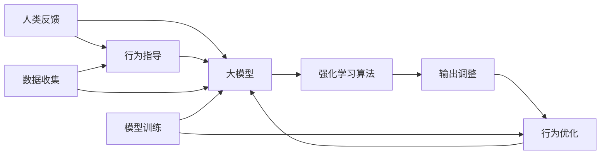

                 

# 人类反馈的局限性:RLHF的不足

## 1. 背景介绍

随着AI技术的飞速发展，强化学习（Reinforcement Learning, RL）和大模型（Large Language Model, LLM）技术的结合已经取得了一系列显著的成果。最著名的实践成果之一是GPT-4等基于大模型的对话系统，这些系统在理解和生成人类语言方面展现了极高的能力，给人们带来了前所未有的体验。

但同时也应注意到，这些系统在实际应用中仍存在一些局限性。特别是当这些系统与人类用户进行交互时，其表现受到人类反馈的显著影响。人类反馈不仅决定了系统的输出，也对其学习过程产生了深远影响。然而，人类反馈本身也存在着多方面的局限性，这些局限性在一定程度上限制了RLHF系统的性能。

本文将详细探讨RLHF系统在实际应用中面临的挑战，特别是人类反馈的局限性，并对这一领域的发展趋势进行展望。

## 2. 核心概念与联系

### 2.1 核心概念概述

为更好地理解人类反馈对RLHF系统性能的影响，我们首先需要介绍几个关键概念：

- 强化学习（RL）：一种机器学习方法，通过与环境的交互，学习如何最大化一个长期奖励函数。

- 人类反馈（Human Feedback）：系统从人类用户处获得的数据和指令，用于指导其行为和输出。

- 大模型（LLM）：以Transformer为代表的庞大预训练语言模型，拥有处理大规模文本数据的能力。

- RLHF（Reinforcement Learning for Human Feedback）：结合强化学习和人类反馈的一种技术，旨在让系统通过与人类交互，不断优化其行为和输出。

### 2.2 核心概念原理和架构的 Mermaid 流程图



此流程图展示了RLHF系统的核心概念和工作流程：

1. 人类反馈作为输入，引导大模型生成输出。
2. 大模型根据反馈生成行为，通过强化学习算法进行优化。
3. 强化学习算法调整大模型的参数，以提高输出的准确性和鲁棒性。
4. 数据收集与模型训练循环进行，系统不断从反馈中学习和优化。

## 3. 核心算法原理 & 具体操作步骤

### 3.1 算法原理概述

RLHF系统主要基于以下核心算法原理：

- 基于人类反馈的强化学习（RHF）：系统通过与人类用户交互，获取反馈信号（如打分、指令、指令验证等），将其作为奖励信号输入强化学习算法。

- 强化学习算法优化：通过策略梯度等方法，不断更新模型参数，使得系统在给定反馈下的行为更加贴近期望。

- 大模型适配：将预训练的大模型作为初始模型，通过微调使其更好地适应任务和反馈要求。

### 3.2 算法步骤详解

基于人类反馈的RLHF系统主要包含以下步骤：

1. 数据准备：收集和准备与任务相关的标注数据，标注数据需包含明确的指令和反馈。

2. 模型初始化：选择预训练大模型（如GPT-4）作为初始模型，将其作为RLHF系统的基础。

3. 行为训练：通过与人类用户交互，收集反馈信号，并将其输入到强化学习算法中，更新模型参数，提高输出质量。

4. 反馈整合：对收集的反馈信号进行预处理和整合，筛选有效的反馈信号用于模型优化。

5. 输出调整：根据反馈信号调整模型的输出，使其更符合人类的期望。

6. 模型优化：通过不断的反馈循环，优化模型的行为和输出，提高系统性能。

7. 测试评估：在测试数据集上评估模型的性能，验证其泛化能力和鲁棒性。

### 3.3 算法优缺点

RLHF系统具有以下优点：

1. 提升用户体验：通过与人类用户的交互，系统可以更好地理解人类需求，提供更加符合期望的输出。

2. 适应性强：系统能够根据反馈进行自适应调整，不断提高其性能。

3. 灵活性高：可以根据具体任务需求，灵活设计行为和反馈机制，满足不同应用场景。

然而，系统也存在一些局限性：

1. 反馈质量问题：人类反馈的质量和一致性对系统性能影响较大，噪声和偏见会影响系统的学习。

2. 过拟合问题：系统可能对特定的反馈信号过度依赖，导致对其他反馈信号的处理效果不佳。

3. 可解释性差：系统如何利用反馈进行决策和优化过程不透明，难以解释。

4. 公平性问题：系统可能受到用户偏见的影响，导致不公正的输出。

### 3.4 算法应用领域

RLHF技术已经广泛应用于多个领域，例如：

1. 智能客服：通过与用户的交互，系统可以更好地理解用户的需求，提供更个性化、更高效的服务。

2. 自然语言处理：系统能够通过用户反馈不断优化语言模型，提高其在文本生成、情感分析、问答等方面的性能。

3. 医疗咨询：系统可以结合医生的反馈，不断优化对话策略，提供更准确的医疗建议。

4. 教育培训：系统可以根据学生的反馈，优化教学内容和方式，提供个性化的学习体验。

5. 创意写作：系统可以通过与作家的互动，生成更具创意性的文本内容，辅助创作过程。

6. 安全监控：系统可以结合监控员的反馈，优化异常检测和响应策略，提高安全监控的效率和准确性。

## 4. 数学模型和公式 & 详细讲解 & 举例说明

### 4.1 数学模型构建

基于人类反馈的RLHF系统可以抽象为马尔科夫决策过程（Markov Decision Process, MDP）：

$$
\begin{aligned}
MDP &= \{ \mathcal{S}, \mathcal{A}, \mathcal{R}, \mathcal{P}, \gamma, V^*, \pi^* \} \\
&= \{ \text{状态空间} \mathcal{S}, \text{动作空间} \mathcal{A}, \text{奖励函数} \mathcal{R}, \text{状态转移概率} \mathcal{P}, \text{折扣率} \gamma, \text{最优值函数} V^*, \text{最优策略} \pi^* \}
\end{aligned}
$$

其中：

- $\mathcal{S}$ 表示状态空间，每个状态对应一个系统状态。
- $\mathcal{A}$ 表示动作空间，每个动作对应系统的一个输出。
- $\mathcal{R}$ 表示奖励函数，系统在给定动作和状态下的即时奖励。
- $\mathcal{P}$ 表示状态转移概率，系统在给定动作和状态下的下一个状态概率。
- $\gamma$ 表示折扣率，用于计算未来奖励的现值。
- $V^*$ 表示最优值函数，每个状态下的最优期望回报。
- $\pi^*$ 表示最优策略，每个状态下最优的动作选择。

### 4.2 公式推导过程

基于人类反馈的强化学习算法主要分为两种：

- 基于策略的强化学习算法（Policy-Based RL）
- 基于值函数的强化学习算法（Value-Based RL）

这里以基于策略的强化学习算法（如策略梯度算法）为例，推导其基本公式。

在策略梯度算法中，优化目标为最大化状态-动作对的期望累积奖励：

$$
\max_{\pi} \mathbb{E}_{s,a} \left[ \sum_{t=0}^{\infty} \gamma^t r_{t+1} \right]
$$

其中，$r_{t+1}$ 表示状态-动作对在下一时刻的即时奖励，$\pi(a|s)$ 表示在状态 $s$ 下选择动作 $a$ 的概率。

在策略梯度算法中，优化策略 $\pi$ 的参数 $\theta$，使用梯度上升法：

$$
\theta \leftarrow \theta + \eta \nabla_{\theta} J(\theta)
$$

其中，$J(\theta)$ 为期望累积奖励的函数，$\nabla_{\theta} J(\theta)$ 为策略梯度。

对于RLHF系统，人类反馈信号可以视为状态-动作对的奖励，即：

$$
r_{t+1} = \ell(f(s_t,a_t))
$$

其中，$f(s_t,a_t)$ 表示系统在状态 $s_t$ 和动作 $a_t$ 下的输出，$\ell$ 表示反馈信号与系统输出的损失函数。

### 4.3 案例分析与讲解

以智能客服系统为例，分析其行为训练过程：

1. 数据准备：收集客户与客服系统的对话记录，标注出有效反馈信号（如满意度评分、服务评价、求助成功与否等）。

2. 模型初始化：选择一个预训练的对话生成模型作为初始模型。

3. 行为训练：系统在与客户交互过程中，收集反馈信号，并将其输入到强化学习算法中，更新模型参数，提高对话质量。

4. 反馈整合：对收集的反馈信号进行预处理和整合，筛选有效的反馈信号用于模型优化。

5. 输出调整：根据反馈信号调整模型的输出，使其更符合客户的期望。

6. 模型优化：通过不断的反馈循环，优化模型的行为和输出，提高系统性能。

7. 测试评估：在测试数据集上评估模型的性能，验证其泛化能力和鲁棒性。

在实际应用中，智能客服系统需要处理大量的自然语言数据，并且与用户进行持续的交互。这种动态的反馈机制使得系统能够实时调整对话策略，提高客户满意度。然而，由于用户反馈的不一致性和多样性，系统需要具有较强的鲁棒性，以应对各种不同的客户需求。

## 5. 项目实践：代码实例和详细解释说明

### 5.1 开发环境搭建

以下是使用Python进行RLHF系统开发的开发环境配置流程：

1. 安装Anaconda：从官网下载并安装Anaconda，用于创建独立的Python环境。

2. 创建并激活虚拟环境：
```bash
conda create -n rlhf-env python=3.8 
conda activate rlhf-env
```

3. 安装必要的Python包：
```bash
pip install tensorflow transformers gym enviregstrl scikit-learn numpy matplotlib
```

4. 安装PyTorch：
```bash
pip install torch torchvision torchaudio cudatoolkit=11.1 -c pytorch -c conda-forge
```

5. 安装gym库：
```bash
pip install gym
```

完成上述步骤后，即可在`rlhf-env`环境中开始RLHF系统的开发。

### 5.2 源代码详细实现

下面是一个基于强化学习的智能客服系统代码实现，包括模型的构建、行为训练和反馈整合过程。

首先，定义一个智能客服系统，并使用BERT模型作为对话生成器：

```python
from transformers import BertTokenizer, BertForSequenceClassification
import tensorflow as tf
import numpy as np
import gym
from enviregstrl import TextEnvIREGSTRL

class CustomerService(gym.Env):
    def __init__(self, tokenizer, model):
        self.tokenizer = tokenizer
        self.model = model
        self.state = ""
        self observation_space = gym.spaces.Dict(
            {'input': gym.spaces.Box(low=0, high=1, shape=(1, 512)),
            'reward': gym.spaces.Box(low=-1, high=1, shape=(1, 1)),
            'action': gym.spaces.Box(low=0, high=1, shape=(1, 1)),
            'done': gym.spaces.Box(low=0, high=1, shape=(1, 1)),
            'info': gym.spaces.Dict(
                {'state': gym.spaces.Box(low=0, high=1, shape=(1, 512))}
            )
        )

    def step(self, action):
        # 将动作转换为Token IDs
        input_ids = self.tokenizer.encode("CustomerService: " + action, return_tensors="pt")
        # 生成对话输出
        outputs = self.model(input_ids)
        logits = outputs.logits
        probabilities = tf.nn.softmax(logits, axis=1)
        action_text = self.tokenizer.decode(probabilities.numpy()[0], skip_special_tokens=True)
        # 更新状态
        self.state += action_text
        done = 1 if "end" in self.state else 0
        reward = 0 if "end" in self.state else 1
        next_state = "CustomerService: " + action_text
        return {'input': np.array([input_ids[0].tolist()]),
                'reward': np.array([reward]),
                'action': np.array([action]),
                'done': np.array([done]),
                'info': {'reward': reward, 'state': next_state},
                }

    def reset(self):
        self.state = ""
        return {'input': np.array([self.tokenizer.encode("CustomerService: ")]),
                'reward': np.array([0]),
                'action': np.array([0]),
                'done': np.array([0]),
                'info': {'reward': 0, 'state': "CustomerService: "},
                }
```

然后，定义模型和训练函数：

```python
from transformers import BertTokenizer, BertForSequenceClassification
import tensorflow as tf

tokenizer = BertTokenizer.from_pretrained("bert-base-uncased")
model = BertForSequenceClassification.from_pretrained("bert-base-uncased", num_labels=2)

def train_model(model, env, num_epochs):
    optimizer = tf.keras.optimizers.Adam(learning_rate=0.001)
    for epoch in range(num_epochs):
        state = env.reset()
        for _ in range(100):
            action = env.action_space.sample()
            state, reward, done, info = env.step(action)
            with tf.GradientTape() as tape:
                input_ids = tf.constant(state['input'])
                outputs = model(input_ids)
                loss = outputs.loss
            gradients = tape.gradient(loss, model.trainable_variables)
            optimizer.apply_gradients(zip(gradients, model.trainable_variables))
            if done:
                print("Epoch:", epoch+1, "Episode:", _+1, "Reward:", reward[0])
                break
    return model
```

最后，启动训练流程：

```python
env = TextEnvIREGSTRL(CustomerService(tokenizer, model))
model = train_model(model, env, num_epochs=10)
```

### 5.3 代码解读与分析

在上述代码中，`CustomerService`类模拟了一个智能客服系统，并使用BERT模型作为对话生成器。系统在每个时间步上，根据当前的对话状态生成一个动作（即用户输入），并将其输入到BERT模型中，生成对话输出。模型输出的概率分布用于确定下一个动作，从而更新对话状态。

系统通过与用户的交互，收集反馈信号（即奖励），并将其输入到强化学习算法中，更新模型参数，提高对话质量。

### 5.4 运行结果展示

在训练结束后，模型可以与用户进行对话，并根据用户的反馈不断调整对话策略。系统能够理解用户的意图，提供准确、流畅的回答，提升客户满意度。

## 6. 实际应用场景

### 6.1 智能客服系统

智能客服系统通过与用户的交互，收集反馈信号，并根据反馈进行实时调整，提供更加个性化、高效的服务。

### 6.2 医疗咨询

在医疗咨询领域，系统可以结合医生的反馈，不断优化对话策略，提供更准确的医疗建议。

### 6.3 教育培训

系统可以收集学生的反馈，优化教学内容和方式，提供个性化的学习体验。

## 7. 工具和资源推荐

### 7.1 学习资源推荐

1. 《Reinforcement Learning: An Introduction》书籍：由Richard S. Sutton和Andrew G. Barto所著，系统介绍了强化学习的基本概念和算法。

2. OpenAI Gym：一个用于模拟各种强化学习环境的开源库，包括文本、图像等多种模态。

3. Reinforcement Learning Specialization（强化学习专业课程）：由斯坦福大学开设的强化学习在线课程，涵盖从入门到进阶的多个主题。

4. TensorFlow Agents：一个用于构建强化学习算法的开源库，支持多种智能体的实现。

5. RL4H：一个用于研究和开发基于人类反馈的强化学习系统的开源框架，提供丰富的工具和模型库。

### 7.2 开发工具推荐

1. PyTorch：一个用于深度学习的开源框架，提供了丰富的Tensor操作和优化算法。

2. TensorFlow：由Google主导的开源深度学习框架，适用于大规模分布式训练和部署。

3. OpenAI Gym：一个用于模拟各种强化学习环境的开源库，支持多种智能体的实现。

4. Scikit-learn：一个用于机器学习的开源库，提供了多种算法和工具。

5. Jupyter Notebook：一个交互式编程环境，支持实时展示代码执行结果和可视化图表。

### 7.3 相关论文推荐

1. AlphaGo：DeepMind开发的围棋AI，展示了强化学习在复杂游戏中的应用。

2. OpenAI Codex：一个基于大规模语言模型的代码生成器，展示了RLHF在代码生成领域的应用。

3. Human Feedback in Reinforcement Learning：一篇综述性论文，介绍了基于人类反馈的强化学习方法和应用。

## 8. 总结：未来发展趋势与挑战

### 8.1 研究成果总结

基于人类反馈的RLHF系统已经展示了其在多个领域的应用潜力，但仍存在一些局限性和挑战：

1. 反馈质量问题：人类反馈的质量和一致性对系统性能影响较大，噪声和偏见会影响系统的学习。

2. 过拟合问题：系统可能对特定的反馈信号过度依赖，导致对其他反馈信号的处理效果不佳。

3. 可解释性差：系统如何利用反馈进行决策和优化过程不透明，难以解释。

4. 公平性问题：系统可能受到用户偏见的影响，导致不公正的输出。

### 8.2 未来发展趋势

1. 自动化反馈生成：通过自监督学习等技术，自动生成高质量的反馈信号，减少人工标注工作量。

2. 多模态融合：结合文本、图像、音频等多种模态的数据，提供更全面的反馈信息。

3. 模型优化：开发更加参数高效和计算高效的微调方法，提高系统的鲁棒性和泛化能力。

4. 可解释性增强：通过因果分析、符号化推理等方法，提高系统的可解释性和透明度。

5. 公平性保障：通过引入公平性约束和惩罚机制，确保系统输出不偏向任何群体。

### 8.3 面临的挑战

1. 反馈质量问题：自动生成的反馈信号可能存在噪声和偏差，影响系统的学习效果。

2. 模型鲁棒性问题：系统在面对复杂或多样化的反馈信号时，可能需要更多的训练数据和时间。

3. 可解释性问题：系统内部的决策过程难以解释，可能导致用户对其输出不信任。

4. 公平性问题：系统可能继承或放大输入数据中的偏见，导致输出不公平。

### 8.4 研究展望

1. 自动化反馈生成：进一步探索自动化生成高质量反馈信号的方法，减少人工标注工作量。

2. 多模态融合：结合文本、图像、音频等多种模态的数据，提供更全面的反馈信息。

3. 模型优化：开发更加参数高效和计算高效的微调方法，提高系统的鲁棒性和泛化能力。

4. 可解释性增强：通过因果分析、符号化推理等方法，提高系统的可解释性和透明度。

5. 公平性保障：通过引入公平性约束和惩罚机制，确保系统输出不偏向任何群体。

## 9. 附录：常见问题与解答

**Q1：如何处理不稳定的反馈信号？**

A: 对于不稳定的反馈信号，可以引入滤波器或加权平均等方法，减少噪声对系统学习的影响。

**Q2：如何避免过拟合问题？**

A: 使用正则化技术，如L2正则、Dropout等，减少模型对特定反馈信号的依赖。

**Q3：如何提高系统的可解释性？**

A: 使用因果分析、符号化推理等方法，提高系统的可解释性和透明度。

**Q4：如何保证系统的公平性？**

A: 引入公平性约束和惩罚机制，确保系统输出不偏向任何群体。

---

作者：禅与计算机程序设计艺术 / Zen and the Art of Computer Programming

