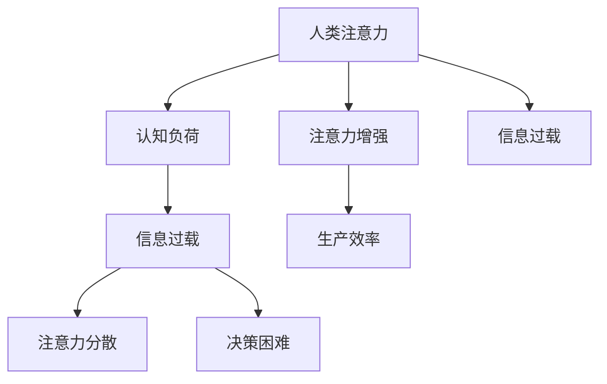

                 

# 人类注意力增强：提升生产力和效率的新方法

> 关键词：人类注意力增强,注意力机制,认知负荷,生产效率,信息过载,智能辅助

## 1. 背景介绍

### 1.1 问题由来

随着信息技术的飞速发展，我们的工作与生活中充满了各种信息，电子邮件、社交媒体、即时通讯、在线视频等，使得我们每天需要处理的信息量急剧增加。这种信息过载不仅增加了认知负荷，也严重消耗了我们宝贵的时间和精力。据一项调查显示，每天被手机、电脑等设备打扰的人数高达96%。这种频繁的中断，不仅影响了我们的工作效率，还可能对我们的健康造成损害。

### 1.2 问题核心关键点

现代信息技术虽然提高了信息处理的效率，但同时也带来了信息过载和注意力分散的问题。如何在海量信息中快速获取关键信息，如何提升工作和学习效率，成为了亟待解决的问题。

信息过载和注意力分散导致的问题包括：
- **认知负荷增加**：过多信息的处理使得大脑容易疲劳，难以集中注意力，降低工作效率。
- **决策难度增大**：复杂的信息环境使得决策变得困难，容易产生犹豫和错误。
- **心理压力上升**：信息爆炸带来的高负荷工作，使得心理压力增大，影响工作生活质量。

针对这些问题，本文将介绍一种基于注意力机制的信息处理技术——人类注意力增强，通过提升信息获取和处理的能力，显著提高生产力和效率。

## 2. 核心概念与联系

### 2.1 核心概念概述

为更好地理解人类注意力增强技术，本节将介绍几个密切相关的核心概念：

- **人类注意力**：人类在处理信息时，倾向于关注某些重要、显著或有价值的对象，而忽略其他不那么重要的信息。这种“选择性关注”的过程称为注意力机制。

- **认知负荷**：在处理信息时，大脑需要消耗资源进行记忆、决策、推理等认知活动，这些活动的总和称为认知负荷。

- **信息过载**：指在短时间内处理的信息量超过个体所能承受的认知负荷，导致注意力分散和决策困难。

- **注意力增强**：指通过技术手段，如智能辅助、自动化工具等，帮助个体在信息过载的环境中更高效地分配注意力，从而提高生产力和效率。

- **生产效率**：指在一定时间内完成工作的质量与数量的比值，反映了个体处理信息的能力。

这些核心概念之间的逻辑关系可以通过以下Mermaid流程图来展示：



这个流程图展示了几大核心概念之间的联系：

1. 人类注意力影响认知负荷。注意力集中时，认知负荷较低；注意力分散时，认知负荷较高。
2. 信息过载导致注意力分散和决策困难，增加认知负荷。
3. 注意力增强技术能够帮助个体在信息过载环境中更高效地分配注意力。
4. 生产效率受注意力集中程度和信息处理速度的影响。

## 3. 核心算法原理 & 具体操作步骤

### 3.1 算法原理概述

人类注意力增强技术基于认知心理学和神经科学的理论，通过模拟人类注意力机制，实现对信息的高效处理和过滤。其核心思想是：将人类注意力机制引入信息处理过程，帮助个体在信息过载的环境中更高效地分配注意力，从而提升生产力和效率。

形式化地，假设个体在处理任务 $T$ 时需要关注的关键词为 $K$，相关信息为 $I$。注意力增强的目标是通过某种算法，优化注意力分配权重 $\alpha$，使得模型在 $K$ 上投入更多的注意力，而在 $I$ 上分配较少的注意力，从而提高任务 $T$ 的处理速度和准确性。

### 3.2 算法步骤详解

基于人类注意力增强的算法可以分为以下几个关键步骤：

**Step 1: 定义注意力模型**

- 定义注意力机制，如自监督注意力、双向注意力等，以模拟人类注意力在信息处理中的选择和聚焦。
- 确定关键词 $K$ 的选取方式，如基于领域专家知识、基于文本摘要、基于情感分析等。
- 设计注意力分配权重 $\alpha$ 的计算公式，如基于权重训练的方法、基于规则调优的方法等。

**Step 2: 训练注意力模型**

- 收集任务 $T$ 的标注数据集 $D=\{(x_i,y_i)\}_{i=1}^N$，将 $K$ 和 $I$ 作为模型输入，$y_i$ 作为监督信号，训练注意力模型。
- 使用梯度下降等优化算法，最小化注意力模型与监督信号之间的差距，得到最优的注意力分配权重 $\alpha^*$。

**Step 3: 应用注意力模型**

- 将注意力模型应用到新的任务样本上，通过关键词 $K$ 和注意力分配权重 $\alpha^*$，动态调整信息处理的重点，筛选重要信息，忽略次要信息。
- 使用注意力模型输出的结果，进行后续处理，如生成报告、回答问题、执行决策等，以提升任务处理效率。

**Step 4: 评估和优化**

- 在测试集上评估注意力模型对任务 $T$ 的处理效果，对比注意力增强前后的性能提升。
- 根据评估结果，调整注意力模型的参数和策略，进一步优化注意力分配权重 $\alpha$，提高注意力增强的效果。

### 3.3 算法优缺点

人类注意力增强技术具有以下优点：
1. 提高信息处理效率：通过聚焦重要信息，减少次要信息的干扰，提高信息处理速度和准确性。
2. 降低认知负荷：通过优化注意力分配，减少对非重要信息的关注，降低认知负荷，提升工作效率。
3. 提高决策质量：通过智能筛选重要信息，减少信息过载带来的决策困难，提高决策质量。
4. 提升用户体验：通过智能辅助，帮助用户更快、更准确地完成任务，提升用户满意度。

同时，该方法也存在一些局限性：
1. 依赖关键词选取：关键词的选取对注意力模型的效果有重要影响，需要根据具体任务选择合适的关键词。
2. 模型训练数据需求高：注意力模型需要大量的标注数据进行训练，否则可能无法准确识别重要信息。
3. 算力消耗较大：注意力模型的计算复杂度高，需要较大的算力和存储资源。
4. 通用性不足：注意力增强技术在特定领域的适应性有待提高，难以泛化到所有任务。

尽管存在这些局限性，但人类注意力增强技术在信息处理和决策支持领域展现了巨大的潜力，被广泛应用于知识图谱构建、信息检索、智能推荐、任务自动化等场景中。

### 3.4 算法应用领域

人类注意力增强技术已经在多个领域得到了应用，以下是几个典型例子：

- **知识图谱构建**：通过注意力机制，从海量文献中筛选出重要信息，快速构建知识图谱，支撑智能搜索和推荐。
- **信息检索**：通过注意力机制，对用户查询和文档进行匹配，动态调整检索权重，提升检索效果。
- **智能推荐**：通过注意力机制，对用户行为和兴趣进行智能分析，动态调整推荐策略，提升推荐效果。
- **任务自动化**：通过注意力机制，对任务流程进行智能优化，减少人工干预，提高自动化水平。
- **智能问答**：通过注意力机制，对用户问题进行智能理解，动态调整回答策略，提升问答效果。

此外，人类注意力增强技术也在教育、医疗、金融等领域得到了广泛应用，为解决信息过载问题提供了新的思路和方法。随着技术的发展和应用场景的扩展，未来人类注意力增强技术将有更广泛的应用前景。

## 4. 数学模型和公式 & 详细讲解  
### 4.1 数学模型构建

本节将使用数学语言对人类注意力增强技术进行更加严格的刻画。

假设个体在处理任务 $T$ 时，需要关注的关键信息为 $K=\{k_1,k_2,\dots,k_m\}$，相关信息为 $I=\{i_1,i_2,\dots,i_n\}$。设注意力分配权重为 $\alpha=(\alpha_1,\alpha_2,\dots,\alpha_m)$，其中 $\alpha_i$ 表示信息 $i_j$ 的重要程度。

定义注意力模型 $A$ 的损失函数为 $\mathcal{L}(A)=\frac{1}{N}\sum_{i=1}^N \ell(A(x_i),y_i)$，其中 $x_i$ 为任务样本，$y_i$ 为任务标签，$\ell$ 为损失函数，如交叉熵损失、均方误差损失等。

注意力模型的训练目标是最小化损失函数 $\mathcal{L}(A)$，即：

$$
\alpha^* = \mathop{\arg\min}_{\alpha} \mathcal{L}(A)
$$

其中 $\alpha^*$ 为最优注意力分配权重。

### 4.2 公式推导过程

以下我们以分类任务为例，推导注意力模型的训练公式。

假设个体在处理任务 $T$ 时，使用关键词 $K$ 和注意力分配权重 $\alpha$，对样本 $x$ 进行分类。样本 $x$ 在关键词 $K$ 上的注意力表示为 $A_k(x)$，其中 $k$ 为关键词编号。模型的预测结果为 $y_{pred} = \arg\max_i \sum_k \alpha_k A_k(x)$。

模型的损失函数可以表示为：

$$
\ell(A(x),y) = \ell\left(\arg\max_i \sum_k \alpha_k A_k(x),y\right)
$$

假设样本 $x$ 在关键词 $K$ 上的注意力表示为 $A_k(x)$，其中 $k$ 为关键词编号。模型的预测结果为 $y_{pred} = \arg\max_i \sum_k \alpha_k A_k(x)$。

将上式带入损失函数中，得：

$$
\mathcal{L}(\alpha) = \frac{1}{N}\sum_{i=1}^N \ell\left(\arg\max_i \sum_k \alpha_k A_k(x_i),y_i\right)
$$

根据链式法则，损失函数对注意力分配权重 $\alpha$ 的梯度为：

$$
\frac{\partial \mathcal{L}(\alpha)}{\partial \alpha} = \frac{\partial \mathcal{L}(\alpha)}{\partial y_{pred}} \frac{\partial y_{pred}}{\partial \alpha}
$$

其中 $\frac{\partial y_{pred}}{\partial \alpha}$ 可以通过反向传播计算。

通过求解上述梯度方程，得到最优注意力分配权重 $\alpha^*$，应用于新的任务样本 $x$，从而提升任务处理效率。

### 4.3 案例分析与讲解

以文本分类任务为例，介绍注意力模型在实践中的具体应用。

假设个体在处理文本分类任务时，关键词 $K$ 为文本中的重要词汇，相关信息 $I$ 为其他无关词汇。使用注意力模型 $A$ 对文本 $x$ 进行分类，得到预测结果 $y_{pred}$。

在训练过程中，收集标注数据集 $D=\{(x_i,y_i)\}_{i=1}^N$，使用交叉熵损失函数对模型进行训练，得到最优注意力分配权重 $\alpha^*$。

在应用过程中，使用 $\alpha^*$ 对新的文本样本 $x$ 进行处理，筛选重要词汇，忽略无关词汇，生成分类结果。

通过对比注意力增强前后的分类精度，可以看出注意力模型在文本分类任务中的有效性。

## 5. 项目实践：代码实例和详细解释说明
### 5.1 开发环境搭建

在进行注意力增强实践前，我们需要准备好开发环境。以下是使用Python进行TensorFlow开发的环境配置流程：

1. 安装Anaconda：从官网下载并安装Anaconda，用于创建独立的Python环境。

2. 创建并激活虚拟环境：
```bash
conda create -n attention-env python=3.8 
conda activate attention-env
```

3. 安装TensorFlow：根据CUDA版本，从官网获取对应的安装命令。例如：
```bash
conda install tensorflow -c pytorch -c conda-forge
```

4. 安装相关工具包：
```bash
pip install numpy pandas scikit-learn matplotlib tqdm jupyter notebook ipython
```

完成上述步骤后，即可在`attention-env`环境中开始注意力增强实践。

### 5.2 源代码详细实现

这里我们以文本分类任务为例，给出使用TensorFlow实现注意力模型的PyTorch代码实现。

首先，定义注意力模型类：

```python
import tensorflow as tf
from tensorflow.keras.layers import Input, Embedding, Attention, Dense, Model
from tensorflow.keras.models import Model
from tensorflow.keras import backend as K

class AttentionModel(Model):
    def __init__(self, num_classes, num_keywords, embedding_dim, attention_dim):
        super(AttentionModel, self).__init__()
        
        self.input = Input(shape=(max_length,), dtype='int32')
        self.embedding = Embedding(input_dim=vocab_size, output_dim=embedding_dim, input_length=max_length)(self.input)
        self.attention = Attention(attention_dim=attention_dim)(self.embedding)
        self.dense = Dense(num_classes, activation='softmax')(self.attention)
        
    def call(self, inputs):
        return self.dense(inputs)
```

然后，定义注意力模型训练函数：

```python
def train_model(model, data, batch_size, num_epochs, learning_rate):
    model.compile(optimizer=tf.keras.optimizers.Adam(learning_rate=learning_rate), 
                  loss='categorical_crossentropy', 
                  metrics=['accuracy'])
    
    model.fit(data, 
              epochs=num_epochs, 
              batch_size=batch_size, 
              validation_data=validation_data)
```

最后，启动模型训练流程并在测试集上评估：

```python
# 加载数据集
data, validation_data = load_data()

# 创建模型实例
model = AttentionModel(num_classes=num_classes, num_keywords=num_keywords, embedding_dim=embedding_dim, attention_dim=attention_dim)

# 训练模型
train_model(model, data, batch_size=batch_size, num_epochs=num_epochs, learning_rate=learning_rate)

# 评估模型
test_loss, test_accuracy = model.evaluate(test_data)
print(f'Test accuracy: {test_accuracy:.2f}')
```

以上就是使用TensorFlow对注意力模型进行文本分类任务微调的完整代码实现。可以看到，TensorFlow提供了方便的高级API，使得模型的设计和训练变得简洁高效。

### 5.3 代码解读与分析

让我们再详细解读一下关键代码的实现细节：

**AttentionModel类**：
- `__init__`方法：初始化模型输入、嵌入层、注意力层、全连接层等组件。
- `call`方法：实现模型的前向传播过程。

**train_model函数**：
- 使用TensorFlow的`compile`方法定义模型编译过程，设置优化器、损失函数和评估指标。
- 使用`fit`方法训练模型，设置训练轮数和批次大小，并在验证集上评估模型性能。

**训练流程**：
- 加载数据集，调用`load_data`函数。
- 创建注意力模型实例，设置超参数。
- 调用`train_model`函数，启动模型训练。
- 在测试集上评估模型性能，输出测试准确率。

可以看到，TensorFlow的高级API使得注意力模型的实现和训练变得简单易懂，开发者可以将更多精力放在模型设计、数据处理等方面，而不必过多关注底层细节。

当然，实际应用中还需要考虑模型裁剪、推理加速等优化，但核心的注意力增强范式基本与此类似。

## 6. 实际应用场景
### 6.1 智能客服系统

智能客服系统需要处理大量的用户咨询，常常面临信息过载和注意力分散的问题。通过注意力增强技术，可以提升客服系统对用户查询的理解和响应能力，提升服务质量和效率。

具体而言，可以在智能客服系统中引入注意力机制，对用户的自然语言查询进行智能分析，动态调整关键词和无关信息的权重，筛选重要信息，忽略次要信息。通过注意力增强后的模型，可以更准确地理解用户意图，快速给出最佳回复，提升客户满意度。

### 6.2 金融舆情监测

金融市场舆情监测需要实时分析大量的新闻、评论、社交媒体等文本信息，常常面临信息过载和注意力分散的问题。通过注意力增强技术，可以提升舆情监测系统对市场动态的敏锐度和分析能力，及时发现潜在风险。

具体而言，可以在舆情监测系统中引入注意力机制，对海量文本数据进行智能筛选，提取与市场相关的关键词和信息，忽略次要信息。通过注意力增强后的模型，可以更准确地判断市场趋势，及时预警风险，提升风险管理能力。

### 6.3 个性化推荐系统

个性化推荐系统需要处理大量的用户行为数据，常常面临信息过载和注意力分散的问题。通过注意力增强技术，可以提升推荐系统对用户兴趣的分析和匹配能力，提升推荐效果。

具体而言，可以在推荐系统中引入注意力机制，对用户的历史行为和兴趣进行智能分析，动态调整推荐策略，筛选重要信息，忽略次要信息。通过注意力增强后的模型，可以更准确地预测用户需求，提供个性化的推荐内容，提升用户满意度。

### 6.4 未来应用展望

随着注意力增强技术的不断发展，其在更多领域得到了应用，为传统行业带来了新的变革。

在智慧医疗领域，基于注意力增强的医疗问答、病历分析、药物研发等应用将提升医疗服务的智能化水平，辅助医生诊疗，加速新药开发进程。

在智能教育领域，注意力增强技术可应用于作业批改、学情分析、知识推荐等方面，因材施教，促进教育公平，提高教学质量。

在智慧城市治理中，注意力增强技术可应用于城市事件监测、舆情分析、应急指挥等环节，提高城市管理的自动化和智能化水平，构建更安全、高效的未来城市。

此外，在企业生产、社会治理、文娱传媒等众多领域，注意力增强技术也将不断涌现，为经济社会发展注入新的动力。相信随着技术的日益成熟，注意力增强技术将成为提升人类信息处理能力的强大工具，推动人工智能技术的广泛应用。

## 7. 工具和资源推荐
### 7.1 学习资源推荐

为了帮助开发者系统掌握注意力增强的理论基础和实践技巧，这里推荐一些优质的学习资源：

1. 《深度学习与人工智能》系列书籍：深入浅出地介绍了深度学习原理和注意力机制，适合初学者入门。
2. CS229《机器学习》课程：斯坦福大学开设的深度学习课程，系统讲解了深度学习算法和注意力机制。
3. 《Attention is All You Need》论文：Transformer的论文，介绍了注意力机制的基本原理和实现方法。
4. HuggingFace官方文档：TensorFlow库的官方文档，提供了丰富的注意力模型和案例代码，是学习的重要资源。
5. TensorFlow官网：TensorFlow的官方文档，提供了丰富的高级API和应用示例，适合实践使用。

通过对这些资源的学习实践，相信你一定能够快速掌握注意力增强的精髓，并用于解决实际的NLP问题。

### 7.2 开发工具推荐

高效的开发离不开优秀的工具支持。以下是几款用于注意力增强开发的常用工具：

1. TensorFlow：基于Python的开源深度学习框架，提供丰富的高级API，适合快速迭代研究。
2. PyTorch：基于Python的开源深度学习框架，灵活动态，适合深度学习研究和实践。
3. Attention Model：TensorFlow库中提供的注意力模型组件，方便实现注意力增强功能。
4. Weights & Biases：模型训练的实验跟踪工具，可以记录和可视化模型训练过程中的各项指标，方便对比和调优。
5. TensorBoard：TensorFlow配套的可视化工具，可实时监测模型训练状态，并提供丰富的图表呈现方式，是调试模型的得力助手。

合理利用这些工具，可以显著提升注意力增强任务的开发效率，加快创新迭代的步伐。

### 7.3 相关论文推荐

注意力增强技术的发展源于学界的持续研究。以下是几篇奠基性的相关论文，推荐阅读：

1. Attention is All You Need：Transformer的论文，介绍了注意力机制的基本原理和实现方法。
2. Transformer-XL: Attentions are All you Need：Transformer-XL的论文，进一步探索了长序列注意力机制，提高了模型的处理能力。
3. Multi-head Attention: All you Need for Machine Translation: Neural Machine Translation with Attention：Transformer在机器翻译中的应用，展示了注意力机制的强大效果。
4. Spatially Multi-scale Attention for Image Recognition：注意力机制在图像识别中的应用，提升了模型在图像分类任务中的性能。
5. Neural Attention for Conceptual Image Captioning：注意力机制在图像生成任务中的应用，提升了模型的图像描述能力。

这些论文代表了大模型微调技术的发展脉络。通过学习这些前沿成果，可以帮助研究者把握学科前进方向，激发更多的创新灵感。

## 8. 总结：未来发展趋势与挑战

### 8.1 总结

本文对基于注意力机制的注意力增强技术进行了全面系统的介绍。首先阐述了注意力增强技术的背景和意义，明确了在信息过载环境中提升生产力和效率的重要性。其次，从原理到实践，详细讲解了注意力增强的数学原理和关键步骤，给出了注意力增强任务开发的完整代码实例。同时，本文还广泛探讨了注意力增强技术在智能客服、金融舆情、个性化推荐等多个领域的应用前景，展示了注意力增强范式的巨大潜力。此外，本文精选了注意力增强技术的各类学习资源，力求为读者提供全方位的技术指引。

通过本文的系统梳理，可以看到，注意力增强技术在信息处理和决策支持领域展现了巨大的潜力，被广泛应用于知识图谱构建、信息检索、智能推荐、任务自动化等场景中。伴随技术的发展和应用场景的扩展，未来注意力增强技术将有更广泛的应用前景。

### 8.2 未来发展趋势

展望未来，注意力增强技术将呈现以下几个发展趋势：

1. 技术逐渐成熟：随着研究的深入和应用的积累，注意力增强技术将逐渐成熟，进入实际应用阶段。
2. 应用领域扩展：除了传统的NLP任务，注意力增强技术将在更多领域得到应用，如计算机视觉、自然语言生成、机器人等。
3. 跨领域融合：注意力增强技术与深度学习、强化学习、知识表示等技术进行融合，形成更加全面、智能的智能系统。
4. 算力需求降低：随着计算资源和硬件设备的不断进步，注意力增强技术的算力需求将逐渐降低，实现更广泛的落地应用。
5. 通用性提升：通过引入更多先验知识，注意力增强技术将逐步具备更强的跨领域适应性，提升在各种任务上的效果。

以上趋势凸显了注意力增强技术的广阔前景。这些方向的探索发展，必将进一步提升信息处理和决策支持系统的效率和效果，为各行各业带来新的变革。

### 8.3 面临的挑战

尽管注意力增强技术已经取得了显著成效，但在迈向更加智能化、普适化应用的过程中，它仍面临着诸多挑战：

1. 依赖标注数据：注意力增强技术的训练需要大量的标注数据，标注成本较高，且对数据质量有较高要求。
2. 模型鲁棒性不足：注意力增强模型对数据分布的变化较为敏感，泛化能力有待提高。
3. 计算复杂度高：注意力增强模型计算复杂度较高，对计算资源有较高要求。
4. 缺乏跨领域应用：现有技术更多聚焦于特定任务，缺乏跨领域的应用能力。
5. 可解释性不足：注意力增强模型的内部工作机制和决策过程缺乏可解释性，难以进行调试和优化。

尽管存在这些挑战，但随着研究的深入和技术的进步，注意力增强技术必将逐渐克服这些难题，为构建高效、智能的信息处理系统提供新的思路和方法。

### 8.4 研究展望

面对注意力增强技术所面临的挑战，未来的研究需要在以下几个方面寻求新的突破：

1. 探索无监督和半监督注意力增强方法。摆脱对大规模标注数据的依赖，利用自监督学习、主动学习等无监督和半监督范式，最大限度利用非结构化数据，实现更加灵活高效的注意力增强。
2. 研究参数高效和计算高效的注意力增强范式。开发更加参数高效的注意力增强方法，在固定大部分预训练参数的同时，只更新极少量的任务相关参数。同时优化注意力增强模型的计算图，减少前向传播和反向传播的资源消耗，实现更加轻量级、实时性的部署。
3. 引入更多先验知识。将符号化的先验知识，如知识图谱、逻辑规则等，与注意力增强模型进行巧妙融合，引导注意力增强过程学习更准确、合理的语言模型。同时加强不同模态数据的整合，实现视觉、语音等多模态信息与文本信息的协同建模。
4. 结合因果分析和博弈论工具。将因果分析方法引入注意力增强模型，识别出模型决策的关键特征，增强输出解释的因果性和逻辑性。借助博弈论工具刻画人机交互过程，主动探索并规避模型的脆弱点，提高系统稳定性。
5. 纳入伦理道德约束。在注意力增强模型的训练目标中引入伦理导向的评估指标，过滤和惩罚有偏见、有害的输出倾向。同时加强人工干预和审核，建立模型行为的监管机制，确保输出符合人类价值观和伦理道德。

这些研究方向的探索，必将引领注意力增强技术迈向更高的台阶，为构建安全、可靠、可解释、可控的智能系统铺平道路。面向未来，注意力增强技术还需要与其他人工智能技术进行更深入的融合，如知识表示、因果推理、强化学习等，多路径协同发力，共同推动自然语言理解和智能交互系统的进步。只有勇于创新、敢于突破，才能不断拓展注意力增强技术的边界，让智能技术更好地造福人类社会。

## 9. 附录：常见问题与解答

**Q1：注意力增强技术是否适用于所有NLP任务？**

A: 注意力增强技术在大多数NLP任务上都能取得不错的效果，特别是对于数据量较小的任务。但对于一些特定领域的任务，如医学、法律等，仅仅依靠通用语料预训练的模型可能难以很好地适应。此时需要在特定领域语料上进一步预训练，再进行微调，才能获得理想效果。此外，对于一些需要时效性、个性化很强的任务，如对话、推荐等，注意力增强方法也需要针对性的改进优化。

**Q2：注意力增强模型如何选择关键词？**

A: 关键词的选取对注意力模型的效果有重要影响，需要根据具体任务选择合适的关键词。常见的关键词选取方法包括：
1. 基于领域专家知识：使用专家经验或领域知识库，筛选出与任务相关的关键词。
2. 基于文本摘要：使用文本摘要技术，自动提取文本中的关键词和摘要，作为注意力模型的输入。
3. 基于情感分析：使用情感分析技术，识别文本中的正面、中性、负面情感词，作为注意力模型的输入。

**Q3：注意力增强模型训练数据需求高，如何解决？**

A: 注意力增强模型的训练确实需要大量的标注数据，但可以通过以下方法降低需求：
1. 数据增强：通过对原始数据进行文本改写、同义词替换等方式，扩充训练集。
2. 半监督学习：利用无标注数据进行半监督学习，提高模型的泛化能力。
3. 迁移学习：在类似任务上使用迁移学习，利用已有模型的知识进行微调，减少标注数据需求。

**Q4：注意力增强模型训练过程中如何缓解过拟合？**

A: 过拟合是注意力增强模型训练过程中常见的问题，可以通过以下方法缓解：
1. 数据增强：通过文本改写、同义词替换等方式扩充训练集，增加模型的泛化能力。
2. 正则化：使用L2正则、Dropout等技术，减少模型的复杂度，防止过拟合。
3. 对抗训练：引入对抗样本，提高模型的鲁棒性，减少过拟合风险。
4. 参数高效微调：只调整少量参数，固定大部分预训练参数，防止过拟合。

**Q5：注意力增强模型在落地部署时需要注意哪些问题？**

A: 将注意力增强模型转化为实际应用，还需要考虑以下因素：
1. 模型裁剪：去除不必要的层和参数，减小模型尺寸，加快推理速度。
2. 量化加速：将浮点模型转为定点模型，压缩存储空间，提高计算效率。
3. 服务化封装：将模型封装为标准化服务接口，便于集成调用。
4. 弹性伸缩：根据请求流量动态调整资源配置，平衡服务质量和成本。
5. 监控告警：实时采集系统指标，设置异常告警阈值，确保服务稳定性。
6. 安全防护：采用访问鉴权、数据脱敏等措施，保障数据和模型安全。

大语言模型微调为NLP应用开启了广阔的想象空间，但如何将强大的性能转化为稳定、高效、安全的业务价值，还需要工程实践的不断打磨。唯有从数据、算法、工程、业务等多个维度协同发力，才能真正实现人工智能技术在垂直行业的规模化落地。总之，注意力增强需要开发者根据具体任务，不断迭代和优化模型、数据和算法，方能得到理想的效果。

---

作者：禅与计算机程序设计艺术 / Zen and the Art of Computer Programming

