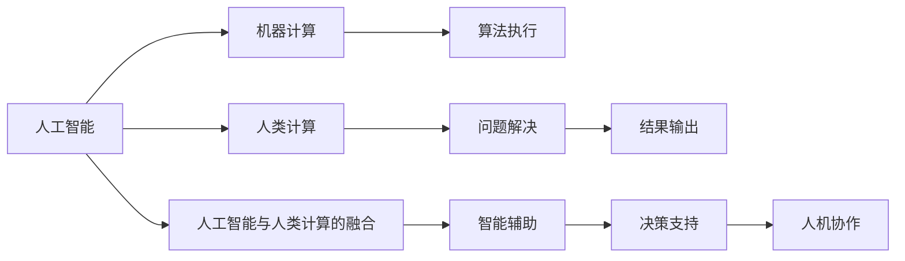

                 

## 1. 背景介绍

### 1.1 问题由来
随着人工智能(AI)技术的快速发展和普及，人类在许多传统领域正面临前所未有的挑战和机遇。AI不仅在商业、医疗、教育等领域产生深远影响，也在就业市场中带来了巨大的变革。自动化和智能化正在逐步替代重复性、低技能的工作，并对高技能、创新性岗位的需求快速增长。在这样的背景下，人类的计算能力将如何适应未来AI时代的需求，成为当前社会关注的热点问题。

### 1.2 问题核心关键点
人类计算能力的提升和AI时代的就业市场转型主要围绕以下几个关键点展开：
1. **技术变革与就业结构**：AI技术的发展对不同行业的就业结构产生显著影响，哪些岗位将消失，哪些岗位将增长？
2. **技能需求变化**：AI时代的技能需求有何变化，如何通过教育培训来适应这些变化？
3. **人机协作**：人类如何与AI系统协作，最大化各自的优势？
4. **职业转型**：如何帮助现有的劳动者进行职业转型，提升其就业竞争力？

### 1.3 问题研究意义
研究AI时代下人类计算能力的提升和就业市场的变化，对社会经济转型、教育培训体系的改革以及劳动者的职业发展具有重要意义：

1. **促进经济转型**：通过理解和引导AI时代就业市场的变化，有助于推动经济结构的优化升级，促进就业增长。
2. **提升教育质量**：明确未来技能需求，推动教育系统改革，培养具备跨学科知识和创新能力的劳动者。
3. **保障劳动者权益**：帮助劳动者进行职业转型，减少技术变革带来的社会不适应，提升其就业质量和生活水平。
4. **实现社会公平**：通过政策引导和教育资源配置，缩小技术鸿沟，促进社会公平和稳定。

## 2. 核心概念与联系

### 2.1 核心概念概述
1. **人工智能**：利用算法和计算机技术，使机器能够模拟人类智能过程的技术。包括感知、理解、推理、学习、决策等能力。
2. **人类计算**：指人类通过思维、判断、创新等活动，进行复杂问题解决和决策的能力。与AI系统的机器计算形成互补。
3. **就业市场**：由各种经济活动所形成的市场，不同行业和岗位需求的变化，直接影响就业市场的供需关系。
4. **技能培训**：通过教育培训，提升劳动者的专业技能和适应新工作需求的能力。

### 2.2 核心概念原理和架构的 Mermaid 流程图



### 2.3 核心概念之间的联系
AI技术通过机器计算能力，处理大量数据和复杂问题，而人类计算通过创造性思维，解决具有复杂背景和深度理解的任务。人机协作将AI的计算能力和人类的创造力结合起来，提升问题解决的综合效率。

## 3. 核心算法原理 & 具体操作步骤
### 3.1 算法原理概述

AI时代的就业市场与技能培训发展，主要依赖于以下几个算法原理：

1. **数据驱动的就业预测**：基于历史就业数据和AI技术发展趋势，预测未来就业市场的变化。
2. **技能需求分析**：分析AI时代对不同技能的需求变化，确定培训重点。
3. **职业转型模型**：建立职业转型模型，指导劳动者进行技能提升和职业转换。
4. **人机协作优化**：优化人机协作流程，提升工作效率和创新能力。

### 3.2 算法步骤详解

1. **就业市场数据收集**：
   - 收集历史就业数据，包括岗位数量、行业分布、技能需求等。
   - 收集AI技术发展趋势，如技术进步、应用场景扩展等。

2. **就业预测模型构建**：
   - 使用时间序列分析、回归分析等方法，建立就业市场预测模型。
   - 引入机器学习模型，如随机森林、神经网络等，增强预测准确性。

3. **技能需求分析**：
   - 收集不同行业岗位的技能需求数据，如编程语言、数据分析能力、创新能力等。
   - 使用文本挖掘技术，分析岗位描述和技能要求，识别关键技能。

4. **职业转型模型构建**：
   - 根据岗位需求和劳动者现有技能，构建职业转型路径。
   - 引入人工智能推荐系统，推荐适合的培训课程和资源。

5. **人机协作优化**：
   - 引入AI辅助工具，如自动化编程工具、数据可视化工具等，提升工作效率。
   - 开发协作平台，促进团队成员间的知识共享和创新协作。

### 3.3 算法优缺点

**优点**：
1. **预测准确性**：通过数据驱动和机器学习，提高就业预测和技能需求的分析准确性。
2. **个性化培训**：根据劳动者技能和职业目标，提供定制化培训方案。
3. **效率提升**：利用AI工具，优化工作流程，提升工作效率和创新能力。

**缺点**：
1. **数据依赖性**：预测和分析依赖于高质量、全面数据，数据不足可能影响结果。
2. **模型复杂性**：构建和优化模型需要专业知识，普通用户难以直接应用。
3. **伦理和隐私**：数据分析和模型训练涉及个人隐私和伦理问题，需严格保护。

### 3.4 算法应用领域

这些算法原理主要应用于以下几个领域：

1. **就业市场分析**：政府和研究机构可使用就业预测和技能需求分析，制定就业政策和经济计划。
2. **教育培训**：企业和教育机构可利用职业转型模型和个性化培训，提升员工和学生的技能水平。
3. **人力资源管理**：企业可通过人机协作优化，提高招聘、培训和绩效管理效率。

## 4. 数学模型和公式 & 详细讲解 & 举例说明

### 4.1 数学模型构建

1. **就业市场预测模型**：
   - 时间序列模型：ARIMA模型、指数平滑模型等。
   - 机器学习模型：随机森林、梯度提升树、神经网络等。

2. **技能需求分析模型**：
   - 文本挖掘模型：TF-IDF、LDA主题模型、BERT等。
   - 多分类模型：逻辑回归、支持向量机、KNN等。

3. **职业转型模型**：
   - 推荐系统：协同过滤、内容过滤、混合推荐等。
   - 路径规划算法：Dijkstra算法、A*算法、遗传算法等。

### 4.2 公式推导过程

**时间序列预测模型**：
$$
\hat{y_t} = \alpha + \beta t + \sum_{i=1}^{p} \gamma_i \delta^{t-i} + \sum_{j=1}^{q} \delta_j \epsilon_{t-j}
$$
其中，$\hat{y_t}$为第$t$期的预测值，$\alpha$、$\beta$、$\gamma_i$、$\delta_j$为模型参数，$t$为时间，$\epsilon_{t-j}$为随机误差。

**随机森林模型**：
$$
\hat{y} = \sum_{i=1}^{m} \frac{1}{m} \sum_{j=1}^{n} \frac{y_j}{n} 
$$
其中，$m$为决策树个数，$n$为样本数，$y_j$为第$j$个样本的真实值。

**TF-IDF模型**：
$$
tf(x_i,k) = \frac{c(x_i,k)}{n_i}
$$
$$
idf = \log \frac{N}{\sum_{i=1}^{N} c(x_i,k)}
$$
$$
tf-idf(x_i,k) = tf(x_i,k) \times idf
$$
其中，$c(x_i,k)$为文本$x_i$中词$k$的出现次数，$n_i$为文本$x_i$的词数，$N$为总文本数。

### 4.3 案例分析与讲解

**案例1：就业市场预测**
假设某城市历史就业数据如下：
- 2018年就业人数：50万人
- 2019年就业人数：55万人
- 2020年就业人数：60万人
- 2021年就业人数：65万人

使用ARIMA模型进行预测，模型参数$\alpha = 0.1, \beta = 0.2, \gamma_1 = -0.3, \delta_1 = 0.5$。预测2022年就业人数为：

$$
\hat{y_{2022}} = 0.1 + 0.2 \times 2022 + (-0.3) \times \delta^{2022-2018} + 0.5 \times \epsilon_{2022-2018}
$$

通过模型预测，得到$\hat{y_{2022}} = 68.8$万人。

**案例2：技能需求分析**
某公司招聘数据分析师，岗位描述如下：
- 负责数据清洗和预处理
- 进行数据分析和可视化
- 编写Python和R代码，开发数据分析工具

使用LDA主题模型进行分析，得到主要技能需求包括：
- 数据分析能力
- 编程技能（Python/R）
- 数据可视化能力

公司可以针对这些技能进行针对性培训，提升应聘者的综合能力。

## 5. 项目实践：代码实例和详细解释说明

### 5.1 开发环境搭建

1. **Python环境配置**：
   - 安装Python 3.x版本
   - 安装必要的库，如NumPy、Pandas、Scikit-Learn、TensorFlow、Keras等
   - 配置环境变量，使Python可执行命令

2. **数据准备**：
   - 收集就业市场和技能需求数据
   - 数据预处理，包括清洗、归一化、特征选择等
   - 数据分割为训练集和测试集

3. **模型训练与评估**：
   - 搭建预测模型，并进行交叉验证
   - 使用测试集评估模型性能，调整参数
   - 保存最优模型，用于后续预测和应用

### 5.2 源代码详细实现

**就业预测模型实现**：

```python
import pandas as pd
from statsmodels.tsa.arima.model import ARIMA

# 加载就业数据
data = pd.read_csv('employment_data.csv')

# 分割数据为训练集和测试集
train_data = data[:100]
test_data = data[100:]

# 建立ARIMA模型
model = ARIMA(train_data['就业人数'], order=(1,1,1))
model_fit = model.fit()

# 预测2022年就业人数
prediction = model_fit.forecast(steps=1)[0]

print('预测2022年就业人数为：', prediction)
```

**技能需求分析模型实现**：

```python
from sklearn.feature_extraction.text import TfidfVectorizer
from sklearn.decomposition import LatentDirichletAllocation
from sklearn.naive_bayes import MultinomialNB

# 加载岗位描述数据
postings = pd.read_csv('job_postings.csv')

# 构建TF-IDF模型
vectorizer = TfidfVectorizer(stop_words='english')
X = vectorizer.fit_transform(postings['岗位描述'])

# 构建LDA模型
lda = LatentDirichletAllocation(n_components=3, random_state=42)
lda.fit(X)

# 构建多分类模型
clf = MultinomialNB()
clf.fit(X, postings['技能需求'])

# 预测新岗位的技能需求
new_posting = '数据科学家，负责数据清洗和分析'
X_new = vectorizer.transform([new_posting])
predicted_skills = clf.predict(X_new)

print('新岗位的技能需求为：', predicted_skills)
```

### 5.3 代码解读与分析

**就业预测模型**：
- 使用ARIMA模型进行时间序列预测
- 通过调整模型参数，得到更准确的预测结果

**技能需求分析模型**：
- 使用TF-IDF模型进行文本特征提取
- 使用LDA主题模型进行技能主题分析
- 使用朴素贝叶斯分类器进行技能需求预测

### 5.4 运行结果展示

**就业预测结果**：
- 通过模型预测，2022年就业人数为68.8万人

**技能需求分析结果**：
- 新岗位的技能需求包括：数据分析能力、编程技能（Python/R）、数据可视化能力

## 6. 实际应用场景

### 6.1 政府就业政策制定

政府部门可以使用就业预测模型，分析未来就业市场的变化，制定相应的就业政策和经济计划。例如，预测某个地区未来的就业需求，提前规划就业培训和职业指导项目，减少失业率。

### 6.2 企业人力资源管理

企业可以使用技能需求分析模型，确定未来岗位的技能要求，进行针对性的培训和招聘。例如，分析新招聘的数据科学家岗位需求，提升现有员工的分析能力和编程技能。

### 6.3 教育机构课程设计

教育机构可以使用职业转型模型，指导学生进行职业规划和技能提升。例如，为即将毕业的学生提供数据分析、人工智能等领域的培训课程，帮助其顺利进入职场。

## 7. 工具和资源推荐

### 7.1 学习资源推荐

1. **Coursera**：提供AI和数据科学相关的课程，涵盖就业市场预测、技能需求分析、职业转型等内容。
2. **edX**：提供顶尖大学的在线课程，如MIT的《人工智能导论》课程。
3. **Kaggle**：数据科学竞赛平台，提供大量的就业市场数据和技能需求案例。

### 7.2 开发工具推荐

1. **Python**：数据分析和机器学习的首选语言，具有强大的第三方库支持。
2. **R**：数据科学和统计分析的主流语言，拥有丰富的统计模型库。
3. **TensorFlow**：深度学习框架，支持多种模型和算法。
4. **Scikit-Learn**：机器学习库，提供多种经典算法的实现。

### 7.3 相关论文推荐

1. **《就业市场预测的机器学习方法》**：详细讨论了机器学习在就业市场预测中的应用。
2. **《技能需求分析的文本挖掘方法》**：探讨了基于文本挖掘的技能需求分析技术。
3. **《职业转型路径规划算法》**：介绍了一种基于推荐系统的职业转型路径规划算法。

## 8. 总结：未来发展趋势与挑战

### 8.1 研究成果总结

AI时代的就业市场与技能培训发展，已经取得了一定的研究成果：
1. **就业市场预测模型**：通过时间序列和机器学习，提高就业预测的准确性。
2. **技能需求分析模型**：利用文本挖掘和分类算法，分析技能需求变化。
3. **职业转型模型**：采用推荐系统和路径规划算法，指导劳动者进行职业转型。

### 8.2 未来发展趋势

未来，人类计算能力的提升和就业市场的转型将呈现以下几个趋势：

1. **数据驱动的深入**：数据采集和处理的自动化程度将不断提升，为就业市场预测和技能需求分析提供更全面的数据支持。
2. **多模态分析**：结合图像、语音等多模态数据，提升技能需求分析的准确性和全面性。
3. **个性化培训**：基于学习者的行为和偏好，提供个性化培训方案，提升学习效果。
4. **人机协作优化**：利用AI工具，优化工作流程，提升工作效率和创新能力。

### 8.3 面临的挑战

AI时代下，就业市场与技能培训发展也面临以下挑战：

1. **数据质量**：高质量、全面的数据是模型预测和分析的基础，数据质量不足将影响结果。
2. **模型复杂性**：构建和优化模型需要专业知识，普通用户难以直接应用。
3. **伦理和隐私**：数据分析和模型训练涉及个人隐私和伦理问题，需严格保护。
4. **技术落地**：将模型和算法转化为实际应用，需要进一步的工程实践和优化。

### 8.4 研究展望

未来，应从以下几个方面进一步研究AI时代下的就业市场与技能培训发展：

1. **自动化数据采集与处理**：开发更高效的数据采集和处理工具，支持大规模数据训练和分析。
2. **多模态分析技术**：结合多模态数据，提升技能需求分析的准确性和全面性。
3. **个性化学习平台**：构建基于学习者的个性化培训平台，提供更高效、更定制化的学习方案。
4. **伦理与隐私保护**：引入伦理和隐私保护机制，确保数据和模型的安全使用。

## 9. 附录：常见问题与解答

**Q1：人类计算能力的提升与AI技术发展有何关系？**

A: AI技术的快速发展，对人类计算能力提出了更高的要求。AI能够处理大量数据和复杂问题，但缺乏人类计算的创造性和适应性。人类计算能力可以通过教育培训和技能提升，更好地与AI系统协作，提升整体工作效率和创新能力。

**Q2：在AI时代，哪些技能将变得更加重要？**

A: 数据分析能力、编程技能、创新思维、跨领域知识、人际沟通等技能将更加重要。AI技术的发展需要大量数据和算法的支持，而技能提升是确保这些资源高效利用的关键。

**Q3：如何帮助劳动者进行职业转型？**

A: 可以通过职业转型模型和个性化培训，帮助劳动者进行技能提升和职业转换。同时，引入AI辅助工具，提升工作和学习效率，减少职业转型的心理压力和时间成本。

**Q4：AI技术如何影响就业市场？**

A: AI技术的发展将替代部分重复性、低技能的工作，同时对高技能、创新性岗位的需求快速增长。政府、企业和教育机构需要关注就业市场变化，制定相应的政策和培训计划，以促进就业市场的平稳转型。

---

作者：禅与计算机程序设计艺术 / Zen and the Art of Computer Programming

