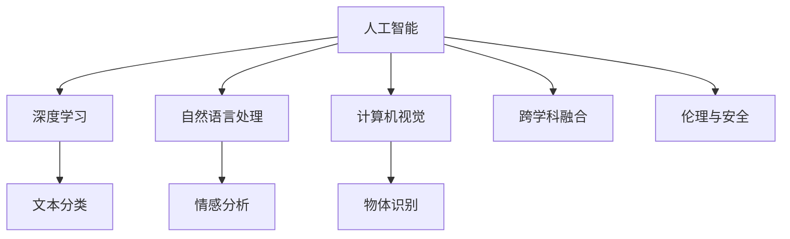

                 

# 人类计算：AI时代的未来技能需求与培训发展

## 1. 背景介绍

随着人工智能(AI)技术的迅猛发展，计算领域正在经历一场深刻的变革。从简单的符号运算到复杂的深度学习模型，计算的任务已经从传统的数值计算向更高级别的智能决策和复杂问题求解转变。这种转变不仅带来了计算能力上的飞跃，也引出了新的计算需求和技能挑战。面对这一挑战，我们需要重新审视计算技能的培训和发展路径，以适应AI时代的要求。

### 1.1 问题由来

AI技术的高速发展，使得传统计算任务变得日益复杂。以往仅依赖算法和数据进行的计算工作，现在越来越多地融合了机器学习、自然语言处理和计算机视觉等技术。这就要求计算人员不仅要具备扎实的算法和数据处理能力，还要熟悉各种AI工具和框架，具备跨领域的知识融合能力。然而，当前的计算教育和培训体系还难以满足这一要求，导致计算人才供需矛盾突出。

### 1.2 问题核心关键点

在AI时代，计算技能的核心关键点包括：

- 跨学科知识融合：AI计算任务往往涉及数学、统计、算法、数据等多个学科知识，计算人员需要具备多学科整合能力。
- 高级编程技能：随着AI技术的发展，高级编程语言如Python、R等成为主流，计算人员需要熟练掌握这些语言及其生态系统。
- 深度学习与机器学习：计算任务越来越多地依赖于深度学习框架，如TensorFlow、PyTorch等，计算人员需要具备深度学习模型构建和调优能力。
- 自然语言处理与文本挖掘：自然语言理解和文本挖掘技术在AI应用中越来越重要，计算人员需要掌握相关技术和工具。
- 视觉与图像处理：计算机视觉技术在AI应用中广泛应用，计算人员需要了解图像处理和计算机视觉的基本原理和算法。
- 人工智能伦理与安全：AI技术的普及带来了伦理和安全问题，计算人员需要具备人工智能伦理和安全的知识，了解数据隐私和算法透明度的要求。

## 2. 核心概念与联系

### 2.1 核心概念概述

为了更好地理解AI时代计算技能的需求，本节将介绍几个关键概念：

- 人工智能(AI)：指能够执行智能决策、学习和推理的计算技术，涵盖机器学习、深度学习、自然语言处理等多个领域。
- 深度学习(Deep Learning)：指通过多层神经网络对数据进行复杂建模和学习的技术，常用于图像、语音和自然语言处理等任务。
- 自然语言处理(Natural Language Processing, NLP)：指使计算机能够理解、处理和生成自然语言的技术，涵盖语言模型、文本分类、情感分析等任务。
- 计算机视觉(Computer Vision)：指使计算机能够理解和分析图像和视频的技术，涵盖图像分割、目标检测、物体识别等任务。
- 跨学科融合：指在多个学科之间整合知识和技术，以解决复杂的计算问题。
- 伦理与安全：指在使用AI技术时，考虑数据隐私、算法透明性和社会影响等方面的问题。

这些核心概念之间的逻辑关系可以通过以下Mermaid流程图来展示：



这个流程图展示了AI技术覆盖的主要领域以及它们之间的联系。深度学习、自然语言处理和计算机视觉等技术是AI的核心组成部分，而跨学科融合和伦理与安全则是AI应用时需要考虑的重要方面。

## 3. 核心算法原理 & 具体操作步骤

### 3.1 算法原理概述

AI时代的计算技能培训，需要理解AI技术的核心算法原理，并掌握实际操作技巧。以下将简要介绍几个关键算法：

- 深度学习算法：包括神经网络、卷积神经网络(CNN)、循环神经网络(RNN)、变分自编码器(VAE)等，这些算法是构建AI模型的基础。
- 自然语言处理算法：包括词嵌入(Word Embedding)、语言模型(LM)、序列标注、文本生成等，这些算法用于处理和分析自然语言数据。
- 计算机视觉算法：包括图像处理、特征提取、目标检测、物体识别等，这些算法用于分析和理解图像数据。
- 强化学习算法：用于训练智能体(Agent)进行决策和优化，常用于游戏、机器人控制等领域。

### 3.2 算法步骤详解

AI时代的计算技能培训，主要包括以下几个关键步骤：

**Step 1: 理论知识学习**

- 学习计算机科学和数学基础，包括数据结构、算法、线性代数、概率论和统计学等。
- 学习AI技术的基础理论，包括机器学习、深度学习、自然语言处理、计算机视觉等领域的经典算法。

**Step 2: 工具与框架使用**

- 熟练掌握Python、R等主流编程语言，了解其生态系统和常用库。
- 学习使用TensorFlow、PyTorch、Keras等深度学习框架，掌握模型构建和训练的基本技巧。
- 学习使用NLP工具库，如NLTK、SpaCy等，掌握文本预处理和分析的基本技巧。
- 学习使用计算机视觉库，如OpenCV、Pillow等，掌握图像处理和分析的基本技巧。

**Step 3: 实践与项目开发**

- 参与实际项目，实践AI技术的各种应用场景，如文本分类、情感分析、图像识别等。
- 进行模型调优和性能评估，掌握模型选择、训练、调参和优化的方法。
- 进行数据预处理和特征工程，掌握数据清洗、特征提取和转换的技巧。
- 进行系统集成和部署，掌握数据流设计、API接口开发和系统部署的技巧。

**Step 4: 跨学科知识整合**

- 学习跨学科知识，如生物信息学、金融工程、医疗数据科学等，理解AI在这些领域的实际应用。
- 参与跨学科项目，锻炼跨学科知识整合和应用的能力。
- 参加学术交流和行业会议，了解前沿技术和应用趋势。

### 3.3 算法优缺点

AI时代的计算技能培训，具有以下优点：

- 多学科整合：通过学习多个学科的知识，培养跨学科的整合能力。
- 实用性强：理论与实践相结合，提升实际问题解决能力。
- 前沿性高：学习前沿技术，保持知识更新和技能领先。

但同时也存在以下缺点：

- 学习难度大：需要掌握多门学科和多种技术，学习曲线较陡。
- 实践成本高：需要投入大量时间和资源进行实践和项目开发。
- 知识更新快：AI技术发展迅速，需要不断学习新知识和技能。

## 4. 数学模型和公式 & 详细讲解 & 举例说明

### 4.1 数学模型构建

在AI计算中，数学模型是不可或缺的一部分。以下将介绍几个核心数学模型：

- 神经网络：包括前向传播、反向传播、梯度下降等算法。
- 卷积神经网络(CNN)：包括卷积、池化、激活函数等算法。
- 循环神经网络(RNN)：包括LSTM、GRU等算法。
- 深度学习框架：包括TensorFlow、PyTorch等框架中内置的数学模型和算法。

### 4.2 公式推导过程

以下是深度学习中几个重要公式的推导过程：

**神经网络前向传播公式**：

$$
y = Wx + b
$$

其中，$y$ 表示输出，$W$ 表示权重矩阵，$x$ 表示输入，$b$ 表示偏置向量。

**神经网络反向传播公式**：

$$
\frac{\partial L}{\partial W} = \frac{\partial L}{\partial y} \frac{\partial y}{\partial z} \frac{\partial z}{\partial W}
$$

其中，$L$ 表示损失函数，$z$ 表示中间变量，$\frac{\partial L}{\partial y}$ 表示输出层误差，$\frac{\partial y}{\partial z}$ 表示激活函数导数，$\frac{\partial z}{\partial W}$ 表示权重更新公式。

**卷积神经网络卷积公式**：

$$
\begin{aligned}
y &= \sum_{i,j}\left(W_{i,j} \cdot x_{k-i,j} + b_{i,j}\right) \\
&= \sum_{i,j}\left(W_{i,j} \cdot x_{k-i,j} + b_{i,j}\right) + c
\end{aligned}
$$

其中，$y$ 表示输出，$W_{i,j}$ 表示卷积核，$x_{k-i,j}$ 表示输入，$b_{i,j}$ 表示偏置，$c$ 表示常数项。

**深度学习框架中的自动微分公式**：

$$
\frac{\partial L}{\partial W} = \frac{\partial L}{\partial y} \frac{\partial y}{\partial z} \frac{\partial z}{\partial W}
$$

其中，$\frac{\partial L}{\partial y}$ 表示损失函数对输出的梯度，$\frac{\partial y}{\partial z}$ 表示中间变量对输出的梯度，$\frac{\partial z}{\partial W}$ 表示权重更新公式。

### 4.3 案例分析与讲解

以图像分类为例，说明深度学习模型的构建和训练过程：

**数据准备**：
- 收集并预处理图像数据集，如MNIST、CIFAR等。
- 将图像数据转换为模型可接受的张量格式。

**模型定义**：
- 定义卷积神经网络模型，包括卷积层、池化层、全连接层等。
- 定义损失函数和优化器，如交叉熵损失函数、Adam优化器等。

**模型训练**：
- 使用训练数据集对模型进行前向传播和反向传播，计算损失函数。
- 根据损失函数更新模型参数，使用梯度下降算法进行优化。
- 使用验证数据集评估模型性能，调整超参数。

**模型评估**：
- 使用测试数据集评估模型性能，计算准确率和损失函数。
- 可视化模型训练过程和性能变化，优化模型结构。

## 5. 项目实践：代码实例和详细解释说明

### 5.1 开发环境搭建

在进行项目实践前，我们需要准备好开发环境。以下是使用Python进行PyTorch开发的环境配置流程：

1. 安装Anaconda：从官网下载并安装Anaconda，用于创建独立的Python环境。

2. 创建并激活虚拟环境：
```bash
conda create -n pytorch-env python=3.8 
conda activate pytorch-env
```

3. 安装PyTorch：根据CUDA版本，从官网获取对应的安装命令。例如：
```bash
conda install pytorch torchvision torchaudio cudatoolkit=11.1 -c pytorch -c conda-forge
```

4. 安装Transformers库：
```bash
pip install transformers
```

5. 安装各类工具包：
```bash
pip install numpy pandas scikit-learn matplotlib tqdm jupyter notebook ipython
```

完成上述步骤后，即可在`pytorch-env`环境中开始项目实践。

### 5.2 源代码详细实现

这里以图像分类为例，给出使用PyTorch进行深度学习模型开发的完整代码实现。

```python
import torch
import torch.nn as nn
import torch.optim as optim
import torchvision.transforms as transforms
import torchvision.datasets as datasets
import matplotlib.pyplot as plt

# 定义模型
class ConvNet(nn.Module):
    def __init__(self):
        super(ConvNet, self).__init__()
        self.conv1 = nn.Conv2d(3, 32, 3, 1, 1)
        self.conv2 = nn.Conv2d(32, 64, 3, 1, 1)
        self.fc1 = nn.Linear(9216, 128)
        self.fc2 = nn.Linear(128, 10)
        
    def forward(self, x):
        x = torch.relu(self.conv1(x))
        x = torch.max_pool2d(x, 2, 2)
        x = torch.relu(self.conv2(x))
        x = torch.max_pool2d(x, 2, 2)
        x = x.view(-1, 9216)
        x = torch.relu(self.fc1(x))
        x = self.fc2(x)
        return x

# 定义损失函数和优化器
model = ConvNet()
criterion = nn.CrossEntropyLoss()
optimizer = optim.Adam(model.parameters(), lr=0.001)

# 数据准备
transform = transforms.Compose([
    transforms.ToTensor(),
    transforms.Normalize((0.5, 0.5, 0.5), (0.5, 0.5, 0.5))
])
trainset = datasets.CIFAR10(root='./data', train=True, download=True, transform=transform)
trainloader = torch.utils.data.DataLoader(trainset, batch_size=4, shuffle=True, num_workers=2)

# 训练过程
for epoch in range(2):
    running_loss = 0.0
    for i, data in enumerate(trainloader, 0):
        inputs, labels = data
        optimizer.zero_grad()
        outputs = model(inputs)
        loss = criterion(outputs, labels)
        loss.backward()
        optimizer.step()
        running_loss += loss.item()
        if i % 2000 == 1999:
            print('[%d, %5d] loss: %.3f' %
                  (epoch + 1, i + 1, running_loss / 2000))
            running_loss = 0.0

# 模型评估
correct = 0
total = 0
with torch.no_grad():
    for data in testloader:
        images, labels = data
        outputs = model(images)
        _, predicted = torch.max(outputs.data, 1)
        total += labels.size(0)
        correct += (predicted == labels).sum().item()

print('Accuracy of the network on the 10000 test images: %d %%' % (
    100 * correct / total))
```

以上代码展示了使用PyTorch进行卷积神经网络训练的基本步骤。在实际开发中，还需要根据具体需求进行扩展和优化。

### 5.3 代码解读与分析

让我们再详细解读一下关键代码的实现细节：

**ConvNet类**：
- 定义卷积神经网络模型，包括卷积层、池化层、全连接层等。
- 在`forward`方法中，对输入数据进行前向传播计算。

**损失函数和优化器**：
- 定义交叉熵损失函数，用于计算模型的预测误差。
- 使用Adam优化器，对模型参数进行优化。

**数据准备**：
- 使用`torchvision.transforms`模块对图像数据进行预处理。
- 使用`torchvision.datasets`模块加载CIFAR-10数据集。
- 使用`torch.utils.data.DataLoader`模块加载训练集和测试集，并进行批处理和随机打乱。

**训练过程**：
- 在每个epoch内，对训练集进行前向传播和反向传播，计算损失函数。
- 根据损失函数更新模型参数，使用Adam优化器进行优化。
- 定期打印训练过程中的损失值，以便进行监控和调试。

**模型评估**：
- 使用测试集对模型进行评估，计算模型的准确率。
- 打印模型在测试集上的准确率，以便进行性能比较。

## 6. 实际应用场景

### 6.1 医疗数据分析

在医疗领域，AI技术已经开始广泛应用于疾病诊断、个性化治疗、药物研发等方面。通过计算技能培训，医疗专业人员可以更好地理解和应用这些AI技术。

**具体场景**：
- 疾病诊断：利用深度学习模型对医学影像进行分析和诊断，如X光片、CT、MRI等。
- 个性化治疗：利用自然语言处理技术对电子病历进行分析和理解，提供个性化治疗建议。
- 药物研发：利用计算机视觉技术对分子结构进行分析，加速新药研发进程。

**技术需求**：
- 深度学习模型构建和训练。
- 医学影像处理和分析。
- 自然语言处理和文本挖掘。
- 跨学科知识整合。

### 6.2 金融风险预测

在金融领域，AI技术已经开始应用于风险预测、投资分析、智能投顾等方面。通过计算技能培训，金融专业人员可以更好地理解和应用这些AI技术。

**具体场景**：
- 风险预测：利用机器学习模型对市场数据进行分析和预测，防范金融风险。
- 投资分析：利用自然语言处理技术对新闻、公告、社交媒体等信息进行分析和理解，辅助投资决策。
- 智能投顾：利用智能算法进行投资组合优化和动态调整，提高投资收益。

**技术需求**：
- 机器学习模型构建和训练。
- 数据预处理和特征工程。
- 自然语言处理和文本分析。
- 跨学科知识整合。

### 6.3 智能客服系统

在客户服务领域，AI技术已经开始应用于智能客服、对话系统、情感分析等方面。通过计算技能培训，客服人员可以更好地理解和应用这些AI技术。

**具体场景**：
- 智能客服：利用深度学习模型对客户咨询进行自动答复和处理。
- 对话系统：利用自然语言处理技术进行多轮对话，提高客户满意度。
- 情感分析：利用文本挖掘技术对客户反馈进行情感分析，优化服务质量。

**技术需求**：
- 深度学习模型构建和训练。
- 自然语言处理和文本挖掘。
- 对话系统设计和开发。
- 跨学科知识整合。

### 6.4 未来应用展望

随着AI技术的发展，计算技能培训将不断拓展新的应用场景，为各行各业带来新的变革：

- 自动驾驶：利用计算机视觉技术对传感器数据进行分析和处理，实现自动驾驶。
- 智能家居：利用自然语言处理技术对语音指令进行理解和执行，提高家居智能化水平。
- 智慧城市：利用AI技术进行交通管理、环境监测、公共安全等城市管理，提升城市治理能力。

## 7. 工具和资源推荐

### 7.1 学习资源推荐

为了帮助开发者系统掌握计算技能，以下是一些优质的学习资源：

1. 《深度学习》（Goodfellow et al., 2016）：深度学习领域的经典教材，涵盖深度学习算法和应用。
2. 《Python深度学习》（Francois et al., 2017）：介绍深度学习技术及其在Python中的实现。
3. 《自然语言处理综论》（Nitin Madnani, 2016）：涵盖自然语言处理和文本挖掘技术的经典教材。
4. 《计算机视觉：算法与应用》（Richard Szeliski, 2010）：计算机视觉领域的经典教材，涵盖图像处理和计算机视觉算法。
5. Coursera的《机器学习》课程：斯坦福大学开设的机器学习课程，有Lecture视频和配套作业，带你入门机器学习基础。
6. edX的《人工智能基础》课程：麻省理工学院开设的AI入门课程，涵盖AI基本概念和应用。

### 7.2 开发工具推荐

高效的开发离不开优秀的工具支持。以下是几款用于计算技能开发的常用工具：

1. PyTorch：基于Python的开源深度学习框架，灵活动态的计算图，适合快速迭代研究。大部分深度学习框架都有PyTorch版本的实现。
2. TensorFlow：由Google主导开发的开源深度学习框架，生产部署方便，适合大规模工程应用。
3. Transformers库：HuggingFace开发的NLP工具库，集成了众多SOTA语言模型，支持PyTorch和TensorFlow，是进行计算技能开发的利器。
4. Weights & Biases：模型训练的实验跟踪工具，可以记录和可视化模型训练过程中的各项指标，方便对比和调优。
5. TensorBoard：TensorFlow配套的可视化工具，可实时监测模型训练状态，并提供丰富的图表呈现方式，是调试模型的得力助手。

### 7.3 相关论文推荐

计算技能的发展源于学界的持续研究。以下是几篇奠基性的相关论文，推荐阅读：

1. LeCun, Y., Bottou, L., Bengio, Y., & Haffner, P. (1998). Gradient-based learning applied to document recognition. Proceedings of the IEEE.
2. Hinton, G. E., Osindero, S., & Teh, Y. W. (2006). A fast learning algorithm for deep belief nets. Neural Computation, 18(7), 1527-1554.
3. Sutskever, I., Vinyals, O., & Le, Q. V. (2014). Sequence to sequence learning with neural networks. Proceedings of the International Conference on Machine Learning (ICML).
4. Goodfellow, I., Bengio, Y., & Courville, A. (2016). Deep learning. MIT Press.
5. Sermanet, P., Chintala, S., Girshick, R., & Darrell, T. (2014). OverFeaturizing convolutional neural networks: A descriptive and quantitative analysis. Proceedings of the International Conference on Computer Vision (ICCV).

这些论文代表了大计算技能发展的方向，通过学习这些前沿成果，可以帮助研究者把握学科前进方向，激发更多的创新灵感。

## 8. 总结：未来发展趋势与挑战

### 8.1 总结

本文对AI时代的计算技能需求进行了全面系统的介绍。首先阐述了AI技术的发展趋势和计算技能的需求，明确了计算技能培训的重要性和紧迫性。其次，从理论到实践，详细讲解了计算技能培训的数学原理和操作步骤，给出了计算技能开发的完整代码实例。同时，本文还广泛探讨了计算技能在医疗、金融、智能客服等多个领域的应用前景，展示了计算技能培训的广阔前景。最后，本文精选了计算技能培训的学习资源，力求为开发者提供全方位的技术指引。

通过本文的系统梳理，可以看到，AI时代的计算技能培训正面临新的挑战和机遇。计算人员不仅需要掌握传统的算法和数据处理技能，还要熟悉多种AI技术，具备跨学科知识整合和应用的能力。这要求教育机构和培训体系进行全面更新，以适应新的技术要求。只有不断创新，才能培养出符合AI时代需求的计算人才，推动计算技术的持续进步。

### 8.2 未来发展趋势

展望未来，计算技能培训将呈现以下几个发展趋势：

1. 跨学科知识融合：随着AI技术的深入发展，跨学科知识整合将成为计算技能培训的重要内容。计算人员需要掌握多门学科的知识，培养跨学科的整合能力。
2. 数据驱动的培训：计算技能培训将更加注重数据驱动，利用大规模数据进行模型训练和评估，提升实际问题解决能力。
3. 深度学习与机器学习：深度学习与机器学习将成为计算技能培训的核心内容，涵盖算法原理、模型构建和调优等环节。
4. 自然语言处理与文本挖掘：自然语言处理与文本挖掘技术将广泛应用于计算技能培训中，涵盖语言模型、文本分类、情感分析等任务。
5. 计算机视觉与图像处理：计算机视觉与图像处理技术将广泛应用于计算技能培训中，涵盖图像分割、目标检测、物体识别等任务。
6. 人工智能伦理与安全：人工智能伦理与安全将成为计算技能培训的重要内容，涵盖数据隐私、算法透明性和社会影响等方面的知识。

以上趋势凸显了计算技能培训的广泛性和前沿性，这要求教育机构和培训体系进行全面更新，以适应新的技术要求。只有不断创新，才能培养出符合AI时代需求的计算人才，推动计算技术的持续进步。

### 8.3 面临的挑战

尽管计算技能培训取得了一定的进展，但在迈向更加智能化、普适化应用的过程中，它仍面临着诸多挑战：

1. 学习难度大：计算技能培训需要掌握多门学科和多种技术，学习曲线较陡。
2. 实践成本高：需要投入大量时间和资源进行实践和项目开发，成本较高。
3. 知识更新快：AI技术发展迅速，需要不断学习新知识和技能，更新培训内容。
4. 跨学科整合难：跨学科知识整合需要克服学科之间的壁垒，找到有效的整合方法。
5. 数据隐私问题：在计算技能培训中，需要考虑数据隐私和安全性，确保数据安全。
6. 算法透明性：计算技能培训需要解决算法透明性的问题，确保算法的可解释性和可控性。

## 8.4 研究展望

面对计算技能培训面临的挑战，未来的研究需要在以下几个方面寻求新的突破：

1. 开发新的计算技能培训课程：针对不同领域和岗位需求，设计更加全面、实用和前沿的计算技能培训课程。
2. 引入更多的实践环节：通过项目实践、实习、竞赛等方式，提升计算技能培训的实用性和实践性。
3. 跨学科知识整合方法：开发跨学科整合的培训方法，提高计算技能培训的效果。
4. 数据隐私和安全保护：在计算技能培训中引入数据隐私和安全保护的知识和方法。
5. 算法透明性和可解释性：研究算法透明性和可解释性问题，提高计算技能培训的透明度和可信度。

这些研究方向的探索，将推动计算技能培训走向更高的台阶，为各行各业培养出更多的AI技术人才，推动计算技术的持续进步。

## 9. 附录：常见问题与解答

**Q1：计算技能培训需要多长时间？**

A: 计算技能培训需要根据个人基础和具体需求进行灵活安排。一般建议至少进行数月的系统学习，涵盖理论知识、工具使用和项目实践等多个环节。

**Q2：计算技能培训的难度大吗？**

A: 计算技能培训需要掌握多门学科和多种技术，学习曲线较陡。但通过系统的学习和实践，可以逐步掌握相关知识，提升计算能力。

**Q3：计算技能培训需要哪些资源？**

A: 计算技能培训需要计算资源、数据资源、学习资源和实践资源等多种资源。建议建立独立的Python环境，使用TensorFlow、PyTorch等深度学习框架，获取大规模数据集和模型，参加线上线下的培训课程。

**Q4：计算技能培训是否有捷径？**

A: 计算技能培训需要扎实的基础和不断的实践。没有捷径，只有通过系统的学习和实践，才能逐步掌握相关技能，成为合格的计算人员。

**Q5：计算技能培训如何与实际应用结合？**

A: 计算技能培训需要与实际应用结合，通过项目实践、实习、竞赛等方式，将理论知识应用到实际问题中。同时，需要了解行业需求，不断更新培训内容，确保培训内容的实用性和前沿性。

---

作者：禅与计算机程序设计艺术 / Zen and the Art of Computer Programming

