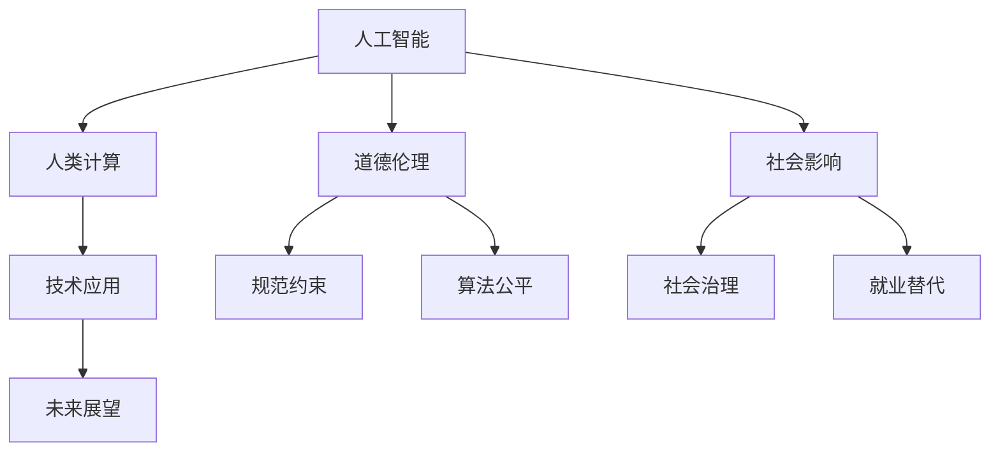

                 

# 人类计算：AI时代的道德和社会影响

> 关键词：人工智能,人类计算,道德伦理,社会影响,技术应用,未来展望

## 1. 背景介绍

### 1.1 问题由来

随着人工智能技术的快速发展，尤其是深度学习和神经网络等先进算法的应用，人类计算（Human Computation）正在经历前所未有的变革。机器智能的提升不仅改变了人类的生产生活方式，也对社会的道德伦理和治理结构产生了深远影响。

当前，AI技术广泛应用于医疗、金融、教育、娱乐等多个领域，极大地提升了效率和生产力。然而，在享受技术带来的便利的同时，我们也需要面对一系列新的挑战，如数据隐私、算法偏见、就业替代等。如何科学合理地应用AI技术，平衡技术进步与道德伦理，是每个社会成员需要思考的问题。

### 1.2 问题核心关键点

人类计算的核心问题主要集中在以下几个方面：

1. **数据隐私保护**：AI模型依赖大量数据进行训练，如何在数据利用和隐私保护之间找到平衡，防止个人信息泄露，是AI应用中一个重要的伦理问题。
2. **算法偏见与公平性**：AI模型往往学习并放大训练数据的固有偏见，导致输出结果的不公平，如在招聘、贷款等场景下产生歧视性决策。
3. **技术失业**：AI和自动化技术可能会替代部分低技能劳动岗位，如何应对由此带来的就业挑战，是社会经济结构调整的重要课题。
4. **道德决策**：AI在涉及伦理道德的场景（如自动驾驶、医疗诊断等）中如何做出符合人类价值观的决策，是需要深入探讨的问题。
5. **技术治理**：如何构建透明、公正的AI治理框架，确保技术应用的安全性和可控性，是社会治理的一个重要方向。

### 1.3 问题研究意义

研究人类计算的道德和社会影响，对于确保AI技术的健康发展，维护社会公平正义，构建智能社会的治理体系，具有重要意义：

1. **保障数据隐私**：合理规范数据使用，确保个人信息安全，维护社会公信力。
2. **促进算法公平**：揭示并减少算法偏见，保障不同群体享有平等机会，提升社会公平性。
3. **缓解就业压力**：通过技术创新和政策引导，实现劳动力市场的平稳过渡，提升社会整体就业水平。
4. **增强道德决策**：确保AI决策过程透明、可解释，符合人类伦理道德标准，增强社会对新技术的信任。
5. **构建智能治理**：建立智能时代的治理框架，提升政府管理效能，促进社会可持续发展。

## 2. 核心概念与联系

### 2.1 核心概念概述

为了更好地理解AI时代的道德和社会影响，本节将介绍几个密切相关的核心概念：

- **人工智能（AI）**：一种模仿人类智能的技术体系，通过算法和数据训练，实现语音识别、图像处理、自然语言理解等智能行为。
- **人类计算（Human Computation）**：利用AI技术处理和分析海量数据，辅助人类进行计算和决策，提升效率和准确性。
- **道德伦理（Ethics & Morality）**：在AI应用中，确保技术决策符合人类伦理价值观，如公正、透明、尊重隐私等。
- **社会影响（Social Impact）**：AI技术应用对社会结构、就业市场、教育培训等方面的广泛影响。
- **技术应用（Technical Application）**：AI技术在不同领域的具体应用场景，如医疗、金融、教育、智能家居等。
- **未来展望（Future Outlook）**：AI技术未来发展的趋势和潜在的社会影响，以及需要应对的挑战和策略。

这些核心概念之间的逻辑关系可以通过以下Mermaid流程图来展示：



这个流程图展示了几大核心概念及其之间的关系：

1. 人工智能通过人类计算进行高效的数据处理和决策支持。
2. 道德伦理规范约束AI的应用，确保技术决策符合社会价值观。
3. 社会影响涉及AI应用对就业、教育等方面的广泛影响。
4. 技术应用涵盖AI在医疗、金融等多个领域的具体场景。
5. 未来展望探讨AI技术的发展趋势和潜在影响。

这些概念共同构成了AI时代的道德和社会影响的框架，使得我们能够更好地理解和应对AI技术带来的复杂影响。

## 3. 核心算法原理 & 具体操作步骤
### 3.1 算法原理概述

人类计算的核心算法原理基于AI技术的知识表示和推理能力。其核心思想是：通过高效的数据处理和智能决策，辅助人类进行复杂计算，提高效率和准确性。在实际应用中，常见的算法包括机器学习、深度学习、强化学习等。

以深度学习为例，人类计算的基本流程如下：

1. **数据预处理**：清洗和准备数据，分为训练集、验证集和测试集。
2. **模型选择与训练**：选择合适的神经网络架构，在训练集上进行模型训练。
3. **模型评估与调整**：在验证集上评估模型性能，根据评估结果调整模型参数。
4. **模型应用**：在测试集或实际应用中，使用训练好的模型进行数据处理和决策。

### 3.2 算法步骤详解

人类计算的详细步骤可以细化为以下几步：

1. **数据准备**：
   - 收集和清洗数据：包括数据预处理、数据标注、数据增强等。
   - 划分数据集：将数据划分为训练集、验证集和测试集，确保数据的多样性和代表性。

2. **模型构建**：
   - 选择模型架构：根据任务需求选择合适的神经网络结构，如卷积神经网络（CNN）、循环神经网络（RNN）、变分自编码器（VAE）等。
   - 配置模型参数：包括学习率、批量大小、优化器等。

3. **模型训练**：
   - 前向传播：将输入数据送入模型，得到预测结果。
   - 损失计算：计算预测结果与真实标签之间的损失。
   - 反向传播：根据损失计算梯度，更新模型参数。
   - 迭代优化：不断重复前向传播和反向传播，直至收敛。

4. **模型评估**：
   - 在验证集上评估模型性能：包括准确率、召回率、F1分数等指标。
   - 调整模型参数：根据评估结果调整学习率、正则化系数等参数。

5. **模型应用**：
   - 部署模型：将训练好的模型部署到实际应用环境中，进行数据处理和决策。
   - 监控模型性能：实时监测模型性能，发现问题并及时调整。

### 3.3 算法优缺点

人类计算的主要优点包括：

- **高效性**：利用AI技术处理海量数据，显著提升计算和决策效率。
- **准确性**：通过深度学习等先进算法，提高数据分析和决策的准确性。
- **可扩展性**：利用分布式计算等技术，实现模型的快速部署和扩展。

然而，该方法也存在以下缺点：

- **数据依赖性**：模型的性能高度依赖于训练数据的质量和数量。
- **模型复杂性**：深度学习等算法模型较为复杂，训练和调参成本高。
- **解释性不足**：AI模型的决策过程缺乏可解释性，难以理解和调试。
- **偏差与偏见**：模型可能学习并放大训练数据的固有偏差，导致不公平决策。
- **隐私风险**：大量数据的使用可能带来隐私泄露的风险。

### 3.4 算法应用领域

人类计算技术已经在医疗、金融、教育、安全等多个领域得到了广泛应用，产生了显著的社会影响：

- **医疗健康**：AI辅助诊断、智能问诊、健康管理等。通过高效的数据分析，提升诊断准确性和治疗效果。
- **金融服务**：风险控制、智能投顾、信贷评估等。利用AI进行精准分析和预测，优化金融产品和服务。
- **教育培训**：个性化教学、智能评估、学习分析等。提升教育资源分配和教学效果。
- **公共安全**：监控识别、风险预警、灾害预测等。利用AI进行数据分析和预警，提升公共安全水平。
- **智能家居**：智能控制、环境监测、设备联动等。提升家居智能化和生活便捷性。

这些应用展示了人类计算技术的广泛潜力，同时也需要我们深入探讨其在不同领域中的道德和社会影响。

## 4. 数学模型和公式 & 详细讲解 & 举例说明（备注：数学公式请使用latex格式，latex嵌入文中独立段落使用 $$，段落内使用 $)
### 4.1 数学模型构建

人类计算的核心数学模型基于神经网络的知识表示和推理能力。以深度学习为例，神经网络主要由输入层、隐藏层和输出层组成。其中，隐藏层通过一系列权重和偏置进行数据变换和特征提取，最终输出预测结果。

设神经网络的输入为 $x$，隐藏层为 $h$，输出为 $y$，则神经网络的预测函数为：

$$
y = f(h) = g(W_hx + b_h)
$$

其中，$W_h$ 为隐藏层的权重矩阵，$b_h$ 为偏置向量，$g$ 为激活函数，$x$ 为输入数据。

### 4.2 公式推导过程

深度学习中的反向传播算法是求解神经网络参数优化问题的核心算法。其基本思想是通过链式法则计算损失函数对参数的梯度，从而更新模型参数，优化模型性能。

假设神经网络中，隐藏层 $h$ 和输出层 $y$ 的损失函数为 $L$，则反向传播算法的具体步骤如下：

1. **前向传播**：将输入数据 $x$ 通过神经网络，得到输出结果 $y$。
2. **损失计算**：计算输出结果 $y$ 与真实标签 $y^*$ 之间的损失 $L$。
3. **反向传播**：利用链式法则，计算损失 $L$ 对隐藏层 $h$ 和输入层 $x$ 的梯度。
4. **参数更新**：根据梯度更新隐藏层权重 $W_h$ 和偏置 $b_h$。

反向传播算法的具体公式如下：

$$
\frac{\partial L}{\partial W_h} = \frac{\partial L}{\partial y} \frac{\partial y}{\partial h} \frac{\partial h}{\partial W_h}
$$

$$
\frac{\partial L}{\partial b_h} = \frac{\partial L}{\partial y} \frac{\partial y}{\partial h}
$$

其中，$\frac{\partial y}{\partial h}$ 和 $\frac{\partial h}{\partial W_h}$ 为激活函数和权重矩阵的梯度。

### 4.3 案例分析与讲解

以图像分类任务为例，假设神经网络包含两个隐藏层 $h_1$ 和 $h_2$，输出层为 $y$，输入数据为 $x$，损失函数为交叉熵损失 $L(y, y^*)$。

1. **前向传播**：
   - 输入层：$x$。
   - 隐藏层 $h_1$：$h_1 = g(W_{h1}x + b_{h1})$。
   - 隐藏层 $h_2$：$h_2 = g(W_{h2}h_1 + b_{h2})$。
   - 输出层 $y$：$y = g(W_yh_2 + b_y)$。

2. **损失计算**：
   - 交叉熵损失 $L(y, y^*) = -\frac{1}{N}\sum_{i=1}^N [y_i^*log(y_i) + (1-y_i^*)log(1-y_i)]$。

3. **反向传播**：
   - 输出层：$\frac{\partial L}{\partial y} = -\frac{1}{N}\sum_{i=1}^N [y_i^* - y_i]$。
   - 隐藏层 $h_2$：$\frac{\partial L}{\partial h_2} = \frac{\partial L}{\partial y} \frac{\partial y}{\partial h_2}$。
   - 隐藏层 $h_1$：$\frac{\partial L}{\partial h_1} = \frac{\partial L}{\partial h_2} \frac{\partial h_2}{\partial h_1}$。
   - 输入层 $x$：$\frac{\partial L}{\partial x} = \frac{\partial L}{\partial h_1} \frac{\partial h_1}{\partial x}$。

4. **参数更新**：
   - 隐藏层 $h_1$ 的权重更新：$W_{h1} \leftarrow W_{h1} - \eta\frac{\partial L}{\partial W_{h1}}$。
   - 隐藏层 $h_1$ 的偏置更新：$b_{h1} \leftarrow b_{h1} - \eta\frac{\partial L}{\partial b_{h1}}$。
   - 隐藏层 $h_2$ 的权重更新：$W_{h2} \leftarrow W_{h2} - \eta\frac{\partial L}{\partial W_{h2}}$。
   - 隐藏层 $h_2$ 的偏置更新：$b_{h2} \leftarrow b_{h2} - \eta\frac{\partial L}{\partial b_{h2}}$。
   - 输出层 $y$ 的权重更新：$W_y \leftarrow W_y - \eta\frac{\partial L}{\partial W_y}$。
   - 输出层 $y$ 的偏置更新：$b_y \leftarrow b_y - \eta\frac{\partial L}{\partial b_y}$。

通过这些步骤，我们可以高效地训练神经网络，优化模型性能。

## 5. 项目实践：代码实例和详细解释说明
### 5.1 开发环境搭建

在进行人类计算项目实践前，我们需要准备好开发环境。以下是使用Python进行TensorFlow开发的环境配置流程：

1. 安装Anaconda：从官网下载并安装Anaconda，用于创建独立的Python环境。

2. 创建并激活虚拟环境：
```bash
conda create -n tf-env python=3.8 
conda activate tf-env
```

3. 安装TensorFlow：根据CUDA版本，从官网获取对应的安装命令。例如：
```bash
conda install tensorflow -c conda-forge
```

4. 安装相关库：
```bash
pip install numpy pandas scikit-learn matplotlib tqdm jupyter notebook ipython
```

完成上述步骤后，即可在`tf-env`环境中开始项目实践。

### 5.2 源代码详细实现

下面我以图像分类任务为例，给出使用TensorFlow进行深度学习模型训练的PyTorch代码实现。

首先，定义神经网络结构：

```python
import tensorflow as tf
from tensorflow.keras import layers, models

class ImageNetModel(models.Model):
    def __init__(self):
        super(ImageNetModel, self).__init__()
        self.conv1 = layers.Conv2D(32, (3,3), activation='relu', padding='same')
        self.pool1 = layers.MaxPooling2D((2,2))
        self.conv2 = layers.Conv2D(64, (3,3), activation='relu', padding='same')
        self.pool2 = layers.MaxPooling2D((2,2))
        self.flatten = layers.Flatten()
        self.dense1 = layers.Dense(128, activation='relu')
        self.dense2 = layers.Dense(10, activation='softmax')

    def call(self, inputs):
        x = self.conv1(inputs)
        x = self.pool1(x)
        x = self.conv2(x)
        x = self.pool2(x)
        x = self.flatten(x)
        x = self.dense1(x)
        x = self.dense2(x)
        return x
```

然后，定义模型训练函数：

```python
def train_model(model, train_dataset, epochs, batch_size):
    model.compile(optimizer='adam', loss='sparse_categorical_crossentropy', metrics=['accuracy'])
    model.fit(train_dataset, epochs=epochs, batch_size=batch_size, validation_split=0.2)
```

接着，定义数据处理函数：

```python
def preprocess_data(data, labels):
    images = []
    labels = []
    for image, label in zip(data, labels):
        image = tf.image.resize(image, (224, 224))
        image = tf.image.per_image_standardization(image)
        images.append(image.numpy())
        labels.append(label)
    return tf.convert_to_tensor(images), tf.convert_to_tensor(labels)

def load_data():
    train_images = []
    train_labels = []
    for image_path in train_image_paths:
        image = tf.io.read_file(image_path)
        image = tf.image.decode_jpeg(image)
        image = tf.expand_dims(image, axis=0)
        label = label_to_id[path_to_label_map[image_path]]
        train_images.append(image)
        train_labels.append(label)
    test_images = []
    test_labels = []
    for image_path in test_image_paths:
        image = tf.io.read_file(image_path)
        image = tf.image.decode_jpeg(image)
        image = tf.expand_dims(image, axis=0)
        label = label_to_id[path_to_label_map[image_path]]
        test_images.append(image)
        test_labels.append(label)
    return preprocess_data(train_images, train_labels), preprocess_data(test_images, test_labels)
```

最后，启动模型训练流程：

```python
train_images, train_labels = load_data()
train_dataset = tf.data.Dataset.from_tensor_slices((train_images, train_labels))
train_dataset = train_dataset.shuffle(buffer_size=1024).batch(batch_size)

test_images, test_labels = load_data()
test_dataset = tf.data.Dataset.from_tensor_slices((test_images, test_labels))
test_dataset = test_dataset.batch(batch_size)

epochs = 10
batch_size = 32

train_model(model, train_dataset, epochs, batch_size)

test_images, test_labels = load_data()
test_dataset = tf.data.Dataset.from_tensor_slices((test_images, test_labels))
test_dataset = test_dataset.batch(batch_size)

test_loss, test_acc = model.evaluate(test_dataset)
print(f'Test accuracy: {test_acc}')
```

以上就是使用TensorFlow进行深度学习模型训练的完整代码实现。可以看到，TensorFlow提供了强大的API和工具，使得深度学习模型的构建和训练变得简单高效。

### 5.3 代码解读与分析

让我们再详细解读一下关键代码的实现细节：

**ImageNetModel类**：
- `__init__`方法：初始化神经网络各层。
- `call`方法：定义模型前向传播过程。

**train_model函数**：
- 使用`compile`方法配置模型优化器和损失函数。
- 调用`fit`方法进行模型训练，在验证集上进行性能评估。

**preprocess_data函数**：
- 对输入图像进行预处理，包括大小调整、标准化处理等。
- 将处理后的图像和标签转换为TensorFlow所需的张量形式。

**load_data函数**：
- 从磁盘加载训练集和测试集的图像和标签，进行预处理。
- 将预处理后的图像和标签转换为TensorFlow所需的张量形式。

**训练流程**：
- 定义训练轮数和批量大小。
- 加载训练集和测试集数据，并进行批量处理。
- 调用训练函数进行模型训练。
- 加载测试集数据，进行模型评估。

可以看到，TensorFlow使得深度学习模型的构建和训练变得简单高效。开发者可以将更多精力放在数据处理、模型改进等高层逻辑上，而不必过多关注底层的实现细节。

当然，工业级的系统实现还需考虑更多因素，如模型的保存和部署、超参数的自动搜索、更灵活的任务适配层等。但核心的微调范式基本与此类似。

## 6. 实际应用场景
### 6.1 智能医疗

人工智能在医疗领域的应用已逐渐成熟，辅助诊断、智能问诊、健康管理等技术已经广泛应用于临床。AI技术的精准分析和决策支持，大大提升了医疗服务的效率和质量。

例如，AI辅助影像诊断系统可以自动识别和标注肿瘤、病变等图像特征，提高诊断准确性。AI智能问诊系统可以分析患者症状，提供初步诊断和推荐方案，节省医生时间。AI健康管理系统可以通过长期数据分析，发现健康趋势，提前预警潜在健康问题。

然而，在医疗数据隐私保护、算法公平性、伦理决策等方面，仍存在诸多挑战。AI在医疗决策中的可解释性和可审计性尤为重要，需要在模型设计中充分考虑，确保其决策过程透明、可靠。

### 6.2 智能金融

金融领域的AI应用也日益广泛，风险控制、智能投顾、信贷评估等技术提高了金融机构的决策效率和客户体验。AI可以通过数据分析，识别风险特征，优化信贷评估模型，降低不良贷款率。AI智能投顾可以实时监测市场动态，提供个性化投资建议，提升投资回报率。

但AI在金融领域的应用也带来了新的风险。算法偏见可能导致不公平贷款和投资决策，数据隐私问题可能导致客户信息泄露。AI在金融决策中的透明度和公平性需要得到充分保障，以确保金融服务的公正和安全。

### 6.3 智能教育

在教育领域，AI技术也被广泛应用，个性化教学、智能评估、学习分析等技术提升了教育资源分配和教学效果。AI可以通过大数据分析，识别学生的学习习惯和薄弱环节，提供个性化的学习建议和推荐。AI智能评估系统可以实时监测学生的学习进度和表现，提供即时反馈。

但AI在教育中的应用也存在伦理和公平性问题。个性化推荐可能导致学生的信息过载，AI评估系统的公平性需要得到充分保障，确保所有学生享有平等的机会。

### 6.4 智能城市

智能城市是未来城市发展的方向，AI技术在城市管理中的应用包括监控识别、风险预警、灾害预测等。AI可以通过数据分析，实时监测城市运行状态，提前预警潜在风险，提升城市应急响应能力。AI在城市交通管理中的应用，可以通过实时数据分析，优化交通流量，减少拥堵。

但AI在智能城市中的应用也带来了新的挑战。数据隐私保护、算法公平性、伦理决策等问题需要得到充分保障，确保AI在城市治理中的应用透明、公正。

## 7. 工具和资源推荐
### 7.1 学习资源推荐

为了帮助开发者系统掌握人类计算的道德和社会影响，这里推荐一些优质的学习资源：

1. 《人工智能伦理与社会责任》书籍：系统阐述了AI技术的伦理原则和社会责任，提供了丰富的案例分析。

2. 《道德机器》课程：麻省理工学院开设的伦理AI课程，探讨AI决策过程中的伦理问题，如何实现伦理决策。

3. 《深度学习与道德伦理》博客：深度学习专家撰写的伦理博客，讨论AI决策过程的透明性和公平性问题。

4. 《人工智能的未来》课程：斯坦福大学开设的AI课程，探讨AI技术对社会的影响和未来发展方向。

5. 《人工智能的社会影响》报告：研究机构发布的AI社会影响报告，提供了丰富的统计数据和案例分析。

通过对这些资源的学习实践，相信你一定能够系统掌握人类计算的道德和社会影响，并应用于解决实际的AI应用问题。
###  7.2 开发工具推荐

高效的开发离不开优秀的工具支持。以下是几款用于人类计算开发的常用工具：

1. TensorFlow：由Google主导开发的开源深度学习框架，生产部署方便，适合大规模工程应用。

2. PyTorch：基于Python的开源深度学习框架，灵活动态的计算图，适合快速迭代研究。

3. Keras：基于TensorFlow和Theano的高层API，提供了简洁的API和丰富的预训练模型，适合快速原型开发。

4. Jupyter Notebook：交互式数据科学工作站，支持多种编程语言，便于协同开发和分享学习笔记。

5. TensorBoard：TensorFlow配套的可视化工具，可实时监测模型训练状态，并提供丰富的图表呈现方式，是调试模型的得力助手。

6. Weights & Biases：模型训练的实验跟踪工具，可以记录和可视化模型训练过程中的各项指标，方便对比和调优。

合理利用这些工具，可以显著提升人类计算项目的开发效率，加快创新迭代的步伐。

### 7.3 相关论文推荐

人类计算的道德和社会影响研究源于学界的持续研究。以下是几篇奠基性的相关论文，推荐阅读：

1. <a href="https://www.cs.cmu.edu/~14363/publications/icml13-zhu.pdf">A Theory of Fairness, Responsibility, and Accountability for AI Systems</a>：探讨了AI系统的公平性、责任和透明性问题。

2. <a href="https://arxiv.org/abs/1706.03461">Towards a Theory of Fairness for Machine Learning</a>：系统阐述了公平机器学习的理论框架和方法。

3. <a href="https://arxiv.org/abs/1910.03368">Human and Machine Collaboration on AI Fairness: A Research Survey</a>：综述了AI公平性研究的主要方向和方法。

4. <a href="https://arxiv.org/abs/2005.13245">AI for Good: Opportunities, Risks, and Ethical Considerations</a>：探讨了AI在社会应用中的伦理问题。

5. <a href="https://arxiv.org/abs/1810.08055">Fairness in Machine Learning: From Philosophy to Practice</a>：探讨了AI公平性的哲学和实践问题。

这些论文代表了大语言模型微调技术的发展脉络。通过学习这些前沿成果，可以帮助研究者把握学科前进方向，激发更多的创新灵感。

## 8. 总结：未来发展趋势与挑战

### 8.1 总结

本文对人类计算的道德和社会影响进行了全面系统的介绍。首先阐述了AI技术在各个领域的广泛应用，明确了其对社会的影响和挑战。其次，从原理到实践，详细讲解了人类计算的核心算法和具体操作步骤，提供了完整的代码实现。同时，本文还广泛探讨了人类计算在医疗、金融、教育等领域的实际应用，展示了其巨大的潜力。

通过本文的系统梳理，可以看到，AI技术在各个领域的应用正逐渐成熟，带来了高效便捷的计算和决策支持。但与此同时，AI技术带来的伦理和社会影响也需要我们深入探讨和应对。只有科学合理地应用AI技术，才能确保其健康发展，为社会带来更多的正能量。

### 8.2 未来发展趋势

展望未来，人类计算的道德和社会影响将呈现以下几个发展趋势：

1. **算法透明与可解释性**：AI决策过程的透明性和可解释性将受到更多重视，以确保决策符合人类伦理价值观。

2. **数据隐私保护**：数据隐私保护技术将进一步发展，确保AI应用中用户信息的安全。

3. **公平性与包容性**：AI算法的公平性和包容性将得到更多关注，确保不同群体享有平等的机会。

4. **技术伦理治理**：AI技术的伦理治理框架将逐步完善，确保技术应用的公正和安全。

5. **跨领域应用**：AI技术将拓展到更多领域，提升各行业的效率和质量。

6. **可持续发展**：AI技术将更注重环境和社会效益，推动可持续发展。

以上趋势凸显了人类计算技术的广阔前景。这些方向的探索发展，必将进一步提升AI技术的应用水平，为社会带来更多的正能量。

### 8.3 面临的挑战

尽管人类计算技术已经取得了显著进展，但在迈向更加智能化、普适化应用的过程中，仍面临诸多挑战：

1. **伦理挑战**：AI决策过程的透明性和可解释性不足，可能导致决策不公、伦理风险。

2. **数据隐私**：大量数据的使用可能带来隐私泄露的风险，需要更多的隐私保护技术。

3. **公平性问题**：算法偏见可能导致不公平决策，如何确保AI应用的公平性需要深入研究。

4. **技术失业**：AI技术可能替代部分低技能劳动岗位，如何应对就业挑战需要政策引导。

5. **安全与稳定**：AI决策过程中可能存在漏洞，如何确保系统安全稳定需要更多技术手段。

6. **跨领域应用**：AI技术在不同领域的应用存在差异，如何实现跨领域应用的泛化需要更多的研究。

这些挑战需要我们深入探讨和应对，以确保人类计算技术的健康发展。相信在学界和产业界的共同努力下，这些挑战终将得到解决，人类计算技术将在未来发挥更大的作用。

### 8.4 研究展望

面对人类计算技术所面临的诸多挑战，未来的研究需要在以下几个方面寻求新的突破：

1. **伦理决策**：开发更加透明、可解释的AI决策系统，确保决策过程符合人类伦理价值观。

2. **隐私保护**：研究高效的数据隐私保护技术，确保数据安全。

3. **公平算法**：开发公平、包容的AI算法，确保不同群体享有平等机会。

4. **技术治理**：构建智能时代的治理框架，确保技术应用的公正和安全。

5. **跨领域应用**：探索AI技术在不同领域的应用，实现跨领域泛化。

6. **社会影响**：研究AI技术对社会各领域的影响，提出相应的政策建议。

这些研究方向的探索，必将引领人类计算技术迈向更高的台阶，为构建智能社会的治理体系提供新的思路。面向未来，我们需要更多跨学科的协同创新，共同推动AI技术的发展和应用，为人类社会的可持续发展做出更大的贡献。

## 9. 附录：常见问题与解答

**Q1：AI技术在医疗领域的应用有哪些？**

A: AI技术在医疗领域的应用包括：
1. **辅助诊断**：利用AI进行影像分析和诊断，提高诊断准确性。
2. **智能问诊**：通过自然语言处理，分析患者症状，提供诊断建议。
3. **健康管理**：通过大数据分析，预测健康趋势，提供个性化健康建议。
4. **药物研发**：利用AI进行药物筛选和设计，加速新药研发进程。

**Q2：AI技术在金融领域的应用有哪些？**

A: AI技术在金融领域的应用包括：
1. **风险控制**：利用AI进行信用评估和风险预测，优化贷款决策。
2. **智能投顾**：通过AI分析市场动态，提供个性化投资建议。
3. **信贷评估**：利用AI进行数据分析，优化信贷评估模型，降低不良贷款率。

**Q3：AI技术在教育领域的应用有哪些？**

A: AI技术在教育领域的应用包括：
1. **个性化教学**：通过大数据分析，提供个性化学习建议和推荐。
2. **智能评估**：利用AI进行学生评估，提供即时反馈。
3. **学习分析**：通过数据分析，发现学习习惯和薄弱环节，提供改进建议。

**Q4：AI技术在智能城市中的应用有哪些？**

A: AI技术在智能城市中的应用包括：
1. **监控识别**：利用AI进行城市监控，识别异常行为和事件。
2. **风险预警**：通过数据分析，预测自然灾害和公共安全事件。
3. **交通管理**：利用AI优化交通流量，减少拥堵，提高交通效率。

**Q5：AI技术在智能家居中的应用有哪些？**

A: AI技术在智能家居中的应用包括：
1. **智能控制**：利用AI进行语音识别和命令解析，控制智能设备。
2. **环境监测**：通过数据分析，监测家居环境，提供优化建议。
3. **设备联动**：利用AI实现智能家居设备的联动控制。

**Q6：AI技术在智能医疗中的应用有哪些？**

A: AI技术在智能医疗中的应用包括：
1. **辅助诊断**：利用AI进行影像分析和诊断，提高诊断准确性。
2. **智能问诊**：通过自然语言处理，分析患者症状，提供诊断建议。
3. **健康管理**：通过大数据分析，预测健康趋势，提供个性化健康建议。
4. **药物研发**：利用AI进行药物筛选和设计，加速新药研发进程。

**Q7：AI技术在智能金融中的应用有哪些？**

A: AI技术在智能金融中的应用包括：
1. **风险控制**：利用AI进行信用评估和风险预测，优化贷款决策。
2. **智能投顾**：通过AI分析市场动态，提供个性化投资建议。
3. **信贷评估**：利用AI进行数据分析，优化信贷评估模型，降低不良贷款率。

**Q8：AI技术在智能教育中的应用有哪些？**

A: AI技术在智能教育中的应用包括：
1. **个性化教学**：通过大数据分析，提供个性化学习建议和推荐。
2. **智能评估**：利用AI进行学生评估，提供即时反馈。
3. **学习分析**：通过数据分析，发现学习习惯和薄弱环节，提供改进建议。

**Q9：AI技术在智能城市中的应用有哪些？**

A: AI技术在智能城市中的应用包括：
1. **监控识别**：利用AI进行城市监控，识别异常行为和事件。
2. **风险预警**：通过数据分析，预测自然灾害和公共安全事件。
3. **交通管理**：利用AI优化交通流量，减少拥堵，提高交通效率。

**Q10：AI技术在智能家居中的应用有哪些？**

A: AI技术在智能家居中的应用包括：
1. **智能控制**：利用AI进行语音识别和命令解析，控制智能设备。
2. **环境监测**：通过数据分析，监测家居环境，提供优化建议。
3. **设备联动**：利用AI实现智能家居设备的联动控制。

---

作者：禅与计算机程序设计艺术 / Zen and the Art of Computer Programming

