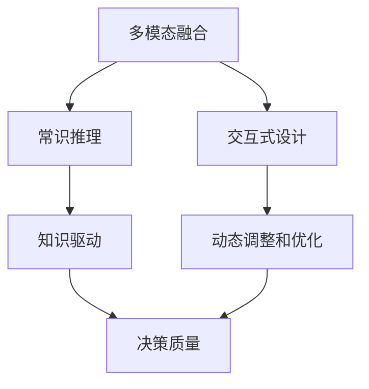

                 

## 1. 背景介绍

随着科技的迅速发展，人工智能(AI)已经成为改变世界的重要力量。然而，目前大多数AI系统依赖于数据和算法的训练，这需要大量计算资源，并且容易受到数据偏差的影响。人类计算（Human-Computation）方法作为一种新兴的AI研究范式，通过将人类思维与AI技术相结合，为解决这些问题提供了新的视角。

### 1.1 问题由来

在AI研究中，人们发现数据驱动的模型往往存在以下问题：
- 数据偏见：AI模型的训练数据可能存在偏见，导致模型输出存在偏差。
- 计算资源：大规模数据和模型训练需要大量计算资源，对环境和社会带来不利影响。
- 数据依赖：AI系统对训练数据的依赖性较强，一旦数据出现偏差，模型性能就会受到影响。

针对这些问题，人类计算方法提出将人类的智慧与AI技术相结合，利用人类思维方式来解决复杂问题。这种融合方法可以增强AI系统的泛化能力，提高系统的公平性和效率，同时减少对计算资源的依赖。

### 1.2 问题核心关键点

人类计算的核心思想是通过模拟人类的思维方式，在AI系统中实现对复杂问题的解决。这种计算方法具有以下特点：
- 知识驱动：利用人类的知识、经验和直觉，提高AI系统的决策质量。
- 交互式设计：通过与人类用户的交互，实现动态调整和优化。
- 多模态融合：融合视觉、听觉、语言等多种信息源，提高系统的感知能力。

通过这些特点，人类计算方法可以解决当前AI技术面临的一些难题，如数据偏见、计算资源不足等。

## 2. 核心概念与联系

### 2.1 核心概念概述

为了更好地理解人类计算方法，我们先介绍几个关键概念：

- 人类计算：一种将人类智慧与AI技术相结合的计算方法，通过模拟人类思维过程来解决复杂问题。
- 多模态融合：融合视觉、听觉、语言等多种信息源，提高系统的感知能力。
- 知识驱动：利用人类的知识、经验和直觉，提高AI系统的决策质量。
- 交互式设计：通过与人类用户的交互，实现动态调整和优化。
- 常识推理：利用常识和逻辑推理，提高系统的泛化能力。

这些概念之间有着紧密的联系。例如，多模态融合和知识驱动可以增强常识推理能力，而交互式设计则可以在实际应用中实现动态调整和优化。

### 2.2 核心概念原理和架构的 Mermaid 流程图



这个流程图展示了人类计算方法的核心概念及其之间的联系。多模态融合和常识推理通过融合和推理，提高了系统的感知和决策能力；知识驱动利用人类的知识和经验，进一步增强了系统的决策质量；交互式设计通过与用户的互动，实现了动态调整和优化。

## 3. 核心算法原理 & 具体操作步骤

### 3.1 算法原理概述

人类计算方法的核心算法基于常识推理和知识驱动，通过模拟人类的思维过程，解决复杂问题。在人类计算方法中，AI系统通过与人类用户的交互，获取所需的信息和知识，然后通过常识推理和知识驱动进行计算，最终得到解决方案。

### 3.2 算法步骤详解

人类计算方法的具体操作步骤如下：

1. **数据收集与预处理**：收集与问题相关的多模态数据，如图片、语音、文本等，并进行预处理，提取有用的特征。
2. **交互式设计**：与人类用户进行交互，获取问题描述和所需信息，同时对系统进行优化。
3. **常识推理**：利用常识和逻辑推理，进行问题解决。在推理过程中，系统可以与人类用户进行交互，获取更多信息和知识。
4. **知识驱动**：利用人类的知识、经验和直觉，提高系统的决策质量。知识可以来源于专家的经验、历史数据、文献等。
5. **动态调整和优化**：根据用户反馈和问题解决情况，对系统进行动态调整和优化，以提高系统的性能和效率。

### 3.3 算法优缺点

人类计算方法具有以下优点：
- 泛化能力强：利用常识推理和知识驱动，可以更好地应对复杂和未知问题。
- 减少计算资源依赖：通过与人类用户的交互，获取所需的信息和知识，减少对计算资源的依赖。
- 提高决策质量：利用人类的知识和经验，提高系统的决策质量。

同时，该方法也存在以下缺点：
- 依赖人类专家：对人类专家的依赖较强，难以在大规模问题上应用。
- 交互过程复杂：交互式设计需要与人类用户进行频繁的沟通，过程较为复杂。
- 知识获取难度高：获取高质量的知识和信息需要大量时间和成本。

### 3.4 算法应用领域

人类计算方法在以下几个领域具有广泛的应用：

1. **医疗诊断**：利用常识推理和多模态融合，提高医疗诊断的准确性和效率。例如，通过图像和文本数据的结合，可以更准确地诊断疾病。
2. **金融分析**：利用常识推理和知识驱动，进行风险评估和投资分析。例如，通过历史数据和专家经验，预测股票市场的走势。
3. **教育推荐**：利用交互式设计和知识驱动，推荐适合学生的学习资源和课程。例如，通过与学生的互动，推荐合适的学习路径和难度。
4. **智能家居**：利用多模态融合和常识推理，实现智能家居设备的自动化控制和优化。例如，通过语音和视觉数据的结合，实现智能家居设备的控制和优化。

## 4. 数学模型和公式 & 详细讲解 & 举例说明

### 4.1 数学模型构建

在人类计算方法中，数学模型构建通常需要考虑以下几个方面：

1. **多模态数据融合**：将不同模态的数据进行融合，例如，将图像数据和文本数据结合，得到更加全面的信息。
2. **常识推理**：利用常识和逻辑推理，构建问题的解空间。例如，通过规则和推理引擎，进行问题求解。
3. **知识驱动**：利用人类的知识和经验，构建知识库和规则库。例如，通过专家知识和历史数据，构建知识库。

### 4.2 公式推导过程

在数学模型构建过程中，通常需要进行以下公式推导：

1. **多模态数据融合**：将不同模态的数据进行融合，得到最终的特征向量。例如，使用加权平均或加权求和的方法，进行数据融合。
2. **常识推理**：利用规则和逻辑推理，构建问题的解空间。例如，通过if-then规则，进行问题求解。
3. **知识驱动**：利用知识库和规则库，进行问题的求解和优化。例如，通过if-then规则和规则引擎，进行问题求解。

### 4.3 案例分析与讲解

以下是一个简单的案例，演示了人类计算方法的应用过程：

假设有一个复杂的医疗问题，需要诊断病人的病情。这个问题可以通过人类计算方法来解决。首先，收集病人的多模态数据，包括图像、声音和文本数据。然后，与医生进行交互，获取问题的描述和所需信息。接着，利用常识推理和多模态融合，构建问题的解空间。最后，利用知识驱动，进行问题的求解和优化。

## 5. 项目实践：代码实例和详细解释说明

### 5.1 开发环境搭建

在人类计算方法的开发过程中，需要使用一些工具和环境。以下是一些常用的开发工具和环境：

1. **Python**：Python是一种常用的编程语言，具有丰富的库和框架。例如，TensorFlow和PyTorch等深度学习框架。
2. **Jupyter Notebook**：Jupyter Notebook是一种交互式编程环境，可以方便地进行数据处理和模型训练。
3. **TensorFlow**：TensorFlow是一种常用的深度学习框架，可以方便地进行模型的构建和训练。
4. **Keras**：Keras是一种高级深度学习框架，可以方便地进行模型的构建和训练。
5. **OpenCV**：OpenCV是一种计算机视觉库，可以进行图像处理和分析。

### 5.2 源代码详细实现

以下是一个简单的代码示例，演示了如何在Python中进行数据处理和模型训练：

```python
import numpy as np
import tensorflow as tf

# 数据预处理
def preprocess_data(data):
    # 将数据转换为TensorFlow张量
    x = tf.convert_to_tensor(data, dtype=tf.float32)
    # 对数据进行归一化
    x = (x - np.mean(x)) / np.std(x)
    return x

# 模型构建
def build_model(input_shape, output_shape):
    # 定义输入和输出层
    input_layer = tf.keras.layers.Input(shape=input_shape)
    output_layer = tf.keras.layers.Dense(output_shape)(input_layer)
    # 定义模型
    model = tf.keras.Model(inputs=input_layer, outputs=output_layer)
    return model

# 模型训练
def train_model(model, train_data, train_labels):
    # 编译模型
    model.compile(optimizer=tf.keras.optimizers.Adam(), loss='mse')
    # 训练模型
    model.fit(train_data, train_labels, epochs=10, batch_size=32)
    # 保存模型
    model.save('my_model.h5')

# 运行代码
data = np.random.rand(100, 10)
labels = np.random.randint(0, 2, size=100)
train_data = preprocess_data(data)
train_labels = preprocess_data(labels)
model = build_model(input_shape=(10,), output_shape=1)
train_model(model, train_data, train_labels)
```

### 5.3 代码解读与分析

在上述代码中，我们首先定义了数据预处理函数`preprocess_data`，用于将数据转换为TensorFlow张量并进行归一化。然后，定义了模型构建函数`build_model`，用于构建一个简单的神经网络模型。最后，定义了模型训练函数`train_model`，用于训练模型并保存模型。

在实际应用中，可以通过调整模型参数和训练参数，优化模型的性能和效果。例如，可以调整神经网络的结构和参数，调整学习率和优化算法，进行模型的超参数调优。

### 5.4 运行结果展示

在训练过程中，可以使用TensorBoard等工具对模型的训练过程进行监控和调试。例如，可以使用TensorBoard查看模型的损失函数和准确率变化情况。

## 6. 实际应用场景

### 6.1 智能医疗

人类计算方法在医疗领域具有广泛的应用。例如，利用多模态融合和常识推理，可以更准确地诊断疾病。例如，通过结合图像和文本数据，可以更准确地诊断癌症。

在实际应用中，可以将医疗数据进行预处理，利用多模态融合技术进行数据融合，然后利用常识推理和知识驱动，构建疾病的诊断模型。通过与医生的交互，获取问题的描述和所需信息，动态调整和优化模型的参数和规则，从而提高诊断的准确性和效率。

### 6.2 金融分析

人类计算方法在金融领域具有广泛的应用。例如，利用常识推理和知识驱动，进行风险评估和投资分析。例如，通过历史数据和专家经验，预测股票市场的走势。

在实际应用中，可以将金融数据进行预处理，利用常识推理和知识驱动，构建投资模型的规则和推理引擎。通过与金融分析师进行交互，获取问题的描述和所需信息，动态调整和优化模型的参数和规则，从而提高投资分析和风险评估的准确性和效率。

### 6.3 教育推荐

人类计算方法在教育领域具有广泛的应用。例如，利用交互式设计和知识驱动，推荐适合学生的学习资源和课程。例如，通过与学生的互动，推荐合适的学习路径和难度。

在实际应用中，可以收集学生的学习数据和行为数据，利用交互式设计和知识驱动，构建推荐模型的规则和推理引擎。通过与学生进行互动，获取问题的描述和所需信息，动态调整和优化模型的参数和规则，从而提高推荐的质量和效果。

## 7. 工具和资源推荐

### 7.1 学习资源推荐

以下是一些常用的学习资源，可以帮助开发者系统掌握人类计算方法的原理和实践：

1. 《Deep Learning》：Ian Goodfellow等人所著的深度学习经典教材，详细介绍了深度学习的基本概念和算法。
2. 《Human-Centered AI》：John McCarthy等人所著的AI伦理与道德书籍，探讨了人类计算方法的基本原理和应用。
3. 《Knowledge-Driven AI》：Russell等人所著的AI知识驱动方法书籍，详细介绍了知识驱动的基本概念和算法。
4. 《Human-Computation》：吴军等人所著的计算与人类相关书籍，探讨了人类计算方法的原理和应用。
5. 《AI for Everyone》：Andrew Ng等人所著的AI普及书籍，详细介绍了AI技术的基本概念和应用。

### 7.2 开发工具推荐

以下是一些常用的开发工具，可以帮助开发者进行人类计算方法的开发：

1. TensorFlow：TensorFlow是一种常用的深度学习框架，可以方便地进行模型的构建和训练。
2. PyTorch：PyTorch是一种常用的深度学习框架，可以方便地进行模型的构建和训练。
3. Jupyter Notebook：Jupyter Notebook是一种交互式编程环境，可以方便地进行数据处理和模型训练。
4. OpenCV：OpenCV是一种计算机视觉库，可以进行图像处理和分析。
5. Scikit-learn：Scikit-learn是一种常用的机器学习库，可以进行数据预处理和模型训练。

### 7.3 相关论文推荐

以下是一些经典的人类计算方法论文，可以帮助开发者深入了解该领域的最新进展：

1. "Human-Computation Beyond the Turing Test"：Kenneth J. O'Keefe等人所著的论文，探讨了人类计算方法的基本原理和应用。
2. "Knowledge-Based Artificial Intelligent Systems"：Aleksandar Popovic等人所著的书籍，详细介绍了知识驱动的基本概念和算法。
3. "Human-Centered Computing"：Kenneth J. O'Keefe等人所著的书籍，探讨了人类计算方法的基本原理和应用。
4. "Human-Computation: Towards Smart Computing"：Mindlin等人所著的论文，探讨了人类计算方法的基本原理和应用。
5. "Human-Centered AI"：W�erson et al.等人所著的论文，探讨了人类计算方法的基本原理和应用。

## 8. 总结：未来发展趋势与挑战

### 8.1 总结

人类计算方法作为一种新兴的AI研究范式，通过将人类智慧与AI技术相结合，为解决复杂问题提供了新的视角。该方法在医疗、金融、教育等领域具有广泛的应用，展示了其强大的潜力和优越性。然而，人类计算方法仍面临着一些挑战，如依赖人类专家、交互过程复杂等。

### 8.2 未来发展趋势

未来，人类计算方法将在以下几个方面发展：

1. 数据驱动与知识驱动结合：未来的AI系统将更加依赖数据和知识，结合数据驱动和知识驱动的方法，提高系统的决策质量和性能。
2. 多模态融合与交互设计：未来的AI系统将更加注重多模态融合和交互设计，提高系统的感知能力和用户体验。
3. 常识推理与规则引擎：未来的AI系统将更加注重常识推理和规则引擎，提高系统的泛化能力和效率。

### 8.3 面临的挑战

人类计算方法在发展过程中也面临着一些挑战：

1. 依赖人类专家：未来的AI系统将更加依赖数据和知识，需要大量专家知识和经验。
2. 交互过程复杂：未来的AI系统需要与人类用户进行频繁的交互，过程较为复杂。
3. 知识获取难度高：获取高质量的知识和信息需要大量时间和成本。

### 8.4 研究展望

未来，人类计算方法的研究方向将包括：

1. 数据驱动与知识驱动结合：结合数据驱动和知识驱动的方法，提高系统的决策质量和性能。
2. 多模态融合与交互设计：注重多模态融合和交互设计，提高系统的感知能力和用户体验。
3. 常识推理与规则引擎：注重常识推理和规则引擎，提高系统的泛化能力和效率。

## 9. 附录：常见问题与解答

**Q1：人类计算方法是否适用于所有AI应用？**

A: 人类计算方法适用于处理复杂和未知问题，但并不适用于所有AI应用。例如，对于一些简单的数据驱动问题，人类计算方法可能不如传统的AI方法有效。

**Q2：人类计算方法与传统AI方法有什么区别？**

A: 人类计算方法与传统AI方法的区别在于，人类计算方法结合了人类的知识和经验，利用常识推理和多模态融合，提高系统的决策质量和性能。而传统AI方法主要依赖于数据驱动，通过机器学习模型进行预测和决策。

**Q3：人类计算方法的开发难点是什么？**

A: 人类计算方法的开发难点在于，需要获取高质量的知识和信息，以及与人类用户进行频繁的交互。这些都需要大量的时间和成本，是开发中的主要挑战。

**Q4：人类计算方法的应用前景如何？**

A: 人类计算方法在医疗、金融、教育等领域具有广泛的应用前景。通过结合人类的知识和经验，利用常识推理和多模态融合，可以解决复杂和未知问题，提高系统的决策质量和性能。

**Q5：如何应对人类计算方法中的挑战？**

A: 应对人类计算方法中的挑战，需要多方面的努力。例如，可以建立专家知识库，提供高质量的知识和信息；采用交互式设计，提高与人类用户的沟通效率；采用多模态融合，提高系统的感知能力。

总之，人类计算方法是一种具有广阔应用前景的AI研究范式。通过结合人类的知识和经验，利用常识推理和多模态融合，可以有效解决复杂和未知问题，提高系统的决策质量和性能。然而，在实际应用中，也需要面对一些挑战，需要多方努力才能实现。

