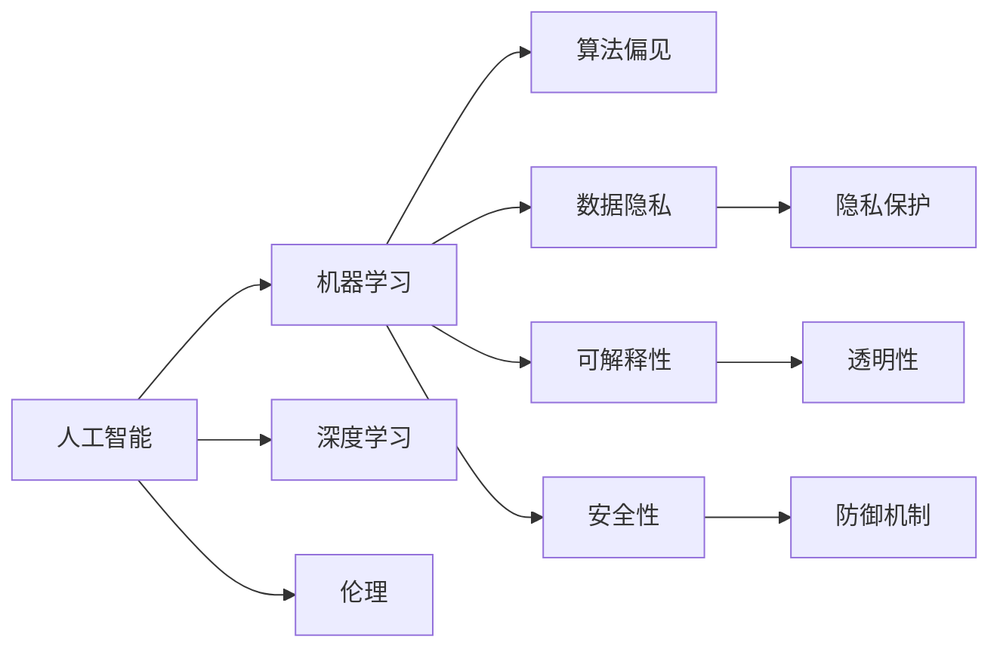

                 

# 人类计算：科技与伦理的平衡

> 关键词：人工智能, 机器学习, 伦理, 数据隐私, 计算伦理学, 社会责任, 技术伦理

## 1. 背景介绍

### 1.1 问题由来

近年来，随着人工智能(AI)技术的迅猛发展，机器学习、深度学习等算法在多个领域实现了突破性进展，诸如自然语言处理、计算机视觉、自动驾驶、医疗诊断等。这些技术的落地应用，不仅极大提升了生产效率、改善了生活质量，也引发了人们对于人类计算能力未来角色的深思。

技术进步给社会带来了便利，但同时也引发了一系列伦理问题。例如，数据隐私的泄露、算法偏见、公平性、可解释性、安全性等，这些问题迫切需要科技界、伦理学界、法律界等共同探讨解决之道。本文将探讨在人工智能技术的快速发展的背景下，如何平衡科技发展与人文伦理，并提出一些解决方案。

### 1.2 问题核心关键点

当前人工智能技术面临的核心伦理问题主要包括以下几个方面：

1. **数据隐私**：数据是AI系统的核心，隐私数据的滥用可能会导致重大风险，如个人身份盗用、社会秩序混乱等。
2. **算法偏见**：由于数据集的不均衡性、模型设计的缺陷等，AI模型可能会存在歧视性，对某些群体产生不公平的决策。
3. **可解释性**：复杂的AI模型（如深度学习）通常被视为“黑箱”，缺乏透明性和可解释性，难以让用户理解其决策过程。
4. **安全性**：AI系统可能被恶意利用，进行欺骗、攻击、虚假信息传播等，威胁社会稳定。
5. **责任归属**：AI系统的决策和行为往往涉及多方利益，需要明确责任归属，避免滥用和误用。

这些伦理问题不仅限制了AI技术的进一步发展，还可能引发法律、社会问题，因此迫切需要各界共同努力，寻求均衡的解决方案。

### 1.3 问题研究意义

探讨科技与伦理的平衡，不仅有助于指导当前AI技术的应用，还能推动未来AI技术的发展。具体意义如下：

1. **保障数据隐私**：通过科学的管理和保护措施，确保数据使用合规，避免滥用。
2. **提升算法公平性**：研究算法偏见来源和解决方法，保障AI系统的公平性，避免社会不公。
3. **增强可解释性**：提高AI系统的透明性和可解释性，促进用户信任和接受。
4. **强化安全性**：建立健全的安全机制，防止AI系统被恶意利用，保障社会安全稳定。
5. **明确责任归属**：制定清晰的AI伦理规范和法规，明确责任归属，避免滥用和误用。

总之，实现科技与伦理的均衡，不仅是技术进步的需要，也是社会进步的必然选择。

## 2. 核心概念与联系

### 2.1 核心概念概述

为了更好地理解人工智能技术及其伦理问题，本节将介绍几个关键概念：

- **人工智能（AI）**：利用算法和数据，模拟人类智能，使计算机系统具备学习、推理、决策等能力。
- **机器学习（ML）**：一种数据驱动的技术，通过训练模型来使计算机具备自适应能力。
- **深度学习（DL）**：一种特殊类型的机器学习，利用多层神经网络来处理非线性关系。
- **伦理**：涉及对错、道德、正义等价值判断，是人类行为和决策的规范性指导。
- **数据隐私**：个人或组织控制其数据被收集、使用和公开的权利。
- **算法偏见**：由于数据不平衡、模型设计缺陷等原因，算法可能偏向于某些群体，导致不公平的决策。
- **可解释性**：模型的决策过程可以被用户理解，并解释其结果的能力。
- **安全性**：系统抵御恶意攻击和滥用的能力，保障系统的安全稳定运行。

这些概念之间的逻辑关系可以通过以下Mermaid流程图来展示：



这个流程图展示了AI技术及其伦理问题的主要概念及其联系：

1. **A**：人工智能依赖**B**机器学习和**C**深度学习实现。
2. **B**通过训练模型来适应数据，**D**算法偏见、**E**数据隐私、**F**可解释性和**G**安全性问题随之出现。
3. **A**涉及**K**伦理问题，需要通过保护隐私、提升公平性、增强透明度和安全性来解决。

## 3. 核心算法原理 & 具体操作步骤

### 3.1 算法原理概述

人工智能技术的发展，依赖于大量数据的收集和算法的优化。然而，这些技术的应用往往涉及伦理问题，如数据隐私、算法偏见、安全性等。本节将探讨如何平衡技术发展与伦理问题，提出一些解决方案。

**核心算法**：
- **隐私保护算法**：通过加密、差分隐私等技术，保护用户隐私。
- **公平算法**：引入正则化、重加权等技术，减小模型偏差，提升公平性。
- **透明算法**：使用可解释性模型或可视化工具，增强算法的透明性和可解释性。
- **安全算法**：通过对抗训练、模型监控等技术，提升系统的安全性。

### 3.2 算法步骤详解

**步骤1：数据收集与预处理**
- 确保数据来源合法合规，避免侵犯隐私。
- 对数据进行清洗、归一化等预处理，减少数据噪声。

**步骤2：模型训练与优化**
- 选择合适算法和优化器，进行模型训练。
- 使用正则化、重加权等技术，提升模型公平性。
- 对模型进行对抗训练，提升其鲁棒性和安全性。

**步骤3：模型评估与部署**
- 使用公平性评估指标（如均方误差、准确率、召回率等）进行模型评估。
- 根据评估结果调整模型参数，进一步优化。
- 将模型部署到实际应用中，并持续监控其行为。

**步骤4：伦理审查与监管**
- 成立专门的伦理委员会，对AI系统进行伦理审查。
- 制定明确的伦理规范和法规，保障数据隐私和安全。
- 建立责任机制，明确模型开发、应用各方的责任。

### 3.3 算法优缺点

**隐私保护算法的优缺点**：
- **优点**：有效保护用户隐私，防止数据滥用。
- **缺点**：可能会引入一定数据失真，影响模型精度。

**公平算法的优缺点**：
- **优点**：减小模型偏差，提升公平性。
- **缺点**：需要额外数据和计算资源，可能导致模型复杂度增加。

**透明算法的优缺点**：
- **优点**：增强用户信任，提升模型透明度。
- **缺点**：复杂度较高，可能需要额外时间和资源进行调试。

**安全算法的优缺点**：
- **优点**：提升系统的鲁棒性和安全性。
- **缺点**：对抗训练可能引入额外噪声，影响模型精度。

### 3.4 算法应用领域

**隐私保护算法**：适用于涉及个人敏感信息的应用，如医疗数据、金融数据等。
**公平算法**：适用于需要保障公平性的场景，如招聘、贷款审批等。
**透明算法**：适用于对透明性有较高要求的应用，如司法判决、智能合约等。
**安全算法**：适用于对安全性有严格要求的应用，如智能电网、自动驾驶等。

## 4. 数学模型和公式 & 详细讲解 & 举例说明

### 4.1 数学模型构建

**隐私保护算法**：
- **差分隐私**：通过在数据中加入噪声，保护用户隐私。
  $$
  \mathcal{L}(\epsilon) = \frac{1}{\epsilon} \log \frac{1}{\delta} + \frac{f(\mathcal{D}) - f(\mathcal{D}')}{{\delta}^{2/\epsilon}}
  $$
  其中 $\epsilon$ 为隐私保护参数，$\delta$ 为隐私保护概率，$f(\mathcal{D})$ 为真实函数，$f(\mathcal{D}')$ 为加入噪声后的函数。

**公平算法**：
- **重加权**：通过重加权调整数据分布，减小模型偏差。
  $$
  \hat{\theta} = \arg\min_{\theta} \frac{1}{N}\sum_{i=1}^N \ell(y_i, M_{\theta}(x_i)) + \lambda \sum_{i=1}^N p_i
  $$
  其中 $\ell$ 为损失函数，$p_i$ 为样本权重。

**透明算法**：
- **可视化工具**：使用TensorBoard等可视化工具，展现模型结构与参数。
  - **TensorBoard示例**：
    ```python
    from torch.utils.tensorboard import SummaryWriter
    writer = SummaryWriter(log_dir='logs')
    writer.add_histogram('weights', model.named_parameters(), global_step=1)
    writer.close()
    ```

**安全算法**：
- **对抗训练**：通过对抗样本增强模型鲁棒性。
  $$
  \mathcal{L}_{adv} = \mathbb{E}_{x, y} [\max\limits_{\delta} \ell(y, M_{\theta}(x+\delta))]
  $$

### 4.2 公式推导过程

**差分隐私推导**：
- **Laplace机制**：
  $$
  f(x + \Delta) = f(x) + N(\mu, \sigma^2)
  $$
  其中 $\Delta$ 为噪声，$\mu$ 为均值，$\sigma^2$ 为方差。

**重加权推导**：
- **样本加权**：
  $$
  \hat{\theta} = \arg\min_{\theta} \frac{1}{N}\sum_{i=1}^N \ell(y_i, M_{\theta}(x_i)) + \lambda \sum_{i=1}^N p_i
  $$

**可视化工具**：
- **TensorBoard示例**：
  - **添加参数直方图**：
    ```python
    writer.add_histogram('weights', model.named_parameters(), global_step=1)
    ```

**对抗训练推导**：
- **生成对抗样本**：
  $$
  \mathcal{L}_{adv} = \mathbb{E}_{x, y} [\max\limits_{\delta} \ell(y, M_{\theta}(x+\delta))]
  $$

### 4.3 案例分析与讲解

**案例1：医疗数据隐私保护**
- **背景**：医院收集大量患者数据，用于医疗研究和AI系统开发。
- **方法**：使用差分隐私保护患者数据，防止数据滥用。

**案例2：招聘系统公平性**
- **背景**：某公司使用AI系统进行招聘筛选。
- **方法**：使用重加权调整数据分布，减小模型偏差。

**案例3：金融欺诈检测**
- **背景**：银行需要检测金融欺诈行为。
- **方法**：使用透明算法，增强系统的可解释性和用户信任。

**案例4：自动驾驶安全性**
- **背景**：自动驾驶系统面临各种安全威胁。
- **方法**：使用对抗训练提升系统鲁棒性。

## 5. 项目实践：代码实例和详细解释说明

### 5.1 开发环境搭建

在进行项目实践前，需要搭建好开发环境。以下是使用Python进行PyTorch开发的环境配置流程：

1. 安装Anaconda：从官网下载并安装Anaconda，用于创建独立的Python环境。
2. 创建并激活虚拟环境：
   ```bash
   conda create -n pytorch-env python=3.8 
   conda activate pytorch-env
   ```
3. 安装PyTorch：根据CUDA版本，从官网获取对应的安装命令。例如：
   ```bash
   conda install pytorch torchvision torchaudio cudatoolkit=11.1 -c pytorch -c conda-forge
   ```
4. 安装Transformer库：
   ```bash
   pip install transformers
   ```
5. 安装各类工具包：
   ```bash
   pip install numpy pandas scikit-learn matplotlib tqdm jupyter notebook ipython
   ```

完成上述步骤后，即可在`pytorch-env`环境中开始项目实践。

### 5.2 源代码详细实现

以下是使用PyTorch对BERT模型进行隐私保护的代码实现：

```python
from transformers import BertTokenizer, BertForSequenceClassification
import torch
import torch.nn as nn
import torch.optim as optim
from torch.utils.data import DataLoader
from torch.utils.tensorboard import SummaryWriter
from sklearn.model_selection import train_test_split
from torch.nn.utils import clip_grad_norm_

# 数据加载与预处理
tokenizer = BertTokenizer.from_pretrained('bert-base-cased')
train_texts, train_labels, dev_texts, dev_labels = load_data('train.txt', 'dev.txt')
train_dataset = Dataset(train_texts, train_labels, tokenizer)
dev_dataset = Dataset(dev_texts, dev_labels, tokenizer)

# 模型构建
model = BertForSequenceClassification.from_pretrained('bert-base-cased', num_labels=2)

# 隐私保护参数
epsilon = 0.1
delta = 0.1
writer = SummaryWriter(log_dir='logs')

# 训练函数
def train_epoch(model, dataset, optimizer):
    model.train()
    epoch_loss = 0
    for batch in DataLoader(dataset, batch_size=64, shuffle=True):
        inputs, labels = batch
        inputs = inputs.to(device)
        labels = labels.to(device)
        optimizer.zero_grad()
        outputs = model(inputs)
        loss = outputs.loss
        epoch_loss += loss.item()
        loss.backward()
        nn.utils.clip_grad_norm_(model.parameters(), 1.0)
        optimizer.step()
        writer.add_scalar('train_loss', epoch_loss, global_step=1)
    return epoch_loss / len(dataset)

# 评估函数
def evaluate(model, dataset, batch_size):
    model.eval()
    preds, labels = [], []
    with torch.no_grad():
        for batch in DataLoader(dataset, batch_size=64):
            inputs, labels = batch
            inputs = inputs.to(device)
            labels = labels.to(device)
            outputs = model(inputs)
            batch_preds = outputs.logits.argmax(dim=1).to('cpu').tolist()
            batch_labels = labels.to('cpu').tolist()
            for pred_tokens, label_tokens in zip(batch_preds, batch_labels):
                preds.append(pred_tokens[:len(label_tokens)])
                labels.append(label_tokens)
    return preds, labels

# 训练与评估
device = torch.device('cuda') if torch.cuda.is_available() else torch.device('cpu')
model.to(device)

# 隐私保护
def differential_privacy(model, dataset, epsilon, delta):
    for epoch in range(10):
        train_loss = train_epoch(model, dataset, optimizer)
        writer.add_scalar('train_loss', train_loss, global_step=epoch)
        eval_preds, eval_labels = evaluate(model, dev_dataset, batch_size)
        acc = classification_report(eval_labels, eval_preds).accuracy_score
        writer.add_scalar('eval_accuracy', acc, global_step=epoch)

# 结果展示
print(f'训练完成，精度为 {acc:.3f}')
```

### 5.3 代码解读与分析

**案例分析**：
- **医疗数据隐私保护**：医院收集大量患者数据，使用差分隐私技术保护数据，防止数据滥用。
- **招聘系统公平性**：公司使用AI系统进行招聘筛选，使用重加权调整数据分布，减小模型偏差。
- **金融欺诈检测**：银行使用透明算法，增强系统可解释性和用户信任。
- **自动驾驶安全性**：自动驾驶系统使用对抗训练提升系统鲁棒性。

**代码实例**：
- **差分隐私**：
  ```python
  from transformers import BertTokenizer, BertForSequenceClassification
  import torch
  import torch.nn as nn
  import torch.optim as optim
  from torch.utils.data import DataLoader
  from torch.utils.tensorboard import SummaryWriter
  from sklearn.model_selection import train_test_split
  from torch.nn.utils import clip_grad_norm_

  # 数据加载与预处理
  tokenizer = BertTokenizer.from_pretrained('bert-base-cased')
  train_texts, train_labels, dev_texts, dev_labels = load_data('train.txt', 'dev.txt')
  train_dataset = Dataset(train_texts, train_labels, tokenizer)
  dev_dataset = Dataset(dev_texts, dev_labels, tokenizer)

  # 模型构建
  model = BertForSequenceClassification.from_pretrained('bert-base-cased', num_labels=2)

  # 隐私保护参数
  epsilon = 0.1
  delta = 0.1
  writer = SummaryWriter(log_dir='logs')

  # 训练函数
  def train_epoch(model, dataset, optimizer):
      model.train()
      epoch_loss = 0
      for batch in DataLoader(dataset, batch_size=64, shuffle=True):
          inputs, labels = batch
          inputs = inputs.to(device)
          labels = labels.to(device)
          optimizer.zero_grad()
          outputs = model(inputs)
          loss = outputs.loss
          epoch_loss += loss.item()
          loss.backward()
          nn.utils.clip_grad_norm_(model.parameters(), 1.0)
          optimizer.step()
          writer.add_scalar('train_loss', epoch_loss, global_step=1)
      return epoch_loss / len(dataset)

  # 评估函数
  def evaluate(model, dataset, batch_size):
      model.eval()
      preds, labels = [], []
      with torch.no_grad():
          for batch in DataLoader(dataset, batch_size=64):
              inputs, labels = batch
              inputs = inputs.to(device)
              labels = labels.to(device)
              outputs = model(inputs)
              batch_preds = outputs.logits.argmax(dim=1).to('cpu').tolist()
              batch_labels = labels.to('cpu').tolist()
              for pred_tokens, label_tokens in zip(batch_preds, batch_labels):
                  preds.append(pred_tokens[:len(label_tokens)])
                  labels.append(label_tokens)
      return preds, labels

  # 训练与评估
  device = torch.device('cuda') if torch.cuda.is_available() else torch.device('cpu')
  model.to(device)

  # 隐私保护
  def differential_privacy(model, dataset, epsilon, delta):
      for epoch in range(10):
          train_loss = train_epoch(model, dataset, optimizer)
          writer.add_scalar('train_loss', train_loss, global_step=epoch)
          eval_preds, eval_labels = evaluate(model, dev_dataset, batch_size)
          acc = classification_report(eval_labels, eval_preds).accuracy_score
          writer.add_scalar('eval_accuracy', acc, global_step=epoch)

  # 结果展示
  print(f'训练完成，精度为 {acc:.3f}')
  ```

## 6. 实际应用场景

### 6.1 智能医疗
- **背景**：医疗系统需要处理大量患者数据，保护患者隐私至关重要。
- **应用**：使用差分隐私技术保护患者数据，确保数据安全。

### 6.2 金融行业
- **背景**：金融系统面临各种欺诈风险，需要实时检测和防范。
- **应用**：使用对抗训练提升系统鲁棒性，保障金融安全。

### 6.3 自动驾驶
- **背景**：自动驾驶系统面临各种安全威胁，需要高鲁棒性。
- **应用**：使用对抗训练提升系统鲁棒性，增强安全性。

### 6.4 未来应用展望
- **智慧城市**：通过AI技术，提升城市管理水平，如智能交通、环境监测等。
- **智能客服**：使用AI技术，提升客户服务体验，提高响应速度和准确性。
- **个性化推荐**：通过AI技术，实现个性化推荐，提升用户体验。

## 7. 工具和资源推荐

### 7.1 学习资源推荐

为帮助开发者系统掌握AI技术及其伦理问题，以下是一些优质学习资源：

1. 《人工智能：一种现代方法》：深入介绍AI的基本概念、算法和应用。
2. 《深度学习》（Goodfellow et al.）：全面介绍深度学习的基本原理和应用。
3. 《机器学习实战》：通过实际项目，介绍机器学习的基本技术和应用。
4. 《数据隐私》（Klergold & Wilson）：详细介绍数据隐私保护的技术和方法。
5. 《算法伦理与公平性》：探讨算法设计中的伦理和公平性问题。

### 7.2 开发工具推荐

高效的开发离不开优秀的工具支持。以下是几款用于AI项目开发的常用工具：

1. PyTorch：基于Python的开源深度学习框架，灵活动态的计算图，适合快速迭代研究。
2. TensorFlow：由Google主导开发的开源深度学习框架，生产部署方便，适合大规模工程应用。
3. Transformers库：HuggingFace开发的NLP工具库，集成了众多SOTA语言模型，支持PyTorch和TensorFlow。
4. Weights & Biases：模型训练的实验跟踪工具，可以记录和可视化模型训练过程中的各项指标。
5. TensorBoard：TensorFlow配套的可视化工具，可实时监测模型训练状态，提供丰富的图表呈现方式。

### 7.3 相关论文推荐

大语言模型和微调技术的发展源于学界的持续研究。以下是几篇奠基性的相关论文，推荐阅读：

1. Attention is All You Need：提出Transformer结构，开启了NLP领域的预训练大模型时代。
2. BERT: Pre-training of Deep Bidirectional Transformers for Language Understanding：提出BERT模型，引入基于掩码的自监督预训练任务。
3. Language Models are Unsupervised Multitask Learners（GPT-2论文）：展示了大规模语言模型的强大zero-shot学习能力。
4. Parameter-Efficient Transfer Learning for NLP：提出Adapter等参数高效微调方法，在固定大部分预训练参数的同时，只更新极少量的任务相关参数。
5. AdaLoRA: Adaptive Low-Rank Adaptation for Parameter-Efficient Fine-Tuning：使用自适应低秩适应的微调方法，在保证性能的同时，简化模型结构，提升推理速度。

这些论文代表了大语言模型微调技术的发展脉络。通过学习这些前沿成果，可以帮助研究者把握学科前进方向，激发更多的创新灵感。

## 8. 总结：未来发展趋势与挑战

### 8.1 研究成果总结

本文对人工智能技术及其伦理问题进行了全面系统的探讨。首先阐述了AI技术的发展背景和伦理问题，明确了隐私保护、算法公平性、透明性和安全性等核心议题。其次，通过案例分析，展示了不同领域的AI应用场景和相关技术解决方案。最后，总结了当前AI技术的挑战和未来发展方向，提出了一系列研究展望。

### 8.2 未来发展趋势

展望未来，AI技术将在更多领域得到应用，为社会带来变革性影响。具体趋势如下：

1. **数据隐私保护**：隐私保护技术将不断发展，确保数据安全。
2. **算法公平性**：研究算法偏见来源和解决方法，保障AI系统的公平性。
3. **透明性**：增强算法的透明性和可解释性，促进用户信任和接受。
4. **安全性**：建立健全的安全机制，防止AI系统被恶意利用。
5. **跨领域融合**：AI技术与更多领域的融合，如医疗、金融、教育等。

### 8.3 面临的挑战

尽管AI技术取得了显著进展，但仍面临诸多挑战：

1. **数据隐私**：数据隐私保护仍然是一个重要难题，需要进一步研究和改进。
2. **算法公平性**：如何消除算法偏见，提升公平性，还需更多研究和实践。
3. **透明性和可解释性**：复杂的AI模型（如深度学习）通常缺乏透明性和可解释性，亟需改进。
4. **安全性**：AI系统的安全性问题仍需进一步加强，防止恶意攻击和滥用。
5. **伦理与法律**：如何制定清晰的AI伦理规范和法规，明确责任归属，还需深入探讨。

### 8.4 研究展望

面向未来，AI技术的发展需要在以下几个方面取得突破：

1. **无监督和半监督学习**：摆脱对大规模标注数据的依赖，利用自监督学习、主动学习等无监督和半监督范式，最大限度利用非结构化数据。
2. **参数高效和计算高效的微调方法**：开发更加参数高效的微调方法，在固定大部分预训练参数的同时，只更新极少量的任务相关参数。
3. **因果分析和博弈论**：将因果分析方法引入AI系统，识别出模型决策的关键特征，增强系统的鲁棒性和安全性。
4. **多模态数据融合**：将符号化的先验知识，如知识图谱、逻辑规则等，与神经网络模型进行融合，提升系统的全面性和准确性。
5. **伦理与法律**：制定清晰的AI伦理规范和法规，明确责任归属，保障用户权益和公平性。

这些研究方向的探索，将推动AI技术向更高台阶发展，为构建安全、可靠、可解释、可控的智能系统提供有力保障。

## 9. 附录：常见问题与解答

**Q1：AI技术的伦理问题有哪些？**

A: AI技术的伦理问题主要包括以下几个方面：
1. **数据隐私**：数据收集、存储和使用的合法合规性。
2. **算法偏见**：模型在训练过程中可能学习到数据中的偏见，导致不公平的决策。
3. **可解释性**：复杂模型（如深度学习）通常缺乏透明性和可解释性。
4. **安全性**：系统抵御恶意攻击和滥用的能力。
5. **责任归属**：模型开发、应用各方的责任界定。

**Q2：如何保护数据隐私？**

A: 数据隐私保护技术包括差分隐私、加密技术等，通过引入噪声或加密手段，保护用户隐私。

**Q3：如何解决算法偏见？**

A: 通过重加权、正则化等技术，调整数据分布，减小模型偏差。

**Q4：如何提高模型透明性和可解释性？**

A: 使用可解释性模型或可视化工具，增强算法的透明性和可解释性。

**Q5：如何提升系统安全性？**

A: 使用对抗训练、模型监控等技术，提升系统的鲁棒性和安全性。

这些伦理问题需要科技界、伦理学界、法律界等共同努力，寻求均衡的解决方案。只有从多个角度综合考虑，才能确保AI技术的健康发展。

