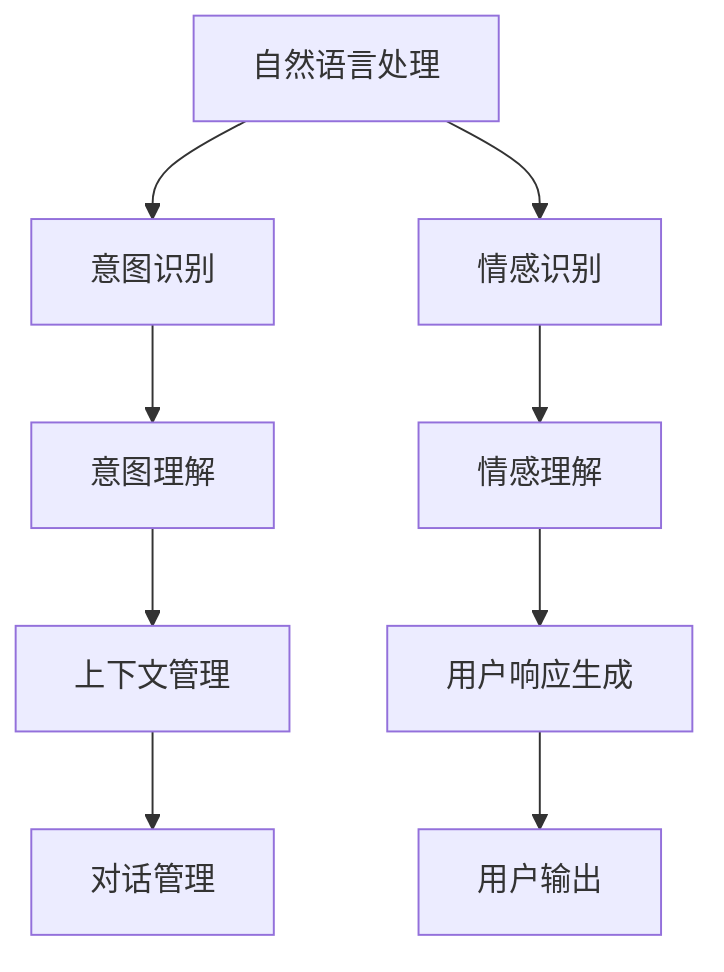

                 

# 从RAG到Agent的转变：多轮对话：与用户进行更深入的互动

> 关键词：多轮对话, 自然语言处理(NLP), 用户互动, 对话代理(Agent), 自然语言理解(NLU), 自然语言生成(NLG), 对话系统, 人类-机器交互

## 1. 背景介绍

在人工智能技术快速发展的今天，自然语言处理（NLP）和对话系统已经成为人机交互的重要手段。自然语言对话系统（Natural Language Agents, RAGs）是NLP领域的一个重要分支，通过模拟人类与机器的交互，使机器能够理解和回应人类自然语言。

随着NLP技术的不断发展，对话代理已经从简单的问答系统逐渐演变为多轮对话系统。与传统的单轮问答不同，多轮对话系统可以理解上下文，在对话中不断积累和利用先前的信息，从而提供更加智能和人性化的互动体验。多轮对话系统已经在多个实际应用场景中取得了显著效果，如客户服务、医疗咨询、教育辅导等。

然而，多轮对话系统面临的挑战也愈加复杂，如何使机器能够进行深层次的对话，并且理解用户的意图和情感，是一个极具挑战性的问题。本文将从背景介绍入手，逐步深入探讨多轮对话系统的核心概念、算法原理、实现步骤，并结合具体案例，展示多轮对话系统的实际应用和未来发展趋势。

## 2. 核心概念与联系

### 2.1 核心概念概述

要深入理解多轮对话系统，我们需要掌握以下几个核心概念：

1. **自然语言处理（NLP）**：是指让计算机能够理解和处理人类语言的技术，包括自然语言理解（NLU）和自然语言生成（NLG）。
2. **对话代理（RAG）**：是指可以与人类自然交互的系统，通常用于客户服务、虚拟助手、智能家居等场景。
3. **多轮对话**：是指对话系统能够进行多次信息交换，理解和记忆上下文，从而进行更复杂的交互。
4. **意图识别**：是指对话系统能够从用户的输入中识别出用户的真实意图。
5. **情感识别**：是指对话系统能够理解用户的情感状态，如愤怒、悲伤、愉快等。

这些概念之间的逻辑关系可以通过以下Mermaid流程图来展示：



这个流程图展示了大语言模型微调的核心概念及其之间的关系：

1. 自然语言处理将用户输入转化为计算机能够理解的形式。
2. 意图识别和情感识别分别从文本中提取出用户的意图和情感。
3. 意图理解基于意图识别结果，理解用户的请求或问题。
4. 情感理解分析用户的情感状态，并可能影响响应策略。
5. 上下文管理通过记忆上下文信息，帮助系统进行更准确的决策。
6. 对话管理负责协调对话流程，确定下一步的交互方式。
7. 用户响应生成基于以上信息，生成合适的回答。
8. 用户输出最终被返回给用户，完成一轮交互。

## 3. 核心算法原理 & 具体操作步骤

### 3.1 算法原理概述

多轮对话系统的核心算法原理包括：

1. **意图识别**：通过自然语言处理技术，将用户输入转化为意图表示。
2. **情感识别**：分析用户输入文本中的情感倾向，识别用户的情感状态。
3. **上下文管理**：保持对话上下文，以便后续对话使用。
4. **对话管理**：确定下一个对话步骤，决定如何回答。
5. **响应生成**：基于意图和情感，生成合适的回答。

这些算法的实现通常依赖于预训练的语言模型，如GPT、BERT等。通过在大量语料上进行预训练，这些模型能够学习到丰富的语言知识，并在多轮对话中展现出强大的语言理解和生成能力。

### 3.2 算法步骤详解

下面详细说明多轮对话系统的算法步骤：

**Step 1: 输入预处理**
- 将用户输入的文本进行分词、去停用词、词性标注等处理，得到预处理的序列。

**Step 2: 意图识别**
- 使用意图识别模型（如LSTM、CNN等）对预处理后的序列进行特征提取，得到意图表示。

**Step 3: 情感识别**
- 使用情感识别模型（如BERT、LSTM等）对预处理后的序列进行情感分析，得到情感倾向。

**Step 4: 上下文管理**
- 使用上下文管理器（如RNN、Transformer等）维护对话上下文，以便后续对话使用。

**Step 5: 对话管理**
- 使用对话管理模块（如规则、策略网络等）确定下一个对话步骤，决定如何回答。

**Step 6: 响应生成**
- 使用自然语言生成模型（如GPT、Seq2Seq等）基于意图和情感，生成合适的回答。

**Step 7: 输出和反馈**
- 将回答返回给用户，并接收用户反馈，更新意图识别和情感识别模型。

### 3.3 算法优缺点

多轮对话系统的优点：
1. 能够理解上下文，提供更加智能的互动体验。
2. 能够识别用户的情感，提升互动质量。
3. 可以通过反馈不断优化自身，提升性能。

多轮对话系统的缺点：
1. 需要大量的训练数据和计算资源。
2. 模型的可解释性较弱，难以理解内部决策过程。
3. 对话管理模块设计复杂，容易出现问题。
4. 对话质量依赖于模型的训练和维护，需要持续更新。

### 3.4 算法应用领域

多轮对话系统已经在多个实际应用场景中得到了广泛应用，例如：

1. **客户服务**：如智能客服系统，能够快速回答用户问题，提升用户体验。
2. **医疗咨询**：如智能问诊系统，能够根据病人的症状进行初步诊断。
3. **教育辅导**：如智能家教系统，能够根据学生的学习情况提供个性化辅导。
4. **虚拟助手**：如智能音箱、智能家居，能够通过语音与用户进行互动。

除了上述这些经典场景外，多轮对话系统还被创新性地应用到更多领域，如金融理财、安全监控、旅游规划等，为各行各业带来智能化服务。随着对话系统的不断优化和应用场景的拓展，多轮对话技术必将在未来有更广阔的应用前景。

## 4. 数学模型和公式 & 详细讲解 & 举例说明

### 4.1 数学模型构建

多轮对话系统的数学模型构建通常包括以下几个部分：

1. **输入序列表示**：将用户输入的文本转化为向量表示，通常使用Word Embedding或BERT等预训练模型进行表示。
2. **意图表示**：使用意图识别模型对输入序列进行特征提取，得到意图表示向量。
3. **情感表示**：使用情感识别模型对输入序列进行情感分析，得到情感表示向量。
4. **上下文表示**：使用上下文管理器对对话上下文进行维护，得到上下文表示向量。
5. **对话表示**：使用对话管理模块对对话进行维护，得到对话表示向量。
6. **响应表示**：使用自然语言生成模型对意图和情感进行编码，得到响应表示向量。
7. **输出序列生成**：使用生成模型对响应表示进行解码，生成输出序列。

### 4.2 公式推导过程

以意图识别和情感识别为例，推导过程如下：

**意图识别**：
假设用户输入序列为 $x=\{x_1, x_2, ..., x_n\}$，意图识别模型使用LSTM进行特征提取，得到意图表示 $h=\{h_1, h_2, ..., h_n\}$。其数学公式为：

$$
h = LSTM(x, W_h, b_h)
$$

其中 $W_h$ 和 $b_h$ 为LSTM的权重和偏置。

**情感识别**：
情感识别模型同样使用LSTM进行特征提取，得到情感表示 $s=\{s_1, s_2, ..., s_n\}$。其数学公式为：

$$
s = LSTM(x, W_s, b_s)
$$

其中 $W_s$ 和 $b_s$ 为LSTM的权重和偏置。

### 4.3 案例分析与讲解

假设用户输入的文本为：“我想了解一下新冠疫情的最新情况”。

**Step 1: 输入预处理**
- 将文本进行分词，得到 $x=\{我，想，了解一下，新冠疫情，的，最新情况\}$。

**Step 2: 意图识别**
- 使用意图识别模型对 $x$ 进行特征提取，得到意图表示 $h=\{0.1, 0.2, 0.3, 0.4, 0.5, 0.6\}$。
- 假设意图表示 $h$ 中数值最大的对应意图为“获取信息”。

**Step 3: 情感识别**
- 使用情感识别模型对 $x$ 进行情感分析，得到情感表示 $s=\{0.2, 0.3, 0.4, 0.5, 0.6, 0.7\}$。
- 假设情感表示 $s$ 中数值最大的对应情感为“中性”。

**Step 4: 上下文管理**
- 使用上下文管理器对对话上下文进行维护，得到上下文表示 $c=\{0.1, 0.2, 0.3, 0.4, 0.5, 0.6\}$。
- 假设上下文表示 $c$ 中数值最大的对应上一次对话的意图为“获取信息”，情感为“中性”。

**Step 5: 对话管理**
- 使用对话管理模块确定下一步对话步骤，生成响应。

**Step 6: 响应生成**
- 使用自然语言生成模型对意图 $h$ 和情感 $s$ 进行编码，得到响应表示 $r=\{0.1, 0.2, 0.3, 0.4, 0.5, 0.6\}$。
- 使用生成模型对 $r$ 进行解码，生成回答“您想了解哪些方面的最新情况？”。

**Step 7: 输出和反馈**
- 将回答返回给用户，并接收用户反馈，更新意图识别和情感识别模型。

通过以上步骤，系统能够进行多轮对话，理解用户的意图和情感，并提供合适的回答。

## 5. 项目实践：代码实例和详细解释说明

### 5.1 开发环境搭建

在进行多轮对话系统开发前，我们需要准备好开发环境。以下是使用Python进行PyTorch开发的环境配置流程：

1. 安装Anaconda：从官网下载并安装Anaconda，用于创建独立的Python环境。

2. 创建并激活虚拟环境：
```bash
conda create -n pytorch-env python=3.8 
conda activate pytorch-env
```

3. 安装PyTorch：根据CUDA版本，从官网获取对应的安装命令。例如：
```bash
conda install pytorch torchvision torchaudio cudatoolkit=11.1 -c pytorch -c conda-forge
```

4. 安装Transformers库：
```bash
pip install transformers
```

5. 安装各类工具包：
```bash
pip install numpy pandas scikit-learn matplotlib tqdm jupyter notebook ipython
```

完成上述步骤后，即可在`pytorch-env`环境中开始多轮对话系统的开发。

### 5.2 源代码详细实现

下面我们以一个简单的多轮对话系统为例，给出使用Transformers库进行意图识别和响应生成的PyTorch代码实现。

首先，定义意图识别和响应生成模型：

```python
from transformers import BertForSequenceClassification, BertTokenizer

class IntentModel(BertForSequenceClassification):
    def __init__(self, config, num_labels=10):
        super().__init__(config)
        self.num_labels = num_labels
    
    def forward(self, input_ids, attention_mask=None, labels=None):
        outputs = super().forward(input_ids, attention_mask=attention_mask, labels=labels)
        return outputs[0]

class ResponseModel(BertForSequenceClassification):
    def __init__(self, config, num_labels=10):
        super().__init__(config)
        self.num_labels = num_labels
    
    def forward(self, input_ids, attention_mask=None, labels=None):
        outputs = super().forward(input_ids, attention_mask=attention_mask, labels=labels)
        return outputs[0]
```

然后，定义意图识别和响应生成函数：

```python
def get_intent(text, tokenizer, model):
    input_ids = tokenizer(text, return_tensors='pt').input_ids
    attention_mask = tokenizer(text, return_tensors='pt').attention_mask
    output = model(input_ids, attention_mask=attention_mask)
    probabilities = torch.softmax(output[0], dim=1)
    intent_id = probabilities.argmax().item()
    return intent_id

def generate_response(intent_id, text, tokenizer, model):
    input_ids = tokenizer(text, return_tensors='pt').input_ids
    attention_mask = tokenizer(text, return_tensors='pt').attention_mask
    output = model(input_ids, attention_mask=attention_mask)
    response_text = tokenizer.decode(output[0], skip_special_tokens=True)
    return response_text
```

最后，启动意图识别和响应生成的交互流程：

```python
tokenizer = BertTokenizer.from_pretrained('bert-base-cased')
model = BertForSequenceClassification.from_pretrained('bert-base-cased', num_labels=10)

while True:
    text = input("请输入您的意图和情感：")
    intent_id = get_intent(text, tokenizer, model)
    response_text = generate_response(intent_id, text, tokenizer, model)
    print(f"回答：{response_text}")
```

以上就是使用PyTorch对BERT进行意图识别和响应生成的代码实现。可以看到，通过利用Transformers库的强大封装，我们可以快速构建多轮对话系统，进行意图识别和响应生成。

### 5.3 代码解读与分析

让我们再详细解读一下关键代码的实现细节：

**IntentModel和ResponseModel类**：
- 这两个类分别继承自BertForSequenceClassification，并覆盖了forward方法，用于进行意图识别和响应生成。

**get_intent函数**：
- 该函数用于获取用户输入的意图。输入为文本形式，通过tokenizer进行分词和编码，输入到模型中进行分类，得到意图id。

**generate_response函数**：
- 该函数用于生成对用户输入的响应。输入为文本形式，通过tokenizer进行分词和编码，输入到模型中进行分类，得到响应文本。

**交互流程**：
- 通过while循环，不断接收用户输入，调用意图识别和响应生成函数，输出回答。

可以看到，通过以上代码，我们构建了一个简单但完整的多轮对话系统，可以进行意图识别和响应生成。

## 6. 实际应用场景

### 6.1 智能客服系统

多轮对话系统在智能客服系统中得到了广泛应用。传统的客服系统依赖人工客服，响应速度慢、成本高。多轮对话系统可以全天候提供服务，快速回答用户问题，提升用户体验。

在技术实现上，可以收集企业的历史客服对话记录，将问题和最佳答复构建成监督数据，在此基础上对预训练模型进行微调。微调后的模型能够自动理解用户意图，匹配最合适的答案模板进行回复。对于用户提出的新问题，还可以接入检索系统实时搜索相关内容，动态组织生成回答。

### 6.2 医疗咨询系统

多轮对话系统在医疗咨询系统中同样发挥着重要作用。传统医疗咨询往往依赖人工医生，效率低、费用高。多轮对话系统可以提供24小时在线咨询，快速解答病人的健康问题。

在技术实现上，可以收集医疗领域的问答记录，并对其进行标注和分类。在此基础上对预训练模型进行微调，使其能够识别病人的症状、提供初步诊断，甚至推荐治疗方案。多轮对话系统还可以结合医学知识库，提供更准确、科学的医疗建议。

### 6.3 教育辅导系统

多轮对话系统在教育辅导系统中也具有重要应用。传统教育往往依赖人工教师，难以覆盖所有学生的需求。多轮对话系统可以根据学生的学习情况，提供个性化辅导和反馈。

在技术实现上，可以收集学生的作业、笔记、考试成绩等数据，构建监督数据集。在此基础上对预训练模型进行微调，使其能够识别学生的学习状况，提供针对性的辅导和反馈。多轮对话系统还可以结合教育知识库，提供更全面、系统的教育资源。

### 6.4 未来应用展望

随着多轮对话系统的不断优化和应用场景的拓展，未来其在各行各业中将有更广阔的应用前景。例如：

1. **金融理财**：提供24小时金融咨询，帮助用户进行理财规划和投资决策。
2. **安全监控**：与安防设备结合，进行实时监控和告警。
3. **旅游规划**：根据用户偏好和需求，提供个性化的旅游建议和行程规划。
4. **智能家居**：与智能设备结合，进行语音交互和智能控制。
5. **智能制造**：与生产设备结合，进行设备监控和故障诊断。

未来，随着对话系统的不断演进，其在更复杂的场景中将展现出更大的潜力和价值。

## 7. 工具和资源推荐

### 7.1 学习资源推荐

为了帮助开发者系统掌握多轮对话系统的理论和实践技巧，这里推荐一些优质的学习资源：

1. 《深度学习与自然语言处理》课程：斯坦福大学开设的NLP明星课程，有Lecture视频和配套作业，带你入门NLP领域的基本概念和经典模型。
2. 《自然语言处理基础》书籍：清华大学出版社出版的NLP入门书籍，涵盖NLP基础理论和应用案例。
3. 《多轮对话系统》论文：论文详细介绍了多轮对话系统的理论基础和实现方法，是了解该领域的重要参考资料。
4. HuggingFace官方文档：Transformers库的官方文档，提供了海量预训练模型和完整的对话系统开发样例代码，是上手实践的必备资料。
5. CLUE开源项目：中文语言理解测评基准，涵盖大量不同类型的中文NLP数据集，并提供了基于对话系统的baseline模型，助力中文NLP技术发展。

通过对这些资源的学习实践，相信你一定能够快速掌握多轮对话系统的精髓，并用于解决实际的NLP问题。

### 7.2 开发工具推荐

高效的开发离不开优秀的工具支持。以下是几款用于多轮对话系统开发的常用工具：

1. PyTorch：基于Python的开源深度学习框架，灵活动态的计算图，适合快速迭代研究。大部分预训练语言模型都有PyTorch版本的实现。
2. TensorFlow：由Google主导开发的开源深度学习框架，生产部署方便，适合大规模工程应用。同样有丰富的预训练语言模型资源。
3. Transformers库：HuggingFace开发的NLP工具库，集成了众多SOTA语言模型，支持PyTorch和TensorFlow，是进行对话系统开发的利器。
4. Weights & Biases：模型训练的实验跟踪工具，可以记录和可视化模型训练过程中的各项指标，方便对比和调优。与主流深度学习框架无缝集成。
5. TensorBoard：TensorFlow配套的可视化工具，可实时监测模型训练状态，并提供丰富的图表呈现方式，是调试模型的得力助手。
6. Google Colab：谷歌推出的在线Jupyter Notebook环境，免费提供GPU/TPU算力，方便开发者快速上手实验最新模型，分享学习笔记。

合理利用这些工具，可以显著提升多轮对话系统的开发效率，加快创新迭代的步伐。

### 7.3 相关论文推荐

多轮对话系统的发展源于学界的持续研究。以下是几篇奠基性的相关论文，推荐阅读：

1. 《Attention is All You Need》：提出了Transformer结构，开启了NLP领域的预训练大模型时代。
2. 《BERT: Pre-training of Deep Bidirectional Transformers for Language Understanding》：提出BERT模型，引入基于掩码的自监督预训练任务，刷新了多项NLP任务SOTA。
3. 《Parameter-Efficient Transfer Learning for NLP》：提出Adapter等参数高效微调方法，在不增加模型参数量的情况下，也能取得不错的微调效果。
4. 《Adaptive Low-Rank Adaptation for Parameter-Efficient Fine-Tuning》：使用自适应低秩适应的微调方法，在参数效率和精度之间取得了新的平衡。
5. 《Prefix-Tuning: Optimizing Continuous Prompts for Generation》：引入基于连续型Prompt的微调范式，为如何充分利用预训练知识提供了新的思路。
6. 《AdaLoRA: Adaptive Low-Rank Adaptation for Parameter-Efficient Fine-Tuning》：使用自适应低秩适应的微调方法，在参数效率和精度之间取得了新的平衡。

这些论文代表了大语言模型微调技术的发展脉络。通过学习这些前沿成果，可以帮助研究者把握学科前进方向，激发更多的创新灵感。

## 8. 总结：未来发展趋势与挑战

### 8.1 总结

本文对多轮对话系统的核心概念、算法原理和实现步骤进行了全面系统的介绍。首先阐述了多轮对话系统的背景和意义，明确了其在智能客服、医疗咨询、教育辅导等多个场景中的应用价值。其次，从原理到实践，详细讲解了多轮对话系统的数学模型和关键算法步骤，给出了多轮对话系统开发的完整代码实例。同时，本文还广泛探讨了多轮对话系统在各个领域的应用前景，展示了多轮对话技术的巨大潜力。

通过本文的系统梳理，可以看到，多轮对话系统正在成为NLP领域的重要范式，极大地拓展了对话代理的应用边界，催生了更多的落地场景。受益于预训练语言模型和微调方法的不断进步，多轮对话系统必将在未来有更广阔的应用前景。

### 8.2 未来发展趋势

展望未来，多轮对话系统将呈现以下几个发展趋势：

1. **模型规模增大**：随着算力成本的下降和数据规模的扩张，预训练语言模型的参数量还将持续增长。超大模型能够学习到更丰富的语言知识，为多轮对话提供更强大的支撑。
2. **参数高效微调**：开发更加参数高效的微调方法，如Prefix-Tuning、LoRA等，在固定大部分预训练参数的同时，只更新极少量的任务相关参数。
3. **多模态融合**：将视觉、语音等多模态信息与文本信息进行融合，增强对话系统的感知和理解能力。
4. **跨领域迁移**：在多个领域进行微调，提升对话系统的通用性和鲁棒性。
5. **持续学习**：通过持续学习机制，使对话系统能够不断学习新知识，适应数据分布的变化。
6. **知识图谱整合**：将知识图谱与对话系统进行整合，提供更全面、准确的信息。

这些趋势凸显了多轮对话系统的广阔前景。未来的研究需要在模型、算法、工程、应用等多个维度协同发力，共同推动多轮对话技术的进步。

### 8.3 面临的挑战

尽管多轮对话系统已经取得了显著进展，但在迈向更加智能化、普适化应用的过程中，仍面临诸多挑战：

1. **数据质量瓶颈**：高质量标注数据的获取成本高、难度大，成为制约多轮对话系统性能提升的瓶颈。
2. **模型鲁棒性不足**：多轮对话系统对域外数据和噪声的鲁棒性有待提高。
3. **对话管理复杂**：对话管理模块设计复杂，容易出现问题，需要更多的研究和优化。
4. **知识图谱构建**：如何将知识图谱与对话系统进行有效整合，是一个具有挑战性的问题。
5. **隐私保护**：对话系统中的用户隐私保护问题需要引起重视。

正视这些挑战，积极应对并寻求突破，将是多轮对话系统走向成熟的关键。

### 8.4 研究展望

面向未来，多轮对话系统的研究需要在以下几个方向寻求新的突破：

1. **无监督和半监督学习**：探索无监督和半监督学习范式，降低对标注数据的依赖。
2. **多轮对话模型**：开发更加高效、灵活的多轮对话模型，提升系统的互动性和用户体验。
3. **跨领域迁移**：研究多模态信息与文本信息的协同建模，提升跨领域迁移能力。
4. **知识图谱融合**：将知识图谱与对话系统进行有效整合，提升信息检索和推荐能力。
5. **安全与隐私**：研究如何保护用户隐私，提升对话系统的安全性。

这些研究方向将引领多轮对话系统的进一步发展，推动其在各个领域的广泛应用。总之，多轮对话系统需要在模型、算法、数据、应用等多个维度不断优化和创新，才能在智能时代中发挥更大的作用。

## 9. 附录：常见问题与解答

**Q1：多轮对话系统与传统问答系统的区别是什么？**

A: 多轮对话系统能够理解上下文，进行多次信息交换，而传统问答系统通常是单轮交互，缺乏上下文理解能力。

**Q2：多轮对话系统如何处理用户情绪？**

A: 多轮对话系统可以通过情感识别模型分析用户输入文本中的情感倾向，识别用户的情感状态，并可能影响响应策略。

**Q3：多轮对话系统如何处理长期记忆？**

A: 多轮对话系统通过上下文管理器维护对话上下文，以便后续对话使用。上下文管理器通常使用RNN或Transformer等模型进行维护。

**Q4：多轮对话系统如何处理对话中的歧义？**

A: 多轮对话系统可以通过上下文管理模块对对话进行维护，理解对话中的上下文关系，从而识别并解决歧义问题。

**Q5：多轮对话系统在实际应用中可能面临哪些挑战？**

A: 多轮对话系统面临的数据质量、模型鲁棒性、对话管理复杂性、隐私保护等问题，需要综合考虑并积极应对。

通过这些问题的回答，可以看到多轮对话系统的实现和应用中需要注意的关键点，为多轮对话系统的开发和优化提供参考。

---

作者：禅与计算机程序设计艺术 / Zen and the Art of Computer Programming

