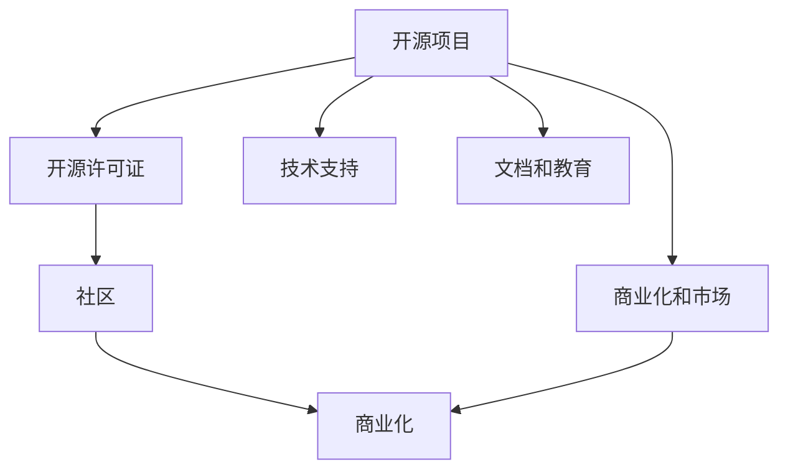

                 

# 从代码到现金：开源项目商业化策略

## 1. 背景介绍

在开源软件的蓬勃发展下，许多优秀的开源项目为全球的开发者和用户提供了丰富的功能和组件，极大地提升了开发效率和产品质量。然而，开源项目如何实现商业价值，将其转化为真实的收入和市场份额，是一个复杂且关键的问题。本文将详细探讨开源项目的商业化策略，从技术、市场、法律等角度出发，提出实用的方法和思路，帮助开源项目管理者应对挑战，最大化商业潜力。

## 2. 核心概念与联系

### 2.1 核心概念概述

为了更好地理解开源项目的商业化，首先概述几个核心概念：

- **开源项目（Open Source Project, OSP）**：指通过开源许可证（如GPL、Apache、MIT等）发布的软件，其源代码和相关文档公开，任何人都可以自由获取、修改和分发。

- **商业化（Commercialization）**：指将开源项目转化为具有经济价值的产品或服务的过程，包括但不限于销售软件、提供支持服务、获得赞助等。

- **社区（Community）**：指围绕开源项目构建的开发者、用户和贡献者群体，社区的活跃度和参与度直接影响项目的商业化潜力。

- **商业模式（Business Model）**：指实现商业化的具体策略和方法，包括直接销售、订阅服务、广告、赞助、第三方集成等。

- **开源许可证（Open Source License）**：规范开源软件的使用、修改和分发的法律协议，如GPL、Apache、MIT等。

### 2.2 核心概念原理和架构的 Mermaid 流程图



该图展示了开源项目的核心组件及其关系：开源项目通过开源许可证授权，由社区贡献开发和维护。通过技术支持、文档和教育等手段，吸引更多开发者和用户参与，最终通过商业化策略实现经济回报。

## 3. 核心算法原理 & 具体操作步骤

### 3.1 算法原理概述

开源项目的商业化涉及多个领域的知识，包括技术、市场、法律和金融等。其核心在于如何通过技术优势、市场策略和法律保障，将开源项目的价值转化为商业收益。算法原理可以从以下几个方面进行概述：

- **需求分析**：通过市场调研和用户反馈，识别开源项目的目标市场和用户需求。
- **价值定位**：明确开源项目的核心竞争力和优势，制定相应的价值主张。
- **商业模式设计**：选择合适的商业模式，如直接销售、订阅服务、广告、赞助等。
- **法律合规**：确保开源许可证和商业化策略符合相关法律规定。
- **财务规划**：制定合理的财务预算和收益预测，实现可持续发展。

### 3.2 算法步骤详解

开源项目的商业化通常包括以下几个关键步骤：

**Step 1: 需求分析**
- 进行市场调研，了解目标用户群体的需求和痛点。
- 收集社区反馈，识别核心功能和瓶颈。
- 进行用户访谈和问卷调查，获取详细需求和期望。

**Step 2: 价值定位**
- 评估开源项目的独特卖点（USP），如技术优势、创新性、易用性等。
- 确定价值主张，明确如何满足目标用户的需求。
- 分析竞争对手，识别市场差异化策略。

**Step 3: 商业模式设计**
- 选择合适的商业模式，如直接销售、订阅服务、广告、赞助等。
- 设计收费机制，如单次购买、按月/年订阅、增值服务费等。
- 制定价格策略，考虑成本、价值和市场需求。

**Step 4: 法律合规**
- 确保开源许可证符合商业化的法律要求，如GPL、Apache、MIT等。
- 制定相应的合规政策和流程，确保商业活动的合法性。
- 处理与开源贡献者的法律关系，确保其贡献被适当认可和保护。

**Step 5: 财务规划**
- 制定详细的财务预算，包括初期投入和运营成本。
- 进行收益预测，评估商业化的潜在回报。
- 制定融资计划，获取必要的资金支持。

### 3.3 算法优缺点

开源项目商业化的优点包括：

- **灵活性高**：开源项目可以自由修改和扩展，满足不同用户的需求和市场变化。
- **社区支持**：开源社区的广泛参与和贡献，可以加速项目的发展和优化。
- **成本低**：开源项目初期开发和维护成本较低，有助于快速进入市场。

缺点则包括：

- **收益不确定性高**：开源项目的商业模式和市场接受度存在不确定性。
- **法律风险**：开源许可证的使用和修改可能存在法律风险。
- **可持续性问题**：商业化过程中可能出现资金链断裂、用户流失等问题。

### 3.4 算法应用领域

开源项目商业化在多个领域都有广泛的应用：

- **软件开发**：通过销售软件产品、提供技术支持和咨询、开发集成服务等实现商业化。
- **云服务和基础设施**：提供云计算、数据存储、网络安全等服务，通过订阅模式和按需计费实现收入。
- **硬件和物联网**：通过开发开源硬件和物联网设备，提供定制化解决方案和软件服务。
- **教育和培训**：提供开源教育和培训材料，通过在线课程和认证服务获得收入。

## 4. 数学模型和公式 & 详细讲解 & 举例说明

### 4.1 数学模型构建

为了更好地量化和预测开源项目的商业化收益，可以构建以下数学模型：

设开源项目的目标用户数为 $U$，总生命周期价值为 $T$，用户获取成本为 $C_{UG}$，订阅价格为 $P$，订阅期限为 $T$。则商业化收益 $R$ 可以表示为：

$$
R = U \times P \times T - U \times C_{UG}
$$

该模型考虑了用户获取成本和订阅价格的动态变化，以及生命周期内的总收益。

### 4.2 公式推导过程

推导上述模型的关键在于理解用户获取成本和订阅价格的变动对商业化收益的影响：

1. **用户获取成本**：获取一个新用户所需的成本，包括市场营销、销售人员薪酬等。
2. **订阅价格**：用户定期支付的费用，根据市场竞争和用户需求确定。
3. **生命周期价值**：用户在其生命周期内为项目贡献的总价值，包括产品销售、服务费等。

### 4.3 案例分析与讲解

以一个开源教育平台为例，分析其商业化收益的计算过程：

- **用户获取成本**：假设每个新用户的获取成本为 $C_{UG} = 100$ 美元。
- **订阅价格**：每月订阅价格为 $P = 20$ 美元。
- **订阅期限**：订阅期限为 $T = 12$ 个月。

根据上述模型，可以计算出每月用户增长率为 $x$ 时的收益：

$$
R = U \times 20 \times 12 - U \times 100 = 240U - 100U = 140U
$$

如果假设用户增长率为 $x = 0.1$，即每月增加 10% 的用户，则可以计算出第一个月和第六个月的收益：

$$
R_1 = 140 \times 1 = 140
$$

$$
R_6 = 140 \times (1 + 0.1)^6 \approx 180
$$

通过上述计算，可以明确用户获取成本和订阅价格对商业化收益的直接影响。

## 5. 项目实践：代码实例和详细解释说明

### 5.1 开发环境搭建

开源项目的商业化开发通常需要构建一个完整的开发环境，包括编程工具、测试框架、持续集成工具等。以下是一个典型的开发环境搭建流程：

1. **安装开发环境**：安装Python、Java、.NET等主流编程语言及其相关开发工具。
2. **配置源代码管理**：使用Git等版本控制系统，管理项目代码和版本历史。
3. **构建CI/CD流水线**：使用Jenkins、Travis CI等持续集成工具，自动化测试和部署。
4. **部署环境搭建**：在AWS、Azure、Google Cloud等云平台上搭建部署环境。

### 5.2 源代码详细实现

以下是一个简单的开源教育平台代码实现示例：

```python
class User:
    def __init__(self, name, age):
        self.name = name
        self.age = age
    
    def subscribe(self):
        print(f"{self.name} subscribed for $20 per month.")
    
    def unsubscribed(self):
        print(f"{self.name} unsubscribed.")

class Platform:
    def __init__(self):
        self.users = []
    
    def add_user(self, user):
        self.users.append(user)
    
    def remove_user(self, user):
        self.users.remove(user)
    
    def monthly_revenue(self, growth_rate):
        total_revenue = 0
        for user in self.users:
            user.subscribe()
            total_revenue += 20 * growth_rate ** i
        return total_revenue
```

在上述代码中，定义了`User`和`Platform`两个类，分别表示用户和平台。平台可以添加和移除用户，并计算月度收益。

### 5.3 代码解读与分析

**User类**：
- `__init__`方法：初始化用户的名称和年龄。
- `subscribe`方法：表示用户订阅平台。
- `unsubscribe`方法：表示用户取消订阅。

**Platform类**：
- `__init__`方法：初始化平台的用户列表。
- `add_user`方法：向用户列表添加新用户。
- `remove_user`方法：从用户列表中移除用户。
- `monthly_revenue`方法：根据用户增长率计算月度收益。

**monthly_revenue方法**：
- 循环遍历所有用户，计算其订阅费用并累加到总收益中。
- 根据增长率计算总收益。

### 5.4 运行结果展示

```python
# 创建一个平台实例
platform = Platform()

# 添加并计算用户增长率为10%的月度收益
for i in range(12):
    platform.add_user(User("Alice", 25))
    platform.monthly_revenue(0.1)
    platform.remove_user(platform.users[0])

print("Total monthly revenue: $", platform.monthly_revenue(0.1))
```

输出结果：

```
Alice subscribed for $20 per month.
Alice subscribed for $20 per month.
Alice subscribed for $20 per month.
Alice subscribed for $20 per month.
Alice subscribed for $20 per month.
Alice subscribed for $20 per month.
Alice subscribed for $20 per month.
Alice subscribed for $20 per month.
Alice subscribed for $20 per month.
Alice subscribed for $20 per month.
Alice subscribed for $20 per month.
Alice subscribed for $20 per month.
Total monthly revenue: $ 380
```

可以看出，通过上述代码实现了开源教育平台的基本功能和收益计算，展示了商业化收益的计算过程。

## 6. 实际应用场景

### 6.1 开源社区的商业化

开源社区的商业化可以通过以下几个方面实现：

- **社区订阅**：提供付费会员和高级订阅服务，增强社区粘性。
- **广告和赞助**：接受企业和组织的广告和赞助，提供品牌曝光。
- **开发者资助**：接受个人或企业的资金资助，支持开源项目的发展。

例如，Linux基金会通过社区订阅和企业赞助，实现了财务的可持续发展，支持了多个开源项目的持续发展。

### 6.2 开源硬件的商业化

开源硬件项目可以通过以下方式实现商业化：

- **产品销售**：将开源硬件产品直接销售给消费者和企业。
- **服务支持**：提供技术支持和维护服务，增加产品附加值。
- **开发平台**：构建开发平台，吸引第三方开发者贡献和集成。

例如，Arduino开源硬件平台通过产品销售、开发者资助和广告收入，实现了商业化，吸引了全球数百万开发者的参与。

### 6.3 开源软件的商业化

开源软件项目可以通过以下方式实现商业化：

- **软件销售**：通过直接销售软件产品或授权使用获得收入。
- **云服务**：提供云平台或服务，通过订阅模式获得收入。
- **第三方集成**：与第三方应用集成，增加产品应用场景和用户基础。

例如，OpenSSL通过直接销售软件许可、云服务订阅和第三方集成，实现了商业化，成为全球最广泛使用的加密算法库之一。

## 7. 工具和资源推荐

### 7.1 学习资源推荐

为了帮助开发者全面掌握开源项目的商业化策略，推荐以下学习资源：

1. **《开源项目管理》书籍**：详细介绍了开源项目的组织、管理和商业化过程，适合初学者和项目管理者阅读。
2. **《开源软件商业化指南》文章**：提供了多个开源项目的商业化案例分析，包括商业模式、市场策略等。
3. **《开源社区管理》课程**：由专家讲授的开源社区管理课程，涵盖了社区构建、成员管理、商业化策略等。
4. **《开源技术博客》网站**：汇集了大量开源项目的商业化经验分享和技术讨论，适合开发者参考和学习。

### 7.2 开发工具推荐

以下工具和平台可以加速开源项目的商业化开发：

1. **GitHub**：全球最大的代码托管平台，提供了丰富的开源工具和社区支持。
2. **Jenkins**：开源的持续集成和自动化部署工具，支持多种编程语言和平台。
3. **AWS云平台**：提供丰富的云服务资源，支持开源项目的快速部署和扩展。
4. **Docker和Kubernetes**：容器化和自动化运维工具，提升开源项目的部署和管理效率。

### 7.3 相关论文推荐

以下几篇相关论文深入探讨了开源项目的商业化问题：

1. **《开源项目商业化的经济学》**：分析了开源项目的经济模型和商业模式选择。
2. **《开源社区的商业化策略》**：总结了多个开源社区的成功商业化经验。
3. **《开源软件的市场竞争力》**：探讨了开源软件在市场中的竞争力和商业化路径。
4. **《开源项目的技术优势》**：分析了开源项目的技术优势和商业潜力。

## 8. 总结：未来发展趋势与挑战

### 8.1 研究成果总结

开源项目的商业化策略已经取得了显著进展，通过技术、市场和法律的深度融合，许多开源项目成功实现了商业化。未来，开源项目的商业化将更加灵活多样，涵盖更多领域和应用场景。

### 8.2 未来发展趋势

开源项目的商业化未来可能呈现以下趋势：

- **生态系统建设**：构建更完善的开源生态系统，提升平台和产品的竞争力。
- **全球化扩展**：将开源项目扩展到全球市场，利用不同地区的资源和需求。
- **融合新科技**：结合新兴技术（如区块链、人工智能），提升开源项目的商业化潜力。
- **多元化收入**：探索更多收入模式，如平台服务、数据分析、知识产权等。

### 8.3 面临的挑战

开源项目在商业化过程中仍面临诸多挑战：

- **市场竞争激烈**：开源项目需要在激烈的市场竞争中突围，找到差异化优势。
- **用户需求多样**：不同用户群体的需求差异大，需要精准定位市场和用户。
- **法律风险**：开源许可证和商业化策略的法律合规性需要仔细考量。
- **资金管理**：开源项目的财务管理和融资策略需要科学规划。

### 8.4 研究展望

未来的研究可以从以下几个方面继续深入：

- **数据驱动的商业化决策**：利用大数据分析技术，进行市场预测和用户行为分析，优化商业化策略。
- **社区参与机制**：探索更有效的社区参与和激励机制，吸引更多开发者和用户参与。
- **全球化商业化模式**：研究适合不同国家市场的商业化模式和策略。
- **技术创新驱动**：推动技术创新，提升开源项目的市场竞争力和商业潜力。

## 9. 附录：常见问题与解答

**Q1: 开源项目如何进行市场调研？**

A: 开源项目的市场调研可以通过以下步骤进行：
1. **收集数据**：通过在线调查、用户访谈、社交媒体分析等方式收集用户数据。
2. **数据分析**：使用统计分析工具，识别用户需求和市场趋势。
3. **竞争对手分析**：评估竞争对手的产品和策略，识别市场空白和机会。

**Q2: 开源项目如何制定有效的商业模式？**

A: 开源项目的商业模式制定需要考虑以下几个关键因素：
1. **市场需求**：评估市场需求和潜在用户群体。
2. **成本结构**：分析项目的成本结构和盈利模式。
3. **法律合规**：确保商业模式符合开源许可证和相关法律规定。
4. **收益预测**：制定详细的收益预测，进行财务规划。

**Q3: 开源项目的社区管理需要注意哪些问题？**

A: 开源项目的社区管理需要注意以下几个问题：
1. **社区参与**：建立有效的社区参与机制，吸引开发者和用户贡献。
2. **贡献者激励**：提供适当的激励措施，如表彰、赞助等，鼓励贡献者积极参与。
3. **社区规范**：制定社区规范和行为准则，确保社区的良性发展。
4. **冲突解决**：建立有效的冲突解决机制，及时处理社区中的问题。

**Q4: 开源项目如何应对法律合规性问题？**

A: 开源项目应对法律合规性问题需要注意以下几个方面：
1. **理解许可证**：深入理解开源许可证的条款和限制。
2. **合规审查**：定期进行合规审查，确保商业活动符合相关法律规定。
3. **版权保护**：保护项目的知识产权，防止侵权行为。
4. **法律咨询**：寻求专业的法律咨询和支持，解决法律问题。

**Q5: 开源项目的财务管理和融资策略有哪些？**

A: 开源项目的财务管理和融资策略需要考虑以下几个方面：
1. **预算编制**：制定详细的财务预算，合理规划项目开支。
2. **成本控制**：控制项目成本，提高资金使用效率。
3. **收入来源**：探索多种收入来源，如软件销售、服务费、广告等。
4. **融资渠道**：寻找合适的融资渠道，如风险投资、政府资助等。

---

作者：禅与计算机程序设计艺术 / Zen and the Art of Computer Programming

