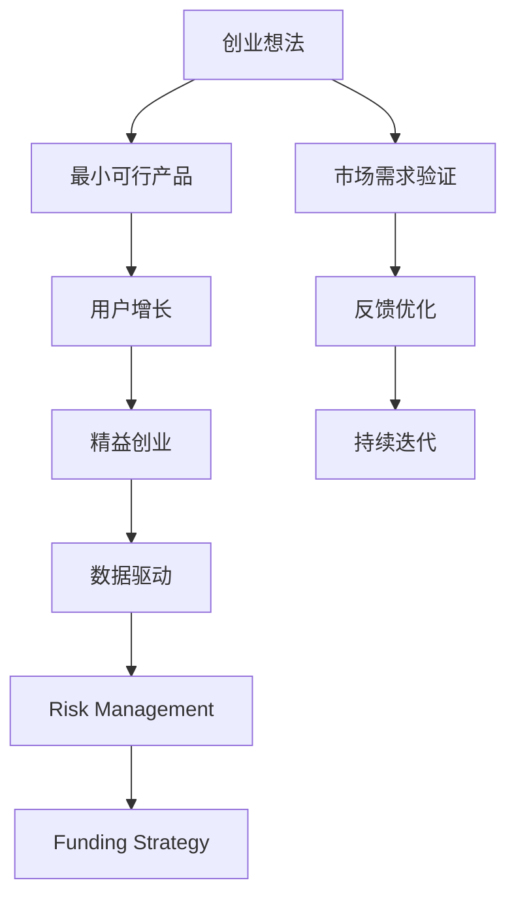

                 

# 从想法到产品：高效创业之路

> 关键词：创业, 产品, 想法, 高效, 用户体验, MVP, 快速迭代, 增长策略, 数据驱动, 管理, 风险, 投资

## 1. 背景介绍

### 1.1 问题由来
随着技术的不断进步和市场需求的日益多样，创业者纷纷投入到创新创业的浪潮中。但如何从零到一，将一个想法转化为成功的产品，仍是许多创业者面临的共同挑战。随着数字经济的兴起，越来越多的初创企业在技术创新和市场拓展中取得了显著成就。这些企业所采取的战略和战术，在产品开发、用户获取、增长优化等方面都具有可借鉴性。

### 1.2 问题核心关键点
创业不仅是一纸想法，而是一个从构想到实现，再到持续优化和迭代的过程。这一过程中，创业者需要解决的关键点包括：
- 如何高效地将想法转化为实际的产品原型。
- 如何通过最小可行产品(MVP)验证市场需求，快速迭代改进。
- 如何制定有效的用户增长策略，迅速扩大用户规模。
- 如何管理团队，应对风险和投资，保障企业的稳定发展。

本文将从理念、策略和实践三个层面，深入剖析创业之路，为创业者提供一套全面而高效的产品开发和增长优化指南。

### 1.3 问题研究意义
本文聚焦于创业者如何将创新想法转化为高效的产品，并持续优化和增长。通过分析业界优秀的创业实践，本文旨在帮助创业者突破思维限制，提高产品开发的效率和成功率，加速企业成长。研究创业的策略和实践，对探索如何建设一个稳定、可持续发展的初创企业具有重要的指导意义。

## 2. 核心概念与联系

### 2.1 核心概念概述

为了更好地理解创业过程中的关键要素及其联系，本节将介绍几个核心概念：

- **创业想法(创业点子)**：即创业机会，源自市场需求、技术创新或社会问题，是产品开发的起点。
- **最小可行产品(MVP)**：指在尽可能短的时间内构建一个能够满足用户核心需求的简单产品原型，用于测试和验证市场需求。
- **用户增长(Growth Hacking)**：指通过创新手段提升用户数量和留存率，包括A/B测试、推荐系统、市场营销等策略。
- **精益创业(Lean Startup)**：强调在资源有限的情况下，快速验证商业模式和市场需求的精益生产方式。
- **数据驱动(数据化决策)**：基于数据分析和反馈来优化产品设计和管理决策，减少盲目的业务决策。
- **风险管理(Risk Management)**：指识别、评估和管理企业面临的各类风险，保障企业的可持续发展。
- **融资策略(Funding Strategy)**：指企业筹集资金的战略和方式，包括天使投资、风险投资、众筹等。

这些概念之间的关系可以通过以下Mermaid流程图来展示：



这个流程图展示了一些关键概念及其相互关系：

1. 创业想法通过MVP得到验证。
2. 用户增长和精益创业相结合，不断优化产品。
3. 数据驱动决策贯穿产品开发和增长全过程。
4. 风险管理和融资策略是企业持续发展的重要保障。
5. 市场需求验证和持续优化反馈构成迭代循环。

这些概念共同构成了创业的总体框架，有助于创业者系统化地理解创业过程，并科学地设计和管理企业的生命周期。

## 3. 核心算法原理 & 具体操作步骤
### 3.1 算法原理概述

将创业理念转化为高效产品，本质上是一个优化过程，涉及多种策略和技巧。核心算法原理包括：

1. **问题定义**：准确地定义产品所解决的问题和目标用户。
2. **需求分析**：通过用户调研和市场分析，深入理解用户需求和痛点。
3. **数据收集**：收集用户反馈和行为数据，用于迭代优化产品。
4. **模型构建**：构建产品原型和功能模型，并进行市场测试。
5. **策略调整**：根据测试结果和用户反馈，不断调整产品策略和功能。
6. **优化迭代**：通过迭代改进和优化产品，提升用户体验和满意度。

### 3.2 算法步骤详解

基于上述核心算法原理，高效创业的一般操作步骤如下：

**Step 1: 定义创业想法**
- 确认市场需求：进行市场调研，验证商业机会的可行性。
- 明确目标用户：定义目标用户群体的特征和需求。
- 设定产品愿景：确定产品能够解决的核心问题和用户价值。

**Step 2: 构建最小可行产品**
- 选择工具和技术：选择合适的技术栈和开发工具。
- 设计产品原型：绘制功能草图和界面原型。
- 实现核心功能：实现用户价值最大的核心功能模块。
- 初步市场测试：向一小部分用户展示原型，收集反馈。

**Step 3: 数据收集与分析**
- 用户反馈收集：通过问卷调查、访谈、A/B测试等方式收集用户反馈。
- 行为数据分析：分析用户的使用数据，理解用户行为模式。
- 反馈优化迭代：根据用户反馈，调整和优化产品功能。

**Step 4: 用户增长和市场推广**
- 制定增长策略：设计增长漏斗，优化用户获取和留存。
- 实施增长行动：开展社交媒体营销、内容营销、邮件营销等增长活动。
- 监控增长效果：通过数据分析监控增长效果，持续优化策略。

**Step 5: 精益创业和迭代优化**
- 持续迭代改进：快速迭代产品，不断优化用户体验。
- 灵活应对变化：根据市场变化和用户反馈调整产品方向。
- 持续优化盈利模式：设计可持续的盈利模式，实现商业成功。

**Step 6: 风险管理和融资**
- 识别潜在风险：分析市场和运营风险，制定应对策略。
- 规划融资方案：选择合适的融资渠道和策略，保障企业资金需求。
- 持续优化管理：建立高效的管理机制，保障企业稳定发展。

### 3.3 算法优缺点

创业过程中基于上述核心算法原理的策略和步骤，具有以下优缺点：

**优点：**
1. **效率高**：快速构建MVP，及时收集用户反馈，避免大范围资源浪费。
2. **适应性强**：根据市场反馈和数据驱动决策，灵活调整产品策略。
3. **风险低**：通过小范围测试验证市场需求，减小市场风险。

**缺点：**
1. **初期成本高**：快速构建MVP和数据收集初期需要较多人力和时间投入。
2. **反馈周期长**：收集和分析数据需要时间，难以快速响应市场需求。
3. **优化难度大**：需要持续优化和迭代，团队需要具备较强的技术和管理能力。

尽管存在这些缺点，但整体而言，基于核心算法原理的创业策略仍是一种高效且可行的方式。通过精心规划和执行，可以最大程度地降低创业风险，实现快速成长和商业成功。

### 3.4 算法应用领域

基于上述核心算法原理的创业策略和方法，广泛应用于各类初创企业的实践中。以下列举几个典型的应用领域：

- **SaaS企业**：如Salesforce、Dropbox等，通过构建MVP快速验证市场需求，迅速扩大用户规模。
- **电商企业**：如Shopify、Alibaba，利用数据驱动和精益创业策略，不断优化产品体验，提升用户留存和转化率。
- **初创技术公司**：如Slack、Zoom，通过最小可行产品验证技术解决方案的可行性，快速获取市场认知和用户信任。
- **金融科技企业**：如PayPal、Square，通过数据分析和增长策略，提升用户体验和金融服务效率。

以上企业均通过这些策略实现了快速增长和商业成功，证明了其有效性和普适性。

## 4. 数学模型和公式 & 详细讲解 & 举例说明

### 4.1 数学模型构建

为更好地理解基于数据的创业策略，本节将通过数学模型来详细描述产品增长的各个环节。

假设初创企业的产品增长过程可以分解为多个阶段，每个阶段的增长速度为$G_t$，用户留存率为$S_t$，用户获取成本为$C_t$，总用户数为$U_t$，目标增长率为$r$。则整个产品生命周期的增长模型可以表示为：

$$
U_t = \sum_{i=1}^t G_i
$$

其中，$G_i = U_i \times S_i \times r - C_i \times U_i$，$U_i$为第$i$个时间点的用户数。

### 4.2 公式推导过程

以下对用户增长模型的推导过程进行详细说明：

**Step 1: 用户增长**
- $G_t = U_t \times S_t \times r - C_t \times U_t$
- $G_i$ 表示在第$i$个时间点的增长量，其中第一部分是自然增长（用户留存率 $S_t$ 和目标增长率 $r$），第二部分是获取成本导致的减少量。

**Step 2: 用户留存率**
- $S_t$ 表示用户在第$t$个时间点的留存率，可以通过历史数据进行预测，例如使用逻辑回归等方法。

**Step 3: 用户获取成本**
- $C_t$ 表示用户获取成本，可以通过A/B测试等手段进行评估，例如使用增量成本计算。

**Step 4: 用户总数量**
- $U_t$ 表示第$t$个时间点的总用户数，可以通过累计增长量来计算。

通过上述模型，可以预测产品不同阶段的用户增长和留存，优化用户获取策略和成本控制，实现高效的用户增长。

### 4.3 案例分析与讲解

以Slack为例，分析其在用户增长和市场推广方面的成功策略：

**背景分析**：
Slack作为企业沟通工具，早期通过免费版吸引大量企业使用，逐渐向付费版转型。其增长策略包括以下几个关键步骤：

**Step 1: 构建MVP**
- Slack最初推出了一个基本版，仅提供核心功能，满足用户最基本的需求。
- 通过调查和访谈，确认企业沟通工具的市场需求和痛点。

**Step 2: 数据收集与分析**
- 收集用户反馈，了解用户痛点和需求。
- 分析用户行为数据，优化产品界面和功能。

**Step 3: 增长策略**
- 通过社交媒体和内容营销，快速传播产品优势和用户体验。
- 使用A/B测试和转化漏斗，优化用户获取和留存策略。

**Step 4: 精益创业和迭代优化**
- 持续收集用户反馈，快速迭代产品功能。
- 定期进行用户调研，调整产品方向和市场策略。

**Step 5: 风险管理和融资**
- 识别初期扩张风险，进行风险评估和管理。
- 通过投资者和合作伙伴的多元化融资，保障资金需求。

Slack的成功案例充分证明了基于核心算法原理的创业策略的有效性和可操作性，为其他初创企业提供了宝贵的借鉴。

## 5. 项目实践：代码实例和详细解释说明
### 5.1 开发环境搭建

在进行创业产品开发前，我们需要准备好开发环境。以下是使用Python进行Django开发的环境配置流程：

1. 安装Anaconda：从官网下载并安装Anaconda，用于创建独立的Python环境。

2. 创建并激活虚拟环境：
```bash
conda create -n django-env python=3.8 
conda activate django-env
```

3. 安装Django：通过pip安装Django，并创建项目和应用。
```bash
pip install django
django-admin startproject myproject
```

4. 安装需要的依赖包：
```bash
pip install Pillow django-cors-headers django-axes
```

完成上述步骤后，即可在`django-env`环境中开始创业产品开发。

### 5.2 源代码详细实现

现在我们以开发一个在线读书社区为例，给出使用Django进行创业产品开发的代码实现。

首先，定义项目和应用：

```python
from django.conf import settings
from django.contrib import admin
from django.urls import include, path
from django.contrib.auth import views as auth_views

urlpatterns = [
    path('admin/', admin.site.urls),
    path('', include('home.urls')),
    path('books/', include('books.urls')),
    path('admin/', include('admin.site.urls')),
]
```

然后，定义模型和视图：

```python
from django.db import models
from django.contrib.auth.models import User

class Book(models.Model):
    title = models.CharField(max_length=200)
    author = models.CharField(max_length=200)
    summary = models.TextField()
    published = models.DateField(auto_now_add=True)

class User(models.Model):
    email = models.EmailField(unique=True)
    password = models.CharField(max_length=100)

class BookViewSet(viewsets.ModelViewSet):
    queryset = Book.objects.all()
    serializer_class = BookSerializer

class UserViewSet(viewsets.ModelViewSet):
    queryset = User.objects.all()
    serializer_class = UserSerializer

class BookCommentViewSet(viewsets.ModelViewSet):
    queryset = BookComment.objects.all()
    serializer_class = BookCommentSerializer
```

最后，定义视图和序列化器：

```python
from rest_framework.views import APIView
from rest_framework.response import Response
from rest_framework.permissions import IsAuthenticated

class BookView(APIView):
    def get(self, request):
        books = Book.objects.all()
        serializer = BookSerializer(books, many=True)
        return Response(serializer.data)

class UserView(APIView):
    def get(self, request):
        users = User.objects.all()
        serializer = UserSerializer(users, many=True)
        return Response(serializer.data)

class BookCommentView(APIView):
    def get(self, request):
        comments = BookComment.objects.all()
        serializer = BookCommentSerializer(comments, many=True)
        return Response(serializer.data)
```

定义序列化器：

```python
from rest_framework import serializers

class BookSerializer(serializers.ModelSerializer):
    class Meta:
        model = Book
        fields = '__all__'

class UserSerializer(serializers.ModelSerializer):
    class Meta:
        model = User
        fields = '__all__'

class BookCommentSerializer(serializers.ModelSerializer):
    class Meta:
        model = BookComment
        fields = '__all__'
```

以上代码实现了一个基础的在线读书社区，包括用户登录、书籍管理和评论系统。通过Django的快速开发特性，可以迅速构建产品原型，验证市场需求，快速迭代优化。

### 5.3 代码解读与分析

下面我们详细解读代码的关键部分：

**Django环境配置**：
- 通过`conda create`命令创建独立的Python虚拟环境。
- 通过`django-admin startproject`创建项目，`python manage.py startapp`创建应用。
- 安装必要的依赖包，如Pillow、django-cors-headers和django-axes。

**模型定义**：
- 定义了`Book`模型，包含书名、作者、简介和发布日期。
- 定义了`User`模型，包含电子邮件和密码。
- 定义了`BookComment`模型，用于记录书籍评论。

**视图定义**：
- 定义了`BookViewSet`视图，用于获取所有书籍信息。
- 定义了`UserViewSet`视图，用于获取所有用户信息。
- 定义了`BookCommentViewSet`视图，用于获取所有评论信息。

**序列化器定义**：
- 使用`rest_framework`提供的序列化器，将模型数据转换为JSON格式，方便前端接收和使用。

通过上述代码实现，开发者可以快速搭建起一个完整的读书社区产品原型，验证市场需求，并进行快速迭代优化。

## 6. 实际应用场景

### 6.1 智能家居控制

智能家居控制作为未来家庭生活的必备品，具有广阔的市场前景。基于创业理念和用户需求，可以开发一个智能家居控制系统，通过手机App远程控制家庭设备。

**背景分析**：
随着物联网技术的发展，越来越多的家居设备可以实现智能控制。用户希望能够通过智能手机方便地控制家中的各种设备，提升生活品质。

**Step 1: 构建MVP**
- 设计基本功能：语音识别、设备控制等。
- 收集用户需求：通过访谈和问卷调研用户需求和痛点。

**Step 2: 数据收集与分析**
- 收集用户使用数据，分析设备控制频率和使用场景。
- 通过用户反馈，优化产品界面和功能。

**Step 3: 增长策略**
- 通过社交媒体和内容营销，提升产品知名度。
- 利用推荐系统，引导用户发现并使用新产品。

**Step 4: 精益创业和迭代优化**
- 持续收集用户反馈，优化产品体验。
- 定期进行用户调研，调整产品方向和市场策略。

**Step 5: 风险管理和融资**
- 识别初期扩张风险，进行风险评估和管理。
- 通过投资者和合作伙伴的多元化融资，保障资金需求。

通过上述策略，可以逐步构建一个高效的智能家居控制系统，满足用户需求，实现快速增长。

### 6.2 电子商务平台

电子商务平台作为数字经济的重要组成部分，具有巨大的市场潜力和商业价值。基于创业理念和用户需求，可以开发一个面向中小企业的电子商务平台，提供低成本的电商解决方案。

**背景分析**：
随着电子商务的发展，越来越多的中小企业希望通过互联网渠道销售产品，提升销售额。但传统电商平台的运营成本较高，技术门槛也较高。

**Step 1: 构建MVP**
- 设计基本功能：商品管理、订单处理、支付集成等。
- 收集用户需求：通过访谈和问卷调研用户需求和痛点。

**Step 2: 数据收集与分析**
- 收集用户行为数据，分析购买行为和退货原因。
- 通过用户反馈，优化产品功能和用户体验。

**Step 3: 增长策略**
- 通过SEO和PPC等手段提升网站流量。
- 利用邮件营销和推荐系统，提升用户转化率。

**Step 4: 精益创业和迭代优化**
- 持续收集用户反馈，优化产品体验。
- 定期进行用户调研，调整产品方向和市场策略。

**Step 5: 风险管理和融资**
- 识别初期扩张风险，进行风险评估和管理。
- 通过投资者和合作伙伴的多元化融资，保障资金需求。

通过上述策略，可以逐步构建一个高效的电子商务平台，帮助中小企业实现电商转型，提升销售额。

### 6.3 移动健康应用

移动健康应用作为数字医疗的重要组成部分，具有广阔的市场前景。基于创业理念和用户需求，可以开发一个移动健康应用，帮助用户实时监测健康状况，提升生活质量。

**背景分析**：
随着健康意识的提升，越来越多的用户希望通过移动应用实时监测健康数据，如心率、睡眠质量、步数等。但现有的健康应用功能单一，用户体验不佳。

**Step 1: 构建MVP**
- 设计基本功能：心率监测、步数统计等。
- 收集用户需求：通过访谈和问卷调研用户需求和痛点。

**Step 2: 数据收集与分析**
- 收集用户健康数据，分析用户健康趋势和行为模式。
- 通过用户反馈，优化产品功能和用户体验。

**Step 3: 增长策略**
- 通过社交媒体和内容营销，提升产品知名度。
- 利用推荐系统和健康数据分析，引导用户使用新产品。

**Step 4: 精益创业和迭代优化**
- 持续收集用户反馈，优化产品体验。
- 定期进行用户调研，调整产品方向和市场策略。

**Step 5: 风险管理和融资**
- 识别初期扩张风险，进行风险评估和管理。
- 通过投资者和合作伙伴的多元化融资，保障资金需求。

通过上述策略，可以逐步构建一个高效的移动健康应用，满足用户需求，实现快速增长。

### 6.4 未来应用展望

随着技术的不断进步和市场需求的日益多样，未来创业应用将更加广泛和多样。以下是几个可能的未来应用方向：

**虚拟现实(VR)**：开发虚拟现实应用，通过VR技术提供沉浸式的游戏和教育体验。
**增强现实(AR)**：开发增强现实应用，结合AR技术实现虚拟与现实的结合，提供更丰富的互动体验。
**区块链(Bitcoin)**：利用区块链技术开发去中心化的应用，提升数据安全和交易效率。
**人工智能(AI)**：开发智能助理和推荐系统，提供个性化服务和智能决策支持。
**物联网(IoT)**：开发智能家居和智能城市应用，提升生活和城市管理智能化水平。

未来，基于创业理念和技术创新的新应用将层出不穷，为人类带来更多便利和可能性。

## 7. 工具和资源推荐
### 7.1 学习资源推荐

为了帮助创业者系统掌握创业过程中的各个环节，以下是一些推荐的资源：

1. **《精益创业》(The Lean Startup) - 埃里克·莱斯**：这是一本经典的创业指南，介绍了精益创业的核心理念和方法。
2. **《零到一》(Zero to One) - 彼得·蒂尔**：探讨了如何从0到1创建独特的产品和服务。
3. **《数据驱动增长》(Growth Hacking) - 乔什·华特纳**：介绍了如何通过数据驱动的增长策略快速扩大用户规模。
4. **《Python Web开发实战》(Flask Web Development) - 莫里斯·比克**：介绍了使用Django和Flask等框架开发Web应用的方法和技巧。
5. **《深度学习入门》(Dive Into Deep Learning) - 李沐**：介绍了深度学习的基础知识和技术应用，适合初学者入门。

通过这些资源的学习，可以帮助创业者系统掌握创业的基本理论和实践技巧。

### 7.2 开发工具推荐

高效的开发离不开优秀的工具支持。以下是几款用于创业产品开发的常用工具：

1. **Python**：使用Python语言可以快速开发原型和实现复杂功能。
2. **Django**：使用Django框架可以快速搭建Web应用，提供完善的ORM和模板引擎。
3. **JIRA**：使用JIRA进行项目管理，追踪任务进度，分配责任。
4. **Trello**：使用Trello进行团队协作和任务管理，实时跟踪任务状态。
5. **Slack**：使用Slack进行团队沟通和协作，提升工作效率。

合理利用这些工具，可以显著提升创业产品的开发效率，加快创新迭代的步伐。

### 7.3 相关论文推荐

创业过程中涉及诸多前沿技术和理论，以下是几篇具有代表性的相关论文：

1. **《精益创业的数学模型》(The Math of Lean Startups)**：通过数学模型分析了精益创业的核心原则和方法。
2. **《数据驱动增长的方法》(Data-Driven Growth)**：介绍了如何使用数据驱动的增长策略优化产品开发和市场推广。
3. **《创业生态系统的演化》(Evolution of the Startup Ecosystem)**：探讨了创业生态系统的变化和未来趋势。
4. **《区块链在创业中的应用》(Blockchain for Startups)**：分析了区块链技术在创业中的应用和前景。
5. **《人工智能创业的挑战》(Artificial Intelligence in Startups)**：讨论了AI技术在创业中的挑战和机遇。

这些论文代表了创业技术研究的前沿方向，帮助创业者深入理解创业的原理和实践。

## 8. 总结：未来发展趋势与挑战
### 8.1 总结

本文从创业理念、策略和实践三个层面，深入剖析了如何将创新想法转化为高效的产品。通过分析业界优秀的创业实践，本文旨在帮助创业者突破思维限制，提高产品开发的效率和成功率，加速企业成长。研究创业的策略和实践，对探索如何建设一个稳定、可持续发展的初创企业具有重要的指导意义。

### 8.2 未来发展趋势

展望未来，创业之路将呈现以下几个发展趋势：

1. **数据驱动更加重要**：随着数据的积累和分析能力的提升，数据驱动决策将更加普遍，帮助创业者精准把握市场机会和用户需求。
2. **技术创新更加重要**：新技术的应用将推动创业应用的多样化和创新性，如区块链、AI、VR/AR等技术的应用将带来新的增长机遇。
3. **用户需求更加多样**：用户的个性化需求和痛点不断增加，创业者需要更加注重用户研究和个性化产品的开发。
4. **市场竞争更加激烈**：市场竞争环境将更加复杂，需要创业团队具备更强的竞争力和快速响应能力。
5. **管理更加精细化**：企业规模的扩大和业务的复杂化，需要更加精细化的管理和运营策略，保障企业的稳定发展。

这些趋势表明，未来的创业环境将更加复杂多变，对创业者提出了更高的要求。

### 8.3 面临的挑战

尽管创业机会不断涌现，但创业者仍面临诸多挑战：

1. **市场竞争激烈**：大量的创业企业争抢有限的资源，市场竞争日趋激烈。
2. **资源限制**：创业初期资源有限，需要高效利用资金、人力和市场机会。
3. **用户获取难度大**：获取大量用户是创业的重要目标，但用户获取成本和难度也在增加。
4. **产品迭代快**：快速迭代和优化产品是创业的常态，需要团队具备快速响应和迭代能力。
5. **管理复杂化**：企业规模扩大后，管理复杂度增加，需要构建高效的组织架构和管理机制。

创业者需要针对这些挑战，制定科学的策略和措施，保障企业的健康发展。

### 8.4 研究展望

面对未来的发展趋势和挑战，创业研究需要在以下几个方面进行深入探索：

1. **数据驱动的创新**：探索如何通过数据驱动的决策优化产品开发和市场推广。
2. **技术融合创新**：研究如何融合多种新兴技术，如AI、VR/AR、区块链等，提升创业应用的创新性和竞争力。
3. **用户体验优化**：研究如何通过用户研究和个性化设计，提升产品的用户体验和满意度。
4. **管理优化**：研究如何构建高效的管理机制，优化组织架构和运营效率。
5. **市场扩展策略**：研究如何构建高效的增长策略，快速扩大市场规模。

这些研究方向将帮助创业者更好地应对未来挑战，实现企业的持续发展和成功。

## 9. 附录：常见问题与解答

**Q1：创业初期应该如何获取用户？**

A: 获取用户是创业的重要目标，以下是几种常见的方法：
1. **社交媒体营销**：利用Facebook、Twitter等平台进行用户推广。
2. **内容营销**：通过博客、视频等形式，提供有价值的内容吸引用户。
3. **邮件营销**：通过邮件列表发送定期更新，保持用户粘性。
4. **推荐系统**：利用现有用户推荐新用户，提升用户获取效率。
5. **线下活动**：举办线下活动和展会，直接接触潜在用户。

**Q2：如何快速验证市场需求？**

A: 快速验证市场需求是创业的核心步骤，以下是几种常见的方法：
1. **MVP产品**：构建最小可行产品，快速验证产品核心功能。
2. **A/B测试**：通过A/B测试，对比不同功能或界面对用户行为的影响。
3. **用户调研**：通过问卷调查和访谈，了解用户需求和痛点。
4. **竞品分析**：分析竞品的市场表现和用户反馈，优化产品设计。
5. **用户反馈收集**：通过产品内嵌的反馈功能，及时收集用户意见和建议。

**Q3：如何平衡产品开发和市场推广？**

A: 产品开发和市场推广是创业过程中需要平衡的重要环节，以下是几种常见的方法：
1. **迭代开发**：采用敏捷开发方法，快速迭代产品功能，快速响应市场变化。
2. **优先级管理**：根据市场需求和用户反馈，优先开发高价值功能，提升用户满意度。
3. **数据驱动**：利用数据分析，优化产品开发和市场推广策略。
4. **团队协作**：建立高效的团队协作机制，保障产品和市场同步推进。
5. **资源配置**：合理配置资源，平衡产品开发和市场推广的投入。

通过这些方法，可以更好地平衡产品开发和市场推广，实现快速增长。

**Q4：如何应对创业中的风险？**

A: 创业过程中面临诸多风险，以下是几种常见的方法：
1. **市场调研**：深入了解市场需求和用户痛点，避免市场风险。
2. **财务规划**：合理规划资金使用，保障企业运营稳定。
3. **法律合规**：遵守相关法律法规，规避法律风险。
4. **风险管理**：建立风险管理机制，及时识别和应对风险。
5. **多元化融资**：通过多渠道融资，降低资金风险。

这些方法可以帮助创业团队更好地应对风险，保障企业的可持续发展。

---

作者：禅与计算机程序设计艺术 / Zen and the Art of Computer Programming

