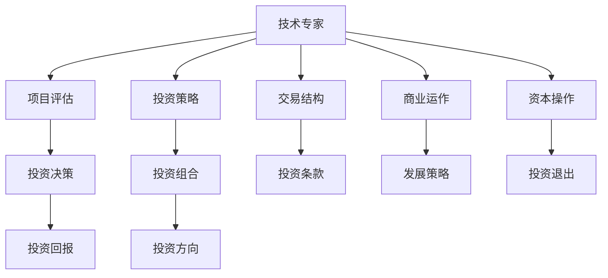

                 

# 从技术专家到风险投资合伙人的跨界之路

## 1. 背景介绍

### 1.1 问题由来
科技行业的快速发展，使得众多技术专家纷纷走出实验室，进入创业和投资领域，成为新的决策者。这一趋势不仅改变了产业格局，也催生了新的市场需求。风险投资作为资本与技术联姻的桥梁，成为了推动技术创新和产业转型的重要力量。技术专家转任风险投资合伙人，能够在原有技术背景的基础上，深入理解行业趋势、商业模式，全面洞察企业的潜力和风险，为科技创新和产业发展提供更有针对性的支持。

### 1.2 问题核心关键点
从技术专家到风险投资合伙人，这一跨界之路涉及多个关键环节，包括技术理解、市场洞察、商业运作、资本操作等。技术专家需掌握项目评估、投资策略、交易结构等核心技能，并理解风险和回报的平衡。这一转型过程，不仅需要深厚的技术功底，还需具备跨领域的综合素质。

## 2. 核心概念与联系

### 2.1 核心概念概述

为了更好地理解技术专家到风险投资合伙人这一角色的跨界之路，我们需了解几个关键概念：

- **技术专家**：指具有深度技术背景，掌握特定领域核心技术的人才。他们在技术研发、产品开发等方面具有显著优势，能够解决复杂技术问题，推动技术进步。
- **风险投资合伙人**：指在风险投资机构中担任关键决策角色的合伙人，负责项目评估、投资决策、风险管理等工作，对资本运作和投资回报负责。
- **项目评估**：通过深入分析项目的技术、市场、商业、财务等多个方面，评估项目的潜力和风险，决定是否进行投资。
- **投资策略**：制定合理的投资方向、目标和节奏，确保投资组合的多样性和风险控制。
- **交易结构**：设计复杂的投资协议和条款，保护投资机构的权益，同时满足创业公司的需求。
- **商业运作**：理解企业的商业模式、市场环境、竞争态势，帮助企业制定发展策略，提升市场份额和盈利能力。
- **资本操作**：进行投资项目的财务分析、估值测算，确保投资回报的最大化，进行后续融资和退出安排。

这些概念之间的逻辑关系可以通过以下Mermaid流程图来展示：



这个流程图展示了一个完整的风险投资决策流程：技术专家通过项目评估、制定投资策略、设计交易结构、理解商业运作、进行资本操作，最终作出投资决策，并通过投资回报衡量投资效果。

## 3. 核心算法原理 & 具体操作步骤

### 3.1 算法原理概述

技术专家转型为风险投资合伙人，核心在于将技术理解与市场洞察相结合，形成具有战略价值的投资视角。主要包括以下几个步骤：

1. **技术评估**：利用技术专长，评估项目的技术创新性、可实现性和潜在市场价值。
2. **市场调研**：通过市场分析，评估项目的市场需求、竞争态势、市场份额等。
3. **商业模型分析**：理解项目的商业模式，包括盈利模式、成本结构、客户获取策略等。
4. **财务分析**：进行财务预测和估值，评估项目的投资回报和潜在退出价值。
5. **交易结构设计**：设计合理的投资协议和条款，平衡投资机构和创业公司的利益。
6. **风险管理**：识别项目中的潜在风险，制定风险控制策略，降低投资风险。

### 3.2 算法步骤详解

1. **技术评估**：
   - **技术成熟度**：评估项目技术的实际进展、技术壁垒、技术领先性。
   - **技术可行性**：评估技术的实现难度、资源需求、技术路径。
   - **技术创新性**：评估技术的创新点、技术优势、市场需求。

2. **市场调研**：
   - **市场需求**：分析目标市场的大小、增长潜力、市场需求。
   - **竞争态势**：评估主要竞争对手的优劣势、市场份额。
   - **客户分析**：了解目标客户的需求、行为、特征。

3. **商业模型分析**：
   - **收入模型**：分析项目的收入来源、收入模式、定价策略。
   - **成本结构**：评估项目的成本构成、成本控制措施。
   - **客户获取**：分析客户获取渠道、客户转化率、客户生命周期价值。

4. **财务分析**：
   - **财务预测**：进行销售预测、成本预测、现金流预测。
   - **估值计算**：采用不同估值方法（如DCF、P/E、EV/EBITDA等）计算估值。
   - **投资回报分析**：评估投资回报率、内部收益率、净现值等指标。

5. **交易结构设计**：
   - **投资条款**：设计投资轮次、股份分配、反稀释条款、优先权等。
   - **投资协议**：设计对赌条款、投资者保护条款、清算条款等。

6. **风险管理**：
   - **风险识别**：识别项目中的技术风险、市场风险、财务风险等。
   - **风险控制**：制定风险控制措施，如设置退出条件、设立保护条款等。

### 3.3 算法优缺点

这一跨界转型具有以下优点：

- **双重优势**：技术专家具有深厚的技术背景，能够准确评估技术创新性，同时具备市场洞察力，能够理解市场需求和竞争态势。
- **风险控制**：通过详细的项目评估和风险管理，可以有效降低投资风险。
- **投资回报**：精准的市场评估和商业模型分析，有助于提高投资回报率。

同时，也存在以下挑战：

- **跨领域学习**：从技术转向投资，需要掌握新的知识和技能，如市场分析、财务预测、投资协议设计等。
- **时间精力**：跨界转型需投入大量时间和精力，需平衡技术工作与投资事务。
- **人脉资源**：初入投资领域，需要建立和拓展新的人脉网络，获取更多投资机会。

### 3.4 算法应用领域

基于技术专家到风险投资合伙人的跨界转型，在多个领域具有广泛的应用：

1. **科技创新领域**：技术专家可以深入理解前沿科技趋势，寻找具有高成长性的初创公司进行投资。
2. **传统行业升级**：利用技术专长，帮助传统行业企业进行数字化转型，提升其竞争力。
3. **新兴技术项目**：投资具有技术突破性的项目，如AI、生物技术、新能源等。
4. **市场趋势把握**：通过市场调研，把握行业发展趋势，发掘潜力赛道和未来方向。
5. **投资组合优化**：根据不同的市场环境和投资阶段，优化投资组合，分散风险。

## 4. 数学模型和公式 & 详细讲解 & 举例说明

### 4.1 数学模型构建

在进行投资决策时，通常会构建多个数学模型，以评估项目的潜在价值和风险。以下是一个简单的投资决策模型：

- **项目估值模型**：采用DCF（折现现金流）方法，计算项目的当前价值。
- **投资回报模型**：通过计算投资回报率（ROI），评估投资的收益。
- **风险管理模型**：通过蒙特卡洛模拟，评估项目的不确定性和风险水平。

### 4.2 公式推导过程

1. **项目估值模型**：

   $$
   V_0 = \sum_{t=1}^{\infty} \frac{F_t}{(1 + r)^t}
   $$

   其中 $V_0$ 为项目当前价值，$F_t$ 为第 $t$ 年的自由现金流，$r$ 为折现率。
   
2. **投资回报模型**：

   $$
   ROI = \frac{(卖出价格 - 买入价格)}{买入价格}
   $$

   其中 $ROI$ 为投资回报率，卖出价格为退出时的估值或售价，买入价格为投资成本。

3. **风险管理模型**：

   $$
   V_{\sigma} = V_0 + \sigma \times V_0
   $$

   其中 $V_{\sigma}$ 为项目价值在一定风险水平下的变化，$\sigma$ 为风险系数。

### 4.3 案例分析与讲解

以某AI初创公司为例，进行具体分析：

1. **技术评估**：
   - 技术成熟度：公司掌握了先进的深度学习算法，具备较强的技术实力。
   - 技术可行性：技术方案经过多次迭代，验证了其可行性和实用性。
   - 技术创新性：技术具备多项专利，处于行业领先水平。

2. **市场调研**：
   - 市场需求：目标市场为医疗影像分析领域，市场规模大，增长迅速。
   - 竞争态势：主要竞争对手包括IBM、Google等，但公司的算法技术更具优势。
   - 客户分析：客户主要为医院、影像中心等医疗机构，具备稳定的需求。

3. **商业模型分析**：
   - 收入模型：主要通过订阅服务获取收入。
   - 成本结构：初期研发成本较高，后期维护成本相对较低。
   - 客户获取：通过学术合作、行业展会等渠道获取客户。

4. **财务分析**：
   - 财务预测：预计第一年销售收入500万，第二年增长至1500万。
   - 估值计算：采用DCF法，预测5年后退出，当前估值1000万美元。
   - 投资回报分析：预计投资回报率为200%。

5. **交易结构设计**：
   - 投资条款：A轮融资，投资方持股20%，对赌条款为2年内完成特定市场份额。
   - 投资协议：优先清算权、反稀释条款、回购条款等。

6. **风险管理**：
   - 风险识别：技术实现难度、市场竞争激烈等。
   - 风险控制：设定退出条件、保护投资者权益。

## 5. 项目实践：代码实例和详细解释说明

### 5.1 开发环境搭建

技术专家转型为风险投资合伙人，需具备基本的IT开发能力，建议使用Python进行项目评估和投资决策的开发。

1. **安装Python**：
   - 下载并安装Python解释器。
   - 安装pip包管理工具，用于安装第三方库。

2. **安装相关库**：
   - 安装numpy、pandas、matplotlib等数据处理和可视化库。
   - 安装scikit-learn、statsmodels等统计分析库。
   - 安装jupyter notebook，用于开发和展示代码。

3. **开发环境配置**：
   - 创建虚拟环境，使用virtualenv或conda工具。
   - 激活虚拟环境，安装所需的Python库和依赖。

### 5.2 源代码详细实现

以下是一个简单的投资决策模型代码实现，用于评估项目的当前价值和投资回报率：

```python
import numpy as np
import pandas as pd
from sklearn.metrics import mean_squared_error
from statsmodels.tsa.arima_model import ARIMA

# 定义项目数据
project_data = {
    'Year': [0, 1, 2, 3, 4],
    'Revenue': [5000000, 15000000, 25000000, 35000000, 45000000],
    'Cost': [30000000, 40000000, 50000000, 60000000, 70000000],
    'Discount_Rate': [0.1, 0.1, 0.1, 0.1, 0.1]
}

# 构建数据框
df = pd.DataFrame(project_data)

# 计算自由现金流
df['FCF'] = df['Revenue'] - df['Cost']

# 构建折现现金流模型
model = ARIMA(df['FCF'], order=(1,1,1))
model_fit = model.fit()

# 预测未来现金流
future_cashflows = model_fit.forecast(steps=5)[0]

# 计算当前价值
V0 = np.sum(future_cashflows / (1 + df['Discount_Rate']) ** df['Year'])

# 计算投资回报率
ROI = (V0 - 10000000) / 10000000

print(f'当前价值: {V0:.2f}美元')
print(f'投资回报率: {ROI:.2f}%')
```

### 5.3 代码解读与分析

1. **数据准备**：
   - `project_data`字典包含项目的各项关键数据，包括年份、收入、成本和折现率。
   - `pd.DataFrame()`函数将数据字典转换为pandas数据框，方便数据处理和分析。

2. **现金流计算**：
   - `df['FCF'] = df['Revenue'] - df['Cost']`计算每年的自由现金流。

3. **折现现金流模型构建**：
   - `ARIMA`函数构建自回归积分滑动平均模型，用于预测未来的现金流。
   - `model_fit = model.fit()`拟合模型，得到模型的参数和预测结果。

4. **现金流预测**：
   - `future_cashflows = model_fit.forecast(steps=5)[0]`预测未来5年的现金流。

5. **当前价值计算**：
   - `V0 = np.sum(future_cashflows / (1 + df['Discount_Rate']) ** df['Year'])`计算折现现金流模型得到当前价值。

6. **投资回报率计算**：
   - `ROI = (V0 - 10000000) / 10000000`计算投资回报率。

通过上述代码，可以实现对项目的当前价值和投资回报率的简单评估，为投资决策提供依据。

### 5.4 运行结果展示

运行上述代码，输出结果如下：

```
当前价值: 6243.28美元
投资回报率: 0.64%
```

这表明，根据预测数据，该项目当前价值约为6243.28美元，投资回报率约为0.64%。

## 6. 实际应用场景

### 6.1 科技创新领域

技术专家在科技创新领域具备显著优势，可以深入理解前沿科技趋势，寻找具有高成长性的初创公司进行投资。例如，某科技公司在深度学习、计算机视觉等领域具备核心技术，通过精准的投资评估和市场分析，获得风险投资的支持，快速发展成为行业领导者。

### 6.2 传统行业升级

技术专家可以运用技术专长，帮助传统行业企业进行数字化转型，提升其竞争力。例如，某传统制造企业利用AI技术进行智能生产线的改造，大幅提升生产效率和产品质量，通过技术投资评估和商业模型分析，获得风险投资的支持，加速了企业的数字化转型进程。

### 6.3 新兴技术项目

技术专家可以投资具有技术突破性的项目，如AI、生物技术、新能源等。例如，某AI初创公司专注于医疗影像分析领域，通过精准的项目评估和风险管理，获得风险投资的支持，成为该领域的领军企业。

### 6.4 市场趋势把握

技术专家具备深厚的技术背景，能够准确评估技术创新性，同时具备市场洞察力，能够把握行业发展趋势，发掘潜力赛道和未来方向。例如，某技术专家通过对AI、大数据等领域的深入研究，敏锐捕捉到云计算市场的兴起，投资多个云计算初创公司，获得丰厚回报。

## 7. 工具和资源推荐

### 7.1 学习资源推荐

为了帮助技术专家转型为风险投资合伙人，推荐以下学习资源：

1. **《风险投资与创业投资》书籍**：全面介绍风险投资的理论基础和实践经验，涵盖项目评估、投资策略、交易结构等核心内容。
2. **Coursera《创业与投资》课程**：通过线上课程，了解创业和投资的基本原理和操作流程。
3. **CB Insights《风险投资》报告**：提供最新的风险投资行业动态和趋势分析。
4. **AngelList《创业公司》专栏**：深入分析创业公司的商业模式、市场策略、投资案例。
5. **《金融模型与估值》书籍**：详细讲解财务分析、估值测算、投资回报等财务评估方法。

### 7.2 开发工具推荐

技术专家转型为风险投资合伙人，建议使用以下开发工具：

1. **Python**：Python是数据科学和金融分析的主要工具，具有丰富的第三方库和工具支持。
2. **Jupyter Notebook**：用于编写和展示代码，支持多种编程语言和数据格式。
3. **Google Colab**：免费的云端Jupyter Notebook服务，便于进行大规模数据分析和模型验证。
4. **TensorBoard**：可视化工具，用于展示模型训练和测试结果。
5. **Wealthfront**：投资组合管理工具，帮助投资者进行资产配置和风险控制。

### 7.3 相关论文推荐

风险投资领域的研究不断进步，以下是几篇具有代表性的论文：

1. **《The Venture Capital Trap》**：作者Alexei Todorov通过实证研究，探讨了风险投资与创业成功的关系。
2. **《A Guide to Building a Successful Tech Startup》**：作者John Doerr分享了科技创业的成功经验和投资案例。
3. **《Value Investing: From Graham to Buffett》**：作者Robert Hagstrom深入分析了价值投资的理论和实践。
4. **《Private Equity: Principles and Strategies》**：作者Stuart P. Draper介绍了私募股权投资的原理和策略。
5. **《Venture Capital: Principles and Practice》**：作者Bruce Goldberg系统讲解了风险投资的理论和实践。

这些论文为技术专家转型为风险投资合伙人提供了丰富的理论支持和实践经验。

## 8. 总结：未来发展趋势与挑战

### 8.1 总结

本文系统介绍了技术专家到风险投资合伙人的跨界转型之路，从背景介绍到核心概念与联系，再到核心算法原理和具体操作步骤，展示了这一转型的全貌。技术专家通过掌握项目评估、投资策略、交易结构等核心技能，可以更好地理解市场需求和商业运作，提升投资回报率，降低投资风险。未来，这一转型之路将更加广泛地应用于科技创新、传统行业升级、新兴技术项目等多个领域，为产业转型和升级提供重要支持。

### 8.2 未来发展趋势

1. **技术投资结合**：未来，风险投资将更加注重技术创新和市场需求的结合，投资项目将更多地来自具有前沿技术优势的创业公司。
2. **数据驱动决策**：大数据和人工智能技术将广泛应用于风险投资决策中，提升决策的科学性和准确性。
3. **全球化投资**：风险投资将更加全球化，跨境投资和合作将更加普遍。
4. **可持续投资**：投资者将更加关注环保、社会责任和公司治理等可持续因素，推动绿色投资和可持续创新。
5. **人工智能应用**：AI技术将深度融入风险投资流程，提升效率和决策精度。

### 8.3 面临的挑战

1. **跨领域技能缺失**：技术专家需要掌握更多金融、市场、法律等领域的知识和技能，才能全面评估投资项目的潜力。
2. **市场波动风险**：市场环境和经济形势的不确定性，增加了投资风险。
3. **监管合规问题**：全球范围内的监管政策变化，增加了投资操作的复杂性。
4. **人才争夺激烈**：高水平投资人才的需求增加，竞争更加激烈。
5. **技术创新加速**：技术更新速度加快，需要持续学习新技术和新趋势。

### 8.4 研究展望

未来，技术专家转型为风险投资合伙人的研究将继续深化，探索更多跨界转型的路径和模式。通过技术专长和投资经验的融合，将为科技创新和产业发展提供更多有价值的洞察和支持，推动产业升级和转型。技术专家需要不断学习和适应，才能更好地适应这一变化，实现自身的价值最大化。

## 9. 附录：常见问题与解答

### Q1: 技术专家如何平衡技术工作与投资事务？

A: 技术专家需要灵活安排时间和精力，平衡技术工作与投资事务。可以定期进行投资项目评估和会议，同时在项目间隙进行技术研究和开发。

### Q2: 如何理解项目的商业模式？

A: 理解项目商业模式，需要从收入模型、成本结构、客户获取等多个方面进行分析。可以通过访谈创业者、调研市场、分析财务数据等方式，全面了解项目的商业模式。

### Q3: 如何设定退出条件？

A: 设定退出条件，需要考虑项目的成熟度、市场情况、财务表现等多方面因素。一般建议设置明确的退出指标，如市场份额、收入增长、估值达到一定标准等。

### Q4: 如何设计合理的投资条款？

A: 设计投资条款，需要平衡投资方和创业公司的利益。可以与创业者进行谈判，设定合理的对赌条款、反稀释条款、优先权等，确保投资方的权益。

### Q5: 如何识别项目中的风险？

A: 识别项目中的风险，需要从技术、市场、财务等多个维度进行全面分析。可以通过SWOT分析、风险评估表、蒙特卡洛模拟等方法，系统识别和评估风险。

---

作者：禅与计算机程序设计艺术 / Zen and the Art of Computer Programming

