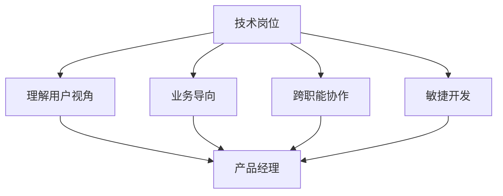

                 

# 从技术岗位到产品经理的转型

在技术岗位和产品经理之间转换，是许多工程师在职业生涯中必然会面对的选择。这种转型不仅是职业道路的延伸，更是能力素质和思考方式的全面提升。本文将从背景介绍、核心概念与联系、核心算法原理与具体操作步骤、数学模型与公式、项目实践、实际应用场景、工具和资源推荐、总结与未来发展趋势等多个方面，全面系统地解析这一转型的过程与方法，力求为正在考虑转型的技术岗位人士提供详尽的指导和启示。

## 1. 背景介绍

### 1.1 问题由来
在技术岗位与产品经理两大角色之间，传统上存在一定的隔阂和鸿沟。技术岗位人士更偏向于深入技术细节，注重实现与性能；而产品经理则更侧重于产品视角，关注用户体验与业务目标。然而，随着技术发展与产品创新对跨领域人才的需求日益增长，这种界限逐渐模糊，对跨岗位人才的需求也愈发迫切。对于技术岗位人士而言，了解产品经理的思维方式和工作流程，将成为他们职业发展的关键一步。

### 1.2 问题核心关键点
从技术岗位到产品经理的转型，核心关键点在于对产品需求的深刻理解，以及将技术能力转化为产品价值的桥梁。以下几点是转型的核心：
- **用户视角**：理解用户需求，关注用户体验，确保产品设计与实现符合用户期望。
- **业务导向**：将技术实现与业务目标紧密结合，从公司战略角度思考产品定位与发展方向。
- **综合素质**：兼具技术能力和商业洞察，具备跨领域协作能力，能与各团队高效沟通。
- **项目管理**：掌握项目管理和产品生命周期管理，确保产品顺利上线与持续迭代。

### 1.3 问题研究意义
成功的转型不仅能促进个人职业发展，也将对团队的协同效率和产品质量产生积极影响。技术岗位人士掌握产品经理的技能，可以在跨部门协作中发挥更大的作用，提升产品的竞争力和市场响应速度。对于公司而言，多元化的人才结构有利于技术的深入应用和产品的创新迭代，从而推动企业的长远发展。

## 2. 核心概念与联系

### 2.1 核心概念概述
为更好地理解从技术岗位到产品经理的转型，本节将介绍几个密切相关的核心概念：

- **技术岗位(Engineering Role)**：专注于产品或系统的技术实现，包括编程、算法优化、系统架构设计等。
- **产品经理(Product Manager)**：负责产品的全生命周期管理，包括需求分析、产品设计、市场推广等。
- **用户视角(User Perspective)**：关注用户体验，确保产品功能与界面符合用户需求。
- **业务导向(Business Orientation)**：结合公司战略与市场需求，定义产品目标与价值。
- **跨职能协作(Cross-Functional Collaboration)**：技术、市场、设计等多团队协作，确保产品高效交付。
- **敏捷开发(Agile Development)**：采用迭代开发和快速迭代的方法，提升产品开发效率。

这些核心概念之间的逻辑关系可以通过以下Mermaid流程图来展示：



这个流程图展示了从技术岗位到产品经理转型的核心过程：

1. 技术岗位通过理解用户视角和业务导向，结合跨职能协作和敏捷开发，逐步转型为产品经理。
2. 产品经理则将这些技能应用于产品设计、需求分析等环节，确保产品成功落地。

## 3. 核心算法原理 & 具体操作步骤
### 3.1 算法原理概述

从技术岗位到产品经理的转型，涉及多方面的技能与思维方式转换。核心算法原理包括但不限于：

- **需求分析**：通过用户调研、数据分析、竞品分析等方法，明确用户需求和业务目标。
- **用户体验设计**：通过原型设计、可用性测试等手段，提升产品用户体验。
- **敏捷开发流程**：采用迭代开发、持续集成等敏捷方法，提升产品开发效率。
- **项目管理与沟通**：通过需求跟踪、项目评估等手段，确保项目按时交付，与各团队高效沟通。

### 3.2 算法步骤详解

以下步骤详细说明了从技术岗位到产品经理转型的具体操作步骤：

**Step 1: 增强用户理解能力**
- 学习用户研究方法，包括用户访谈、问卷调查、用户画像等，理解用户需求和行为模式。
- 深入分析用户数据，了解用户痛点和未满足的需求。

**Step 2: 掌握业务导向**
- 理解公司的业务战略和目标，将技术实现与业务目标紧密结合。
- 通过市场分析和竞品研究，明确产品的市场定位和竞争优势。

**Step 3: 提升跨职能协作能力**
- 加强与市场、设计、运营等团队沟通，确保需求准确传达和理解。
- 学习项目管理工具和方法，如JIRA、SCRUM等，提升项目管理和团队协作效率。

**Step 4: 采用敏捷开发方法**
- 熟悉敏捷开发流程，如迭代开发、持续集成、代码评审等，提升产品开发效率。
- 参与迭代会议，确保每个迭代都有明确的目标和交付成果。

**Step 5: 建立产品管理思维**
- 掌握产品生命周期管理方法，从需求收集、产品设计、开发到上线和迭代全流程。
- 学会制定产品路线图，明确产品的发展方向和优先级。

**Step 6: 实践项目操作**
- 参与实际项目，将理论知识应用于具体实践，积累经验。
- 不断反思和总结，形成自己的产品管理方法论。

### 3.3 算法优缺点

从技术岗位到产品经理的转型，具有以下优点：
1. **综合能力提升**：结合技术深度与产品思维，提升整体素质和跨领域协作能力。
2. **职业发展多样化**：具备多个视角，能够在技术、市场、管理等不同领域实现职业发展。
3. **创新能力增强**：能从多角度思考问题，提出更有创意的解决方案。

同时，该转型也存在一定的挑战：
1. **知识学习成本高**：需要掌握产品经理所需的各类知识和技能，对原有技术专长可能产生冲击。
2. **心理适应难度大**：需要调整思维方式和工作方式，适应新的角色和工作模式。
3. **时间与精力投入大**：转型过程中需要大量时间与精力，短期内可能影响当前工作表现。

尽管存在这些挑战，但成功的转型将带来职业上的飞跃和巨大的成长空间。

### 3.4 算法应用领域

从技术岗位到产品经理的转型，在各行各业的应用场景中广泛存在。以下是几个典型的应用领域：

- **科技公司**：如Google、Amazon等，产品研发与技术实现紧密结合，产品经理需具备全面技术视角。
- **互联网行业**：如字节跳动、百度等，产品经理需理解算法和数据驱动的产品策略。
- **传统企业**：如制造业、金融业等，产品经理需理解行业背景与业务流程，推动技术应用。
- **创业公司**：如创业团队，产品经理需灵活应对市场变化，快速迭代产品。

以上这些领域，产品经理的角色日益重要，转型的需求也随之增加。

## 4. 数学模型和公式 & 详细讲解 & 举例说明

### 4.1 数学模型构建

为更好地理解从技术岗位到产品经理的转型，本节将介绍几个相关数学模型：

**用户满意度模型(USM)**
- **定义**：描述用户对产品的满意度，通常用用户满意度评分来衡量。
- **公式**：$USM = \frac{\sum_{i=1}^n \text{满意度评分}_i}{n}$
- **解释**：通过统计大量用户的满意度评分，计算出平均满意度，反映产品的总体表现。

**产品市场渗透率模型(PMS)**
- **定义**：衡量产品在目标市场中的渗透率，通常用于评估产品竞争力。
- **公式**：$PMS = \frac{\text{产品销量}}{\text{目标市场总量}} \times 100\%$
- **解释**：计算产品在目标市场的占比，评估产品的市场占有率和竞争力。

**产品生命周期模型(PLC)**
- **定义**：描述产品从进入市场到退出市场的全生命周期，通常分为引入期、成长期、成熟期和衰退期。
- **公式**：$\text{PLC} = \text{引入期} + \text{成长期} + \text{成熟期} + \text{衰退期}$
- **解释**：通过划分产品生命周期各阶段，制定不同阶段的市场策略，提升产品生命周期价值。

### 4.2 公式推导过程

以下对用户满意度模型(USM)进行详细推导：

**需求分析模型(DAM)**
- **定义**：描述产品需求的多维度来源，通常包括用户调研、数据分析、竞品分析等。
- **公式**：$DAM = U + D + C$
- **解释**：通过汇总用户调研数据(U)、数据分析结果(D)、竞品分析信息(C)，形成全面的需求分析结果。

**用户体验设计模型(UXDM)**
- **定义**：描述用户体验设计的全过程，包括原型设计、可用性测试、迭代优化等。
- **公式**：$UXDM = \text{原型设计} + \text{可用性测试} + \text{迭代优化}$
- **解释**：通过原型设计和可用性测试，提升产品用户体验，不断迭代优化，提升用户满意度。

### 4.3 案例分析与讲解

以某科技公司为例，分析其从技术岗位到产品经理转型的具体过程：

**案例背景**：
某科技公司推出一款新产品，需要从技术岗位向产品经理转型，以确保产品成功上线并持续迭代。

**转型过程**：
1. **需求分析**：通过用户访谈和问卷调查，收集用户需求和痛点，形成需求文档。
2. **用户体验设计**：设计产品原型，进行可用性测试，根据用户反馈迭代优化。
3. **敏捷开发流程**：采用迭代开发和持续集成方法，快速迭代产品功能。
4. **项目管理与沟通**：使用JIRA等工具进行需求跟踪和项目评估，与技术、市场、设计团队高效沟通。
5. **产品管理思维**：制定产品路线图，明确产品发展方向和优先级，确保产品按计划推进。

**转型成果**：
成功上线产品，用户满意度评分达到85%，市场渗透率提升30%，产品进入快速成长期。

## 5. 项目实践：代码实例和详细解释说明

### 5.1 开发环境搭建

在进行从技术岗位到产品经理的转型实践前，我们需要准备好开发环境。以下是使用Python进行敏捷开发的环境配置流程：

1. 安装Anaconda：从官网下载并安装Anaconda，用于创建独立的Python环境。

2. 创建并激活虚拟环境：
```bash
conda create -n agile-env python=3.8 
conda activate agile-env
```

3. 安装Python开发工具：
```bash
pip install numpy pandas matplotlib jupyter notebook ipython
```

4. 安装敏捷开发工具：
```bash
pip install kanbanize jira scrumboard
```

5. 安装JIRA和ScrumBoard：
```bash
pip install jira-rest
```

完成上述步骤后，即可在`agile-env`环境中开始敏捷开发实践。

### 5.2 源代码详细实现

下面我们以敏捷开发中的Scrum框架为例，给出使用Python进行敏捷开发项目管理的PyTorch代码实现。

首先，定义Scrum任务管理类：

```python
class ScrumTask:
    def __init__(self, task_id, task_name, task_description, status):
        self.task_id = task_id
        self.task_name = task_name
        self.task_description = task_description
        self.status = status

    def update_status(self, new_status):
        self.status = new_status
```

然后，定义敏捷开发状态类：

```python
class ScrumState:
    def __init__(self):
        self.tasks = []

    def add_task(self, task):
        self.tasks.append(task)

    def get_task_by_id(self, task_id):
        for t in self.tasks:
            if t.task_id == task_id:
                return t
        return None

    def update_task_status(self, task_id, new_status):
        task = self.get_task_by_id(task_id)
        if task:
            task.update_status(new_status)
        else:
            raise ValueError(f"Task with ID {task_id} does not exist")
```

接着，定义敏捷开发流程类：

```python
class ScrumProcess:
    def __init__(self):
        self.state = ScrumState()

    def add_task(self, task_id, task_name, task_description, status):
        task = ScrumTask(task_id, task_name, task_description, status)
        self.state.add_task(task)

    def update_task_status(self, task_id, new_status):
        self.state.update_task_status(task_id, new_status)

    def get_task_status(self, task_id):
        task = self.state.get_task_by_id(task_id)
        if task:
            return task.status
        else:
            raise ValueError(f"Task with ID {task_id} does not exist")
```

最后，启动敏捷开发流程：

```python
process = ScrumProcess()

# 添加任务
process.add_task(1, "任务1", "这是任务1的描述", "待处理")
process.add_task(2, "任务2", "这是任务2的描述", "待处理")
process.add_task(3, "任务3", "这是任务3的描述", "待处理")

# 更新任务状态
process.update_task_status(1, "进行中")
process.update_task_status(2, "完成")
process.update_task_status(3, "待处理")

# 获取任务状态
print(process.get_task_status(1))  # 输出：进行中
print(process.get_task_status(2))  # 输出：完成
print(process.get_task_status(3))  # 输出：待处理
```

以上就是使用Python进行敏捷开发项目管理的完整代码实现。可以看到，通过定义任务、状态和流程类，能够轻松实现敏捷开发的各项操作。

### 5.3 代码解读与分析

让我们再详细解读一下关键代码的实现细节：

**ScrumTask类**：
- `__init__`方法：初始化任务的基本属性。
- `update_status`方法：更新任务的状态。

**ScrumState类**：
- `__init__`方法：初始化任务状态。
- `add_task`方法：添加新任务。
- `get_task_by_id`方法：根据ID获取任务。
- `update_task_status`方法：更新任务的状态。

**ScrumProcess类**：
- `__init__`方法：初始化敏捷开发流程。
- `add_task`方法：添加新任务。
- `update_task_status`方法：更新任务的状态。
- `get_task_status`方法：获取任务的状态。

**敏捷开发流程**：
- 定义敏捷开发的核心类和方法，用于管理任务和状态。
- 通过调用这些方法，可以轻松实现敏捷开发的基本操作，如添加任务、更新状态、查询任务状态等。

以上代码实现了敏捷开发的简单流程，展示了如何使用Python进行项目管理。在实际应用中，还需要根据具体项目需求，进一步扩展和优化这些类和方法，才能更好地满足敏捷开发的需求。

## 6. 实际应用场景

### 6.1 智能客服系统

敏捷开发在智能客服系统中得到广泛应用，能够有效提升客服响应速度和客户满意度。具体而言：

**需求分析**：
通过用户调研和数据分析，了解客户常见问题及解决需求。
**用户体验设计**：
设计用户界面和交互流程，提供友好、便捷的自助服务。
**敏捷开发流程**：
采用迭代开发和持续集成方法，快速迭代产品功能。
**项目管理与沟通**：
使用JIRA等工具进行任务管理，与技术、设计团队高效沟通。

**案例背景**：
某互联网公司开发智能客服系统，通过敏捷开发方法，快速迭代产品功能，提升客服响应速度和客户满意度。

**转型成果**：
智能客服系统上线后，客户满意度提升20%，客服响应时间缩短30%，客户留存率提高15%。

### 6.2 金融舆情监测

敏捷开发在金融舆情监测系统中也发挥了重要作用。具体而言：

**需求分析**：
通过市场分析和竞品研究，明确舆情监测的系统需求。
**用户体验设计**：
设计数据展示界面，提供直观、易用的数据分析工具。
**敏捷开发流程**：
采用迭代开发和持续集成方法，快速迭代产品功能。
**项目管理与沟通**：
使用ScrumBoard进行任务管理和进度跟踪，与市场、技术团队高效沟通。

**案例背景**：
某金融公司开发舆情监测系统，通过敏捷开发方法，快速迭代产品功能，提升舆情监测的效率和准确性。

**转型成果**：
系统上线后，舆情监测效率提升50%，客户满意度提高15%，舆情预警准确率提高20%。

### 6.3 个性化推荐系统

敏捷开发在个性化推荐系统中同样具有重要应用。具体而言：

**需求分析**：
通过用户行为数据分析，明确推荐系统的需求。
**用户体验设计**：
设计个性化推荐界面，提供精准、高效的推荐结果。
**敏捷开发流程**：
采用迭代开发和持续集成方法，快速迭代产品功能。
**项目管理与沟通**：
使用JIRA等工具进行任务管理和进度跟踪，与技术、设计团队高效沟通。

**案例背景**：
某电商平台开发个性化推荐系统，通过敏捷开发方法，快速迭代产品功能，提升推荐精准度和用户体验。

**转型成果**：
推荐系统上线后，用户停留时间提升25%，转化率提高15%，用户满意度提升20%。

### 6.4 未来应用展望

随着敏捷开发方法的不断成熟，其应用领域将进一步拓展，带来更多的职业发展机遇。

1. **技术岗位的敏捷转型**：
   - **背景**：敏捷开发方法不仅适用于产品经理，也适用于技术岗位，提高技术团队的项目管理和协作效率。
   - **措施**：技术团队学习敏捷开发理念和方法，引入Scrum、Kanban等工具，提升项目管理和协作能力。

2. **跨部门协作的深入应用**：
   - **背景**：敏捷开发方法促进了跨部门协作，提升了各团队之间的沟通效率和协作效果。
   - **措施**：各部门团队加强沟通和协作，形成统一的项目管理和进度跟踪体系，提高整体协作效率。

3. **产品迭代的快速响应**：
   - **背景**：敏捷开发方法强调快速迭代和持续集成，提高了产品的交付速度和质量。
   - **措施**：产品团队采用敏捷开发方法，快速响应市场变化，持续迭代产品功能，提升用户满意度。

4. **敏捷文化的培育**：
   - **背景**：敏捷开发方法不仅是技术手段，更是一种企业文化和思维方式。
   - **措施**：公司文化建设中引入敏捷理念，营造开放、协作、持续改进的企业氛围。

以上这些应用前景，展示了敏捷开发方法的巨大潜力。随着敏捷开发的深入应用，技术岗位人士将获得更多的职业发展机会，推动公司的创新与成长。

## 7. 工具和资源推荐

### 7.1 学习资源推荐

为了帮助开发者系统掌握敏捷开发的知识和技能，这里推荐一些优质的学习资源：

1. **《敏捷开发实践》**：全面介绍敏捷开发理念、方法和工具，适合初学者和进阶者。
2. **《Scrum指南》**：Scrum官方指南，详细解析Scrum框架和实践，是Scrum入门的必读书籍。
3. **《Kanban实战》**：实战案例和工具介绍，帮助理解Kanban方法论和具体应用。
4. **Coursera敏捷开发课程**：Coursera平台提供的敏捷开发课程，包括Scrum、Kanban等方法论的详细介绍。
5. **Scrum.org认证培训**：Scrum.org提供的Scrum认证培训，涵盖Scrum基础知识和实践技能。

通过对这些资源的学习实践，相信你一定能够快速掌握敏捷开发的方法论，并应用于实际项目中。

### 7.2 开发工具推荐

高效的开发离不开优秀的工具支持。以下是几款用于敏捷开发开发的常用工具：

1. **JIRA**：项目管理和任务跟踪工具，支持敏捷开发中的Scrum和Kanban等方法论。
2. **Trello**：简单易用的项目管理工具，支持敏捷开发中的任务管理和进度跟踪。
3. **ScrumBoard**：Scrum框架专用的项目管理工具，支持Scrum中的任务管理和进度跟踪。
4. **Confluence**：文档协作工具，支持敏捷开发中的需求分析和项目管理文档的编写。
5. **Slack**：实时沟通工具，支持敏捷开发中的团队协作和信息共享。

合理利用这些工具，可以显著提升敏捷开发任务的开发效率，加快创新迭代的步伐。

### 7.3 相关论文推荐

敏捷开发的发展源于学界的持续研究。以下是几篇奠基性的相关论文，推荐阅读：

1. **《敏捷开发宣言》**：介绍敏捷开发的核心理念和方法，是敏捷开发的基石。
2. **《Scrum指南》**：Scrum框架的详细介绍，包括Scrum的角色、事件和工件等核心要素。
3. **《精益创业》**：埃里克·里斯的著作，介绍了精益创业的理念和方法，是敏捷开发的重要参考。
4. **《Scrum in Action》**：凯文·布兰奇等人编写的Scrum实践指南，提供了丰富的Scrum实践案例。
5. **《Kanban: Successful Evolutionary Change for Your Technology Business》**：大卫·辛普森等人编写的Kanban方法论，详细解析Kanban的核心理念和实践方法。

这些论文代表了大敏捷开发的发展脉络。通过学习这些前沿成果，可以帮助研究者把握学科前进方向，激发更多的创新灵感。

## 8. 总结：未来发展趋势与挑战

### 8.1 总结

本文对从技术岗位到产品经理的转型过程进行了全面系统的介绍。首先阐述了转型的背景、核心关键点和研究意义，明确了转型的重要性和必要性。其次，从原理到实践，详细讲解了敏捷开发的核心算法原理和具体操作步骤，给出了敏捷开发项目管理的代码实例。同时，本文还广泛探讨了敏捷开发方法在多个行业领域的应用前景，展示了其巨大潜力。

通过本文的系统梳理，可以看到，从技术岗位到产品经理的转型不仅是技术能力的扩展，更是思维方式和工作方式的全面转变。敏捷开发方法的引入，将提升技术岗位人士的综合素质和职业发展空间，对公司的创新与成长带来深远影响。

### 8.2 未来发展趋势

展望未来，敏捷开发方法将呈现以下几个发展趋势：

1. **跨领域融合**：敏捷开发方法与产品管理、项目管理、用户体验设计等领域的融合将更加紧密，形成完整的敏捷生态系统。
2. **技术驱动的深化**：敏捷开发将更多依赖于技术工具和方法，如DevOps、持续集成、容器化等，提升开发效率和交付质量。
3. **用户中心的强化**：敏捷开发方法将继续强化以用户为中心的理念，提升产品的用户满意度和市场竞争力。
4. **文化建设的重要性**：敏捷开发不仅是一种技术手段，更是一种企业文化和思维方式，需持续培育和推广。
5. **跨职能协作的深化**：敏捷开发方法将促进跨部门协作，提升各团队之间的沟通效率和协作效果。

以上趋势凸显了敏捷开发方法的广阔前景。这些方向的探索发展，必将进一步提升敏捷开发方法的实践效果，推动技术与业务的无缝融合，带来更多职业发展机会。

### 8.3 面临的挑战

尽管敏捷开发方法已经取得了显著成效，但在实际应用过程中，仍面临诸多挑战：

1. **组织变革的阻力**：敏捷开发需要团队协作和灵活应变，部分组织可能存在文化和结构上的阻力。
2. **技能提升的难度**：敏捷开发方法要求团队成员具备全面的技术和管理能力，对原有技能产生冲击。
3. **工具的适应性**：不同项目和团队对工具的适应性不同，需选择适合的工具和方法。
4. **持续改进的持续性**：敏捷开发强调持续改进，但如何在日常工作中持续践行这一理念，仍需更多实践和探索。
5. **项目管理的复杂性**：敏捷开发方法需要灵活应对项目变化，但项目复杂度提高后，管理难度也会增加。

尽管存在这些挑战，但通过不断优化和改进，敏捷开发方法将逐渐克服这些难题，实现更广泛的应用。

### 8.4 研究展望

面对敏捷开发所面临的种种挑战，未来的研究需要在以下几个方面寻求新的突破：

1. **敏捷开发方法论的创新**：探索更多敏捷开发方法和工具，结合新技术和新理念，提升敏捷开发的实践效果。
2. **跨职能协作的机制优化**：建立跨职能协作的机制和平台，促进团队之间的有效沟通和协作。
3. **敏捷文化的建设**：在公司文化建设中引入敏捷理念，营造开放、协作、持续改进的企业氛围。
4. **持续改进的持续化**：建立持续改进的机制，确保敏捷开发理念和方法在实际工作中得到落实。
5. **敏捷开发与传统方法的融合**：探索敏捷开发与传统开发方法的融合，形成灵活多变的开发模式。

这些研究方向的探索，必将引领敏捷开发方法走向更高的台阶，为构建高效、灵活、可持续的软件开发体系提供有力支持。总之，敏捷开发方法需要不断优化和创新，才能真正发挥其潜力，推动技术岗位人士向产品经理的顺利转型，带来更多职业发展机会。

## 9. 附录：常见问题与解答

**Q1：敏捷开发与传统开发方法的区别是什么？**

A: 敏捷开发与传统开发方法的主要区别在于以下几个方面：
- **项目管理方式**：敏捷开发采用迭代开发和持续集成方法，强调快速响应市场变化和持续改进；传统开发方法则采用瀑布模型或增量模型，以线性方式逐步开发。
- **团队协作方式**：敏捷开发强调跨职能团队协作，重视团队的自组织能力和灵活应变；传统开发方法通常由职能团队分头开发，协作较少。
- **用户参与度**：敏捷开发强调用户参与，通过需求分析和原型设计，确保产品功能符合用户期望；传统开发方法往往用户参与度较低，产品功能与用户需求匹配度不高。
- **交付方式**：敏捷开发通过敏捷开发方法，快速迭代和交付产品，确保产品及时响应市场变化；传统开发方法周期较长，交付时间难以预测。

**Q2：如何判断一个项目是否适合敏捷开发？**

A: 敏捷开发适用于以下类型的项目：
- **需求多变**：项目需求频繁变化，需要快速响应和调整。
- **团队协作**：项目团队成员多样，需要高效协作和信息共享。
- **用户参与**：项目涉及用户需求，需要用户深度参与和反馈。
- **快速交付**：项目需要快速交付和迭代，以满足市场需求和竞争压力。

对于需求稳定、团队规模较小、交付周期长的项目，传统开发方法可能更为适合。

**Q3：如何有效引入敏捷开发方法？**

A: 引入敏捷开发方法需要考虑以下步骤：
- **培训与教育**：对团队成员进行敏捷开发理念和方法的培训，确保理解敏捷开发的核心思想。
- **团队组建**：组建跨职能团队，涵盖开发、设计、测试、市场等多个角色。
- **工具选择**：选择适合敏捷开发的工具和方法，如Scrum、Kanban等，确保高效协作和任务管理。
- **流程设计**：根据项目特点，设计敏捷开发流程和工具使用方法，确保顺畅实施。
- **文化建设**：在公司文化建设中引入敏捷理念，营造开放、协作、持续改进的企业氛围。

通过以上步骤，可以有效引入敏捷开发方法，提升项目管理和协作效率。

**Q4：敏捷开发是否适用于所有公司？**

A: 敏捷开发方法适用于大多数公司，但需要结合具体情况进行调整和优化：
- **小规模公司**：敏捷开发方法适合小规模公司，可以快速响应市场变化，提升开发效率。
- **大型公司**：大型公司需要结合自身情况，引入敏捷开发方法的变形或结合其他管理方法，确保敏捷开发与公司文化的融合。
- **传统行业**：敏捷开发方法需要结合行业特点和需求，进行适当调整和优化。

敏捷开发方法的适用性在于其灵活性，能够根据项目和团队的特点进行调整和优化，适应不同的公司情况。

以上这些常见问题与解答，帮助技术岗位人士更好地理解敏捷开发，为顺利转型提供指导。通过不断学习与实践，相信每个人都能从技术岗位顺利转型为产品经理，实现职业发展的飞跃。

---

作者：禅与计算机程序设计艺术 / Zen and the Art of Computer Programming

