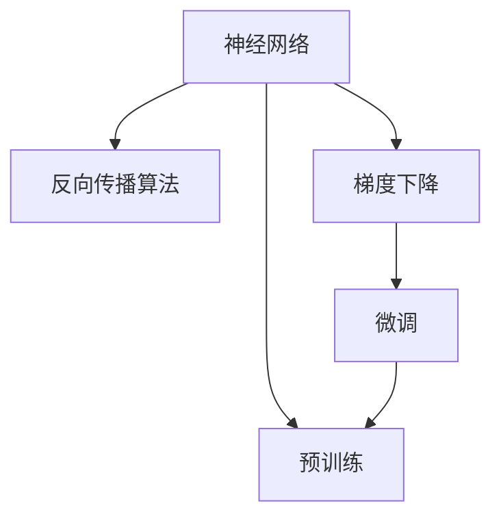

                 

# 从零开始大模型开发与微调：反馈神经网络反向传播算法介绍

> 关键词：大模型开发，微调，反向传播算法，神经网络，梯度下降

## 1. 背景介绍

### 1.1 问题由来

随着深度学习技术的迅猛发展，大模型（Large Models）的应用已经成为人工智能领域的一个热门话题。大模型通常指具有数百万到数十亿参数的神经网络，这些模型在各种任务上取得了令人瞩目的性能，如自然语言处理（Natural Language Processing, NLP）、计算机视觉（Computer Vision, CV）、推荐系统（Recommendation System, RS）等。

大模型的核心优势在于其庞大的参数规模和丰富的表示能力，这使得它们能够在训练过程中学习到更加复杂的特征表示，从而提高在特定任务上的表现。然而，大模型的训练和微调需要大量的计算资源和数据，因此在实际应用中，如何高效地开发和微调大模型仍然是一个挑战。

### 1.2 问题核心关键点

大模型的开发和微调涉及到多个关键技术点：

- **大模型开发**：包括选择适当的架构、设计损失函数、选择优化算法、训练模型等。
- **反向传播算法**：用于计算损失函数对模型参数的梯度，是微调大模型的核心。
- **微调方法**：在大模型上通过有限的数据集进行训练，优化模型特定任务的表现。
- **梯度优化**：在大模型上微调时，如何有效利用梯度信息，避免梯度消失或爆炸。
- **模型评估**：如何评估模型在特定任务上的性能，选择最优的模型和超参数。

本文将详细探讨大模型的开发和微调过程，重点介绍反向传播算法及其在大模型中的应用，帮助读者系统掌握大模型的开发和微调技巧。

## 2. 核心概念与联系

### 2.1 核心概念概述

为更好地理解大模型开发和微调技术，本节将介绍几个核心概念及其相互联系：

- **神经网络（Neural Network, NN）**：由大量节点和连接组成的网络结构，用于学习数据的特征表示。
- **反向传播算法（Backpropagation）**：一种用于计算神经网络中各层参数梯度的算法，通过链式法则反向计算损失函数对参数的偏导数。
- **梯度下降（Gradient Descent）**：一种常用的优化算法，通过迭代调整模型参数，最小化损失函数。
- **微调（Fine-Tuning）**：在大模型上，通过有限的数据集训练，优化模型特定任务的表现。
- **预训练（Pre-training）**：在大规模数据集上预训练模型，获得通用的特征表示，再通过微调适配特定任务。

这些核心概念之间的逻辑关系可以通过以下Mermaid流程图来展示：



这个流程图展示了神经网络、反向传播、梯度下降、微调和预训练之间的联系：

1. 神经网络作为基本结构，用于学习数据的特征表示。
2. 反向传播算法用于计算损失函数对神经网络参数的梯度。
3. 梯度下降算法通过迭代调整参数，最小化损失函数。
4. 微调技术在大模型上，通过有限的数据集训练，优化特定任务的表现。
5. 预训练技术在大规模数据集上预训练模型，获得通用的特征表示。

这些概念共同构成了大模型的开发和微调框架，使得大模型能够被应用于各种任务，并获得卓越的性能。

## 3. 核心算法原理 & 具体操作步骤

### 3.1 算法原理概述

大模型的开发和微调过程主要包括选择模型架构、设计损失函数、训练模型、微调模型等步骤。其中，反向传播算法是训练和微调大模型的核心算法。

反向传播算法的基本原理是通过链式法则，计算损失函数对模型各参数的偏导数，从而更新模型参数，最小化损失函数。这一过程包括以下几个关键步骤：

1. **前向传播**：将输入数据输入神经网络，计算输出结果。
2. **计算损失函数**：将输出结果与真实标签进行比较，计算损失函数。
3. **反向传播**：通过链式法则，计算损失函数对每个参数的偏导数。
4. **梯度更新**：使用梯度下降等优化算法，更新模型参数，最小化损失函数。

### 3.2 算法步骤详解

以下详细介绍反向传播算法的具体步骤：

**Step 1: 前向传播**

前向传播是指将输入数据通过神经网络，计算出最终的输出结果。具体步骤如下：

1. 将输入数据 $x$ 输入到神经网络的第一层，计算第一层的输出 $a_1$。
2. 将 $a_1$ 作为下一层的输入，计算第二层的输出 $a_2$，以此类推，直到输出层。
3. 最后，将输出层的输出 $a_L$ 与真实标签 $y$ 进行比较，计算损失函数。

**Step 2: 计算损失函数**

常见的损失函数包括交叉熵损失、均方误差损失等。以交叉熵损失为例，计算如下：

$$
J = -\frac{1}{N} \sum_{i=1}^N \sum_{j=1}^C y_i \log p_j
$$

其中，$y$ 为真实标签，$p$ 为模型的输出概率，$N$ 为样本数量，$C$ 为类别数。

**Step 3: 反向传播**

反向传播算法的核心是通过链式法则计算损失函数对每个参数的偏导数。具体步骤如下：

1. 从输出层开始，计算每个参数的梯度。
2. 根据链式法则，计算每个参数的梯度。
3. 将梯度反向传播到每一层，更新参数。

**Step 4: 梯度更新**

梯度更新是指使用梯度下降等优化算法，更新模型参数，最小化损失函数。以梯度下降为例，更新公式如下：

$$
\theta_{new} = \theta_{old} - \eta \nabla_{\theta} J
$$

其中，$\eta$ 为学习率，$\nabla_{\theta} J$ 为损失函数对参数的偏导数。

### 3.3 算法优缺点

反向传播算法的优点在于：

1. **高效计算**：能够高效地计算损失函数对模型参数的偏导数。
2. **灵活性**：适用于各种神经网络架构，包括卷积神经网络（CNN）、循环神经网络（RNN）、Transformer等。
3. **稳定性**：能够稳定地收敛，避免梯度消失或爆炸。

缺点在于：

1. **计算复杂度**：在大模型上，反向传播的计算复杂度较高。
2. **内存消耗**：反向传播需要存储中间结果，内存消耗较大。
3. **超参数敏感**：学习率、批量大小等超参数对训练效果有较大影响。

### 3.4 算法应用领域

反向传播算法在大模型训练和微调中得到了广泛应用，涵盖以下几个领域：

- **计算机视觉**：在大规模图像数据集上预训练卷积神经网络（CNN），如ResNet、Inception等，再通过微调适配特定任务，如图像分类、目标检测、语义分割等。
- **自然语言处理**：在大规模文本数据集上预训练Transformer模型，如BERT、GPT等，再通过微调适配特定任务，如文本分类、命名实体识别、机器翻译等。
- **推荐系统**：在大规模用户-物品交互数据集上预训练深度神经网络，再通过微调适配特定推荐任务，如协同过滤、基于内容的推荐等。
- **语音识别**：在大规模音频数据集上预训练卷积神经网络（CNN）、循环神经网络（RNN）等，再通过微调适配特定语音识别任务。
- **语音合成**：在大规模音频数据集上预训练生成对抗网络（GAN），再通过微调适配特定语音合成任务，如语音转换、语音生成等。

## 4. 数学模型和公式 & 详细讲解 & 举例说明

### 4.1 数学模型构建

本节将使用数学语言对反向传播算法进行更加严格的刻画。

设神经网络模型为 $f(x; \theta)$，其中 $x$ 为输入，$\theta$ 为模型参数。假设训练集为 $D=\{(x_i, y_i)\}_{i=1}^N$，其中 $y_i$ 为真实标签。定义损失函数 $J(\theta)$ 为：

$$
J(\theta) = \frac{1}{N} \sum_{i=1}^N L(f(x_i; \theta), y_i)
$$

其中 $L$ 为特定损失函数，如交叉熵损失。

### 4.2 公式推导过程

以一个简单的两层神经网络为例，推导反向传播算法的数学公式。

设输入层为 $x$，输出层为 $y$，中间层为 $a_1$，输出层为 $a_2$。神经网络的结构如下：

$$
\begin{align*}
a_1 &= W_1 x + b_1 \\
a_2 &= W_2 a_1 + b_2 \\
y &= a_2
\end{align*}
$$

其中 $W_1, W_2$ 为权重矩阵，$b_1, b_2$ 为偏置向量。

**Step 1: 前向传播**

前向传播计算过程如下：

$$
\begin{align*}
a_1 &= W_1 x + b_1 \\
a_2 &= W_2 a_1 + b_2 \\
y &= a_2
\end{align*}
$$

**Step 2: 计算损失函数**

假设使用交叉熵损失，损失函数计算如下：

$$
J = -\frac{1}{N} \sum_{i=1}^N \sum_{j=1}^C y_i \log p_j
$$

其中 $p$ 为模型的输出概率，$N$ 为样本数量，$C$ 为类别数。

**Step 3: 反向传播**

反向传播算法的计算过程如下：

$$
\begin{align*}
\frac{\partial J}{\partial W_2} &= \frac{\partial L}{\partial a_2} \cdot \frac{\partial a_2}{\partial W_2} \\
\frac{\partial J}{\partial b_2} &= \frac{\partial L}{\partial a_2} \cdot \frac{\partial a_2}{\partial b_2} \\
\frac{\partial J}{\partial W_1} &= \frac{\partial L}{\partial a_1} \cdot \frac{\partial a_1}{\partial W_1} \\
\frac{\partial J}{\partial b_1} &= \frac{\partial L}{\partial a_1} \cdot \frac{\partial a_1}{\partial b_1}
\end{align*}
$$

其中 $\frac{\partial L}{\partial a_2}$ 和 $\frac{\partial L}{\partial a_1}$ 为损失函数对输出层和中间层的偏导数。

**Step 4: 梯度更新**

使用梯度下降算法更新参数，公式如下：

$$
\theta_{new} = \theta_{old} - \eta \nabla_{\theta} J
$$

其中 $\eta$ 为学习率，$\nabla_{\theta} J$ 为损失函数对参数的偏导数。

### 4.3 案例分析与讲解

以图像分类任务为例，介绍反向传播算法在大模型上的应用。

假设使用一个基于卷积神经网络（CNN）的模型，在ImageNet数据集上进行预训练，获得通用特征表示。然后，在特定任务数据集上进行微调，如CIFAR-10数据集。微调的过程如下：

1. 使用预训练模型作为初始化参数，在CIFAR-10数据集上进行微调。
2. 计算损失函数对输出层的偏导数，更新输出层的权重和偏置。
3. 将输出层的偏导数反向传播到中间层，计算损失函数对中间层的偏导数，更新中间层的权重和偏置。
4. 重复上述过程，直至收敛。

## 5. 项目实践：代码实例和详细解释说明

### 5.1 开发环境搭建

在进行大模型开发和微调实践前，我们需要准备好开发环境。以下是使用Python进行PyTorch开发的环境配置流程：

1. 安装Anaconda：从官网下载并安装Anaconda，用于创建独立的Python环境。

2. 创建并激活虚拟环境：
```bash
conda create -n pytorch-env python=3.8 
conda activate pytorch-env
```

3. 安装PyTorch：根据CUDA版本，从官网获取对应的安装命令。例如：
```bash
conda install pytorch torchvision torchaudio cudatoolkit=11.1 -c pytorch -c conda-forge
```

4. 安装TensorBoard：用于可视化训练过程和模型性能。

5. 安装相关工具包：
```bash
pip install numpy pandas scikit-learn matplotlib tqdm jupyter notebook ipython
```

完成上述步骤后，即可在`pytorch-env`环境中开始开发实践。

### 5.2 源代码详细实现

这里以一个简单的两层神经网络为例，使用PyTorch实现反向传播算法。

```python
import torch
import torch.nn as nn
import torch.optim as optim

# 定义神经网络模型
class NeuralNet(nn.Module):
    def __init__(self):
        super(NeuralNet, self).__init__()
        self.fc1 = nn.Linear(784, 128)
        self.fc2 = nn.Linear(128, 10)
        self.relu = nn.ReLU()

    def forward(self, x):
        x = self.relu(self.fc1(x))
        x = self.fc2(x)
        return x

# 定义训练数据和标签
train_data = torch.randn(1000, 784)
train_labels = torch.randint(0, 10, (1000,))

# 定义模型、优化器和损失函数
model = NeuralNet()
optimizer = optim.SGD(model.parameters(), lr=0.1)
criterion = nn.CrossEntropyLoss()

# 前向传播和损失计算
output = model(train_data)
loss = criterion(output, train_labels)

# 反向传播和梯度更新
optimizer.zero_grad()
loss.backward()
optimizer.step()

# 训练函数
def train_epoch(model, data_loader, optimizer, criterion):
    model.train()
    total_loss = 0
    for data, target in data_loader:
        optimizer.zero_grad()
        output = model(data)
        loss = criterion(output, target)
        loss.backward()
        optimizer.step()
        total_loss += loss.item()
    return total_loss / len(data_loader)
```

### 5.3 代码解读与分析

让我们再详细解读一下关键代码的实现细节：

**NeuralNet类**：
- `__init__`方法：初始化神经网络的结构，包括两个全连接层和一个ReLU激活函数。
- `forward`方法：定义前向传播的计算过程。

**train_data和train_labels**：
- 定义训练数据和标签，使用PyTorch的张量表示。

**optimizer、criterion**：
- 定义优化器和损失函数，使用PyTorch的SGD优化器和交叉熵损失函数。

**train_epoch函数**：
- 定义训练函数，在每个epoch内，对每个批次的数据进行前向传播、损失计算、反向传播和梯度更新。

### 5.4 运行结果展示

在训练过程中，可以使用TensorBoard可视化训练过程和模型性能。以下是TensorBoard的配置和使用方法：

1. 启动TensorBoard服务器：
```bash
tensorboard --logdir logs --port 6006
```

2. 在Jupyter Notebook中，使用TensorBoard的可视化接口：
```python
from torch.utils.tensorboard import SummaryWriter

writer = SummaryWriter()
for epoch in range(10):
    train_loss = train_epoch(model, train_loader, optimizer, criterion)
    writer.add_scalar('train_loss', train_loss, epoch)
    writer.add_graph(model, (train_data, train_labels))
writer.close()
```

在TensorBoard中，可以看到训练过程中的损失函数变化曲线、模型结构和参数变化等详细信息，有助于调试和优化模型。

## 6. 实际应用场景

### 6.1 智能推荐系统

反向传播算法在大规模推荐系统中的应用，可以帮助模型学习用户和物品之间的隐式关联，从而提高推荐效果。具体而言，可以通过微调推荐模型，使其能够适应特定的推荐任务，如协同过滤、基于内容的推荐等。

在微调过程中，使用反向传播算法计算损失函数对模型参数的梯度，更新模型参数，最小化推荐误差。通过迭代调整模型参数，反向传播算法可以高效地优化模型性能，提高推荐系统的准确性和多样性。

### 6.2 语音识别

反向传播算法在语音识别中的应用，主要用于训练声学模型和语言模型。声学模型通过反向传播算法学习音频信号和文字之间的映射关系，语言模型通过反向传播算法学习单词之间的概率分布，从而提高语音识别的准确性和流畅度。

在微调过程中，反向传播算法可以高效地计算损失函数对模型参数的梯度，更新模型参数，最小化语音识别的误差。通过迭代调整模型参数，反向传播算法可以优化声学模型和语言模型，提高语音识别的性能。

### 6.3 图像分类

反向传播算法在图像分类中的应用，主要用于训练卷积神经网络（CNN）模型。CNN模型通过反向传播算法学习图像特征和类别之间的映射关系，从而提高图像分类的准确性。

在微调过程中，反向传播算法可以高效地计算损失函数对模型参数的梯度，更新模型参数，最小化分类误差。通过迭代调整模型参数，反向传播算法可以优化CNN模型，提高图像分类的性能。

## 7. 工具和资源推荐

### 7.1 学习资源推荐

为了帮助开发者系统掌握反向传播算法的原理和实践，这里推荐一些优质的学习资源：

1. 《深度学习》书籍：Ian Goodfellow等人所著，系统介绍了深度学习的基础理论和算法。
2. CS231n《卷积神经网络》课程：斯坦福大学开设的计算机视觉课程，涵盖神经网络、卷积神经网络等基础知识。
3. CS224N《自然语言处理》课程：斯坦福大学开设的NLP课程，涵盖神经网络、循环神经网络、Transformer等基础知识。
4. CS223A《机器学习》课程：斯坦福大学开设的机器学习课程，涵盖梯度下降、反向传播等基础知识。
5. PyTorch官方文档：PyTorch的官方文档，提供了丰富的学习资源和样例代码。

通过对这些资源的学习实践，相信你一定能够快速掌握反向传播算法的精髓，并用于解决实际的深度学习问题。

### 7.2 开发工具推荐

高效的开发离不开优秀的工具支持。以下是几款用于深度学习开发的工具：

1. PyTorch：基于Python的开源深度学习框架，灵活动态的计算图，适合快速迭代研究。
2. TensorFlow：由Google主导开发的开源深度学习框架，生产部署方便，适合大规模工程应用。
3. TensorBoard：TensorFlow配套的可视化工具，可实时监测模型训练状态，并提供丰富的图表呈现方式。
4. Weights & Biases：模型训练的实验跟踪工具，可以记录和可视化模型训练过程中的各项指标。
5. Keras：基于Python的高层次深度学习库，易于上手，适合快速原型设计。

合理利用这些工具，可以显著提升深度学习开发的效率，加快创新迭代的步伐。

### 7.3 相关论文推荐

反向传播算法和大模型微调技术的发展源于学界的持续研究。以下是几篇奠基性的相关论文，推荐阅读：

1. Backpropagation：Rumelhart等人的经典论文，详细介绍了反向传播算法的原理和应用。
2. Deep Learning：Goodfellow等人的经典书籍，系统介绍了深度学习的理论和算法。
3. ImageNet Classification with Deep Convolutional Neural Networks：Krizhevsky等人的论文，展示了卷积神经网络在图像分类任务上的卓越性能。
4. LeNet-5：Rennie等人的论文，详细介绍了卷积神经网络的结构和训练方法。
5. BERT: Pre-training of Deep Bidirectional Transformers for Language Understanding：Devlin等人的论文，展示了BERT模型在自然语言处理任务上的卓越性能。

这些论文代表了大模型微调技术的发展脉络。通过学习这些前沿成果，可以帮助研究者把握学科前进方向，激发更多的创新灵感。

## 8. 总结：未来发展趋势与挑战

### 8.1 研究成果总结

本文对反向传播算法及其在大模型中的应用进行了全面系统的介绍。首先阐述了反向传播算法的原理和应用，明确了其在深度学习开发和微调中的核心地位。其次，从原理到实践，详细讲解了反向传播算法的数学推导和具体实现，提供了完整的代码实例和详细解释。同时，本文还探讨了反向传播算法在大模型微调中的应用场景，展示了其在图像分类、推荐系统、语音识别等领域的应用前景。

通过本文的系统梳理，可以看到，反向传播算法在大模型的开发和微调中扮演着重要的角色，极大地提升了模型的性能和应用范围。未来，伴随深度学习技术的持续演进，反向传播算法和大模型微调技术必将在更多领域得到应用，为深度学习技术的发展带来新的突破。

### 8.2 未来发展趋势

展望未来，反向传播算法和大模型微调技术将呈现以下几个发展趋势：

1. **模型规模持续增大**：随着算力成本的下降和数据规模的扩张，大模型的参数量将继续增长，反向传播算法将在大规模模型上发挥更大作用。
2. **优化算法不断优化**：反向传播算法将与更多优化算法结合，如Adam、Adagrad、RMSprop等，提高模型的训练效率和收敛速度。
3. **模型结构更加复杂**：反向传播算法将支持更多类型的神经网络结构，如卷积神经网络（CNN）、循环神经网络（RNN）、Transformer等，提升模型的性能和适应性。
4. **分布式训练成为常态**：反向传播算法将支持分布式训练，在大规模数据集上训练大模型，提高训练效率和模型性能。
5. **模型压缩和稀疏化**：反向传播算法将支持模型压缩和稀疏化技术，减小模型规模和计算复杂度，提高模型的实时性。
6. **模型可解释性增强**：反向传播算法将支持模型可解释性技术，提高模型的透明性和可信度。

以上趋势凸显了反向传播算法和大模型微调技术的广阔前景。这些方向的探索发展，必将进一步提升深度学习模型的性能和应用范围，为深度学习技术的发展注入新的动力。

### 8.3 面临的挑战

尽管反向传播算法和大模型微调技术已经取得了瞩目成就，但在迈向更加智能化、普适化应用的过程中，它仍面临着诸多挑战：

1. **计算资源瓶颈**：反向传播算法和大模型微调需要大量的计算资源和存储空间，这在小型设备和低成本环境中可能无法满足需求。
2. **模型复杂性增加**：随着模型规模的增大和结构的复杂化，反向传播算法和大模型微调的实现难度和调试难度也将增加。
3. **超参数调优困难**：反向传播算法和大模型微调涉及大量的超参数，如学习率、批量大小、正则化参数等，调优难度较大。
4. **模型泛化性不足**：反向传播算法和大模型微调在训练数据集上表现良好，但在新数据集上泛化能力不足，容易出现过拟合现象。
5. **模型可解释性不足**：反向传播算法和大模型微调往往是"黑盒"系统，难以解释其内部工作机制和决策逻辑。
6. **模型安全性和隐私保护**：反向传播算法和大模型微调可能学习到有害信息和隐私数据，需要加强模型安全和隐私保护。

正视反向传播算法和大模型微调面临的这些挑战，积极应对并寻求突破，将是大模型微调走向成熟的必由之路。相信随着学界和产业界的共同努力，这些挑战终将一一被克服，反向传播算法和大模型微调必将在构建人机协同的智能时代中扮演越来越重要的角色。

### 8.4 研究展望

面对反向传播算法和大模型微调所面临的挑战，未来的研究需要在以下几个方面寻求新的突破：

1. **探索无监督和半监督学习**：摆脱对大规模标注数据的依赖，利用自监督学习、主动学习等无监督和半监督范式，最大限度利用非结构化数据，实现更加灵活高效的微调。
2. **研究参数高效和计算高效的微调方法**：开发更加参数高效的微调方法，在固定大部分预训练参数的情况下，只更新极少量的任务相关参数。同时优化微调模型的计算图，减少前向传播和反向传播的资源消耗，实现更加轻量级、实时性的部署。
3. **引入因果和对比学习思想**：通过引入因果推断和对比学习思想，增强微调模型建立稳定因果关系的能力，学习更加普适、鲁棒的语言表征，从而提升模型泛化性和抗干扰能力。
4. **融合符号化知识**：将符号化的先验知识，如知识图谱、逻辑规则等，与神经网络模型进行巧妙融合，引导微调过程学习更准确、合理的语言模型。
5. **结合因果分析和博弈论工具**：将因果分析方法引入微调模型，识别出模型决策的关键特征，增强输出解释的因果性和逻辑性。借助博弈论工具刻画人机交互过程，主动探索并规避模型的脆弱点，提高系统稳定性。
6. **纳入伦理道德约束**：在模型训练目标中引入伦理导向的评估指标，过滤和惩罚有偏见、有害的输出倾向。同时加强人工干预和审核，建立模型行为的监管机制，确保输出符合人类价值观和伦理道德。

这些研究方向的探索，必将引领反向传播算法和大模型微调技术迈向更高的台阶，为构建安全、可靠、可解释、可控的智能系统铺平道路。面向未来，反向传播算法和大模型微调技术还需要与其他人工智能技术进行更深入的融合，如知识表示、因果推理、强化学习等，多路径协同发力，共同推动自然语言理解和智能交互系统的进步。只有勇于创新、敢于突破，才能不断拓展反向传播算法和大模型的边界，让智能技术更好地造福人类社会。

## 9. 附录：常见问题与解答

**Q1：反向传播算法如何应用于大模型微调？**

A: 反向传播算法是大模型微调的核心算法。具体应用步骤如下：

1. 选择大模型作为初始化参数。
2. 准备下游任务的标注数据集，并设计合适的任务适配层。
3. 使用反向传播算法计算损失函数对模型参数的梯度。
4. 使用梯度下降等优化算法更新模型参数，最小化损失函数。
5. 在验证集和测试集上评估微调后的模型性能，选择最优模型。

通过反向传播算法，大模型可以高效地学习下游任务的特征表示，从而在特定任务上获得优异的性能。

**Q2：反向传播算法在大模型上容易出现的问题有哪些？**

A: 反向传播算法在大模型上容易出现以下问题：

1. **梯度消失或爆炸**：由于模型参数较多，反向传播过程中梯度可能消失或爆炸，导致模型难以收敛。
2. **计算复杂度高**：反向传播计算复杂度较高，需要大量的计算资源和存储空间。
3. **内存消耗大**：反向传播需要存储中间结果，内存消耗较大。
4. **超参数调优困难**：反向传播算法涉及大量的超参数，调优难度较大。
5. **模型复杂性增加**：随着模型规模的增大和结构的复杂化，反向传播算法的实现难度和调试难度也将增加。

为解决这些问题，可以采用梯度裁剪、梯度累积、分布式训练等技术，提高反向传播算法的稳定性和效率。

**Q3：反向传播算法在大模型上的优化方法有哪些？**

A: 反向传播算法在大模型上可以采用以下优化方法：

1. **梯度裁剪**：通过限制梯度的大小，避免梯度消失或爆炸。
2. **梯度累积**：将多个小批次的结果累加起来进行反向传播，减小内存消耗。
3. **分布式训练**：将大模型分解成多个小模型，在不同的计算节点上并行训练，提高训练效率。
4. **参数共享**：共享模型中的参数，减小模型规模和计算复杂度。
5. **模型压缩和稀疏化**：使用模型压缩和稀疏化技术，减小模型规模和计算复杂度。

通过这些优化方法，可以提高反向传播算法的稳定性和效率，适应大模型的训练和微调需求。

**Q4：反向传播算法如何应用于图像分类任务？**

A: 反向传播算法可以应用于图像分类任务的步骤如下：

1. 使用预训练模型作为初始化参数。
2. 准备图像分类任务的标注数据集，设计合适的任务适配层。
3. 使用反向传播算法计算损失函数对模型参数的梯度。
4. 使用梯度下降等优化算法更新模型参数，最小化分类误差。
5. 在验证集和测试集上评估微调后的模型性能，选择最优模型。

通过反向传播算法，模型可以高效地学习图像特征和类别之间的映射关系，从而提高图像分类的准确性。

**Q5：反向传播算法如何应用于自然语言处理任务？**

A: 反向传播算法可以应用于自然语言处理任务的步骤如下：

1. 使用预训练模型作为初始化参数。
2. 准备自然语言处理任务的标注数据集，设计合适的任务适配层。
3. 使用反向传播算法计算损失函数对模型参数的梯度。
4. 使用梯度下降等优化算法更新模型参数，最小化任务误差。
5. 在验证集和测试集上评估微调后的模型性能，选择最优模型。

通过反向传播算法，模型可以高效地学习自然语言处理任务的特征表示，从而提高任务的表现。

---

作者：禅与计算机程序设计艺术 / Zen and the Art of Computer Programming

