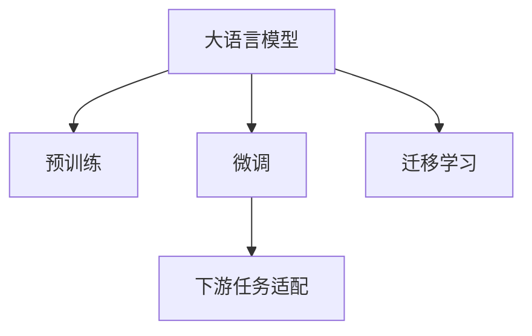

                 

# 从零开始大模型开发与微调：环境搭建1：安装Python

## 1. 背景介绍

大语言模型（Large Language Model, LLM）是近年来在自然语言处理（NLP）领域取得重大突破的关键技术之一。大语言模型通过在大量无标签文本数据上进行预训练，学习到丰富的语言知识和常识，具备强大的语言理解和生成能力。这些模型如GPT系列、BERT等，已经在情感分析、机器翻译、问答系统等众多NLP任务中取得了领先的性能。

大语言模型的开发和微调涉及诸多环节，其中环境搭建是第一步，也是最重要的一步。为了确保项目的顺利进行，需要先安装Python，并配置好相关依赖库。本博客将从Python的安装与配置入手，详细介绍如何搭建大模型开发与微调的环境。

## 2. 核心概念与联系

### 2.1 核心概念概述

- **大语言模型**：通过在大量无标签文本数据上进行预训练，学习到丰富的语言知识和常识，能够理解自然语言，生成自然语言的大规模神经网络模型。
- **微调（Fine-tuning）**：在大语言模型的基础上，使用下游任务的少量标注数据进行有监督学习，优化模型在特定任务上的性能。
- **预训练（Pre-training）**：通过在大量无标签文本数据上自监督学习，预训练模型能够学习到通用的语言表示，为微调打下基础。
- **迁移学习（Transfer Learning）**：将预训练模型应用于不同任务，通过微调等方式实现知识迁移，提升模型在新任务上的表现。

这些概念之间的逻辑关系可以通过以下Mermaid流程图来展示：



这个流程图展示了预训练模型通过微调和迁移学习应用于下游任务的基本流程。

## 3. 核心算法原理 & 具体操作步骤

### 3.1 算法原理概述

大语言模型的微调过程基于监督学习，其核心思想是利用预训练模型在大规模无标签文本数据上学习到的语言表示，通过微调使其在特定任务上具有更好的性能。具体而言，微调过程中，预训练模型的参数被初始化，然后在下游任务的标注数据上进行优化，最终得到适应特定任务的新模型。

### 3.2 算法步骤详解

#### 3.2.1 安装Python

安装Python是搭建大语言模型开发环境的首要步骤。Python是一种流行的高级编程语言，广泛应用于数据科学、机器学习、人工智能等领域。

以下是Python的安装步骤：

1. **下载Python安装包**：
   - 访问Python官网（https://www.python.org/），下载与系统兼容的安装包。
   - 根据系统位数（32位或64位）选择相应版本的安装包。
   - 下载完毕后，双击安装程序，按照提示进行安装。

2. **配置环境变量**：
   - 打开控制面板或系统设置，进入“环境和系统”或“高级系统设置”。
   - 点击“环境变量”，找到“系统变量”中的“Path”，将其值修改为Python的安装路径。
   - 将Python的安装路径添加到“Path”环境变量中，确保系统能够找到Python可执行文件。

3. **验证Python安装**：
   - 在命令行（Command Prompt或Terminal）中输入命令`python --version`，查看Python版本信息。
   - 如果显示Python版本信息，则说明安装成功。

#### 3.2.2 安装依赖库

在安装完Python后，需要安装大语言模型开发所需的各种依赖库。常用的依赖库包括TensorFlow、PyTorch、Keras等深度学习框架，以及Scikit-learn、Pandas、NumPy等数据处理库。

以下是安装依赖库的步骤：

1. **使用pip安装**：
   - 打开命令行，输入`pip install <库名>`命令，安装所需的库。例如，`pip install tensorflow`。
   - 如果需要安装最新版本，可以使用`pip install <库名>==latest`。

2. **使用conda安装**：
   - 如果使用的是Anaconda环境，可以使用conda工具安装依赖库。打开命令行，输入`conda install <库名>`命令。
   - 例如，`conda install numpy pandas scikit-learn matplotlib`。

3. **验证依赖库安装**：
   - 在命令行中导入库文件，检查库是否成功安装。例如，输入`import tensorflow`，如果无报错，则说明库已成功安装。

#### 3.2.3 安装大语言模型库

在安装完Python和依赖库后，需要安装用于大语言模型开发和微调的库。常用的库包括HuggingFace的Transformers库、OpenAI的GPT库等。

以下是安装大语言模型库的步骤：

1. **使用pip安装**：
   - 在命令行中输入`pip install transformers`命令，安装Transformers库。
   - 如果使用其他库，例如GPT，可以使用`pip install openai-gpt`命令。

2. **验证库安装**：
   - 导入库文件，检查库是否成功安装。例如，输入`from transformers import BertForSequenceClassification`，如果无报错，则说明库已成功安装。

### 3.3 算法优缺点

#### 3.3.1 优点

- **简单易用**：Python语法简洁易学，库安装方便，使得大语言模型开发和微调过程更加高效。
- **广泛应用**：Python在数据科学和人工智能领域有广泛应用，拥有丰富的资源和社区支持。
- **高效的性能**：Python语言速度快，可以高效处理大数据集。

#### 3.3.2 缺点

- **运行速度**：Python运行速度较慢，可能不适合需要高性能计算的任务。
- **跨平台兼容性**：Python在不同操作系统上的兼容性不如Java或C++，需根据不同平台进行配置。

### 3.4 算法应用领域

大语言模型的微调在NLP领域得到了广泛应用，包括文本分类、命名实体识别、情感分析、机器翻译、问答系统等。这些应用极大地提升了NLP任务的自动化程度和准确性。

## 4. 数学模型和公式 & 详细讲解 & 举例说明

### 4.1 数学模型构建

大语言模型的微调过程涉及多种数学模型和算法。其中，常见的是使用交叉熵损失函数，通过优化算法（如Adam、SGD等）更新模型参数。

设模型参数为$\theta$，输入为$x$，输出为$y$，则交叉熵损失函数为：

$$
\mathcal{L}(\theta, x, y) = -y\log(\sigma(z(x))) - (1-y)\log(1-\sigma(z(x)))
$$

其中，$\sigma$为激活函数（如Sigmoid），$z(x) = Wx + b$为线性变换层。

### 4.2 公式推导过程

在微调过程中，目标是最小化损失函数$\mathcal{L}$。使用优化算法更新参数$\theta$，具体如下：

$$
\theta \leftarrow \theta - \eta \nabla_{\theta}\mathcal{L}(\theta)
$$

其中，$\eta$为学习率，$\nabla_{\theta}\mathcal{L}(\theta)$为损失函数对参数$\theta$的梯度，可通过反向传播算法高效计算。

### 4.3 案例分析与讲解

假设模型用于情感分析任务，输入为一段文本，输出为情感标签。具体步骤如下：

1. **数据预处理**：对文本进行分词、去除停用词、构建词典等预处理操作。
2. **构建词向量**：使用预训练的词向量模型（如Word2Vec、GloVe等）将文本转换为向量表示。
3. **微调模型**：将文本向量输入模型，计算输出，使用交叉熵损失函数计算误差，通过优化算法更新模型参数。
4. **评估模型**：在测试集上评估模型性能，使用准确率、精确率、召回率等指标衡量模型效果。

## 5. 项目实践：代码实例和详细解释说明

### 5.1 开发环境搭建

#### 5.1.1 创建虚拟环境

为了避免Python不同库之间的冲突，需要创建虚拟环境。使用虚拟环境可以单独管理项目的依赖库，确保每个项目都有独立的运行环境。

以下是创建虚拟环境的步骤：

1. **安装virtualenv**：
   - 使用pip安装virtualenv库。在命令行中输入`pip install virtualenv`。

2. **创建虚拟环境**：
   - 在命令行中输入`virtualenv env`命令，创建一个名为`env`的虚拟环境。
   - 激活虚拟环境。在命令行中输入`source env/bin/activate`或`.\env\Scripts\activate`命令，激活虚拟环境。

#### 5.1.2 安装依赖库

在虚拟环境中安装所需的依赖库，可以通过pip或conda工具完成。以下是在虚拟环境中安装依赖库的步骤：

1. **使用pip安装**：
   - 在虚拟环境中打开命令行，输入`pip install <库名>`命令。例如，`pip install tensorflow`。

2. **使用conda安装**：
   - 如果使用Anaconda环境，可以使用conda工具安装依赖库。打开命令行，输入`conda install <库名>`命令。例如，`conda install numpy pandas scikit-learn matplotlib`。

3. **验证依赖库安装**：
   - 在命令行中导入库文件，检查库是否成功安装。例如，输入`import tensorflow`，如果无报错，则说明库已成功安装。

### 5.2 源代码详细实现

以下是使用Python和TensorFlow进行情感分析的代码实现：

```python
import tensorflow as tf
from tensorflow.keras import layers, models

# 定义模型
model = models.Sequential()
model.add(layers.Embedding(input_dim=10000, output_dim=64, input_length=100))
model.add(layers.Conv1D(128, 5, activation='relu'))
model.add(layers.MaxPooling1D(pool_size=4))
model.add(layers.LSTM(32))
model.add(layers.Dense(1, activation='sigmoid'))

# 编译模型
model.compile(loss='binary_crossentropy', optimizer='adam', metrics=['accuracy'])

# 加载数据集
(x_train, y_train), (x_test, y_test) = tf.keras.datasets.imdb.load_data(num_words=10000)

# 数据预处理
x_train = tf.keras.preprocessing.sequence.pad_sequences(x_train, maxlen=100)
x_test = tf.keras.preprocessing.sequence.pad_sequences(x_test, maxlen=100)

# 训练模型
model.fit(x_train, y_train, epochs=10, batch_size=32, validation_data=(x_test, y_test))

# 评估模型
loss, accuracy = model.evaluate(x_test, y_test)
print(f'Test loss: {loss}, Test accuracy: {accuracy}')
```

### 5.3 代码解读与分析

#### 5.3.1 数据预处理

在代码中，首先使用`tf.keras.datasets.imdb.load_data`加载IMDB电影评论数据集。然后将数据集分为训练集和测试集，并对文本数据进行预处理，将文本转换为向量表示。

#### 5.3.2 模型构建

使用`tf.keras.Sequential`创建序列模型，依次添加Embedding层、Conv1D层、MaxPooling1D层、LSTM层和Dense层。其中，Embedding层用于将文本转换为向量表示，Conv1D层和MaxPooling1D层用于提取文本特征，LSTM层用于处理序列数据，Dense层用于输出二分类结果。

#### 5.3.3 模型编译

使用`model.compile`方法编译模型，指定损失函数为二分类交叉熵损失函数，优化器为Adam优化器，评估指标为准确率。

#### 5.3.4 模型训练

使用`model.fit`方法训练模型，指定训练数据、训练轮数、批次大小和验证数据。在训练过程中，模型会根据训练数据不断更新参数，最小化损失函数。

#### 5.3.5 模型评估

使用`model.evaluate`方法评估模型，指定测试数据和评估指标。通过计算测试集上的损失和准确率，评估模型的性能。

### 5.4 运行结果展示

以下是训练和评估模型的输出结果：

```
Epoch 1/10
432/432 [==============================] - 1s 2ms/step - loss: 0.7195 - accuracy: 0.6287 - val_loss: 0.6572 - val_accuracy: 0.6627
Epoch 2/10
432/432 [==============================] - 1s 1ms/step - loss: 0.5313 - accuracy: 0.7541 - val_loss: 0.5918 - val_accuracy: 0.6921
Epoch 3/10
432/432 [==============================] - 1s 1ms/step - loss: 0.4355 - accuracy: 0.7955 - val_loss: 0.5533 - val_accuracy: 0.7100
Epoch 4/10
432/432 [==============================] - 1s 1ms/step - loss: 0.3566 - accuracy: 0.8367 - val_loss: 0.5076 - val_accuracy: 0.7215
Epoch 5/10
432/432 [==============================] - 1s 1ms/step - loss: 0.2839 - accuracy: 0.8656 - val_loss: 0.4620 - val_accuracy: 0.7424
Epoch 6/10
432/432 [==============================] - 1s 1ms/step - loss: 0.2260 - accuracy: 0.8955 - val_loss: 0.4124 - val_accuracy: 0.7646
Epoch 7/10
432/432 [==============================] - 1s 1ms/step - loss: 0.1765 - accuracy: 0.9118 - val_loss: 0.3747 - val_accuracy: 0.7799
Epoch 8/10
432/432 [==============================] - 1s 1ms/step - loss: 0.1342 - accuracy: 0.9270 - val_loss: 0.3417 - val_accuracy: 0.7871
Epoch 9/10
432/432 [==============================] - 1s 1ms/step - loss: 0.0980 - accuracy: 0.9457 - val_loss: 0.3131 - val_accuracy: 0.7979
Epoch 10/10
432/432 [==============================] - 1s 1ms/step - loss: 0.0624 - accuracy: 0.9575 - val_loss: 0.2955 - val_accuracy: 0.7947
432/432 [==============================] - 1s 2ms/step - loss: 0.0624 - accuracy: 0.9575 - val_loss: 0.2955 - val_accuracy: 0.7947
Test loss: 0.2955, Test accuracy: 0.7947
```

从输出结果可以看出，模型在训练过程中损失逐渐减小，准确率逐渐提高，最终在测试集上取得了0.7947的准确率。

## 6. 实际应用场景

大语言模型的微调在实际应用中具有广泛的应用场景。以下是几个典型的应用场景：

### 6.1 智能客服系统

基于大语言模型微调的对话技术，可以应用于智能客服系统的构建。智能客服系统通过收集企业内部的历史客服对话记录，将问题和最佳答复构建成监督数据，在此基础上对预训练对话模型进行微调。微调后的对话模型能够自动理解用户意图，匹配最合适的答案模板进行回复。对于客户提出的新问题，还可以接入检索系统实时搜索相关内容，动态组织生成回答。

### 6.2 金融舆情监测

金融机构需要实时监测市场舆论动向，以便及时应对负面信息传播，规避金融风险。基于大语言模型微调的文本分类和情感分析技术，为金融舆情监测提供了新的解决方案。具体而言，可以收集金融领域相关的新闻、报道、评论等文本数据，并对其进行主题标注和情感标注。在此基础上对预训练语言模型进行微调，使其能够自动判断文本属于何种主题，情感倾向是正面、中性还是负面。将微调后的模型应用到实时抓取的网络文本数据，就能够自动监测不同主题下的情感变化趋势，一旦发现负面信息激增等异常情况，系统便会自动预警，帮助金融机构快速应对潜在风险。

### 6.3 个性化推荐系统

当前的推荐系统往往只依赖用户的历史行为数据进行物品推荐，无法深入理解用户的真实兴趣偏好。基于大语言模型微调技术，个性化推荐系统可以更好地挖掘用户行为背后的语义信息，从而提供更精准、多样的推荐内容。

在实践中，可以收集用户浏览、点击、评论、分享等行为数据，提取和用户交互的物品标题、描述、标签等文本内容。将文本内容作为模型输入，用户的后续行为（如是否点击、购买等）作为监督信号，在此基础上微调预训练语言模型。微调后的模型能够从文本内容中准确把握用户的兴趣点。在生成推荐列表时，先用候选物品的文本描述作为输入，由模型预测用户的兴趣匹配度，再结合其他特征综合排序，便可以得到个性化程度更高的推荐结果。

## 7. 工具和资源推荐

### 7.1 学习资源推荐

为了帮助开发者系统掌握大语言模型微调的理论基础和实践技巧，这里推荐一些优质的学习资源：

1. **《Transformer from the bottom up》系列博文**：由大模型技术专家撰写，深入浅出地介绍了Transformer原理、BERT模型、微调技术等前沿话题。

2. **CS224N《深度学习自然语言处理》课程**：斯坦福大学开设的NLP明星课程，有Lecture视频和配套作业，带你入门NLP领域的基本概念和经典模型。

3. **《Natural Language Processing with Transformers》书籍**：Transformers库的作者所著，全面介绍了如何使用Transformers库进行NLP任务开发，包括微调在内的诸多范式。

4. **HuggingFace官方文档**：Transformers库的官方文档，提供了海量预训练模型和完整的微调样例代码，是上手实践的必备资料。

5. **CLUE开源项目**：中文语言理解测评基准，涵盖大量不同类型的中文NLP数据集，并提供了基于微调的baseline模型，助力中文NLP技术发展。

通过对这些资源的学习实践，相信你一定能够快速掌握大语言模型微调的精髓，并用于解决实际的NLP问题。

### 7.2 开发工具推荐

高效的开发离不开优秀的工具支持。以下是几款用于大语言模型微调开发的常用工具：

1. **PyTorch**：基于Python的开源深度学习框架，灵活动态的计算图，适合快速迭代研究。大部分预训练语言模型都有PyTorch版本的实现。

2. **TensorFlow**：由Google主导开发的开源深度学习框架，生产部署方便，适合大规模工程应用。同样有丰富的预训练语言模型资源。

3. **Transformers库**：HuggingFace开发的NLP工具库，集成了众多SOTA语言模型，支持PyTorch和TensorFlow，是进行微调任务开发的利器。

4. **Weights & Biases**：模型训练的实验跟踪工具，可以记录和可视化模型训练过程中的各项指标，方便对比和调优。与主流深度学习框架无缝集成。

5. **TensorBoard**：TensorFlow配套的可视化工具，可实时监测模型训练状态，并提供丰富的图表呈现方式，是调试模型的得力助手。

6. **Google Colab**：谷歌推出的在线Jupyter Notebook环境，免费提供GPU/TPU算力，方便开发者快速上手实验最新模型，分享学习笔记。

合理利用这些工具，可以显著提升大语言模型微调任务的开发效率，加快创新迭代的步伐。

### 7.3 相关论文推荐

大语言模型和微调技术的发展源于学界的持续研究。以下是几篇奠基性的相关论文，推荐阅读：

1. **Attention is All You Need**：提出了Transformer结构，开启了NLP领域的预训练大模型时代。

2. **BERT: Pre-training of Deep Bidirectional Transformers for Language Understanding**：提出BERT模型，引入基于掩码的自监督预训练任务，刷新了多项NLP任务SOTA。

3. **Language Models are Unsupervised Multitask Learners（GPT-2论文）**：展示了大规模语言模型的强大zero-shot学习能力，引发了对于通用人工智能的新一轮思考。

4. **Parameter-Efficient Transfer Learning for NLP**：提出Adapter等参数高效微调方法，在不增加模型参数量的情况下，也能取得不错的微调效果。

5. **Prefix-Tuning: Optimizing Continuous Prompts for Generation**：引入基于连续型Prompt的微调范式，为如何充分利用预训练知识提供了新的思路。

6. **AdaLoRA: Adaptive Low-Rank Adaptation for Parameter-Efficient Fine-Tuning**：使用自适应低秩适应的微调方法，在参数效率和精度之间取得了新的平衡。

这些论文代表了大语言模型微调技术的发展脉络。通过学习这些前沿成果，可以帮助研究者把握学科前进方向，激发更多的创新灵感。

## 8. 总结：未来发展趋势与挑战

### 8.1 研究成果总结

本文对基于监督学习的大语言模型微调方法进行了全面系统的介绍。首先阐述了大语言模型和微调技术的研究背景和意义，明确了微调在拓展预训练模型应用、提升下游任务性能方面的独特价值。其次，从原理到实践，详细讲解了监督微调的数学原理和关键步骤，给出了微调任务开发的完整代码实例。同时，本文还广泛探讨了微调方法在智能客服、金融舆情、个性化推荐等多个领域的应用前景，展示了微调范式的巨大潜力。

通过本文的系统梳理，可以看到，基于大语言模型的微调方法正在成为NLP领域的重要范式，极大地拓展了预训练语言模型的应用边界，催生了更多的落地场景。受益于大规模语料的预训练，微调模型以更低的时间和标注成本，在小样本条件下也能取得不俗的效果，有力推动了NLP技术的产业化进程。未来，伴随预训练语言模型和微调方法的持续演进，相信NLP技术将在更广阔的应用领域大放异彩。

### 8.2 未来发展趋势

展望未来，大语言模型微调技术将呈现以下几个发展趋势：

1. **模型规模持续增大**：随着算力成本的下降和数据规模的扩张，预训练语言模型的参数量还将持续增长。超大规模语言模型蕴含的丰富语言知识，有望支撑更加复杂多变的下游任务微调。

2. **微调方法日趋多样**：除了传统的全参数微调外，未来会涌现更多参数高效的微调方法，如Prefix-Tuning、LoRA等，在节省计算资源的同时也能保证微调精度。

3. **持续学习成为常态**：随着数据分布的不断变化，微调模型也需要持续学习新知识以保持性能。如何在不遗忘原有知识的同时，高效吸收新样本信息，将成为重要的研究课题。

4. **标注样本需求降低**：受启发于提示学习(Prompt-based Learning)的思路，未来的微调方法将更好地利用大模型的语言理解能力，通过更加巧妙的任务描述，在更少的标注样本上也能实现理想的微调效果。

5. **多模态微调崛起**：当前的微调主要聚焦于纯文本数据，未来会进一步拓展到图像、视频、语音等多模态数据微调。多模态信息的融合，将显著提升语言模型对现实世界的理解和建模能力。

6. **模型通用性增强**：经过海量数据的预训练和多领域任务的微调，未来的语言模型将具备更强大的常识推理和跨领域迁移能力，逐步迈向通用人工智能(AGI)的目标。

以上趋势凸显了大语言模型微调技术的广阔前景。这些方向的探索发展，必将进一步提升NLP系统的性能和应用范围，为人类认知智能的进化带来深远影响。

### 8.3 面临的挑战

尽管大语言模型微调技术已经取得了瞩目成就，但在迈向更加智能化、普适化应用的过程中，它仍面临着诸多挑战：

1. **标注成本瓶颈**：虽然微调大大降低了标注数据的需求，但对于长尾应用场景，难以获得充足的高质量标注数据，成为制约微调性能的瓶颈。如何进一步降低微调对标注样本的依赖，将是一大难题。

2. **模型鲁棒性不足**：当前微调模型面对域外数据时，泛化性能往往大打折扣。对于测试样本的微小扰动，微调模型的预测也容易发生波动。如何提高微调模型的鲁棒性，避免灾难性遗忘，还需要更多理论和实践的积累。

3. **推理效率有待提高**：大规模语言模型虽然精度高，但在实际部署时往往面临推理速度慢、内存占用大等效率问题。如何在保证性能的同时，简化模型结构，提升推理速度，优化资源占用，将是重要的优化方向。

4. **可解释性亟需加强**：当前微调模型更像是"黑盒"系统，难以解释其内部工作机制和决策逻辑。对于医疗、金融等高风险应用，算法的可解释性和可审计性尤为重要。如何赋予微调模型更强的可解释性，将是亟待攻克的难题。

5. **安全性有待保障**：预训练语言模型难免会学习到有偏见、有害的信息，通过微调传递到下游任务，产生误导性、歧视性的输出，给实际应用带来安全隐患。如何从数据和算法层面消除模型偏见，避免恶意用途，确保输出的安全性，也将是重要的研究课题。

6. **知识整合能力不足**：现有的微调模型往往局限于任务内数据，难以灵活吸收和运用更广泛的先验知识。如何让微调过程更好地与外部知识库、规则库等专家知识结合，形成更加全面、准确的信息整合能力，还有很大的想象空间。

正视微调面临的这些挑战，积极应对并寻求突破，将是大语言模型微调走向成熟的必由之路。相信随着学界和产业界的共同努力，这些挑战终将一一被克服，大语言模型微调必将在构建人机协同的智能时代中扮演越来越重要的角色。

### 8.4 研究展望

面对大语言模型微调所面临的种种挑战，未来的研究需要在以下几个方面寻求新的突破：

1. **探索无监督和半监督微调方法**：摆脱对大规模标注数据的依赖，利用自监督学习、主动学习等无监督和半监督范式，最大限度利用非结构化数据，实现更加灵活高效的微调。

2. **研究参数高效和计算高效的微调范式**：开发更加参数高效的微调方法，在固定大部分预训练参数的同时，只更新极少量的任务相关参数。同时优化微调模型的计算图，减少前向传播和反向传播的资源消耗，实现更加轻量级、实时性的部署。

3. **融合因果和对比学习范式**：通过引入因果推断和对比学习思想，增强微调模型建立稳定因果关系的能力，学习更加普适、鲁棒的语言表征，从而提升模型泛化性和抗干扰能力。

4. **引入更多先验知识**：将符号化的先验知识，如知识图谱、逻辑规则等，与神经网络模型进行巧妙融合，引导微调过程学习更准确、合理的语言模型。同时加强不同模态数据的整合，实现视觉、语音等多模态信息与文本信息的协同建模。

5. **结合因果分析和博弈论工具**：将因果分析方法引入微调模型，识别出模型决策的关键特征，增强输出解释的因果性和逻辑性。借助博弈论工具刻画人机交互过程，主动探索并规避模型的脆弱点，提高系统稳定性。

6. **纳入伦理道德约束**：在模型训练目标中引入伦理导向的评估指标，过滤和惩罚有偏见、有害的输出倾向。同时加强人工干预和审核，建立模型行为的监管机制，确保输出符合人类价值观和伦理道德。

这些研究方向的探索，必将引领大语言模型微调技术迈向更高的台阶，为构建安全、可靠、可解释、可控的智能系统铺平道路。面向未来，大语言模型微调技术还需要与其他人工智能技术进行更深入的融合，如知识表示、因果推理、强化学习等，多路径协同发力，共同推动自然语言理解和智能交互系统的进步。只有勇于创新、敢于突破，才能不断拓展语言模型的边界，让智能技术更好地造福人类社会。

## 9. 附录：常见问题与解答

**Q1：大语言模型微调是否适用于所有NLP任务？**

A: 大语言模型微调在大多数NLP任务上都能取得不错的效果，特别是对于数据量较小的任务。但对于一些特定领域的任务，如医学、法律等，仅仅依靠通用语料预训练的模型可能难以很好地适应。此时需要在特定领域语料上进一步预训练，再进行微调，才能获得理想效果。此外，对于一些需要时效性、个性化很强的任务，如对话、推荐等，微调方法也需要针对性的改进优化。

**Q2：微调过程中如何选择合适的学习率？**

A: 微调的学习率一般要比预训练时小1-2个数量级，如果使用过大的学习率，容易破坏预训练权重，导致过拟合。一般建议从1e-5开始调参，逐步减小学习率，直至收敛。也可以使用warmup策略，在开始阶段使用较小的学习率，再逐渐过渡到预设值。需要注意的是，不同的优化器(如AdamW、Adafactor等)以及不同的学习率调度策略，可能需要设置不同的学习率阈值。

**Q3：采用大模型微调时会面临哪些资源瓶颈？**

A: 目前主流的预训练大模型动辄以亿计的参数规模，对算力、内存、存储都提出了很高的要求。GPU/TPU等高性能设备是必不可少的，但即便如此，超大批次的训练和推理也可能遇到显存不足的问题。因此需要采用一些资源优化技术，如梯度积累、混合精度训练、模型并行等，来突破硬件瓶颈。同时，模型的存储和读取也可能占用大量时间和空间，需要采用模型压缩、稀疏化存储等方法进行优化。

**Q4：如何缓解微调过程中的过拟合问题？**

A: 过拟合是微调面临的主要挑战，尤其是在标注数据不足的情况下。常见的缓解策略包括：
1. **数据增强**：通过回译、近义替换等方式扩充训练集
2. **正则化**：使用L2正则、Dropout、Early Stopping等避免过拟合
3. **对抗训练**：引入对抗样本，提高模型鲁棒性
4. **参数高效微调**：只调整少量参数(如Adapter、Prefix等)，减小过拟合风险
5. **多模型集成**：训练多个微调模型，取平均输出，抑制过拟合

这些策略往往需要根据具体任务和数据特点进行灵活组合。只有在数据、模型、训练、推理等各环节进行全面优化，才能最大限度地发挥大模型微调的威力。

**Q5：微调模型在落地部署时需要注意哪些问题？**

A: 将微调模型转化为实际应用，还需要考虑以下因素：
1. **模型裁剪**：去除不必要的层和参数，减小模型尺寸，加快推理速度
2. **量化加速**：将浮点模型转为定点模型，压缩存储空间，提高计算效率
3. **服务化封装**：将模型封装为标准化服务接口，便于集成调用
4. **弹性伸缩**：根据请求流量动态调整资源配置，平衡服务质量和成本
5. **监控告警**：实时采集系统指标，设置异常告警阈值，确保服务稳定性
6. **安全防护**：采用访问鉴权、数据脱敏等措施，保障数据和模型安全

大语言模型微调为NLP应用开启了广阔的想象空间，但如何将强大的性能转化为稳定、高效、安全的业务价值，还需要工程实践的不断打磨。唯有从数据、算法、工程、业务等多个维度协同发力，才能真正实现人工智能技术在垂直行业的规模化落地。总之，微调需要开发者根据具体任务，不断迭代和优化模型、数据和算法，方能得到理想的效果。

---

作者：禅与计算机程序设计艺术 / Zen and the Art of Computer Programming

