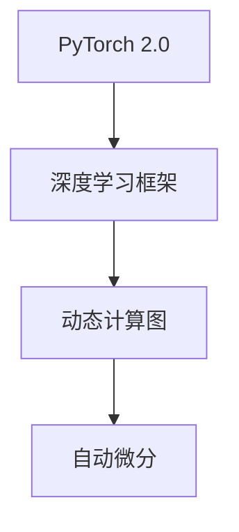

                 

# 从零开始大模型开发与微调：环境搭建2：安装PyTorch 2.0

> 关键词：大模型开发,PyTorch,环境搭建,深度学习,深度学习框架

## 1. 背景介绍

在深入探讨大模型开发和微调之前，我们需要先搭建好开发环境，确保代码能够顺利运行。在前面的博客中，我们已经介绍了如何准备虚拟环境和Python库的安装。接下来，我们将继续介绍如何使用pip命令安装PyTorch 2.0，并完成环境配置。

PyTorch 2.0是Facebook开源的深度学习框架，提供了动态计算图和自动微分功能，被广泛应用于各种深度学习任务，如计算机视觉、自然语言处理等。了解如何安装和配置PyTorch，是开始大模型开发的基础。

## 2. 核心概念与联系

### 2.1 核心概念概述

- **PyTorch 2.0**：由Facebook开源的深度学习框架，提供了动态计算图和自动微分功能。
- **深度学习框架**：用于创建和训练深度学习模型的软件库，提供了高效的计算和可视化功能。
- **动态计算图**：在模型训练过程中，自动计算和存储计算过程的图，适合复杂模型的优化和调试。
- **自动微分**：自动计算和求导模型参数，简化了深度学习模型的训练过程。

这些概念构成了深度学习开发的基础，PyTorch 2.0则是一个具体的深度学习框架，它提供了灵活的计算图和高效的自动微分功能，被广泛用于深度学习模型的开发和训练。

### 2.2 核心概念原理和架构的 Mermaid 流程图



这个流程图展示了PyTorch 2.0的核心概念和架构，从框架到动态计算图和自动微分功能的延伸。

## 3. 核心算法原理 & 具体操作步骤

### 3.1 算法原理概述

PyTorch 2.0的动态计算图和自动微分功能是其核心算法原理。动态计算图使得模型在训练过程中能够自动记录计算路径，并且可以动态地修改计算图。自动微分功能则能够自动计算和求导模型参数，使得模型的训练过程更加高效和精确。

在深度学习模型中，动态计算图允许模型以一种灵活的方式进行优化，例如，可以通过反向传播算法自动计算梯度，从而优化模型参数。自动微分则进一步简化了这一过程，使得模型的训练变得更加简单和高效。

### 3.2 算法步骤详解

安装PyTorch 2.0的主要步骤如下：

1. **安装pip**：首先，需要安装pip工具，它用于安装和管理Python包。
2. **安装PyTorch 2.0**：使用pip命令安装PyTorch 2.0。
3. **验证安装**：安装完成后，可以通过Python代码验证PyTorch是否正确安装。

以下是详细的安装步骤：

**Step 1: 安装pip**

1. 下载并安装pip：
```bash
curl https://bootstrap.pypa.io/get-pip.py -o get-pip.py
python get-pip.py
```

2. 验证pip安装：
```bash
pip --version
```

如果安装成功，应该会看到类似于以下内容：
```
pip 21.3.1
```

**Step 2: 安装PyTorch 2.0**

1. 安装PyTorch 2.0：
```bash
pip install torch torchvision torchaudio
```

2. 验证PyTorch安装：
```python
import torch
print(torch.__version__)
```

如果安装成功，应该会看到类似于以下内容：
```
1.13.0
```

**Step 3: 创建虚拟环境**

1. 创建虚拟环境：
```bash
python -m venv pytorch-env
```

2. 激活虚拟环境：
```bash
source pytorch-env/bin/activate
```

**Step 4: 安装额外的Python库**

1. 安装额外的库：
```bash
pip install numpy pandas scikit-learn matplotlib tqdm jupyter notebook ipython
```

2. 验证库安装：
```python
import numpy as np
import pandas as pd
import matplotlib.pyplot as plt
import torch
import ipywidgets as widgets
```

如果安装成功，应该可以看到没有报错提示。

### 3.3 算法优缺点

**优点**：
- 动态计算图：提高了模型的灵活性和可调试性。
- 自动微分：简化了模型的训练过程，提高了效率。
- 易于使用：提供了丰富的API和工具，方便开发和调试。

**缺点**：
- 内存占用：由于动态计算图的特性，模型的内存占用较大。
- 计算开销：动态计算图的计算开销较大，可能导致训练速度变慢。

尽管存在一些缺点，但PyTorch 2.0在大规模深度学习模型的开发和训练中表现出色，是深度学习开发的首选框架之一。

### 3.4 算法应用领域

PyTorch 2.0被广泛应用于各种深度学习任务，包括但不限于：

- 计算机视觉：如目标检测、图像分类、语义分割等。
- 自然语言处理：如语言模型、文本分类、情感分析等。
- 语音识别：如语音识别、语音合成等。
- 强化学习：如游戏AI、机器人控制等。

PyTorch 2.0在深度学习领域的广泛应用，使得它成为了深度学习开发者不可或缺的工具。

## 4. 数学模型和公式 & 详细讲解 & 举例说明

### 4.1 数学模型构建

在PyTorch 2.0中，可以使用`torch.nn`模块定义模型。以下是一个简单的神经网络模型的定义：

```python
import torch
import torch.nn as nn
import torch.optim as optim

class NeuralNetwork(nn.Module):
    def __init__(self):
        super(NeuralNetwork, self).__init__()
        self.fc1 = nn.Linear(784, 128)
        self.fc2 = nn.Linear(128, 64)
        self.fc3 = nn.Linear(64, 10)

    def forward(self, x):
        x = x.view(-1, 784)
        x = torch.relu(self.fc1(x))
        x = torch.relu(self.fc2(x))
        x = self.fc3(x)
        return x
```

在这个例子中，我们定义了一个简单的神经网络，包括三个全连接层。

### 4.2 公式推导过程

在使用PyTorch 2.0进行模型训练时，我们需要定义损失函数和优化器。以下是一个简单的损失函数和优化器的定义：

```python
criterion = nn.CrossEntropyLoss()
optimizer = optim.SGD(model.parameters(), lr=0.01)
```

这里使用了交叉熵损失函数和随机梯度下降优化器。

### 4.3 案例分析与讲解

我们可以使用PyTorch 2.0来训练一个手写数字识别模型。以下是一个简单的训练过程：

```python
import torchvision.datasets as datasets
import torchvision.transforms as transforms

# 数据预处理
transform = transforms.Compose([
    transforms.ToTensor(),
    transforms.Normalize((0.5,), (0.5,))
])

# 加载数据集
train_dataset = datasets.MNIST(root='./data', train=True, transform=transform, download=True)
test_dataset = datasets.MNIST(root='./data', train=False, transform=transform, download=True)

# 数据加载器
train_loader = torch.utils.data.DataLoader(train_dataset, batch_size=64, shuffle=True)
test_loader = torch.utils.data.DataLoader(test_dataset, batch_size=64, shuffle=False)

# 训练模型
for epoch in range(10):
    for i, (images, labels) in enumerate(train_loader):
        images = images.view(-1, 28 * 28)
        labels = labels

        # 前向传播
        outputs = model(images)

        # 计算损失
        loss = criterion(outputs, labels)

        # 反向传播和优化
        optimizer.zero_grad()
        loss.backward()
        optimizer.step()

        # 输出训练信息
        if (i+1) % 100 == 0:
            print('Epoch [{}/{}], Step [{}/{}], Loss: {:.4f}'.format(epoch+1, 10, i+1, len(train_loader), loss.item()))
```

在这个例子中，我们使用了MNIST数据集进行训练，训练过程中使用了交叉熵损失函数和随机梯度下降优化器。

## 5. 项目实践：代码实例和详细解释说明

### 5.1 开发环境搭建

在搭建开发环境时，我们已经在之前的博客中介绍了如何准备虚拟环境和安装Python库。接下来，我们将继续介绍如何使用PyTorch 2.0进行深度学习模型的开发和训练。

### 5.2 源代码详细实现

以下是一个简单的图像分类模型的实现：

```python
import torch
import torch.nn as nn
import torch.optim as optim
import torchvision.transforms as transforms
import torchvision.datasets as datasets

# 定义模型
class Model(nn.Module):
    def __init__(self):
        super(Model, self).__init__()
        self.conv1 = nn.Conv2d(3, 16, kernel_size=3, stride=1, padding=1)
        self.conv2 = nn.Conv2d(16, 32, kernel_size=3, stride=1, padding=1)
        self.pool = nn.MaxPool2d(kernel_size=2, stride=2)
        self.fc1 = nn.Linear(32*8*8, 256)
        self.fc2 = nn.Linear(256, 10)

    def forward(self, x):
        x = self.conv1(x)
        x = nn.functional.relu(x)
        x = self.conv2(x)
        x = nn.functional.relu(x)
        x = self.pool(x)
        x = x.view(-1, 32*8*8)
        x = self.fc1(x)
        x = nn.functional.relu(x)
        x = self.fc2(x)
        return x

# 定义损失函数和优化器
model = Model()
criterion = nn.CrossEntropyLoss()
optimizer = optim.SGD(model.parameters(), lr=0.01)

# 加载数据集
transform = transforms.Compose([
    transforms.ToTensor(),
    transforms.Normalize((0.5,), (0.5,))
])
train_dataset = datasets.CIFAR10(root='./data', train=True, transform=transform, download=True)
test_dataset = datasets.CIFAR10(root='./data', train=False, transform=transform, download=True)

# 数据加载器
train_loader = torch.utils.data.DataLoader(train_dataset, batch_size=64, shuffle=True)
test_loader = torch.utils.data.DataLoader(test_dataset, batch_size=64, shuffle=False)

# 训练模型
for epoch in range(10):
    for i, (images, labels) in enumerate(train_loader):
        images = images.view(-1, 3, 32, 32)
        labels = labels

        # 前向传播
        outputs = model(images)

        # 计算损失
        loss = criterion(outputs, labels)

        # 反向传播和优化
        optimizer.zero_grad()
        loss.backward()
        optimizer.step()

        # 输出训练信息
        if (i+1) % 100 == 0:
            print('Epoch [{}/{}], Step [{}/{}], Loss: {:.4f}'.format(epoch+1, 10, i+1, len(train_loader), loss.item()))

# 测试模型
model.eval()
with torch.no_grad():
    correct = 0
    total = 0
    for images, labels in test_loader:
        images = images.view(-1, 3, 32, 32)
        labels = labels
        outputs = model(images)
        _, predicted = torch.max(outputs.data, 1)
        total += labels.size(0)
        correct += (predicted == labels).sum().item()

    print('Test Accuracy of the model on the 10000 test images: {} %'.format(100 * correct / total))
```

在这个例子中，我们定义了一个简单的卷积神经网络模型，用于图像分类任务。在训练过程中，我们使用了交叉熵损失函数和随机梯度下降优化器。

### 5.3 代码解读与分析

在这个代码示例中，我们定义了一个简单的卷积神经网络模型，并使用CIFAR-10数据集进行训练和测试。在训练过程中，我们使用了交叉熵损失函数和随机梯度下降优化器。代码中的关键步骤包括：

- 定义模型：使用`nn.Module`类定义了一个简单的卷积神经网络模型。
- 定义损失函数和优化器：使用`nn.CrossEntropyLoss`定义交叉熵损失函数，使用`optim.SGD`定义随机梯度下降优化器。
- 加载数据集：使用`torchvision.datasets.CIFAR10`加载CIFAR-10数据集，并使用`transforms`进行数据预处理。
- 数据加载器：使用`torch.utils.data.DataLoader`加载数据集。
- 训练模型：在每个epoch中，遍历数据集，进行前向传播、计算损失、反向传播和优化。
- 测试模型：在测试集上测试模型的性能。

## 6. 实际应用场景

### 6.1 计算机视觉

PyTorch 2.0在计算机视觉领域得到了广泛应用。以下是一个简单的图像分类任务的应用场景：

**应用场景**：一家公司需要将大量的产品图片分类，以便进行库存管理和销售分析。公司可以采集产品的图片，并使用PyTorch 2.0进行分类训练，从而自动分类图片。

**解决方案**：首先，需要采集产品的图片，并对其进行预处理。然后，使用PyTorch 2.0的`torchvision`模块进行模型训练，训练一个卷积神经网络模型。在训练过程中，需要使用交叉熵损失函数和随机梯度下降优化器。训练完成后，可以将模型应用到新的图片上，进行分类预测。

### 6.2 自然语言处理

PyTorch 2.0在自然语言处理领域也有广泛的应用。以下是一个简单的文本分类任务的应用场景：

**应用场景**：一家公司需要分析客户的反馈意见，以便改进产品和服务。公司可以收集客户的反馈意见，并对其进行分类。

**解决方案**：首先，需要采集客户的反馈意见，并将其转化为文本数据。然后，使用PyTorch 2.0的`torchtext`模块进行数据预处理，将文本数据转化为向量表示。接着，使用PyTorch 2.0的`torch.nn`模块定义一个文本分类模型，并使用交叉熵损失函数和随机梯度下降优化器进行训练。训练完成后，可以将模型应用到新的文本数据上，进行分类预测。

### 6.3 语音识别

PyTorch 2.0在语音识别领域也有应用。以下是一个简单的语音识别任务的应用场景：

**应用场景**：一家公司需要分析客户的语音反馈，以便改进产品和服务。公司可以采集客户的语音反馈，并对其进行识别。

**解决方案**：首先，需要采集客户的语音反馈，并将其转化为文本数据。然后，使用PyTorch 2.0的`torchaudio`模块进行数据预处理，将语音数据转化为特征向量。接着，使用PyTorch 2.0的`torch.nn`模块定义一个语音识别模型，并使用交叉熵损失函数和随机梯度下降优化器进行训练。训练完成后，可以将模型应用到新的语音数据上，进行识别预测。

## 7. 工具和资源推荐

### 7.1 学习资源推荐

以下是一些学习PyTorch 2.0的资源：

- PyTorch官方文档：提供了详细的API文档和教程，是学习PyTorch 2.0的最佳资源。
- Deep Learning Specialization：由Andrew Ng教授主讲的深度学习课程，包括PyTorch 2.0的内容。
- PyTorch Tutorials：提供了丰富的教程和示例，适合初学者学习。

### 7.2 开发工具推荐

以下是一些用于PyTorch 2.0开发的工具：

- Jupyter Notebook：提供了交互式编程环境，方便调试和测试。
- TensorBoard：提供了可视化工具，方便监控和调试模型训练过程。
- Weights & Biases：提供了实验跟踪工具，方便记录和分析模型训练过程。

### 7.3 相关论文推荐

以下是一些与PyTorch 2.0相关的论文：

- PyTorch: A Deep Learning Framework for Everyone：由Facebook开源的深度学习框架。
- Learning to Represent Visual Sentence Pairs with Image-Text Dual Encoder：使用PyTorch 2.0进行视觉-文本融合的任务。

## 8. 总结：未来发展趋势与挑战

### 8.1 研究成果总结

PyTorch 2.0在深度学习领域具有重要的地位，广泛应用于计算机视觉、自然语言处理和语音识别等领域。它提供了动态计算图和自动微分功能，简化了深度学习模型的开发和训练过程。

### 8.2 未来发展趋势

未来，PyTorch 2.0将继续保持其领先地位，并与其他深度学习框架进行竞争。随着深度学习技术的不断发展，PyTorch 2.0也将不断优化和改进，以适应新的应用场景和需求。

### 8.3 面临的挑战

尽管PyTorch 2.0具有许多优点，但仍然面临一些挑战：

- 内存占用：由于动态计算图的特性，模型的内存占用较大。
- 计算开销：动态计算图的计算开销较大，可能导致训练速度变慢。

### 8.4 研究展望

未来的研究将集中在以下几个方面：

- 优化计算图：优化动态计算图，减少内存占用和计算开销。
- 加速模型训练：采用分布式训练、混合精度训练等技术，加速模型训练过程。
- 扩展应用场景：将PyTorch 2.0应用于更多的领域，如医疗、金融等。

总之，PyTorch 2.0是一个强大的深度学习框架，具有广泛的适用性和灵活性。通过不断的优化和改进，PyTorch 2.0将为深度学习开发者提供更好的工具和支持。

## 9. 附录：常见问题与解答

### Q1: 如何使用PyTorch 2.0进行深度学习开发？

A: 使用PyTorch 2.0进行深度学习开发，需要安装PyTorch 2.0、pip、Jupyter Notebook等工具。然后，可以使用PyTorch 2.0的`torch.nn`、`torchvision`、`torchaudio`等模块进行模型定义、数据加载和训练。

### Q2: PyTorch 2.0的动态计算图和自动微分功能有何优势？

A: PyTorch 2.0的动态计算图和自动微分功能，简化了深度学习模型的开发和训练过程，提高了模型的灵活性和可调试性。动态计算图可以记录模型的计算路径，方便进行优化和调试。自动微分可以自动计算和求导模型参数，提高了训练效率。

### Q3: PyTorch 2.0在深度学习领域的应用场景有哪些？

A: PyTorch 2.0在深度学习领域的应用场景包括计算机视觉、自然语言处理、语音识别等。在计算机视觉领域，PyTorch 2.0可以用于图像分类、目标检测、语义分割等任务。在自然语言处理领域，PyTorch 2.0可以用于文本分类、情感分析、机器翻译等任务。在语音识别领域，PyTorch 2.0可以用于语音识别、语音合成等任务。

### Q4: 如何优化PyTorch 2.0的计算图？

A: 优化PyTorch 2.0的计算图，可以采用分布式训练、混合精度训练、模型剪枝等技术。分布式训练可以提高训练速度，混合精度训练可以减小内存占用，模型剪枝可以减小模型大小。

### Q5: PyTorch 2.0的自动微分功能有哪些优势？

A: PyTorch 2.0的自动微分功能，简化了深度学习模型的训练过程，提高了模型的训练效率。自动微分可以自动计算和求导模型参数，减少了手动求导的复杂性和错误率。

---

作者：禅与计算机程序设计艺术 / Zen and the Art of Computer Programming

