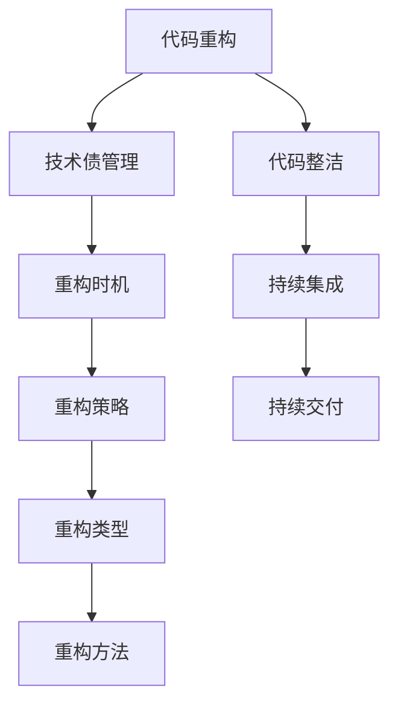
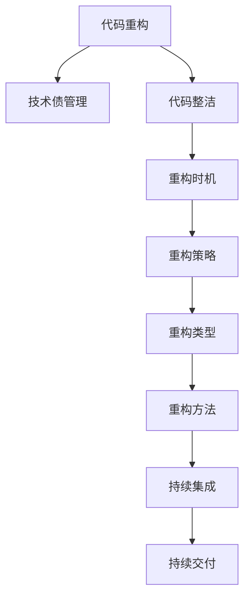

                 

## 1. 背景介绍

在软件开发过程中，代码重构和有效管理技术债（Technical Debt）是两个至关重要的环节，它们能够显著提高代码质量和团队效率。然而，这两个概念往往较为抽象，很多开发者容易忽视其在实践中的具体应用和潜在风险。本文将深入探讨代码重构和基础技术债管理的原理与实践，并结合真实案例进行讲解，力求为开发团队提供实用的指导。

### 1.1 问题由来

随着项目逐渐增大和复杂化，代码质量往往无法得到同步提升，导致技术债积累。技术债不仅影响代码的可维护性和可扩展性，还可能引发潜在的问题，如性能下降、难以理解代码逻辑等。因此，如何在项目迭代过程中，既保持代码的高质量，又避免陷入“重构陷阱”（Refactoring Trap），是每个开发者都必须面对的挑战。

### 1.2 问题核心关键点

- **代码重构（Code Refactoring）**：对代码进行优化，提升其可读性、可维护性和可扩展性，避免未来维护成本的增加。
- **技术债管理（Technical Debt Management）**：在技术债积累和项目迭代之间找到平衡，确保项目能够持续高效地演进。
- **重构时机**：何时进行重构，如何确定重构的优先级，以及重构的边界。
- **重构策略**：哪些问题需要重构，如何评估重构效果，以及如何实施重构。
- **持续集成和交付（CI/CD）**：将重构与持续集成结合，确保重构后的代码质量，促进软件交付速度。

## 2. 核心概念与联系

### 2.1 核心概念概述

代码重构和基础技术债管理涉及多个核心概念：

- **代码重构**：对现有代码进行修改，旨在提高其质量，增强其可读性、可维护性和可扩展性。
- **技术债**：在追求快速开发过程中，积累的代码质量欠债，需要通过重构来弥补。
- **代码整洁**：维护良好的代码结构和命名规范，避免代码混乱，降低未来的维护成本。
- **重构类型**：根据不同的业务场景和代码问题，选择合适的重构类型，如结构重构、性能优化、行为重构等。
- **重构方法**：包括自动化工具、代码评审、版本控制等，支持重构的实施和跟踪。
- **持续集成（CI）**：通过自动化测试和集成，确保重构后的代码符合预期，提升交付速度。
- **持续交付（CD）**：结合CI和重构，确保软件产品的快速迭代和发布。

这些概念之间的联系可以通过以下Mermaid流程图来展示：



### 2.2 核心概念原理和架构的 Mermaid 流程图



## 3. 核心算法原理 & 具体操作步骤

### 3.1 算法原理概述

代码重构和基础技术债管理的原理基于以下三个关键点：

- **代码质量与软件交付速度的平衡**：高质量的代码有助于提升软件交付速度，但同时也需要付出额外的成本。因此，需要在质量和速度之间找到平衡。
- **技术债的累积与清偿**：技术债的积累是软件开发过程中的常态，但也需要定期清偿，避免问题的积压。
- **持续改进与优化**：通过重构和清偿技术债，持续优化代码质量，确保软件的长期可维护性和稳定性。

### 3.2 算法步骤详解

**步骤1：识别技术债**

- 使用代码质量工具（如SonarQube、CodeClimate等）进行代码分析，识别代码中的潜在问题，如复杂度过高、过度耦合、代码重复等。
- 定期进行代码审查，确保新代码的质量，发现技术债的积累。

**步骤2：评估重构优先级**

- 根据技术债的类型和影响程度，评估重构的优先级。高优先级的技术债需要尽快处理，低优先级的可以逐渐优化。
- 使用代码重构工具（如IntelliJ IDEA、Visual Studio等）进行代码优化建议的生成，帮助团队识别和处理技术债。

**步骤3：实施重构**

- 根据重构优先级和类型，选择合适的时间窗口进行重构。
- 使用自动化工具和持续集成工具（如Jenkins、GitLab CI/CD等）确保重构后的代码质量，避免引入新问题。

**步骤4：持续监控和交付**

- 通过持续集成和持续交付（CI/CD）工具，确保重构后的代码符合预期，并迅速交付到生产环境。
- 定期进行代码审查和自动化测试，持续监控软件质量，防止技术债的积累。

### 3.3 算法优缺点

**优点：**

- **提升代码质量**：重构能够显著提升代码的可读性、可维护性和可扩展性，降低未来的维护成本。
- **加速交付速度**：通过持续集成和交付，能够确保软件快速迭代和发布，提升市场竞争力。
- **提高团队效率**：规范化的代码重构和质量监控，能够提升团队成员的编程效率，减少技术债的积累。

**缺点：**

- **时间成本**：重构需要额外的时间投入，可能影响项目进度。
- **技术债风险**：重构过程中可能会引入新问题，需要谨慎处理。
- **团队依赖**：重构的效果依赖于团队成员的技能水平和经验，需要培养团队的代码优化能力。

### 3.4 算法应用领域

代码重构和基础技术债管理适用于所有软件开发项目，尤其是在大型、复杂、高维护需求的项目中。以下是对几个典型应用领域的讨论：

- **企业级应用开发**：在企业级应用的长期演进过程中，代码重构和基础技术债管理尤为重要，确保系统的稳定性和可维护性。
- **开源项目维护**：开源项目的持续发展和社区贡献，往往伴随着大量的技术债积累，通过代码重构提升项目质量。
- **云计算平台构建**：云计算平台需要持续迭代和优化，代码重构和基础技术债管理能够确保平台的高效运行和扩展性。
- **移动应用开发**：移动应用需要频繁迭代和更新，通过代码重构和基础技术债管理，能够提升应用的稳定性和用户体验。

## 4. 数学模型和公式 & 详细讲解 & 举例说明

### 4.1 数学模型构建

代码重构和基础技术债管理可以通过以下数学模型进行量化：

- **代码复杂度（Cyclomatic Complexity）**：用于评估代码的复杂度，通常使用McCabe公式进行计算：
$$C = 1 + \frac{1}{k}\sum_{i=1}^n {2^{r_i}}$$
其中，$C$为代码复杂度，$k$为控制流边数，$n$为节点数，$r_i$为第$i$条边的边数。

- **耦合度（Coupling）**：评估代码模块之间的依赖关系，通常使用UML图或Delphi耦合度公式进行计算。
- **内聚度（Cohesion）**：评估代码模块内部功能的集中程度，通常使用Jaccard指数进行计算。

### 4.2 公式推导过程

**McCabe公式**：
$$C = 1 + \frac{1}{k}\sum_{i=1}^n {2^{r_i}}$$

其中，$C$为代码复杂度，$k$为控制流边数，$n$为节点数，$r_i$为第$i$条边的边数。该公式通过计算控制流边数和节点数的组合，评估代码的复杂度。

**Delphi耦合度公式**：
$$Coupling = \frac{1}{n}\sum_{i=1}^n \frac{R_i}{C_i}$$

其中，$Coupling$为耦合度，$n$为模块数，$R_i$为模块$i$的调用次数，$C_i$为模块$i$的内部调用次数。该公式通过计算模块间的调用次数和内部调用次数的比例，评估模块间的依赖关系。

**Jaccard指数**：
$$J = \frac{|A \cap B|}{|A \cup B|}$$

其中，$J$为内聚度，$A$和$B$为模块的函数或变量集合。该公式通过计算两个模块交集和并集的大小比例，评估模块内部的功能集中程度。

### 4.3 案例分析与讲解

**案例1：企业级应用中的代码重构**

在企业级应用开发中，代码重构可以帮助团队提升代码质量，确保系统的长期稳定运行。以下是一个重构案例：

**背景**：某企业级管理系统使用了多种开发框架和技术栈，代码质量参差不齐，导致维护成本较高。

**重构过程**：
1. **识别问题**：使用SonarQube进行代码分析，识别出代码复杂度、耦合度、内聚度等指标较低的模块。
2. **评估优先级**：根据问题影响程度，确定重构优先级，优先处理高复杂度和高耦合度的模块。
3. **实施重构**：使用IntelliJ IDEA进行代码优化建议的生成，并将建议应用于开发过程中。同时使用GitLab CI/CD进行持续集成和交付，确保重构后的代码质量。
4. **持续监控**：定期进行代码审查和自动化测试，确保系统稳定运行，防止技术债的积累。

**案例2：开源项目中的技术债管理**

在开源项目中，技术债管理可以帮助项目持续发展和社区贡献。以下是一个技术债管理案例：

**背景**：某开源数据分析工具项目在快速发展过程中，代码质量逐渐下降，维护成本增加。

**管理过程**：
1. **识别问题**：使用CodeClimate进行代码分析，识别出代码质量欠债的模块。
2. **评估优先级**：根据问题的影响程度和修复难度，确定技术债优先级，优先处理高影响问题。
3. **实施管理**：使用持续集成工具（如Jenkins）进行自动化测试和部署，确保代码质量。定期进行代码审查，提升团队成员的编程能力。
4. **持续改进**：通过社区贡献和技术债管理，持续提升项目质量，吸引更多开发者加入。

## 5. 项目实践：代码实例和详细解释说明

### 5.1 开发环境搭建

进行代码重构和基础技术债管理，首先需要准备好开发环境。以下是Python项目的基本开发环境搭建流程：

1. **安装Python**：
```bash
sudo apt-get update
sudo apt-get install python3
```

2. **安装pip和virtualenv**：
```bash
sudo apt-get install python3-pip python3-setuptools
pip install virtualenv
```

3. **创建虚拟环境**：
```bash
virtualenv env
source env/bin/activate
```

4. **安装开发工具**：
```bash
pip install pycharm pylint flake8 black
```

5. **配置编辑器和IDE**：
配置IDE（如PyCharm）进行代码质量检查，使用pylint和flake8进行静态代码分析，使用black进行代码格式化。

### 5.2 源代码详细实现

以下是一个使用Python和Flask进行代码重构和基础技术债管理的示例代码实现。

**代码示例**：

```python
from flask import Flask
import requests

app = Flask(__name__)

@app.route('/')
def index():
    # 使用requests库进行HTTP请求，获取天气信息
    response = requests.get('http://weatherapi.com')
    data = response.json()
    return f'The weather is {data["main"]["temp"]}°C'

if __name__ == '__main__':
    app.run(debug=True)
```

**代码解释**：
- 使用Flask框架构建Web应用，实现简单的API接口。
- 在API接口中使用requests库进行HTTP请求，获取天气信息。

### 5.3 代码解读与分析

**代码结构分析**：
- **index函数**：作为API接口的入口，负责处理HTTP请求并返回天气信息。
- **requests库**：用于发送HTTP请求，获取外部数据。
- **代码质量评估**：使用pylint和flake8进行静态代码分析，确保代码符合Python的编码规范。

**重构步骤**：
1. **提取公共函数**：将HTTP请求和天气信息处理逻辑提取到公共函数中，便于代码重用和维护。
2. **代码格式化**：使用black对代码进行格式化，提升代码可读性。
3. **代码注释**：添加详细的代码注释，解释代码逻辑和功能，提升代码可维护性。

**重构前后对比**：
```python
# 原始代码
@app.route('/')
def index():
    # 使用requests库进行HTTP请求，获取天气信息
    response = requests.get('http://weatherapi.com')
    data = response.json()
    return f'The weather is {data["main"]["temp"]}°C'

# 重构后代码
@app.route('/')
def get_weather():
    return get_weather_from_api()

def get_weather_from_api():
    # 使用requests库进行HTTP请求，获取天气信息
    response = requests.get('http://weatherapi.com')
    data = response.json()
    return f'The weather is {data["main"]["temp"]}°C'

def get_weather_from_api():
    # 使用requests库进行HTTP请求，获取天气信息
    response = requests.get('http://weatherapi.com')
    data = response.json()
    return f'The weather is {data["main"]["temp"]}°C'
```

## 6. 实际应用场景

### 6.1 企业级应用

**实际应用场景**：某大型电商平台需要对现有代码进行重构，提升系统性能和可维护性。

**解决方案**：
1. **识别技术债**：使用SonarQube进行代码质量分析，识别代码中的技术债问题。
2. **评估优先级**：根据技术债的影响程度和修复难度，确定重构优先级，优先处理高影响问题。
3. **实施重构**：使用PyCharm进行代码优化建议的生成，并将建议应用于开发过程中。同时使用Jenkins进行持续集成和交付，确保重构后的代码质量。
4. **持续监控**：定期进行代码审查和自动化测试，确保系统稳定运行，防止技术债的积累。

### 6.2 开源项目

**实际应用场景**：某开源数据分析工具项目需要提升代码质量和社区贡献。

**解决方案**：
1. **识别技术债**：使用CodeClimate进行代码质量分析，识别代码中的技术债问题。
2. **评估优先级**：根据技术债的影响程度和修复难度，确定重构优先级，优先处理高影响问题。
3. **实施管理**：使用Jenkins进行持续集成和交付，确保代码质量。定期进行代码审查，提升团队成员的编程能力。
4. **持续改进**：通过社区贡献和技术债管理，持续提升项目质量，吸引更多开发者加入。

## 7. 工具和资源推荐

### 7.1 学习资源推荐

为了帮助开发者系统掌握代码重构和基础技术债管理的理论基础和实践技巧，这里推荐一些优质的学习资源：

1. **《Clean Code》书籍**：通过实际案例，讲解代码重构的基本原则和实践方法，是入门必读。
2. **《Refactoring: Improving the Design of Existing Code》书籍**：提供了详细的代码重构案例和技术债管理方法，是进阶必读。
3. **Coursera《Software Design and Architecture》课程**：由知名计算机科学家讲授，涵盖了软件设计和架构的核心概念和实践技巧。
4. **Udacity《Object-Oriented Design and Patterns》课程**：深入讲解面向对象设计和常用设计模式，提升代码质量和可维护性。
5. **Codecademy《Python for Everybody》课程**：通过实际编程练习，掌握Python编程基础和代码重构技巧。

### 7.2 开发工具推荐

高效的开发离不开优秀的工具支持。以下是几款用于代码重构和基础技术债管理的常用工具：

1. **IntelliJ IDEA**：强大的IDE，提供代码重构建议和自动化工具，支持多语言开发。
2. **PyCharm**：专业的Python IDE，提供代码质量检查和代码格式化功能。
3. **pylint**：静态代码分析工具，用于检查代码质量，提供详细的代码质量报告。
4. **flake8**：Python代码风格检查工具，用于检查代码风格和规范。
5. **black**：代码格式化工具，用于自动格式化代码，提升代码可读性。
6. **Jenkins**：持续集成工具，用于自动化测试和部署，确保代码质量。
7. **GitLab CI/CD**：基于Git的持续集成和持续交付工具，支持多种编程语言和平台。

### 7.3 相关论文推荐

代码重构和基础技术债管理的研究源于学界的持续探索。以下是几篇奠基性的相关论文，推荐阅读：

1. **《Code Refactoring: A Survey》论文**：总结了代码重构的最新研究成果和技术债管理的最佳实践。
2. **《Refactoring: Software Engineering - A Practitioner's Guide》书籍**：提供了详细的代码重构案例和技术债管理方法，是实践指南。
3. **《Technical Debt: Theory and Analysis》论文**：分析了技术债的产生原因和影响，提出了管理技术债的有效方法。
4. **《Design Patterns: Elements of Reusable Object-Oriented Software》书籍**：介绍了常用的设计模式，提升代码的可维护性和可扩展性。
5. **《Code Modernization and Refactoring: A Systematic Review》论文**：系统总结了代码重构和现代化的最新进展，为未来的研究提供了方向。

这些论文代表了大语言模型微调技术的发展脉络。通过学习这些前沿成果，可以帮助研究者把握学科前进方向，激发更多的创新灵感。

## 8. 总结：未来发展趋势与挑战

### 8.1 总结

本文对代码重构和基础技术债管理进行了全面系统的介绍。首先阐述了代码重构和基础技术债管理的背景和意义，明确了重构和清偿技术债在软件开发中的重要性。其次，从原理到实践，详细讲解了重构和清偿技术债的数学模型、公式推导过程和案例分析，提供了实用的代码实现和解释说明。最后，本文探讨了代码重构和基础技术债管理在多个行业领域的应用，展示了重构范式的广泛应用前景。

通过本文的系统梳理，可以看到，代码重构和基础技术债管理在软件开发中发挥着不可或缺的作用。重构和清偿技术债能够显著提升代码质量和团队效率，降低未来的维护成本。未来，代码重构和基础技术债管理将与持续集成和持续交付等技术相结合，进一步提升软件的交付速度和质量。

### 8.2 未来发展趋势

展望未来，代码重构和基础技术债管理将呈现以下几个发展趋势：

1. **自动化和智能化**：随着自动化工具和智能分析技术的发展，代码重构和清偿技术债将更加高效和精确。AI辅助重构和自动生成重构建议将成为常态。
2. **持续改进和优化**：通过持续重构和改进，不断提升代码质量和系统性能，促进软件系统的长期演进。
3. **跨平台和跨语言重构**：重构工具将支持更多编程语言和平台，提供跨语言和跨平台的代码优化建议。
4. **社区驱动和开源协作**：开源社区将成为代码重构和清偿技术债管理的重要推动力，促进知识共享和技术传播。
5. **模型驱动的重构**：引入设计模式和架构模型，通过模型驱动的方式进行代码重构，提升系统的可扩展性和可维护性。

这些趋势凸显了代码重构和基础技术债管理的广阔前景。这些方向的探索发展，将进一步提升软件开发的效率和质量，推动软件工程技术的不断进步。

### 8.3 面临的挑战

尽管代码重构和基础技术债管理技术已经取得了不小的进展，但在实际应用过程中，仍面临诸多挑战：

1. **技术债积累**：代码重构需要额外的时间投入，可能会影响项目进度。如何平衡重构和开发进度，是一个重要的挑战。
2. **重构成本**：重构需要团队成员具备较高的代码质量意识和技术水平，可能需要额外的培训和支持。
3. **重构效果评估**：如何评估重构效果，确保重构后的代码质量提升，是一个需要深入研究的问题。
4. **工具支持不足**：现有的重构工具和自动化工具可能无法满足所有需求，需要不断更新和优化。
5. **持续集成和交付**：如何将重构与持续集成和持续交付结合，确保重构后的代码质量，是一个需要解决的问题。

### 8.4 研究展望

面对代码重构和基础技术债管理面临的挑战，未来的研究需要在以下几个方面寻求新的突破：

1. **自动化重构工具**：开发更加智能和自动化的重构工具，通过AI技术辅助重构决策，提升重构效率。
2. **重构成本控制**：通过团队培训和技术栈优化，提升团队成员的技术水平，减少重构成本。
3. **重构效果评估**：建立重构效果评估模型，量化重构前后的代码质量提升，为重构决策提供依据。
4. **持续集成和交付优化**：结合CI/CD工具和自动化测试，确保重构后的代码质量，提高交付速度。
5. **社区贡献和开源协作**：通过开源社区的协作和贡献，提升代码重构和清偿技术债管理的水平，促进技术传播和知识共享。

这些研究方向的探索，将进一步推动代码重构和基础技术债管理技术的发展，为软件开发提供更高效、更智能、更可靠的解决方案。

## 9. 附录：常见问题与解答

**Q1：如何识别技术债？**

A: 使用代码质量工具（如SonarQube、CodeClimate等）进行代码分析，识别代码中的潜在问题，如代码复杂度、耦合度、内聚度等。定期进行代码审查，发现技术债的积累。

**Q2：如何进行代码重构？**

A: 根据代码质量评估结果，选择需要重构的模块。使用代码重构工具（如IntelliJ IDEA、PyCharm等）进行代码优化建议的生成。使用自动化工具和持续集成工具（如Jenkins、GitLab CI/CD等）确保重构后的代码质量。

**Q3：重构的优先级如何确定？**

A: 根据技术债的影响程度和修复难度，评估重构的优先级。高优先级的技术债需要尽快处理，低优先级的可以逐渐优化。使用代码质量工具（如SonarQube、CodeClimate等）进行技术债的识别和管理。

**Q4：重构后如何确保代码质量？**

A: 通过持续集成和持续交付（CI/CD）工具，确保重构后的代码符合预期。定期进行代码审查和自动化测试，持续监控软件质量，防止技术债的积累。

**Q5：重构过程中如何避免引入新问题？**

A: 重构过程中需要进行充分的测试和验证，确保重构后的代码功能正常。同时，可以采用小步重构、小步测试的方法，逐步优化代码质量，避免引入新问题。

---

作者：禅与计算机程序设计艺术 / Zen and the Art of Computer Programming

