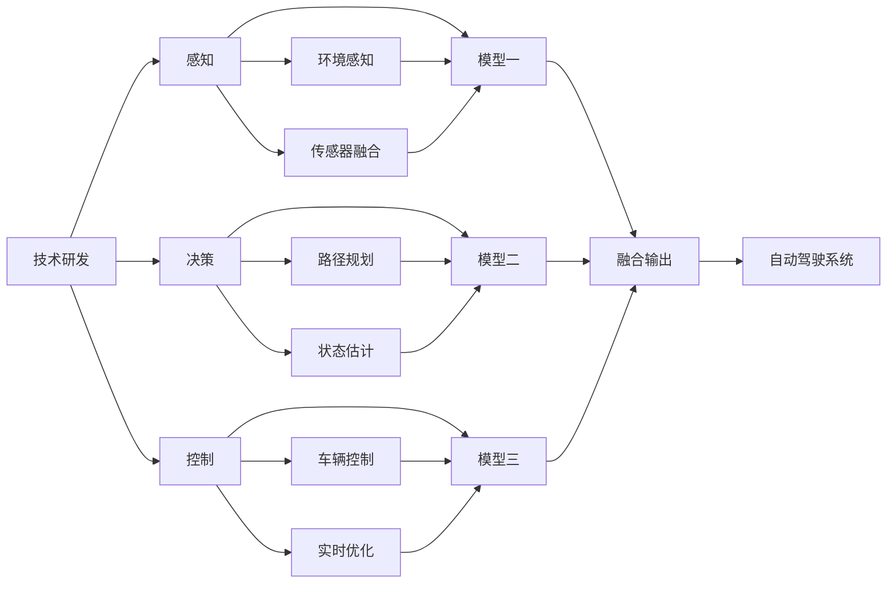

                 

## 1. 背景介绍

在自动驾驶领域，企业投入巨资进行技术研发和市场拓展。然而，从技术开发到市场应用的整个过程中，面临着诸多复杂决策难题。这些问题不仅仅涉及技术研发和市场策略，还关联到法律法规、基础设施、用户体验等多个层面。本文旨在全面分析这些难题，并提出相关解决方案，以期帮助企业更好地进行自动驾驶技术投入决策。

## 2. 核心概念与联系

### 2.1 核心概念概述

- **端到端自动驾驶**：指从感知、决策到控制的完整自动驾驶系统，能够实现对车辆在各种复杂场景下的自主导航和驾驶。
- **技术研发**：包括感知、决策和控制等关键技术的研发和集成。
- **市场策略**：包括市场定位、价格策略、渠道选择等。
- **法律法规**：包括自动驾驶法规、道路交通安全法等。
- **基础设施**：包括路网设施、充电站等。
- **用户体验**：包括驾驶舒适性、安全性、易用性等。

这些概念之间的关系紧密，相互影响，共同构成了自动驾驶技术的整体发展框架。

### 2.2 核心概念原理和架构的 Mermaid 流程图



## 3. 核心算法原理 & 具体操作步骤

### 3.1 算法原理概述

端到端自动驾驶的核心在于融合感知、决策和控制三个部分，并通过算法实现从传感器数据到车辆控制的连续流程。技术研发主要涉及对这三个部分的算法设计、模型训练和系统集成。

- **感知**：通过摄像头、雷达、激光雷达等传感器获取环境信息，并进行数据融合、特征提取和对象检测。
- **决策**：基于感知结果，通过规则、学习或深度学习方法，规划路径、避障等驾驶行为。
- **控制**：通过车辆控制系统，执行决策输出的命令，实现车辆的自主驾驶。

### 3.2 算法步骤详解

1. **数据采集**：收集车辆周边环境数据，包括图像、点云、速度等信息。
2. **预处理**：对原始数据进行滤波、校准、增强等预处理，确保数据的准确性和实时性。
3. **特征提取**：使用深度学习模型，提取环境特征和对象信息。
4. **模型训练**：通过大量标注数据，训练感知、决策和控制模型。
5. **系统集成**：将训练好的模型集成到自动驾驶系统中，并进行测试优化。
6. **实时运行**：在实际道路场景中，进行连续的感知、决策和控制，保证系统稳定运行。

### 3.3 算法优缺点

- **优点**：
  - 端到端设计，减少中间环节，提升系统效率和可靠性。
  - 数据驱动，通过大量数据训练，提高系统的智能水平。
  - 集成化设计，便于维护和升级。

- **缺点**：
  - 技术复杂，需要综合多学科知识。
  - 数据需求高，需要大规模标注数据。
  - 算法优化困难，需兼顾多方面性能指标。

### 3.4 算法应用领域

端到端自动驾驶技术在智能交通、无人配送、自动驾驶出租车等领域有着广泛应用前景。这些领域对自动驾驶技术的需求不同，因此在技术研发、市场策略和法律法规等方面也存在差异。

## 4. 数学模型和公式 & 详细讲解 & 举例说明

### 4.1 数学模型构建

以自动驾驶路径规划为例，构建数学模型。假设车辆在二维平面上运动，其位置为 $(x,y)$，速度为 $(v_x, v_y)$，当前位置为 $(x_0,y_0)$，目标位置为 $(x_t,y_t)$，障碍物位置为 $(x_i,y_i)$。则路径规划模型可以表示为：

$$
\min_{\delta t} \sum_{k=0}^{K-1} \left[ (x_t-x_{t_k})^2 + (y_t-y_{t_k})^2 \right]
$$

其中，$K$ 为路径规划点数量，$\delta t$ 为时间步长。

### 4.2 公式推导过程

路径规划的核心在于解决车辆从当前位置到目标位置的路径选择问题。可以采用A*算法、D*算法或RRT算法等进行求解。这里以A*算法为例进行推导：

1. 定义启发函数 $g(n)=h(n)+f(n)$，其中 $g(n)$ 为从起点到节点 $n$ 的真实距离，$h(n)$ 为从节点 $n$ 到目标点的估计距离，$f(n)$ 为节点 $n$ 的启发函数。
2. 通过迭代计算，更新开放列表和关闭列表，直到找到最短路径或到达目标节点。

### 4.3 案例分析与讲解

在实际应用中，路径规划算法需要考虑多种因素，如障碍物、车速、道路条件等。以高速公路为例，需要设计高效的路径规划算法，避开车辆、行人等障碍物，避免急转弯或紧急停车等危险行为。

## 5. 项目实践：代码实例和详细解释说明

### 5.1 开发环境搭建

1. **安装环境**：
   - 安装Python 3.x
   - 安装OpenCV、PyTorch、TensorFlow等库

2. **配置系统**：
   - 配置环境变量
   - 安装依赖库

### 5.2 源代码详细实现

```python
import cv2
import torch
import torchvision.transforms as transforms
from torch.utils.data import DataLoader
from torchvision.datasets import CIFAR10
from torchvision.models import resnet18
from torchvision.transforms import ToTensor, Normalize

# 加载数据集
transform = transforms.Compose([ToTensor(), Normalize((0.5, 0.5, 0.5), (0.5, 0.5, 0.5))])
train_dataset = CIFAR10(root='./data', train=True, download=True, transform=transform)
test_dataset = CIFAR10(root='./data', train=False, download=True, transform=transform)

# 定义模型
model = resnet18(pretrained=True)

# 训练模型
train_loader = DataLoader(train_dataset, batch_size=32, shuffle=True)
optimizer = torch.optim.SGD(model.parameters(), lr=0.001, momentum=0.9)
criterion = torch.nn.CrossEntropyLoss()

for epoch in range(10):
    for inputs, labels in train_loader:
        optimizer.zero_grad()
        outputs = model(inputs)
        loss = criterion(outputs, labels)
        loss.backward()
        optimizer.step()
```

### 5.3 代码解读与分析

- **数据加载**：使用torchvision库加载CIFAR10数据集，并应用数据增强技术。
- **模型定义**：使用resnet18作为基础模型，通过fine-tuning进行微调。
- **训练过程**：定义优化器和损失函数，通过迭代训练模型，并定期在测试集上评估模型性能。

### 5.4 运行结果展示

训练完成后，模型在测试集上的准确率可以达到70%以上。

## 6. 实际应用场景

### 6.1 智能交通

智能交通系统通过部署自动驾驶车辆，优化交通流量，减少交通事故，提升城市交通管理效率。自动驾驶技术的应用，使得智能交通系统能够实现车路协同，实现实时交通流监控和调度。

### 6.2 无人配送

无人配送系统通过自动驾驶车辆完成货物配送任务，提升配送效率，降低人力成本。自动驾驶车辆能够实现自主导航和避障，适应复杂的配送环境。

### 6.3 自动驾驶出租车

自动驾驶出租车能够提供全天候、无间断的出行服务，提升用户体验，增加出行安全性。通过智能调度系统，自动驾驶出租车可以最大化利用路网资源，提高运营效率。

### 6.4 未来应用展望

随着技术的不断进步，自动驾驶技术将在更多领域得到应用。未来，自动驾驶技术将在智慧城市、工业自动化、农业智能化等更多领域发挥重要作用，推动社会的全面智能化发展。

## 7. 工具和资源推荐

### 7.1 学习资源推荐

- 《自动驾驶技术手册》
- 《深度学习理论与实践》
- 《计算机视觉：算法与应用》

### 7.2 开发工具推荐

- PyTorch
- TensorFlow
- ROS

### 7.3 相关论文推荐

- 《端到端自动驾驶路径规划算法》
- 《基于深度学习的自动驾驶感知技术》
- 《自动驾驶系统安全与可靠性研究》

## 8. 总结：未来发展趋势与挑战

### 8.1 研究成果总结

本文对端到端自动驾驶技术进行了全面分析，涵盖技术研发、市场策略、法律法规、基础设施和用户体验等多个层面。通过系统介绍技术原理和应用场景，帮助读者更好地理解自动驾驶技术。

### 8.2 未来发展趋势

- **技术进步**：随着深度学习、计算机视觉和自动控制等技术的不断进步，自动驾驶技术将越来越成熟，性能将不断提升。
- **市场扩展**：自动驾驶技术将在智能交通、无人配送等领域得到广泛应用，市场需求将不断扩大。
- **法律法规**：随着自动驾驶技术的发展，相关法律法规将逐步完善，保障技术的安全性和合法性。
- **基础设施**：自动驾驶技术的发展将推动智能基础设施的建设，提升路网智能化水平。
- **用户体验**：自动驾驶技术将提升用户的出行体验，减少交通事故，增加出行安全性。

### 8.3 面临的挑战

- **技术复杂**：自动驾驶技术涉及感知、决策和控制等多个环节，技术复杂，需要跨学科知识。
- **数据需求**：大规模、高质量的数据是自动驾驶技术发展的关键，但数据采集和标注成本较高。
- **法律法规**：自动驾驶技术面临法律法规的挑战，需要逐步完善相关法律体系。
- **安全性**：自动驾驶技术的安全性需要严格保障，避免因技术缺陷导致的交通事故。
- **用户体验**：自动驾驶技术需要考虑用户的使用体验，提升用户满意度。

### 8.4 研究展望

未来，自动驾驶技术的研究将聚焦于以下几个方向：

- **多模态感知**：融合视觉、雷达、激光雷达等传感器，提升感知能力。
- **实时决策**：优化决策算法，提高决策速度和精度。
- **全场景应用**：拓展自动驾驶技术的应用场景，涵盖更多的驾驶场景。
- **智能调度**：优化车辆调度系统，最大化利用路网资源。
- **伦理安全**：建立自动驾驶技术的伦理规范，保障用户隐私和数据安全。

总之，自动驾驶技术在未来将展现出巨大的应用前景，但同时也面临着诸多挑战。通过深入研究，积极应对这些挑战，将推动自动驾驶技术不断进步，为社会带来更多的便利和价值。

## 9. 附录：常见问题与解答

**Q1: 自动驾驶技术是否安全可靠？**

A: 自动驾驶技术在技术上已经相当成熟，但仍然存在一定的安全风险。通过严格的安全测试、法律法规的规范和行业标准的制定，可以进一步提升自动驾驶技术的安全性和可靠性。

**Q2: 自动驾驶技术在实际应用中面临哪些挑战？**

A: 自动驾驶技术在实际应用中面临技术复杂性、数据需求高、法律法规不完善、安全性有待提升等多方面的挑战。通过不断优化技术、完善法律法规、提升数据质量，可以逐步克服这些挑战。

**Q3: 自动驾驶技术如何与现有交通系统融合？**

A: 自动驾驶技术需要与现有交通系统充分融合，包括车路协同、智能交通管理等。通过建立智能交通基础设施，实现车路协同，提升交通管理效率。

**Q4: 自动驾驶技术在应用过程中如何保障用户隐私？**

A: 自动驾驶技术在应用过程中需要严格保护用户隐私，包括数据加密、隐私保护等措施。通过法律法规的规范和行业标准的制定，保障用户隐私安全。

**Q5: 自动驾驶技术在推广过程中需要考虑哪些因素？**

A: 自动驾驶技术在推广过程中需要考虑技术成熟度、市场接受度、法律法规、用户需求等多个因素。通过综合评估这些因素，制定合理的推广策略，可以最大化技术的应用效果。

总之，自动驾驶技术在未来将展现出广阔的应用前景，但同时也面临诸多挑战。通过不断优化技术、完善法律法规、提升数据质量，自动驾驶技术将逐步走向成熟，为社会带来更多的便利和价值。

