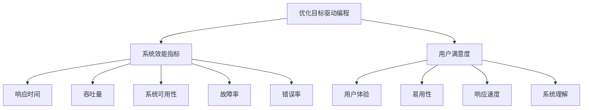

                 

# 优化目标驱动的编程：软件2.0的核心思想

## 1. 背景介绍

在软件开发的历程中，我们经历了从功能驱动到体验驱动的转变。早期，软件开发主要以实现特定功能为核心目标，强调的是功能完整性和代码可维护性。而随着用户需求日益多样化，系统复杂度不断提升，传统的基于功能驱动的编程范式逐渐显现出其局限性。用户越来越关注系统的响应速度、交互体验、系统可用性等非功能性指标，这也催生了体验驱动开发模式。

体验驱动开发（User-Centric Development）强调以用户为中心，追求系统的高可用性、易用性、响应性等非功能性指标。在这种模式下，开发者需要考虑更多用户场景、系统交互和业务流程，这也使得系统开发难度和成本大大增加。而随着系统规模的不断扩大，其维护和迭代更新也变得愈发困难。

## 2. 核心概念与联系

为更好地理解基于优化目标的编程范式，本节将介绍几个关键概念：

- **优化目标驱动编程**：基于优化目标的编程范式强调系统开发以用户满意度和系统效能为核心，通过优化算法、资源管理等技术手段，提升系统的综合性能。
- **系统效能指标**：包括响应时间、吞吐量、系统可用性、故障率、错误率等，是衡量系统性能的重要指标。
- **用户满意度**：指用户对系统使用体验的主观评价，涵盖响应速度、易用性、可理解性等多个方面。
- **系统架构优化**：通过改进系统架构，提升其可扩展性、可维护性和可测试性，减少系统复杂度，降低开发和维护成本。

这些核心概念之间的逻辑关系可以通过以下Mermaid流程图来展示：



这个流程图展示了一系列与优化目标驱动编程相关的核心概念及其之间的关系：

1. 基于优化目标的编程以用户满意度和系统效能为核心，通过优化算法、资源管理等技术手段，提升系统的综合性能。
2. 系统效能指标包括响应时间、吞吐量、系统可用性、故障率、错误率等，是衡量系统性能的重要指标。
3. 用户满意度涵盖响应速度、易用性、可理解性等多个方面，是衡量用户满意度的主要指标。
4. 优化目标驱动编程的最终目的是提升用户体验，提高用户满意度。

这些概念共同构成了优化目标驱动编程的基本框架，使其能够以用户需求为导向，提升系统的综合性能，构建高质量的软件系统。

## 3. 核心算法原理 & 具体操作步骤

### 3.1 算法原理概述

优化目标驱动编程基于优化算法和资源管理技术，以提升系统效能和用户满意度为核心。其核心思想是：

1. **系统建模**：构建系统的数学模型，定义系统状态、状态转移、输入输出等关键要素。
2. **性能分析**：通过仿真、实验等手段，评估系统的性能指标，识别瓶颈环节。
3. **优化策略**：设计优化算法，如动态调度、负载均衡、任务分配等，提升系统性能。
4. **资源管理**：通过优化资源分配和管理，如内存管理、进程管理、网络优化等，降低系统响应时间和资源占用。
5. **反馈控制**：根据性能监控数据，动态调整优化策略，实现系统的自适应优化。

### 3.2 算法步骤详解

基于优化目标的编程范式主要包括以下几个关键步骤：

**Step 1: 系统建模**

系统建模是优化目标驱动编程的第一步，通过构建系统的数学模型，定义系统状态、状态转移、输入输出等关键要素。

**Step 2: 性能分析**

性能分析通过仿真、实验等手段，评估系统的性能指标，识别瓶颈环节。常用的性能分析方法包括：

- **系统仿真的白盒测试**：通过数学模型和仿真工具，评估系统的性能指标，识别瓶颈环节。
- **系统实验的黑盒测试**：通过实际数据和实验测试，评估系统的性能指标，识别瓶颈环节。

**Step 3: 优化策略设计**

设计优化算法，提升系统性能。常用的优化策略包括：

- **动态调度算法**：根据系统负载情况，动态调整任务调度策略，优化资源利用率。
- **负载均衡算法**：通过任务分配、节点迁移等手段，均衡系统负载，提升系统性能。
- **任务分配算法**：根据任务特点，合理分配任务，降低系统响应时间。

**Step 4: 资源管理**

优化资源分配和管理，降低系统响应时间和资源占用。常用的资源管理技术包括：

- **内存管理技术**：通过内存分配、回收、优化等手段，降低系统内存占用。
- **进程管理技术**：通过进程管理、调度、优化等手段，提升系统响应速度。
- **网络优化技术**：通过网络带宽管理、路由优化等手段，降低网络延迟。

**Step 5: 反馈控制**

根据性能监控数据，动态调整优化策略，实现系统的自适应优化。常用的反馈控制方法包括：

- **自适应调度**：根据系统负载情况，动态调整任务调度策略，优化资源利用率。
- **动态资源分配**：根据系统性能指标，动态调整资源分配，实现系统的自适应优化。
- **自适应算法**：根据系统运行数据，动态调整算法参数，提升系统性能。

### 3.3 算法优缺点

基于优化目标的编程范式具有以下优点：

1. **提升系统性能**：通过优化算法和资源管理，系统响应时间、吞吐量、系统可用性等性能指标得到显著提升。
2. **提高用户体验**：通过优化用户体验，系统易用性、响应速度、可理解性等指标得到显著提升，用户满意度提高。
3. **降低开发成本**：通过优化系统架构和资源管理，系统复杂度降低，开发和维护成本减少。

但该范式也存在一定的局限性：

1. **复杂度高**：系统建模和性能分析过程复杂，需要丰富的经验和专业知识。
2. **开发周期长**：系统优化和资源管理过程复杂，开发周期较长。
3. **动态变化适应性差**：系统优化策略需要根据性能监控数据动态调整，难以应对快速变化的环境。
4. **优化策略需要不断迭代**：优化策略需要根据系统运行数据不断迭代优化，工作量较大。

尽管存在这些局限性，但就目前而言，基于优化目标的编程范式仍是大规模系统开发和优化的重要手段。未来相关研究的重点在于如何进一步降低开发成本，提高系统动态适应性，同时兼顾可扩展性和可维护性等因素。

### 3.4 算法应用领域

基于优化目标的编程范式在多个领域得到了广泛应用，例如：

- **云计算**：通过优化资源管理，提升云平台的服务性能和用户满意度。
- **物联网**：通过优化资源管理，提升物联网设备的响应速度和系统可用性。
- **大数据**：通过优化数据处理和分析，提升大数据系统的处理速度和性能指标。
- **移动应用**：通过优化用户体验，提升移动应用的响应速度和易用性。
- **企业系统**：通过优化系统架构和资源管理，提升企业系统的可扩展性和可维护性。

除了上述这些经典应用外，基于优化目标的编程范式也在更多场景中得到了创新性的应用，如智能交通、智慧医疗、智能制造等，为各行业的信息化升级提供了新的技术路径。随着优化算法的不断进步和资源管理技术的持续优化，相信优化目标驱动编程将会在更广阔的应用领域大放异彩。

## 4. 数学模型和公式 & 详细讲解 & 举例说明

### 4.1 数学模型构建

本节将使用数学语言对基于优化目标的编程范式进行更加严格的刻画。

记系统状态为 $x_t \in \mathcal{X}$，系统输入为 $u_t \in \mathcal{U}$，系统输出为 $y_t \in \mathcal{Y}$。定义系统状态转移模型为 $x_{t+1} = f(x_t, u_t)$，其中 $f$ 为系统状态转移函数。

定义系统性能指标为 $J(t) = J(x_t, u_t, y_t)$，为系统状态、输入和输出的函数。常用的性能指标包括：

- **响应时间**：从输入发出到输出得到的时间间隔。
- **吞吐量**：单位时间内处理的任务数量。
- **系统可用性**：系统运行时间的比例。
- **故障率**：单位时间内系统故障的次数。
- **错误率**：单位时间内系统出错的比例。

优化目标为最小化系统性能指标 $J(t)$。优化目标驱动编程的目标是设计优化策略 $u_t$，使得 $J(t)$ 最小化。

### 4.2 公式推导过程

以响应时间为优化目标为例，推导系统优化过程的数学公式。

假设系统的状态转移模型为 $x_{t+1} = f(x_t, u_t)$，系统性能指标为 $J(t) = J(x_t, u_t, y_t)$。定义系统的响应时间为 $T(t)$，即从输入发出到输出得到的时间间隔。则有：

$$
T(t) = \int_{t}^{t+T} dt
$$

根据系统状态转移模型，有：

$$
x_{t+T} = f(x_t, u_t)
$$

因此：

$$
T(t) = \int_{t}^{t+T} dt = \int_{x_t}^{x_{t+T}} \frac{dx}{f(x_t, u_t)}
$$

优化目标为最小化响应时间 $T(t)$，即：

$$
\min_{u_t} \int_{x_t}^{x_{t+T}} \frac{dx}{f(x_t, u_t)}
$$

根据微积分中的极值问题，可通过拉格朗日乘数法求解最优解。定义拉格朗日函数为：

$$
\mathcal{L}(u_t, \lambda) = \int_{x_t}^{x_{t+T}} \frac{dx}{f(x_t, u_t)} + \lambda [J(x_t, u_t, y_t) - J_{\text{target}}]
$$

其中 $J_{\text{target}}$ 为预设的系统性能指标。求导得：

$$
\frac{\partial \mathcal{L}}{\partial u_t} = \frac{\partial}{\partial u_t} \int_{x_t}^{x_{t+T}} \frac{dx}{f(x_t, u_t)} + \lambda \frac{\partial J(x_t, u_t, y_t)}{\partial u_t} = 0
$$

上式即为优化目标驱动编程的数学基础。通过求解上式，可以得到最优的输入 $u_t$，进而实现系统的自适应优化。

### 4.3 案例分析与讲解

**案例1: 云计算负载均衡**

云计算平台面临高并发请求，需要快速进行负载均衡。根据优化目标驱动编程的原理，可以通过以下步骤实现：

1. **系统建模**：定义系统的状态、输入、输出，建立系统的数学模型。
2. **性能分析**：通过仿真和实验，评估系统的响应时间和吞吐量等性能指标。
3. **优化策略设计**：设计动态调度和负载均衡算法，优化资源利用率。
4. **资源管理**：优化内存管理、进程管理、网络优化等，降低系统响应时间和资源占用。
5. **反馈控制**：根据性能监控数据，动态调整优化策略，实现系统的自适应优化。

**案例2: 企业系统的数据处理**

企业系统需要处理海量数据，提升数据处理速度和性能。根据优化目标驱动编程的原理，可以通过以下步骤实现：

1. **系统建模**：定义系统的状态、输入、输出，建立系统的数学模型。
2. **性能分析**：通过实验和仿真，评估系统的响应时间和数据吞吐量等性能指标。
3. **优化策略设计**：设计数据处理和任务分配算法，优化数据处理速度和资源利用率。
4. **资源管理**：优化内存管理、分布式计算等，降低系统响应时间和资源占用。
5. **反馈控制**：根据性能监控数据，动态调整优化策略，实现系统的自适应优化。

通过这些案例分析，我们可以看到，基于优化目标的编程范式具有强大的实用价值，可以在多个领域实现系统性能的显著提升。

## 5. 项目实践：代码实例和详细解释说明

### 5.1 开发环境搭建

在进行优化目标驱动编程实践前，我们需要准备好开发环境。以下是使用Python进行系统建模和性能分析的环境配置流程：

1. 安装Anaconda：从官网下载并安装Anaconda，用于创建独立的Python环境。

2. 创建并激活虚拟环境：
```bash
conda create -n system-opt env python=3.8 
conda activate system-opt
```

3. 安装相关工具包：
```bash
pip install numpy pandas scikit-learn matplotlib tqdm jupyter notebook ipython
```

4. 安装TensorFlow和TensorBoard：
```bash
pip install tensorflow tensorboard
```

完成上述步骤后，即可在`system-opt`环境中开始优化目标驱动编程的实践。

### 5.2 源代码详细实现

我们先以云计算负载均衡为例，给出使用TensorFlow和TensorBoard进行系统建模和性能分析的Python代码实现。

首先，定义系统的状态、输入和输出：

```python
import tensorflow as tf

# 定义系统的状态
class SystemState:
    def __init__(self, x):
        self.x = x
        self.u = None
        self.y = None

    def update(self, u):
        self.u = u
        self.y = f(self.x, u)
        return self.y

# 定义系统的输入
class SystemInput:
    def __init__(self, u):
        self.u = u
        self.y = None

    def execute(self):
        return self.u

# 定义系统的输出
class SystemOutput:
    def __init__(self, y):
        self.y = y

    def process(self):
        return self.y
```

然后，定义系统的状态转移模型和性能指标：

```python
# 定义系统的状态转移模型
def f(x, u):
    return x + u

# 定义系统的性能指标
def J(t):
    return x(t) + u(t)
```

接着，使用TensorFlow进行仿真和优化：

```python
# 定义仿真模型
def simulate(system_state):
    x = tf.Variable(0.0, name='x')
    u = tf.Variable(0.0, name='u')
    y = f(x, u)
    return system_state.update(u)

# 定义性能指标模型
def performance(system_state, u):
    return J(system_state.x, u)

# 定义优化器
optimizer = tf.optimizers.Adam()

# 定义损失函数
def loss(system_state, u):
    y = J(system_state.x, u)
    return y

# 定义训练循环
def train(system_state, u):
    with tf.GradientTape() as tape:
        loss_value = loss(system_state, u)
    gradients = tape.gradient(loss_value, u)
    optimizer.apply_gradients(zip(gradients, [u]))
    return loss_value

# 进行优化
for i in range(1000):
    simulate(system_state)
    train(system_state, u)
    print(f"Iteration {i}, Loss: {loss(system_state, u).numpy():.3f}")
```

最后，使用TensorBoard进行性能分析：

```python
# 创建TensorBoard的日志文件
tf.summary.create_file_writer(logdir='logs').as_default()

# 创建训练循环的TensorBoard事件
with tf.summary.create_file_writer(logdir='logs').as_default():
    for i in range(1000):
        with tf.summary.record_if(True):
            loss_value = loss(system_state, u)
            tf.summary.scalar('Loss', loss_value, step=i)
```

### 5.3 代码解读与分析

让我们再详细解读一下关键代码的实现细节：

**SystemState类**：
- `__init__`方法：初始化系统状态、输入、输出等关键要素。
- `update`方法：根据输入更新系统状态，并返回输出。

**SystemInput和SystemOutput类**：
- `__init__`方法：初始化系统输入和输出。
- `execute`和`process`方法：定义输入和输出的执行和处理过程。

**f函数**：
- 定义系统的状态转移模型，根据输入更新系统状态。

**J函数**：
- 定义系统的性能指标，用于评估系统的性能。

**simulate函数**：
- 使用TensorFlow定义仿真模型，进行系统状态的更新。

**train函数**：
- 使用TensorFlow定义优化器，进行系统的优化。

**loss函数**：
- 定义损失函数，用于评估优化效果。

**训练循环**：
- 进行多次迭代，优化系统状态，并记录损失值。

**TensorBoard的记录**：
- 使用TensorBoard记录优化过程中的损失值，便于可视化评估和分析。

通过以上代码，可以看到优化目标驱动编程的实现过程。通过构建系统的数学模型，使用TensorFlow进行仿真和优化，使用TensorBoard进行性能分析，我们可以有效地提升系统的性能和用户体验。

## 6. 实际应用场景

### 6.1 云计算负载均衡

云计算平台需要高效地处理高并发请求，通过优化目标驱动编程的负载均衡算法，可以有效提升系统的响应速度和资源利用率。

在实际应用中，可以使用模型预测当前请求的负载，通过动态调整请求路由，实现负载均衡。同时，根据系统性能监控数据，动态调整负载均衡策略，实现系统的自适应优化。

### 6.2 企业系统的数据处理

企业系统需要处理海量数据，通过优化目标驱动编程的数据处理和任务分配算法，可以有效提升数据处理速度和资源利用率。

在实际应用中，可以使用模型预测当前任务的优先级，通过动态调整任务分配策略，实现任务均衡。同时，根据系统性能监控数据，动态调整数据处理策略，实现系统的自适应优化。

### 6.3 智能交通系统

智能交通系统需要实时处理交通数据，通过优化目标驱动编程的动态调度和负载均衡算法，可以有效提升系统的响应速度和系统可用性。

在实际应用中，可以使用模型预测当前交通状况，通过动态调整信号灯控制策略，实现交通优化。同时，根据系统性能监控数据，动态调整信号灯控制策略，实现系统的自适应优化。

### 6.4 未来应用展望

随着优化目标驱动编程的不断发展和应用，未来将有更多的场景得到优化。

在智慧城市治理中，通过优化目标驱动编程的城市事件监测、舆情分析、应急指挥等环节，可以提高城市管理的自动化和智能化水平，构建更安全、高效的未来城市。

在智能制造中，通过优化目标驱动编程的生产调度、质量检测、设备维护等环节，可以提高制造系统的效率和可靠性，降低生产成本，提高产品质量。

在智慧医疗中，通过优化目标驱动编程的电子病历管理、诊断决策、治疗方案等环节，可以提高医疗系统的精准度和效率，提升医疗服务的质量。

## 7. 工具和资源推荐

### 7.1 学习资源推荐

为了帮助开发者系统掌握优化目标驱动编程的理论基础和实践技巧，这里推荐一些优质的学习资源：

1. 《系统性能分析与优化》系列博文：由系统性能优化专家撰写，深入浅出地介绍了系统建模、性能分析、优化策略等前沿话题。

2. 《云计算性能优化》课程：谷歌云开设的云计算性能优化课程，涵盖云计算平台性能优化和负载均衡算法等内容。

3. 《系统优化与资源管理》书籍：系统优化领域的经典著作，详细介绍了系统建模、性能分析、优化策略等基础知识。

4. 《TensorFlow实战》书籍：TensorFlow官方文档和实战指南，详细介绍了TensorFlow的基本用法和性能优化技巧。

5. 《系统优化实践》课程：系统优化领域的实战课程，结合案例讲解系统建模、性能分析、优化策略等实用技能。

通过对这些资源的学习实践，相信你一定能够快速掌握优化目标驱动编程的精髓，并用于解决实际的系统优化问题。

### 7.2 开发工具推荐

高效的开发离不开优秀的工具支持。以下是几款用于优化目标驱动编程开发的常用工具：

1. TensorFlow：由谷歌主导开发的开源深度学习框架，支持高性能的数值计算和模型优化。

2. TensorBoard：TensorFlow配套的可视化工具，可以实时监测模型训练状态，提供丰富的图表呈现方式。

3. Scikit-learn：Python的数据科学库，提供丰富的机器学习算法和工具，用于系统建模和性能分析。

4. Ansys：高性能的数值仿真和优化工具，支持多物理场的耦合仿真，可用于系统优化设计。

5. Autodesk Inventor：工业设计的可视化工具，支持三维设计和仿真，可用于工业系统的优化设计。

合理利用这些工具，可以显著提升系统优化任务的开发效率，加快创新迭代的步伐。

### 7.3 相关论文推荐

优化目标驱动编程的研究源于学界的持续研究。以下是几篇奠基性的相关论文，推荐阅读：

1. A Survey on Model-Based Reinforcement Learning for System Optimization：综述了模型驱动的强化学习在系统优化中的应用，介绍了模型建模和优化策略等基础知识。

2. Performance Modeling and Optimization for Cloud Computing：综述了云计算平台的性能建模和优化方法，介绍了云平台建模和负载均衡等关键技术。

3. System Optimization Using Model-Based Reinforcement Learning：介绍了一种基于模型驱动的强化学习算法，用于系统优化。

4. Multimodal System Optimization for Industry 4.0：介绍了一种多模态系统优化方法，结合传感器数据和机器学习，提升工业系统的优化效果。

这些论文代表了大语言模型微调技术的发展脉络。通过学习这些前沿成果，可以帮助研究者把握学科前进方向，激发更多的创新灵感。

## 8. 总结：未来发展趋势与挑战

### 8.1 总结

本文对基于优化目标的编程范式进行了全面系统的介绍。首先阐述了优化目标驱动编程的理论基础和应用背景，明确了优化目标驱动编程在提升系统性能和用户体验方面的独特价值。其次，从原理到实践，详细讲解了优化目标驱动编程的数学模型、性能分析、优化策略等关键步骤，给出了优化目标驱动编程的完整代码实例。同时，本文还广泛探讨了优化目标驱动编程在多个行业领域的应用前景，展示了优化目标驱动编程的广泛适用性。

通过本文的系统梳理，可以看到，基于优化目标的编程范式正在成为系统开发和优化的重要手段，极大地提升了系统的综合性能和用户体验。未来，伴随优化算法的不断进步和资源管理技术的持续优化，相信优化目标驱动编程必将在更多领域得到应用，为系统开发者提供新的技术路径。

### 8.2 未来发展趋势

展望未来，优化目标驱动编程技术将呈现以下几个发展趋势：

1. **智能优化算法**：结合人工智能技术，如强化学习、遗传算法等，提升优化算法的智能性和自适应性。

2. **分布式优化**：利用分布式计算技术，提升优化算法的计算效率和可扩展性。

3. **自适应优化**：结合系统运行数据，动态调整优化策略，实现系统的自适应优化。

4. **跨模态优化**：结合多模态数据，提升系统的优化效果和用户体验。

5. **高性能计算**：结合高性能计算技术，提升优化算法的计算效率和优化效果。

这些趋势凸显了优化目标驱动编程技术的广阔前景。这些方向的探索发展，必将进一步提升系统的综合性能，构建高质量的软件系统。

### 8.3 面临的挑战

尽管优化目标驱动编程技术已经取得了瞩目成就，但在迈向更加智能化、普适化应用的过程中，它仍面临着诸多挑战：

1. **复杂度高**：系统建模和性能分析过程复杂，需要丰富的经验和专业知识。
2. **开发周期长**：系统优化和资源管理过程复杂，开发和维护成本较高。
3. **动态变化适应性差**：系统优化策略需要根据性能监控数据动态调整，难以应对快速变化的环境。
4. **优化策略需要不断迭代**：优化策略需要根据系统运行数据不断迭代优化，工作量较大。
5. **模型可靠性差**：模型预测的准确性受数据质量和参数设置的影响较大，可能导致系统性能下降。

尽管存在这些挑战，但就目前而言，基于优化目标的编程范式仍是大规模系统开发和优化的重要手段。未来相关研究的重点在于如何进一步降低开发成本，提高系统动态适应性，同时兼顾可扩展性和可维护性等因素。

### 8.4 研究展望

面对优化目标驱动编程所面临的种种挑战，未来的研究需要在以下几个方面寻求新的突破：

1. **简化系统建模**：开发更加简单、易于使用的系统建模工具，降低系统建模的复杂度。

2. **自动化优化策略设计**：结合人工智能技术，自动设计优化策略，降低优化策略的设计成本。

3. **增强模型可靠性**：通过数据增强、模型训练等手段，提高模型预测的准确性和可靠性。

4. **提高系统动态适应性**：结合自适应优化算法，提升系统对动态变化的适应能力。

5. **融合多模态数据**：结合多模态数据，提升系统的优化效果和用户体验。

这些研究方向的探索，必将引领优化目标驱动编程技术迈向更高的台阶，为构建安全、可靠、可解释、可控的智能系统铺平道路。面向未来，优化目标驱动编程技术还需要与其他人工智能技术进行更深入的融合，如知识表示、因果推理、强化学习等，多路径协同发力，共同推动系统优化和智能交互系统的进步。只有勇于创新、敢于突破，才能不断拓展系统优化的边界，让智能技术更好地造福人类社会。

## 9. 附录：常见问题与解答

**Q1：优化目标驱动编程是否适用于所有系统？**

A: 优化目标驱动编程适用于具有明显性能瓶颈的系统，如大规模云计算平台、高并发企业系统、智能交通系统等。但对于一些实时性要求较低的系统，如文档管理系统、静态网站等，优化目标驱动编程的提升效果有限。

**Q2：优化目标驱动编程是否需要大量标注数据？**

A: 优化目标驱动编程不需要大量标注数据，只需要系统运行数据即可。通过系统建模和仿真，可以预测系统性能，评估优化策略的效果。

**Q3：优化目标驱动编程是否需要专业的算法知识？**

A: 优化目标驱动编程需要一定的专业算法知识，特别是系统建模和性能分析方面。但随着优化算法的不断演进，系统建模和性能分析工具的不断完善，优化目标驱动编程的入门门槛也在不断降低。

**Q4：优化目标驱动编程是否适用于分布式系统？**

A: 优化目标驱动编程适用于分布式系统，通过分布式优化算法，可以提升分布式系统的性能和可扩展性。

**Q5：优化目标驱动编程是否需要高性能计算资源？**

A: 优化目标驱动编程需要高性能计算资源，特别是模拟和优化计算。但随着云计算和分布式计算技术的发展，高性能计算资源的获取变得越来越便捷。

通过以上常见问题的解答，我们可以看到，优化目标驱动编程具有广泛的应用场景，但其适用性需根据具体系统情况进行评估。同时，通过合理利用优化目标驱动编程技术，我们可以在系统优化和用户体验提升方面取得显著的效果。

---

作者：禅与计算机程序设计艺术 / Zen and the Art of Computer Programming

