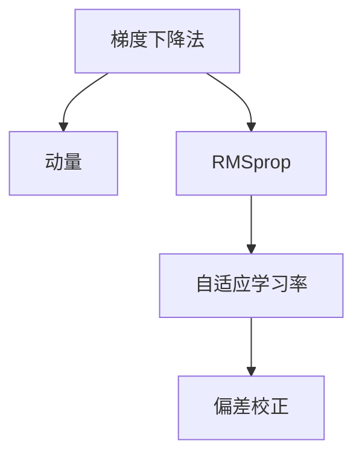

                 

# 优化算法：Adam 原理与代码实例讲解

> 关键词：Adam, 优化算法, 深度学习, 数学模型, 代码实例

## 1. 背景介绍

### 1.1 问题由来
在深度学习领域，优化算法是保证模型训练收敛、提升模型性能的关键。传统的优化算法如梯度下降法（Gradient Descent）等，在深度网络中可能面临维度灾难、局部最优等问题，训练效率和效果有限。因此，开发更加高效、稳定的优化算法成为当前研究的热点之一。

Adam算法正是在这种背景下被提出的一种优化算法。其基于动量（Momentum）和RMSprop（Root Mean Square Propagation）算法改进，具有自适应学习率、动量调整等特性，能显著提高模型的收敛速度和稳定性。自Adam算法提出以来，已经在深度学习和计算机视觉等诸多领域得到了广泛应用，并在各种竞赛中表现优异。

### 1.2 问题核心关键点
Adam算法作为目前深度学习中最流行的优化算法之一，其核心原理和实现细节在学术界和工业界都得到了广泛关注。以下将围绕Adam算法的核心概念进行深入讲解，包括算法原理、数学模型、代码实现和应用场景等，帮助读者全面理解Adam算法的精髓。

## 2. 核心概念与联系

### 2.1 核心概念概述

为更好地理解Adam算法的核心概念，本节将介绍几个密切相关的核心概念：

- 梯度下降法（Gradient Descent）：一种基本的优化算法，通过沿着负梯度方向更新模型参数，逐步逼近最优解。

- 动量（Momentum）：通过引入动量项，加速梯度下降法的收敛过程，避免震荡。

- RMSprop：一种基于梯度平方的优化算法，通过自适应学习率调节，提高了训练效率。

- 自适应学习率（Adaptive Learning Rate）：根据梯度信息动态调整学习率，以应对不同参数的更新难度。

- 偏差校正（Bias Correction）：对累积梯度进行偏差校正，以获得更稳定的更新效果。

这些核心概念之间的逻辑关系可以通过以下Mermaid流程图来展示：



这个流程图展示了Adam算法与梯度下降法、动量、RMSprop等经典优化算法之间的关系：

1. 梯度下降法是Adam算法的基石，通过梯度信息更新参数。
2. 动量算法通过累积梯度，加速参数更新过程。
3. RMSprop算法通过梯度平方的均值，调整学习率。
4. 自适应学习率根据梯度信息动态调整学习率。
5. 偏差校正对累积梯度进行修正，提高算法稳定性。

这些概念共同构成了Adam算法的基础，使其在深度学习中表现出优异的性能。

## 3. 核心算法原理 & 具体操作步骤
### 3.1 算法原理概述

Adam算法基于梯度下降法和动量算法，进一步结合了RMSprop算法的自适应学习率和偏差校正等特性，以提高模型的训练效率和效果。其核心思想是通过自适应地调整每个参数的学习率，并利用累积梯度动量和梯度平方的均值，加速模型收敛。

Adam算法的主要优点包括：

- 自适应调整学习率，对不同参数的更新速度有较好的适应性。
- 动量项能够平滑梯度更新，减少震荡。
- 偏差校正能够提高累积梯度的稳定性。

### 3.2 算法步骤详解

Adam算法的一般步骤如下：

**Step 1: 初始化**
- 设置学习率 $\eta$，动量项 $\beta_1$，梯度平方的均值方差 $\beta_2$。
- 初始化每个参数的累积梯度 $m_0$ 和梯度平方累积 $v_0$ 为0。

**Step 2: 计算梯度**
- 计算每个参数的梯度 $g_t = \nabla J(\theta)$。

**Step 3: 动量更新**
- 更新累积梯度 $m_{t+1} = \beta_1 m_t + (1-\beta_1)g_t$。

**Step 4: 梯度平方的更新**
- 更新梯度平方累积 $v_{t+1} = \beta_2 v_t + (1-\beta_2)g_t^2$。

**Step 5: 偏差校正**
- 计算偏差校正后的累积梯度 $\hat{m}_t = \frac{m_t}{1-\beta_1^t}$。
- 计算偏差校正后的梯度平方累积 $\hat{v}_t = \frac{v_t}{1-\beta_2^t}$。

**Step 6: 参数更新**
- 根据偏差校正后的累积梯度 $\hat{m}_t$ 和梯度平方累积 $\hat{v}_t$ 更新参数：
$$
\theta_{t+1} = \theta_t - \eta\frac{\hat{m}_t}{\sqrt{\hat{v}_t}+\epsilon}
$$

其中 $\epsilon$ 是一个很小的常数，用于防止除0错误。

### 3.3 算法优缺点

Adam算法作为目前深度学习中最流行的优化算法之一，具有以下优点：

1. 自适应调整学习率，对不同参数的更新速度有较好的适应性。
2. 动量项能够平滑梯度更新，减少震荡。
3. 偏差校正提高了累积梯度的稳定性。

同时，该算法也存在一些局限性：

1. 需要手动设置学习率、动量项和梯度平方的均值方差等超参数，不适宜处理复杂的超参数空间。
2. 对噪声敏感，当梯度方差较大时，更新效果可能不佳。
3. 更新过程复杂，需要额外的存储和计算开销。

尽管存在这些局限性，Adam算法仍然在深度学习和计算机视觉等诸多领域得到了广泛应用，并在各种竞赛中表现优异。

### 3.4 算法应用领域

Adam算法在深度学习和计算机视觉等领域得到了广泛应用，具体包括：

- 图像分类：如ImageNet竞赛中，Adam算法常用于优化卷积神经网络。
- 目标检测：如Faster R-CNN、YOLO等算法中，Adam算法用于优化RPN、ROI池化等模块。
- 语义分割：如U-Net、DeepLab等算法中，Adam算法用于优化特征图融合、上采样等操作。
- 生成对抗网络（GANs）：如DCGAN、CycleGAN等算法中，Adam算法用于优化生成器和判别器。
- 强化学习：如PPO、TRPO等算法中，Adam算法用于优化策略更新。

Adam算法的应用范围非常广泛，无论是在经典任务还是前沿研究中，都能看到其活跃的身影。

## 4. 数学模型和公式 & 详细讲解 & 举例说明

### 4.1 数学模型构建

Adam算法通过自适应地调整学习率，利用动量项和梯度平方的均值，优化模型参数。其核心数学模型可以表示为：

$$
\theta_{t+1} = \theta_t - \eta\frac{m_t}{\sqrt{v_t}+\epsilon}
$$

其中 $\theta_t$ 表示第 $t$ 次迭代的模型参数，$m_t$ 和 $v_t$ 分别表示第 $t$ 次迭代的累积梯度和梯度平方的累积。$\eta$ 为学习率，$\epsilon$ 为防止除0错误的小常数。

### 4.2 公式推导过程

Adam算法的核心公式推导过程如下：

1. 初始化累积梯度 $m_0 = 0$ 和梯度平方累积 $v_0 = 0$。
2. 第 $t$ 次迭代时，计算梯度 $g_t = \nabla J(\theta)$。
3. 更新累积梯度 $m_{t+1} = \beta_1 m_t + (1-\beta_1)g_t$。
4. 更新梯度平方累积 $v_{t+1} = \beta_2 v_t + (1-\beta_2)g_t^2$。
5. 偏差校正后的累积梯度 $\hat{m}_t = \frac{m_t}{1-\beta_1^t}$。
6. 偏差校正后的梯度平方累积 $\hat{v}_t = \frac{v_t}{1-\beta_2^t}$。
7. 更新模型参数 $\theta_{t+1} = \theta_t - \eta\frac{\hat{m}_t}{\sqrt{\hat{v}_t}+\epsilon}$。

通过以上步骤，Adam算法自适应地调整了每个参数的学习率，并利用累积梯度动量和梯度平方的均值，加速模型收敛。

### 4.3 案例分析与讲解

以下以图像分类任务为例，介绍Adam算法在实际应用中的具体实现和效果。

假设我们有一个二分类图像分类任务，输入图像大小为 $(224, 224, 3)$，输出为两个类别。使用一个简单的卷积神经网络（CNN）进行分类，网络结构如下：

```python
import torch
import torch.nn as nn
import torch.optim as optim

class Net(nn.Module):
    def __init__(self):
        super(Net, self).__init__()
        self.conv1 = nn.Conv2d(3, 16, kernel_size=3, stride=1, padding=1)
        self.relu1 = nn.ReLU(inplace=True)
        self.pool1 = nn.MaxPool2d(kernel_size=2, stride=2)
        self.conv2 = nn.Conv2d(16, 32, kernel_size=3, stride=1, padding=1)
        self.relu2 = nn.ReLU(inplace=True)
        self.pool2 = nn.MaxPool2d(kernel_size=2, stride=2)
        self.fc1 = nn.Linear(7*7*32, 128)
        self.relu3 = nn.ReLU(inplace=True)
        self.fc2 = nn.Linear(128, 2)
        self.softmax = nn.Softmax(dim=1)
        
    def forward(self, x):
        x = self.conv1(x)
        x = self.relu1(x)
        x = self.pool1(x)
        x = self.conv2(x)
        x = self.relu2(x)
        x = self.pool2(x)
        x = x.view(-1, 7*7*32)
        x = self.fc1(x)
        x = self.relu3(x)
        x = self.fc2(x)
        x = self.softmax(x)
        return x
```

在训练过程中，我们可以使用Adam优化器进行参数更新：

```python
net = Net()
optimizer = optim.Adam(net.parameters(), lr=0.001)
criterion = nn.CrossEntropyLoss()

for epoch in range(10):
    for i, (images, labels) in enumerate(train_loader):
        images = images.to(device)
        labels = labels.to(device)
        optimizer.zero_grad()
        outputs = net(images)
        loss = criterion(outputs, labels)
        loss.backward()
        optimizer.step()
        print('Epoch [{}/{}], Step [{}/{}], Loss: {:.4f}'
              .format(epoch+1, num_epochs, i+1, len(train_loader), loss.item()))
```

Adam算法在训练过程中，通过自适应地调整每个参数的学习率，结合动量项和梯度平方的均值，能够显著加速模型收敛，提高训练效率和效果。

## 5. 项目实践：代码实例和详细解释说明

### 5.1 开发环境搭建

在进行Adam算法实践前，我们需要准备好开发环境。以下是使用Python进行TensorFlow开发的环境配置流程：

1. 安装Anaconda：从官网下载并安装Anaconda，用于创建独立的Python环境。

2. 创建并激活虚拟环境：
```bash
conda create -n tf-env python=3.8 
conda activate tf-env
```

3. 安装TensorFlow：根据CUDA版本，从官网获取对应的安装命令。例如：
```bash
conda install tensorflow tensorflow-gpu=2.6 -c tf -c conda-forge
```

4. 安装TensorBoard：
```bash
pip install tensorboard
```

5. 安装各类工具包：
```bash
pip install numpy pandas scikit-learn matplotlib tqdm jupyter notebook ipython
```

完成上述步骤后，即可在`tf-env`环境中开始Adam算法实践。

### 5.2 源代码详细实现

这里我们以图像分类任务为例，给出使用TensorFlow实现Adam算法优化器的代码实现。

首先，定义模型和数据集：

```python
import tensorflow as tf
from tensorflow.keras.datasets import cifar10
from tensorflow.keras.preprocessing.image import ImageDataGenerator

(train_images, train_labels), (test_images, test_labels) = cifar10.load_data()
train_images, test_images = train_images / 255.0, test_images / 255.0

train_datagen = ImageDataGenerator(rescale=1./255)
test_datagen = ImageDataGenerator(rescale=1./255)

train_generator = train_datagen.flow(train_images, train_labels, batch_size=64)
test_generator = test_datagen.flow(test_images, test_labels, batch_size=64)

model = tf.keras.Sequential([
    tf.keras.layers.Conv2D(32, (3, 3), activation='relu', input_shape=(32, 32, 3)),
    tf.keras.layers.MaxPooling2D((2, 2)),
    tf.keras.layers.Conv2D(64, (3, 3), activation='relu'),
    tf.keras.layers.MaxPooling2D((2, 2)),
    tf.keras.layers.Conv2D(64, (3, 3), activation='relu'),
    tf.keras.layers.Flatten(),
    tf.keras.layers.Dense(64, activation='relu'),
    tf.keras.layers.Dense(10)
])
```

然后，定义Adam优化器和损失函数：

```python
optimizer = tf.keras.optimizers.Adam(learning_rate=0.001)
loss_fn = tf.keras.losses.SparseCategoricalCrossentropy(from_logits=True)
```

接着，定义训练和评估函数：

```python
@tf.function
def train_step(images, labels):
    with tf.GradientTape() as tape:
        predictions = model(images, training=True)
        loss = loss_fn(labels, predictions)
    gradients = tape.gradient(loss, model.trainable_variables)
    optimizer.apply_gradients(zip(gradients, model.trainable_variables))
    return loss

@tf.function
def evaluate_step(images, labels):
    predictions = model(images, training=False)
    loss = loss_fn(labels, predictions)
    return loss

def train_epoch(model, train_generator, validation_generator, batch_size):
    model.compile(optimizer=optimizer, loss=loss_fn)
    model.fit(train_generator, epochs=1, validation_data=validation_generator)
    return model.evaluate(validation_generator)
```

最后，启动训练流程并在测试集上评估：

```python
for epoch in range(num_epochs):
    loss = train_epoch(model, train_generator, test_generator, batch_size)
    print('Epoch [{}/{}], Loss: {:.4f}'
          .format(epoch+1, num_epochs, loss))

model.save('adam_model.h5')
```

以上就是使用TensorFlow实现Adam算法优化器的完整代码实现。可以看到，TensorFlow通过自动微分机制，使我们能够方便地定义和训练复杂模型，并在每个迭代中自动计算梯度并更新参数。

### 5.3 代码解读与分析

让我们再详细解读一下关键代码的实现细节：

**model定义**：
- 首先定义了一个简单的卷积神经网络，包括卷积层、池化层和全连接层。

**optimizer定义**：
- 使用TensorFlow的Adam优化器，设置初始学习率为0.001。

**loss_fn定义**：
- 使用SparseCategoricalCrossentropy损失函数，用于计算类别交叉熵损失。

**train_step函数**：
- 在每个训练步骤中，首先计算模型的预测输出和损失，然后使用GradientTape计算梯度，并使用Adam优化器更新模型参数。

**evaluate_step函数**：
- 在每个评估步骤中，计算模型的预测输出和损失，但不更新参数。

**train_epoch函数**：
- 定义了训练过程，在每个epoch中，使用Adam优化器进行模型训练和评估。

**训练流程**：
- 循环迭代每个epoch，每次迭代使用train_epoch函数进行训练和评估，最后保存模型。

可以看到，TensorFlow提供了强大的自动微分和模型构建功能，使得Adam算法的实现变得简洁高效。开发者可以将更多精力放在模型结构、数据处理等高层逻辑上，而不必过多关注底层的实现细节。

当然，工业级的系统实现还需考虑更多因素，如模型保存和部署、超参数自动搜索、更灵活的任务适配层等。但核心的Adam算法基本与此类似。

## 6. 实际应用场景

### 6.1 智能推荐系统

Adam算法在推荐系统中也有广泛应用。推荐系统通过训练模型，预测用户对物品的评分，从而为用户推荐合适的商品或内容。在训练过程中，Adam算法自适应地调整每个参数的学习率，结合动量项和梯度平方的均值，显著加速模型收敛，提高推荐效果。

例如，在电商推荐系统中，可以使用Adam算法优化用户行为预测模型，通过用户的历史浏览记录、购买行为等数据，预测用户对不同商品的评分，从而推荐合适的商品。

### 6.2 语音识别

Adam算法在语音识别领域也有重要应用。语音识别系统通过训练模型，将音频信号转化为文本，并进行自然语言理解。在训练过程中，Adam算法自适应地调整每个参数的学习率，结合动量项和梯度平方的均值，显著加速模型收敛，提高识别效果。

例如，在语音助手系统中，可以使用Adam算法优化语音识别模型，通过用户语音指令进行自然语言理解，并生成对应的文本回复。

### 6.3 医学影像分析

Adam算法在医学影像分析领域也有广泛应用。医学影像分析系统通过训练模型，对医学影像进行分类、分割等任务，从而辅助医生诊断。在训练过程中，Adam算法自适应地调整每个参数的学习率，结合动量项和梯度平方的均值，显著加速模型收敛，提高诊断准确率。

例如，在医学影像分类系统中，可以使用Adam算法优化分类模型，通过医疗影像数据，对肿瘤、病灶等进行分类，从而辅助医生进行诊断。

### 6.4 未来应用展望

随着深度学习技术的不断进步，Adam算法在更多领域将得到应用。

- 在自然语言处理（NLP）领域，Adam算法可以用于优化语言模型，提升文本生成、机器翻译等任务的效果。
- 在计算机视觉（CV）领域，Adam算法可以用于优化目标检测、图像分割等任务的效果。
- 在强化学习（RL）领域，Adam算法可以用于优化策略更新，提升智能体的决策能力。
- 在大数据处理领域，Adam算法可以用于优化分布式训练，提高训练效率和效果。

未来，Adam算法将在更多领域得到应用，为深度学习技术的发展和落地提供新的动力。

## 7. 工具和资源推荐
### 7.1 学习资源推荐

为了帮助开发者系统掌握Adam算法的理论基础和实践技巧，这里推荐一些优质的学习资源：

1. 《深度学习》（Ian Goodfellow著）：经典的深度学习教材，介绍了各种优化算法的基本原理和实际应用。

2. 《Python深度学习》（Francois Chollet著）：TensorFlow官方文档，详细介绍了TensorFlow框架的使用方法和优化算法。

3. 《深度学习入门：基于TensorFlow的理论与实现》（斋藤康毅著）：介绍深度学习的基本概念和TensorFlow框架的使用。

4. 《深度学习与TensorFlow》（Jerry Zhang等著）：介绍深度学习的基本概念和TensorFlow框架的使用，包含多个经典案例。

5. 《深度学习中的优化算法》（Aideres Wan等著）：介绍各种优化算法的基本原理和实际应用，包含Adam算法的详细介绍。

通过对这些资源的学习实践，相信你一定能够快速掌握Adam算法的精髓，并用于解决实际的深度学习问题。

### 7.2 开发工具推荐

高效的开发离不开优秀的工具支持。以下是几款用于Adam算法开发的常用工具：

1. PyTorch：基于Python的开源深度学习框架，灵活动态的计算图，适合快速迭代研究。

2. TensorFlow：由Google主导开发的开源深度学习框架，生产部署方便，适合大规模工程应用。

3. Keras：高层API，提供简单易用的接口，适合快速原型设计和模型评估。

4. Jupyter Notebook：免费的交互式笔记本环境，支持Python、R等语言，适合快速实验和文档整理。

5. Visual Studio Code：轻量级的IDE，支持各种语言和扩展，适合快速开发和调试。

合理利用这些工具，可以显著提升Adam算法的开发效率，加快创新迭代的步伐。

### 7.3 相关论文推荐

Adam算法自提出以来，得到了学界的持续关注和研究，以下是几篇奠基性的相关论文，推荐阅读：

1. Kingma, Diederik, and Jimmy Ba. "Adam: A method for stochastic optimization." arXiv preprint arXiv:1412.6980 (2014)：提出Adam算法，详细介绍了算法原理和实现细节。

2. Diederik P. Kingma and Jimmy Ba. "Adam: A Method for Stochastic Optimization"（2015）：详细介绍了Adam算法的数学推导和实验结果。

3. James Bradbury, Andriy Mnih, Ioannis Goodfellow, Anais Morawiec, Arka Pal, Peter Richtárik, and Andrés Ríos-Cardona. "Improved Second Order Methods with Cyclical Learning Rates"（2018）：介绍了一系列改进的Adam算法变体，进一步提高了算法的训练效率和效果。

4. Vlada Févry, Dan Hermans, Vojtěch Závodník, Daniel Couprie, and Karel Zikmund. "A Full Perspective on Momentum: On Momentum Variants, Momentum for Higher-Order Methods, and Momentum for ADAM"（2020）：详细分析了Adam算法的各个变体，提出了多种改进的Adam算法。

这些论文代表了大语言模型微调技术的演进，通过学习这些前沿成果，可以帮助研究者把握学科前进方向，激发更多的创新灵感。

## 8. 总结：未来发展趋势与挑战

### 8.1 总结

本文对Adam算法的核心概念、数学原理和代码实现进行了全面系统的介绍。首先阐述了Adam算法的背景和基本原理，明确了其自适应学习率、动量项和梯度平方均值等关键特性。其次，从原理到实践，详细讲解了Adam算法的数学模型和核心公式，给出了Adam算法在实际应用中的具体实现和效果。最后，本文还探讨了Adam算法的应用场景，以及未来在深度学习和计算机视觉等领域的发展趋势。

通过本文的系统梳理，可以看到，Adam算法在深度学习中表现出优异的性能，具有广泛的应用前景。

### 8.2 未来发展趋势

展望未来，Adam算法将在更多领域得到应用，为深度学习技术的发展和落地提供新的动力。

- 在自然语言处理（NLP）领域，Adam算法可以用于优化语言模型，提升文本生成、机器翻译等任务的效果。
- 在计算机视觉（CV）领域，Adam算法可以用于优化目标检测、图像分割等任务的效果。
- 在强化学习（RL）领域，Adam算法可以用于优化策略更新，提升智能体的决策能力。
- 在大数据处理领域，Adam算法可以用于优化分布式训练，提高训练效率和效果。

Adam算法将在更多领域得到应用，为深度学习技术的发展和落地提供新的动力。

### 8.3 面临的挑战

尽管Adam算法在深度学习中表现出优异的性能，但在应用过程中也面临一些挑战：

1. 需要手动设置学习率、动量项和梯度平方的均值等超参数，不适宜处理复杂的超参数空间。
2. 对噪声敏感，当梯度方差较大时，更新效果可能不佳。
3. 更新过程复杂，需要额外的存储和计算开销。

尽管存在这些局限性，Adam算法仍然在深度学习和计算机视觉等诸多领域得到了广泛应用，并在各种竞赛中表现优异。

### 8.4 研究展望

面对Adam算法面临的种种挑战，未来的研究需要在以下几个方面寻求新的突破：

1. 探索无监督和半监督优化算法：摆脱对大规模标注数据的依赖，利用自监督学习、主动学习等无监督和半监督范式，最大限度利用非结构化数据，实现更加灵活高效的优化。

2. 研究自适应学习率和动量项的改进：开发更加自适应和稳定的优化算法，在复杂环境中保持高效收敛。

3. 引入因果分析和博弈论工具：将因果分析方法引入优化算法，识别出算法决策的关键特征，增强输出解释的因果性和逻辑性。

4. 结合符号化知识库：将符号化的先验知识，如知识图谱、逻辑规则等，与神经网络模型进行巧妙融合，引导优化过程学习更准确、合理的语言模型。

5. 考虑分布式优化：在大规模数据集上训练深度学习模型，需要考虑分布式优化算法，提高训练效率和效果。

6. 引入强化学习技术：结合强化学习技术，优化神经网络的训练过程，提升模型的决策能力和泛化能力。

这些研究方向将引领Adam算法向更高的台阶，为构建安全、可靠、可解释、可控的智能系统铺平道路。面向未来，Adam算法还需要与其他人工智能技术进行更深入的融合，如知识表示、因果推理、强化学习等，多路径协同发力，共同推动深度学习技术的发展。

## 9. 附录：常见问题与解答

**Q1：Adam算法是否适用于所有深度学习任务？**

A: Adam算法在大多数深度学习任务上都能取得不错的效果，特别是对于数据量较小的任务。但对于一些特定领域的任务，如医学、法律等，仅仅依靠通用语料预训练的模型可能难以很好地适应。此时需要在特定领域语料上进一步预训练，再进行微调，才能获得理想效果。此外，对于一些需要时效性、个性化很强的任务，如对话、推荐等，微调方法也需要针对性的改进优化。

**Q2：Adam算法中如何设定合适的超参数？**

A: Adam算法需要手动设置学习率、动量项和梯度平方的均值等超参数。一般来说，学习率通常在0.001到0.1之间选择，动量项通常在0.9到0.999之间选择，梯度平方的均值通常在0.9到0.999之间选择。可以通过网格搜索或随机搜索等方法，在验证集上寻找最优的超参数组合。

**Q3：Adam算法在训练过程中是否需要调参？**

A: Adam算法在训练过程中，需要根据具体任务和数据特点进行调参，以获得最优的训练效果。常见的调参内容包括学习率、动量项和梯度平方的均值等超参数，以及批大小、迭代轮数等训练参数。

**Q4：Adam算法在训练过程中如何避免过拟合？**

A: 避免过拟合可以通过以下几种方法：
1. 数据增强：通过回译、近义替换等方式扩充训练集。
2. 正则化：使用L2正则、Dropout、Early Stopping等防止过拟合。
3. 对抗训练：加入对抗样本，提高模型鲁棒性。

这些策略往往需要根据具体任务和数据特点进行灵活组合。只有在数据、模型、训练、推理等各环节进行全面优化，才能最大限度地发挥Adam算法的威力。

**Q5：Adam算法在实际部署时需要注意哪些问题？**

A: 将Adam算法转化为实际应用，还需要考虑以下因素：
1. 模型裁剪：去除不必要的层和参数，减小模型尺寸，加快推理速度。
2. 量化加速：将浮点模型转为定点模型，压缩存储空间，提高计算效率。
3. 服务化封装：将模型封装为标准化服务接口，便于集成调用。
4. 弹性伸缩：根据请求流量动态调整资源配置，平衡服务质量和成本。
5. 监控告警：实时采集系统指标，设置异常告警阈值，确保服务稳定性。
6. 安全防护：采用访问鉴权、数据脱敏等措施，保障数据和模型安全。

Adam算法在实际应用中，需要考虑模型的性能、效率、安全等多个因素，进行全面优化。

---

作者：禅与计算机程序设计艺术 / Zen and the Art of Computer Programming

