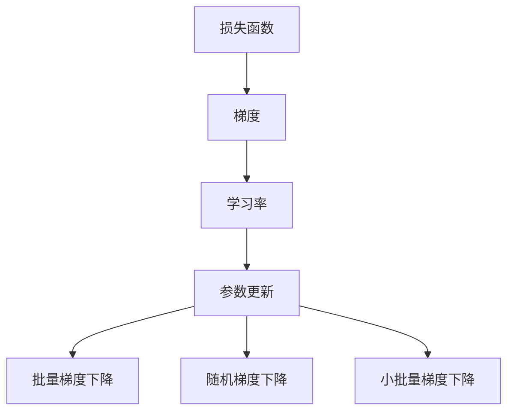

                 

# 优化算法：梯度下降 (Gradient Descent) 原理与代码实例讲解

> 关键词：梯度下降,优化算法,机器学习,深度学习,神经网络

## 1. 背景介绍

### 1.1 问题由来

在机器学习和深度学习领域，优化算法是训练神经网络模型的核心部分。通过优化算法，我们能够不断调整模型参数，使损失函数最小化，从而提升模型的预测能力。梯度下降算法是最基础的优化算法之一，广泛应用于各种神经网络训练中。

梯度下降算法（Gradient Descent, GD）的提出可以追溯到19世纪，由法国数学家Joseph Fourier首次在研究热力学中的波动方程时发现。但直到1950年代，计算机技术的进步使得梯度下降算法开始广泛应用于机器学习领域。特别是1980年代以来，神经网络的复兴使得梯度下降算法成为训练深度学习模型不可或缺的工具。

### 1.2 问题核心关键点

梯度下降算法主要解决的是如何通过不断调整模型参数，使损失函数达到最小值。其核心思想是利用目标函数的一阶导数（梯度）来指导参数更新方向，以使函数值不断降低，从而达到最优解。梯度下降算法通常分为批量梯度下降（Batch Gradient Descent, BGD）、随机梯度下降（Stochastic Gradient Descent, SGD）和小批量梯度下降（Mini-batch Gradient Descent）三种形式。

## 2. 核心概念与联系

### 2.1 核心概念概述

为了更好地理解梯度下降算法，本节将介绍几个密切相关的核心概念：

- 损失函数(Loss Function)：在机器学习中，损失函数用于衡量模型预测结果与实际标签之间的差异。损失函数越小，模型的预测能力越强。
- 梯度（Gradient）：梯度是损失函数对模型参数的偏导数，表示在当前参数值下，损失函数值的变化率。梯度的方向指向损失函数值增加最快的方向。
- 学习率(Learning Rate)：学习率控制每次参数更新的幅度，是一个超参数。学习率过大会导致模型震荡甚至不收敛，过小则收敛速度慢。
- 参数更新(Parameter Update)：根据梯度方向和大小，调整模型参数的值。参数更新的公式为：$\theta_{t+1} = \theta_t - \eta \nabla_\theta \mathcal{L}(\theta_t)$，其中$\eta$为学习率，$\nabla_\theta \mathcal{L}(\theta_t)$为损失函数对参数$\theta$的梯度。
- 批量梯度下降(Batch Gradient Descent)：每次使用全部训练数据计算梯度。优点是梯度估计准确，缺点是计算量大。
- 随机梯度下降(Stochastic Gradient Descent)：每次使用单个样本计算梯度。优点是计算速度快，缺点是梯度估计不准确，收敛路径不稳定。
- 小批量梯度下降(Mini-batch Gradient Descent)：每次使用一小批样本计算梯度。平衡了计算速度和梯度估计的准确性。

这些核心概念之间的逻辑关系可以通过以下Mermaid流程图来展示：



这个流程图展示了几大核心概念之间的逻辑关系：

1. 损失函数计算梯度。
2. 梯度指导参数更新。
3. 学习率控制更新幅度。
4. 批量、随机和小批量三种梯度下降方法在参数更新策略上有所不同。

## 3. 核心算法原理 & 具体操作步骤
### 3.1 算法原理概述

梯度下降算法的基本原理是通过计算损失函数对模型参数的梯度，并根据梯度的方向和大小，逐步调整模型参数，使损失函数达到最小值。

具体来说，假设损失函数为$\mathcal{L}(\theta)$，模型参数为$\theta$。梯度下降算法的更新公式为：

$$
\theta_{t+1} = \theta_t - \eta \nabla_\theta \mathcal{L}(\theta_t)
$$

其中，$\eta$为学习率，$\nabla_\theta \mathcal{L}(\theta_t)$为损失函数对参数$\theta$的梯度。

算法的核心在于如何高效计算梯度，并根据梯度信息调整模型参数。梯度下降算法通过不断迭代参数更新过程，逐步接近损失函数的最小值。

### 3.2 算法步骤详解

梯度下降算法的具体实现步骤如下：

**Step 1: 初始化模型参数和超参数**
- 初始化模型参数$\theta$，通常设定为0或随机值。
- 设定学习率$\eta$、迭代次数$T$等超参数。

**Step 2: 计算梯度**
- 计算损失函数$\mathcal{L}(\theta)$对每个参数$\theta_i$的偏导数$g_i = \nabla_\theta \mathcal{L}(\theta)$。

**Step 3: 参数更新**
- 根据梯度信息，更新模型参数$\theta$：$\theta_{t+1} = \theta_t - \eta g_t$，其中$g_t = \nabla_\theta \mathcal{L}(\theta_t)$。

**Step 4: 迭代执行**
- 重复执行步骤2和步骤3，直至达到预设的迭代次数$T$或损失函数值达到预设阈值。

### 3.3 算法优缺点

梯度下降算法具有以下优点：
1. 算法思想简单，易于理解和实现。
2. 可以处理高维空间问题，适用于大规模的神经网络。
3. 能够有效地优化非凸损失函数，找到局部最优解。

同时，梯度下降算法也存在一些缺点：
1. 对初始值和超参数敏感，不同的初始值可能导致不同的收敛路径。
2. 计算梯度的过程复杂，尤其是对于大规模神经网络，计算开销较大。
3. 容易陷入局部最优解，难以找到全局最优解。

尽管存在这些局限性，但梯度下降算法仍是目前最基础的优化算法之一，广泛应用于各种机器学习模型的训练中。

### 3.4 算法应用领域

梯度下降算法在机器学习和深度学习领域得到了广泛应用，具体应用领域包括：

- 神经网络训练：梯度下降算法是训练神经网络模型的核心算法之一，广泛应用于图像识别、自然语言处理、语音识别等多个领域。
- 逻辑回归：梯度下降算法可以用于训练逻辑回归模型，解决二分类和多分类问题。
- 支持向量机(SVM)：梯度下降算法可以用于训练SVM模型，解决分类和回归问题。
- 主成分分析(PCA)：梯度下降算法可以用于PCA算法的参数优化，进行数据降维。
- 遗传算法：梯度下降算法可以用于遗传算法中的选择和交叉操作，优化种群参数。

## 4. 数学模型和公式 & 详细讲解 & 举例说明

### 4.1 数学模型构建

假设有一个简单的线性回归模型，预测目标变量$y$的表达式为：

$$
y = \theta_0 + \theta_1 x_1 + \theta_2 x_2
$$

其中，$\theta_0, \theta_1, \theta_2$为模型参数。我们的目标是最小化损失函数，通常使用均方误差损失函数：

$$
\mathcal{L}(\theta) = \frac{1}{2m} \sum_{i=1}^m (y_i - (\theta_0 + \theta_1 x_{i1} + \theta_2 x_{i2}))^2
$$

其中，$m$为样本数量。

### 4.2 公式推导过程

首先，我们需要计算损失函数对模型参数的梯度：

$$
\frac{\partial \mathcal{L}(\theta)}{\partial \theta_0} = \frac{1}{m} \sum_{i=1}^m -(y_i - (\theta_0 + \theta_1 x_{i1} + \theta_2 x_{i2}))
$$

$$
\frac{\partial \mathcal{L}(\theta)}{\partial \theta_1} = \frac{1}{m} \sum_{i=1}^m -x_{i1}(y_i - (\theta_0 + \theta_1 x_{i1} + \theta_2 x_{i2}))
$$

$$
\frac{\partial \mathcal{L}(\theta)}{\partial \theta_2} = \frac{1}{m} \sum_{i=1}^m -x_{i2}(y_i - (\theta_0 + \theta_1 x_{i1} + \theta_2 x_{i2}))
$$

根据梯度下降算法的更新公式：

$$
\theta_{t+1} = \theta_t - \eta \nabla_\theta \mathcal{L}(\theta_t)
$$

代入上述梯度值，得到具体的参数更新公式：

$$
\theta_{0,t+1} = \theta_{0,t} - \eta \frac{1}{m} \sum_{i=1}^m (y_i - (\theta_0 + \theta_1 x_{i1} + \theta_2 x_{i2}))
$$

$$
\theta_{1,t+1} = \theta_{1,t} - \eta \frac{1}{m} \sum_{i=1}^m -x_{i1}(y_i - (\theta_0 + \theta_1 x_{i1} + \theta_2 x_{i2}))
$$

$$
\theta_{2,t+1} = \theta_{2,t} - \eta \frac{1}{m} \sum_{i=1}^m -x_{i2}(y_i - (\theta_0 + \theta_1 x_{i1} + \theta_2 x_{i2}))
$$

### 4.3 案例分析与讲解

以下是一个简单的Python代码示例，用于实现梯度下降算法，解决线性回归问题。

```python
import numpy as np

def gradient_descent(X, y, learning_rate=0.01, iterations=1000):
    m = len(y)
    theta = np.zeros(3)
    for i in range(iterations):
        y_predict = X @ theta
        theta -= learning_rate * (1/m) * X.T @ (y - y_predict)
    return theta

# 假设数据
X = np.array([[1, 2, 3], [4, 5, 6], [7, 8, 9]])
y = np.array([3, 5, 7])

# 梯度下降
theta = gradient_descent(X, y)
print(theta)
```

在这个示例中，我们定义了一个`gradient_descent`函数，实现了梯度下降算法。函数接受输入特征矩阵$X$、目标变量向量$y$、学习率$\eta$和迭代次数$T$等参数。函数内部计算梯度，并根据梯度信息更新模型参数。最后返回更新后的参数$\theta$。

## 5. 项目实践：代码实例和详细解释说明
### 5.1 开发环境搭建

在进行梯度下降算法实现前，我们需要准备好开发环境。以下是使用Python进行梯度下降算法开发的典型环境配置流程：

1. 安装Anaconda：从官网下载并安装Anaconda，用于创建独立的Python环境。

2. 创建并激活虚拟环境：
```bash
conda create -n pyenv python=3.8 
conda activate pyenv
```

3. 安装必要的库：
```bash
conda install numpy scipy matplotlib
```

4. 安装必要的编译依赖：
```bash
conda install mingw
```

完成上述步骤后，即可在`pyenv`环境中开始梯度下降算法的实现。

### 5.2 源代码详细实现

我们以下线性回归问题为例，给出使用梯度下降算法解决的完整代码实现。

```python
import numpy as np

def gradient_descent(X, y, learning_rate=0.01, iterations=1000):
    m = len(y)
    theta = np.zeros(X.shape[1])
    for i in range(iterations):
        y_predict = X @ theta
        theta -= learning_rate * (1/m) * X.T @ (y - y_predict)
    return theta

# 假设数据
X = np.array([[1, 2, 3], [4, 5, 6], [7, 8, 9]])
y = np.array([3, 5, 7])

# 梯度下降
theta = gradient_descent(X, y)
print(theta)
```

在这个示例中，我们定义了一个`gradient_descent`函数，实现了梯度下降算法。函数接受输入特征矩阵$X$、目标变量向量$y$、学习率$\eta$和迭代次数$T$等参数。函数内部计算梯度，并根据梯度信息更新模型参数。最后返回更新后的参数$\theta$。

### 5.3 代码解读与分析

让我们再详细解读一下关键代码的实现细节：

**X和y定义**：
- 我们定义了一个特征矩阵$X$和一个目标变量向量$y$，作为梯度下降算法的基本输入。

**gradient_descent函数**：
- 函数内部首先计算了样本数量$m$，然后初始化模型参数$\theta$为0。
- 使用for循环迭代$T$次，每次计算预测值$y_predict$，并根据梯度公式更新参数$\theta$。

**输出结果**：
- 最后返回更新后的参数$\theta$，使用print输出结果。

可以看到，梯度下降算法的代码实现相对简洁，主要步骤包括计算梯度、更新参数和迭代执行。开发者可以根据具体需求，进一步扩展和优化算法实现。

## 6. 实际应用场景

### 6.1 线性回归问题

梯度下降算法最典型的应用之一是线性回归问题。假设我们有一个简单的线性回归模型，用于预测房价：

$$
y = \theta_0 + \theta_1 x_1 + \theta_2 x_2
$$

其中，$y$为目标变量（房价），$x_1$和$x_2$为输入特征（房屋面积和位置），$\theta_0, \theta_1, \theta_2$为模型参数。

我们可以使用梯度下降算法来训练模型，最小化损失函数：

$$
\mathcal{L}(\theta) = \frac{1}{2m} \sum_{i=1}^m (y_i - (\theta_0 + \theta_1 x_{i1} + \theta_2 x_{i2}))^2
$$

通过不断调整模型参数，使损失函数达到最小值，从而得到最优的房价预测模型。

### 6.2 图像识别

在图像识别任务中，我们需要将输入图像映射到输出类别。常用的方法是使用卷积神经网络（CNN），通过多层卷积和池化操作提取图像特征，再使用全连接层进行分类。

梯度下降算法可以用于训练CNN模型。通过反向传播算法计算损失函数对每个神经元参数的梯度，并根据梯度信息更新参数。经过多次迭代，训练得到的CNN模型能够准确识别各种图像。

### 6.3 自然语言处理

在自然语言处理任务中，我们需要将输入文本映射到输出标签。常用的方法是使用循环神经网络（RNN）或Transformer模型，通过编码器-解码器结构进行文本生成或分类。

梯度下降算法可以用于训练RNN或Transformer模型。通过反向传播算法计算损失函数对每个神经元参数的梯度，并根据梯度信息更新参数。经过多次迭代，训练得到的模型能够准确生成或分类各种文本。

## 7. 工具和资源推荐
### 7.1 学习资源推荐

为了帮助开发者系统掌握梯度下降算法的理论基础和实践技巧，这里推荐一些优质的学习资源：

1. 《深度学习》书籍：Ian Goodfellow等著，全面介绍了深度学习的基础知识和梯度下降算法。

2. 《机器学习》课程：Andrew Ng等著，介绍了梯度下降算法的原理和实现，是机器学习领域的经典教材。

3. Coursera上的深度学习课程：由斯坦福大学Andrew Ng教授主讲，详细讲解了梯度下降算法的应用和优化方法。

4. Kaggle竞赛：Kaggle上有很多机器学习和深度学习竞赛，可以通过实际项目练习梯度下降算法。

5. 深度学习框架文档：如TensorFlow、PyTorch等框架，提供了丰富的梯度下降算法实现和优化方法。

通过对这些资源的学习实践，相信你一定能够快速掌握梯度下降算法的精髓，并用于解决实际的机器学习问题。

### 7.2 开发工具推荐

高效的开发离不开优秀的工具支持。以下是几款用于梯度下降算法开发的常用工具：

1. Python：Python是梯度下降算法开发的首选语言，具有丰富的库和框架支持。

2. NumPy：NumPy提供了高效的多维数组和矩阵运算功能，是梯度下降算法实现的基础。

3. SciPy：SciPy提供了各种数学函数和优化算法，可以用于梯度下降算法的优化和调参。

4. TensorFlow和PyTorch：这些深度学习框架提供了高效的自动微分和优化算法，可以用于训练大规模神经网络模型。

5. Matplotlib和Seaborn：这些绘图库可以用于绘制损失函数和参数更新的曲线，方便调试和可视化。

6. Jupyter Notebook：这个交互式编程环境可以方便地进行代码调试和实验展示。

合理利用这些工具，可以显著提升梯度下降算法的开发效率，加快创新迭代的步伐。

### 7.3 相关论文推荐

梯度下降算法在机器学习和深度学习领域的研究已经非常成熟，以下是几篇奠基性的相关论文，推荐阅读：

1. Gradient Descent Methods: The Literature 1951-2011：Ghadouani和Nguyen综述了1951年到2011年之间关于梯度下降算法的研究进展。

2. Accelerating gradient descent using a high-order inertial method：Fister等提出了一种基于牛顿法的高阶惯性优化方法，可以加速梯度下降算法。

3. Adaptive Moment Estimation（Adam）：Kingma和Ba提出了一种自适应矩估计优化方法，可以自适应调整学习率，加速梯度下降算法收敛。

4. On the importance of initialization and momentum in deep learning：Sutskever等研究了初始化和动量对深度学习模型训练的影响，提出了一种改进的动量方法。

这些论文代表了大规模梯度下降算法的发展脉络，通过学习这些前沿成果，可以帮助研究者把握学科前进方向，激发更多的创新灵感。

## 8. 总结：未来发展趋势与挑战

### 8.1 总结

本文对梯度下降算法进行了全面系统的介绍。首先阐述了梯度下降算法的基本原理和核心思想，明确了其在机器学习和深度学习中的应用价值。其次，从理论到实践，详细讲解了梯度下降算法的数学模型和实现细节，给出了梯度下降算法的代码实现和分析。最后，本文还广泛探讨了梯度下降算法在实际应用中的多个场景，展示了梯度下降算法的强大应用能力。

通过本文的系统梳理，可以看到，梯度下降算法在机器学习和深度学习领域具有重要的基础地位，广泛应用于各种模型训练中。未来，随着深度学习技术的不断发展，梯度下降算法仍将是优化算法中的重要工具，继续发挥其重要作用。

### 8.2 未来发展趋势

展望未来，梯度下降算法将呈现以下几个发展趋势：

1. 优化算法多样化：随着深度学习模型的复杂性增加，优化算法的种类也将越来越多样化。除了传统的梯度下降算法，未来将涌现更多高阶优化算法，如Adam、RMSprop等，提升模型训练效率。

2. 自适应学习率：自适应学习率优化算法（如AdaGrad、Adadelta等）可以自动调整学习率，加速模型收敛。未来，自适应学习率算法将成为优化算法的主流。

3. 分布式训练：随着模型规模的不断增大，单机训练已无法满足需求。分布式训练技术可以并行计算，加速模型训练，未来将成为梯度下降算法的标配。

4. 动态优化：动态优化算法（如动态数据流优化、残差网络等）可以在计算资源有限的情况下，提高模型训练效率。未来，动态优化算法将在深度学习中得到广泛应用。

5. 迁移学习：迁移学习可以将已有模型的知识迁移到新模型中，提高模型训练的效率和精度。未来，梯度下降算法将与迁移学习算法结合，进一步提升模型的泛化能力。

### 8.3 面临的挑战

尽管梯度下降算法已经取得了巨大的成功，但在迈向更加智能化、普适化应用的过程中，它仍面临着诸多挑战：

1. 计算资源瓶颈：大模型训练需要大量的计算资源，分布式训练虽然可以缓解这个问题，但仍然难以满足大规模模型的需求。如何优化计算资源的使用，降低训练成本，将是未来的重要研究方向。

2. 模型复杂性增加：随着深度学习模型的复杂性增加，模型的训练变得更加困难。如何设计更好的优化算法，加快模型收敛速度，提升模型泛化能力，将是未来的关键问题。

3. 模型鲁棒性不足：梯度下降算法在面对复杂非凸优化问题时，容易陷入局部最优解。如何提高模型的鲁棒性，避免局部最优解，将是未来的重要研究方向。

4. 可解释性不足：梯度下降算法的内部工作机制难以解释，对于医疗、金融等高风险应用，模型的可解释性和可审计性尤为重要。如何提高模型的可解释性，将是未来的重要研究方向。

5. 算法复杂度提升：随着模型复杂性的增加，优化算法的复杂度也随之增加。如何设计更加高效的算法，提高计算效率，将是未来的重要研究方向。

6. 模型公平性问题：梯度下降算法容易受到初始值和超参数的影响，导致模型存在公平性问题。如何设计更加公平、稳定的算法，将是未来的重要研究方向。

### 8.4 研究展望

面对梯度下降算法所面临的种种挑战，未来的研究需要在以下几个方面寻求新的突破：

1. 研究更好的优化算法：优化算法是深度学习模型的核心，未来的研究将继续探索更高阶、自适应、动态优化的算法，提高模型的训练效率和泛化能力。

2. 优化计算资源使用：分布式训练和大规模计算资源的使用，将是未来深度学习训练的重要方向。如何优化计算资源的使用，降低训练成本，是未来的重要研究方向。

3. 提高模型鲁棒性：模型鲁棒性是深度学习模型的重要指标，未来的研究将继续探索如何提高模型的鲁棒性，避免局部最优解，是未来的重要研究方向。

4. 提高模型可解释性：模型可解释性是深度学习模型的重要研究方向，未来的研究将继续探索如何提高模型的可解释性，是未来的重要研究方向。

5. 设计更加公平的算法：深度学习模型的公平性问题仍然存在，未来的研究将继续探索如何设计更加公平、稳定的算法，是未来的重要研究方向。

这些研究方向的探索，必将引领梯度下降算法迈向更高的台阶，为构建更加智能化、普适化的人工智能系统铺平道路。面向未来，梯度下降算法需要在算法设计、计算资源使用、模型鲁棒性、可解释性和公平性等方面进行持续优化，才能真正发挥其重要作用。

## 9. 附录：常见问题与解答

**Q1：什么是梯度下降算法？**

A: 梯度下降算法是一种优化算法，通过不断调整模型参数，使损失函数达到最小值。其核心思想是利用目标函数的一阶导数（梯度）来指导参数更新方向，以使函数值不断降低，从而达到最优解。

**Q2：梯度下降算法有哪些形式？**

A: 梯度下降算法主要分为批量梯度下降（BGD）、随机梯度下降（SGD）和小批量梯度下降（Mini-batch GD）三种形式。

**Q3：梯度下降算法有哪些优点和缺点？**

A: 梯度下降算法具有以下优点：算法思想简单，易于理解和实现；可以处理高维空间问题；能够有效地优化非凸损失函数。同时，梯度下降算法也存在一些缺点：对初始值和超参数敏感；计算梯度的过程复杂；容易陷入局部最优解。

**Q4：梯度下降算法有哪些应用领域？**

A: 梯度下降算法在机器学习和深度学习领域得到了广泛应用，具体应用领域包括：神经网络训练、逻辑回归、支持向量机、主成分分析、遗传算法等。

**Q5：如何优化梯度下降算法？**

A: 优化梯度下降算法的方法包括：选择合适的学习率、使用自适应学习率算法、使用动量方法、采用分布式训练、引入自正则化技术等。

通过对这些问题的解答，相信你能够更加全面地了解梯度下降算法的基本概念、实现细节和优化方法，为未来的深度学习研究和应用打下坚实的基础。

---

作者：禅与计算机程序设计艺术 / Zen and the Art of Computer Programming

