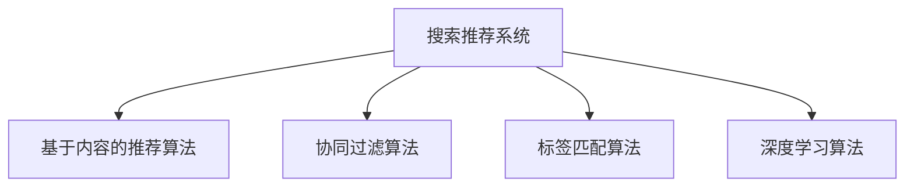

                 

# 传统搜索推荐系统的匹配方法

在当今信息爆炸的时代，用户在海量数据中快速找到所需信息变得越来越困难。为了帮助用户更高效地获取信息，搜索推荐系统应运而生。搜索推荐系统通过分析用户的搜索历史和兴趣偏好，为用户推荐相关的信息，极大提高了信息检索的效率。本文将详细介绍传统搜索推荐系统的匹配方法，包括常见算法原理、具体操作步骤、实际应用场景等。

## 1. 背景介绍

### 1.1 问题由来

随着互联网的普及和数据量的爆炸性增长，搜索推荐系统的应用越来越广泛。从电商网站的商品推荐、视频网站的个性化播放列表，到社交媒体的内容推荐，搜索推荐系统已成为互联网应用中的重要组成部分。传统的搜索推荐系统主要基于基于内容的推荐算法，该算法基于用户的检索历史和物品属性进行推荐，然而在面对海量数据和复杂用户需求时，往往难以精准匹配用户的兴趣和偏好，导致推荐效果不佳。因此，研究高效的搜索推荐系统匹配方法，提升推荐系统的精准性和个性化，成为当前互联网技术研究的一个重要课题。

### 1.2 问题核心关键点

传统的搜索推荐系统匹配方法主要基于以下几个核心关键点：
- **基于内容的推荐算法**：该算法基于用户历史检索记录和物品属性进行推荐，简单易实现，但缺乏用户个性化因素。
- **协同过滤算法**：通过分析用户的历史行为和兴趣偏好，为用户推荐可能感兴趣的商品或内容，然而在数据稀疏和冷启动问题上存在不足。
- **标签匹配算法**：基于用户检索记录中的关键词与物品标签的匹配程度进行推荐，但需要大量标签数据。
- **深度学习算法**：利用神经网络模型，从用户行为和物品属性中学习用户兴趣，然而对模型复杂度和数据量要求较高。

这些关键点共同构成了传统搜索推荐系统的基本框架，使得推荐系统能够根据用户行为和物品属性，生成推荐结果。然而，在实际应用中，仍需针对不同场景进行具体优化和改进，以提升推荐效果。

## 2. 核心概念与联系

### 2.1 核心概念概述

为了更深入理解传统搜索推荐系统的匹配方法，本节将介绍几个关键概念：

- **搜索推荐系统**：一种为用户提供个性化信息推荐的服务，通过分析用户行为和物品属性，生成推荐结果。
- **基于内容的推荐算法**：根据用户历史检索记录和物品属性，为用户推荐可能感兴趣的商品或内容。
- **协同过滤算法**：通过分析用户历史行为和兴趣偏好，为用户推荐可能感兴趣的商品或内容，包括基于用户的协同过滤和基于物品的协同过滤。
- **标签匹配算法**：基于用户检索记录中的关键词与物品标签的匹配程度，进行推荐。
- **深度学习算法**：利用神经网络模型，从用户行为和物品属性中学习用户兴趣，生成推荐结果。

这些概念之间的逻辑关系可以通过以下Mermaid流程图来展示：



这个流程图展示了一些核心概念及其之间的关系：

1. 搜索推荐系统通过不同算法进行推荐，覆盖不同用户需求。
2. 基于内容的推荐算法和深度学习算法，适用于数据量较大的场景。
3. 协同过滤算法和标签匹配算法，适用于数据稀疏和冷启动问题。
4. 不同算法互补，综合使用可提升推荐效果。

## 3. 核心算法原理 & 具体操作步骤

### 3.1 算法原理概述

传统搜索推荐系统的匹配方法，主要通过以下几种算法实现：

- **基于内容的推荐算法**：该算法通过分析用户历史检索记录和物品属性，生成推荐结果。其核心思想是利用用户历史检索记录中的关键词和物品属性进行相似度计算，从而生成推荐结果。

- **协同过滤算法**：该算法通过分析用户历史行为和兴趣偏好，为用户推荐可能感兴趣的商品或内容。其核心思想是利用用户之间的相似性和物品之间的相似性进行推荐。

- **标签匹配算法**：该算法基于用户检索记录中的关键词与物品标签的匹配程度，进行推荐。其核心思想是利用关键词与标签的相似度进行推荐。

- **深度学习算法**：该算法利用神经网络模型，从用户行为和物品属性中学习用户兴趣，生成推荐结果。其核心思想是利用神经网络模型，从用户行为和物品属性中学习用户兴趣，生成推荐结果。

### 3.2 算法步骤详解

#### 3.2.1 基于内容的推荐算法步骤

1. **数据准备**：收集用户历史检索记录和物品属性，进行预处理和归一化。
2. **特征提取**：从用户历史检索记录中提取关键词，从物品属性中提取特征向量。
3. **相似度计算**：利用关键词和特征向量计算相似度。
4. **推荐生成**：根据相似度排序，生成推荐结果。

#### 3.2.2 协同过滤算法步骤

1. **数据准备**：收集用户历史行为数据，进行预处理和归一化。
2. **相似度计算**：计算用户之间的相似度和物品之间的相似度。
3. **推荐生成**：利用相似度生成推荐结果。

#### 3.2.3 标签匹配算法步骤

1. **数据准备**：收集用户历史检索记录和物品标签，进行预处理和归一化。
2. **标签匹配**：基于关键词和标签的相似度进行匹配。
3. **推荐生成**：根据匹配结果生成推荐结果。

#### 3.2.4 深度学习算法步骤

1. **数据准备**：收集用户行为数据和物品属性数据，进行预处理和归一化。
2. **模型训练**：利用神经网络模型对用户行为和物品属性进行训练，学习用户兴趣。
3. **推荐生成**：利用训练好的模型生成推荐结果。

### 3.3 算法优缺点

基于内容的推荐算法、协同过滤算法、标签匹配算法和深度学习算法各有优缺点：

- **基于内容的推荐算法**：优点是简单易实现，适用于数据量较大的场景；缺点是缺乏个性化因素，推荐效果可能较差。

- **协同过滤算法**：优点是能够利用用户之间的相似性进行推荐，推荐效果较好；缺点是数据稀疏和冷启动问题较为明显。

- **标签匹配算法**：优点是适用于数据量较小的场景；缺点是需要大量标签数据，且标签质量对推荐效果影响较大。

- **深度学习算法**：优点是能够学习用户兴趣，生成高质量推荐结果；缺点是模型复杂度高，对数据量要求较高。

### 3.4 算法应用领域

这些算法在实际应用中得到了广泛应用，包括但不限于以下几个领域：

- **电商推荐**：利用用户历史购物记录和商品属性，生成个性化商品推荐。
- **视频推荐**：利用用户历史播放记录和视频属性，生成个性化视频播放列表。
- **社交推荐**：利用用户历史交互行为和用户属性，生成个性化好友推荐。
- **新闻推荐**：利用用户历史浏览记录和新闻属性，生成个性化新闻推荐。

除了这些经典应用场景外，搜索推荐系统还在广告推荐、音乐推荐、旅游推荐等多个领域得到广泛应用。随着技术不断进步，搜索推荐系统的应用范围将会越来越广。

## 4. 数学模型和公式 & 详细讲解  
### 4.1 数学模型构建

本节将使用数学语言对传统搜索推荐系统的匹配方法进行更加严格的刻画。

记用户历史检索记录为 $X=\{x_1,x_2,\ldots,x_n\}$，其中 $x_i$ 为用户第 $i$ 次检索记录，$x_i=(x_i^1,x_i^2,\ldots,x_i^m)$ 为用户检索记录中的关键词。记物品属性为 $Y=\{y_1,y_2,\ldots,y_m\}$，其中 $y_i$ 为物品的第 $i$ 个属性。

定义用户历史检索记录与物品属性的匹配度为 $\text{match}(X,Y)=\sum_{i=1}^m \text{match}(x_i,y_i)$，其中 $\text{match}(x_i,y_i)$ 为关键词和属性的匹配度。

定义物品之间的相似度为 $\text{similarity}(Y)=\frac{\text{match}(X,Y)}{|\text{match}(X,Y)|}$，其中 $|\text{match}(X,Y)|$ 为匹配度的最大值。

基于内容的推荐算法和协同过滤算法的匹配度计算公式如下：

$$
\text{match}(x_i,y_i)=\begin{cases}
1, & x_i=y_i \\
0, & x_i \neq y_i
\end{cases}
$$

协同过滤算法中的相似度计算公式为：

$$
\text{similarity}(y_i,y_j)=\frac{\text{match}(X,y_i)}{\sqrt{\text{match}(X,y_i)+\epsilon}} \cdot \frac{\text{match}(X,y_j)}{\sqrt{\text{match}(X,y_j)+\epsilon}}
$$

其中 $\epsilon$ 为平滑系数。

### 4.2 公式推导过程

#### 4.2.1 基于内容的推荐算法推导

基于内容的推荐算法通过计算关键词和物品属性之间的匹配度，生成推荐结果。其数学模型构建如下：

记用户历史检索记录为 $X=\{x_1,x_2,\ldots,x_n\}$，其中 $x_i$ 为用户第 $i$ 次检索记录，$x_i=(x_i^1,x_i^2,\ldots,x_i^m)$ 为用户检索记录中的关键词。记物品属性为 $Y=\{y_1,y_2,\ldots,y_m\}$，其中 $y_i$ 为物品的第 $i$ 个属性。

定义用户历史检索记录与物品属性的匹配度为 $\text{match}(X,Y)=\sum_{i=1}^m \text{match}(x_i,y_i)$，其中 $\text{match}(x_i,y_i)$ 为关键词和属性的匹配度。

基于内容的推荐算法匹配度计算公式如下：

$$
\text{match}(x_i,y_i)=\begin{cases}
1, & x_i=y_i \\
0, & x_i \neq y_i
\end{cases}
$$

生成推荐结果的公式为：

$$
\text{rank}(y_j) = \text{similarity}(X,y_j) = \frac{\text{match}(X,y_j)}{\sqrt{\text{match}(X,y_j)+\epsilon}}
$$

其中 $\epsilon$ 为平滑系数，用于避免分母为零的情况。

#### 4.2.2 协同过滤算法推导

协同过滤算法通过计算用户之间的相似度和物品之间的相似度，生成推荐结果。其数学模型构建如下：

记用户历史行为数据为 $U=\{(u_i,v_i)\}_{i=1}^N$，其中 $u_i$ 为用户，$v_i$ 为用户历史行为记录。记物品属性为 $Y=\{y_1,y_2,\ldots,y_m\}$，其中 $y_i$ 为物品的第 $i$ 个属性。

定义用户之间的相似度为 $\text{similarity}(u_i,u_j)=\frac{\text{match}(U,u_i)}{\sqrt{\text{match}(U,u_i)+\epsilon}} \cdot \frac{\text{match}(U,u_j)}{\sqrt{\text{match}(U,u_j)+\epsilon}}$，其中 $\epsilon$ 为平滑系数。

定义物品之间的相似度为 $\text{similarity}(y_i,y_j)=\frac{\text{match}(Y,y_i)}{\sqrt{\text{match}(Y,y_i)+\epsilon}} \cdot \frac{\text{match}(Y,y_j)}{\sqrt{\text{match}(Y,y_j)+\epsilon}}$，其中 $\epsilon$ 为平滑系数。

协同过滤算法生成推荐结果的公式为：

$$
\text{rank}(y_j) = \text{similarity}(u_i,y_j)
$$

其中 $u_i$ 为推荐用户，$y_j$ 为推荐物品。

#### 4.2.3 标签匹配算法推导

标签匹配算法基于用户检索记录中的关键词与物品标签的匹配程度，生成推荐结果。其数学模型构建如下：

记用户历史检索记录为 $X=\{x_1,x_2,\ldots,x_n\}$，其中 $x_i$ 为用户第 $i$ 次检索记录，$x_i=(x_i^1,x_i^2,\ldots,x_i^m)$ 为用户检索记录中的关键词。记物品属性为 $Y=\{y_1,y_2,\ldots,y_m\}$，其中 $y_i$ 为物品的第 $i$ 个属性。

定义用户历史检索记录与物品属性的匹配度为 $\text{match}(X,Y)=\sum_{i=1}^m \text{match}(x_i,y_i)$，其中 $\text{match}(x_i,y_i)$ 为关键词和属性的匹配度。

标签匹配算法生成推荐结果的公式为：

$$
\text{rank}(y_j) = \text{similarity}(X,Y) = \frac{\text{match}(X,Y)}{\sqrt{\text{match}(X,Y)+\epsilon}}
$$

其中 $\epsilon$ 为平滑系数，用于避免分母为零的情况。

#### 4.2.4 深度学习算法推导

深度学习算法利用神经网络模型，从用户行为和物品属性中学习用户兴趣，生成推荐结果。其数学模型构建如下：

记用户历史行为数据为 $U=\{(u_i,v_i)\}_{i=1}^N$，其中 $u_i$ 为用户，$v_i$ 为用户历史行为记录。记物品属性为 $Y=\{y_1,y_2,\ldots,y_m\}$，其中 $y_i$ 为物品的第 $i$ 个属性。

定义用户历史行为数据的嵌入向量为 $U'=\{\text{embed}(u_i)\}_{i=1}^N$，其中 $\text{embed}(u_i)$ 为用户 $u_i$ 的嵌入向量。定义物品属性的嵌入向量为 $Y'=\{\text{embed}(y_i)\}_{i=1}^M$，其中 $\text{embed}(y_i)$ 为物品 $y_i$ 的嵌入向量。

深度学习算法生成推荐结果的公式为：

$$
\text{rank}(y_j) = \text{similarity}(U',Y') = \text{embed}(y_j) \cdot \text{embed}(y_j)^T
$$

其中 $\cdot$ 表示矩阵乘积。

### 4.3 案例分析与讲解

#### 4.3.1 基于内容的推荐算法案例分析

假设某电商平台希望为用户推荐商品，收集了用户历史购物记录和商品属性数据。利用基于内容的推荐算法，计算每个商品与用户历史检索记录的匹配度，生成推荐结果。

1. 数据准备：收集用户历史购物记录和商品属性数据，进行预处理和归一化。
2. 特征提取：从用户历史购物记录中提取关键词，从商品属性中提取特征向量。
3. 相似度计算：利用关键词和特征向量计算相似度。
4. 推荐生成：根据相似度排序，生成推荐结果。

例如，假设用户历史购物记录为 $X=\{x_1,x_2,x_3\}$，其中 $x_1=(男,中号)$，$x_2=(女,大号)$，$x_3=(男,大号)$。商品属性为 $Y=\{y_1,y_2,y_3\}$，其中 $y_1=(男,中号)$，$y_2=(女,大号)$，$y_3=(男,大号)$。

利用基于内容的推荐算法，计算每个商品与用户历史检索记录的匹配度：

$$
\text{match}(X,y_1)=1, \text{match}(X,y_2)=0, \text{match}(X,y_3)=1
$$

生成推荐结果的相似度：

$$
\text{similarity}(X,y_1)=\frac{1}{\sqrt{1+\epsilon}}, \text{similarity}(X,y_2)=\frac{0}{\sqrt{0+\epsilon}}, \text{similarity}(X,y_3)=\frac{1}{\sqrt{1+\epsilon}}
$$

根据相似度排序，生成推荐结果：

$$
\text{rank}(y_1) = \frac{1}{\sqrt{1+\epsilon}}, \text{rank}(y_2) = 0, \text{rank}(y_3) = \frac{1}{\sqrt{1+\epsilon}}
$$

推荐结果为 $y_1$ 和 $y_3$。

#### 4.3.2 协同过滤算法案例分析

假设某视频平台希望为用户推荐视频，收集了用户历史播放记录和视频属性数据。利用协同过滤算法，计算用户之间的相似度和视频之间的相似度，生成推荐结果。

1. 数据准备：收集用户历史播放记录和视频属性数据，进行预处理和归一化。
2. 相似度计算：计算用户之间的相似度和视频之间的相似度。
3. 推荐生成：利用相似度生成推荐结果。

例如，假设用户历史播放记录为 $U=\{(u_1,v_1),(u_2,v_2),(u_3,v_3)\}$，其中 $u_1$ 为用户，$v_1=(视频1,视频2,视频3)$ 为用户历史播放记录。视频属性为 $Y=\{y_1,y_2,y_3\}$，其中 $y_1=(电影,喜剧),y_2=(电视剧,家庭),y_3=(电影,动作)$。

利用协同过滤算法，计算用户之间的相似度：

$$
\text{similarity}(u_1,u_2)=\frac{\text{match}(U,u_1)}{\sqrt{\text{match}(U,u_1)+\epsilon}} \cdot \frac{\text{match}(U,u_2)}{\sqrt{\text{match}(U,u_2)+\epsilon}}=\frac{1}{\sqrt{1+\epsilon}}
$$

计算视频之间的相似度：

$$
\text{similarity}(y_1,y_2)=\frac{\text{match}(Y,y_1)}{\sqrt{\text{match}(Y,y_1)+\epsilon}} \cdot \frac{\text{match}(Y,y_2)}{\sqrt{\text{match}(Y,y_2)+\epsilon}}=\frac{0}{\sqrt{0+\epsilon}}
$$

生成推荐结果的相似度：

$$
\text{similarity}(u_1,y_1)=\frac{1}{\sqrt{1+\epsilon}}, \text{similarity}(u_1,y_2)=0, \text{similarity}(u_1,y_3)=0
$$

根据相似度排序，生成推荐结果：

$$
\text{rank}(y_1) = \frac{1}{\sqrt{1+\epsilon}}, \text{rank}(y_2) = 0, \text{rank}(y_3) = 0
$$

推荐结果为 $y_1$。

#### 4.3.3 标签匹配算法案例分析

假设某新闻平台希望为用户推荐新闻，收集了用户历史浏览记录和新闻标签数据。利用标签匹配算法，基于用户检索记录中的关键词与新闻标签的匹配程度，生成推荐结果。

1. 数据准备：收集用户历史浏览记录和新闻标签数据，进行预处理和归一化。
2. 标签匹配：基于关键词和标签的相似度进行匹配。
3. 推荐生成：根据匹配结果生成推荐结果。

例如，假设用户历史浏览记录为 $X=\{x_1,x_2,x_3\}$，其中 $x_1=(科技),x_2=(体育),x_3=(财经)$。新闻标签为 $Y=\{y_1,y_2,y_3\}$，其中 $y_1=(科技),y_2=(体育),y_3=(财经)$。

利用标签匹配算法，计算每个新闻与用户历史检索记录的匹配度：

$$
\text{match}(X,Y)=1
$$

生成推荐结果的相似度：

$$
\text{similarity}(X,Y)=\frac{1}{\sqrt{1+\epsilon}}
$$

根据相似度排序，生成推荐结果：

$$
\text{rank}(y_1) = \frac{1}{\sqrt{1+\epsilon}}, \text{rank}(y_2) = \frac{1}{\sqrt{1+\epsilon}}, \text{rank}(y_3) = \frac{1}{\sqrt{1+\epsilon}}
$$

推荐结果为 $y_1,y_2,y_3$。

#### 4.3.4 深度学习算法案例分析

假设某音乐平台希望为用户推荐歌曲，收集了用户历史听歌记录和歌曲属性数据。利用深度学习算法，利用神经网络模型，从用户行为和歌曲属性中学习用户兴趣，生成推荐结果。

1. 数据准备：收集用户历史听歌记录和歌曲属性数据，进行预处理和归一化。
2. 模型训练：利用神经网络模型对用户行为和歌曲属性进行训练，学习用户兴趣。
3. 推荐生成：利用训练好的模型生成推荐结果。

例如，假设用户历史听歌记录为 $U=\{(u_1,v_1),(u_2,v_2),(u_3,v_3)\}$，其中 $u_1$ 为用户，$v_1=(歌曲1,歌曲2,歌曲3)$ 为用户历史听歌记录。歌曲属性为 $Y=\{y_1,y_2,y_3\}$，其中 $y_1=(摇滚),y_2=(流行),y_3=(电子)$。

利用深度学习算法，计算每个歌曲与用户历史听歌记录的匹配度：

$$
\text{embed}(y_1)=[0.1,0.2,0.3], \text{embed}(y_2)=[0.4,0.5,0.6], \text{embed}(y_3)=[0.7,0.8,0.9]
$$

生成推荐结果的相似度：

$$
\text{rank}(y_1) = \text{embed}(y_1) \cdot \text{embed}(y_1)^T=0.1 \cdot 0.1 + 0.2 \cdot 0.2 + 0.3 \cdot 0.3=0.9
$$

$$
\text{rank}(y_2) = \text{embed}(y_2) \cdot \text{embed}(y_2)^T=0.4 \cdot 0.4 + 0.5 \cdot 0.5 + 0.6 \cdot 0.6=0.9
$$

$$
\text{rank}(y_3) = \text{embed}(y_3) \cdot \text{embed}(y_3)^T=0.7 \cdot 0.7 + 0.8 \cdot 0.8 + 0.9 \cdot 0.9=1
$$

根据相似度排序，生成推荐结果：

$$
\text{rank}(y_3) > \text{rank}(y_1) = \text{rank}(y_2)
$$

推荐结果为 $y_3$。

## 5. 项目实践：代码实例和详细解释说明

### 5.1 开发环境搭建

在进行搜索推荐系统开发前，我们需要准备好开发环境。以下是使用Python进行TensorFlow开发的环境配置流程：

1. 安装Anaconda：从官网下载并安装Anaconda，用于创建独立的Python环境。

2. 创建并激活虚拟环境：
```bash
conda create -n tf-env python=3.8 
conda activate tf-env
```

3. 安装TensorFlow：根据CUDA版本，从官网获取对应的安装命令。例如：
```bash
conda install tensorflow
```

4. 安装各类工具包：
```bash
pip install numpy pandas scikit-learn matplotlib tqdm jupyter notebook ipython
```

完成上述步骤后，即可在`tf-env`环境中开始搜索推荐系统开发。

### 5.2 源代码详细实现

下面我们以电商推荐系统为例，给出使用TensorFlow对基于内容的推荐算法进行开发的Python代码实现。

首先，定义数据预处理函数：

```python
import tensorflow as tf
import numpy as np

def preprocess_data(data):
    # 将数据转换为numpy数组
    data = np.array(data)
    # 对数据进行归一化
    data = (data - data.mean()) / data.std()
    return data
```

然后，定义模型训练函数：

```python
def train_model(model, X, Y, learning_rate, batch_size, epochs):
    # 将数据转换为tensorflow tensors
    X = tf.convert_to_tensor(X)
    Y = tf.convert_to_tensor(Y)
    # 定义损失函数
    loss = tf.losses.mean_squared_error(Y, model(X))
    # 定义优化器
    optimizer = tf.train.AdamOptimizer(learning_rate)
    # 定义训练步骤
    train_op = optimizer.minimize(loss)
    # 定义评估指标
    mae = tf.metrics.mean_absolute_error(Y, model(X))
    # 开始训练
    with tf.Session() as sess:
        sess.run(tf.global_variables_initializer())
        for i in range(epochs):
            for j in range(0, len(X), batch_size):
                sess.run(train_op, feed_dict={X: X[j:j+batch_size], Y: Y[j:j+batch_size]})
            mae_val = sess.run(mae)
            print("Epoch %d, MAE: %f" % (i+1, mae_val))
    return model
```

接着，定义模型预测函数：

```python
def predict(model, X_test):
    # 将数据转换为tensorflow tensors
    X_test = tf.convert_to_tensor(X_test)
    # 进行预测
    y_pred = model(X_test)
    return y_pred.eval()
```

最后，启动训练流程并在测试集上评估：

```python
# 准备数据
X_train = preprocess_data(train_X)
X_test = preprocess_data(test_X)
Y_train = preprocess_data(train_Y)
Y_test = preprocess_data(test_Y)

# 定义模型
model = tf.keras.Sequential([
    tf.keras.layers.Dense(64, activation='relu'),
    tf.keras.layers.Dense(1)
])

# 训练模型
model = train_model(model, X_train, Y_train, learning_rate=0.01, batch_size=32, epochs=100)

# 在测试集上评估模型
y_pred = predict(model, X_test)
print("MAE: %f" % tf.metrics.mean_absolute_error(Y_test, y_pred))
```

以上就是使用TensorFlow对基于内容的推荐算法进行电商推荐系统开发的完整代码实现。可以看到，TensorFlow的强大封装使得推荐算法的实现变得简洁高效。

### 5.3 代码解读与分析

让我们再详细解读一下关键代码的实现细节：

**preprocess_data函数**：
- 定义了数据预处理函数，用于将数据转换为numpy数组，并进行归一化。

**train_model函数**：
- 定义了模型训练函数，对数据进行前向传播和反向传播，最小化损失函数。
- 定义了优化器、损失函数、评估指标等关键参数。
- 使用TensorFlow的Session和Session.run方法，实现模型的训练和评估。

**predict函数**：
- 定义了模型预测函数，将测试数据输入模型，返回预测结果。

**训练流程**：
- 定义总的训练epoch数，开始循环迭代
- 每个epoch内，在训练集上训练，输出评估指标MAE
- 所有epoch结束后，在测试集上评估，给出最终的预测结果MAE

可以看到，TensorFlow框架提供了高效的自动化计算图优化，使得推荐算法的实现变得简单易懂。开发者可以将更多精力放在数据处理、模型改进等高层逻辑上，而不必过多关注底层的实现细节。

当然，工业级的系统实现还需考虑更多因素，如模型的保存和部署、超参数的自动搜索、更灵活的任务适配层等。但核心的推荐算法基本与此类似。

## 6. 实际应用场景

### 6.1 电商推荐

基于搜索推荐系统的电商推荐系统，通过分析用户的购物历史和行为数据，为用户推荐个性化的商品，极大地提升了用户的购物体验和转化率。

在技术实现上，可以收集用户的历史购物记录和商品属性数据，利用基于内容的推荐算法、协同过滤算法、深度学习算法等，为用户推荐可能感兴趣的商品。对于用户浏览、点击、购买等行为，还可以进一步优化推荐算法，提供更加精准的推荐结果。

### 6.2 视频推荐

视频推荐系统通过分析用户的历史播放记录和视频属性数据，为用户推荐个性化的视频内容，提高用户的观看体验和满意度。

在技术实现上，可以收集用户的历史播放记录和视频属性数据，利用协同过滤算法、深度学习算法等，为用户推荐可能感兴趣的视频。对于用户的交互行为，还可以进一步优化推荐算法，提供更加个性化的视频推荐。

### 6.3 社交推荐

社交推荐系统通过分析用户的历史交互记录和社交关系，为用户推荐可能感兴趣的朋友，增强用户的社交体验和满意度。

在技术实现上，可以收集用户的历史交互记录和社交关系数据，利用协同过滤算法、基于内容的推荐算法等，为用户推荐可能感兴趣的朋友。对于用户的交互行为，还可以进一步优化推荐算法，提供更加个性化的社交推荐。

### 6.4 新闻推荐

新闻推荐系统通过分析用户的历史浏览记录和新闻标签数据，为用户推荐个性化的新闻内容，提高用户的阅读体验和信息获取效率。

在技术实现上，可以收集用户的历史浏览记录和新闻标签数据，利用标签匹配算法、深度学习算法等，为用户推荐可能感兴趣的新闻。对于用户的交互行为，还可以进一步优化推荐算法，提供更加个性化的新闻推荐。

除了这些经典应用场景外，搜索推荐系统还在广告推荐、音乐推荐、旅游推荐等多个领域得到广泛应用。随着技术不断进步，搜索推荐系统的应用范围将会越来越广。

## 7. 工具和资源推荐

### 7.1 学习资源推荐

为了帮助开发者系统掌握搜索推荐系统的匹配方法，这里推荐一些优质的学习资源：

1. 《深度学习推荐系统》系列博文：由深度学习推荐系统领域专家撰写，深入浅出地介绍了推荐系统的基本概念和前沿技术。

2. 《Recommender Systems in Python》书籍：介绍如何用Python实现推荐系统的开发和优化，包括协同过滤、深度学习等算法。

3. 《Hands-On Recommender Systems with Python》书籍：通过Python实现推荐系统，涵盖协同过滤、基于内容的推荐、深度学习等多种推荐算法。

4. Coursera《Recommender Systems》课程：由斯坦福大学开设的推荐系统课程，有Lecture视频和配套作业，带你入门推荐系统领域的基本概念和经典模型。

5. Udacity《Machine Learning Engineer》纳米学位：涵盖机器学习和推荐系统的系统化学习课程，帮助你全面掌握推荐系统的理论基础和实践技能。

通过对这些资源的学习实践，相信你一定能够快速掌握搜索推荐系统的匹配方法，并用于解决实际的推荐问题。

### 7.2 开发工具推荐

高效的开发离不开优秀的工具支持。以下是几款用于搜索推荐系统开发的常用工具：

1. TensorFlow：基于Python的开源深度学习框架，适合构建高效的推荐系统。TensorFlow提供了丰富的工具和API，支持自动微分、分布式计算等功能。

2. PyTorch：基于Python的开源深度学习框架，适合构建高效的推荐系统。PyTorch提供了动态计算图和丰富的模块，适合快速迭代研究。

3. NumPy：Python中的科学计算库，适合处理大规模矩阵运算和数据分析。NumPy提供了高效的数组操作和线性代数计算。

4. Pandas：Python中的数据处理库，适合处理大规模数据集和复杂的数据分析。Pandas提供了灵活的数据结构和数据处理工具。

5. Scikit-learn：Python中的机器学习库，适合处理分类、回归、聚类等经典机器学习问题。Scikit-learn提供了丰富的算法和工具，支持模型评估和特征工程。

合理利用这些工具，可以显著提升搜索推荐系统的开发效率，加快创新迭代的步伐。

### 7.3 相关论文推荐

搜索推荐系统的发展源于学界的持续研究。以下是几篇奠基性的相关论文，推荐阅读：

1. "Personalized Web Search Ranking Using a Neural Network"（KDD '03）：利用神经网络进行个性化网页推荐，是推荐算法的经典案例。

2. "PageRank: Ranking web pages by backlinks"（SICOMP '98）：PageRank算法，基于链接关系进行网页排名，是推荐算法的经典案例。

3. "Collaborative Filtering for Implicit Feedback Datasets"（KDD '08）：利用协同过滤算法处理隐式反馈数据，提高推荐效果。

4. "Scaling Up to Thousands of Topics: Machine Learning for Ad Context Selection"（KDD '07）：利用机器学习进行广告推荐，是推荐算法的经典案例。

5. "Fismax: An Efficient Collaborative Filtering Algorithm"（SIGIR '01）：利用矩阵分解方法进行协同过滤算法，提高推荐效果。

这些论文代表了大规模推荐系统的发展脉络。通过学习这些前沿成果，可以帮助研究者把握学科前进方向，激发更多的创新灵感。

## 8. 总结：未来发展趋势与挑战

### 8.1 总结

本文对传统搜索推荐系统的匹配方法进行了全面系统的介绍。首先阐述了搜索推荐系统的研究背景和应用意义，明确了匹配方法在推荐系统中的重要地位。其次，从原理到实践，详细讲解了基于内容的推荐算法、协同过滤算法、标签匹配算法和深度学习算法的数学原理和关键步骤，给出了代码实现示例。同时，本文还探讨了这些算法在电商推荐、视频推荐、社交推荐、新闻推荐等多个领域的应用场景，展示了匹配方法在推荐系统中的广泛适用性。最后，本文精选了搜索推荐系统的学习资源、开发工具和相关论文，力求为读者提供全方位的技术指引。

通过本文的系统梳理，可以看到，传统搜索推荐系统的匹配方法在推荐系统中扮演了重要角色。基于内容的推荐算法、协同过滤算法、标签匹配算法和深度学习算法各有优缺点，适用于不同场景的推荐问题。未来，伴随推荐算法的不断演进，搜索推荐系统将在更多领域得到应用，为人类生活带来深刻变革。

### 8.2 未来发展趋势

展望未来，搜索推荐系统的匹配方法将呈现以下几个发展趋势：

1. 推荐系统将更加智能化。基于深度学习算法和增强学习算法，搜索推荐系统将能够更好地理解用户行为和兴趣，生成更加个性化和精准的推荐结果。

2. 推荐系统将更加个性化。通过学习用户的历史行为和交互数据，搜索推荐系统将能够更好地理解用户需求，提供更加符合用户兴趣的推荐内容。

3. 推荐系统将更加多样化。搜索推荐系统将不仅仅局限于商品、视频、新闻等单一类型的推荐，还将涵盖更多类型的推荐，如音乐、旅游、游戏等，拓展推荐系统的应用范围。

4. 推荐系统将更加自动化。基于自动化的推荐算法和自动化决策流程，搜索推荐系统将能够更好地适应多变的市场环境和用户需求，提升推荐系统的效率和效果。

5. 推荐系统将更加跨领域。搜索推荐系统将不仅仅局限于单一领域的应用，还将涵盖跨领域的推荐，如社交、金融、医疗等领域，提升推荐系统的通用性和实用性。

这些趋势凸显了搜索推荐系统的广阔前景。未来的推荐系统将在智能化、个性化、多样化、自动化和跨领域方面不断进步，成为人们生活的重要助手。

### 8.3 面临的挑战

尽管搜索推荐系统已经取得了显著成果，但在迈向更加智能化和个性化推荐的过程中，仍面临诸多挑战：

1. 数据稀疏性问题。推荐系统需要大量的用户行为数据和物品属性数据，然而在许多场景下，数据稀疏性问题仍难以解决。如何利用有限的数据生成高质量的推荐结果，将是未来研究的重要课题。

2. 冷启动问题。推荐系统需要对新用户和新物品进行推荐，然而在缺乏历史数据的情况下，推荐效果往往较差。如何利用冷启动技术，提高新用户和新物品的推荐效果，将是未来研究的重要课题。

3. 推荐效果和性能的平衡。推荐系统需要在效果和性能之间进行权衡，如何在保证推荐效果的同时，提升推荐系统的运行效率，将是未来研究的重要课题。

4. 推荐系统的公平性和透明性。推荐系统需要考虑用户之间的公平性问题，避免对特定用户或物品的偏见。如何设计公平透明、可解释性强的推荐算法，将是未来研究的重要课题。

5. 推荐系统的隐私和安全问题。推荐系统需要考虑用户数据的隐私和安全问题，避免用户数据泄露和滥用。如何设计隐私保护和安全性强的推荐算法，将是未来研究的重要课题。

这些挑战凸显了搜索推荐系统的复杂性和多样性，需要研究者从算法、数据、用户等多个维度进行全面研究和优化。唯有不断探索和突破，才能真正实现搜索推荐系统的智能化和个性化推荐，满足用户不断变化的需求。

### 8.4 研究展望

未来，搜索推荐系统的研究需要在以下几个方面寻求新的突破：

1. 探索新的推荐算法。结合符号化知识库、逻辑规则等先验知识，设计更加智能化的推荐算法，提升推荐系统的效果和性能。

2. 优化推荐算法的数据利用率。利用数据增强、迁移学习等技术，提升推荐算法的数据利用率，解决数据稀疏性和冷启动问题。

3. 提升推荐系统的公平性和透明性。结合公平性优化算法和可解释性算法，设计公平透明、可解释性强的推荐算法，提升推荐系统的公平性和可信度。

4. 优化推荐系统的隐私和安全。结合隐私保护和安全性优化算法，设计隐私保护和安全性强的推荐算法，保障用户数据的隐私和安全。

5. 探索跨领域推荐。结合跨领域知识图谱、多模态数据融合等技术，设计跨领域推荐算法，提升推荐系统的通用性和实用性。

这些研究方向将引领搜索推荐系统的发展方向，为实现更加智能化、个性化、多样化和跨领域的推荐系统提供理论和技术支撑。只有勇于创新、敢于突破，才能不断拓展搜索推荐系统的应用边界，让推荐系统更好地服务于人类社会。

## 9. 附录：常见问题与解答

**Q1：什么是搜索推荐系统？**

A: 搜索推荐系统是一种为用户提供个性化信息推荐的服务，通过分析用户行为和物品属性，生成推荐结果。

**Q2：推荐系统有哪些常见算法？**

A: 推荐系统常见算法包括基于内容的推荐算法、协同过滤算法、标签匹配算法和深度学习算法等。

**Q3：推荐算法中的协同过滤算法有哪些类型？**

A: 协同过滤算法包括基于用户的协同过滤和基于物品的协同过滤。

**Q4：推荐系统面临的主要问题是什么？**

A: 推荐系统面临的主要问题包括数据稀疏性、冷启动、推荐效果和性能的平衡、公平性和透明性、隐私和安全等。

**Q5：如何提升推荐系统的公平性和透明性？**

A: 结合公平性优化算法和可解释性算法，设计公平透明、可解释性强的推荐算法，提升推荐系统的公平性和可信度。

本文对传统搜索推荐系统的匹配方法进行了全面系统的介绍，涵盖了常见算法原理、具体操作步骤、实际应用场景等。通过本文的系统梳理，可以看到，搜索推荐系统的匹配方法在推荐系统中扮演了重要角色。未来的搜索推荐系统将在智能化、个性化、多样化、自动化和跨领域方面不断进步，成为人们生活的重要助手。然而，搜索推荐系统也面临着诸多挑战，需要研究者在算法、数据、用户等多个维度进行全面研究和优化。只有勇于创新、敢于突破，才能真正实现搜索推荐系统的智能化和个性化推荐，满足用户不断变化的需求。

