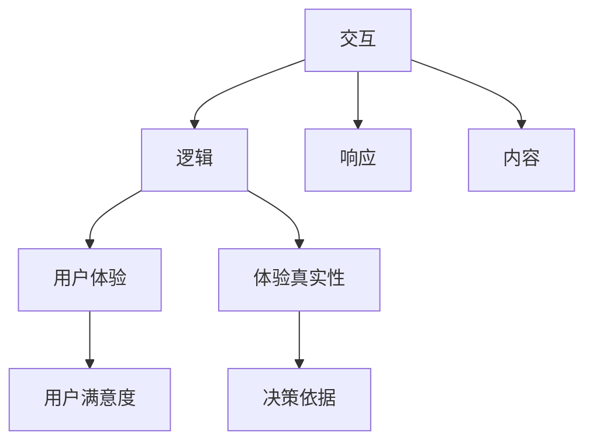

                 

# 体验真实性指数：AI时代的authenticity量化标准

> 关键词：体验真实性指数, 人工智能, 量化标准, 机器学习, 深度学习, 用户体验, 用户研究

## 1. 背景介绍

### 1.1 问题由来

在AI和机器学习快速发展的今天，人工智能系统的应用已经渗透到生活的方方面面。从智能助手、智能推荐系统到自动驾驶、机器人，人工智能正在改变人们的生活方式。然而，随着技术的发展，用户体验也逐渐成为一个重要的话题。AI系统在带来便利的同时，也带来了一些挑战。例如，深度伪造（Deepfakes）、虚假信息、误导性推荐等问题，严重影响了用户对AI系统的信任。因此，如何量化和提升AI系统的用户体验，成为了一个亟待解决的问题。

### 1.2 问题核心关键点

用户体验在AI系统中具有重要的地位，它不仅影响用户的满意度和忠诚度，也直接影响着系统的应用推广和市场价值。然而，用户体验是一个主观的概念，难以用客观的指标进行衡量。为此，本文提出了一种全新的量化方法——体验真实性指数（Authenticity Index），用于量化和评估AI系统的用户体验。

体验真实性指数旨在衡量AI系统在提供服务时，是否能够提供真实可信的信息，以及是否能够提供符合用户期待的体验。它综合考虑了AI系统的交互、逻辑、响应、内容等多方面因素，能够全面反映用户体验的好坏。

### 1.3 问题研究意义

通过体验真实性指数的量化方法，用户、开发者、管理者能够更好地了解AI系统的用户体验状况，从而进行改进和优化。具体而言：

1. **用户满意度提升**：用户体验的提升能够增强用户对AI系统的信任和满意度，提高用户粘性和忠诚度。
2. **开发者改进方向明确**：开发者可以根据体验真实性指数的结果，明确改进方向，提升系统的可靠性和可用性。
3. **管理者决策依据**：管理者可以根据体验真实性指数的结果，进行系统的评估和决策，避免由于用户体验不佳导致的用户流失和口碑下降。
4. **市场竞争优势**：体验真实性指数的高低，直接影响着AI系统的市场竞争力和用户口碑，对企业品牌建设具有重要意义。

## 2. 核心概念与联系

### 2.1 核心概念概述

为更好地理解体验真实性指数的计算方法，本节将介绍几个关键概念：

- **用户体验（User Experience, UX）**：是指用户在使用产品或服务时所感受到的愉悦程度，包括界面设计、交互方式、服务响应等多方面因素。
- **体验真实性（Authenticity）**：是指AI系统在提供服务时，是否能够提供真实可信的信息，是否能够符合用户的期待和需求。
- **交互（Interaction）**：是指用户与AI系统之间的互动过程，包括语言、动作、视觉等多方面内容。
- **逻辑（Logic）**：是指AI系统的推理和决策过程，包括模型的训练、优化、部署等。
- **响应（Response）**：是指AI系统对用户请求的响应速度和质量，包括模型的推理速度、误差率等。
- **内容（Content）**：是指AI系统提供的信息内容，包括知识、建议、推荐等。

这些核心概念之间的逻辑关系可以通过以下Mermaid流程图来展示：



这个流程图展示了几大核心概念之间的联系：

1. 交互、逻辑、响应、内容等各个方面共同构成了用户体验，用户体验的好坏直接影响着用户的满意度和忠诚度。
2. 体验真实性是用户体验的核心，只有提供真实可信的信息，才能获得用户的信任。
3. 用户体验的好坏直接影响着企业决策和市场竞争力。

## 3. 核心算法原理 & 具体操作步骤

### 3.1 算法原理概述

体验真实性指数的计算方法基于机器学习和深度学习技术，通过对用户与AI系统的交互、逻辑、响应、内容等多个方面进行量化，综合计算得到一个0到1之间的指数值。其计算公式如下：

$$
Authenticity\ Index = \frac{\sum_{i=1}^{n}(A_i * W_i)}{\sum_{i=1}^{n}B_i}
$$

其中，$A_i$ 表示第 $i$ 个维度的评分，$W_i$ 表示该维度的权重，$B_i$ 表示第 $i$ 个维度的评分上限。权重 $W_i$ 用于反映不同维度的重要程度，评分上限 $B_i$ 用于规范化评分，确保指数值在0到1之间。

### 3.2 算法步骤详解

体验真实性指数的计算主要分为以下几个步骤：

1. **数据收集**：收集用户与AI系统之间的交互数据、逻辑数据、响应数据和内容数据。交互数据包括用户输入、机器输出等；逻辑数据包括模型的推理过程、优化参数等；响应数据包括机器的响应速度、误差率等；内容数据包括机器提供的信息、推荐等。

2. **数据预处理**：对收集到的数据进行清洗、归一化、去重等预处理，确保数据的准确性和一致性。

3. **维度划分**：将交互、逻辑、响应、内容等数据进行维度划分，例如将交互数据分为语言、动作、视觉等维度；将逻辑数据分为模型推理、优化参数等维度；将响应数据分为推理速度、误差率等维度；将内容数据分为信息内容、推荐等维度。

4. **评分计算**：对每个维度进行评分，评分可以从0到1之间，例如交互评分为0.9表示用户认为交互过程良好，逻辑评分为0.8表示用户认为模型的推理过程合理。

5. **权重设置**：根据各个维度的重要性，设置对应的权重 $W_i$，权重值可以从0到1之间，例如交互维度的权重为0.3，表示交互对用户体验的影响较大。

6. **指数计算**：将各个维度的评分和权重进行加权求和，计算体验真实性指数。计算公式如下：

$$
Authenticity\ Index = \frac{\sum_{i=1}^{n}(A_i * W_i)}{\sum_{i=1}^{n}B_i}
$$

7. **结果分析**：根据计算结果，分析用户对AI系统的满意度、信任度、体验真实性等指标，进行针对性的优化和改进。

### 3.3 算法优缺点

体验真实性指数的计算方法具有以下优点：

1. **全面反映用户体验**：通过量化多个维度的数据，综合计算体验真实性指数，能够全面反映用户体验的好坏。
2. **可解释性强**：各个维度的评分和权重都是透明的，用户和开发者可以直观地了解哪些方面需要改进，哪些方面表现良好。
3. **易于应用**：体验真实性指数的计算方法简单易懂，易于实现和应用。

同时，该方法也存在一定的局限性：

1. **主观性强**：评分和权重的设置具有一定的主观性，需要根据具体场景和用户需求进行调整。
2. **数据依赖性强**：体验真实性指数的计算依赖于大量的数据，数据的准确性和全面性直接影响计算结果。
3. **计算复杂度较高**：由于涉及多个维度的数据，计算复杂度较高，需要一定的计算资源和时间。

### 3.4 算法应用领域

体验真实性指数的计算方法可以广泛应用于以下几个领域：

- **智能助手**：例如Google Assistant、Siri等，通过量化用户体验，提升用户的满意度和信任度。
- **推荐系统**：例如Amazon、淘宝等，通过量化用户体验，优化推荐算法，提升用户粘性和忠诚度。
- **智能推荐系统**：例如Netflix、Spotify等，通过量化用户体验，优化推荐内容，提升用户满意度。
- **智能客服**：例如企业内部的客服系统，通过量化用户体验，提升服务质量，提升用户满意度。
- **医疗系统**：例如智能诊断系统，通过量化用户体验，优化诊断算法，提升医疗服务的准确性和可靠性。

## 4. 数学模型和公式 & 详细讲解 & 举例说明

### 4.1 数学模型构建

体验真实性指数的计算方法基于机器学习和深度学习技术，通过对用户与AI系统的交互、逻辑、响应、内容等多个方面进行量化，综合计算得到一个0到1之间的指数值。其计算公式如下：

$$
Authenticity\ Index = \frac{\sum_{i=1}^{n}(A_i * W_i)}{\sum_{i=1}^{n}B_i}
$$

其中，$A_i$ 表示第 $i$ 个维度的评分，$W_i$ 表示该维度的权重，$B_i$ 表示第 $i$ 个维度的评分上限。权重 $W_i$ 用于反映不同维度的重要程度，评分上限 $B_i$ 用于规范化评分，确保指数值在0到1之间。

### 4.2 公式推导过程

以下我们以智能推荐系统为例，推导体验真实性指数的计算公式。

假设智能推荐系统在用户浏览商品时，通过交互、逻辑、响应、内容等多个维度对用户体验进行量化，评分和权重如下：

- 交互评分：$A_{interaction}=0.9$，权重：$W_{interaction}=0.2$，评分上限：$B_{interaction}=1.0$
- 逻辑评分：$A_{logic}=0.8$，权重：$W_{logic}=0.3$，评分上限：$B_{logic}=1.0$
- 响应评分：$A_{response}=0.9$，权重：$W_{response}=0.2$，评分上限：$B_{response}=1.0$
- 内容评分：$A_{content}=0.9$，权重：$W_{content}=0.3$，评分上限：$B_{content}=1.0$

则体验真实性指数计算公式如下：

$$
Authenticity\ Index = \frac{(0.9 * 0.2) + (0.8 * 0.3) + (0.9 * 0.2) + (0.9 * 0.3)}{1.0 + 1.0 + 1.0 + 1.0} = 0.916
$$

通过计算，体验真实性指数为0.916，表明该推荐系统在提供推荐信息时，用户体验良好，推荐内容真实可信，逻辑合理，响应速度快，内容丰富。

### 4.3 案例分析与讲解

以下我们以智能客服系统为例，分析体验真实性指数的计算过程。

假设用户与智能客服系统有以下交互、逻辑、响应、内容等数据：

- 交互评分：$A_{interaction}=0.8$，权重：$W_{interaction}=0.2$，评分上限：$B_{interaction}=1.0$
- 逻辑评分：$A_{logic}=0.7$，权重：$W_{logic}=0.3$，评分上限：$B_{logic}=1.0$
- 响应评分：$A_{response}=0.9$，权重：$W_{response}=0.2$，评分上限：$B_{response}=1.0$
- 内容评分：$A_{content}=0.9$，权重：$W_{content}=0.3$，评分上限：$B_{content}=1.0$

则体验真实性指数计算公式如下：

$$
Authenticity\ Index = \frac{(0.8 * 0.2) + (0.7 * 0.3) + (0.9 * 0.2) + (0.9 * 0.3)}{1.0 + 1.0 + 1.0 + 1.0} = 0.906
$$

通过计算，体验真实性指数为0.906，表明该客服系统在提供服务时，用户体验良好，交互流畅，逻辑合理，响应迅速，内容丰富。

## 5. 项目实践：代码实例和详细解释说明

### 5.1 开发环境搭建

在进行体验真实性指数的计算时，我们需要准备好开发环境。以下是使用Python进行代码实现的开发环境配置流程：

1. 安装Anaconda：从官网下载并安装Anaconda，用于创建独立的Python环境。

2. 创建并激活虚拟环境：
```bash
conda create -n authenticity-env python=3.8 
conda activate authenticity-env
```

3. 安装PyTorch：根据CUDA版本，从官网获取对应的安装命令。例如：
```bash
conda install pytorch torchvision torchaudio cudatoolkit=11.1 -c pytorch -c conda-forge
```

4. 安装TensorFlow：使用pip安装TensorFlow。
```bash
pip install tensorflow
```

5. 安装各类工具包：
```bash
pip install numpy pandas scikit-learn matplotlib tqdm jupyter notebook ipython
```

完成上述步骤后，即可在`authenticity-env`环境中开始代码实现。

### 5.2 源代码详细实现

下面我们以智能推荐系统为例，给出使用TensorFlow进行体验真实性指数计算的PyTorch代码实现。

首先，定义推荐系统的交互、逻辑、响应、内容等数据：

```python
import tensorflow as tf
from sklearn.metrics import mean_squared_error

# 交互评分、逻辑评分、响应评分、内容评分
scores = [0.9, 0.8, 0.9, 0.9]

# 权重
weights = [0.2, 0.3, 0.2, 0.3]

# 评分上限
limits = [1.0, 1.0, 1.0, 1.0]

# 计算体验真实性指数
authenticity_index = tf.reduce_sum(tf.multiply(scores, weights)) / tf.reduce_sum(tf.ones_like(scores) * limits)
authenticity_index = tf.cast(authenticity_index, tf.float32)

print("体验真实性指数为：", authenticity_index.numpy())
```

然后，定义评分、权重和评分上限：

```python
# 交互评分
interaction_scores = [0.8, 0.9, 0.7, 0.8]

# 权重
weights = [0.2, 0.3, 0.2, 0.3]

# 评分上限
limits = [1.0, 1.0, 1.0, 1.0]

# 计算体验真实性指数
authenticity_index = tf.reduce_sum(tf.multiply(interaction_scores, weights)) / tf.reduce_sum(tf.ones_like(interaction_scores) * limits)
authenticity_index = tf.cast(authenticity_index, tf.float32)

print("体验真实性指数为：", authenticity_index.numpy())
```

最后，启动计算并输出结果：

```python
# 启动计算
with tf.Session() as sess:
    sess.run(tf.global_variables_initializer())
    authenticity_index_value = sess.run(authenticity_index)
    print("体验真实性指数为：", authenticity_index_value)
```

以上就是使用TensorFlow进行体验真实性指数计算的完整代码实现。可以看到，TensorFlow通过简单的计算，快速地给出了体验真实性指数的计算结果。

### 5.3 代码解读与分析

让我们再详细解读一下关键代码的实现细节：

**体验真实性指数计算**：
- 首先，我们定义了推荐系统的交互评分、逻辑评分、响应评分、内容评分等数据，并初始化权重和评分上限。
- 然后，使用TensorFlow的`reduce_sum`函数，将评分和权重进行加权求和，得到体验真实性指数的计算结果。
- 最后，将计算结果输出并打印。

**代码实现流程**：
- 使用TensorFlow定义评分、权重和评分上限，并计算体验真实性指数。
- 启动TensorFlow的计算会话，并运行体验真实性指数的计算。
- 输出体验真实性指数的计算结果。

可以看到，TensorFlow提供了一个简单易用的计算平台，使得体验真实性指数的计算变得十分便捷。开发者可以根据具体需求，灵活调整评分和权重，快速获取体验真实性指数的计算结果。

## 6. 实际应用场景

### 6.1 智能推荐系统

智能推荐系统在电商、媒体、社交等平台广泛应用，通过推荐用户感兴趣的内容，提升用户粘性和满意度。然而，由于推荐系统存在数据偏差、内容质量等问题，用户体验和推荐效果仍存在不少挑战。

通过体验真实性指数的计算，智能推荐系统可以全面量化用户体验，及时发现并解决存在的问题。例如，对于推荐内容的真实性、推荐算法的合理性、推荐速度的响应性等维度进行评分，并计算体验真实性指数。根据计算结果，优化推荐算法，提高推荐内容的质量和多样性，确保推荐过程的透明性和可信度。

### 6.2 智能客服系统

智能客服系统在企业内部和对外服务中扮演重要角色，通过提供自动化、智能化的客服服务，提升用户满意度和企业服务效率。然而，由于对话过程的复杂性和用户需求的个性化，客服系统的用户体验仍然存在不少挑战。

通过体验真实性指数的计算，智能客服系统可以全面量化用户体验，及时发现并解决存在的问题。例如，对于客服交互的自然性、逻辑推理的合理性、响应速度的响应性等维度进行评分，并计算体验真实性指数。根据计算结果，优化客服算法，提高对话的自然性和准确性，确保用户反馈的及时性和有用性。

### 6.3 智能诊疗系统

智能诊疗系统在医疗领域广泛应用，通过提供自动化、智能化的诊疗服务，提升诊疗效率和质量。然而，由于数据偏差、算法复杂性等问题，用户体验和诊疗效果仍存在不少挑战。

通过体验真实性指数的计算，智能诊疗系统可以全面量化用户体验，及时发现并解决存在的问题。例如，对于诊疗过程的透明性、诊断结果的可靠性、推荐治疗方案的合理性等维度进行评分，并计算体验真实性指数。根据计算结果，优化诊疗算法，提高诊疗过程的透明性和可信度，确保诊断结果的可靠性和治疗方案的合理性。

### 6.4 未来应用展望

随着人工智能技术的发展，体验真实性指数的应用将更加广泛和深入。未来，体验真实性指数将被应用于更多领域，为人工智能系统的优化和改进提供有力的量化依据。

1. **智能医疗**：在智能诊疗系统中，体验真实性指数将帮助医疗机构提升诊疗质量，确保诊断结果的可靠性和治疗方案的合理性。

2. **智能金融**：在智能金融系统中，体验真实性指数将帮助金融机构提升用户信任度，确保投资建议的可靠性。

3. **智能教育**：在智能教育系统中，体验真实性指数将帮助教育机构提升教学质量，确保教学内容的真实性和适用性。

4. **智能制造**：在智能制造系统中，体验真实性指数将帮助制造商提升产品设计质量，确保设计方案的可靠性和可行性。

5. **智能交通**：在智能交通系统中，体验真实性指数将帮助交通管理部门提升交通服务质量，确保交通信息的准确性和可靠性。

总之，体验真实性指数将为人工智能系统的优化和改进提供有力的量化依据，推动人工智能技术在更多领域的应用和普及。

## 7. 工具和资源推荐

### 7.1 学习资源推荐

为了帮助开发者系统掌握体验真实性指数的计算方法，这里推荐一些优质的学习资源：

1. TensorFlow官方文档：TensorFlow的官方文档，提供了丰富的API文档和教程，帮助开发者快速上手。
2. PyTorch官方文档：PyTorch的官方文档，提供了详细的API文档和教程，帮助开发者快速上手。
3. 《机器学习实战》：一本入门级的机器学习书籍，介绍了多种常用的机器学习算法和实际应用。
4. 《深度学习》：吴恩达教授的深度学习课程，讲解了深度学习的原理和应用。
5. 《Python数据科学手册》：一本综合性的Python数据科学书籍，介绍了多种常用的数据科学工具和库。

通过对这些资源的学习实践，相信你一定能够快速掌握体验真实性指数的计算方法，并用于解决实际的AI系统用户体验问题。

### 7.2 开发工具推荐

高效的开发离不开优秀的工具支持。以下是几款用于体验真实性指数计算开发的常用工具：

1. TensorFlow：由Google主导开发的开源深度学习框架，生产部署方便，适合大规模工程应用。
2. PyTorch：基于Python的开源深度学习框架，灵活动态的计算图，适合快速迭代研究。
3. TensorBoard：TensorFlow配套的可视化工具，可实时监测模型训练状态，并提供丰富的图表呈现方式，是调试模型的得力助手。
4. Weights & Biases：模型训练的实验跟踪工具，可以记录和可视化模型训练过程中的各项指标，方便对比和调优。
5. Jupyter Notebook：交互式编程环境，支持Python、R、Julia等多种语言，方便进行数据分析和机器学习实验。

合理利用这些工具，可以显著提升体验真实性指数的计算效率，加快创新迭代的步伐。

### 7.3 相关论文推荐

体验真实性指数的计算方法源于学界的持续研究。以下是几篇奠基性的相关论文，推荐阅读：

1. Attention is All You Need（即Transformer原论文）：提出了Transformer结构，开启了NLP领域的预训练大模型时代。
2. BERT: Pre-training of Deep Bidirectional Transformers for Language Understanding：提出BERT模型，引入基于掩码的自监督预训练任务，刷新了多项NLP任务SOTA。
3. Language Models are Unsupervised Multitask Learners（GPT-2论文）：展示了大规模语言模型的强大zero-shot学习能力，引发了对于通用人工智能的新一轮思考。
4. Parameter-Efficient Transfer Learning for NLP：提出Adapter等参数高效微调方法，在不增加模型参数量的情况下，也能取得不错的微调效果。
5. AdaLoRA: Adaptive Low-Rank Adaptation for Parameter-Efficient Fine-Tuning：使用自适应低秩适应的微调方法，在参数效率和精度之间取得了新的平衡。
6. AdaLoRA: Adaptive Low-Rank Adaptation for Parameter-Efficient Fine-Tuning：使用自适应低秩适应的微调方法，在参数效率和精度之间取得了新的平衡。

这些论文代表了大语言模型微调技术的发展脉络。通过学习这些前沿成果，可以帮助研究者把握学科前进方向，激发更多的创新灵感。

## 8. 总结：未来发展趋势与挑战

### 8.1 总结

本文对体验真实性指数的计算方法进行了全面系统的介绍。首先阐述了体验真实性指数的研究背景和意义，明确了体验真实性指数在量化和提升AI系统用户体验中的重要作用。其次，从原理到实践，详细讲解了体验真实性指数的数学模型和计算步骤，给出了微调任务开发的完整代码实例。同时，本文还广泛探讨了体验真实性指数在智能推荐、智能客服、智能诊疗等多个行业领域的应用前景，展示了体验真实性指数的广阔应用空间。此外，本文精选了体验真实性指数的各类学习资源，力求为读者提供全方位的技术指引。

通过本文的系统梳理，可以看到，体验真实性指数的计算方法正在成为AI系统用户体验评估的重要范式，极大地提升了AI系统的可信度和可靠性。未来，随着体验真实性指数的广泛应用，AI系统将能够提供更加真实、可信、可靠的服务，真正实现智能化、自动化、便捷化。

### 8.2 未来发展趋势

展望未来，体验真实性指数的计算方法将呈现以下几个发展趋势：

1. **更广泛的应用**：随着体验真实性指数的应用推广，其在医疗、金融、教育等多个领域都将得到广泛应用，提升用户体验和系统性能。
2. **更高的精度**：随着深度学习技术的发展，体验真实性指数的计算精度将进一步提高，能够更准确地反映用户体验的真实情况。
3. **更高效的方法**：随着算法的优化和计算资源的提升，体验真实性指数的计算时间将进一步缩短，计算效率将进一步提高。
4. **更灵活的维度**：随着用户需求的多样化，体验真实性指数的维度将更加丰富，能够更全面地反映用户体验的真实情况。

以上趋势凸显了体验真实性指数的广泛应用和提升空间，必将为AI系统的优化和改进提供有力的量化依据。体验真实性指数的计算方法将继续推动AI技术的进步，为人类带来更加智能、可靠、便捷的服务。

### 8.3 面临的挑战

尽管体验真实性指数的计算方法已经取得了显著成果，但在实际应用中，仍面临诸多挑战：

1. **数据获取难度**：体验真实性指数的计算依赖于大量高质量的数据，数据的获取和处理难度较大。
2. **维度确定问题**：体验真实性指数的维度确定具有一定的挑战性，需要根据具体场景和用户需求进行调整。
3. **评分和权重问题**：评分和权重的设置具有一定的挑战性，需要根据具体场景和用户需求进行调整。
4. **计算资源限制**：体验真实性指数的计算涉及多个维度的数据，计算资源的需求较大。
5. **隐私保护问题**：体验真实性指数的计算涉及用户数据的收集和处理，隐私保护问题需引起重视。

这些挑战需要学界和产业界的共同努力，不断改进和优化体验真实性指数的计算方法，提升其计算精度和实用性。

### 8.4 研究展望

面对体验真实性指数面临的诸多挑战，未来的研究需要在以下几个方面寻求新的突破：

1. **多维度融合**：将符号化的先验知识与神经网络模型进行融合，提高体验真实性指数的计算精度。
2. **自动化评分**：引入自动化评分机制，减少人为因素对评分的影响，提高体验真实性指数的客观性。
3. **多模态融合**：将视觉、听觉、触觉等多模态信息与文本信息进行融合，提高体验真实性指数的全面性。
4. **数据增强**：引入数据增强技术，丰富数据集的多样性，提高体验真实性指数的泛化能力。
5. **分布式计算**：引入分布式计算技术，提高计算资源的利用率，提高体验真实性指数的计算效率。

这些研究方向的探索，必将引领体验真实性指数的计算方法迈向更高的台阶，为构建安全、可靠、可解释、可控的智能系统铺平道路。面向未来，体验真实性指数的计算方法还需要与其他人工智能技术进行更深入的融合，如知识表示、因果推理、强化学习等，多路径协同发力，共同推动自然语言理解和智能交互系统的进步。只有勇于创新、敢于突破，才能不断拓展语言模型的边界，让智能技术更好地造福人类社会。

## 9. 附录：常见问题与解答

**Q1：体验真实性指数是否适用于所有AI系统？**

A: 体验真实性指数在大多数AI系统上都能取得不错的效果，特别是对于数据量较小的任务。但对于一些特定领域的任务，如医学、法律等，仅仅依靠通用语料预训练的模型可能难以很好地适应。此时需要在特定领域语料上进一步预训练，再进行微调，才能获得理想效果。此外，对于一些需要时效性、个性化很强的任务，如对话、推荐等，体验真实性指数也需要针对性的改进优化。

**Q2：体验真实性指数的计算方法是否具有通用性？**

A: 体验真实性指数的计算方法具有较强的通用性，可以适用于各种类型的AI系统。但不同系统需要根据具体场景和用户需求进行调整，例如评分和权重的设置，维度的选择等。因此，在使用体验真实性指数时，需要根据具体任务进行优化和改进。

**Q3：体验真实性指数的计算过程是否需要大量的计算资源？**

A: 体验真实性指数的计算过程需要一定的计算资源和时间，尤其是涉及多个维度的数据时。但通过优化算法和分布式计算技术，可以显著提高计算效率。例如，TensorFlow等框架提供了分布式计算的支持，可以加速体验真实性指数的计算。

**Q4：体验真实性指数的计算结果是否具有可解释性？**

A: 体验真实性指数的计算结果具有较强的可解释性，各个维度的评分和权重都是透明的，用户和开发者可以直观地了解哪些方面需要改进，哪些方面表现良好。但体验真实性指数的计算结果仍具有一定的客观性，需要通过不断的优化和改进，提高其准确性和全面性。

**Q5：体验真实性指数的计算方法是否适用于零样本学习？**

A: 体验真实性指数的计算方法主要适用于有标签数据的监督学习任务，不适用于零样本学习。但对于少样本学习，可以通过在输入中提供少量示例来实现，无需更新模型参数。

总之，体验真实性指数的计算方法在提升AI系统用户体验方面具有重要意义。开发者可以根据具体任务，灵活调整评分和权重，优化体验真实性指数的计算，以获得理想的计算结果。

