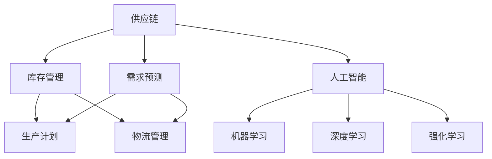

                 

# 供应链优化的AI解决方案

在当今全球化的商业环境中，供应链管理成为企业竞争力的关键之一。高效、透明的供应链能够帮助企业降低成本、提高响应速度，进而提升客户满意度。随着AI技术的迅猛发展，AI驱动的供应链优化解决方案正逐步成为企业提升供应链效率的重要手段。本文将系统介绍AI在供应链优化中的关键应用，从核心概念、算法原理到实际案例，为你展现AI在供应链优化中的强大潜力和未来展望。

## 1. 背景介绍

### 1.1 问题由来

随着全球化的加速，供应链变得越来越复杂。企业需要应对不断变化的客户需求、多变的市场环境以及各种不确定性因素，如自然灾害、疫情等。传统的供应链管理方式，如定期盘点、库存管理等，已无法满足现代企业的需求。因此，企业迫切需要一种智能、高效的供应链管理方法，以应对这些挑战。

AI技术的快速发展，为供应链优化带来了新的可能性。AI可以通过数据分析、预测建模、自动化流程等方式，提升供应链管理的精度和效率。AI在供应链中的应用，已逐步从预测需求、库存管理等初步应用，深入到优化生产计划、物流管理等多个领域。

### 1.2 问题核心关键点

供应链优化中的AI应用，核心在于通过数据驱动的方式，构建更精准的供应链预测和决策模型。具体包括：
- 需求预测：利用历史销售数据和市场趋势，预测未来的需求变化。
- 库存管理：根据需求预测结果，调整库存水平，减少库存积压或短缺。
- 生产计划：根据需求预测和库存状态，优化生产计划，提高生产效率。
- 物流管理：通过优化运输路线和仓储布局，降低物流成本，提高运输效率。

这些AI应用不仅提高了供应链管理的效率和透明度，还能够帮助企业更快地响应市场变化，增强竞争力。

## 2. 核心概念与联系

### 2.1 核心概念概述

为更好地理解AI在供应链优化中的关键应用，本节将介绍几个密切相关的核心概念：

- 供应链(Supply Chain)：由供应商、制造商、分销商、零售商等组成的网络，涉及物料采购、生产、库存、运输等多个环节。

- 需求预测(Demand Forecasting)：通过历史数据和市场趋势，预测未来的需求变化。需求预测是供应链优化的重要基础。

- 库存管理(Inventory Management)：通过精准的需求预测，调整库存水平，避免库存积压或短缺。

- 生产计划(Production Planning)：根据需求预测和库存状态，优化生产计划，提高生产效率。

- 物流管理(Logistics Management)：通过优化运输路线和仓储布局，降低物流成本，提高运输效率。

- 人工智能(Artificial Intelligence, AI)：通过算法和大数据，模拟人类智能的行为，解决复杂问题。

- 机器学习(Machine Learning, ML)：使计算机通过数据学习，自动改进算法，提高决策的准确性。

- 深度学习(Deep Learning, DL)：通过多层神经网络，处理高维度、非结构化数据，提升预测和决策的精度。

- 强化学习(Reinforcement Learning, RL)：通过与环境的交互，优化决策策略，增强模型的自主性。

这些核心概念之间的逻辑关系可以通过以下Mermaid流程图来展示：



这个流程图展示了大语言模型的核心概念及其之间的关系：

1. 供应链管理涉及多个环节，其中需求预测和库存管理是基础。
2. 机器学习、深度学习和强化学习是AI在供应链优化中应用的主要技术手段。
3. AI通过这些技术手段，对供应链管理进行优化和智能化。

这些概念共同构成了AI在供应链优化中的基本框架，使得企业能够利用先进技术，提升供应链效率和响应能力。

## 3. 核心算法原理 & 具体操作步骤
### 3.1 算法原理概述

AI在供应链优化中的应用，核心是通过数据分析和建模，实现对供应链环节的智能预测和优化。具体而言，主要包括以下几个关键步骤：

1. **数据收集与处理**：收集供应链各环节的历史数据，包括销售数据、库存数据、生产数据、物流数据等，并进行清洗、归一化处理。

2. **需求预测**：利用时间序列分析、回归分析、神经网络等方法，构建需求预测模型，预测未来的需求变化。

3. **库存管理**：根据需求预测结果，调整库存水平，制定最优的库存策略，避免库存积压或短缺。

4. **生产计划**：结合需求预测和库存状态，优化生产计划，提高生产效率。

5. **物流管理**：通过优化运输路线和仓储布局，降低物流成本，提高运输效率。

6. **模型训练与评估**：利用历史数据训练预测模型，通过交叉验证等方法评估模型的精度和泛化能力，确保模型在实际应用中的效果。

7. **持续优化**：基于新数据和新环境，持续优化模型，提高供应链管理的准确性和效率。

### 3.2 算法步骤详解

以下我们将详细讲解AI在供应链优化中的各个步骤：

**Step 1: 数据收集与处理**

- **数据来源**：供应链各环节的历史数据，包括销售数据、库存数据、生产数据、物流数据等。
- **数据清洗**：去除缺失值、异常值，标准化数据格式，确保数据质量。
- **特征工程**：提取有意义的特征，如销售趋势、季节性变化、库存水平等，增强模型的预测能力。

**Step 2: 需求预测**

- **时间序列分析**：利用ARIMA、SARIMA等方法，分析时间序列数据的趋势和季节性变化，构建预测模型。
- **回归分析**：通过多元线性回归、随机森林等方法，构建回归模型，预测需求变化。
- **神经网络**：构建深度神经网络，利用历史数据和市场趋势，预测未来的需求变化。

**Step 3: 库存管理**

- **库存策略**：根据需求预测结果，制定最优的库存策略，包括安全库存、再订货点等。
- **库存调整**：结合实时数据，动态调整库存水平，保持库存的合理性。

**Step 4: 生产计划**

- **生产调度**：根据需求预测和库存状态，优化生产计划，提高生产效率。
- **资源分配**：合理分配生产资源，如人力资源、设备资源，提高生产效率。

**Step 5: 物流管理**

- **运输优化**：通过优化运输路线和仓储布局，降低物流成本，提高运输效率。
- **配送计划**：制定最优的配送计划，确保订单及时送达。

**Step 6: 模型训练与评估**

- **模型训练**：利用历史数据训练预测模型，确保模型能够准确预测未来的需求变化。
- **模型评估**：通过交叉验证等方法，评估模型的精度和泛化能力，确保模型在实际应用中的效果。

**Step 7: 持续优化**

- **模型更新**：基于新数据和新环境，持续更新和优化模型，提高供应链管理的准确性和效率。
- **环境监控**：实时监控供应链环境，及时调整预测模型和库存策略，确保供应链管理的稳定性。

### 3.3 算法优缺点

AI在供应链优化中的应用，具有以下优点：
1. 高效准确：利用大数据和先进算法，能够实现对供应链环节的精准预测和优化。
2. 实时响应：通过实时监控和动态调整，能够快速响应市场需求变化，提升供应链的灵活性。
3. 降低成本：优化库存、生产、物流等环节，能够降低供应链管理成本，提升企业竞争力。
4. 提高效率：通过智能化管理，提高供应链各环节的效率，提升客户满意度。

同时，该方法也存在一定的局限性：
1. 数据质量要求高：供应链优化对数据的准确性和完整性要求较高，数据缺失或不准确可能导致模型失效。
2. 模型复杂度高：构建和训练复杂模型，需要大量计算资源和时间。
3. 技术门槛高：需要具备一定的技术背景，才能实现模型的设计和优化。
4. 模型依赖性强：模型的效果依赖于数据的丰富程度和多样性，需要不断补充和更新数据。

尽管存在这些局限性，但就目前而言，AI在供应链优化中的应用已显示出巨大的潜力和优势，是企业提升供应链效率的重要手段。

### 3.4 算法应用领域

AI在供应链优化中的应用，已经广泛渗透到各个领域，例如：

- **制造业**：通过AI优化生产计划、库存管理、质量控制等环节，提升生产效率和产品质量。
- **零售业**：利用AI预测需求变化，优化库存和配送计划，提升客户购物体验。
- **物流行业**：通过AI优化运输路线和仓储布局，降低物流成本，提高运输效率。
- **供应链金融**：利用AI进行信用评估、风险管理、欺诈检测等，提升供应链金融服务质量。
- **农产品供应链**：利用AI预测市场需求，优化种植、采摘、运输等环节，提升农产品质量和销售效率。

## 4. 数学模型和公式 & 详细讲解
### 4.1 数学模型构建

本节将使用数学语言对AI在供应链优化中的关键应用进行更加严格的刻画。

记供应链的某环节为 $S_i$，包含 $n$ 个时间点的数据 $D_i=\{d_{i,t}\}_{t=1}^n$，其中 $d_{i,t}$ 为时间 $t$ 的观测数据。假设需求预测模型的参数为 $\theta$，则需求预测函数为：

$$
f_i(\theta) = \sum_{t=1}^n w_{i,t}d_{i,t} + \theta
$$

其中 $w_{i,t}$ 为时间 $t$ 的权重系数。

需求预测的误差为 $e_i = d_{i,t} - f_i(\theta)$，需求预测的目标是最小化误差，即：

$$
\min_\theta \sum_{i=1}^n \sum_{t=1}^n e_i^2
$$

通过求解上述优化问题，可以得到最优的需求预测模型。

### 4.2 公式推导过程

以下我们以时间序列分析为例，推导ARIMA模型的预测公式及其梯度计算。

假设时间序列 $y_t$ 服从自回归移动平均模型 $ARIMA(p,d,q)$，其中 $p$ 为自回归阶数，$d$ 为差分阶数，$q$ 为移动平均阶数。则模型可表示为：

$$
y_t = c + \sum_{i=1}^p \phi_i y_{t-i} + \sum_{j=1}^q \theta_j \epsilon_{t-j} + \epsilon_t
$$

其中 $\phi_i$ 为自回归系数，$\theta_j$ 为移动平均系数，$\epsilon_t$ 为误差项。

利用最大似然估计方法，可以构建似然函数：

$$
L(\theta) = \prod_{t=1}^N \mathcal{N}(y_t; \mu_t, \sigma^2)
$$

其中 $\mu_t = c + \sum_{i=1}^p \phi_i y_{t-i} + \sum_{j=1}^q \theta_j \epsilon_{t-j}$，$\sigma^2 = \frac{1}{N}\sum_{t=1}^N (y_t - \mu_t)^2$。

对似然函数求导，可以得到梯度公式：

$$
\frac{\partial L(\theta)}{\partial \theta} = \sum_{t=1}^N \frac{y_t - \mu_t}{\sigma^2}
$$

通过求解梯度公式，可以更新模型参数 $\theta$，最小化预测误差。

### 4.3 案例分析与讲解

以一个简单的需求预测案例为例，展示如何使用ARIMA模型进行供应链需求预测：

假设某电商平台的销售额 $y_t$ 服从ARIMA(2,1,1)模型，即 $y_t = c + 0.5y_{t-1} + 0.3y_{t-2} + \theta \epsilon_{t-1} + \epsilon_t$。已知历史数据 $D=\{y_1, y_2, \ldots, y_10\}$，利用最大似然估计方法，求得模型参数 $\theta$，并用于预测未来的销售额。

步骤如下：
1. 对原始数据进行差分处理，得到平稳时间序列 $D'=\{y'_1, y'_2, \ldots, y'_9\}$。
2. 构建ARIMA模型，求解最大似然估计，得到模型参数 $\theta$。
3. 利用模型参数 $\theta$，预测未来的销售额 $y_{11}, y_{12}, \ldots, y_{20}$。

在实际应用中，可以结合实际需求，调整模型的阶数和参数，得到更准确的预测结果。

## 5. 项目实践：代码实例和详细解释说明
### 5.1 开发环境搭建

在进行供应链优化AI解决方案的开发前，我们需要准备好开发环境。以下是使用Python进行Scikit-learn和Pandas库的环境配置流程：

1. 安装Anaconda：从官网下载并安装Anaconda，用于创建独立的Python环境。

2. 创建并激活虚拟环境：
```bash
conda create -n scikit-learn-env python=3.8 
conda activate scikit-learn-env
```

3. 安装Scikit-learn和Pandas：
```bash
pip install scikit-learn pandas
```

4. 安装其他工具包：
```bash
pip install numpy matplotlib scikit-learn statsmodels statsmodels
```

完成上述步骤后，即可在`scikit-learn-env`环境中开始供应链优化AI解决方案的开发。

### 5.2 源代码详细实现

下面我们以一个简单的需求预测案例为例，给出使用Scikit-learn库进行供应链需求预测的Python代码实现。

首先，定义需求预测函数：

```python
from sklearn.linear_model import ARIMA
import pandas as pd

def demand_forecast(X, order=(2,1,1)):
    model = ARIMA(X, order=order)
    model.fit(X)
    forecast = model.forecast(steps=10)
    return forecast
```

然后，定义数据预处理和分析函数：

```python
def preprocess_data(X):
    X_diff = X.diff(1)
    X_diff.dropna(inplace=True)
    return X_diff

def analyze_data(X, order=(2,1,1)):
    X_diff = preprocess_data(X)
    model = ARIMA(X_diff, order=order)
    model.fit(X_diff)
    forecast = model.forecast(steps=10)
    return forecast
```

最后，在Jupyter Notebook中调用函数进行需求预测：

```python
import matplotlib.pyplot as plt

# 加载历史数据
data = pd.read_csv('sales_data.csv', index_col='date')

# 需求预测
forecast = analyze_data(data['sales'])

# 可视化预测结果
plt.plot(data.index, data['sales'], label='Actual')
plt.plot(data.index, forecast, label='Forecast')
plt.legend()
plt.show()
```

以上就是使用Scikit-learn库进行供应链需求预测的完整代码实现。可以看到，Scikit-learn库提供了简单易用的ARIMA模型，使得需求预测的开发和应用变得更加便捷。

### 5.3 代码解读与分析

让我们再详细解读一下关键代码的实现细节：

**demand_forecast函数**：
- 利用Scikit-learn库的ARIMA模型，构建需求预测模型。
- 利用训练数据进行模型拟合，并预测未来的需求变化。
- 返回预测结果。

**preprocess_data函数**：
- 对原始数据进行差分处理，得到平稳时间序列。
- 移除数据中的缺失值。
- 返回处理后的数据。

**analyze_data函数**：
- 对处理后的数据构建ARIMA模型。
- 利用训练数据进行模型拟合。
- 预测未来的需求变化。
- 返回预测结果。

**需求预测代码**：
- 加载历史销售数据，调用analyze_data函数进行需求预测。
- 可视化实际需求和预测需求，评估模型的效果。

可以看到，Scikit-learn库的ARIMA模型在实际应用中非常简便易用，可以迅速搭建需求预测系统。当然，在实际应用中，需要根据具体情况调整模型参数，以获取更准确的预测结果。

## 6. 实际应用场景
### 6.1 智能制造

在制造业中，智能制造已成为提升生产效率和质量的重要手段。AI驱动的供应链优化技术，可以提升物料采购、生产调度、质量控制等环节的智能化水平，降低生产成本，提高生产效率。

具体而言，AI可以通过分析历史数据，预测原材料需求，优化生产计划，减少物料积压和短缺。同时，AI还可以通过图像识别、智能传感器等技术，实时监测生产过程中的质量问题，及时调整生产流程，提升产品质量。

### 6.2 电商零售

在电商零售领域，AI驱动的供应链优化技术可以提升库存管理和配送效率，降低物流成本，提升客户满意度。

具体而言，AI可以通过分析历史销售数据，预测未来的销售趋势，优化库存水平，避免库存积压和短缺。同时，AI还可以通过优化配送路线，提高配送效率，确保订单及时送达。

### 6.3 物流管理

在物流管理中，AI驱动的供应链优化技术可以提升运输效率，降低物流成本，提升客户服务质量。

具体而言，AI可以通过优化运输路线和仓储布局，降低物流成本，提高运输效率。同时，AI还可以通过实时监控和调度，确保货物及时送达，提升客户服务质量。

### 6.4 供应链金融

在供应链金融领域，AI驱动的供应链优化技术可以提升信用评估、风险管理、欺诈检测等环节的智能化水平，降低金融风险，提升金融服务质量。

具体而言，AI可以通过分析供应链各环节的数据，构建信用评估模型，提升金融机构的授信决策能力。同时，AI还可以通过实时监控和风险预警，及时发现和处理供应链中的风险问题，降低金融风险。

## 7. 工具和资源推荐
### 7.1 学习资源推荐

为了帮助开发者系统掌握供应链优化中的AI应用，这里推荐一些优质的学习资源：

1. **《Python数据科学手册》**：一本全面介绍Python在数据分析、机器学习等领域应用的经典书籍，非常适合供应链优化中的AI学习。

2. **Coursera《机器学习》课程**：由斯坦福大学Andrew Ng教授开设的机器学习课程，系统讲解机器学习的基本概念和算法，是供应链优化中的必备学习资源。

3. **Kaggle**：一个数据科学竞赛平台，提供大量真实供应链数据集，可用于实践和竞赛。

4. **Scikit-learn官方文档**：Scikit-learn库的官方文档，提供了详细的模型使用方法和示例代码，是供应链优化中的重要参考。

5. **Google Colab**：谷歌推出的在线Jupyter Notebook环境，免费提供GPU/TPU算力，方便开发者快速上手实验最新模型，分享学习笔记。

通过对这些资源的学习实践，相信你一定能够快速掌握供应链优化中的AI应用，并用于解决实际的供应链管理问题。

### 7.2 开发工具推荐

高效的开发离不开优秀的工具支持。以下是几款用于供应链优化中的AI开发工具：

1. **Jupyter Notebook**：一个交互式开发环境，支持Python、R等多种语言，适合数据分析和机器学习任务的开发。

2. **Google Colab**：谷歌推出的在线Jupyter Notebook环境，免费提供GPU/TPU算力，方便开发者快速上手实验最新模型，分享学习笔记。

3. **TensorFlow**：由Google主导开发的深度学习框架，支持分布式训练，适用于大规模机器学习任务的开发。

4. **PyTorch**：由Facebook开发的深度学习框架，灵活高效，适用于复杂模型的训练和推理。

5. **Keras**：一个高级深度学习框架，提供了简单易用的API，适合快速原型开发和模型验证。

6. **AWS SageMaker**：亚马逊推出的云端机器学习平台，提供多种深度学习框架和工具，支持分布式训练和模型部署。

合理利用这些工具，可以显著提升供应链优化中的AI开发效率，加快创新迭代的步伐。

### 7.3 相关论文推荐

供应链优化中的AI应用，涉及多个前沿领域，以下是几篇奠基性的相关论文，推荐阅读：

1. **《机器学习在供应链管理中的应用》**：总结了机器学习在供应链优化中的经典应用，包括需求预测、库存管理、生产计划等。

2. **《基于深度学习的供应链优化》**：介绍深度学习在供应链优化中的应用，包括需求预测、物流管理等。

3. **《强化学习在供应链管理中的应用》**：介绍强化学习在供应链优化中的经典应用，包括生产计划、库存管理等。

4. **《供应链优化中的预测建模》**：总结了多种预测模型在供应链优化中的应用，包括时间序列分析、回归分析、深度学习等。

5. **《基于深度学习的供应链可视化》**：介绍深度学习在供应链可视化中的应用，通过可视化工具提升供应链管理的透明度和效率。

这些论文代表了大语言模型微调技术的发展脉络。通过学习这些前沿成果，可以帮助研究者把握学科前进方向，激发更多的创新灵感。

## 8. 总结：未来发展趋势与挑战

### 8.1 总结

本文对供应链优化中的AI应用进行了全面系统的介绍。首先阐述了AI在供应链优化中的重要应用，明确了AI在供应链管理中的核心作用。其次，从原理到实践，详细讲解了AI在供应链优化中的关键步骤，给出了供应链优化中的AI代码实现。同时，本文还广泛探讨了AI在智能制造、电商零售、物流管理、供应链金融等多个领域的应用前景，展示了AI在供应链优化中的强大潜力和未来展望。此外，本文精选了供应链优化中的AI学习资源，力求为读者提供全方位的技术指引。

通过本文的系统梳理，可以看到，AI在供应链优化中的应用已经逐渐深入到各个环节，为供应链管理的智能化和高效化提供了新的可能性。AI通过大数据和先进算法，可以实现对供应链环节的精准预测和优化，显著提升供应链效率和响应能力，是企业提升供应链竞争力的重要手段。

### 8.2 未来发展趋势

展望未来，AI在供应链优化中的应用将呈现以下几个发展趋势：

1. **数据驱动的供应链管理**：随着数据收集和处理技术的进步，AI将能够更好地利用海量数据，实现供应链环节的全面监测和优化。

2. **预测和优化的无缝结合**：AI将能够实时预测供应链需求变化，并动态调整供应链策略，实现预测和优化的无缝结合。

3. **多模态数据的融合**：AI将能够整合供应链中的多模态数据，如订单数据、库存数据、物流数据等，实现更全面、准确的预测和优化。

4. **智能化的供应链网络**：AI将能够构建智能化的供应链网络，实现供应链各环节的协同优化，提高供应链整体的效率和稳定性。

5. **跨领域的供应链优化**：AI将能够跨越不同领域，实现供应链管理与生产、物流、金融等环节的协同优化，提升整体供应链的智能化水平。

这些趋势凸显了AI在供应链优化中的广阔前景。AI通过智能化管理，可以显著提升供应链效率和响应能力，帮助企业快速适应市场变化，提升竞争优势。

### 8.3 面临的挑战

尽管AI在供应链优化中的应用已经取得显著成效，但在迈向更加智能化、普适化应用的过程中，仍面临诸多挑战：

1. **数据质量问题**：供应链管理对数据的质量和完整性要求较高，数据缺失或不准确可能导致模型失效。如何获取高质量的数据，是供应链优化中的一个重要问题。

2. **模型复杂度高**：构建和训练复杂模型，需要大量计算资源和时间。如何高效地训练模型，是供应链优化中的另一个关键问题。

3. **技术门槛高**：需要具备一定的技术背景，才能实现模型的设计和优化。如何降低技术门槛，使更多企业能够应用AI技术，是供应链优化中的重要课题。

4. **模型依赖性强**：模型的效果依赖于数据的丰富程度和多样性，需要不断补充和更新数据。如何构建稳定、高效的模型，是供应链优化中的另一个挑战。

5. **系统集成问题**：供应链优化涉及多个环节，如何实现各环节的协同优化，是系统集成的关键问题。

6. **安全性问题**：供应链管理涉及大量敏感数据，如何保护数据安全和隐私，是供应链优化中的重要课题。

7. **可解释性问题**：AI模型的黑盒性质，使得模型的决策过程难以解释。如何增强模型的可解释性，是供应链优化中的重要课题。

这些挑战需要学界和产业界的共同努力，通过技术创新和实践探索，逐步克服，实现AI在供应链优化中的更好应用。

### 8.4 研究展望

面对供应链优化中AI应用的诸多挑战，未来的研究需要在以下几个方面寻求新的突破：

1. **数据增强技术**：通过数据增强技术，增加数据量和多样性，提升模型的泛化能力和鲁棒性。

2. **模型压缩技术**：通过模型压缩技术，减少模型参数量，降低模型复杂度，提高模型的计算效率和可部署性。

3. **跨领域数据融合**：通过跨领域数据融合，整合不同领域的数据，提升供应链管理的全面性和准确性。

4. **智能化供应链网络**：通过智能化供应链网络，实现供应链各环节的协同优化，提升供应链整体的效率和稳定性。

5. **跨领域协同优化**：通过跨领域协同优化，实现供应链管理与生产、物流、金融等环节的协同优化，提升整体供应链的智能化水平。

6. **模型可解释性**：通过模型可解释性技术，增强模型的可解释性，提升供应链管理的透明度和可信度。

这些研究方向的探索，必将引领供应链优化中的AI应用迈向更高的台阶，为构建智能、高效的供应链系统铺平道路。面向未来，供应链优化中的AI应用需要与其他人工智能技术进行更深入的融合，如知识表示、因果推理、强化学习等，多路径协同发力，共同推动供应链管理的进步。只有勇于创新、敢于突破，才能不断拓展供应链管理的边界，让AI技术更好地造福人类社会。

## 9. 附录：常见问题与解答

**Q1：AI在供应链管理中的主要作用是什么？**

A: AI在供应链管理中的主要作用包括：
1. 需求预测：利用历史数据和市场趋势，预测未来的需求变化。
2. 库存管理：根据需求预测结果，调整库存水平，避免库存积压和短缺。
3. 生产计划：根据需求预测和库存状态，优化生产计划，提高生产效率。
4. 物流管理：通过优化运输路线和仓储布局，降低物流成本，提高运输效率。

**Q2：AI在供应链管理中面临的主要挑战是什么？**

A: AI在供应链管理中面临的主要挑战包括：
1. 数据质量问题：供应链管理对数据的质量和完整性要求较高，数据缺失或不准确可能导致模型失效。
2. 模型复杂度高：构建和训练复杂模型，需要大量计算资源和时间。
3. 技术门槛高：需要具备一定的技术背景，才能实现模型的设计和优化。
4. 模型依赖性强：模型的效果依赖于数据的丰富程度和多样性，需要不断补充和更新数据。
5. 系统集成问题：供应链优化涉及多个环节，如何实现各环节的协同优化，是系统集成的关键问题。
6. 安全性问题：供应链管理涉及大量敏感数据，如何保护数据安全和隐私，是供应链优化中的重要课题。
7. 可解释性问题：AI模型的黑盒性质，使得模型的决策过程难以解释。

这些挑战需要学界和产业界的共同努力，通过技术创新和实践探索，逐步克服，实现AI在供应链优化中的更好应用。

**Q3：如何构建高效的需求预测模型？**

A: 构建高效的需求预测模型，可以从以下几个方面入手：
1. 数据预处理：对原始数据进行清洗、归一化处理，确保数据质量。
2. 特征工程：提取有意义的特征，如销售趋势、季节性变化、库存水平等，增强模型的预测能力。
3. 模型选择：根据实际问题选择合适的预测模型，如ARIMA、回归分析、神经网络等。
4. 模型优化：通过交叉验证等方法，优化模型参数，提高模型的精度和泛化能力。
5. 模型评估：通过均方误差、平均绝对误差等指标，评估模型的效果，确保模型在实际应用中的表现。

通过以上步骤，可以构建高效的需求预测模型，提升供应链管理的精度和效率。

---

作者：禅与计算机程序设计艺术 / Zen and the Art of Computer Programming

