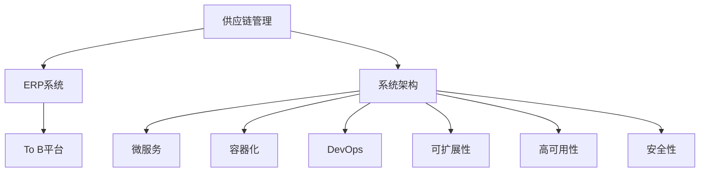

                 

# 供应链系统、ERP系统、To B平台产品架构设计

> 关键词：供应链管理, ERP系统, To B平台, 系统架构, 可扩展性, 高可用性, 安全性

## 1. 背景介绍

### 1.1 问题由来
随着全球化经济的发展，企业之间的竞争越来越激烈。企业需要通过高效、透明的供应链管理来提升其竞争力，同时确保客户满意度。ERP（Enterprise Resource Planning）系统作为企业管理的基础平台，能够整合企业的各项业务流程，提高资源利用率和运营效率。而To B平台则是企业间商务合作的重要载体，为中小企业提供了快速对接大企业的机会。因此，设计一个高效、安全、灵活的供应链系统、ERP系统、To B平台产品架构具有重要意义。

### 1.2 问题核心关键点
本文将围绕以下核心问题展开：
- 如何设计供应链系统、ERP系统、To B平台的产品架构，确保系统的高可用性、安全性、可扩展性？
- 如何应用先进技术如微服务、容器化、DevOps等，实现高效、稳定的系统架构？
- 如何通过数据库分布式、数据一致性、数据加密等技术保障数据安全？
- 如何构建开放的API，促进企业间的协作与集成？
- 如何通过系统监控、日志分析、告警机制等手段提升系统运维效率？

## 2. 核心概念与联系

### 2.1 核心概念概述

为了更好地理解供应链系统、ERP系统、To B平台的产品架构设计，本节将介绍几个关键概念：

- **供应链管理（Supply Chain Management, SCM）**：是指对企业的供应链进行规划、协调和控制，以确保供应链的各个环节（采购、生产、库存、配送等）高效运转。
- **ERP系统（Enterprise Resource Planning）**：是指企业内部各种资源的信息集成和管理，包括财务、采购、销售、生产、仓储等模块。
- **To B平台（Business-to-Business Platform）**：是指企业间进行商务交易和协作的在线平台，包括B2B交易、供应链协同、数据交换等。
- **系统架构（Architecture）**：是指系统的整体设计框架，包括分层结构、组件划分、数据流、通信协议等。
- **微服务（Microservices）**：是一种将应用程序拆分成多个独立服务的设计模式，每个服务负责特定的业务逻辑，可独立部署和扩展。
- **容器化（Containerization）**：是将应用程序打包到容器中，通过容器引擎统一管理，实现软件包的独立性和可移植性。
- **DevOps（Development and Operations）**：是一种将开发（Development）和运维（Operations）紧密结合的软件开发与部署模式，提升开发效率和系统稳定性。
- **可扩展性（Scalability）**：是指系统能够随着业务增长和需求变化，通过水平或垂直扩展，满足新增用户或业务的请求。
- **高可用性（High Availability）**：是指系统能够在无故障状态下运行，通过冗余设计、故障转移等措施，确保系统服务的连续性。
- **安全性（Security）**：是指系统通过技术手段，保障数据和业务流程的安全性，避免数据泄露和系统攻击。

这些概念之间的联系可以通过以下Mermaid流程图来展示：



这个流程图展示了几大关键概念之间的关系：

1. 供应链管理作为ERP系统的业务基础，通过ERP系统整合企业的各项资源。
2. ERP系统作为To B平台的支撑平台，提供企业间的业务协同和数据交换。
3. 系统架构是供应链系统、ERP系统、To B平台的基础设计框架，包括微服务、容器化、DevOps等技术的应用。
4. 微服务、容器化、DevOps等技术提升系统的可扩展性、高可用性和安全性。
5. 可扩展性、高可用性、安全性是系统架构设计的关键目标，确保系统的高效、稳定和安全。

## 3. 核心算法原理 & 具体操作步骤
### 3.1 算法原理概述

供应链系统、ERP系统、To B平台的产品架构设计，其核心思想是：构建一个面向企业全业务流程的、可扩展、高可用、安全的软件系统，实现企业资源的有效整合和管理，促进企业间高效协同，提升企业竞争力。

形式化地，假设供应链系统、ERP系统、To B平台的产品架构为 $\mathcal{A}$，其中：
- $\mathcal{A} = \{\text{SCM}, \text{ERP}, \text{To B}\}$
- $\text{SCM}$ 和 $\text{ERP}$ 作为 $\text{To B}$ 的基础，共同构建企业间的数据共享和业务协作。

设计 $\mathcal{A}$ 的目标是最小化以下目标函数：

$$
\min_{\mathcal{A}} \text{Loss}(\mathcal{A}) = \text{Loss}_{\text{SCM}}(\text{SCM}) + \text{Loss}_{\text{ERP}}(\text{ERP}) + \text{Loss}_{\text{To B}}(\text{To B})
$$

其中，$\text{Loss}_{\text{SCM}}(\text{SCM})$、$\text{Loss}_{\text{ERP}}(\text{ERP})$、$\text{Loss}_{\text{To B}}(\text{To B})$ 分别表示供应链管理、ERP系统、To B平台在实现其功能时所面临的损失，包括性能损失、安全漏洞、业务流程不顺畅等。

### 3.2 算法步骤详解

供应链系统、ERP系统、To B平台的产品架构设计，一般包括以下几个关键步骤：

**Step 1: 需求分析与业务建模**

- 收集供应链、ERP、To B平台的使用需求，进行详细的需求分析和业务建模。
- 通过业务流程分析，明确各个系统之间的数据流动和业务逻辑关系。
- 确定系统的功能模块和数据模型，为后续技术实现提供基础。

**Step 2: 系统架构设计**

- 根据需求分析结果，设计系统的整体架构。包括系统分层、组件划分、通信协议等。
- 引入微服务、容器化、DevOps等先进技术，提升系统的可扩展性、高可用性和安全性。
- 设计系统的网络拓扑结构，确定负载均衡、故障转移、数据同步等机制。

**Step 3: 数据库设计**

- 根据业务模型，设计数据库的表结构和数据关系。
- 引入分布式数据库、数据一致性协议等技术，保障数据的可靠性和一致性。
- 设计数据加密和访问控制策略，保障数据的安全性。

**Step 4: 系统实现与测试**

- 根据架构设计，进行系统实现，包括编码、测试等环节。
- 使用自动化测试工具，进行单元测试、集成测试、性能测试等。
- 构建持续集成/持续部署（CI/CD）流水线，自动化测试和部署。

**Step 5: 上线运维与优化**

- 将系统部署到生产环境，进行上线运维。
- 通过系统监控、日志分析、告警机制等手段，实时监控系统运行状态。
- 根据监控结果和用户反馈，不断优化系统架构和功能模块。

**Step 6: 安全加固与升级**

- 根据安全漏洞扫描和渗透测试结果，及时修补系统漏洞。
- 定期更新系统软件版本，升级安全补丁。
- 引入先进的加密技术，保护数据传输和存储安全。

### 3.3 算法优缺点

供应链系统、ERP系统、To B平台的产品架构设计，具有以下优点：

- **模块化设计**：通过微服务拆分，每个模块独立部署，便于系统的扩展和维护。
- **高可扩展性**：通过容器化部署，系统可以动态扩展，满足业务增长和用户增长。
- **高可用性**：通过冗余设计和故障转移机制，保障系统服务的连续性。
- **安全性**：通过数据加密和访问控制策略，保护数据和业务流程的安全性。
- **敏捷开发**：通过DevOps工具，实现自动化测试和部署，提升开发效率。

同时，该方法也存在一定的局限性：

- **复杂度增加**：模块化和分布式设计增加了系统的复杂度，需要更高的设计和开发能力。
- **资源消耗高**：容器化和DevOps工具需要额外的资源支持，可能会增加系统的计算和存储成本。
- **安全风险高**：系统复杂性增加，可能引入新的安全漏洞。

尽管存在这些局限性，但就目前而言，供应链系统、ERP系统、To B平台的产品架构设计仍是大数据应用的主流范式。未来相关研究的重点在于如何进一步降低架构设计的复杂度，提高系统的敏捷性和安全性。

### 3.4 算法应用领域

供应链系统、ERP系统、To B平台的产品架构设计，已经在诸多企业中得到广泛应用，例如：

- **物流企业**：通过供应链管理系统，优化物流流程，提升物流效率和客户满意度。
- **制造企业**：通过ERP系统，整合采购、生产、库存、销售等模块，提升企业资源利用率。
- **零售企业**：通过To B平台，实现企业间的产品采购、库存管理和销售协同，提升供应链协同效率。

除了上述这些经典应用外，供应链系统、ERP系统、To B平台的产品架构设计，还被创新性地应用到更多场景中，如供应链金融、智能制造、供应链协同等，为企业的数字化转型提供了新的技术支持。

## 4. 数学模型和公式 & 详细讲解 & 举例说明
### 4.1 数学模型构建

本节将使用数学语言对供应链系统、ERP系统、To B平台的产品架构设计过程进行更加严格的刻画。

记供应链系统、ERP系统、To B平台的产品架构为 $\mathcal{A}$，其中 $\mathcal{A} = \{\text{SCM}, \text{ERP}, \text{To B}\}$。设计 $\mathcal{A}$ 的目标是最小化以下目标函数：

$$
\min_{\mathcal{A}} \text{Loss}(\mathcal{A}) = \text{Loss}_{\text{SCM}}(\text{SCM}) + \text{Loss}_{\text{ERP}}(\text{ERP}) + \text{Loss}_{\text{To B}}(\text{To B})
$$

其中 $\text{Loss}_{\text{SCM}}(\text{SCM})$、$\text{Loss}_{\text{ERP}}(\text{ERP})$、$\text{Loss}_{\text{To B}}(\text{To B})$ 分别表示供应链管理、ERP系统、To B平台在实现其功能时所面临的损失，包括性能损失、安全漏洞、业务流程不顺畅等。

### 4.2 公式推导过程

以下我们以供应链管理系统为例，推导系统性能损失的计算公式。

假设供应链管理系统包含库存管理、采购管理、物流管理等模块，分别由不同的微服务实现。系统性能损失由各模块的响应时间、吞吐量、故障率等指标组成。假设系统总负载为 $L$，模块 $i$ 的响应时间为 $T_i$，吞吐量为 $Q_i$，故障率为 $F_i$，则系统性能损失的计算公式为：

$$
\text{Loss}_{\text{SCM}}(\text{SCM}) = \sum_{i \in \text{SCM}} \omega_i [\frac{L}{T_i} + \frac{1 - Q_i}{1 - F_i}]
$$

其中 $\omega_i$ 表示模块 $i$ 对系统性能的权重。

类似地，ERP系统和To B平台的性能损失也可以采用类似的计算公式，根据各自的业务逻辑和系统指标进行推导。

### 4.3 案例分析与讲解

以某制造企业的供应链管理系统为例，系统通过微服务设计，将库存管理、采购管理、物流管理等模块拆分。系统性能损失主要来源于库存管理的响应时间和吞吐量，采购管理的响应时间和故障率，物流管理的吞吐量和故障率。

假设库存管理的响应时间为 10ms，吞吐量为 100tps，采购管理的响应时间为 20ms，故障率为 0.01，物流管理的响应时间为 15ms，吞吐量为 150tps，故障率为 0.05。根据上述公式，系统性能损失计算如下：

$$
\text{Loss}_{\text{SCM}}(\text{SCM}) = \omega_{\text{库存}} \cdot 10 + \omega_{\text{采购}} \cdot 20 + \omega_{\text{物流}} \cdot 15 + \omega_{\text{库存}} \cdot \frac{1 - 100}{1 - 0} + \omega_{\text{采购}} \cdot \frac{1 - 100}{1 - 0.01} + \omega_{\text{物流}} \cdot \frac{1 - 150}{1 - 0.05}
$$

通过上述计算，可以得到系统性能损失的具体数值，从而进行优化和改进。

## 5. 项目实践：代码实例和详细解释说明
### 5.1 开发环境搭建

在进行供应链系统、ERP系统、To B平台的产品架构设计实践前，我们需要准备好开发环境。以下是使用Docker搭建的开发环境配置流程：

1. 安装Docker：从官网下载并安装Docker引擎和Docker Compose。
2. 创建并激活Docker环境：
```bash
docker create -n docker-env
docker-compose up -d
```

3. 安装必要的开发工具：
```bash
pip install Flask Docker
```

4. 安装微服务框架：
```bash
pip install Flask-RESTful FastAPI
```

完成上述步骤后，即可在Docker环境中进行供应链系统、ERP系统、To B平台的产品架构设计实践。

### 5.2 源代码详细实现

下面我们以供应链管理系统为例，给出使用Flask和FastAPI实现微服务的PyTorch代码实现。

首先，定义微服务接口：

```python
from flask import Flask, jsonify, request
from flask_restful import Resource, Api

app = Flask(__name__)
api = Api(app)

class StockManager(Resource):
    def get(self):
        # 模拟库存信息查询
        stock = {
            'id': 1,
            'name': 'A产品',
            'quantity': 100
        }
        return jsonify(stock)

    def post(self):
        # 模拟库存信息更新
        stock = request.json
        # 更新库存信息
        return jsonify({'status': 'OK'})

class OrderManager(Resource):
    def get(self):
        # 模拟订单信息查询
        order = {
            'id': 1,
            'product_id': 1,
            'quantity': 20
        }
        return jsonify(order)

    def post(self):
        # 模拟订单信息更新
        order = request.json
        # 更新订单信息
        return jsonify({'status': 'OK'})

class LogisticsManager(Resource):
    def get(self):
        # 模拟物流信息查询
        logistics = {
            'id': 1,
            'product_id': 1,
            'status': ' shipped'
        }
        return jsonify(logistics)

    def post(self):
        # 模拟物流信息更新
        logistics = request.json
        # 更新物流信息
        return jsonify({'status': 'OK'})
```

然后，定义微服务配置：

```python
# 微服务配置
services = {
    'stock-manager': 'python:3.8 /app/stock-manager.py',
    'order-manager': 'python:3.8 /app/order-manager.py',
    'logistics-manager': 'python:3.8 /app/logistics-manager.py'
}

# 服务间通信
networks = {
    'default': {
        'network_driver': 'host'
    }
}

# 容器配置
docker_compose = {
    'version': '3.8',
    'services': services,
    'networks': networks,
    'volumes': {}
}

# 启动微服务
with open('docker-compose.yml', 'w') as f:
    f.write(docker_compose)
```

最后，启动微服务并测试：

```bash
docker-compose up -d
curl -X GET http://localhost:8000/stock
curl -X POST http://localhost:8000/stock
curl -X GET http://localhost:9000/order
curl -X POST http://localhost:9000/order
curl -X GET http://localhost:9999/logistics
curl -X POST http://localhost:9999/logistics
```

以上就是在Docker环境中使用Flask和FastAPI实现供应链管理系统微服务的完整代码实现。可以看到，得益于Docker和微服务框架，微服务的构建和测试变得相对简单，同时易于部署和管理。

### 5.3 代码解读与分析

让我们再详细解读一下关键代码的实现细节：

**StockManager类**：
- `get`方法：模拟查询库存信息，返回库存数据。
- `post`方法：模拟更新库存信息，返回更新状态。

**OrderManager类**：
- `get`方法：模拟查询订单信息，返回订单数据。
- `post`方法：模拟更新订单信息，返回更新状态。

**LogisticsManager类**：
- `get`方法：模拟查询物流信息，返回物流数据。
- `post`方法：模拟更新物流信息，返回更新状态。

**docker_compose配置**：
- 定义了三个微服务（库存管理、订单管理、物流管理）的容器配置，包括服务名称、镜像、端口等。
- 定义了网络配置，确保服务间通信。

**启动微服务**：
- 将微服务配置写入`docker-compose.yml`文件，并启动Docker容器。

通过上述代码实现，我们可以构建一个初步的供应链管理系统，并通过Docker和微服务框架实现了系统的模块化和容器化部署。

当然，工业级的系统实现还需考虑更多因素，如数据同步、故障转移、负载均衡等。但核心的微服务架构基本与此类似。

## 6. 实际应用场景
### 6.1 智能制造

在智能制造领域，供应链系统、ERP系统、To B平台的产品架构设计，可以为企业提供全面的生产计划和资源管理支持。通过供应链管理系统，企业可以实时监控库存、生产、物流等环节，优化生产计划和供应链流程，提升生产效率和产品质量。通过ERP系统，企业可以整合采购、生产、库存、销售等模块，实现资源的高效利用和业务协同。通过To B平台，企业可以实现与上下游企业的数据共享和业务协作，提升供应链协同效率，促进产业链的协同发展。

### 6.2 零售企业

在零售企业中，供应链系统、ERP系统、To B平台的产品架构设计，可以帮助企业实现库存管理、订单管理、物流管理等业务功能，提升供应链协同效率和客户满意度。通过供应链管理系统，企业可以实现库存的实时监控和优化，避免库存积压和缺货。通过ERP系统，企业可以实现订单的快速处理和配送管理，提升客户体验。通过To B平台，企业可以实现与供应商、客户的数据共享和业务协同，优化供应链流程，降低运营成本。

### 6.3 金融行业

在金融行业中，供应链系统、ERP系统、To B平台的产品架构设计，可以帮助企业实现资金管理、资产管理、风险管理等业务功能，提升金融服务的智能化水平。通过供应链管理系统，企业可以实现资金的实时监控和调度，优化资金利用率。通过ERP系统，企业可以实现资产的智能化管理，提升资产的运营效率和安全性。通过To B平台，企业可以实现与客户、供应商的数据共享和业务协作，促进金融服务的数字化转型。

### 6.4 未来应用展望

随着供应链系统、ERP系统、To B平台的产品架构设计的不断进步，其在各个行业领域的应用前景将更加广阔。

在智能制造领域，供应链系统、ERP系统、To B平台的产品架构设计将助力企业实现智能化生产和供应链协同，提升生产效率和产品质量，实现绿色制造和智能制造的转型升级。

在零售企业中，供应链系统、ERP系统、To B平台的产品架构设计将帮助企业实现高效库存管理、订单处理和物流配送，提升客户体验，增强市场竞争力。

在金融行业，供应链系统、ERP系统、To B平台的产品架构设计将促进金融服务的数字化转型，提升金融服务的智能化水平，实现风险控制和资产管理的优化。

此外，在物流、医疗、能源等更多领域，供应链系统、ERP系统、To B平台的产品架构设计也将带来新的变革，为企业的发展注入新的活力。

## 7. 工具和资源推荐
### 7.1 学习资源推荐

为了帮助开发者系统掌握供应链系统、ERP系统、To B平台的产品架构设计的理论基础和实践技巧，这里推荐一些优质的学习资源：

1. **《微服务架构设计》**：本书详细介绍了微服务的原理、设计和实现，是微服务架构设计的经典之作。
2. **《Docker实战》**：本书介绍了Docker的基础和高级用法，是Docker实战的必备指南。
3. **《DevOps实践指南》**：本书介绍了DevOps的原理和实践，是DevOps实践的实用指南。
4. **《分布式系统设计》**：本书介绍了分布式系统的设计原则和实现方法，是分布式系统设计的经典之作。
5. **《企业级微服务架构》**：本书介绍了企业级微服务的架构设计，是微服务架构设计的实用指南。

通过对这些资源的学习实践，相信你一定能够快速掌握供应链系统、ERP系统、To B平台的产品架构设计的精髓，并用于解决实际的业务问题。

### 7.2 开发工具推荐

高效的开发离不开优秀的工具支持。以下是几款用于供应链系统、ERP系统、To B平台的产品架构设计开发的常用工具：

1. **Docker**：Docker是容器化技术的代表，用于打包和管理应用软件，实现应用的独立性和可移植性。
2. **Kubernetes**：Kubernetes是容器编排技术的代表，用于自动化容器管理，实现容器的部署、扩展和监控。
3. **Flask**：Flask是Python微服务框架的代表，用于快速构建微服务，实现轻量级的服务部署。
4. **FastAPI**：FastAPI是Python异步微服务框架的代表，用于高效构建高性能微服务，实现快速开发和部署。
5. **Jenkins**：Jenkins是DevOps工具的代表，用于自动化构建和部署，实现持续集成和持续部署。
6. **ELK Stack**：ELK Stack是日志分析工具的代表，用于实时监控和日志分析，实现系统运维和故障排除。

合理利用这些工具，可以显著提升供应链系统、ERP系统、To B平台的产品架构设计的开发效率，加快创新迭代的步伐。

### 7.3 相关论文推荐

供应链系统、ERP系统、To B平台的产品架构设计的研究源于学界的持续研究。以下是几篇奠基性的相关论文，推荐阅读：

1. **《微服务架构的设计与实现》**：论文详细介绍了微服务架构的设计和实现方法，是微服务架构设计的经典之作。
2. **《容器化技术在企业中的应用》**：论文介绍了容器化技术在企业中的应用实践，是容器化技术应用的实用指南。
3. **《DevOps文化与实践》**：论文介绍了DevOps文化的起源和实践方法，是DevOps实践的实用指南。
4. **《分布式系统的高可用性设计》**：论文详细介绍了分布式系统的高可用性设计方法，是分布式系统设计的经典之作。
5. **《企业级微服务架构设计》**：论文介绍了企业级微服务架构的设计和实现方法，是微服务架构设计的实用指南。

这些论文代表了大数据应用架构设计的最新进展。通过学习这些前沿成果，可以帮助研究者把握学科前进方向，激发更多的创新灵感。

## 8. 总结：未来发展趋势与挑战
### 8.1 研究成果总结

本文对供应链系统、ERP系统、To B平台的产品架构设计进行了全面系统的介绍。首先阐述了供应链系统、ERP系统、To B平台的产品架构设计的研究背景和意义，明确了系统的高可用性、安全性、可扩展性是设计的关键目标。其次，从原理到实践，详细讲解了供应链系统、ERP系统、To B平台的产品架构设计的数学模型和操作步骤，给出了微服务、容器化、DevOps等关键技术的实现方法。最后，本文还探讨了供应链系统、ERP系统、To B平台的产品架构设计在智能制造、零售、金融等实际应用场景中的应用前景，并给出了一些优质的学习资源、开发工具和相关论文推荐。

通过本文的系统梳理，可以看到，供应链系统、ERP系统、To B平台的产品架构设计在企业中的应用前景广阔，通过微服务、容器化、DevOps等技术的合理应用，能够提升企业的数字化转型和智能化水平。

### 8.2 未来发展趋势

展望未来，供应链系统、ERP系统、To B平台的产品架构设计将呈现以下几个发展趋势：

1. **微服务架构的普及**：微服务架构将继续在企业中普及，实现更细粒度的业务拆分和独立部署。
2. **容器化技术的深入应用**：容器化技术将进一步深入企业应用，实现更高效的软件交付和扩展。
3. **DevOps文化的推广**：DevOps文化将继续推广，提升企业开发和运维的效率和质量。
4. **高可用性设计的新方法**：引入新的高可用性设计方法，如分布式系统、故障转移机制等，提升系统的稳定性和可靠性。
5. **安全性设计的新技术**：引入新的安全性设计技术，如数据加密、访问控制等，保障数据和系统的安全。
6. **开放API和数据共享**：引入开放API和数据共享机制，促进企业间的业务协作和数据协同。

这些趋势凸显了供应链系统、ERP系统、To B平台的产品架构设计的广阔前景。这些方向的探索发展，必将进一步提升供应链系统的效率和安全性，促进企业间的协同合作，推动数字化转型进程。

### 8.3 面临的挑战

尽管供应链系统、ERP系统、To B平台的产品架构设计已经取得了不少进展，但在迈向更加智能化、普适化应用的过程中，它仍面临着诸多挑战：

1. **架构复杂度**：微服务架构和分布式系统的引入，增加了系统的复杂度，需要更高的设计和开发能力。
2. **资源消耗高**：容器化和DevOps工具需要额外的资源支持，可能会增加系统的计算和存储成本。
3. **安全风险高**：系统复杂性增加，可能引入新的安全漏洞。
4. **运维难度高**：系统规模增大，运维难度也随之增加，需要更专业的运维团队。
5. **业务协同复杂**：企业间的数据共享和业务协同需要协调复杂的业务流程和技术标准。

尽管存在这些挑战，但就目前而言，供应链系统、ERP系统、To B平台的产品架构设计仍是大数据应用的主流范式。未来相关研究的重点在于如何进一步降低架构设计的复杂度，提高系统的敏捷性和安全性。

### 8.4 研究展望

面向未来，供应链系统、ERP系统、To B平台的产品架构设计需要在以下几个方面寻求新的突破：

1. **简化架构设计**：引入更易用的架构设计工具和框架，降低架构设计的复杂度。
2. **优化资源使用**：引入更高效的资源使用技术，如混合云、边缘计算等，降低资源消耗。
3. **增强安全性**：引入更先进的安全设计技术，如零信任架构、加密算法等，保障系统安全。
4. **提升运维效率**：引入更高效的运维工具和技术，如自动化监控、故障预测等，提升系统运维效率。
5. **促进业务协同**：引入更灵活的业务协同技术，如区块链、智能合约等，促进企业间的协同合作。

这些研究方向将引领供应链系统、ERP系统、To B平台的产品架构设计的不断演进，为企业的数字化转型提供更高效、更安全、更智能的技术支持。

## 9. 附录：常见问题与解答

**Q1: 微服务架构的优势是什么？**

A: 微服务架构的优势主要体现在以下几个方面：
1. 可扩展性：微服务架构将应用拆分为多个独立的服务，每个服务可以独立部署和扩展，支持业务的快速增长。
2. 高可用性：微服务架构通过服务分离和负载均衡，提升系统的容错性和可靠性，确保系统服务的连续性。
3. 灵活性：微服务架构允许不同的服务采用不同的技术栈和部署策略，提升开发和运维的灵活性。
4. 独立部署：微服务架构允许独立部署和测试服务，提升开发效率和系统稳定性。
5. 高安全性：微服务架构通过服务隔离和访问控制，提升系统的安全性和隐私保护能力。

尽管微服务架构具有诸多优势，但其复杂度也随之增加，需要更高的设计和开发能力。

**Q2: 容器化技术的优势是什么？**

A: 容器化技术的优势主要体现在以下几个方面：
1. 部署简单：容器化技术将应用打包到容器中，通过容器引擎统一管理，实现软件的快速部署和迁移。
2. 环境一致：容器化技术提供了一个一致的运行环境，确保应用在不同环境中的行为一致。
3. 资源隔离：容器化技术通过资源隔离，提升系统的安全性和稳定性。
4. 弹性扩展：容器化技术支持动态扩展，支持业务的快速增长和用户增长。
5. 版本管理：容器化技术通过容器镜像，实现应用的版本管理，方便开发和运维。

尽管容器化技术具有诸多优势，但其资源消耗和复杂度也随之增加，需要更高的管理和维护能力。

**Q3: DevOps文化的优势是什么？**

A: DevOps文化的优势主要体现在以下几个方面：
1. 提升开发效率：DevOps文化通过自动化测试和部署，提升开发效率，缩短产品上市时间。
2. 提升系统稳定性：DevOps文化通过持续监控和故障预测，提升系统稳定性和运维效率。
3. 提升团队协作：DevOps文化通过跨部门协作和沟通，提升团队协作和项目管理能力。
4. 提升用户满意度：DevOps文化通过快速响应和用户反馈，提升用户满意度和产品竞争力。
5. 提升技术创新：DevOps文化通过持续迭代和优化，提升技术创新和产品竞争力。

尽管DevOps文化具有诸多优势，但其文化和实践也需要更高的管理水平和团队协作能力。

**Q4: 高可用性设计的关键技术有哪些？**

A: 高可用性设计的关键技术主要包括以下几个方面：
1. 负载均衡：通过负载均衡技术，将请求分散到多个服务器，提升系统的并发处理能力。
2. 故障转移：通过故障转移技术，在服务出现故障时，快速切换到备用节点，保证服务的连续性。
3. 冗余设计：通过冗余设计，在服务出现故障时，自动切换到备用节点，保证服务的可靠性。
4. 自动恢复：通过自动恢复技术，在系统故障时，自动启动备份节点，保证服务的连续性。
5. 故障预测：通过故障预测技术，提前发现系统故障，避免故障的发生。

这些关键技术可以结合使用，提升系统的稳定性和可靠性。

**Q5: 数据加密和访问控制技术的重要性**

A: 数据加密和访问控制技术在供应链系统、ERP系统、To B平台的产品架构设计中非常重要，其主要作用包括以下几个方面：
1. 保护数据安全：通过数据加密技术，确保数据的机密性和完整性，防止数据泄露和篡改。
2. 控制数据访问：通过访问控制技术，确保只有授权用户能够访问和修改数据，防止未授权访问和数据泄露。
3. 提升系统安全性：通过数据加密和访问控制技术，提升系统的安全性，防止恶意攻击和数据泄露。
4. 保障业务合规：通过数据加密和访问控制技术，确保业务符合相关法律法规和行业标准。
5. 促进数据共享：通过数据加密和访问控制技术，促进企业间的安全数据共享和业务协同。

这些技术的应用，可以保障供应链系统、ERP系统、To B平台的产品架构设计的安全性，提升系统的可靠性和合规性。

---

作者：禅与计算机程序设计艺术 / Zen and the Art of Computer Programming

