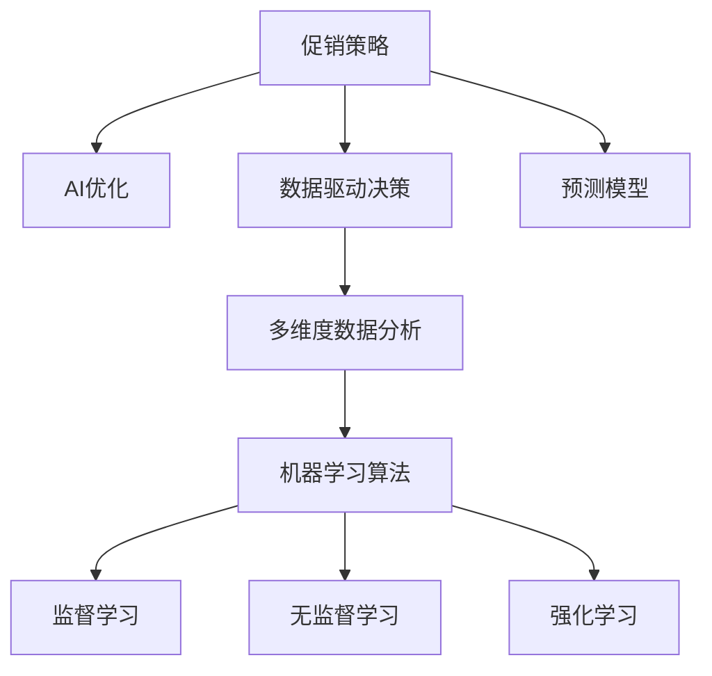

                 

# 促销策略优化：AI提升效果

> 关键词：
```
促销策略
AI优化
效果评估
数据分析
机器学习
```

## 1. 背景介绍

### 1.1 问题由来
在当前激烈的市场竞争中，有效的促销策略是企业提高销售额、提升市场占有率的重要手段。然而，传统的促销策略制定往往依赖经验判断，缺乏科学依据，容易导致资源浪费和决策失误。在数据驱动的背景下，如何通过技术手段优化促销策略，成为众多企业亟待解决的问题。

### 1.2 问题核心关键点
促销策略的优化核心在于如何科学、准确地预测促销活动的效果，并基于数据驱动的决策，实现最大化的销售额提升。主要问题包括：

- 如何建立有效的促销效果预测模型？
- 如何利用机器学习算法，挖掘数据中的潜在关系和规律？
- 如何在多维度数据中提取有价值的信息，支撑决策？

### 1.3 问题研究意义
研究AI在促销策略优化中的应用，对于提升企业决策水平、优化营销效果、提高资源利用率具有重要意义：

1. 数据驱动决策：利用AI技术，对历史促销数据进行深度挖掘，构建科学、客观的促销效果预测模型。
2. 优化营销效果：通过数据分析和模型预测，实现精准投放，最大化促销资源利用效率。
3. 提升决策准确性：减少依赖经验判断，避免因主观因素导致的决策失误。
4. 强化竞争优势：通过精细化的营销策略，提升品牌竞争力和市场占有率。

## 2. 核心概念与联系

### 2.1 核心概念概述

为更好地理解AI在促销策略优化中的应用，本节将介绍几个密切相关的核心概念：

- 促销策略(Promotional Strategy)：企业为提升销售额和品牌影响力，采取的一系列激励措施，如折扣、赠品、广告等。
- AI在促销策略优化中的应用：利用机器学习、深度学习等技术手段，构建预测模型和优化算法，提升促销效果。
- 数据驱动决策(Data-Driven Decision Making)：基于大量数据进行分析和建模，辅助企业制定更科学、客观的决策。
- 预测模型(Prediction Model)：通过历史数据训练的数学模型，用于预测促销活动的效果。
- 多维度数据分析(Multi-Dimensional Data Analysis)：从多个角度（如销售数据、顾客数据、市场数据等）对数据进行综合分析，全面理解市场和顾客行为。
- 机器学习算法(Machine Learning Algorithm)：包括监督学习、无监督学习、强化学习等，用于挖掘数据中的潜在关系和规律。

这些核心概念之间的逻辑关系可以通过以下Mermaid流程图来展示：



这个流程图展示了大语言模型的核心概念及其之间的关系：

1. 促销策略是企业营销的核心手段，利用AI优化提升效果。
2. 数据驱动决策是AI优化的基础，通过多维度数据分析，提供数据支持。
3. 预测模型是AI优化的工具，用于构建和评估促销效果预测。
4. 机器学习算法是AI优化的技术支撑，通过算法挖掘数据中的潜在规律和关系。

这些概念共同构成了AI在促销策略优化中的应用框架，使其能够在不同场景下发挥强大的预测和优化能力。

## 3. 核心算法原理 & 具体操作步骤
### 3.1 算法原理概述

AI在促销策略优化中，主要通过监督学习算法构建预测模型，实现促销效果的评估和优化。其核心思想是：利用历史促销数据，构建一个能够预测促销活动效果的数学模型，通过模型的评估和优化，指导未来的促销策略制定。

形式化地，假设促销活动 $P$ 包含多种元素 $P_1, P_2, ..., P_n$，每种元素对应的特征 $X$，最终的促销效果 $Y$。假设我们收集了 $M$ 个促销活动的样本数据，其中 $X$ 表示特征，$Y$ 表示促销效果。我们的目标是构建一个预测模型 $F(X)$，使得在新的促销活动中，我们可以通过 $F(X)$ 预测其效果 $Y$，并据此优化策略。

### 3.2 算法步骤详解

AI在促销策略优化中，主要包括以下几个关键步骤：

**Step 1: 数据收集与预处理**
- 收集历史促销活动的相关数据，包括促销元素、特征、效果等。
- 对数据进行清洗、去重、归一化等预处理，保证数据质量。

**Step 2: 特征工程**
- 从原始数据中提取有意义的特征，如促销元素、时间、顾客行为等。
- 对特征进行编码，如将文本型特征转换为数值型特征。
- 进行特征选择和降维，去除冗余和噪声特征，提高模型泛化能力。

**Step 3: 构建预测模型**
- 选择合适的机器学习算法，如线性回归、决策树、随机森林、深度神经网络等。
- 将处理后的特征数据作为模型输入，训练预测模型。
- 通过交叉验证等方法评估模型性能，选择合适的超参数。

**Step 4: 策略优化与评估**
- 根据预测模型的输出，评估不同促销策略的效果。
- 通过A/B测试等方法，验证优化后的策略是否有效。
- 根据实际效果，调整和改进预测模型和策略。

**Step 5: 持续学习与迭代**
- 定期收集新的促销活动数据，重新训练预测模型。
- 引入新特征和算法，持续改进模型性能。
- 跟踪市场和顾客行为变化，及时调整促销策略。

### 3.3 算法优缺点

AI在促销策略优化中的主要优点包括：

1. 数据驱动：通过数据挖掘和分析，提供客观的决策依据，避免主观因素干扰。
2. 精准预测：构建高精度的预测模型，实现对促销效果的精确评估。
3. 自动化优化：通过模型优化算法，自动调整促销策略，提高决策效率。
4. 动态调整：实时跟踪市场变化，动态调整促销策略，提高资源利用率。

然而，AI在促销策略优化中也存在一些局限性：

1. 数据质量要求高：模型预测结果依赖于数据的准确性和完整性，数据质量不高时，可能影响模型效果。
2. 模型复杂度高：构建和训练高精度模型需要大量的计算资源和时间。
3. 特征选择困难：复杂的数据集可能包含大量冗余和噪声特征，特征选择和提取需要专业知识和经验。
4. 解释性不足：黑盒模型难以解释其内部工作机制，决策过程缺乏透明性。

尽管存在这些局限性，但AI在促销策略优化中的应用仍然展现出巨大的潜力，为企业的决策提供强有力的支持。

### 3.4 算法应用领域

AI在促销策略优化中的应用，主要涵盖以下几个领域：

1. 销售预测：通过构建预测模型，对未来的销售情况进行预测，指导库存管理和促销活动安排。
2. 顾客行为分析：分析顾客的购买行为和偏好，实现个性化促销策略设计。
3. 渠道优化：对不同渠道的促销效果进行评估，优化渠道选择和资源配置。
4. 营销效果评估：评估不同促销策略的效果，及时调整和改进。
5. 市场细分：对市场进行细分，实现精准定位和差异化营销。
6. 库存管理：预测和优化库存水平，提高库存周转率。

除了上述这些经典应用外，AI还在内容生成、广告投放、推荐系统等更多场景中得到应用，为企业的营销和业务提供全方位的支持。

## 4. 数学模型和公式 & 详细讲解  
### 4.1 数学模型构建

本节将使用数学语言对AI在促销策略优化中的应用进行更加严格的刻画。

假设促销活动 $P$ 包含多个元素 $P_1, P_2, ..., P_n$，每种元素对应的特征 $X$，最终的促销效果 $Y$。设 $M$ 个促销活动的样本数据集为 $\{(x_i, y_i)\}_{i=1}^M$，其中 $x_i$ 表示促销活动的特征，$y_i$ 表示促销效果。我们的目标是构建一个预测模型 $F(X)$，使得在新的促销活动中，我们可以通过 $F(X)$ 预测其效果 $Y$，并据此优化策略。

预测模型的选择需要根据实际问题进行决定。常见的模型包括线性回归模型、逻辑回归模型、决策树模型、随机森林模型和深度神经网络模型。以线性回归模型为例，其数学表达式为：

$$
y_i = \beta_0 + \sum_{j=1}^n \beta_j x_{ij} + \epsilon_i
$$

其中 $\beta_0$ 和 $\beta_j$ 为模型参数，$\epsilon_i$ 为误差项。线性回归模型假设 $Y$ 与 $X$ 之间存在线性关系，适用于预测连续值。

### 4.2 公式推导过程

以下我们以线性回归模型为例，推导其最小二乘法优化过程。

假设我们收集了 $M$ 个促销活动的样本数据，其中 $x_i$ 表示促销活动的特征，$y_i$ 表示促销效果。我们的目标是构建一个线性回归模型 $F(X) = \beta_0 + \sum_{j=1}^n \beta_j x_{ij}$，使得在新的促销活动中，我们可以通过 $F(X)$ 预测其效果 $Y$，并据此优化策略。

最小二乘法是线性回归模型常用的优化方法，其目标是最小化预测误差 $e_i = y_i - F(x_i)$ 的平方和：

$$
\min_{\beta_0, \beta_j} \sum_{i=1}^M e_i^2
$$

通过求导，我们可以得到模型的参数估计值：

$$
\hat{\beta}_0 = \frac{1}{M} \sum_{i=1}^M y_i - \sum_{i=1}^M \frac{x_{ij}}{M} \hat{\beta}_j
$$

$$
\hat{\beta}_j = \frac{1}{M} \sum_{i=1}^M (y_i - \hat{y}_i) x_{ij}
$$

其中 $\hat{y}_i$ 为模型对 $y_i$ 的预测值。通过求解上述方程，我们可以得到线性回归模型的参数，从而构建预测模型 $F(X)$。

### 4.3 案例分析与讲解

假设我们收集了 $M=100$ 个促销活动的样本数据，其中每个促销活动包含 $n=3$ 个元素 $P_1, P_2, P_3$，每个元素的特征 $X$ 分别为 $x_{1i}, x_{2i}, x_{3i}$，最终的促销效果 $y_i$。我们使用线性回归模型进行预测，模型参数为 $\beta_0, \beta_1, \beta_2, \beta_3$。

我们对数据进行预处理，去除缺失值和异常值，并进行归一化处理。然后，构建预测模型 $F(X) = \beta_0 + \beta_1 x_{1i} + \beta_2 x_{2i} + \beta_3 x_{3i}$，使用最小二乘法求解参数 $\beta_0, \beta_1, \beta_2, \beta_3$。

最终，我们得到预测模型 $F(X)$，并将其应用于新的促销活动中，预测其效果 $Y$。通过对比预测结果与实际效果，评估模型的准确性和优化效果。

## 5. 项目实践：代码实例和详细解释说明
### 5.1 开发环境搭建

在进行AI促销策略优化实践前，我们需要准备好开发环境。以下是使用Python进行机器学习开发的环境配置流程：

1. 安装Anaconda：从官网下载并安装Anaconda，用于创建独立的Python环境。

2. 创建并激活虚拟环境：
```bash
conda create -n ml-env python=3.8 
conda activate ml-env
```

3. 安装Scikit-learn：
```bash
conda install scikit-learn
```

4. 安装Pandas：
```bash
conda install pandas
```

5. 安装NumPy：
```bash
conda install numpy
```

6. 安装Matplotlib：
```bash
conda install matplotlib
```

完成上述步骤后，即可在`ml-env`环境中开始AI促销策略优化的实践。

### 5.2 源代码详细实现

下面我们以促销效果预测为例，给出使用Scikit-learn库进行线性回归的Python代码实现。

首先，定义促销效果预测的函数：

```python
from sklearn.linear_model import LinearRegression
from sklearn.metrics import mean_squared_error
import pandas as pd

def predict_sales(data, model):
    X = data[['feature1', 'feature2', 'feature3']]
    y = data['sales']
    model.fit(X, y)
    y_pred = model.predict(X)
    mse = mean_squared_error(y, y_pred)
    rmse = mse ** 0.5
    return y_pred, rmse
```

然后，准备数据集和模型：

```python
# 准备数据集
data = pd.read_csv('promotion_data.csv')

# 定义特征和目标变量
X = data[['feature1', 'feature2', 'feature3']]
y = data['sales']

# 创建线性回归模型
model = LinearRegression()

# 训练模型
model.fit(X, y)

# 预测促销效果
y_pred, rmse = predict_sales(data, model)

print(f'RMSE: {rmse:.2f}')
```

最终，我们可以得到促销效果的预测值和均方根误差（RMSE），用于评估模型预测的准确性。

### 5.3 代码解读与分析

让我们再详细解读一下关键代码的实现细节：

**线性回归模型**：
- 使用Scikit-learn库的`LinearRegression`类创建线性回归模型。
- 定义特征集 `X` 和目标变量 `y`，并使用 `fit` 方法训练模型。

**促销效果预测函数**：
- 根据输入数据 `data` 计算预测结果 `y_pred` 和均方根误差 `rmse`。
- `X` 表示促销活动特征，`y` 表示促销效果。
- 使用 `mean_squared_error` 函数计算预测误差，并取其平方根得到RMSE。

**模型评估与调整**：
- 在测试集上评估模型性能，计算RMSE。
- 根据RMSE评估模型效果，若RMSE越小，模型预测越准确。

**代码调整与优化**：
- 根据实际问题选择合适的模型，如决策树、随机森林、神经网络等。
- 引入正则化技术，防止过拟合。
- 进行特征选择和降维，提高模型泛化能力。

通过上述代码实现，我们可以看到，使用Scikit-learn等库进行AI促销策略优化实践相对简单，能够快速搭建模型并进行效果评估。

## 6. 实际应用场景
### 6.1 电商平台促销活动优化

电商平台是AI促销策略优化的主要应用场景之一。通过AI技术，电商平台可以对促销活动的效果进行精准预测和优化，提升销售额和客户满意度。

具体而言，电商平台可以收集用户浏览、点击、购买等行为数据，结合历史促销活动数据，构建预测模型。根据预测结果，优化促销策略，实现精准投放。例如，针对不同用户群体，推出个性化的折扣和赠品，提高转化率。通过A/B测试，评估促销效果，不断优化模型参数和策略，实现最佳的资源利用和销售提升。

### 6.2 零售商促销活动优化

零售商是AI促销策略优化的另一个重要应用场景。零售商可以通过AI技术，对促销活动的效果进行预测和优化，提升库存管理效率和促销效果。

具体而言，零售商可以收集历史销售数据、库存数据、顾客数据等，结合促销活动数据，构建预测模型。根据预测结果，优化促销策略，实现精准投放。例如，针对不同季节和节假日，推出合理的促销活动，减少库存积压，提高销售额。通过A/B测试，评估促销效果，不断优化模型参数和策略，实现最佳的库存管理和销售提升。

### 6.3 银行营销活动优化

银行是AI促销策略优化的又一重要应用场景。通过AI技术，银行可以对营销活动的效果进行预测和优化，提升客户忠诚度和银行收入。

具体而言，银行可以收集客户数据、交易数据、市场数据等，结合促销活动数据，构建预测模型。根据预测结果，优化营销策略，实现精准投放。例如，针对不同客户群体，推出个性化的信用卡和金融产品，提高客户满意度。通过A/B测试，评估营销效果，不断优化模型参数和策略，实现最佳的客户服务和收入提升。

### 6.4 未来应用展望

随着AI技术的不断发展和成熟，AI在促销策略优化中的应用将呈现以下几个发展趋势：

1. 数据驱动决策：通过大数据分析，提供客观、科学的决策依据，提升决策准确性。
2. 自动化优化：利用机器学习算法，自动调整促销策略，提高决策效率。
3. 精准预测：构建高精度的预测模型，实现对促销效果的精确评估。
4. 个性化推荐：根据客户行为和偏好，实现个性化的促销策略设计。
5. 实时调整：实时跟踪市场和顾客行为变化，动态调整促销策略，提高资源利用率。
6. 跨领域应用：AI在促销策略优化中的应用，将从单一领域拓展到多领域，推动AI技术在更多行业中的落地应用。

这些趋势将进一步提升AI在促销策略优化中的价值，为企业提供更全面、更高效的营销支持。

## 7. 工具和资源推荐
### 7.1 学习资源推荐

为了帮助开发者系统掌握AI在促销策略优化中的应用，这里推荐一些优质的学习资源：

1. 《机器学习实战》书籍：详细介绍了机器学习的基本概念和常用算法，包括线性回归、决策树、随机森林等。
2. 《Python数据科学手册》书籍：介绍了Python在数据科学中的应用，包括Pandas、NumPy、Matplotlib等常用库的使用。
3. Scikit-learn官方文档：Scikit-learn库的官方文档，提供了丰富的机器学习模型和算法，以及详细的代码实现和应用示例。
4. Kaggle竞赛平台：全球最大的数据科学竞赛平台，提供大量实际数据集和竞赛题目，帮助开发者实践和提升技能。
5. Coursera机器学习课程：由斯坦福大学开设的机器学习课程，涵盖机器学习的基本理论和实践技能，适合初学者和进阶者。

通过对这些资源的学习实践，相信你一定能够快速掌握AI在促销策略优化中的应用，并用于解决实际的营销问题。

### 7.2 开发工具推荐

高效的开发离不开优秀的工具支持。以下是几款用于AI促销策略优化开发的常用工具：

1. Python：作为数据科学和机器学习的主流编程语言，Python具有丰富的库和工具支持，适合快速原型设计和模型训练。
2. Scikit-learn：基于Python的机器学习库，提供丰富的算法和工具，适合数据挖掘和模型训练。
3. TensorFlow：由Google主导开发的深度学习框架，生产部署方便，适合大规模工程应用。
4. Keras：基于TensorFlow的高层API，简化深度学习模型的构建和训练过程。
5. PyTorch：由Facebook开发的高效深度学习框架，支持动态计算图，适合快速原型设计和实验研究。
6. Jupyter Notebook：基于Web的交互式开发环境，适合快速迭代和分享研究结果。

合理利用这些工具，可以显著提升AI促销策略优化的开发效率，加快创新迭代的步伐。

### 7.3 相关论文推荐

AI在促销策略优化中的应用源于学界的持续研究。以下是几篇奠基性的相关论文，推荐阅读：

1. "The Elements of Statistical Learning"（《统计学习方法》）：由Tibshirani等人撰写，详细介绍了统计学习的基本理论和方法。
2. "Introduction to Statistical Learning"（《统计学习基础》）：由Gareth等人撰写，介绍了统计学习的基本概念和常用算法。
3. "Machine Learning Yearning"（《机器学习实战》）：由Andrew Ng撰写，详细介绍了机器学习的基本理论和实践技能。
4. "Deep Learning"（《深度学习》）：由Ian Goodfellow等人撰写，介绍了深度学习的基本概念和算法。
5. "Neural Network and Deep Learning"（《神经网络和深度学习》）：由Michael Nielsen撰写，介绍了神经网络和深度学习的基本概念和算法。

这些论文代表了大语言模型微调技术的发展脉络。通过学习这些前沿成果，可以帮助研究者把握学科前进方向，激发更多的创新灵感。

## 8. 总结：未来发展趋势与挑战
### 8.1 总结

本文对AI在促销策略优化中的应用进行了全面系统的介绍。首先阐述了AI促销策略优化的背景和意义，明确了AI优化在提升企业决策水平、优化营销效果、提高资源利用率方面的独特价值。其次，从原理到实践，详细讲解了AI促销策略优化的数学原理和关键步骤，给出了促销效果预测的完整代码实现。同时，本文还广泛探讨了AI促销策略优化在电商平台、零售商、银行等领域的实际应用，展示了AI优化技术的巨大潜力。此外，本文精选了AI促销策略优化的各类学习资源，力求为读者提供全方位的技术指引。

通过本文的系统梳理，可以看到，AI在促销策略优化中的应用前景广阔，能够显著提升企业的营销效果和决策水平。未来，伴随AI技术的不断发展和成熟，AI促销策略优化技术将进一步完善和提升，为企业提供更全面、更高效、更智能的营销支持。

### 8.2 未来发展趋势

展望未来，AI在促销策略优化中的应用将呈现以下几个发展趋势：

1. 数据驱动决策：通过大数据分析，提供客观、科学的决策依据，提升决策准确性。
2. 自动化优化：利用机器学习算法，自动调整促销策略，提高决策效率。
3. 精准预测：构建高精度的预测模型，实现对促销效果的精确评估。
4. 个性化推荐：根据客户行为和偏好，实现个性化的促销策略设计。
5. 实时调整：实时跟踪市场和顾客行为变化，动态调整促销策略，提高资源利用率。
6. 跨领域应用：AI在促销策略优化中的应用，将从单一领域拓展到多领域，推动AI技术在更多行业中的落地应用。

这些趋势将进一步提升AI在促销策略优化中的价值，为企业提供更全面、更高效、更智能的营销支持。

### 8.3 面临的挑战

尽管AI在促销策略优化中取得了显著成果，但在应用过程中仍面临诸多挑战：

1. 数据质量问题：AI模型的预测效果依赖于数据的准确性和完整性，数据质量不高时，可能影响模型效果。
2. 模型复杂度：高精度模型的构建和训练需要大量的计算资源和时间。
3. 特征选择问题：复杂的数据集可能包含大量冗余和噪声特征，特征选择和提取需要专业知识和经验。
4. 解释性问题：黑盒模型难以解释其内部工作机制，决策过程缺乏透明性。

尽管存在这些挑战，但通过不断优化和改进，AI在促销策略优化中的应用将更加广泛和深入，为企业的营销和业务提供更强有力的支持。

### 8.4 研究展望

面对AI促销策略优化所面临的挑战，未来的研究需要在以下几个方面寻求新的突破：

1. 数据预处理和特征工程：开发高效的数据预处理和特征工程方法，提高数据质量和特征选择的准确性。
2. 模型优化和算法创新：开发更加高效和泛化的模型和算法，提高模型的预测准确性和鲁棒性。
3. 模型解释和可解释性：引入模型解释技术，提高模型的透明性和可解释性，增强决策的信任度。
4. 多领域应用和融合：将AI促销策略优化技术与其他AI技术进行融合，实现多领域应用的泛化。
5. 实时跟踪和动态调整：引入实时跟踪和动态调整机制，提高模型对市场和顾客变化的适应性。

这些研究方向将推动AI在促销策略优化中的应用不断突破，为企业的营销和业务提供更全面、更高效、更智能的解决方案。

## 9. 附录：常见问题与解答

**Q1：AI在促销策略优化中的应用，是否需要大量的历史数据？**

A: 是的，AI在促销策略优化中的应用需要大量的历史数据，以构建和训练高精度预测模型。数据量越大，模型效果越好。然而，数据质量也至关重要，需要确保数据的准确性和完整性。

**Q2：AI在促销策略优化中，如何处理特征选择和降维问题？**

A: 特征选择和降维是构建高质量预测模型的关键步骤。常用的特征选择方法包括信息增益、互信息、L1正则化等，通过特征重要性评估，选择有意义的特征。降维方法包括主成分分析(PCA)、线性判别分析(LDA)等，通过数据降维，去除冗余和噪声特征。

**Q3：AI在促销策略优化中，如何处理数据不平衡问题？**

A: 数据不平衡是常见的问题，可能导致模型对少数类别的预测效果不佳。常用的处理方法包括过采样、欠采样、SMOTE等，通过数据增强，提高少数类别的样本量。同时，采用合适的评估指标，如F1-score、AUC等，评估模型性能。

**Q4：AI在促销策略优化中，如何处理过拟合问题？**

A: 过拟合是常见的问题，可能导致模型在新数据上的泛化能力不足。常用的处理方法包括正则化、Dropout、Early Stopping等，通过模型正则化，避免过拟合。同时，采用交叉验证等方法，评估模型泛化能力。

**Q5：AI在促销策略优化中，如何处理模型解释问题？**

A: 模型解释是AI应用中的重要问题，通过引入可解释性技术，提高模型的透明性和可解释性。常用的方法包括特征重要性分析、局部解释性模型、模型可视化等，通过解释模型决策过程，增强决策的信任度。

这些问题的详细解答，将帮助开发者更好地理解AI在促销策略优化中的应用，并提高模型的预测准确性和决策效率。

---

作者：禅与计算机程序设计艺术 / Zen and the Art of Computer Programming

