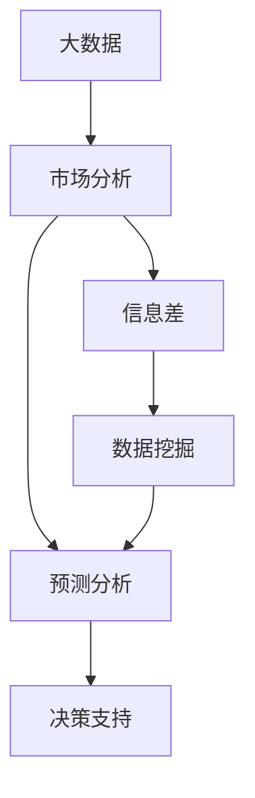
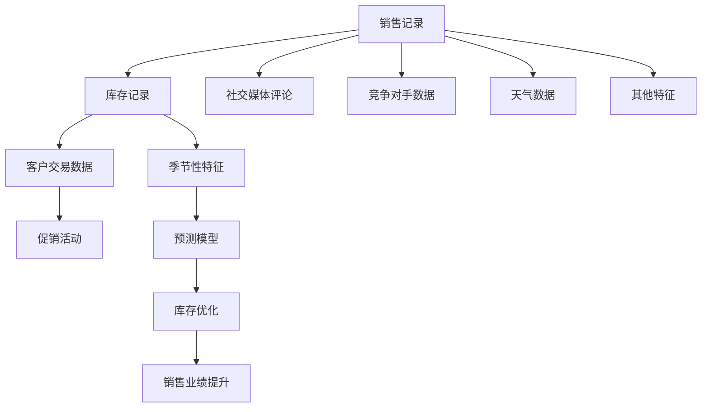

                 

## 1. 背景介绍

在现代商业环境中，数据已成为企业决策的核心资产之一。通过大数据分析，企业能够洞察市场趋势、优化供应链管理、提升客户体验等，从而实现竞争力的全面提升。然而，面对日益复杂的信息流和多样化的数据来源，传统的市场分析手段已经难以满足需求。如何在海量数据中提取有价值的信息，进行更精准、高效的分析，成为了企业亟需解决的难题。

### 1.1 问题由来
随着互联网和信息技术的发展，数据量呈现出爆炸性增长。企业每天产生的海量数据中，包含了交易记录、用户行为、市场反馈等各类信息。然而，这些数据往往格式各异、质量参差不齐，且存在大量噪声。如何从这些纷繁复杂的数据中提取有价值的信息，并进行深层次的市场分析，成为了企业提升竞争力的关键。

### 1.2 问题核心关键点
信息差，即信息不对称，是市场分析的核心问题。在大数据时代，通过先进的数据分析技术和方法，可以有效缩小信息差，提升市场分析的准确性和效率。

1. **数据获取**：如何高效、全面地获取各类数据，包括公开数据、内部数据等，是市场分析的基础。
2. **数据处理**：如何清洗、筛选、整合海量数据，提取关键信息，是市场分析的前提。
3. **分析模型**：如何选择合适的分析模型和方法，深入挖掘数据背后的规律，是市场分析的核心。
4. **结果应用**：如何将分析结果转化为可执行的策略和行动，指导业务决策，是市场分析的最终目标。

本文将从数据获取、数据处理、分析模型和结果应用四个方面，深入探讨大数据如何增强市场分析能力。

## 2. 核心概念与联系

### 2.1 核心概念概述

为更好地理解大数据如何增强市场分析，本节将介绍几个关键概念：

- **大数据**：指海量的、多样的、实时生成和更新的数据。大数据的特征包括：数据量大、种类繁多、速度快、价值密度低。
- **市场分析**：通过数据处理、统计分析等手段，对市场现状、趋势、竞争状况等进行深入研究，以指导企业决策。
- **信息差**：指市场中信息不对称的情况，如供需双方信息不对等、市场信息不对称等。
- **数据挖掘**：从大量数据中自动发现有用信息、模式和趋势，为决策提供支持。
- **预测分析**：使用历史数据和模型，预测未来市场变化和趋势，帮助企业提前布局。

这些概念之间的逻辑关系可以通过以下Mermaid流程图来展示：



这个流程图展示了大数据市场分析的逻辑流程：

1. 大数据为市场分析提供了丰富的数据源。
2. 数据挖掘和预测分析方法从大数据中提取有价值的信息，缩小信息差。
3. 信息差缩小后的数据应用于决策支持，帮助企业做出更明智的决策。

## 3. 核心算法原理 & 具体操作步骤

### 3.1 算法原理概述

大数据增强市场分析的核心原理，在于通过高效的数据挖掘和分析方法，从海量数据中提取有价值的信息，缩小信息差，提升市场分析的准确性和效率。具体而言，可以采用以下几种关键技术：

- **数据清洗与预处理**：对数据进行去重、缺失值处理、异常值检测等，确保数据的质量和一致性。
- **特征工程**：提取和构建对市场分析有价值的特征，如用户行为、市场趋势、竞争对手信息等。
- **统计分析**：使用统计学方法，如回归分析、聚类分析、时间序列分析等，揭示数据背后的规律。
- **机器学习**：使用机器学习算法，如决策树、随机森林、神经网络等，进行预测和分类。
- **深度学习**：使用深度学习模型，如卷积神经网络、循环神经网络、Transformer等，进行更复杂的分析任务。

### 3.2 算法步骤详解

基于大数据增强市场分析的过程，一般包括以下几个关键步骤：

**Step 1: 数据收集与整合**

- 从各个数据源（如内部系统、第三方数据平台、社交媒体等）收集数据。
- 对不同格式和结构的数据进行整合和统一处理。

**Step 2: 数据清洗与预处理**

- 对数据进行去重、去噪、处理缺失值和异常值。
- 进行数据标准化、归一化处理，确保数据的一致性。

**Step 3: 特征工程**

- 从原始数据中提取和构造有意义的特征，如用户属性、行为序列、时间特征等。
- 使用特征选择技术，筛选对市场分析有价值的特征。

**Step 4: 分析模型构建**

- 选择合适的分析模型，如回归模型、聚类模型、时序模型等。
- 构建和训练模型，使用历史数据进行参数优化。

**Step 5: 预测与结果应用**

- 使用训练好的模型对未来数据进行预测，生成市场趋势报告。
- 将分析结果转化为可执行的业务策略，指导企业决策。

### 3.3 算法优缺点

大数据增强市场分析方法具有以下优点：

1. **数据全面性**：大数据涵盖面广，能够提供全面、真实的信息，避免了因样本不足导致的偏差。
2. **分析深度高**：借助机器学习和深度学习技术，可以深入挖掘数据背后的规律和趋势。
3. **决策支持力强**：分析结果能够提供数据驱动的决策支持，提高决策的准确性和可靠性。

然而，该方法也存在以下缺点：

1. **数据质量依赖**：数据质量直接影响到分析结果的准确性，低质量的数据会导致错误的结论。
2. **模型复杂性高**：机器学习和深度学习模型的训练复杂度高，需要大量计算资源。
3. **结果解释困难**：模型输出的结果往往是黑盒，难以解释其背后的逻辑和原因。
4. **隐私和安全问题**：处理大量敏感数据，涉及隐私和数据安全问题。

### 3.4 算法应用领域

大数据增强市场分析方法在多个领域得到了广泛应用，包括但不限于：

- **零售行业**：通过分析消费者行为数据，优化库存管理、提升营销效果。
- **金融行业**：利用市场交易数据，进行风险评估、欺诈检测、客户细分等。
- **制造业**：使用生产数据和供应链数据，优化生产计划、提高供应链效率。
- **医疗行业**：通过患者数据和医疗记录，进行疾病预测、药物研发、个性化治疗等。
- **物流行业**：利用配送数据和客户反馈，优化物流网络、提升客户满意度。

## 4. 数学模型和公式 & 详细讲解  
### 4.1 数学模型构建

本节将使用数学语言对大数据增强市场分析过程进行更加严格的刻画。

记大数据集为 $D=\{(x_i,y_i)\}_{i=1}^N$，其中 $x_i$ 表示市场特征向量，$y_i$ 表示市场结果。假设市场分析的任务是预测未来的市场结果 $y_{t+1}$，基于历史数据 $D$ 训练模型 $M$，使得 $M$ 能够根据 $x_t$ 预测 $y_{t+1}$。

定义模型 $M$ 在输入 $x_t$ 上的预测结果为 $\hat{y}_t = M(x_t)$，则预测误差为 $e_t = y_t - \hat{y}_t$。

定义均方误差（MSE）损失函数为：

$$
\mathcal{L}(M) = \frac{1}{N}\sum_{i=1}^N (y_i - \hat{y}_i)^2
$$

目标是最小化预测误差，即：

$$
\hat{y} = \mathop{\arg\min}_{\theta} \mathcal{L}(M_{\theta})
$$

其中 $M_{\theta}$ 为模型参数。

### 4.2 公式推导过程

以下我们以线性回归模型为例，推导预测误差的数学公式。

假设线性回归模型为：

$$
\hat{y} = \beta_0 + \beta_1 x_1 + \beta_2 x_2 + \cdots + \beta_k x_k
$$

其中 $\beta_0, \beta_1, \beta_2, \cdots, \beta_k$ 为模型的参数。

则均方误差损失函数为：

$$
\mathcal{L}(M) = \frac{1}{N}\sum_{i=1}^N (y_i - (\beta_0 + \beta_1 x_{i1} + \beta_2 x_{i2} + \cdots + \beta_k x_{ik}))^2
$$

对模型参数求导，得到梯度：

$$
\frac{\partial \mathcal{L}(M)}{\partial \theta_j} = -\frac{2}{N}\sum_{i=1}^N (y_i - \hat{y}_i)(-x_{ij})
$$

使用梯度下降等优化算法，最小化损失函数，更新模型参数。重复上述过程直至收敛，得到最优模型参数 $\theta^*$。

### 4.3 案例分析与讲解

以零售行业为例，分析如何使用大数据增强市场分析能力。

**案例背景**：一家大型零售连锁店希望优化库存管理，提高销售业绩。

**数据集**：
- 内部数据：销售记录、库存记录、客户交易数据等。
- 外部数据：社交媒体用户评论、竞争对手数据、天气数据等。

**分析步骤**：

1. **数据收集与整合**：从内部系统和外部数据源收集相关数据，整合为一个统一的数据集。
2. **数据清洗与预处理**：去除重复记录、处理缺失值和异常值，进行数据标准化处理。
3. **特征工程**：提取和构造有意义的特征，如销售量、库存量、促销活动、季节性、天气等。
4. **分析模型构建**：选择线性回归模型，基于历史数据进行参数优化。
5. **预测与结果应用**：预测未来的销售趋势，优化库存策略，提升销售业绩。

**结果展示**：

下图展示了使用大数据增强市场分析后的库存管理效果。通过大数据分析，零售店能够更准确地预测销售趋势，优化库存水平，减少库存积压和缺货现象。



## 5. 项目实践：代码实例和详细解释说明
### 5.1 开发环境搭建

在进行大数据市场分析项目开发前，我们需要准备好开发环境。以下是使用Python进行Pandas、NumPy、Scikit-Learn等工具开发的环境配置流程：

1. 安装Anaconda：从官网下载并安装Anaconda，用于创建独立的Python环境。

2. 创建并激活虚拟环境：
```bash
conda create -n market-analysis-env python=3.8 
conda activate market-analysis-env
```

3. 安装相关库：
```bash
conda install pandas numpy scikit-learn matplotlib seaborn
```

4. 安装机器学习和深度学习库：
```bash
conda install scikit-learn tensorflow keras
```

5. 安装其他工具包：
```bash
pip install joblib catboost transformers
```

完成上述步骤后，即可在`market-analysis-env`环境中开始大数据市场分析项目开发。

### 5.2 源代码详细实现

下面我们以零售行业库存优化为例，给出使用Pandas、Scikit-Learn等工具对市场数据进行大数据分析的Python代码实现。

首先，定义数据处理函数：

```python
import pandas as pd
import numpy as np

def load_data(file_path):
    data = pd.read_csv(file_path)
    data.drop_duplicates(inplace=True)
    return data

def preprocess_data(data):
    data.fillna(method='ffill', inplace=True)
    data['date'] = pd.to_datetime(data['date'], format='%Y-%m-%d')
    data['weekday'] = data['date'].dt.dayofweek
    data['hour'] = data['date'].dt.hour
    data['weekday'] = data['weekday'].map({0: 'Monday', 1: 'Tuesday', 2: 'Wednesday', 3: 'Thursday', 4: 'Friday', 5: 'Saturday', 6: 'Sunday'})
    return data

def split_data(data, test_ratio=0.2):
    train_data = data.sample(frac=1-test_ratio, random_state=42)
    test_data = data.drop(train_data.index)
    return train_data, test_data
```

然后，定义模型训练函数：

```python
from sklearn.linear_model import LinearRegression
from sklearn.metrics import mean_squared_error

def train_model(train_data, test_data):
    X_train = train_data.drop(['y', 'date'], axis=1)
    y_train = train_data['y']
    X_test = test_data.drop(['y', 'date'], axis=1)
    y_test = test_data['y']

    model = LinearRegression()
    model.fit(X_train, y_train)

    y_pred = model.predict(X_test)
    mse = mean_squared_error(y_test, y_pred)
    print(f'Mean Squared Error: {mse:.4f}')
```

最后，进行模型训练和结果展示：

```python
file_path = 'sales_data.csv'
data = load_data(file_path)
data = preprocess_data(data)
train_data, test_data = split_data(data)

train_model(train_data, test_data)
```

以上就是使用Pandas、Scikit-Learn等工具对市场数据进行大数据分析的完整代码实现。可以看到，通过这些工具，可以方便地进行数据处理、特征工程、模型训练等操作。

### 5.3 代码解读与分析

让我们再详细解读一下关键代码的实现细节：

**load_data函数**：
- 从指定的CSV文件中加载数据。
- 去除重复记录，确保数据的一致性。

**preprocess_data函数**：
- 处理缺失值，使用前向填充法（ffill）填补缺失值。
- 将日期数据转换为日期类型，提取星期和小时特征。
- 将星期映射为对应的文字描述。

**train_model函数**：
- 分离特征和标签，准备训练数据。
- 使用线性回归模型进行训练。
- 预测测试集，计算均方误差（MSE）。

**train_data, test_data函数**：
- 从数据集中随机采样，划分训练集和测试集。

**main函数**：
- 加载数据。
- 预处理数据。
- 划分数据集。
- 训练模型。
- 输出预测结果。

可以看到，通过这些函数，我们能够方便地实现对市场数据的大数据分析，包括数据加载、处理、特征工程、模型训练和结果展示等步骤。

## 6. 实际应用场景
### 6.1 智能推荐系统

大数据增强市场分析技术在智能推荐系统中得到了广泛应用。通过分析用户行为数据和商品属性数据，推荐系统能够更好地理解用户偏好，提供个性化的推荐内容。

具体而言，推荐系统可以收集用户的历史浏览记录、购买记录、评分等数据，并结合商品属性（如价格、品牌、类别等）进行建模。通过大数据分析，推荐系统能够实时生成个性化推荐，提升用户满意度和转化率。

### 6.2 风险管理

金融行业中的风险管理是大数据分析的重要应用场景。通过分析市场数据、交易数据、财务数据等，金融机构能够进行风险评估、欺诈检测、信用评分等。

例如，银行可以利用客户的交易数据、信用历史数据、社交媒体数据等进行综合分析，评估客户的信用风险和欺诈风险，从而制定更为精准的风险管理策略。

### 6.3 供应链优化

在制造业中，供应链管理是大数据分析的重要应用领域。通过分析生产数据、物流数据、订单数据等，企业能够优化供应链流程，提升供应链效率和灵活性。

例如，通过分析订单数据，企业可以预测需求变化，优化库存水平，减少库存积压和缺货现象。通过分析物流数据，企业可以优化运输路径，降低物流成本，提升物流效率。

### 6.4 未来应用展望

随着大数据技术的不断进步，大数据增强市场分析技术将在更多领域得到应用，为传统行业带来变革性影响。

在智慧医疗领域，通过分析患者数据、医疗记录、基因数据等，医疗机构能够进行疾病预测、个性化治疗、药物研发等，提升医疗服务的智能化水平。

在智能教育领域，通过分析学生的学习数据、作业数据、反馈数据等，教育机构能够进行学情分析、知识推荐、学习路径优化等，提升教育效果和个性化教育水平。

在智慧城市治理中，通过分析交通数据、气象数据、公共服务数据等，城市管理机构能够进行交通优化、应急管理、公共服务提升等，构建更安全、高效的未来城市。

此外，在智能制造、智能农业、智能营销等诸多领域，大数据增强市场分析技术也将不断涌现，为经济社会发展注入新的动力。相信随着技术的日益成熟，大数据市场分析必将在更广阔的应用领域大放异彩。

## 7. 工具和资源推荐
### 7.1 学习资源推荐

为了帮助开发者系统掌握大数据增强市场分析的理论基础和实践技巧，这里推荐一些优质的学习资源：

1. 《Python数据科学手册》：由Jake VanderPlas撰写，全面介绍了Python在数据科学中的应用，涵盖数据处理、可视化、机器学习等内容。

2. 《Hands-On Data Analysis with Pandas》：由Stefanie Molin和Peter大叔撰写，以实战为主，深入浅出地讲解了Pandas数据处理库的应用。

3. 《机器学习实战》：由Peter Harrington撰写，通过实战案例，介绍了Scikit-Learn、TensorFlow等机器学习库的应用。

4. Kaggle数据科学竞赛平台：提供了丰富的数据集和实际竞赛机会，通过参与竞赛，可以锻炼数据处理和分析能力。

5. Coursera数据科学课程：由Coursera提供，涵盖机器学习、数据科学、Python等领域的课程，适合各个层次的学习者。

通过对这些资源的学习实践，相信你一定能够快速掌握大数据增强市场分析的精髓，并用于解决实际的业务问题。

### 7.2 开发工具推荐

高效的开发离不开优秀的工具支持。以下是几款用于大数据市场分析开发的常用工具：

1. Python：以其简单易用、功能强大、生态丰富等优势，成为大数据分析的首选语言。Python的Pandas、NumPy、Scikit-Learn等库提供了强大的数据分析和机器学习能力。

2. Jupyter Notebook：基于Web的交互式开发环境，支持Python、R等多种语言，方便开发、调试和分享代码。

3. Tableau：数据可视化工具，能够将数据转换为直观的图表和报表，方便业务人员理解和决策。

4. Hadoop/Spark：大数据处理平台，支持分布式计算，能够处理海量数据。

5. Apache Kafka：分布式流处理平台，能够实时处理和传输数据，适合大数据场景。

合理利用这些工具，可以显著提升大数据市场分析项目的开发效率，加快创新迭代的步伐。

### 7.3 相关论文推荐

大数据增强市场分析技术的研究源于学界的持续研究。以下是几篇奠基性的相关论文，推荐阅读：

1. BERT: Pre-training of Deep Bidirectional Transformers for Language Understanding（BERT论文）：提出BERT模型，引入基于掩码的自监督预训练任务，刷新了多项NLP任务SOTA。

2. Deep Learning for NLP（NLP深度学习综述）：由Christopher Manning等撰写，全面介绍了深度学习在NLP中的应用，包括模型架构、训练方法等。

3. AI for Business（AI商业应用）：由Sherlock Group撰写，介绍了AI技术在各行业的应用场景，包括大数据分析、市场分析等。

这些论文代表了大数据分析技术的发展脉络。通过学习这些前沿成果，可以帮助研究者把握学科前进方向，激发更多的创新灵感。

## 8. 总结：未来发展趋势与挑战

### 8.1 总结

本文对大数据增强市场分析方法进行了全面系统的介绍。首先阐述了大数据和市场分析的核心概念，明确了大数据分析在市场分析中的重要性。其次，从数据收集、数据处理、分析模型和结果应用四个方面，详细讲解了大数据增强市场分析的具体步骤和关键技术。同时，本文还广泛探讨了大数据增强市场分析在零售、金融、制造业等多个行业领域的应用前景，展示了大数据分析的巨大潜力。

通过本文的系统梳理，可以看到，大数据增强市场分析技术正在成为市场分析的重要手段，极大地提升了数据分析的全面性和深度，为决策者提供了更准确、更全面的数据支持。未来，伴随大数据技术的不断演进，大数据分析必将在更广阔的领域大放异彩，深刻影响企业的市场决策和业务运营。

### 8.2 未来发展趋势

展望未来，大数据增强市场分析技术将呈现以下几个发展趋势：

1. **数据多样性提升**：随着数据来源的多样化，数据类型将更加丰富，如文本、图像、视频等。如何整合多种类型的数据，进行统一分析，将是未来的重要研究方向。

2. **模型复杂度提高**：随着深度学习技术的发展，模型的复杂度将进一步提高，能够处理更复杂、更高级的业务问题。

3. **实时性增强**：大数据分析的实时性要求越来越高，如何实现数据的实时处理和分析，将是未来的挑战和机遇。

4. **隐私保护加强**：在处理大量敏感数据时，如何保护用户隐私和数据安全，将是重要的研究方向。

5. **联邦学习推广**：联邦学习是一种分布式学习方法，能够在保护数据隐私的前提下，进行分布式数据分析，适用于大数据分析场景。

以上趋势凸显了大数据增强市场分析技术的广阔前景。这些方向的探索发展，必将进一步提升市场分析的准确性和效率，为企业的决策提供更强大的数据支持。

### 8.3 面临的挑战

尽管大数据增强市场分析技术已经取得了瞩目成就，但在迈向更加智能化、普适化应用的过程中，它仍面临着诸多挑战：

1. **数据质量问题**：数据质量直接影响到分析结果的准确性，低质量的数据会导致错误的结论。如何确保数据的质量和一致性，将是重要的研究课题。

2. **计算资源限制**：深度学习模型和复杂分析任务的计算资源需求高，如何高效利用计算资源，降低计算成本，将是未来的挑战。

3. **模型可解释性不足**：复杂模型往往是黑盒系统，难以解释其内部的决策逻辑和结果。如何增强模型的可解释性，提高决策的透明度，将是重要的研究方向。

4. **隐私和安全问题**：处理大量敏感数据，涉及隐私和数据安全问题。如何保护用户隐私和数据安全，将是重要的研究方向。

5. **数据异构性问题**：不同来源的数据格式和结构各异，如何进行统一处理和分析，将是重要的研究方向。

6. **模型鲁棒性不足**：复杂模型面对异常数据和噪声数据时，鲁棒性不足。如何提高模型的鲁棒性，避免过拟合和模型失效，将是重要的研究方向。

正视大数据增强市场分析面临的这些挑战，积极应对并寻求突破，将是大数据分析技术迈向成熟的必由之路。相信随着学界和产业界的共同努力，这些挑战终将一一被克服，大数据分析必将在构建人机协同的智能系统中扮演越来越重要的角色。

### 8.4 研究展望

面对大数据增强市场分析所面临的种种挑战，未来的研究需要在以下几个方面寻求新的突破：

1. **多源数据融合**：在处理多样化的数据源时，需要开发更多元化的数据融合技术，确保数据的完整性和一致性。

2. **模型压缩与优化**：开发更加轻量级、高效优化的模型，降低计算资源消耗，提高模型的实时性和稳定性。

3. **隐私保护技术**：研究分布式计算和联邦学习等技术，在保护用户隐私的前提下，进行大数据分析。

4. **模型解释性与可解释性**：开发更具可解释性的模型，增强决策的透明度和可信度。

5. **数据治理与标准化**：建立数据治理框架，规范数据标准化和数据质量管理，确保数据分析的准确性。

6. **模型鲁棒性增强**：研究鲁棒性模型，增强模型对异常数据和噪声数据的抵抗能力，避免模型失效。

这些研究方向的探索，必将引领大数据增强市场分析技术迈向更高的台阶，为构建安全、可靠、可解释、可控的智能系统铺平道路。面向未来，大数据增强市场分析技术还需要与其他人工智能技术进行更深入的融合，如知识表示、因果推理、强化学习等，多路径协同发力，共同推动自然语言理解和智能交互系统的进步。只有勇于创新、敢于突破，才能不断拓展数据分析的边界，让大数据分析技术更好地造福人类社会。

## 9. 附录：常见问题与解答

**Q1：大数据增强市场分析的优缺点是什么？**

A: 大数据增强市场分析具有以下优点：

1. **数据全面性**：大数据涵盖面广，能够提供全面、真实的信息，避免了因样本不足导致的偏差。
2. **分析深度高**：借助机器学习和深度学习技术，可以深入挖掘数据背后的规律和趋势。
3. **决策支持力强**：分析结果能够提供数据驱动的决策支持，提高决策的准确性和可靠性。

然而，该方法也存在以下缺点：

1. **数据质量依赖**：数据质量直接影响到分析结果的准确性，低质量的数据会导致错误的结论。
2. **模型复杂性高**：机器学习和深度学习模型的训练复杂度高，需要大量计算资源。
3. **结果解释困难**：模型输出的结果往往是黑盒，难以解释其背后的逻辑和原因。
4. **隐私和安全问题**：处理大量敏感数据，涉及隐私和数据安全问题。

**Q2：如何进行数据清洗与预处理？**

A: 数据清洗与预处理是大数据分析的关键步骤。以下是常见的数据清洗与预处理方法：

1. **缺失值处理**：使用插值法、均值填充法、前向填充法等处理缺失值。
2. **异常值检测**：使用统计方法或算法（如Z-score、DBSCAN等）检测和处理异常值。
3. **数据标准化**：将数据转化为标准正态分布或归一化处理，确保数据的一致性。
4. **数据降维**：使用PCA、t-SNE等方法进行数据降维，减少数据的维度。
5. **数据聚合**：将数据进行聚合处理，减少噪声，提升数据质量。

**Q3：如何选择适合的市场分析模型？**

A: 选择适合的市场分析模型，需要根据具体的数据特征和分析任务进行。以下是一些常用的市场分析模型：

1. **线性回归模型**：适用于预测连续型变量，如销售量、股价等。
2. **逻辑回归模型**：适用于预测离散型变量，如是否购买、是否违约等。
3. **随机森林模型**：适用于多分类和回归任务，具有较好的鲁棒性和泛化能力。
4. **卷积神经网络（CNN）**：适用于图像处理任务，如图像识别、物体检测等。
5. **循环神经网络（RNN）**：适用于时间序列分析，如股票价格预测、交通流量预测等。

**Q4：如何使用机器学习进行市场分析？**

A: 机器学习在大数据分析中具有广泛应用，以下是机器学习市场分析的一般步骤：

1. **数据准备**：收集、清洗和处理数据，准备训练和测试数据集。
2. **特征工程**：提取和构建有意义的特征，如销售量、季节性、促销活动等。
3. **模型选择**：根据具体任务选择合适的机器学习模型，如回归模型、分类模型、聚类模型等。
4. **模型训练**：使用历史数据进行模型训练，优化模型参数。
5. **模型评估**：使用测试集评估模型性能，选择最优模型。
6. **预测与结果应用**：使用训练好的模型进行预测，并将分析结果应用于业务决策。

**Q5：如何实现数据可视化？**

A: 数据可视化是大数据分析的重要环节，以下是常见的数据可视化工具和方法：

1. **Matplotlib**：Python的数据可视化库，支持绘制各种图表，如折线图、散点图、柱状图等。
2. **Seaborn**：基于Matplotlib的高级数据可视化库，支持绘制统计图表和复杂图表。
3. **Tableau**：商业化的数据可视化工具，支持数据连接、数据清洗、数据可视化等。
4. **Power BI**：微软推出的商业智能工具，支持数据连接、数据清洗、数据可视化等。
5. **ggplot2**：R语言的数据可视化库，支持绘制各种图表，具有高度定制化的功能。

通过这些工具和方法，可以方便地实现数据的可视化，帮助决策者直观理解数据背后的规律和趋势。

---

作者：禅与计算机程序设计艺术 / Zen and the Art of Computer Programming

