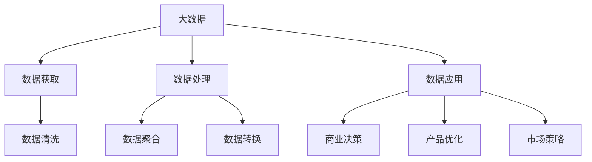

                 

# 信息差的未来前景：大数据将如何改变商业生态

在大数据时代，信息差（Information Gap）的概念被赋予了全新的意义。信息差不再仅指知识或消息的不对称，更是指在数据分析、处理和应用中，不同企业、不同市场、不同消费者之间的数据获取、数据处理能力和数据应用效果的差异。大数据技术的迅猛发展，为缩小甚至消除信息差提供了前所未有的可能性，从而深刻改变着商业生态的格局。本文将从背景、概念、原理、实践、应用及未来展望等方面深入探讨大数据如何重塑信息差，并带来商业生态的变革。

## 1. 背景介绍

### 1.1 问题由来
在全球化和数字化浪潮下，信息流通的速度和规模达到了前所未有的高度，但信息获取、处理和应用的能力却呈现出显著的不均衡性。大型企业拥有更强大的数据处理能力和技术优势，能够利用大数据分析做出更精准的决策；而中小企业和个体消费者则常常被信息差所困，难以获取、利用和整合海量数据，从而在市场竞争中处于不利地位。

### 1.2 问题核心关键点
1. **数据差异**：不同企业、不同市场的数据获取能力差异，导致决策信息的不对称。
2. **数据处理能力**：数据处理和分析的技术水平直接影响决策效果。
3. **数据应用效果**：数据应用的效果在不同企业间存在显著差异，影响市场竞争力。
4. **信息不对称**：信息不对称不仅是传统意义上的知识差异，更是数据获取、处理和应用的全方位不对称。
5. **商业生态改变**：大数据技术的应用，有望缩小甚至消除信息差，重塑商业生态。

### 1.3 问题研究意义
研究大数据如何在商业生态中缩小信息差，对于促进市场公平、推动技术普及、提升中小企业的市场竞争力具有重要意义。大数据技术的普及应用，不仅能够帮助企业做出更精准的决策，还能为消费者提供更优质的服务和体验，推动商业生态的健康发展。

## 2. 核心概念与联系

### 2.1 核心概念概述

为更好地理解大数据如何在商业生态中缩小信息差，本节将介绍几个密切相关的核心概念：

- **大数据(Big Data)**：指那些数据量巨大、数据类型多样、数据价值密度低，无法通过传统软件工具进行管理和处理的数据集合。
- **数据获取(Data Acquisition)**：指通过传感器、日志文件、社交媒体等渠道获取原始数据的过程。
- **数据处理(Data Processing)**：指通过清洗、转换、聚合等操作对数据进行整理和分析的过程。
- **数据应用(Data Application)**：指将数据转化为具体商业决策、产品优化、市场策略的过程。
- **信息差(Information Gap)**：指在信息流通和数据处理中，不同企业、不同市场、不同消费者之间的数据获取、处理和应用能力的差异。

这些概念之间的逻辑关系可以通过以下Mermaid流程图来展示：



这个流程图展示了大数据在商业生态中的应用流程：

1. 大数据通过多种渠道获取原始数据。
2. 数据经过清洗、转换、聚合等处理过程，形成有价值的信息。
3. 这些信息应用于商业决策、产品优化、市场策略中，帮助企业做出更精准的商业决策。

## 3. 核心算法原理 & 具体操作步骤

### 3.1 算法原理概述

大数据技术通过提升数据获取、处理和应用的能力，缩小不同企业、不同市场、不同消费者之间的信息差。其核心思想是通过数据的整合、分析和应用，使信息更加对称和透明，从而在商业决策、产品优化、市场策略等方面提升整体竞争力。

形式化地，假设企业A和大数据技术处理能力为 $A_{big}$，企业B的原始数据量为 $B_{raw}$，企业B的大数据处理能力为 $B_{big}$。则在应用大数据技术后，企业B能够获取和处理的数据量 $B_{after}$ 应满足：

$$
B_{after} = f(B_{raw}, B_{big})
$$

其中 $f$ 为企业B在大数据技术下的数据处理函数，随着 $B_{big}$ 的增加，$f$ 的值逐渐逼近 $B_{raw}$，从而缩小与企业A之间的信息差。

### 3.2 算法步骤详解

大数据在商业生态中的应用，主要分为数据获取、数据处理和数据应用三个步骤：

**Step 1: 数据获取**
- 选择数据源：根据企业需求选择合适的数据源，如传感器、日志文件、社交媒体等。
- 数据收集：通过API、爬虫等方式收集数据，存储在数据仓库中。

**Step 2: 数据处理**
- 数据清洗：去除无效、重复、错误的数据，确保数据的准确性和完整性。
- 数据转换：将不同类型的数据转换为统一格式，便于后续处理。
- 数据聚合：通过数据聚合操作，对大量数据进行汇总、统计和分析，形成有价值的洞察。

**Step 3: 数据应用**
- 商业决策：根据数据分析结果，制定更精准的商业策略和决策。
- 产品优化：通过数据分析反馈，不断改进产品和用户体验。
- 市场策略：利用数据分析结果，调整市场策略和营销手段。

### 3.3 算法优缺点

大数据技术在商业生态中的应用，具有以下优点：
1. **数据获取全面**：大数据技术能够获取各种来源的数据，涵盖企业内外部信息，提升决策的全面性。
2. **数据处理高效**：通过大数据技术，企业能够高效处理海量数据，快速获得有价值的洞察。
3. **应用效果显著**：大数据分析能够帮助企业优化产品、改进策略，提升市场竞争力。

同时，该方法也存在一定的局限性：
1. **技术门槛高**：大数据技术需要高水平的技术支持，中小企业难以独立应用。
2. **数据隐私问题**：大规模数据处理可能涉及隐私泄露和数据安全问题，需严格遵守法律法规。
3. **数据质量依赖**：大数据分析结果的准确性高度依赖于数据的完整性和质量。

尽管存在这些局限性，但就目前而言，大数据技术是缩小信息差、提升企业竞争力的重要手段。未来相关研究的重点在于如何进一步降低技术门槛，提高数据处理的自动化程度，同时兼顾数据隐私和数据质量等问题。

### 3.4 算法应用领域

大数据技术在商业生态中的应用非常广泛，涵盖以下领域：

- **电商领域**：通过大数据分析，电商企业可以精准推荐商品，优化库存管理，提升用户体验。
- **金融领域**：金融机构利用大数据分析客户行为，识别潜在风险，制定个性化的金融产品和服务。
- **医疗领域**：医院和保险公司利用大数据分析患者健康数据，优化诊疗流程，提高服务质量。
- **教育领域**：教育机构通过大数据分析学生的学习行为，提供个性化的教育内容和资源，提升教育效果。
- **能源领域**：能源企业利用大数据分析能源消耗数据，优化资源配置，降低能源浪费。

除了这些领域外，大数据技术还被创新性地应用于供应链管理、人力资源优化、城市治理等众多领域，为商业生态带来了新的发展动力。

## 4. 数学模型和公式 & 详细讲解 & 举例说明

### 4.1 数学模型构建

本节将使用数学语言对大数据在商业生态中的应用进行更加严格的刻画。

记企业A和大数据技术处理能力为 $A_{big}$，企业B的原始数据量为 $B_{raw}$，企业B的大数据处理能力为 $B_{big}$。假设大数据技术应用后，企业B能够获取和处理的数据量为 $B_{after}$，则有：

$$
B_{after} = f(B_{raw}, B_{big})
$$

其中 $f$ 为企业B在大数据技术下的数据处理函数，可表示为：

$$
f(B_{raw}, B_{big}) = B_{raw} \times B_{big}^{k}
$$

其中 $k$ 为大数据技术的放大系数，$k>1$ 时，大数据技术能够显著放大企业的数据处理能力。

### 4.2 公式推导过程

根据上述模型，我们可以推导出大数据技术对企业数据处理能力的放大效果。以电商领域为例，假设大数据技术处理能力为 $10^2$，原始数据量为 $10^5$，则：

$$
B_{after} = f(10^5, 10^2) = 10^5 \times (10^2)^k = 10^{5+2k}
$$

当 $k=2$ 时，放大效果为 $10^{12}$，即大数据技术可以将原始数据量放大 $1000$ 倍，显著提升企业的数据处理和应用能力。

### 4.3 案例分析与讲解

以电商平台为例，大数据技术可以通过以下方式提升其数据处理能力：

- **用户行为分析**：通过分析用户的浏览、购买、评价等行为数据，预测用户需求，实现精准推荐。
- **供应链优化**：利用物流、库存等数据，优化商品供应链，降低运营成本。
- **市场洞察**：通过市场数据和竞争对手信息，制定精准的市场策略，提升竞争力。

大数据技术的成功应用，不仅提升了电商平台的运营效率，还带来了更多的商业机会，推动了整个电商生态的健康发展。

## 5. 项目实践：代码实例和详细解释说明

### 5.1 开发环境搭建

在进行大数据实践前，我们需要准备好开发环境。以下是使用Python进行Pandas、NumPy开发的环境配置流程：

1. 安装Anaconda：从官网下载并安装Anaconda，用于创建独立的Python环境。

2. 创建并激活虚拟环境：
```bash
conda create -n bigdata-env python=3.8 
conda activate bigdata-env
```

3. 安装Python开发工具：
```bash
pip install pandas numpy matplotlib
```

4. 安装大数据处理工具：
```bash
pip install dask
```

完成上述步骤后，即可在`bigdata-env`环境中开始大数据实践。

### 5.2 源代码详细实现

这里我们以电商平台用户行为分析为例，给出使用Pandas进行大数据分析的Python代码实现。

首先，定义用户行为数据：

```python
import pandas as pd

# 定义用户行为数据
data = {
    'user_id': [1, 2, 3, 4, 5, 6, 7, 8, 9, 10],
    'item_id': [1001, 1002, 1003, 1004, 1005, 1006, 1007, 1008, 1009, 1010],
    'category': ['Books', 'Books', 'Books', 'Books', 'Electronics', 'Electronics', 'Fashion', 'Fashion', 'Fashion', 'Fashion'],
    'price': [10, 20, 30, 40, 50, 60, 70, 80, 90, 100],
    'rating': [4, 5, 3, 2, 5, 4, 3, 2, 4, 5],
    'purchase': [1, 0, 1, 0, 1, 0, 1, 0, 1, 0]
}

# 创建DataFrame
df = pd.DataFrame(data)
```

接着，进行数据清洗和预处理：

```python
# 数据清洗
df = df.dropna()  # 去除缺失值
df = df.drop_duplicates()  # 去除重复值

# 数据转换
df['total_spent'] = df['price'] * df['purchase']  # 计算用户消费总额
df['avg_rating'] = df['rating'].mean()  # 计算用户平均评分
```

然后，进行数据分析和可视化：

```python
# 数据分析
df.groupby('category')['total_spent'].sum()  # 按类别统计消费总额
df.groupby('user_id')['avg_rating'].mean()  # 按用户统计平均评分

# 数据可视化
import matplotlib.pyplot as plt

# 绘制饼图
plt.pie(df['total_spent'].value_counts(), labels=df['category'], autopct='%1.1f%%')
plt.title('Category-wise Spending')
plt.show()

# 绘制散点图
plt.scatter(df['avg_rating'], df['total_spent'])
plt.xlabel('Average Rating')
plt.ylabel('Total Spent')
plt.show()
```

最后，对分析结果进行解释：

```python
# 分析结果解释
print("Category-wise Spending: ")
print(df.groupby('category')['total_spent'].sum())

print("User-wise Spending: ")
print(df.groupby('user_id')['total_spent'].sum())
```

以上就是使用Pandas进行大数据分析的完整代码实现。可以看到，Pandas提供了强大的数据处理和分析功能，使得大数据分析变得简单高效。

### 5.3 代码解读与分析

让我们再详细解读一下关键代码的实现细节：

**数据定义**：
- 使用字典创建用户行为数据，包含用户ID、商品ID、商品类别、价格、评分、购买情况等关键字段。

**数据清洗**：
- 去除缺失值和重复值，确保数据质量。
- 通过计算用户消费总额和平均评分，进行数据转换。

**数据分析**：
- 使用groupby方法对数据进行分组统计，获取不同类别和用户的消费总额和平均评分。
- 使用Matplotlib库进行数据可视化，展示不同类别和用户的消费情况。

**结果解释**：
- 打印输出分类和用户消费总额，便于分析和决策。

可以看到，Pandas作为Python中强大的数据分析工具，能够轻松处理和分析大规模数据，支持多种数据类型和操作。通过Pandas进行大数据分析，可以显著提升数据分析的效率和效果，为商业决策提供坚实的数据支撑。

## 6. 实际应用场景

### 6.1 电商领域

大数据技术在电商领域的应用非常广泛，具体场景包括：

- **精准推荐**：通过分析用户的浏览、购买、评价等行为数据，推荐用户可能感兴趣的商品，提升用户体验和转化率。
- **库存管理**：利用销售数据和市场需求，优化库存配置，减少库存积压和缺货情况。
- **营销策略**：分析市场趋势和用户需求，制定个性化的营销策略，提升广告投放效果。

电商企业通过大数据技术，能够实现更精准的市场定位和运营管理，提高运营效率和盈利能力。

### 6.2 金融领域

金融领域大数据应用的场景包括：

- **风险管理**：通过分析客户交易数据和信用记录，评估风险，制定差异化的信贷策略。
- **客户分析**：利用客户行为数据，识别高价值客户，制定精准的客户维护和营销策略。
- **市场预测**：分析市场数据和宏观经济指标，预测市场趋势，指导投资决策。

金融企业通过大数据技术，能够更好地理解客户需求和市场动态，提升风险控制和客户服务水平，实现稳健的经营发展。

### 6.3 医疗领域

医疗领域大数据应用的场景包括：

- **疾病预测**：通过分析患者健康数据和历史病历，预测疾病发生概率，提供个性化的预防和诊疗建议。
- **资源配置**：利用医疗数据，优化医院资源配置，提高医疗服务效率。
- **药物研发**：分析临床试验数据和患者反馈，加速新药研发进程。

医疗企业通过大数据技术，能够提升诊疗水平和医疗服务质量，为患者提供更优质的健康服务。

### 6.4 未来应用展望

随着大数据技术的不断演进，其在商业生态中的应用将进一步深化，带来更多的商业创新和变革：

1. **智能制造**：通过大数据分析，优化生产流程，提高生产效率和产品质量。
2. **智慧城市**：利用大数据技术，提升城市管理水平，提供更智能的城市服务。
3. **个性化教育**：通过分析学生学习行为，提供个性化的教育内容，提升教育效果。
4. **精准农业**：利用农业大数据，优化种植方案，提高农业生产效率和产品质量。

未来，大数据技术将在更多领域得到广泛应用，为商业生态带来新的发展机遇。

## 7. 工具和资源推荐

### 7.1 学习资源推荐

为了帮助开发者系统掌握大数据在商业生态中的应用，这里推荐一些优质的学习资源：

1. **《Python数据科学手册》**：详细介绍了Pandas、NumPy、Scikit-Learn等Python数据科学库的使用方法和应用场景。

2. **《数据科学基础》**：由Coursera提供的数据科学课程，涵盖数据处理、分析和可视化等多个方面。

3. **Kaggle**：数据科学竞赛平台，提供丰富的数据集和算法挑战，锻炼大数据分析技能。

4. **《大数据技术与应用》**：经典大数据教材，系统讲解大数据技术原理和应用方法。

5. **Hadoop生态系统**：包括Hadoop、Spark等大数据处理框架，提供全面的大数据处理能力。

通过这些资源的学习实践，相信你一定能够快速掌握大数据技术的精髓，并用于解决实际的商业问题。

### 7.2 开发工具推荐

高效的开发离不开优秀的工具支持。以下是几款用于大数据开发和分析的常用工具：

1. **Pandas**：Python中强大的数据处理库，支持多种数据类型和操作，能够轻松处理和分析大规模数据。

2. **NumPy**：Python中高效科学计算库，提供多种数学函数和矩阵运算，加速数据处理和计算。

3. **Scikit-Learn**：Python中机器学习库，提供丰富的算法和工具，支持分类、回归、聚类等多种机器学习任务。

4. **Hadoop**：分布式计算框架，支持大规模数据处理和分析，提供强大的数据存储和处理能力。

5. **Spark**：快速的分布式计算引擎，支持内存计算和大数据处理，提供高效的数据处理和分析能力。

合理利用这些工具，可以显著提升大数据分析和应用的能力，加快商业决策的速度和质量。

### 7.3 相关论文推荐

大数据技术的发展离不开学界的持续研究。以下是几篇奠基性的相关论文，推荐阅读：

1. **《大数据时代：规划、应用与管理》**：阐述大数据时代数据处理和应用的基本原理和应用场景。

2. **《Hadoop：下一代计算平台》**：详细介绍Hadoop的架构和技术原理，提供大数据处理和分析的解决方案。

3. **《大数据算法与应用》**：系统讲解大数据算法的原理和应用方法，提供丰富的案例和实践经验。

4. **《数据驱动的商业决策》**：探讨大数据在商业决策中的应用，提供数据驱动决策的策略和方法。

这些论文代表了大数据技术的发展脉络。通过学习这些前沿成果，可以帮助研究者把握学科前进方向，激发更多的创新灵感。

## 8. 总结：未来发展趋势与挑战

### 8.1 总结

本文对大数据在商业生态中的应用进行了全面系统的介绍。首先阐述了大数据缩小信息差的概念和背景，明确了大数据在商业决策、产品优化、市场策略等方面提升企业竞争力的价值。其次，从原理到实践，详细讲解了大数据的应用流程和关键步骤，给出了大数据分析任务开发的完整代码实例。同时，本文还广泛探讨了大数据技术在电商、金融、医疗等多个行业领域的应用前景，展示了大数据技术的巨大潜力。最后，本文精选了大数据技术的各类学习资源，力求为读者提供全方位的技术指引。

通过本文的系统梳理，可以看到，大数据技术正在成为商业生态的重要支撑，显著提升了企业的数据处理和应用能力，推动了商业决策的精准化和智能化。未来，伴随大数据技术的不断进步，数据处理和应用将更加高效和广泛，进一步缩小甚至消除信息差，带来商业生态的全面变革。

### 8.2 未来发展趋势

展望未来，大数据技术将呈现以下几个发展趋势：

1. **技术普及加速**：大数据技术将逐渐普及到更多的中小企业和个体消费者，提升整体数据处理能力。
2. **数据处理自动化**：大数据处理将向自动化、智能化方向发展，减少人工干预，提高处理效率。
3. **数据融合与多模态处理**：数据融合技术将变得更加成熟，多模态数据处理能力将显著提升。
4. **隐私保护与安全**：数据隐私和安全问题将受到更多关注，数据处理将更加注重隐私保护和数据安全。
5. **智能决策支持**：大数据技术将与人工智能、机器学习等技术深度融合，提供更智能的决策支持。

以上趋势凸显了大数据技术在商业生态中的重要地位，这些方向的探索发展，必将进一步推动大数据技术的应用普及和商业价值的实现。

### 8.3 面临的挑战

尽管大数据技术在商业生态中的应用前景广阔，但在迈向更加智能化、普适化应用的过程中，它仍面临着诸多挑战：

1. **数据质量与隐私**：数据质量不高、隐私保护问题将限制大数据的应用效果。
2. **技术门槛高**：大数据处理需要高水平的技术支持，中小企业难以独立应用。
3. **数据孤岛**：不同系统、不同平台的数据难以有效整合，限制了大数据的全面应用。
4. **资源消耗高**：大规模数据处理和分析需要高性能硬件资源，成本较高。
5. **应用效果差异**：大数据处理的效果在不同企业间存在差异，难以实现公平和透明。

正视大数据应用面临的这些挑战，积极应对并寻求突破，将是大数据技术走向成熟的必由之路。相信随着学界和产业界的共同努力，这些挑战终将一一被克服，大数据技术必将在商业生态中发挥更大的价值。

### 8.4 研究展望

面对大数据应用面临的种种挑战，未来的研究需要在以下几个方面寻求新的突破：

1. **数据质量提升**：提升数据质量和处理效率，确保数据的准确性和完整性。
2. **技术门槛降低**：开发更加易用的数据处理工具和平台，降低技术门槛，推动大数据的普及应用。
3. **数据隐私保护**：研究和开发隐私保护技术，确保数据处理的合法性和安全性。
4. **数据融合技术**：研究和开发数据融合技术，实现不同系统、不同平台的数据整合和共享。
5. **智能决策支持**：结合大数据和人工智能技术，提供更智能的决策支持，提升商业决策效果。

这些研究方向将引领大数据技术的发展方向，为商业生态带来新的变革。只有勇于创新、敢于突破，才能实现大数据技术在商业生态中的全面应用和价值最大化。

## 9. 附录：常见问题与解答

**Q1：大数据技术是否适用于所有行业？**

A: 大数据技术具有广泛的应用前景，但不同行业的应用场景和需求存在显著差异。对于数据密集型行业，如电商、金融、医疗等，大数据技术的应用效果显著；而对于数据较少、处理需求较低的行业，大数据技术的投入产出可能并不高。因此，企业需要根据自身情况，合理选择和应用大数据技术。

**Q2：大数据处理中如何确保数据隐私和安全性？**

A: 数据隐私和安全是大数据处理中必须严格遵守的底线。企业应采用数据脱敏、加密、访问控制等技术手段，确保数据处理过程中不泄露敏感信息。同时，建立健全的数据治理和安全管理机制，确保数据处理的合规性和安全性。

**Q3：大数据技术在商业决策中的应用效果如何？**

A: 大数据技术在商业决策中的应用效果显著，能够帮助企业获得更准确的市场洞察和更精准的决策支持。通过分析海量数据，企业可以发现市场趋势、客户需求和潜在风险，制定更加科学的商业策略和决策方案。但数据质量和处理效果直接影响应用效果，企业需要不断优化数据处理和分析流程，提高数据处理精度。

**Q4：如何评估大数据技术的应用效果？**

A: 大数据技术的应用效果评估可以从多个方面进行，如市场反应、用户满意度、业务增长等。企业可以建立指标体系，定期评估大数据技术的应用效果，持续优化和改进大数据处理流程。同时，引入第三方评估机构进行客观评估，提升数据处理的可信度和权威性。

**Q5：大数据技术如何实现智能决策支持？**

A: 大数据技术可以通过数据融合、机器学习和人工智能技术实现智能决策支持。企业可以通过大数据分析，获取市场和用户行为数据，结合机器学习算法，预测市场趋势和用户需求，提供精准的决策支持。同时，引入自然语言处理、图像识别等技术，提升数据处理和应用效果，提供更智能的决策支持。

以上是针对大数据技术在商业生态中的系统介绍和应用实践，希望能为读者提供有价值的参考和指导。

